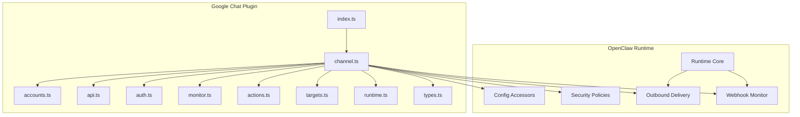
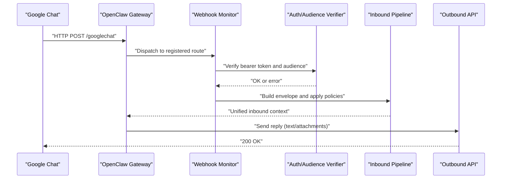
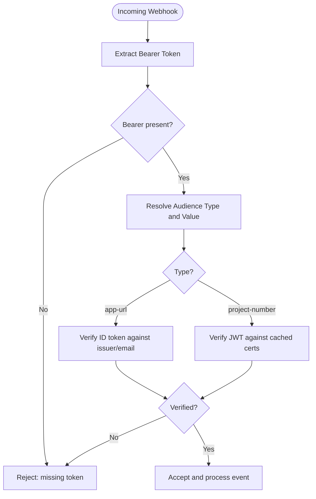
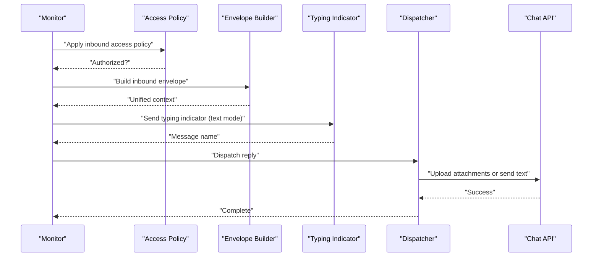
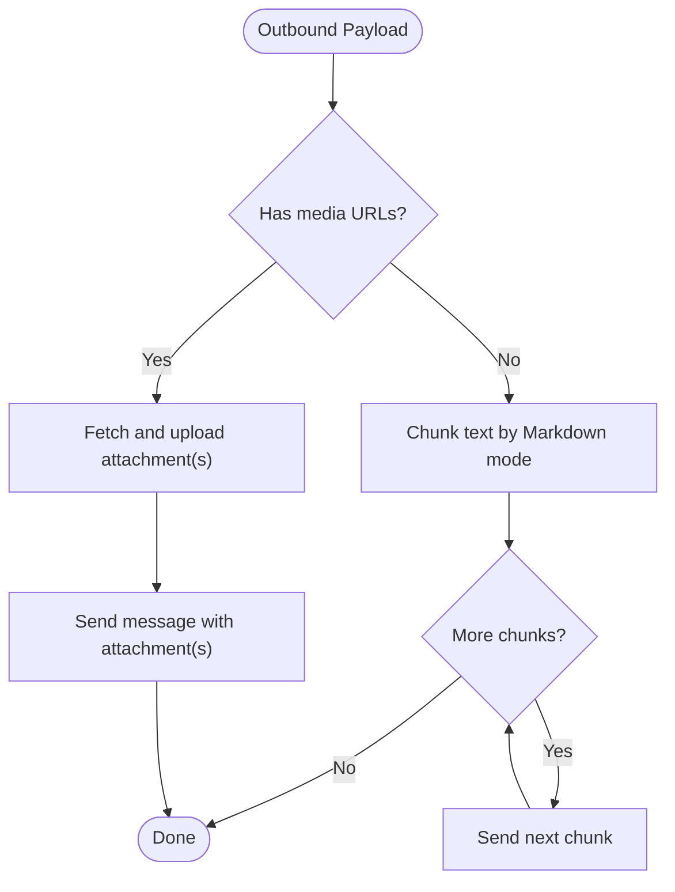
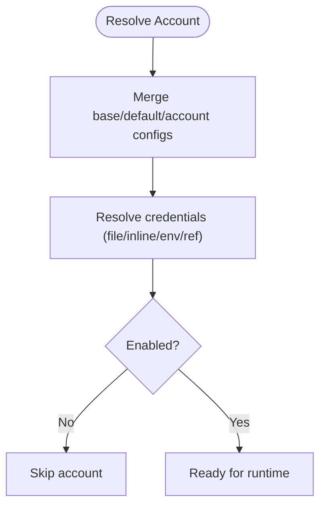
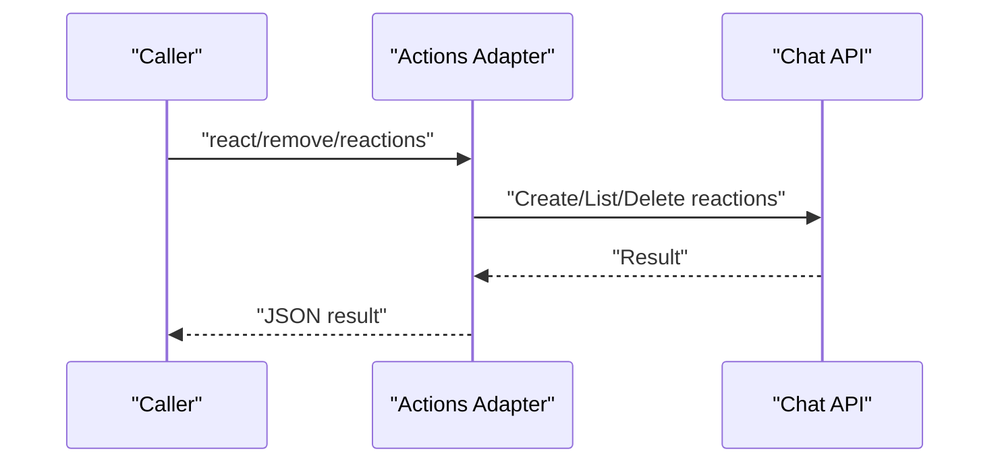
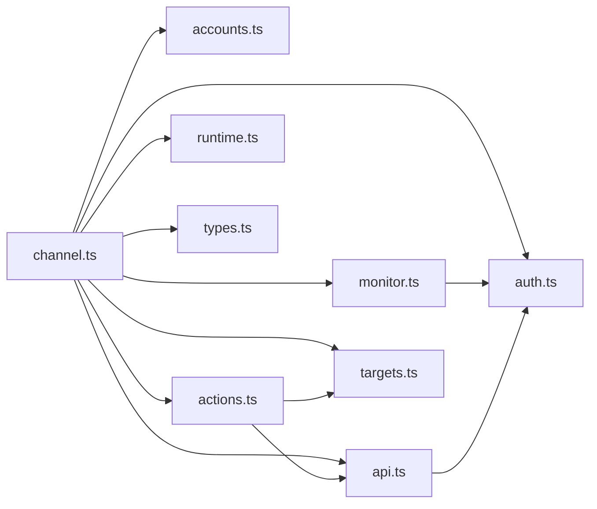

# Google Chat Channel

<cite>
**Referenced Files in This Document**
- [docs/channels/googlechat.md](file://docs/channels/googlechat.md)
- [extensions/googlechat/index.ts](file://extensions/googlechat/index.ts)
- [extensions/googlechat/src/channel.ts](file://extensions/googlechat/src/channel.ts)
- [extensions/googlechat/src/api.ts](file://extensions/googlechat/src/api.ts)
- [extensions/googlechat/src/auth.ts](file://extensions/googlechat/src/auth.ts)
- [extensions/googlechat/src/monitor.ts](file://extensions/googlechat/src/monitor.ts)
- [extensions/googlechat/src/accounts.ts](file://extensions/googlechat/src/accounts.ts)
- [extensions/googlechat/src/actions.ts](file://extensions/googlechat/src/actions.ts)
- [extensions/googlechat/src/targets.ts](file://extensions/googlechat/src/targets.ts)
- [extensions/googlechat/src/runtime.ts](file://extensions/googlechat/src/runtime.ts)
- [extensions/googlechat/src/types.ts](file://extensions/googlechat/src/types.ts)
</cite>

## Table of Contents
1. [Introduction](#introduction)
2. [Project Structure](#project-structure)
3. [Core Components](#core-components)
4. [Architecture Overview](#architecture-overview)
5. [Detailed Component Analysis](#detailed-component-analysis)
6. [Dependency Analysis](#dependency-analysis)
7. [Performance Considerations](#performance-considerations)
8. [Troubleshooting Guide](#troubleshooting-guide)
9. [Conclusion](#conclusion)
10. [Appendices](#appendices)

## Introduction
This document explains the Google Chat channel integration in OpenClaw. It covers the Google Chat API app implementation, HTTP webhook configuration, authentication methods, space and message handling, attachment processing, setup for Google Cloud projects and API enablement, webhook security, enterprise features, bot permissions, and compliance-related topics such as audience verification and media limits.

## Project Structure
The Google Chat channel is implemented as a plugin with a dedicated extension module. The plugin registers a channel with the OpenClaw runtime and exposes inbound/outbound capabilities, security policies, and configuration schemas. The implementation integrates with Google Chat’s HTTP webhook events and uses the Chat API for sending messages, uploading attachments, and managing reactions.

**Diagram sources**
- [extensions/googlechat/index.ts](file://extensions/googlechat/index.ts#L1-L18)
- [extensions/googlechat/src/channel.ts](file://extensions/googlechat/src/channel.ts#L1-L550)
- [extensions/googlechat/src/accounts.ts](file://extensions/googlechat/src/accounts.ts#L1-L156)
- [extensions/googlechat/src/api.ts](file://extensions/googlechat/src/api.ts#L1-L320)
- [extensions/googlechat/src/auth.ts](file://extensions/googlechat/src/auth.ts#L1-L138)
- [extensions/googlechat/src/monitor.ts](file://extensions/googlechat/src/monitor.ts#L1-L549)
- [extensions/googlechat/src/actions.ts](file://extensions/googlechat/src/actions.ts#L1-L174)
- [extensions/googlechat/src/targets.ts](file://extensions/googlechat/src/targets.ts#L1-L66)
- [extensions/googlechat/src/runtime.ts](file://extensions/googlechat/src/runtime.ts#L1-L7)
- [extensions/googlechat/src/types.ts](file://extensions/googlechat/src/types.ts#L1-L74)

**Section sources**
- [extensions/googlechat/index.ts](file://extensions/googlechat/index.ts#L1-L18)
- [extensions/googlechat/src/channel.ts](file://extensions/googlechat/src/channel.ts#L1-L550)

## Core Components
- Plugin registration and runtime wiring
  - The plugin exports an ID, name, description, and registers the channel and dock with the OpenClaw runtime.
  - See [extensions/googlechat/index.ts](file://extensions/googlechat/index.ts#L1-L18).

- Channel definition and capabilities
  - Defines chat types (direct, group, thread), reactions/media support, threading, outbound text chunking, and security policies.
  - See [extensions/googlechat/src/channel.ts](file://extensions/googlechat/src/channel.ts#L87-L171).

- Authentication and audience verification
  - Builds access tokens using Google Auth with service account credentials and verifies incoming webhook requests against configured audience (app URL or project number).
  - See [extensions/googlechat/src/auth.ts](file://extensions/googlechat/src/auth.ts#L64-L135).

- Webhook monitor and event processing
  - Registers a webhook route, validates bearer tokens, enforces access policies, downloads media, builds inbound envelopes, and dispatches replies.
  - See [extensions/googlechat/src/monitor.ts](file://extensions/googlechat/src/monitor.ts#L47-L110).

- Outbound messaging and attachments
  - Sends text messages and uploads attachments via multipart upload; manages typing indicators and reply threading.
  - See [extensions/googlechat/src/api.ts](file://extensions/googlechat/src/api.ts#L135-L189) and [extensions/googlechat/src/monitor.ts](file://extensions/googlechat/src/monitor.ts#L366-L475).

- Accounts and configuration
  - Resolves credentials from file, inline JSON, environment variables, or SecretRefs; merges account-level and default account settings.
  - See [extensions/googlechat/src/accounts.ts](file://extensions/googlechat/src/accounts.ts#L83-L149).

- Actions and reactions
  - Provides actions for sending messages and managing reactions; gates reactions based on configuration.
  - See [extensions/googlechat/src/actions.ts](file://extensions/googlechat/src/actions.ts#L53-L173).

- Target normalization and DM resolution
  - Normalizes user/space targets and resolves DM space names for outbound delivery.
  - See [extensions/googlechat/src/targets.ts](file://extensions/googlechat/src/targets.ts#L4-L65).

**Section sources**
- [extensions/googlechat/index.ts](file://extensions/googlechat/index.ts#L1-L18)
- [extensions/googlechat/src/channel.ts](file://extensions/googlechat/src/channel.ts#L87-L171)
- [extensions/googlechat/src/auth.ts](file://extensions/googlechat/src/auth.ts#L64-L135)
- [extensions/googlechat/src/monitor.ts](file://extensions/googlechat/src/monitor.ts#L47-L110)
- [extensions/googlechat/src/api.ts](file://extensions/googlechat/src/api.ts#L135-L189)
- [extensions/googlechat/src/accounts.ts](file://extensions/googlechat/src/accounts.ts#L83-L149)
- [extensions/googlechat/src/actions.ts](file://extensions/googlechat/src/actions.ts#L53-L173)
- [extensions/googlechat/src/targets.ts](file://extensions/googlechat/src/targets.ts#L4-L65)

## Architecture Overview
The Google Chat channel operates in webhook mode. Google Chat posts HTTP events to the gateway’s webhook path. The runtime verifies the request, applies access policies, converts inbound events into a unified context, and dispatches replies. Outbound delivery supports text, threaded replies, and attachments.

**Diagram sources**
- [extensions/googlechat/src/monitor.ts](file://extensions/googlechat/src/monitor.ts#L85-L110)
- [extensions/googlechat/src/auth.ts](file://extensions/googlechat/src/auth.ts#L93-L135)
- [extensions/googlechat/src/api.ts](file://extensions/googlechat/src/api.ts#L135-L189)

## Detailed Component Analysis

### Authentication and Audience Verification
- Access tokens
  - Uses Google Auth with the Chat Bot scope to obtain Bearer tokens for API calls.
  - See [extensions/googlechat/src/auth.ts](file://extensions/googlechat/src/auth.ts#L64-L75).

- Webhook audience verification
  - Supports two audience types:
    - App URL: verifies ID token against issuer patterns and email claims.
    - Project number: verifies JWT signature against cached certificates.
  - See [extensions/googlechat/src/auth.ts](file://extensions/googlechat/src/auth.ts#L93-L135).

- Certificates caching
  - Fetches and caches Chat API certificates to minimize repeated network calls.
  - See [extensions/googlechat/src/auth.ts](file://extensions/googlechat/src/auth.ts#L77-L89).

**Diagram sources**
- [extensions/googlechat/src/auth.ts](file://extensions/googlechat/src/auth.ts#L93-L135)

**Section sources**
- [extensions/googlechat/src/auth.ts](file://extensions/googlechat/src/auth.ts#L64-L135)

### Webhook Monitor and Event Processing
- Route registration
  - Registers an exact-match webhook route under the configured path with plugin-scoped auth.
  - See [extensions/googlechat/src/monitor.ts](file://extensions/googlechat/src/monitor.ts#L47-L68).

- Event filtering and preprocessing
  - Filters MESSAGE events, skips bot-authored messages unless allowed, normalizes sender identity, and extracts body and attachments.
  - See [extensions/googlechat/src/monitor.ts](file://extensions/googlechat/src/monitor.ts#L92-L110) and [extensions/googlechat/src/monitor.ts](file://extensions/googlechat/src/monitor.ts#L161-L171).

- Inbound pipeline
  - Applies access policy, builds session keys, constructs unified inbound context, records session metadata, and starts typing indicators.
  - See [extensions/googlechat/src/monitor.ts](file://extensions/googlechat/src/monitor.ts#L181-L273).

- Outbound delivery
  - Handles media-first replies by uploading attachments and sending captions; otherwise chunks and sends text replies; cleans up typing indicators.
  - See [extensions/googlechat/src/monitor.ts](file://extensions/googlechat/src/monitor.ts#L366-L475).

**Diagram sources**
- [extensions/googlechat/src/monitor.ts](file://extensions/googlechat/src/monitor.ts#L181-L273)
- [extensions/googlechat/src/monitor.ts](file://extensions/googlechat/src/monitor.ts#L366-L475)

**Section sources**
- [extensions/googlechat/src/monitor.ts](file://extensions/googlechat/src/monitor.ts#L47-L110)
- [extensions/googlechat/src/monitor.ts](file://extensions/googlechat/src/monitor.ts#L181-L273)
- [extensions/googlechat/src/monitor.ts](file://extensions/googlechat/src/monitor.ts#L366-L475)

### Outbound Messaging and Attachments
- Text messages
  - Sends messages to spaces or DMs; respects thread IDs for replies.
  - See [extensions/googlechat/src/api.ts](file://extensions/googlechat/src/api.ts#L135-L166).

- Attachments
  - Streams media, uploads via multipart upload, and attaches to messages.
  - See [extensions/googlechat/src/api.ts](file://extensions/googlechat/src/api.ts#L191-L239) and [extensions/googlechat/src/monitor.ts](file://extensions/googlechat/src/monitor.ts#L416-L444).

- Typing indicators
  - Emits a temporary typing message; falls back from reaction mode to message mode when user OAuth is unavailable.
  - See [extensions/googlechat/src/monitor.ts](file://extensions/googlechat/src/monitor.ts#L274-L283) and [extensions/googlechat/src/monitor.ts](file://extensions/googlechat/src/monitor.ts#L287-L304).

**Diagram sources**
- [extensions/googlechat/src/monitor.ts](file://extensions/googlechat/src/monitor.ts#L376-L475)
- [extensions/googlechat/src/api.ts](file://extensions/googlechat/src/api.ts#L191-L239)

**Section sources**
- [extensions/googlechat/src/api.ts](file://extensions/googlechat/src/api.ts#L135-L239)
- [extensions/googlechat/src/monitor.ts](file://extensions/googlechat/src/monitor.ts#L366-L475)

### Accounts and Configuration
- Credential resolution
  - Supports inline JSON, file path, environment variables, and SecretRefs; validates multi-account usage constraints.
  - See [extensions/googlechat/src/accounts.ts](file://extensions/googlechat/src/accounts.ts#L83-L127).

- Configuration merging
  - Merges default account and per-account settings; preserves overrides and shared defaults.
  - See [extensions/googlechat/src/accounts.ts](file://extensions/googlechat/src/accounts.ts#L38-L60).

- Setup and validation
  - Validates inputs for setup (e.g., requiring tokens or token files); applies patches for audience, webhook path/url.
  - See [extensions/googlechat/src/channel.ts](file://extensions/googlechat/src/channel.ts#L275-L331).

**Diagram sources**
- [extensions/googlechat/src/accounts.ts](file://extensions/googlechat/src/accounts.ts#L38-L60)
- [extensions/googlechat/src/accounts.ts](file://extensions/googlechat/src/accounts.ts#L83-L127)
- [extensions/googlechat/src/channel.ts](file://extensions/googlechat/src/channel.ts#L275-L331)

**Section sources**
- [extensions/googlechat/src/accounts.ts](file://extensions/googlechat/src/accounts.ts#L83-L149)
- [extensions/googlechat/src/channel.ts](file://extensions/googlechat/src/channel.ts#L275-L331)

### Actions and Reactions
- Action capability discovery
  - Exposes send, react, and reactions actions when enabled.
  - See [extensions/googlechat/src/actions.ts](file://extensions/googlechat/src/actions.ts#L53-L66).

- Reaction management
  - Creates, lists, and removes reactions; filters by app user identities when removing.
  - See [extensions/googlechat/src/actions.ts](file://extensions/googlechat/src/actions.ts#L126-L169) and [extensions/googlechat/src/api.ts](file://extensions/googlechat/src/api.ts#L251-L287).

**Diagram sources**
- [extensions/googlechat/src/actions.ts](file://extensions/googlechat/src/actions.ts#L126-L169)
- [extensions/googlechat/src/api.ts](file://extensions/googlechat/src/api.ts#L251-L287)

**Section sources**
- [extensions/googlechat/src/actions.ts](file://extensions/googlechat/src/actions.ts#L53-L173)
- [extensions/googlechat/src/api.ts](file://extensions/googlechat/src/api.ts#L251-L287)

### Targets and Space Resolution
- Target normalization
  - Removes prefixes and normalizes user/space IDs; lowercases emails.
  - See [extensions/googlechat/src/targets.ts](file://extensions/googlechat/src/targets.ts#L4-L24).

- DM resolution
  - Resolves user targets to DM space names via API lookup.
  - See [extensions/googlechat/src/targets.ts](file://extensions/googlechat/src/targets.ts#L54-L63).

**Section sources**
- [extensions/googlechat/src/targets.ts](file://extensions/googlechat/src/targets.ts#L4-L65)

### Runtime Integration
- Plugin runtime store
  - Stores and retrieves the Google Chat runtime for use across modules.
  - See [extensions/googlechat/src/runtime.ts](file://extensions/googlechat/src/runtime.ts#L4-L6).

**Section sources**
- [extensions/googlechat/src/runtime.ts](file://extensions/googlechat/src/runtime.ts#L4-L6)

## Dependency Analysis
- Internal dependencies
  - The channel module depends on accounts, API, auth, monitor, actions, targets, runtime, and types.
  - See [extensions/googlechat/src/channel.ts](file://extensions/googlechat/src/channel.ts#L1-L48).

- External dependencies
  - Google Auth library for access tokens and verification.
  - Node HTTP server for webhook routing.
  - See [extensions/googlechat/src/auth.ts](file://extensions/googlechat/src/auth.ts#L1-L14) and [extensions/googlechat/src/monitor.ts](file://extensions/googlechat/src/monitor.ts#L1-L28).

**Diagram sources**
- [extensions/googlechat/src/channel.ts](file://extensions/googlechat/src/channel.ts#L1-L48)
- [extensions/googlechat/src/monitor.ts](file://extensions/googlechat/src/monitor.ts#L1-L28)
- [extensions/googlechat/src/actions.ts](file://extensions/googlechat/src/actions.ts#L1-L24)
- [extensions/googlechat/src/api.ts](file://extensions/googlechat/src/api.ts#L1-L6)
- [extensions/googlechat/src/auth.ts](file://extensions/googlechat/src/auth.ts#L1-L14)
- [extensions/googlechat/src/accounts.ts](file://extensions/googlechat/src/accounts.ts#L1-L4)
- [extensions/googlechat/src/targets.ts](file://extensions/googlechat/src/targets.ts#L1-L3)
- [extensions/googlechat/src/runtime.ts](file://extensions/googlechat/src/runtime.ts#L1-L3)
- [extensions/googlechat/src/types.ts](file://extensions/googlechat/src/types.ts#L1-L3)

**Section sources**
- [extensions/googlechat/src/channel.ts](file://extensions/googlechat/src/channel.ts#L1-L48)
- [extensions/googlechat/src/monitor.ts](file://extensions/googlechat/src/monitor.ts#L1-L28)
- [extensions/googlechat/src/actions.ts](file://extensions/googlechat/src/actions.ts#L1-L24)
- [extensions/googlechat/src/api.ts](file://extensions/googlechat/src/api.ts#L1-L6)
- [extensions/googlechat/src/auth.ts](file://extensions/googlechat/src/auth.ts#L1-L14)
- [extensions/googlechat/src/accounts.ts](file://extensions/googlechat/src/accounts.ts#L1-L4)
- [extensions/googlechat/src/targets.ts](file://extensions/googlechat/src/targets.ts#L1-L3)
- [extensions/googlechat/src/runtime.ts](file://extensions/googlechat/src/runtime.ts#L1-L3)
- [extensions/googlechat/src/types.ts](file://extensions/googlechat/src/types.ts#L1-L3)

## Performance Considerations
- Media handling
  - Enforces a configurable maximum size for inbound and outbound media to avoid excessive memory usage.
  - See [extensions/googlechat/src/monitor.ts](file://extensions/googlechat/src/monitor.ts#L344-L364) and [extensions/googlechat/src/monitor.ts](file://extensions/googlechat/src/monitor.ts#L416-L426).

- Chunking and coalescing
  - Uses Markdown-aware chunking with a default coalesce threshold to balance latency and throughput.
  - See [extensions/googlechat/src/channel.ts](file://extensions/googlechat/src/channel.ts#L155-L157).

- Request concurrency
  - Limits concurrent webhook processing to prevent overload during bursts.
  - See [extensions/googlechat/src/monitor.ts](file://extensions/googlechat/src/monitor.ts#L32-L33).

[No sources needed since this section provides general guidance]

## Troubleshooting Guide
- 405 Method Not Allowed
  - Indicates the webhook handler is not registered. Verify channel configuration and plugin enablement, then restart the gateway.
  - See [docs/channels/googlechat.md](file://docs/channels/googlechat.md#L211-L248).

- Missing audience configuration
  - Probe the channel status to detect missing audienceType or audience.
  - See [docs/channels/googlechat.md](file://docs/channels/googlechat.md#L252).

- Mention gating blocking replies
  - Set botUser to the app’s user resource name and ensure requireMention is configured appropriately.
  - See [docs/channels/googlechat.md](file://docs/channels/googlechat.md#L254).

- Logs and probes
  - Use logs and status checks to diagnose connectivity and auth issues.
  - See [docs/channels/googlechat.md](file://docs/channels/googlechat.md#L250-L256).

**Section sources**
- [docs/channels/googlechat.md](file://docs/channels/googlechat.md#L211-L256)

## Conclusion
The Google Chat channel integrates tightly with OpenClaw’s runtime to provide secure, policy-driven messaging over HTTP webhooks. It supports direct messages, group spaces, threaded replies, media attachments, and reactions, with robust authentication and audience verification. Proper Google Cloud setup, webhook exposure, and configuration ensure reliable operation in enterprise environments.

[No sources needed since this section summarizes without analyzing specific files]

## Appendices

### Setup Procedures and Security
- Google Cloud project and API enablement
  - Enable the Google Chat API and create a service account with JSON key.
  - See [docs/channels/googlechat.md](file://docs/channels/googlechat.md#L14-L27).

- Webhook URL and visibility
  - Configure the Chat app to use your gateway’s public HTTPS endpoint and set visibility to your domain.
  - See [docs/channels/googlechat.md](file://docs/channels/googlechat.md#L28-L45).

- Public URL exposure
  - Recommended approaches: Tailscale Funnel for the webhook path only, reverse proxy, or Cloudflare Tunnel.
  - See [docs/channels/googlechat.md](file://docs/channels/googlechat.md#L64-L138).

- Webhook audience configuration
  - Set audienceType and audience to match your Chat app configuration.
  - See [docs/channels/googlechat.md](file://docs/channels/googlechat.md#L46-L49).

**Section sources**
- [docs/channels/googlechat.md](file://docs/channels/googlechat.md#L14-L49)
- [docs/channels/googlechat.md](file://docs/channels/googlechat.md#L64-L138)

### Enterprise Features, Permissions, and Compliance
- Bot permissions
  - Uses the Chat Bot scope for API access; supports allowing bots or excluding app-authored messages.
  - See [extensions/googlechat/src/auth.ts](file://extensions/googlechat/src/auth.ts#L4-L6) and [extensions/googlechat/src/monitor.ts](file://extensions/googlechat/src/monitor.ts#L161-L171).

- Compliance and data handling
  - Media size limits and certificate caching reduce risk; typing indicator behavior is constrained by available auth modes.
  - See [extensions/googlechat/src/monitor.ts](file://extensions/googlechat/src/monitor.ts#L274-L283) and [extensions/googlechat/src/auth.ts](file://extensions/googlechat/src/auth.ts#L77-L89).

**Section sources**
- [extensions/googlechat/src/auth.ts](file://extensions/googlechat/src/auth.ts#L4-L6)
- [extensions/googlechat/src/auth.ts](file://extensions/googlechat/src/auth.ts#L77-L89)
- [extensions/googlechat/src/monitor.ts](file://extensions/googlechat/src/monitor.ts#L274-L283)