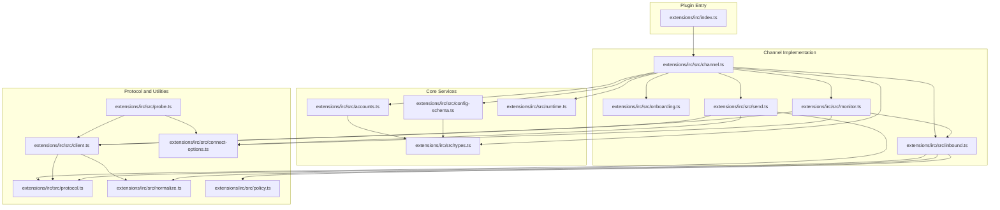
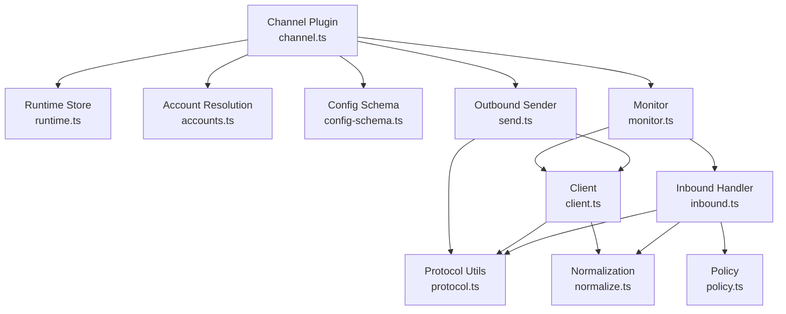
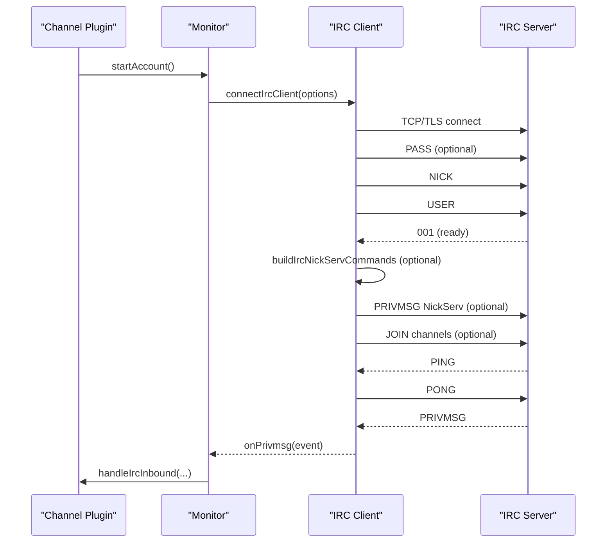
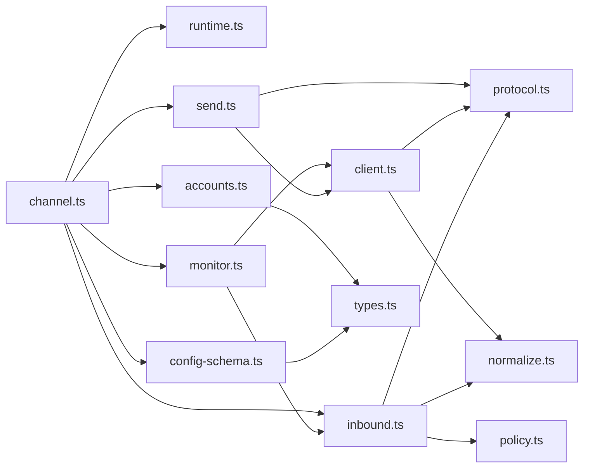

# IRC Channel

<cite>
**Referenced Files in This Document**
- [index.ts](file://extensions/irc/index.ts)
- [channel.ts](file://extensions/irc/src/channel.ts)
- [client.ts](file://extensions/irc/src/client.ts)
- [runtime.ts](file://extensions/irc/src/runtime.ts)
- [config-schema.ts](file://extensions/irc/src/config-schema.ts)
- [types.ts](file://extensions/irc/src/types.ts)
- [accounts.ts](file://extensions/irc/src/accounts.ts)
- [send.ts](file://extensions/irc/src/send.ts)
- [protocol.ts](file://extensions/irc/src/protocol.ts)
- [normalize.ts](file://extensions/irc/src/normalize.ts)
- [policy.ts](file://extensions/irc/src/policy.ts)
- [monitor.ts](file://extensions/irc/src/monitor.ts)
- [connect-options.ts](file://extensions/irc/src/connect-options.ts)
- [probe.ts](file://extensions/irc/src/probe.ts)
- [inbound.ts](file://extensions/irc/src/inbound.ts)
- [onboarding.ts](file://extensions/irc/src/onboarding.ts)
</cite>

## Table of Contents
1. [Introduction](#introduction)
2. [Project Structure](#project-structure)
3. [Core Components](#core-components)
4. [Architecture Overview](#architecture-overview)
5. [Detailed Component Analysis](#detailed-component-analysis)
6. [Dependency Analysis](#dependency-analysis)
7. [Performance Considerations](#performance-considerations)
8. [Troubleshooting Guide](#troubleshooting-guide)
9. [Conclusion](#conclusion)
10. [Appendices](#appendices)

## Introduction
This document explains the IRC channel integration in OpenClaw. It covers how the plugin registers with the platform, establishes server connections, joins channels, authenticates users, and routes inbound/outbound messages. It also documents configuration for SSL/TLS, optional NickServ authentication, and bot registration flows. Additional topics include message formatting, nickname handling, channel modes, allowlisting policies, mention gating, and operational safeguards such as probing and monitoring.

## Project Structure
The IRC channel is implemented as a plugin under extensions/irc. The plugin entry wires runtime and registers the channel implementation. The core logic spans client connection, configuration resolution, normalization, policy enforcement, inbound handling, outbound sending, and monitoring.

**Diagram sources**
- [index.ts](file://extensions/irc/index.ts#L1-L18)
- [channel.ts](file://extensions/irc/src/channel.ts#L1-L375)
- [onboarding.ts](file://extensions/irc/src/onboarding.ts#L1-L465)
- [monitor.ts](file://extensions/irc/src/monitor.ts#L1-L147)
- [send.ts](file://extensions/irc/src/send.ts#L1-L90)
- [inbound.ts](file://extensions/irc/src/inbound.ts#L1-L368)
- [accounts.ts](file://extensions/irc/src/accounts.ts#L1-L261)
- [config-schema.ts](file://extensions/irc/src/config-schema.ts#L1-L93)
- [types.ts](file://extensions/irc/src/types.ts#L1-L101)
- [runtime.ts](file://extensions/irc/src/runtime.ts#L1-L7)
- [client.ts](file://extensions/irc/src/client.ts#L1-L440)
- [connect-options.ts](file://extensions/irc/src/connect-options.ts#L1-L31)
- [probe.ts](file://extensions/irc/src/probe.ts#L1-L54)
- [protocol.ts](file://extensions/irc/src/protocol.ts#L1-L170)
- [normalize.ts](file://extensions/irc/src/normalize.ts#L1-L124)
- [policy.ts](file://extensions/irc/src/policy.ts#L1-L167)

**Section sources**
- [index.ts](file://extensions/irc/index.ts#L1-L18)
- [channel.ts](file://extensions/irc/src/channel.ts#L1-L375)

## Core Components
- Plugin registration and runtime wiring
  - The plugin registers itself and sets the IRC runtime store for shared utilities.
  - See [index.ts](file://extensions/irc/index.ts#L1-L18).

- Channel plugin definition
  - Provides metadata, onboarding adapter, pairing support, capabilities, configuration schema, security warnings, group policy, messaging target normalization, resolver, directory listing, outbound delivery, and status/probe.
  - See [channel.ts](file://extensions/irc/src/channel.ts#L61-L375).

- Configuration schema and types
  - Defines account-level and top-level configuration shapes, including host/port/tls, nick/username/realname, password/passwordFile, NickServ options, DM/group policies, allowlists, groups, channels, markdown, reply behavior, and streaming/blocking preferences.
  - See [config-schema.ts](file://extensions/irc/src/config-schema.ts#L1-L93) and [types.ts](file://extensions/irc/src/types.ts#L13-L78).

- Account resolution and environment integration
  - Merges base and per-account settings, resolves defaults from environment variables, normalizes lists, and handles password/NickServ sources.
  - See [accounts.ts](file://extensions/irc/src/accounts.ts#L74-L254).

- Client connection and protocol
  - Implements TCP/TLS socket handling, PING/PONG, NICK collision recovery, PASS/USER/NICK handshake, JOIN for configured channels, PRIVMSG chunking, sanitization, and error handling.
  - See [client.ts](file://extensions/irc/src/client.ts#L116-L440).

- Message formatting and normalization
  - Normalizes targets, detects channel vs user targets, builds allowlist candidates, and sanitizes outbound text and targets.
  - See [normalize.ts](file://extensions/irc/src/normalize.ts#L10-L124) and [protocol.ts](file://extensions/irc/src/protocol.ts#L120-L170).

- Policy and gating
  - Resolves group matches (including wildcards), access gates, mention requirements, and sender allowlists for both DMs and group chats.
  - See [policy.ts](file://extensions/irc/src/policy.ts#L17-L167).

- Monitoring and probing
  - Connects to IRC, logs verbose lines/notices, tracks activity, and invokes inbound handler; probes connectivity and latency.
  - See [monitor.ts](file://extensions/irc/src/monitor.ts#L34-L147) and [probe.ts](file://extensions/irc/src/probe.ts#L13-L54).

- Outbound sending
  - Prepares markdown tables, optionally attaches reply metadata, connects transiently if needed, and records activity.
  - See [send.ts](file://extensions/irc/src/send.ts#L35-L90).

- Onboarding
  - Guides users through host/port/TLS/nick/username/realname, channels, DM policy and allowlist, group policy and entries, mention gating, and optional NickServ registration.
  - See [onboarding.ts](file://extensions/irc/src/onboarding.ts#L276-L465).

**Section sources**
- [index.ts](file://extensions/irc/index.ts#L1-L18)
- [channel.ts](file://extensions/irc/src/channel.ts#L61-L375)
- [config-schema.ts](file://extensions/irc/src/config-schema.ts#L1-L93)
- [types.ts](file://extensions/irc/src/types.ts#L13-L78)
- [accounts.ts](file://extensions/irc/src/accounts.ts#L74-L254)
- [client.ts](file://extensions/irc/src/client.ts#L116-L440)
- [normalize.ts](file://extensions/irc/src/normalize.ts#L10-L124)
- [protocol.ts](file://extensions/irc/src/protocol.ts#L120-L170)
- [policy.ts](file://extensions/irc/src/policy.ts#L17-L167)
- [monitor.ts](file://extensions/irc/src/monitor.ts#L34-L147)
- [probe.ts](file://extensions/irc/src/probe.ts#L13-L54)
- [send.ts](file://extensions/irc/src/send.ts#L35-L90)
- [onboarding.ts](file://extensions/irc/src/onboarding.ts#L276-L465)

## Architecture Overview
The IRC channel integrates with the OpenClaw runtime via a plugin contract. The plugin exposes a ChannelPlugin interface that defines capabilities, configuration, security, messaging, resolver, directory, outbound delivery, and status/probe. Internally, it uses:
- Runtime store for shared utilities
- Account resolution for configuration and environment
- Client to manage the IRC connection lifecycle
- Protocol utilities for parsing and sanitization
- Policy and normalization for allowlists and gating
- Monitor to keep the connection alive and handle inbound events
- Onboarding to guide configuration

**Diagram sources**
- [runtime.ts](file://extensions/irc/src/runtime.ts#L1-L7)
- [accounts.ts](file://extensions/irc/src/accounts.ts#L74-L254)
- [config-schema.ts](file://extensions/irc/src/config-schema.ts#L1-L93)
- [channel.ts](file://extensions/irc/src/channel.ts#L61-L375)
- [monitor.ts](file://extensions/irc/src/monitor.ts#L34-L147)
- [client.ts](file://extensions/irc/src/client.ts#L116-L440)
- [protocol.ts](file://extensions/irc/src/protocol.ts#L120-L170)
- [normalize.ts](file://extensions/irc/src/normalize.ts#L10-L124)
- [policy.ts](file://extensions/irc/src/policy.ts#L17-L167)
- [inbound.ts](file://extensions/irc/src/inbound.ts#L83-L368)
- [send.ts](file://extensions/irc/src/send.ts#L35-L90)

## Detailed Component Analysis

### Plugin Registration and Runtime
- Registers the IRC plugin ID, name, description, and config schema.
- Sets the IRC runtime store so downstream modules can access shared utilities.
- Registers the ChannelPlugin implementation.

**Section sources**
- [index.ts](file://extensions/irc/index.ts#L6-L15)
- [runtime.ts](file://extensions/irc/src/runtime.ts#L4-L7)
- [channel.ts](file://extensions/irc/src/channel.ts#L61-L85)

### Channel Plugin Definition
- Metadata and capabilities:
  - Supports direct and group chat, media, and blocks streaming.
  - Reload triggers on channels.irc prefix.
- Security:
  - Builds DM security policy scoped to the account.
  - Collects warnings for TLS disabled, NickServ register enabled without password, and missing TLS.
- Groups:
  - Resolves requireMention and tool policies per group or wildcard.
- Messaging:
  - Normalizes targets and provides resolver hints.
- Directory:
  - Lists peers and groups from allowlists and configured channels/groups.
- Outbound:
  - Sends text and media with markdown chunking and reply metadata.
- Status and Probe:
  - Builds summaries and snapshots, probes connectivity and latency.

**Section sources**
- [channel.ts](file://extensions/irc/src/channel.ts#L61-L375)

### Configuration Schema and Types
- Account-level schema supports:
  - Host, port, TLS, nick, username, realname, password/passwordFile
  - NickServ options (service, password/passwordFile, register, registerEmail)
  - DM policy and allowFrom, group policy and groupAllowFrom
  - Groups with requireMention, tools, skills, and allowFrom
  - Channels, mention patterns, markdown, reply behavior, streaming/blocking, and media limits
- Top-level schema extends with accounts and defaultAccount and enforces open DM policy constraints.

**Section sources**
- [config-schema.ts](file://extensions/irc/src/config-schema.ts#L45-L93)
- [types.ts](file://extensions/irc/src/types.ts#L32-L78)

### Account Resolution and Environment Integration
- Merges base and per-account configuration.
- Resolves defaults from environment variables (e.g., IRC_HOST, IRC_PORT, IRC_TLS, IRC_NICK, IRC_USERNAME, IRC_REALNAME, IRC_PASSWORD, IRC_CHANNELS, IRC_NICKSERV_PASSWORD, IRC_NICKSERV_REGISTER_EMAIL).
- Normalizes lists and passwords, and merges NickServ settings.
- Ensures host and nick are present for basic configuration.

**Section sources**
- [accounts.ts](file://extensions/irc/src/accounts.ts#L74-L254)

### Client Connection and Protocol
- Establishes TCP or TLS connection based on TLS flag.
- Performs handshake: PASS (if provided), NICK, USER.
- Handles PING with PONG, NICK collisions via GHOST and fallback nick, and ERRORS.
- After 001, optionally sends NickServ commands and joins configured channels.
- Parses PRIVMSG lines, extracts prefix and target, and forwards to handlers.
- Sanitizes outbound text and targets, and chunks PRIVMSG payloads.

**Diagram sources**
- [monitor.ts](file://extensions/irc/src/monitor.ts#L62-L134)
- [client.ts](file://extensions/irc/src/client.ts#L116-L440)

**Section sources**
- [client.ts](file://extensions/irc/src/client.ts#L116-L440)
- [protocol.ts](file://extensions/irc/src/protocol.ts#L21-L77)

### Message Formatting, Targets, and Nicknames
- Target normalization:
  - Accepts irc:, channel:, and user: prefixes; ensures channel targets start with # or &.
- Allowlist normalization:
  - Normalizes entries to lowercase and strips prefixes for matching.
- Nickname handling:
  - Attempts GHOST recovery on collision, falls back to appending underscore to base nick.
  - Builds sanitized fallback nick if needed.
- Text sanitization:
  - Strips control characters, collapses newlines, and trims for outbound messages.

**Section sources**
- [normalize.ts](file://extensions/irc/src/normalize.ts#L10-L58)
- [client.ts](file://extensions/irc/src/client.ts#L172-L201)
- [protocol.ts](file://extensions/irc/src/protocol.ts#L120-L141)

### Channel Modes and Group Management
- Channel targets are recognized by leading # or &.
- Group policy:
  - Disabled, allowlist, or open modes with explicit per-group and wildcard configurations.
  - Require mention defaults to true unless overridden per group or wildcard.
- Allowlists:
  - Supports per-group and wildcard allowlists; sender qualification considers nick, user, and host.
- Mention gating:
  - Detects explicit mentions and configured mention patterns; blocks unmentioned replies in group contexts unless authorized.

**Section sources**
- [normalize.ts](file://extensions/irc/src/normalize.ts#L6-L8)
- [policy.ts](file://extensions/irc/src/policy.ts#L17-L115)
- [inbound.ts](file://extensions/irc/src/inbound.ts#L248-L275)

### Authentication Methods
- Password authentication:
  - Uses PASS during handshake when configured.
- NickServ authentication:
  - Optional IDENTIFY command sent after 001.
  - Optional REGISTER command with email when requested.
  - Requires registerEmail when register is enabled.
- Environment-backed secrets:
  - Supports IRC_PASSWORD, IRC_NICKSERV_PASSWORD, and IRC_NICKSERV_REGISTER_EMAIL for default account.

**Section sources**
- [client.ts](file://extensions/irc/src/client.ts#L96-L114)
- [accounts.ts](file://extensions/irc/src/accounts.ts#L94-L155)
- [config-schema.ts](file://extensions/irc/src/config-schema.ts#L25-L43)

### SSL/TLS Configuration
- TLS flag controls whether to connect via TLS or plaintext.
- Default port is 6697 when TLS is enabled, otherwise 6667.
- Environment variable IRC_TLS can override per default account.

**Section sources**
- [accounts.ts](file://extensions/irc/src/accounts.ts#L169-L178)
- [config-schema.ts](file://extensions/irc/src/config-schema.ts#L52-L52)

### Bot Registration and NickServ Registration
- Optional NickServ registration:
  - When enabled, sends REGISTER with password and email on connect.
  - Emits warning if enabled without a resolved password.
- GHOST recovery:
  - Attempts to reclaim nick on collision using NickServ GHOST and fallback nick generation.

**Section sources**
- [client.ts](file://extensions/irc/src/client.ts#L96-L114)
- [client.ts](file://extensions/irc/src/client.ts#L172-L201)
- [channel.ts](file://extensions/irc/src/channel.ts#L165-L174)

### Network-Specific Considerations
- Port selection:
  - Defaults to 6697 for TLS, 6667 for plaintext.
- Auto-join channels:
  - Optional list of channels to join after login.
- Environment-driven configuration:
  - Supports IRC_HOST, IRC_PORT, IRC_TLS, IRC_NICK, IRC_USERNAME, IRC_REALNAME, IRC_PASSWORD, IRC_CHANNELS, IRC_NICKSERV_PASSWORD, IRC_NICKSERV_REGISTER_EMAIL.

**Section sources**
- [accounts.ts](file://extensions/irc/src/accounts.ts#L176-L180)
- [onboarding.ts](file://extensions/irc/src/onboarding.ts#L339-L404)

### Flood Protection and Rate Control
- No explicit flood control or rate limiting is implemented in the client.
- Message chunking occurs at the protocol level to respect maximum line lengths.
- Consider adding throttling or backoff in production deployments if encountering rate limits from networks.

**Section sources**
- [client.ts](file://extensions/irc/src/client.ts#L211-L233)
- [protocol.ts](file://extensions/irc/src/protocol.ts#L143-L165)

### Operational Safeguards
- Probing:
  - Attempts connection with a timeout and records latency.
- Monitoring:
  - Maintains persistent connection, logs verbose lines/notices, and tracks activity.
- Pairing:
  - Notifies pairing approval to normalized IRC user identifiers.

**Section sources**
- [probe.ts](file://extensions/irc/src/probe.ts#L13-L54)
- [monitor.ts](file://extensions/irc/src/monitor.ts#L34-L147)
- [channel.ts](file://extensions/irc/src/channel.ts#L68-L78)

## Dependency Analysis
The IRC plugin composes several modules with clear boundaries:
- Channel plugin depends on runtime, accounts, config schema, monitor, send, and inbound.
- Monitor depends on client and inbound.
- Send depends on client and protocol utilities.
- Client depends on protocol and normalization utilities.
- Inbound depends on policy, normalization, and protocol utilities.
- Accounts and config schema define the configuration contract.

**Diagram sources**
- [channel.ts](file://extensions/irc/src/channel.ts#L1-L375)
- [monitor.ts](file://extensions/irc/src/monitor.ts#L1-L147)
- [send.ts](file://extensions/irc/src/send.ts#L1-L90)
- [client.ts](file://extensions/irc/src/client.ts#L1-L440)
- [protocol.ts](file://extensions/irc/src/protocol.ts#L1-L170)
- [normalize.ts](file://extensions/irc/src/normalize.ts#L1-L124)
- [policy.ts](file://extensions/irc/src/policy.ts#L1-L167)
- [accounts.ts](file://extensions/irc/src/accounts.ts#L1-L261)
- [config-schema.ts](file://extensions/irc/src/config-schema.ts#L1-L93)
- [types.ts](file://extensions/irc/src/types.ts#L1-L101)

**Section sources**
- [channel.ts](file://extensions/irc/src/channel.ts#L1-L375)
- [monitor.ts](file://extensions/irc/src/monitor.ts#L1-L147)
- [send.ts](file://extensions/irc/src/send.ts#L1-L90)
- [client.ts](file://extensions/irc/src/client.ts#L1-L440)
- [protocol.ts](file://extensions/irc/src/protocol.ts#L1-L170)
- [normalize.ts](file://extensions/irc/src/normalize.ts#L1-L124)
- [policy.ts](file://extensions/irc/src/policy.ts#L1-L167)
- [accounts.ts](file://extensions/irc/src/accounts.ts#L1-L261)
- [config-schema.ts](file://extensions/irc/src/config-schema.ts#L1-L93)
- [types.ts](file://extensions/irc/src/types.ts#L1-L101)

## Performance Considerations
- Message chunking:
  - PRIVMSG payloads are split at word boundaries respecting a configurable maximum length to avoid truncation mid-word.
- Streaming/blocking:
  - Block streaming can be toggled per account to reduce long-form output fragmentation.
- Latency measurement:
  - Probes record connection latency to aid tuning of timeouts and retries.

**Section sources**
- [client.ts](file://extensions/irc/src/client.ts#L211-L233)
- [protocol.ts](file://extensions/irc/src/protocol.ts#L143-L165)
- [probe.ts](file://extensions/irc/src/probe.ts#L33-L47)

## Troubleshooting Guide
Common issues and remedies:
- Missing host or nick:
  - Ensure host and nick are configured; otherwise startup and probing will fail.
- Login failures:
  - Check password, NickServ credentials, and network restrictions.
- Nick collisions:
  - Enable NickServ GHOST recovery or rely on fallback nick generation.
- TLS/plain text mismatch:
  - Verify TLS flag and port; default ports differ for TLS vs plaintext.
- Unmentioned replies blocked:
  - Configure requireMention=false for specific groups or wildcard to allow unmentioned replies.
- Open DM policy without allowFrom:
  - When dmPolicy=open, allowFrom must include wildcard entry; otherwise warnings are emitted.

Operational checks:
- Use probing to measure connectivity and latency.
- Enable verbose logging in monitor to inspect raw lines and notices.
- Validate configuration via status and onboarding prompts.

**Section sources**
- [channel.ts](file://extensions/irc/src/channel.ts#L160-L176)
- [client.ts](file://extensions/irc/src/client.ts#L314-L320)
- [client.ts](file://extensions/irc/src/client.ts#L172-L201)
- [probe.ts](file://extensions/irc/src/probe.ts#L13-L54)
- [monitor.ts](file://extensions/irc/src/monitor.ts#L66-L78)
- [onboarding.ts](file://extensions/irc/src/onboarding.ts#L137-L150)

## Conclusion
The IRC channel integration provides a robust, configurable, and secure pathway to connect OpenClaw to IRC networks. It supports TLS, optional NickServ authentication, flexible allowlists and group policies, mention gating, and resilient monitoring. Administrators can tailor behavior via configuration and environment variables, and the onboarding flow streamlines initial setup.

## Appendices

### Configuration Reference Highlights
- Host, port, TLS, nick, username, realname, password/passwordFile
- NickServ: service, password/passwordFile, register, registerEmail
- DM policy and allowFrom, group policy and groupAllowFrom
- Groups: requireMention, tools, skills, allowFrom
- Channels, mention patterns, markdown, reply behavior, streaming/blocking, media limits

**Section sources**
- [config-schema.ts](file://extensions/irc/src/config-schema.ts#L45-L93)
- [types.ts](file://extensions/irc/src/types.ts#L32-L78)