# LINE Channel

<cite>
**Referenced Files in This Document**
- [docs/channels/line.md](file://docs/channels/line.md)
- [src/line/webhook.ts](file://src/line/webhook.ts)
- [src/line/bot.ts](file://src/line/bot.ts)
- [src/line/signature.ts](file://src/line/signature.ts)
- [src/line/monitor.ts](file://src/line/monitor.ts)
- [src/line/bot-handlers.ts](file://src/line/bot-handlers.ts)
- [src/line/bot-message-context.ts](file://src/line/bot-message-context.ts)
- [src/line/send.ts](file://src/line/send.ts)
- [src/line/rich-menu.ts](file://src/line/rich-menu.ts)
- [src/line/actions.ts](file://src/line/actions.ts)
- [src/line/template-messages.ts](file://src/line/template-messages.ts)
- [src/line/flex-templates.ts](file://src/line/flex-templates.ts)
- [src/line/types.ts](file://src/line/types.ts)
- [src/line/config-schema.ts](file://src/line/config-schema.ts)
- [extensions/line/src/channel.ts](file://extensions/line/src/channel.ts)
</cite>

## Table of Contents
1. [Introduction](#introduction)
2. [Project Structure](#project-structure)
3. [Core Components](#core-components)
4. [Architecture Overview](#architecture-overview)
5. [Detailed Component Analysis](#detailed-component-analysis)
6. [Dependency Analysis](#dependency-analysis)
7. [Performance Considerations](#performance-considerations)
8. [Troubleshooting Guide](#troubleshooting-guide)
9. [Conclusion](#conclusion)
10. [Appendices](#appendices)

## Introduction
This document explains how to integrate OpenClaw with the LINE Messaging API. It covers bot API setup, webhook configuration, inbound/outbound message handling, rich message features (Flex, Template, Quick Replies, Locations), rich menu creation, media support, security (signature verification), and operational guidance. It also documents configuration options, access control policies, and operational notes for multi-account deployments.

## Project Structure
The LINE integration spans two primary areas:
- Core runtime and channel logic under src/line
- Plugin wrapper and CLI integration under extensions/line

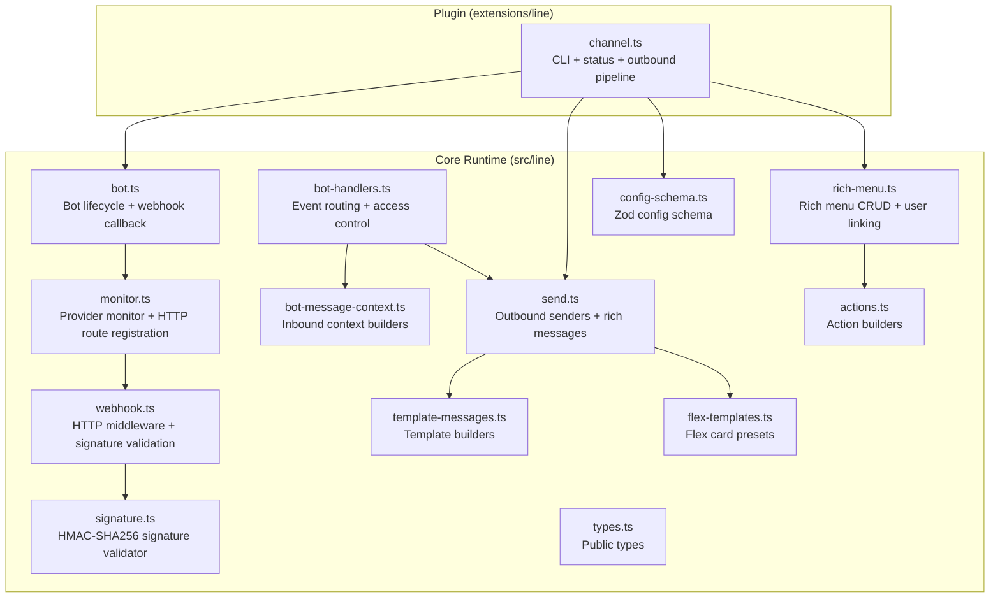

**Diagram sources**
- [src/line/webhook.ts](file://src/line/webhook.ts#L1-L117)
- [src/line/signature.ts](file://src/line/signature.ts#L1-L19)
- [src/line/bot.ts](file://src/line/bot.ts#L1-L84)
- [src/line/monitor.ts](file://src/line/monitor.ts#L1-L336)
- [src/line/bot-handlers.ts](file://src/line/bot-handlers.ts#L1-L715)
- [src/line/bot-message-context.ts](file://src/line/bot-message-context.ts#L1-L520)
- [src/line/send.ts](file://src/line/send.ts#L1-L475)
- [src/line/rich-menu.ts](file://src/line/rich-menu.ts#L1-L394)
- [src/line/template-messages.ts](file://src/line/template-messages.ts#L1-L356)
- [src/line/flex-templates.ts](file://src/line/flex-templates.ts#L1-L34)
- [src/line/actions.ts](file://src/line/actions.ts#L1-L62)
- [src/line/types.ts](file://src/line/types.ts#L1-L144)
- [src/line/config-schema.ts](file://src/line/config-schema.ts#L1-L43)
- [extensions/line/src/channel.ts](file://extensions/line/src/channel.ts#L1-L772)

**Section sources**
- [src/line/webhook.ts](file://src/line/webhook.ts#L1-L117)
- [src/line/bot.ts](file://src/line/bot.ts#L1-L84)
- [src/line/monitor.ts](file://src/line/monitor.ts#L1-L336)
- [extensions/line/src/channel.ts](file://extensions/line/src/channel.ts#L1-L772)

## Core Components
- Webhook middleware and signature validation: Validates LINE signatures using HMAC-SHA256 and handles verification requests.
- Bot lifecycle: Creates a LINE bot instance bound to a channel access token and channel secret; exposes a webhook callback.
- Provider monitor: Registers HTTP routes, manages runtime state, and orchestrates inbound/outbound flows.
- Event handlers: Routes inbound events (messages, postbacks, joins/leaves), enforces access control, and builds contexts for downstream processing.
- Inbound context builders: Normalize LINE events into unified inbound payloads with session and history context.
- Outbound senders: Reply, push, rich messages (Flex, Template, Quick Replies, Location), media, and loading animations.
- Rich menu manager: Create, upload images, link/unlink to users, and manage aliases.
- Template and Flex builders: High-level helpers to construct LINE Template and Flex messages.
- Types and config schema: Public types and Zod-based configuration schema for LINE accounts.

**Section sources**
- [src/line/webhook.ts](file://src/line/webhook.ts#L34-L116)
- [src/line/signature.ts](file://src/line/signature.ts#L3-L18)
- [src/line/bot.ts](file://src/line/bot.ts#L29-L83)
- [src/line/monitor.ts](file://src/line/monitor.ts#L120-L335)
- [src/line/bot-handlers.ts](file://src/line/bot-handlers.ts#L484-L714)
- [src/line/bot-message-context.ts](file://src/line/bot-message-context.ts#L368-L519)
- [src/line/send.ts](file://src/line/send.ts#L215-L475)
- [src/line/rich-menu.ts](file://src/line/rich-menu.ts#L82-L334)
- [src/line/template-messages.ts](file://src/line/template-messages.ts#L40-L356)
- [src/line/flex-templates.ts](file://src/line/flex-templates.ts#L1-L34)
- [src/line/types.ts](file://src/line/types.ts#L14-L144)
- [src/line/config-schema.ts](file://src/line/config-schema.ts#L6-L43)

## Architecture Overview
The LINE integration follows a webhook-first architecture:
- LINE pushes events to the gateway via HTTPS.
- The gateway validates signatures and routes events to the LINE provider monitor.
- The monitor creates a bot instance and delegates to event handlers.
- Handlers enforce access control, build inbound contexts, and dispatch to the auto-reply pipeline.
- Outbound responses are sent via reply or push APIs, with support for rich messages and media.

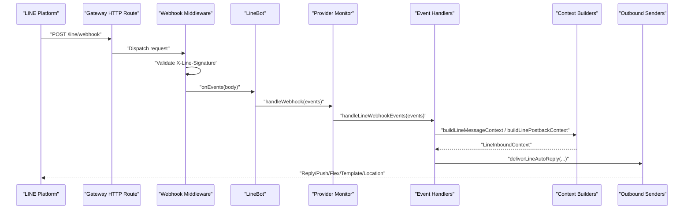

**Diagram sources**
- [src/line/webhook.ts](file://src/line/webhook.ts#L34-L87)
- [src/line/bot.ts](file://src/line/bot.ts#L48-L68)
- [src/line/monitor.ts](file://src/line/monitor.ts#L287-L297)
- [src/line/bot-handlers.ts](file://src/line/bot-handlers.ts#L652-L714)
- [src/line/bot-message-context.ts](file://src/line/bot-message-context.ts#L368-L519)
- [src/line/send.ts](file://src/line/send.ts#L215-L475)

## Detailed Component Analysis

### Webhook Security and Signature Verification
- Signature validation uses HMAC-SHA256 over the raw request body with the channel secret.
- The middleware tolerates missing bodies or signatures for verification requests and returns 200 for verification.
- Strict pre-authentication: body-dependent verification implies careful handling of request body limits and timeouts before verification.

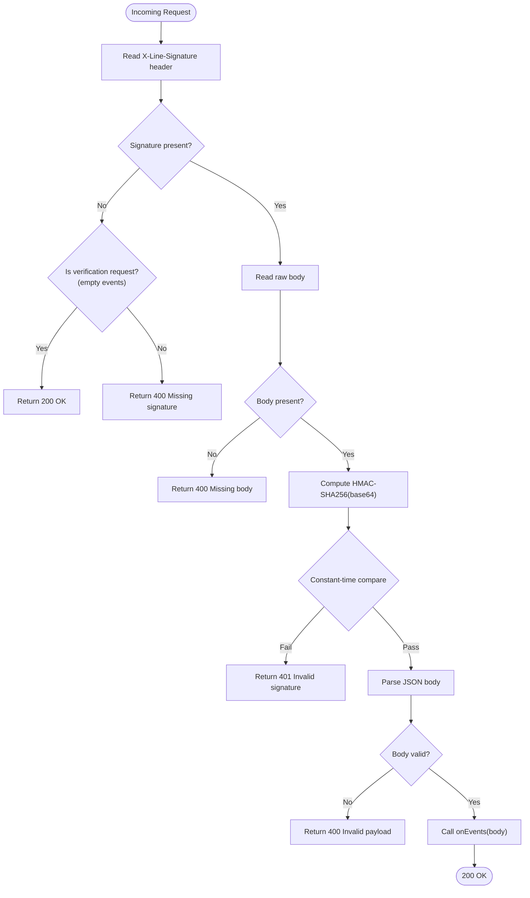

**Diagram sources**
- [src/line/webhook.ts](file://src/line/webhook.ts#L39-L86)
- [src/line/signature.ts](file://src/line/signature.ts#L3-L18)

**Section sources**
- [src/line/webhook.ts](file://src/line/webhook.ts#L34-L116)
- [src/line/signature.ts](file://src/line/signature.ts#L1-L19)

### Bot Lifecycle and Webhook Callback
- The bot encapsulates media limits, replay cache, and group histories.
- Exposes a webhook handler that delegates to the event router.
- Provides a convenience function to bind the handler to a path via the gateway.

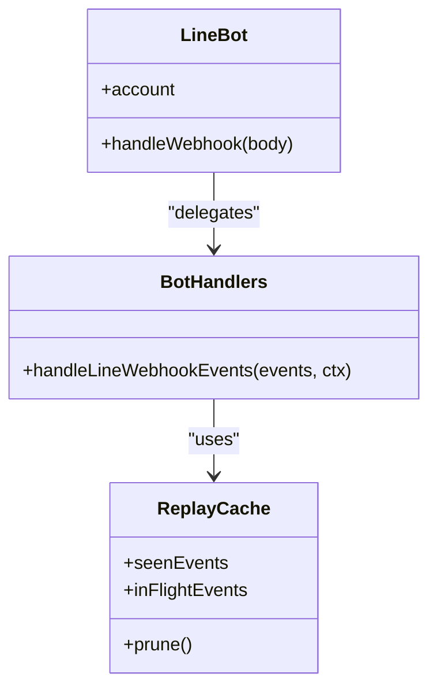

**Diagram sources**
- [src/line/bot.ts](file://src/line/bot.ts#L29-L83)
- [src/line/bot-handlers.ts](file://src/line/bot-handlers.ts#L83-L119)

**Section sources**
- [src/line/bot.ts](file://src/line/bot.ts#L29-L83)
- [src/line/bot-handlers.ts](file://src/line/bot-handlers.ts#L83-L119)

### Provider Monitor and HTTP Routing
- Registers the webhook route with normalized path and plugin auth.
- Manages runtime state (start/stop, last activity timestamps).
- Starts a loading keepalive for direct messages while processing.

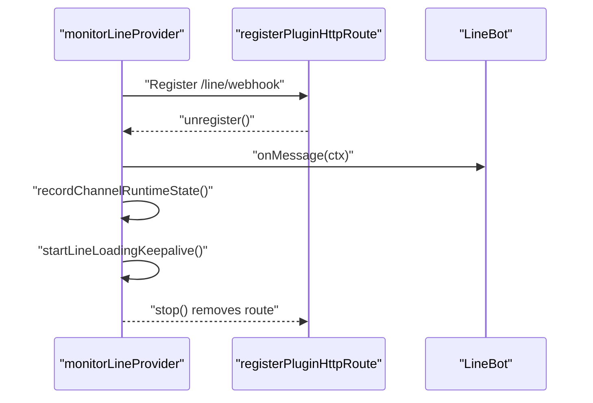

**Diagram sources**
- [src/line/monitor.ts](file://src/line/monitor.ts#L287-L335)

**Section sources**
- [src/line/monitor.ts](file://src/line/monitor.ts#L120-L335)

### Inbound Event Handling and Access Control
- Routes message/postback/join/leave/follow events.
- Enforces DM/group policies (open, allowlist, pairing, disabled).
- Supports mention gating in groups and stores pending history for unmentioned messages.
- Downloads media for downloadable message types and enforces size limits.

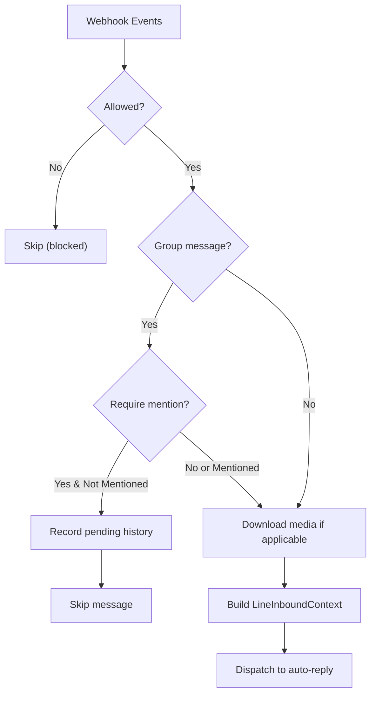

**Diagram sources**
- [src/line/bot-handlers.ts](file://src/line/bot-handlers.ts#L286-L599)
- [src/line/bot-message-context.ts](file://src/line/bot-message-context.ts#L368-L454)

**Section sources**
- [src/line/bot-handlers.ts](file://src/line/bot-handlers.ts#L286-L599)
- [src/line/bot-message-context.ts](file://src/line/bot-message-context.ts#L368-L454)

### Outbound Delivery and Rich Messages
- Supports reply vs push delivery; falls back to push when reply token fails.
- Rich message builders: Flex, Template (Confirm, Buttons, Carousel, Image Carousel), Quick Replies, Location.
- Media support: Images with preview URLs; configurable media size limits.
- Loading animations: Periodic keepalive during long processing.

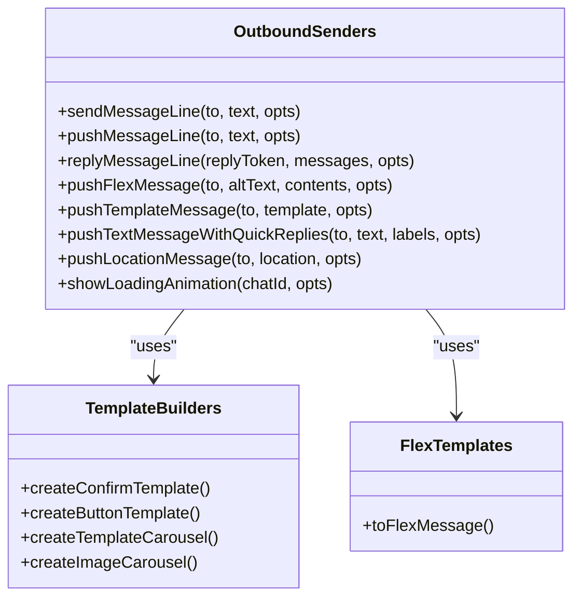

**Diagram sources**
- [src/line/send.ts](file://src/line/send.ts#L215-L475)
- [src/line/template-messages.ts](file://src/line/template-messages.ts#L40-L356)
- [src/line/flex-templates.ts](file://src/line/flex-templates.ts#L1-L34)

**Section sources**
- [src/line/send.ts](file://src/line/send.ts#L215-L475)
- [src/line/template-messages.ts](file://src/line/template-messages.ts#L40-L356)
- [src/line/flex-templates.ts](file://src/line/flex-templates.ts#L1-L34)

### Rich Menu Management
- Create rich menu with size, chat bar text, and areas.
- Upload rich menu image (JPEG/PNG, matching size).
- Set default rich menu, link/unlink to users (batched), get rich menu list, delete, and manage aliases.

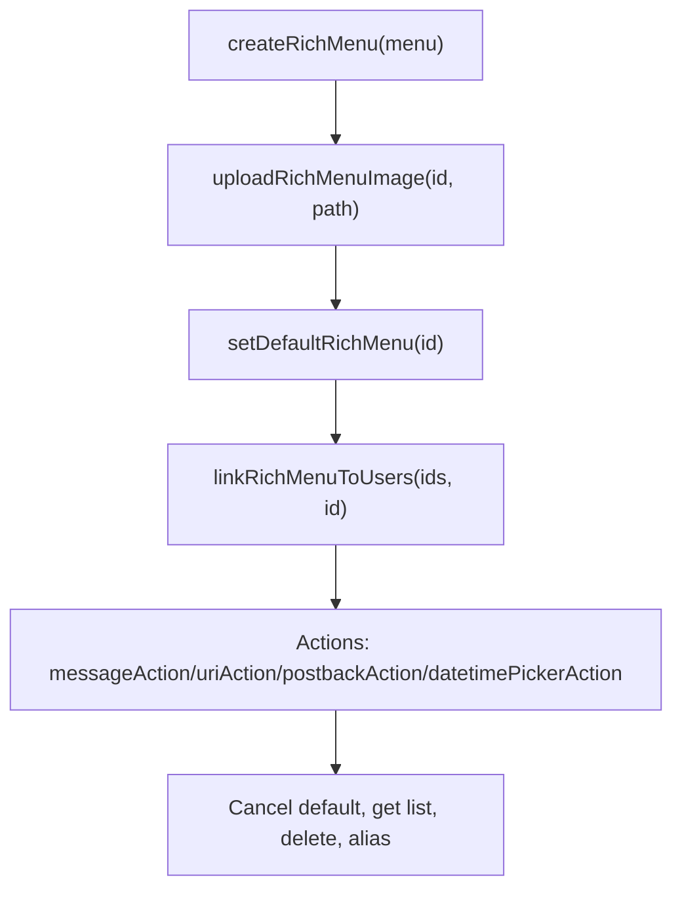

**Diagram sources**
- [src/line/rich-menu.ts](file://src/line/rich-menu.ts#L82-L334)
- [src/line/actions.ts](file://src/line/actions.ts#L8-L61)

**Section sources**
- [src/line/rich-menu.ts](file://src/line/rich-menu.ts#L82-L334)
- [src/line/actions.ts](file://src/line/actions.ts#L1-L62)

### Configuration and Access Control
- Config schema defines account-level and per-group policies, allowlists, media limits, webhook paths, and multi-account support.
- Access control:
  - DM policy: open, allowlist, pairing, disabled.
  - Group policy: allowlist, open, disabled.
  - Allowlists support user IDs; LINE IDs are case-sensitive and validated by the plugin.

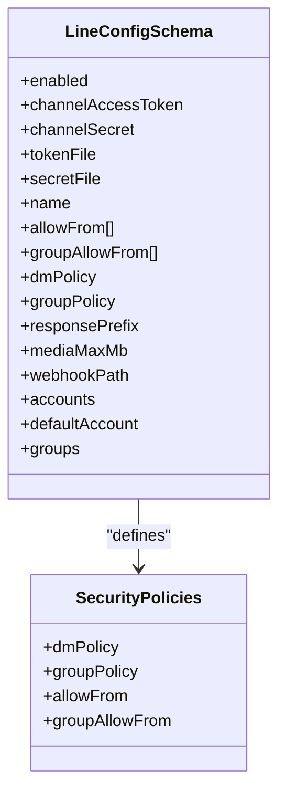

**Diagram sources**
- [src/line/config-schema.ts](file://src/line/config-schema.ts#L6-L43)
- [src/line/types.ts](file://src/line/types.ts#L14-L47)

**Section sources**
- [src/line/config-schema.ts](file://src/line/config-schema.ts#L1-L43)
- [src/line/types.ts](file://src/line/types.ts#L14-L47)
- [extensions/line/src/channel.ts](file://extensions/line/src/channel.ts#L161-L187)

### Plugin Integration and CLI
- The plugin wraps the runtime, exposing:
  - Capabilities (direct/group chats, media, no reactions/threads).
  - Config schema, security policy resolution, group mention requirements.
  - Outbound pipeline that converts text to chunks, Flex cards, and rich messages.
  - Status probes and runtime snapshots.
  - Gateway lifecycle: startAccount registers webhook and starts monitor.

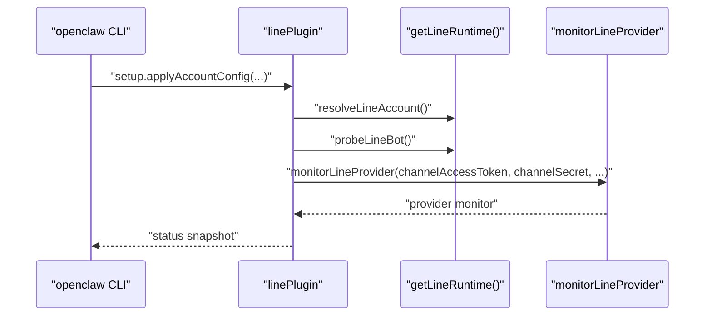

**Diagram sources**
- [extensions/line/src/channel.ts](file://extensions/line/src/channel.ts#L229-L771)
- [src/line/monitor.ts](file://src/line/monitor.ts#L120-L335)

**Section sources**
- [extensions/line/src/channel.ts](file://extensions/line/src/channel.ts#L82-L771)

## Dependency Analysis
- Internal dependencies:
  - webhook.ts depends on signature.ts for validation.
  - bot.ts composes monitor.ts and bot-handlers.ts.
  - send.ts integrates with template-messages.ts and flex-templates.ts.
  - rich-menu.ts depends on actions.ts and Messaging API clients.
  - channel.ts (plugin) depends on runtime wrappers and config schema.
- External dependencies:
  - @line/bot-sdk for Messaging API clients and types.
  - Express for HTTP middleware and routing.

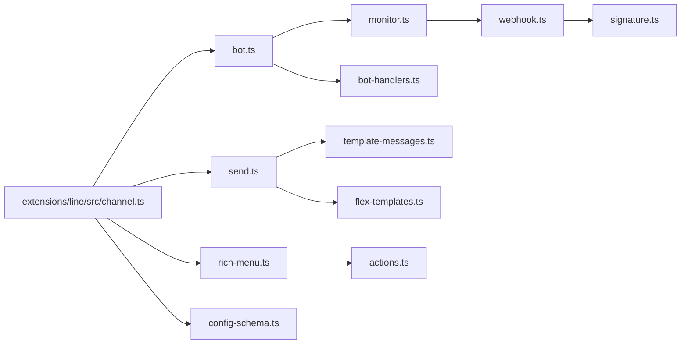

**Diagram sources**
- [src/line/webhook.ts](file://src/line/webhook.ts#L1-L117)
- [src/line/signature.ts](file://src/line/signature.ts#L1-L19)
- [src/line/bot.ts](file://src/line/bot.ts#L1-L84)
- [src/line/monitor.ts](file://src/line/monitor.ts#L1-L336)
- [src/line/bot-handlers.ts](file://src/line/bot-handlers.ts#L1-L715)
- [src/line/send.ts](file://src/line/send.ts#L1-L475)
- [src/line/template-messages.ts](file://src/line/template-messages.ts#L1-L356)
- [src/line/flex-templates.ts](file://src/line/flex-templates.ts#L1-L34)
- [src/line/rich-menu.ts](file://src/line/rich-menu.ts#L1-L394)
- [src/line/actions.ts](file://src/line/actions.ts#L1-L62)
- [src/line/config-schema.ts](file://src/line/config-schema.ts#L1-L43)
- [extensions/line/src/channel.ts](file://extensions/line/src/channel.ts#L1-L772)

**Section sources**
- [src/line/webhook.ts](file://src/line/webhook.ts#L1-L117)
- [src/line/bot.ts](file://src/line/bot.ts#L1-L84)
- [src/line/monitor.ts](file://src/line/monitor.ts#L1-L336)
- [src/line/bot-handlers.ts](file://src/line/bot-handlers.ts#L1-L715)
- [src/line/send.ts](file://src/line/send.ts#L1-L475)
- [src/line/rich-menu.ts](file://src/line/rich-menu.ts#L1-L394)
- [src/line/template-messages.ts](file://src/line/template-messages.ts#L1-L356)
- [src/line/flex-templates.ts](file://src/line/flex-templates.ts#L1-L34)
- [src/line/actions.ts](file://src/line/actions.ts#L1-L62)
- [src/line/config-schema.ts](file://src/line/config-schema.ts#L1-L43)
- [extensions/line/src/channel.ts](file://extensions/line/src/channel.ts#L1-L772)

## Performance Considerations
- Media size limits: Default 10 MB; adjust via mediaMaxMb to accommodate larger assets.
- Chunking: Text messages are chunked at 5000 characters per LINE limit.
- Streaming: Responses are buffered with a loading animation to improve perceived latency.
- Replay protection: In-flight and duplicate event caches reduce duplicate processing overhead.
- Batch operations: Rich menu user linking supports batching up to 500 users.

[No sources needed since this section provides general guidance]

## Troubleshooting Guide
- Webhook verification fails:
  - Ensure HTTPS URL and correct channel secret.
  - Verify the webhook path matches configured webhookPath.
- No inbound events:
  - Confirm gateway reachability from LINE and correct path registration.
- Media download errors:
  - Increase mediaMaxMb if exceeding default limit.
- Access control issues:
  - Review dmPolicy and allowFrom/groupAllowFrom configurations.
  - Use pairing approvals for new senders under pairing policy.
- Rich menu issues:
  - Ensure image dimensions match rich menu size and file type is JPEG/PNG.

**Section sources**
- [docs/channels/line.md](file://docs/channels/line.md#L184-L192)
- [src/line/bot-handlers.ts](file://src/line/bot-handlers.ts#L286-L419)
- [src/line/rich-menu.ts](file://src/line/rich-menu.ts#L107-L127)

## Conclusion
The LINE integration provides a robust, secure, and feature-rich bridge to the LINE Messaging API. It supports modern conversational features including rich messages, media, and interactive menus, while maintaining strong access controls and operational observability. The plugin layer simplifies deployment and management through the CLI and runtime abstractions.

[No sources needed since this section summarizes without analyzing specific files]

## Appendices

### Setup Procedures
- Install the LINE plugin and configure credentials and webhook path.
- Enable webhook in LINE Console and set HTTPS endpoint.
- Configure access control policies and allowlists.
- Optionally set up rich menus and template/Flex presets.

**Section sources**
- [docs/channels/line.md](file://docs/channels/line.md#L20-L106)

### API Permissions and Regions
- Use Messaging API permissions in LINE Console.
- Regional availability varies by region; consult LINE documentation for service availability.

**Section sources**
- [docs/channels/line.md](file://docs/channels/line.md#L36-L48)

### Compliance Notes
- Respect privacy and data handling requirements in your region.
- Ensure secure storage of channel access tokens and secrets.

**Section sources**
- [docs/channels/line.md](file://docs/channels/line.md#L51-L54)