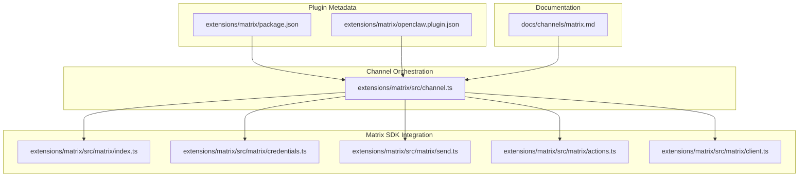
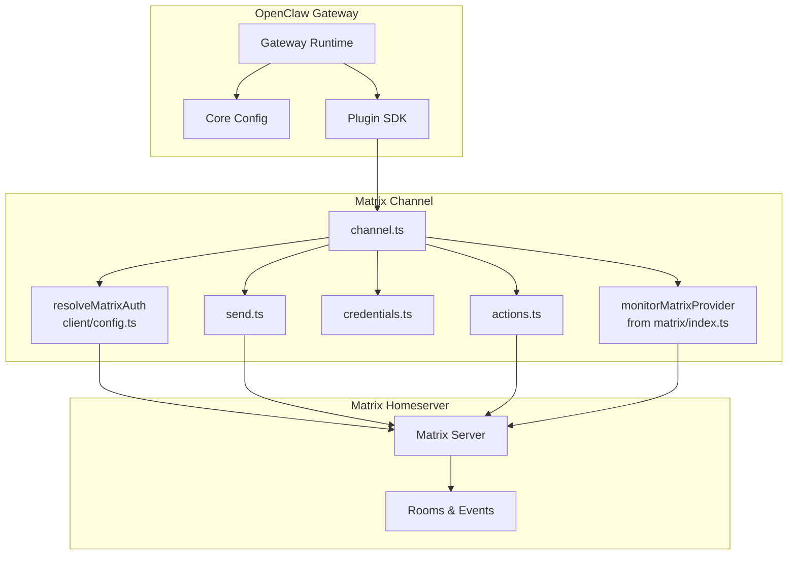
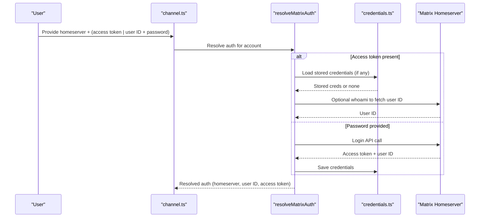
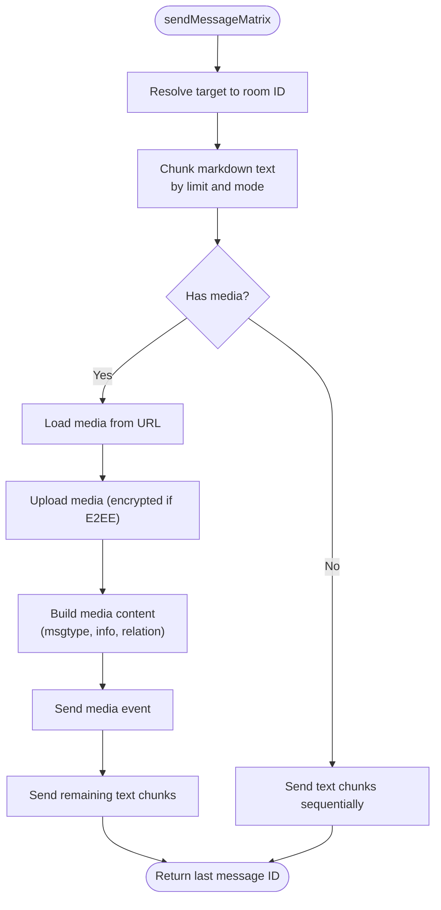
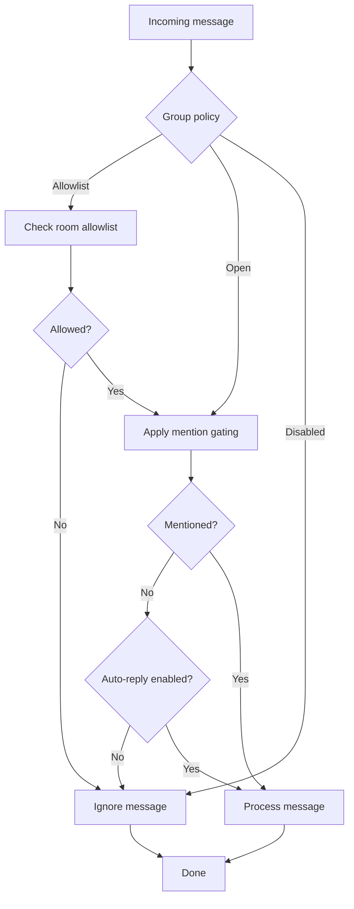
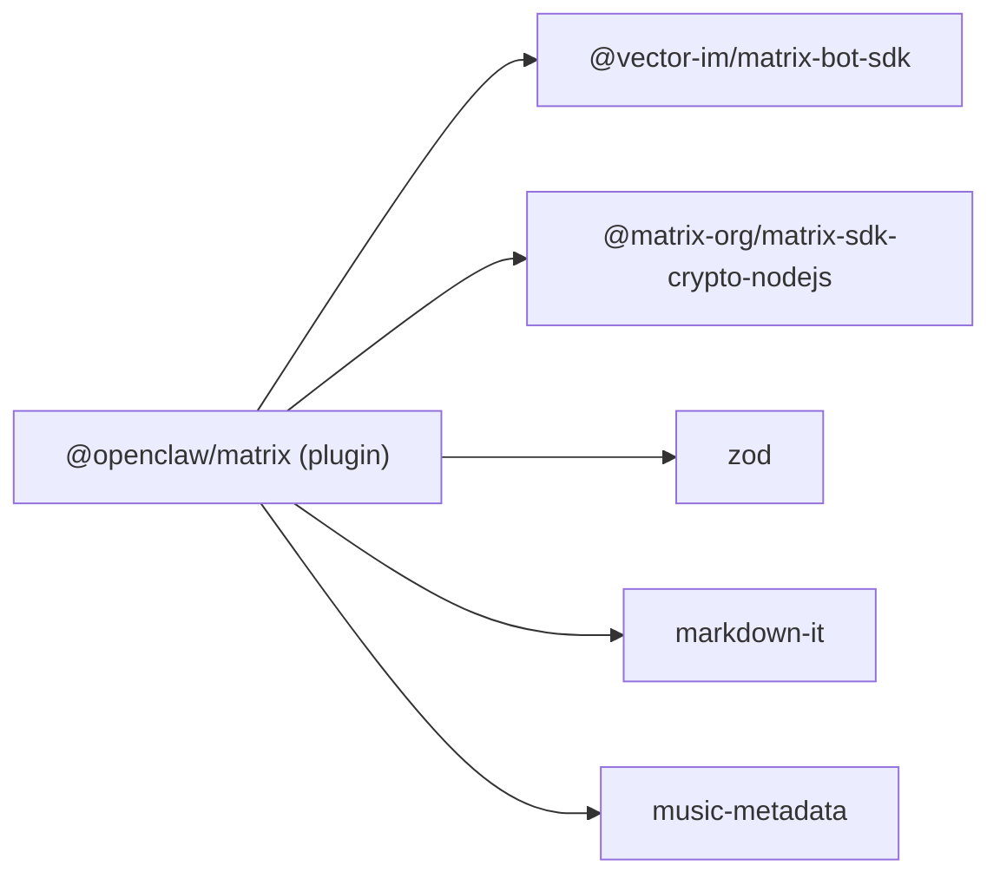

# Matrix Channel

<cite>
**Referenced Files in This Document**
- [package.json](file://extensions/matrix/package.json)
- [openclaw.plugin.json](file://extensions/matrix/openclaw.plugin.json)
- [matrix.md](file://docs/channels/matrix.md)
- [channel.ts](file://extensions/matrix/src/channel.ts)
- [index.ts](file://extensions/matrix/src/matrix/index.ts)
- [client.ts](file://extensions/matrix/src/matrix/client.ts)
- [credentials.ts](file://extensions/matrix/src/matrix/credentials.ts)
- [send.ts](file://extensions/matrix/src/matrix/send.ts)
- [actions.ts](file://extensions/matrix/src/matrix/actions.ts)
</cite>

## Table of Contents
1. [Introduction](#introduction)
2. [Project Structure](#project-structure)
3. [Core Components](#core-components)
4. [Architecture Overview](#architecture-overview)
5. [Detailed Component Analysis](#detailed-component-analysis)
6. [Dependency Analysis](#dependency-analysis)
7. [Performance Considerations](#performance-considerations)
8. [Troubleshooting Guide](#troubleshooting-guide)
9. [Conclusion](#conclusion)
10. [Appendices](#appendices)

## Introduction
This document provides comprehensive documentation for the Matrix channel integration in OpenClaw. It covers the Matrix protocol implementation, homeserver configuration, room and thread management, authentication methods (access tokens and password-based login), multi-account support, encryption (E2EE), access control for DMs and rooms, and cross-platform compatibility. It also documents setup procedures for self-hosted homeservers, federation considerations, and inbound/outbound event handling.

## Project Structure
The Matrix channel is implemented as a plugin with a clear separation of concerns:
- Plugin metadata and installation configuration
- Channel plugin entry point and orchestration
- Matrix client lifecycle and credential management
- Outbound messaging, media, reactions, polls, and typing indicators
- Action APIs for message editing, reactions, pins, and room/member info
- Documentation describing capabilities, configuration, and troubleshooting

**Diagram sources**
- [package.json](file://extensions/matrix/package.json#L1-L42)
- [openclaw.plugin.json](file://extensions/matrix/openclaw.plugin.json#L1-L10)
- [channel.ts](file://extensions/matrix/src/channel.ts#L1-L475)
- [index.ts](file://extensions/matrix/src/matrix/index.ts#L1-L12)
- [credentials.ts](file://extensions/matrix/src/matrix/credentials.ts#L1-L126)
- [send.ts](file://extensions/matrix/src/matrix/send.ts#L1-L268)
- [actions.ts](file://extensions/matrix/src/matrix/actions.ts#L1-L16)
- [client.ts](file://extensions/matrix/src/matrix/client.ts#L1-L15)
- [matrix.md](file://docs/channels/matrix.md#L1-L304)

**Section sources**
- [package.json](file://extensions/matrix/package.json#L1-L42)
- [openclaw.plugin.json](file://extensions/matrix/openclaw.plugin.json#L1-L10)
- [channel.ts](file://extensions/matrix/src/channel.ts#L1-L475)
- [matrix.md](file://docs/channels/matrix.md#L1-L304)

## Core Components
- Plugin identity and configuration: The plugin declares its channel identity, documentation path, quickstart support, and installation metadata.
- Channel plugin interface: Implements onboarding, pairing, capabilities, security policies, threading, messaging targets, directory, resolver, actions, outbound pipeline, and status/probe.
- Client and credentials: Manages Matrix client creation, shared client lifecycle, and persistent credentials storage.
- Outbound messaging: Handles text chunking, media uploads (including encryption), reactions, polls, typing indicators, and read receipts.
- Actions: Provides tool-like actions for message operations, reactions, pins, and room/member information retrieval.

**Section sources**
- [channel.ts](file://extensions/matrix/src/channel.ts#L46-L55)
- [channel.ts](file://extensions/matrix/src/channel.ts#L109-L475)
- [client.ts](file://extensions/matrix/src/matrix/client.ts#L1-L15)
- [credentials.ts](file://extensions/matrix/src/matrix/credentials.ts#L1-L126)
- [send.ts](file://extensions/matrix/src/matrix/send.ts#L37-L158)
- [actions.ts](file://extensions/matrix/src/matrix/actions.ts#L1-L16)

## Architecture Overview
The Matrix channel integrates with OpenClaw’s plugin SDK and the Matrix Bot SDK. It supports:
- Self-hosted and federated homeservers
- Access tokens and password-based login
- E2EE via the Rust crypto SDK (optional)
- Multi-account operation with per-account configuration
- Room allowlists, mention gating, and auto-join policies
- Thread-aware replies and reply-to modes
- Rich outbound content: text, media (images/audio/video), reactions, polls, typing indicators, read receipts

**Diagram sources**
- [channel.ts](file://extensions/matrix/src/channel.ts#L394-L429)
- [index.ts](file://extensions/matrix/src/matrix/index.ts#L1-L12)
- [client.ts](file://extensions/matrix/src/matrix/client.ts#L3-L8)
- [credentials.ts](file://extensions/matrix/src/matrix/credentials.ts#L1-L126)
- [send.ts](file://extensions/matrix/src/matrix/send.ts#L37-L158)
- [actions.ts](file://extensions/matrix/src/matrix/actions.ts#L1-L16)

## Detailed Component Analysis

### Authentication and Credentials
- Access tokens: Preferred method; stored securely under the state directory and reused across restarts. The plugin can fetch the user ID via the whoami endpoint when only the access token is provided.
- Password-based login: Supported for convenience; the plugin invokes the Matrix login endpoint and persists the access token.
- Credential persistence: Credentials are stored per account and include homeserver, user ID, access token, optional device ID, and timestamps. A matching function ensures credentials align with the configured homeserver and user ID.
- Device verification: When E2EE is enabled, the bot requests verification from other sessions; verification must be approved in a Matrix client to enable decryption and key sharing.

**Diagram sources**
- [channel.ts](file://extensions/matrix/src/channel.ts#L394-L413)
- [credentials.ts](file://extensions/matrix/src/matrix/credentials.ts#L42-L86)

**Section sources**
- [matrix.md](file://docs/channels/matrix.md#L47-L78)
- [credentials.ts](file://extensions/matrix/src/matrix/credentials.ts#L42-L126)
- [channel.ts](file://extensions/matrix/src/channel.ts#L394-L413)

### Outbound Messaging Pipeline
- Target resolution: Converts human-friendly targets (room/alias/user) into Matrix room identifiers.
- Text handling: Markdown conversion, table rendering, chunking by character count or paragraph boundaries, and thread/reply relations.
- Media handling: Loads media from URLs, encrypts uploads when in encrypted rooms, computes durations, infers message types (image/audio/video), prepares image info, and sends follow-up text chunks if needed.
- Polls: Builds poll start events and sends them into rooms or threads.
- Typing indicators and read receipts: Sets typing state and places read receipts for delivered messages.
- Rate limiting and queuing: Uses an enqueue mechanism to serialize sends per room.

**Diagram sources**
- [send.ts](file://extensions/matrix/src/matrix/send.ts#L37-L158)

**Section sources**
- [send.ts](file://extensions/matrix/src/matrix/send.ts#L37-L158)
- [matrix.md](file://docs/channels/matrix.md#L234-L247)

### Room Management and Permissions
- Group policy: Supports allowlist, open, or disabled policies. Defaults to allowlist with mention gating unless overridden.
- Allowlists: Support room IDs, aliases, and names (resolved to IDs when exact matches are found). Sender allowlists can be applied per room.
- Auto-join: Controls invite handling (always, allowlist, off) with an allowlist of room IDs/aliases.
- Mention gating: Can disable requireMention to enable auto-reply in rooms; defaults vary per room.
- Directory: Lists peers and groups for UI and wizard flows, normalizes IDs, and filters incomplete entries.

**Diagram sources**
- [channel.ts](file://extensions/matrix/src/channel.ts#L198-L201)
- [channel.ts](file://extensions/matrix/src/channel.ts#L166-L197)

**Section sources**
- [channel.ts](file://extensions/matrix/src/channel.ts#L166-L224)
- [matrix.md](file://docs/channels/matrix.md#L195-L225)

### Threads and Reply Behavior
- Reply threading: Supported with configurable modes controlling whether replies remain in threads.
- Reply-to modes: Off, first, or all; controls reply-to metadata when not replying in-thread.
- Thread-aware relations: Builds thread or reply relations for outbound messages.

**Section sources**
- [channel.ts](file://extensions/matrix/src/channel.ts#L202-L214)
- [matrix.md](file://docs/channels/matrix.md#L226-L233)

### Encryption (E2EE)
- Enablement: Controlled by a configuration flag; when enabled, encrypted rooms are decrypted automatically and outbound media is encrypted.
- Crypto module: Requires the Rust crypto SDK; if unavailable, E2EE is disabled and warnings are logged.
- Device verification: On first connection, the bot requests verification from other sessions; verification must be approved in a Matrix client to enable key sharing.
- Storage: Crypto state and sync state are stored per account and access token.

**Section sources**
- [matrix.md](file://docs/channels/matrix.md#L111-L138)

### Multi-Account Support
- Accounts: Use a dedicated configuration section keyed by account IDs; each account runs as a separate Matrix user on any homeserver.
- Inheritance: Per-account settings inherit from top-level channel settings and can override DM policy, group policy, encryption, and more.
- Startup serialization: Serializes account startups to avoid race conditions with dynamic imports.
- Routing: Use bindings to route each account to a different agent.

**Section sources**
- [channel.ts](file://extensions/matrix/src/channel.ts#L431-L472)
- [matrix.md](file://docs/channels/matrix.md#L139-L179)

### Setup Procedures
- Install plugin: Via npm registry or local checkout.
- Create a Matrix account: Choose a hosted or self-hosted homeserver.
- Obtain credentials: Use access tokens or password-based login; tokens are stored and reused.
- Configure: Set homeserver, access token, and optional user ID; environment variables apply to the default account.
- Start DMs or invite the bot to rooms; verify E2EE if enabled.

**Section sources**
- [matrix.md](file://docs/channels/matrix.md#L18-L78)

### Cross-Platform Compatibility
- Clients: Works with Element, Beeper, and other Matrix clients; Beeper requires E2EE to be enabled.
- Federation: Operates across federated homeservers; room allowlists and policies apply consistently.

**Section sources**
- [matrix.md](file://docs/channels/matrix.md#L10-L13)
- [matrix.md](file://docs/channels/matrix.md#L76-L78)

## Dependency Analysis
External dependencies include the Matrix Bot SDK and the Rust crypto SDK for E2EE. The plugin integrates with OpenClaw’s plugin SDK for configuration, status, and runtime orchestration.

**Diagram sources**
- [package.json](file://extensions/matrix/package.json#L6-L13)

**Section sources**
- [package.json](file://extensions/matrix/package.json#L6-L13)

## Performance Considerations
- Text chunking: Limits outbound text to prevent server-side restrictions and improve readability.
- Media upload: Encrypts uploads in E2EE rooms and computes durations for audio/video; consider media caps to manage bandwidth.
- Queuing: Serializes sends per room to avoid rate limits and race conditions.
- Initial sync limit: Tune initial sync limit to balance startup time and historical context.

[No sources needed since this section provides general guidance]

## Troubleshooting Guide
- Use status and doctor commands to diagnose runtime issues.
- Confirm pairing state for DMs when policy is set to pairing.
- Investigate room allowlists and mention gating if messages are ignored.
- Verify E2EE configuration and device verification if encrypted rooms fail to decrypt.

**Section sources**
- [matrix.md](file://docs/channels/matrix.md#L248-L273)

## Conclusion
The Matrix channel integration provides a robust, extensible foundation for connecting OpenClaw to Matrix homeservers. It supports modern features like E2EE, threads, media, reactions, and polls, while offering flexible configuration for DMs, rooms, and multi-account deployments. Proper credential management, access control, and troubleshooting practices ensure reliable operation across self-hosted and federated environments.

[No sources needed since this section summarizes without analyzing specific files]

## Appendices

### Configuration Reference Highlights
- Enable/disable channel startup
- Homeserver URL
- Access token or user ID + password
- Device name, encryption toggle
- Initial sync limit
- Thread replies and reply-to modes
- DM policy and allowlists
- Group policy, allowlists, and sender allowlists
- Auto-join behavior and allowlists
- Multi-account configuration
- Action gating for reactions/messages/pins/memberInfo/channelInfo

**Section sources**
- [matrix.md](file://docs/channels/matrix.md#L274-L304)