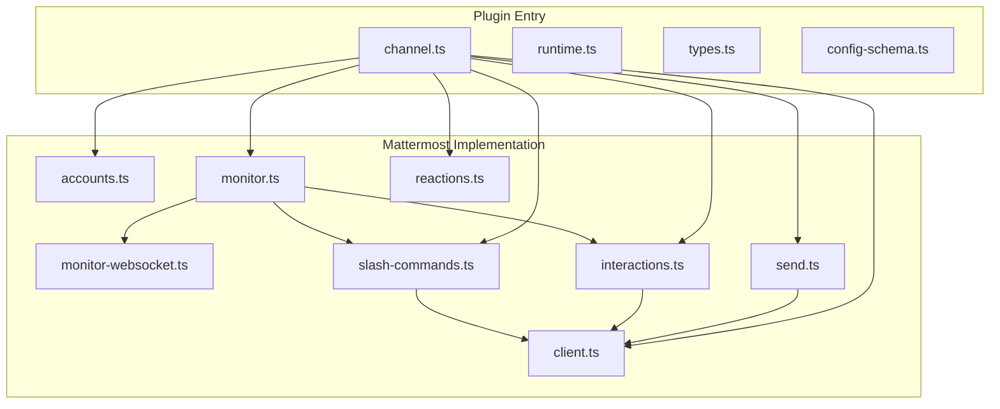
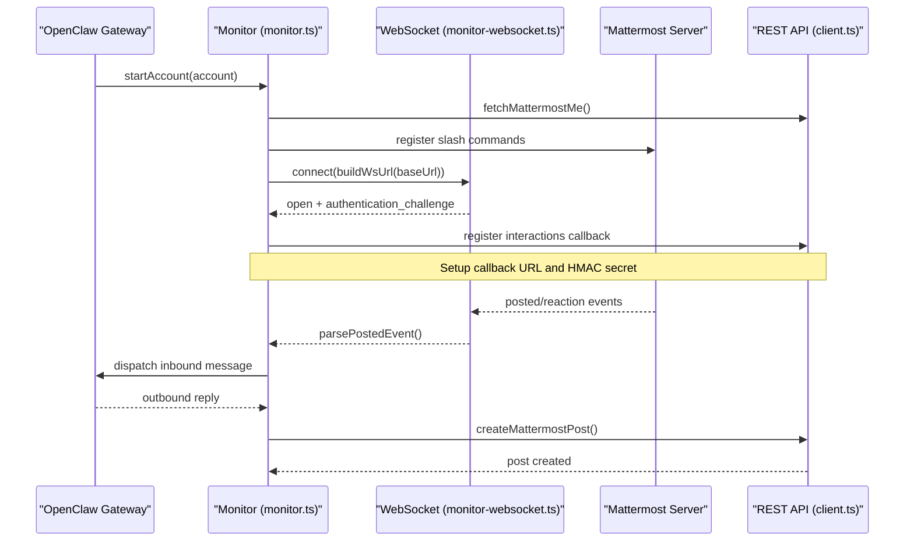
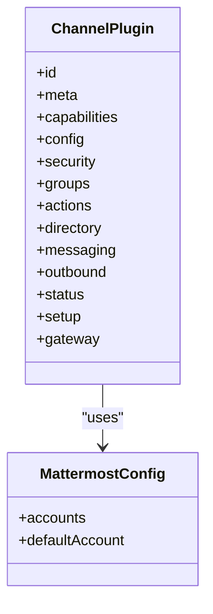
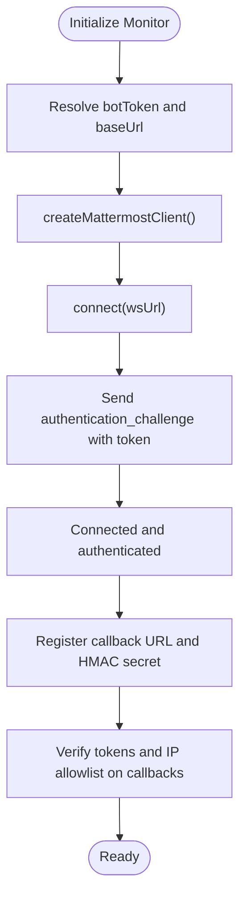
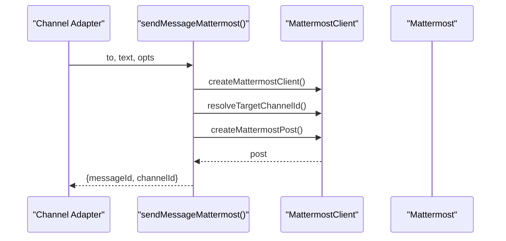
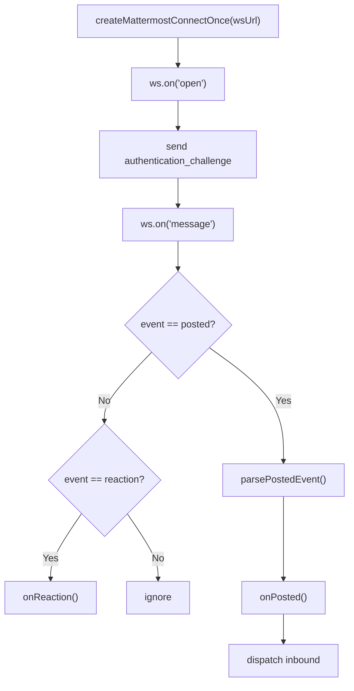
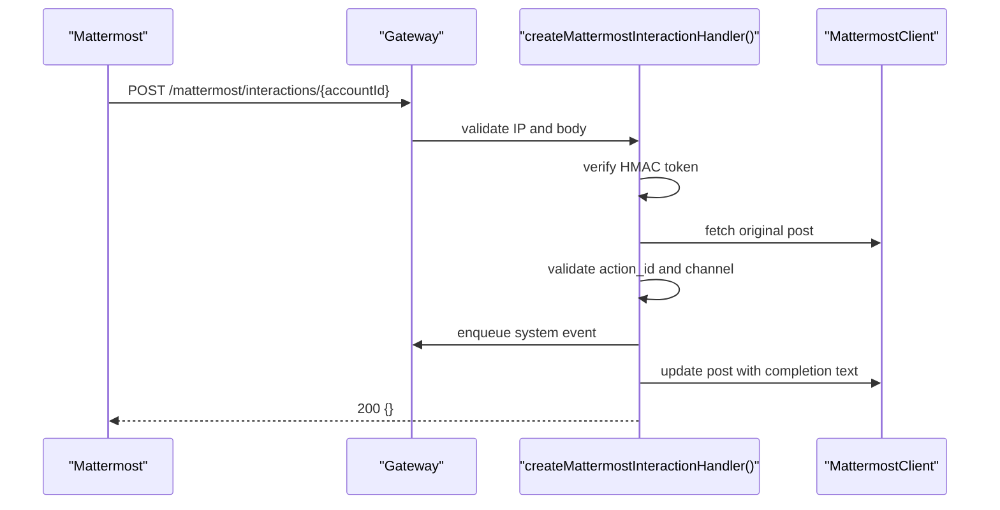
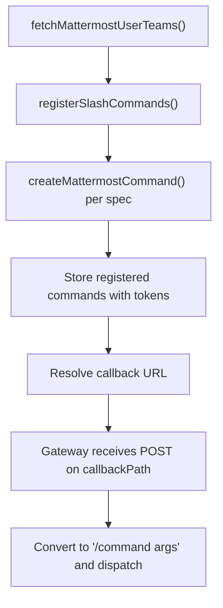
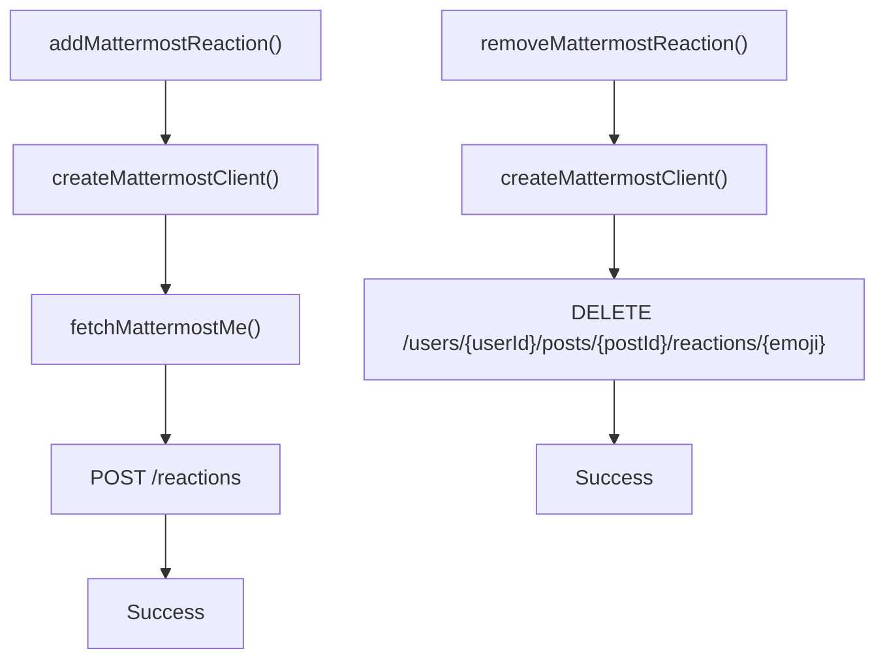
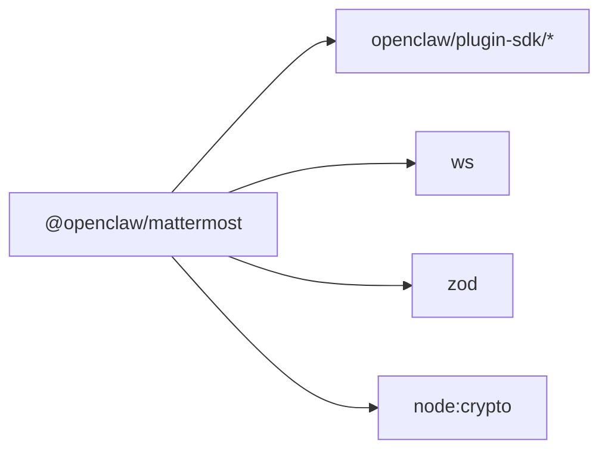

# Mattermost Channel

<cite>
**Referenced Files in This Document**
- [package.json](file://extensions/mattermost/package.json)
- [openclaw.plugin.json](file://extensions/mattermost/openclaw.plugin.json)
- [channel.ts](file://extensions/mattermost/src/channel.ts)
- [runtime.ts](file://extensions/mattermost/src/runtime.ts)
- [types.ts](file://extensions/mattermost/src/types.ts)
- [config-schema.ts](file://extensions/mattermost/src/config-schema.ts)
- [accounts.ts](file://extensions/mattermost/src/mattermost/accounts.ts)
- [client.ts](file://extensions/mattermost/src/mattermost/client.ts)
- [monitor.ts](file://extensions/mattermost/src/mattermost/monitor.ts)
- [monitor-websocket.ts](file://extensions/mattermost/src/mattermost/monitor-websocket.ts)
- [send.ts](file://extensions/mattermost/src/mattermost/send.ts)
- [interactions.ts](file://extensions/mattermost/src/mattermost/interactions.ts)
- [slash-commands.ts](file://extensions/mattermost/src/mattermost/slash-commands.ts)
- [reactions.ts](file://extensions/mattermost/src/mattermost/reactions.ts)
</cite>

## Table of Contents
1. [Introduction](#introduction)
2. [Project Structure](#project-structure)
3. [Core Components](#core-components)
4. [Architecture Overview](#architecture-overview)
5. [Detailed Component Analysis](#detailed-component-analysis)
6. [Dependency Analysis](#dependency-analysis)
7. [Performance Considerations](#performance-considerations)
8. [Troubleshooting Guide](#troubleshooting-guide)
9. [Conclusion](#conclusion)
10. [Appendices](#appendices)

## Introduction
This document describes the Mattermost channel integration for OpenClaw. It covers the Bot API and WebSocket implementation, server configuration, authentication, team/channel management, webhook setup, message formatting, and deployment considerations for self-hosted environments. It also outlines plugin installation and configuration steps, along with guidance for enterprise deployments.

## Project Structure
The Mattermost channel is implemented as a plugin under the extensions/mattermost directory. The plugin exposes:
- A channel adapter that integrates with OpenClaw’s plugin SDK
- A Mattermost client wrapper for REST API calls
- A WebSocket monitor for real-time events
- Interactive message handlers for button actions
- Slash command registration and callback handling
- Reaction management
- Configuration schema and account resolution

**Diagram sources**
- [channel.ts](file://extensions/mattermost/src/channel.ts#L234-L491)
- [runtime.ts](file://extensions/mattermost/src/runtime.ts#L1-L7)
- [types.ts](file://extensions/mattermost/src/types.ts#L1-L90)
- [config-schema.ts](file://extensions/mattermost/src/config-schema.ts#L1-L86)
- [accounts.ts](file://extensions/mattermost/src/mattermost/accounts.ts#L1-L138)
- [client.ts](file://extensions/mattermost/src/mattermost/client.ts#L1-L279)
- [monitor.ts](file://extensions/mattermost/src/mattermost/monitor.ts#L1-L800)
- [monitor-websocket.ts](file://extensions/mattermost/src/mattermost/monitor-websocket.ts#L1-L222)
- [send.ts](file://extensions/mattermost/src/mattermost/send.ts#L1-L366)
- [interactions.ts](file://extensions/mattermost/src/mattermost/interactions.ts#L1-L642)
- [slash-commands.ts](file://extensions/mattermost/src/mattermost/slash-commands.ts#L1-L573)
- [reactions.ts](file://extensions/mattermost/src/mattermost/reactions.ts#L1-L125)

**Section sources**
- [package.json](file://extensions/mattermost/package.json#L1-L30)
- [openclaw.plugin.json](file://extensions/mattermost/openclaw.plugin.json#L1-L10)
- [channel.ts](file://extensions/mattermost/src/channel.ts#L234-L491)

## Core Components
- Channel adapter: Defines capabilities, configuration schema, security policies, directory queries, messaging targets, outbound delivery, status reporting, and gateway lifecycle.
- Client: Encapsulates Mattermost REST API calls with token authentication and error handling.
- Monitor: Orchestrates WebSocket connections, slash command registration, interactive button callbacks, and inbound/outbound message processing.
- WebSockets: Implements connection, authentication challenge, and event parsing for posted/reaction events.
- Interactions: Manages interactive button callbacks with HMAC token verification and IP allowlisting.
- Slash Commands: Registers and manages Mattermost slash commands and their HTTP callbacks.
- Reactions: Adds and removes emoji reactions on posts.
- Runtime: Provides a plugin-scoped runtime store for Mattermost.

**Section sources**
- [channel.ts](file://extensions/mattermost/src/channel.ts#L234-L491)
- [client.ts](file://extensions/mattermost/src/mattermost/client.ts#L73-L114)
- [monitor.ts](file://extensions/mattermost/src/mattermost/monitor.ts#L315-L480)
- [monitor-websocket.ts](file://extensions/mattermost/src/mattermost/monitor-websocket.ts#L101-L211)
- [interactions.ts](file://extensions/mattermost/src/mattermost/interactions.ts#L386-L642)
- [slash-commands.ts](file://extensions/mattermost/src/mattermost/slash-commands.ts#L246-L388)
- [reactions.ts](file://extensions/mattermost/src/mattermost/reactions.ts#L36-L103)
- [runtime.ts](file://extensions/mattermost/src/runtime.ts#L1-L7)

## Architecture Overview
The Mattermost channel integrates with OpenClaw through a plugin adapter. The monitor initializes the Mattermost client, registers slash commands, sets up interactive button callbacks, and maintains a WebSocket connection to receive real-time events. Outbound messages are sent via the REST API, and inbound messages are processed through the OpenClaw pipeline.

**Diagram sources**
- [monitor.ts](file://extensions/mattermost/src/mattermost/monitor.ts#L315-L480)
- [monitor-websocket.ts](file://extensions/mattermost/src/mattermost/monitor-websocket.ts#L101-L211)
- [client.ts](file://extensions/mattermost/src/mattermost/client.ts#L116-L118)
- [slash-commands.ts](file://extensions/mattermost/src/mattermost/slash-commands.ts#L246-L388)
- [interactions.ts](file://extensions/mattermost/src/mattermost/interactions.ts#L520-L642)
- [send.ts](file://extensions/mattermost/src/mattermost/send.ts#L347-L365)

## Detailed Component Analysis

### Channel Adapter and Configuration
- Exposes capabilities: chat types (direct, channel, group, thread), reactions, threads, media, and native commands.
- Supports multi-account configuration with per-account overrides.
- Enforces allowlist and DM/group policies.
- Provides outbound delivery with text chunking and media uploads.
- Integrates with gateway status and probing.

**Diagram sources**
- [channel.ts](file://extensions/mattermost/src/channel.ts#L234-L491)
- [types.ts](file://extensions/mattermost/src/types.ts#L84-L90)

**Section sources**
- [channel.ts](file://extensions/mattermost/src/channel.ts#L234-L491)
- [config-schema.ts](file://extensions/mattermost/src/config-schema.ts#L73-L86)
- [types.ts](file://extensions/mattermost/src/types.ts#L10-L90)

### Authentication and Security
- Bot authentication via Bearer token on REST API calls.
- WebSocket authentication challenge with token exchange.
- HMAC-based token verification for interactive button callbacks.
- IP allowlisting for interaction callbacks to mitigate SSRF and unauthorized access.
- Environment variable support for default account credentials.

**Diagram sources**
- [monitor.ts](file://extensions/mattermost/src/mattermost/monitor.ts#L315-L346)
- [monitor-websocket.ts](file://extensions/mattermost/src/mattermost/monitor-websocket.ts#L136-L142)
- [interactions.ts](file://extensions/mattermost/src/mattermost/interactions.ts#L168-L195)

**Section sources**
- [client.ts](file://extensions/mattermost/src/mattermost/client.ts#L86-L113)
- [monitor-websocket.ts](file://extensions/mattermost/src/mattermost/monitor-websocket.ts#L136-L142)
- [interactions.ts](file://extensions/mattermost/src/mattermost/interactions.ts#L168-L230)
- [accounts.ts](file://extensions/mattermost/src/mattermost/accounts.ts#L98-L113)

### Bot API and Message Delivery
- Sends posts to channels or users, supporting threaded replies and media uploads.
- Resolves targets by ID, username, or channel name across teams.
- Converts markdown tables and chunks text according to configuration.
- Records outbound activity and returns message identifiers.

**Diagram sources**
- [send.ts](file://extensions/mattermost/src/mattermost/send.ts#L274-L365)
- [client.ts](file://extensions/mattermost/src/mattermost/client.ts#L178-L205)

**Section sources**
- [send.ts](file://extensions/mattermost/src/mattermost/send.ts#L274-L365)
- [client.ts](file://extensions/mattermost/src/mattermost/client.ts#L178-L205)

### WebSocket and Real-Time Events
- Connects to the Mattermost WebSocket endpoint and authenticates.
- Parses posted and reaction events.
- Updates runtime status on open/close/error.

**Diagram sources**
- [monitor-websocket.ts](file://extensions/mattermost/src/mattermost/monitor-websocket.ts#L101-L211)

**Section sources**
- [monitor-websocket.ts](file://extensions/mattermost/src/mattermost/monitor-websocket.ts#L101-L211)
- [monitor.ts](file://extensions/mattermost/src/mattermost/monitor.ts#L145-L178)

### Interactive Buttons and Callbacks
- Builds button attachments with HMAC-signed context.
- Registers HTTP route for interaction callbacks.
- Validates source IP, token, and post/channel context.
- Dispatches system events and updates the original post.

**Diagram sources**
- [interactions.ts](file://extensions/mattermost/src/mattermost/interactions.ts#L411-L642)
- [client.ts](file://extensions/mattermost/src/mattermost/client.ts#L220-L239)

**Section sources**
- [interactions.ts](file://extensions/mattermost/src/mattermost/interactions.ts#L268-L347)
- [interactions.ts](file://extensions/mattermost/src/mattermost/interactions.ts#L411-L642)

### Slash Commands
- Registers built-in and skill-based slash commands per team.
- Derives callback URL from gateway configuration.
- Handles command invocations and converts them to inbound messages.

**Diagram sources**
- [monitor.ts](file://extensions/mattermost/src/mattermost/monitor.ts#L348-L480)
- [slash-commands.ts](file://extensions/mattermost/src/mattermost/slash-commands.ts#L246-L388)
- [slash-commands.ts](file://extensions/mattermost/src/mattermost/slash-commands.ts#L540-L572)

**Section sources**
- [slash-commands.ts](file://extensions/mattermost/src/mattermost/slash-commands.ts#L1-L573)
- [monitor.ts](file://extensions/mattermost/src/mattermost/monitor.ts#L348-L480)

### Reactions
- Adds or removes emoji reactions on posts.
- Uses bot user ID resolution and API endpoints.

**Diagram sources**
- [reactions.ts](file://extensions/mattermost/src/mattermost/reactions.ts#L36-L103)
- [client.ts](file://extensions/mattermost/src/mattermost/client.ts#L105-L124)

**Section sources**
- [reactions.ts](file://extensions/mattermost/src/mattermost/reactions.ts#L36-L103)

### Team and Channel Management
- Lists teams for the bot user and registers commands per team.
- Resolves channel IDs by name across teams.
- Supports direct channels for user-to-user messaging.

**Section sources**
- [monitor.ts](file://extensions/mattermost/src/mattermost/monitor.ts#L357-L358)
- [client.ts](file://extensions/mattermost/src/mattermost/client.ts#L213-L218)
- [send.ts](file://extensions/mattermost/src/mattermost/send.ts#L161-L218)

### Message Formatting and Media
- Converts markdown tables and chunks text based on configuration.
- Uploads media files and attaches them to posts.
- Supports threaded replies via rootId.

**Section sources**
- [send.ts](file://extensions/mattermost/src/mattermost/send.ts#L332-L353)
- [client.ts](file://extensions/mattermost/src/mattermost/client.ts#L241-L278)

## Dependency Analysis
The Mattermost plugin depends on:
- OpenClaw plugin SDK for channel integration, routing, and runtime utilities.
- WebSocket library for real-time event streaming.
- Zod for configuration validation.
- Node crypto for HMAC token verification.

**Diagram sources**
- [package.json](file://extensions/mattermost/package.json#L6-L8)
- [channel.ts](file://extensions/mattermost/src/channel.ts#L1-L41)

**Section sources**
- [package.json](file://extensions/mattermost/package.json#L1-L30)
- [channel.ts](file://extensions/mattermost/src/channel.ts#L1-L41)

## Performance Considerations
- WebSocket connection lifecycle: The monitor establishes a single WebSocket per account and authenticates once; errors update runtime status and trigger reconnection.
- Caching: Channel and user info are cached with TTLs to reduce API calls.
- Media handling: Remote media is fetched with SSRF safeguards and capped by configured limits.
- Text chunking: Outbound text is chunked to Mattermost’s limits; markdown tables are converted before sending.

[No sources needed since this section provides general guidance]

## Troubleshooting Guide
Common issues and resolutions:
- Missing credentials: Ensure bot token and base URL are configured for the account or exported as environment variables for the default account.
- Slash command callback unreachable: Verify callback URL resolves to a reachable address from the Mattermost server; adjust callbackUrl or callbackBaseUrl accordingly.
- Interaction callback rejected: Confirm allowedSourceIps includes the Mattermost server or trusted ingress IPs; otherwise, callbacks will be rejected.
- WebSocket closed before open: Check Mattermost server accessibility and network connectivity; review status sink updates for last error and disconnect details.
- Media upload failures: The system falls back to attaching a URL; verify media URL accessibility and size limits.

**Section sources**
- [monitor.ts](file://extensions/mattermost/src/mattermost/monitor.ts#L330-L340)
- [monitor.ts](file://extensions/mattermost/src/mattermost/monitor.ts#L362-L384)
- [interactions.ts](file://extensions/mattermost/src/mattermost/interactions.ts#L500-L512)
- [monitor-websocket.ts](file://extensions/mattermost/src/mattermost/monitor-websocket.ts#L197-L205)
- [send.ts](file://extensions/mattermost/src/mattermost/send.ts#L320-L329)

## Conclusion
The Mattermost channel integration provides a robust, secure, and extensible bridge between OpenClaw and Mattermost. It supports real-time messaging via WebSocket, interactive buttons with strong authentication, native slash commands, and reliable outbound delivery with media and formatting. Proper configuration of credentials, callback URLs, and allowlists ensures smooth operation in self-hosted and enterprise environments.

[No sources needed since this section summarizes without analyzing specific files]

## Appendices

### Setup Procedures
- Install the plugin via the documented installation mechanism.
- Configure the default account or additional accounts with bot token and base URL.
- Optionally enable slash commands and configure callback paths/URLs.
- Configure interactions callback base URL and allowed source IPs.
- Start the gateway; the monitor will connect, register commands, and set up callbacks.

**Section sources**
- [package.json](file://extensions/mattermost/package.json#L23-L27)
- [config-schema.ts](file://extensions/mattermost/src/config-schema.ts#L11-L23)
- [monitor.ts](file://extensions/mattermost/src/mattermost/monitor.ts#L362-L384)
- [interactions.ts](file://extensions/mattermost/src/mattermost/interactions.ts#L115-L140)

### Self-Hosted Deployment Notes
- Ensure the gateway is reachable by the Mattermost server on the callback URL.
- Use allowedSourceIps to restrict interaction callback origins.
- For reverse proxies, set explicit callbackUrl to reflect the public endpoint.
- For IPv6 hosts, bracket addresses in callback URLs.

**Section sources**
- [monitor.ts](file://extensions/mattermost/src/mattermost/monitor.ts#L373-L384)
- [interactions.ts](file://extensions/mattermost/src/mattermost/interactions.ts#L129-L140)
- [slash-commands.ts](file://extensions/mattermost/src/mattermost/slash-commands.ts#L560-L572)

### Enterprise Features
- Multi-account support with per-account overrides.
- Strict allowlist and group policy enforcement.
- Pairing-based DM policies with warnings collection.
- Environment-based credential sourcing for default account.

**Section sources**
- [types.ts](file://extensions/mattermost/src/types.ts#L10-L90)
- [config-schema.ts](file://extensions/mattermost/src/config-schema.ts#L62-L85)
- [accounts.ts](file://extensions/mattermost/src/mattermost/accounts.ts#L98-L113)
- [channel.ts](file://extensions/mattermost/src/channel.ts#L290-L312)