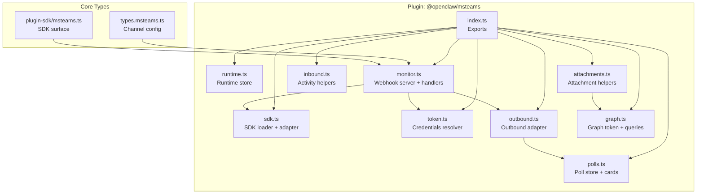
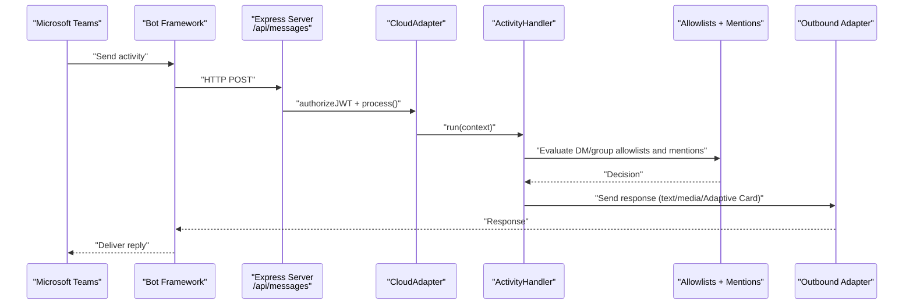
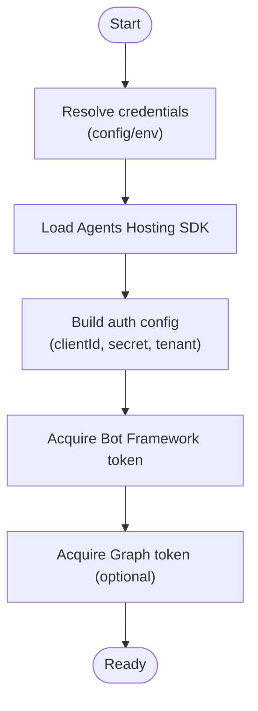
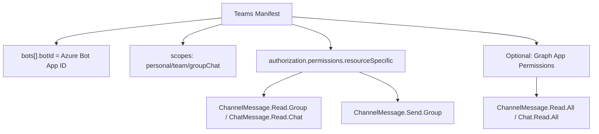
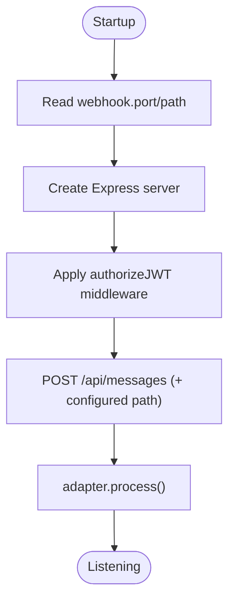
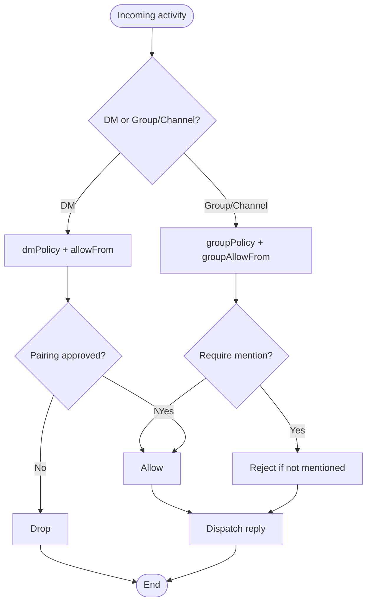
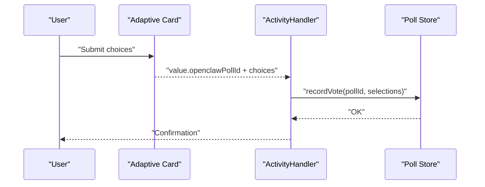
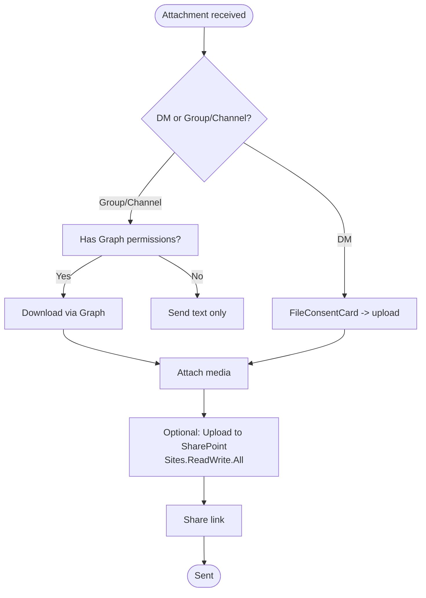
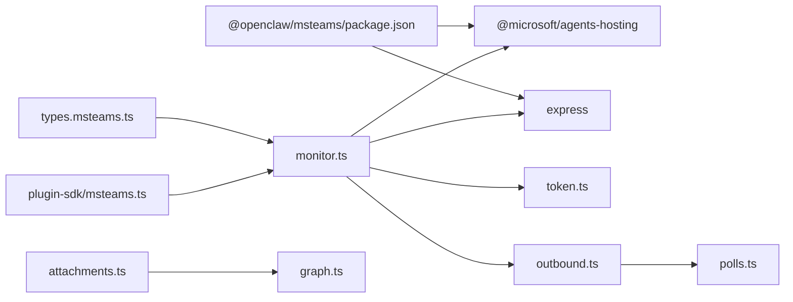

# Microsoft Teams Channel

<cite>
**Referenced Files in This Document**
- [docs/channels/msteams.md](file://docs/channels/msteams.md)
- [extensions/msteams/src/index.ts](file://extensions/msteams/src/index.ts)
- [extensions/msteams/src/runtime.ts](file://extensions/msteams/src/runtime.ts)
- [extensions/msteams/src/sdk.ts](file://extensions/msteams/src/sdk.ts)
- [extensions/msteams/src/token.ts](file://extensions/msteams/src/token.ts)
- [extensions/msteams/src/monitor.ts](file://extensions/msteams/src/monitor.ts)
- [extensions/msteams/src/inbound.ts](file://extensions/msteams/src/inbound.ts)
- [extensions/msteams/src/outbound.ts](file://extensions/msteams/src/outbound.ts)
- [extensions/msteams/src/polls.ts](file://extensions/msteams/src/polls.ts)
- [extensions/msteams/src/attachments.ts](file://extensions/msteams/src/attachments.ts)
- [extensions/msteams/src/graph.ts](file://extensions/msteams/src/graph.ts)
- [src/config/types.msteams.ts](file://src/config/types.msteams.ts)
- [src/plugin-sdk/msteams.ts](file://src/plugin-sdk/msteams.ts)
- [extensions/msteams/package.json](file://extensions/msteams/package.json)
- [extensions/msteams/openclaw.plugin.json](file://extensions/msteams/openclaw.plugin.json)
</cite>

## Table of Contents
1. [Introduction](#introduction)
2. [Project Structure](#project-structure)
3. [Core Components](#core-components)
4. [Architecture Overview](#architecture-overview)
5. [Detailed Component Analysis](#detailed-component-analysis)
6. [Dependency Analysis](#dependency-analysis)
7. [Performance Considerations](#performance-considerations)
8. [Troubleshooting Guide](#troubleshooting-guide)
9. [Conclusion](#conclusion)
10. [Appendices](#appendices)

## Introduction
This document explains the Microsoft Teams channel integration built as an OpenClaw plugin. It covers Azure Bot Service setup, Bot Framework authentication, Teams app manifest configuration, permissions, bot triggers, and Adaptive Card support. It also documents webhook endpoints, configuration, and enterprise security and compliance considerations such as tenant scoping, Graph permissions, and SharePoint file uploads.

## Project Structure
The Teams channel is implemented as a plugin with a clear separation of concerns:
- SDK bootstrap and authentication
- HTTP webhook server and Bot Framework adapter
- Inbound/outbound message handling
- Attachment downloading and Graph integration
- Polls and Adaptive Cards
- Configuration types and plugin metadata

**Diagram sources**
- [extensions/msteams/src/index.ts](file://extensions/msteams/src/index.ts#L1-L5)
- [extensions/msteams/src/runtime.ts](file://extensions/msteams/src/runtime.ts#L1-L7)
- [extensions/msteams/src/sdk.ts](file://extensions/msteams/src/sdk.ts#L1-L34)
- [extensions/msteams/src/token.ts](file://extensions/msteams/src/token.ts#L1-L41)
- [extensions/msteams/src/monitor.ts](file://extensions/msteams/src/monitor.ts#L1-L346)
- [extensions/msteams/src/inbound.ts](file://extensions/msteams/src/inbound.ts#L1-L49)
- [extensions/msteams/src/outbound.ts](file://extensions/msteams/src/outbound.ts#L1-L54)
- [extensions/msteams/src/polls.ts](file://extensions/msteams/src/polls.ts#L1-L316)
- [extensions/msteams/src/attachments.ts](file://extensions/msteams/src/attachments.ts#L1-L19)
- [extensions/msteams/src/graph.ts](file://extensions/msteams/src/graph.ts#L1-L82)
- [src/config/types.msteams.ts](file://src/config/types.msteams.ts#L1-L120)
- [src/plugin-sdk/msteams.ts](file://src/plugin-sdk/msteams.ts#L1-L122)

**Section sources**
- [extensions/msteams/src/index.ts](file://extensions/msteams/src/index.ts#L1-L5)
- [extensions/msteams/src/monitor.ts](file://extensions/msteams/src/monitor.ts#L1-L346)
- [src/config/types.msteams.ts](file://src/config/types.msteams.ts#L1-L120)

## Core Components
- Authentication and SDK
  - Loads the Microsoft Agents Hosting SDK and constructs an adapter with MSAL-based credentials.
  - Provides credential resolution from config or environment variables.
- Webhook server
  - Starts an Express server, registers a Bot Framework-compatible endpoint, and applies timeouts.
  - Uses JWT authorization middleware provided by the SDK.
- Inbound/outbound adapters
  - Parses Teams activities, normalizes mentions and timestamps, and enforces allowlists and mention gating.
  - Sends text, media, and Adaptive Card-based polls; chunks markdown text appropriately.
- Graph integration
  - Acquires Graph tokens and performs lookups for users, teams, and channels.
  - Downloads media and builds Graph URLs for attachments.
- Polls and Adaptive Cards
  - Generates Adaptive Card-based polls and persists votes locally.
- Configuration
  - Rich channel configuration supports DM/group policies, per-team/per-channel overrides, reply styles, and media limits.

**Section sources**
- [extensions/msteams/src/sdk.ts](file://extensions/msteams/src/sdk.ts#L1-L34)
- [extensions/msteams/src/token.ts](file://extensions/msteams/src/token.ts#L1-L41)
- [extensions/msteams/src/monitor.ts](file://extensions/msteams/src/monitor.ts#L247-L345)
- [extensions/msteams/src/inbound.ts](file://extensions/msteams/src/inbound.ts#L1-L49)
- [extensions/msteams/src/outbound.ts](file://extensions/msteams/src/outbound.ts#L1-L54)
- [extensions/msteams/src/graph.ts](file://extensions/msteams/src/graph.ts#L52-L82)
- [extensions/msteams/src/polls.ts](file://extensions/msteams/src/polls.ts#L136-L214)
- [src/config/types.msteams.ts](file://src/config/types.msteams.ts#L46-L120)

## Architecture Overview
The Teams channel runs as a plugin that exposes a webhook endpoint to receive Bot Framework activities, validates requests, and routes events to handlers that enforce policies and produce responses.

**Diagram sources**
- [extensions/msteams/src/monitor.ts](file://extensions/msteams/src/monitor.ts#L270-L301)
- [extensions/msteams/src/sdk.ts](file://extensions/msteams/src/sdk.ts#L22-L27)
- [extensions/msteams/src/outbound.ts](file://extensions/msteams/src/outbound.ts#L6-L53)

## Detailed Component Analysis

### Azure Bot Service and OAuth2 Authentication
- Single-tenant Azure Bot registration is required for new deployments.
- Credentials (App ID, App Password, Tenant ID) are resolved from configuration or environment variables.
- The SDK’s MsalTokenProvider obtains access tokens for Bot Framework and Microsoft Graph.
- The webhook endpoint is protected by JWT authorization using the SDK’s middleware.

**Diagram sources**
- [extensions/msteams/src/token.ts](file://extensions/msteams/src/token.ts#L22-L40)
- [extensions/msteams/src/sdk.ts](file://extensions/msteams/src/sdk.ts#L29-L33)
- [extensions/msteams/src/monitor.ts](file://extensions/msteams/src/monitor.ts#L250-L255)

**Section sources**
- [docs/channels/msteams.md](file://docs/channels/msteams.md#L151-L193)
- [extensions/msteams/src/token.ts](file://extensions/msteams/src/token.ts#L14-L40)
- [extensions/msteams/src/sdk.ts](file://extensions/msteams/src/sdk.ts#L11-L27)
- [extensions/msteams/src/monitor.ts](file://extensions/msteams/src/monitor.ts#L280-L280)

### Teams App Manifest and RSC Permissions
- The manifest must declare the bot with the Azure Bot App ID and appropriate scopes (personal, team, groupChat).
- Resource-Specific Consent (RSC) permissions enable real-time channel/group message reads/sends within the installed context.
- For historical access and downloadable attachments, Microsoft Graph Application permissions are required.

**Diagram sources**
- [docs/channels/msteams.md](file://docs/channels/msteams.md#L293-L359)
- [docs/channels/msteams.md](file://docs/channels/msteams.md#L417-L428)

**Section sources**
- [docs/channels/msteams.md](file://docs/channels/msteams.md#L293-L359)
- [docs/channels/msteams.md](file://docs/channels/msteams.md#L417-L428)

### Webhook Endpoints and Security
- The plugin listens on a configurable port and path, with a fallback to the standard Bot Framework path.
- Requests are authorized using the SDK’s JWT middleware.
- Timeouts are tuned to prevent stale connections and improve reliability under load.

**Diagram sources**
- [extensions/msteams/src/monitor.ts](file://extensions/msteams/src/monitor.ts#L234-L301)
- [extensions/msteams/src/monitor.ts](file://extensions/msteams/src/monitor.ts#L49-L63)

**Section sources**
- [extensions/msteams/src/monitor.ts](file://extensions/msteams/src/monitor.ts#L234-L301)
- [extensions/msteams/src/monitor.ts](file://extensions/msteams/src/monitor.ts#L49-L63)

### Team/Group/Channel Permissions and Triggers
- DMs: controlled by dmPolicy and allowFrom; default pairing-based gating.
- Groups/Channels: controlled by groupPolicy and groupAllowFrom; mention gating enforced by default.
- Per-team/per-channel overrides allow fine-grained control over requireMention and replyStyle.
- Conversation IDs are normalized and used for session routing.

**Diagram sources**
- [extensions/msteams/src/inbound.ts](file://extensions/msteams/src/inbound.ts#L41-L48)
- [src/config/types.msteams.ts](file://src/config/types.msteams.ts#L68-L119)

**Section sources**
- [src/config/types.msteams.ts](file://src/config/types.msteams.ts#L68-L119)
- [extensions/msteams/src/inbound.ts](file://extensions/msteams/src/inbound.ts#L41-L48)

### Adaptive Cards and Polls
- Polls are rendered as Adaptive Cards with multi-select support when maxSelections > 1.
- Votes are captured from submitted Action.Submit payloads and persisted to a local store.
- Arbitrary Adaptive Cards can be sent via the outbound adapter.

**Diagram sources**
- [extensions/msteams/src/polls.ts](file://extensions/msteams/src/polls.ts#L97-L134)
- [extensions/msteams/src/polls.ts](file://extensions/msteams/src/polls.ts#L299-L312)

**Section sources**
- [extensions/msteams/src/outbound.ts](file://extensions/msteams/src/outbound.ts#L31-L52)
- [extensions/msteams/src/polls.ts](file://extensions/msteams/src/polls.ts#L136-L214)

### Attachments, Media, and SharePoint File Uploads
- DM file attachments are handled via Teams bot file APIs.
- Channel/group attachments are HTML stubs in webhooks; Graph permissions are required to download actual content.
- For sending files in group chats/channels, configure a SharePoint site ID and Graph permissions (Sites.ReadWrite.All, optionally Chat.Read.All).
- Media downloads are restricted to allowlisted hosts; authorization headers are attached only for allowlisted hosts.

**Diagram sources**
- [docs/channels/msteams.md](file://docs/channels/msteams.md#L531-L597)
- [extensions/msteams/src/graph.ts](file://extensions/msteams/src/graph.ts#L52-L67)
- [extensions/msteams/src/attachments.ts](file://extensions/msteams/src/attachments.ts#L1-L19)

**Section sources**
- [docs/channels/msteams.md](file://docs/channels/msteams.md#L531-L597)
- [extensions/msteams/src/graph.ts](file://extensions/msteams/src/graph.ts#L52-L67)
- [extensions/msteams/src/attachments.ts](file://extensions/msteams/src/attachments.ts#L1-L19)

### Enterprise Security, Compliance, and Tenant Considerations
- Single-tenant Azure Bot is required for new deployments; multi-tenant creation is deprecated.
- RSC permissions are scoped to the installed context; Graph permissions require admin consent.
- Use allowlists and mention gating to minimize blast radius; disable config writes if needed.
- Media allowlists and auth allowlists restrict where content can be fetched from and when credentials are attached.
- Private channels may have limited webhook support; prefer standard channels or DMs for bot interactions.

**Section sources**
- [docs/channels/msteams.md](file://docs/channels/msteams.md#L169-L169)
- [docs/channels/msteams.md](file://docs/channels/msteams.md#L293-L428)
- [docs/channels/msteams.md](file://docs/channels/msteams.md#L727-L744)

## Dependency Analysis
The plugin depends on the Microsoft Agents Hosting SDK and Express. It integrates with OpenClaw’s plugin SDK surface for configuration, security, and channel utilities.

**Diagram sources**
- [extensions/msteams/package.json](file://extensions/msteams/package.json#L6-L9)
- [extensions/msteams/src/monitor.ts](file://extensions/msteams/src/monitor.ts#L248-L255)
- [extensions/msteams/src/outbound.ts](file://extensions/msteams/src/outbound.ts#L1-L5)
- [extensions/msteams/src/polls.ts](file://extensions/msteams/src/polls.ts#L1-L3)
- [extensions/msteams/src/attachments.ts](file://extensions/msteams/src/attachments.ts#L1-L5)
- [extensions/msteams/src/graph.ts](file://extensions/msteams/src/graph.ts#L1-L5)
- [src/config/types.msteams.ts](file://src/config/types.msteams.ts#L1-L120)
- [src/plugin-sdk/msteams.ts](file://src/plugin-sdk/msteams.ts#L1-L122)

**Section sources**
- [extensions/msteams/package.json](file://extensions/msteams/package.json#L6-L9)
- [src/plugin-sdk/msteams.ts](file://src/plugin-sdk/msteams.ts#L1-L122)

## Performance Considerations
- Webhook timeouts are tuned to reduce idle connections and improve responsiveness.
- Large payloads are rejected with 413; tune mediaMaxMb and textChunkLimit to balance throughput and safety.
- Graph calls are optional; enabling them adds latency but unlocks historical access and downloadable content.
- Consider rate-limiting and backpressure if integrating with external LLMs or APIs.

[No sources needed since this section provides general guidance]

## Troubleshooting Guide
- Webhook 401 Unauthorized: Expected when testing manually; use Azure Web Chat to validate endpoint reachability and auth.
- Manifest upload errors: Ensure icons are valid PNGs and webApplicationInfo.id matches the Azure Bot App ID.
- RSC permissions not working: Reinstall the app, confirm correct scope, and check org admin policies.
- Private channels: Prefer standard channels or DMs; use Graph for historical access if needed.

**Section sources**
- [docs/channels/msteams.md](file://docs/channels/msteams.md#L745-L777)

## Conclusion
The Microsoft Teams channel plugin integrates tightly with Bot Framework and Teams RSC permissions, offering robust DM and group/channel support. With optional Graph permissions, it can download media and access message history. Administrators should focus on tenant-scoped credentials, RSC permissions, and secure allowlists to meet enterprise needs.

[No sources needed since this section summarizes without analyzing specific files]

## Appendices

### Configuration Reference
Key configuration keys for the Teams channel include:
- enable/disable, appId, appPassword, tenantId, webhook.port/path
- dmPolicy, allowFrom, groupPolicy, groupAllowFrom
- requireMention, replyStyle, teams.* overrides
- mediaAllowHosts, mediaAuthAllowHosts, mediaMaxMb
- sharePointSiteId for file uploads in group chats/channels

**Section sources**
- [src/config/types.msteams.ts](file://src/config/types.msteams.ts#L46-L120)

### Plugin Metadata
- Channel ID: msteams
- Docs path: /channels/msteams
- Aliases: teams
- Installation sources: npm registry or local path

**Section sources**
- [extensions/msteams/openclaw.plugin.json](file://extensions/msteams/openclaw.plugin.json#L1-L10)
- [extensions/msteams/package.json](file://extensions/msteams/package.json#L10-L30)