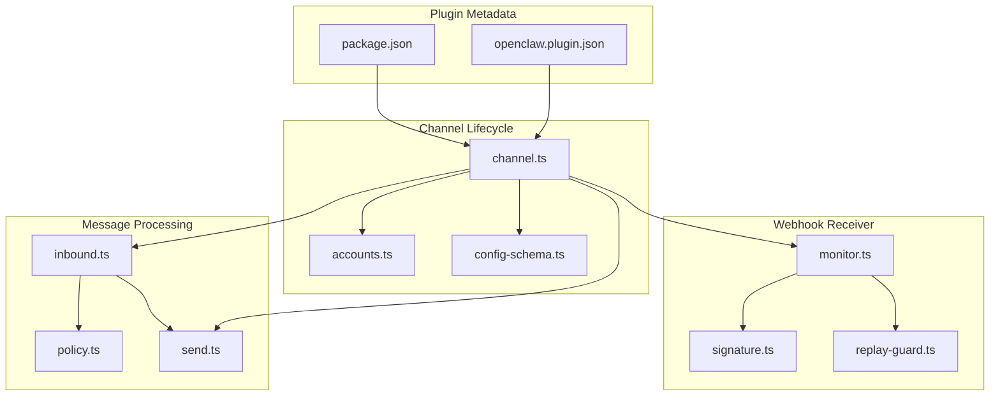
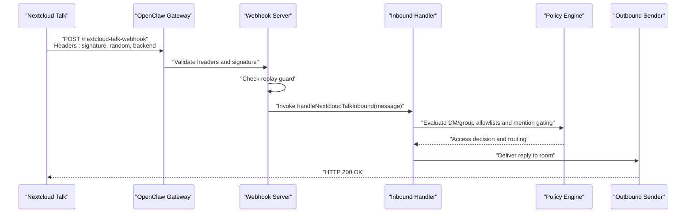
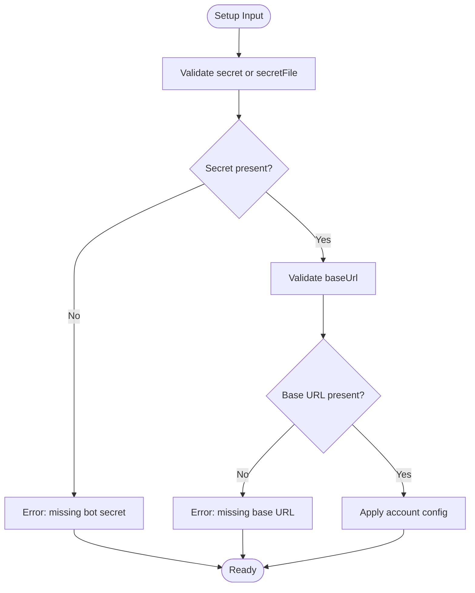
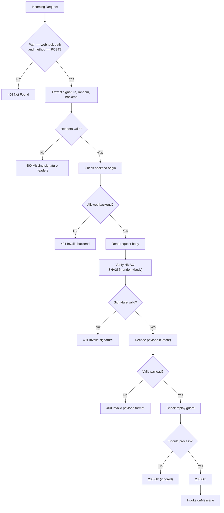
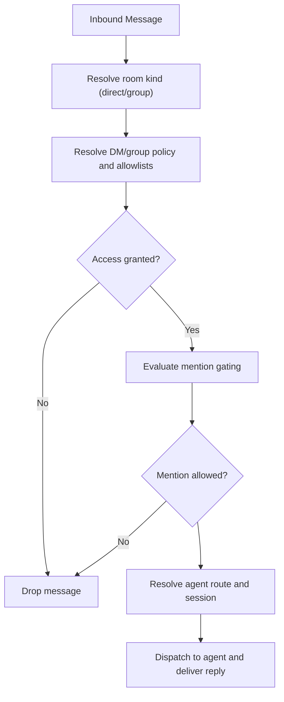
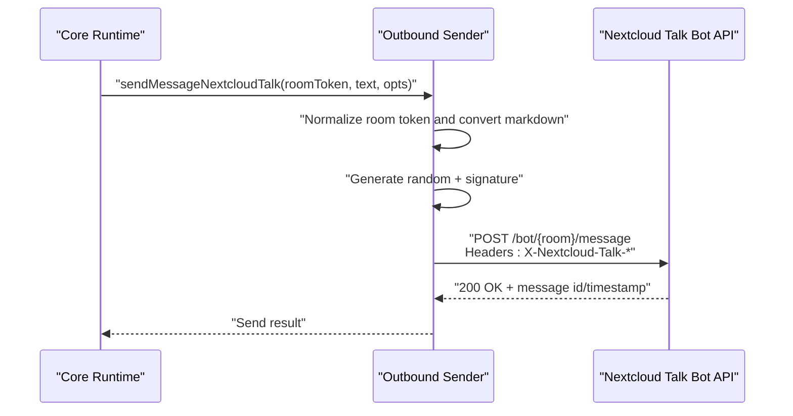
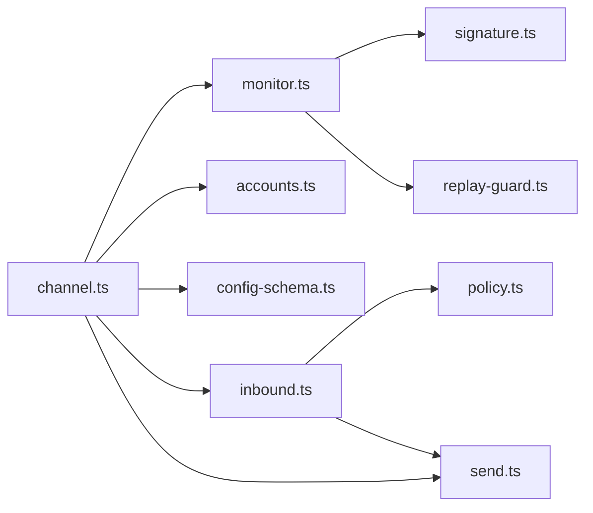

# Nextcloud Talk Channel

<cite>
**Referenced Files in This Document**
- [package.json](file://extensions/nextcloud-talk/package.json)
- [openclaw.plugin.json](file://extensions/nextcloud-talk/openclaw.plugin.json)
- [channel.ts](file://extensions/nextcloud-talk/src/channel.ts)
- [monitor.ts](file://extensions/nextcloud-talk/src/monitor.ts)
- [config-schema.ts](file://extensions/nextcloud-talk/src/config-schema.ts)
- [inbound.ts](file://extensions/nextcloud-talk/src/inbound.ts)
- [send.ts](file://extensions/nextcloud-talk/src/send.ts)
- [signature.ts](file://extensions/nextcloud-talk/src/signature.ts)
- [policy.ts](file://extensions/nextcloud-talk/src/policy.ts)
- [replay-guard.ts](file://extensions/nextcloud-talk/src/replay-guard.ts)
- [accounts.ts](file://extensions/nextcloud-talk/src/accounts.ts)
- [nextcloud-talk.md](file://docs/channels/nextcloud-talk.md)
</cite>

## Table of Contents
1. [Introduction](#introduction)
2. [Project Structure](#project-structure)
3. [Core Components](#core-components)
4. [Architecture Overview](#architecture-overview)
5. [Detailed Component Analysis](#detailed-component-analysis)
6. [Dependency Analysis](#dependency-analysis)
7. [Performance Considerations](#performance-considerations)
8. [Troubleshooting Guide](#troubleshooting-guide)
9. [Conclusion](#conclusion)
10. [Appendices](#appendices)

## Introduction
This document explains how the Nextcloud Talk channel integration works in the OpenClaw system. It covers self-hosted chat setup, webhook configuration, authentication, room management, user permissions, and integration with the Nextcloud ecosystem. It also provides setup procedures for Nextcloud instances and the Talk app, security considerations, deployment options, and enterprise features.

## Project Structure
The Nextcloud Talk channel is implemented as a plugin with a clear separation of concerns:
- Plugin metadata and installation descriptors
- Channel lifecycle and configuration
- Webhook receiver and signature verification
- Inbound message processing and access control
- Outbound message sending and reaction support
- Policy evaluation for rooms and users
- Replay protection and account resolution

**Diagram sources**
- [package.json](file://extensions/nextcloud-talk/package.json#L1-L34)
- [openclaw.plugin.json](file://extensions/nextcloud-talk/openclaw.plugin.json#L1-L10)
- [channel.ts](file://extensions/nextcloud-talk/src/channel.ts#L1-L417)
- [monitor.ts](file://extensions/nextcloud-talk/src/monitor.ts#L1-L416)
- [config-schema.ts](file://extensions/nextcloud-talk/src/config-schema.ts#L1-L75)
- [inbound.ts](file://extensions/nextcloud-talk/src/inbound.ts#L1-L319)
- [send.ts](file://extensions/nextcloud-talk/src/send.ts#L1-L217)
- [signature.ts](file://extensions/nextcloud-talk/src/signature.ts#L1-L73)
- [policy.ts](file://extensions/nextcloud-talk/src/policy.ts#L1-L189)
- [replay-guard.ts](file://extensions/nextcloud-talk/src/replay-guard.ts#L1-L66)
- [accounts.ts](file://extensions/nextcloud-talk/src/accounts.ts#L1-L157)

**Section sources**
- [package.json](file://extensions/nextcloud-talk/package.json#L1-L34)
- [openclaw.plugin.json](file://extensions/nextcloud-talk/openclaw.plugin.json#L1-L10)
- [channel.ts](file://extensions/nextcloud-talk/src/channel.ts#L1-L417)

## Core Components
- Channel plugin definition and capabilities
  - Defines channel metadata, pairing rules, capabilities, and configuration schema.
  - Supports direct messages, rooms, reactions, and markdown.
- Webhook receiver
  - Validates headers, signature, and payload; filters replays; invokes inbound handler.
- Inbound processing
  - Applies DM/group policies, mentions gating, routing, and dispatching to agents.
- Outbound sending
  - Sends messages and reactions to Nextcloud Talk rooms via bot API.
- Security and replay protection
  - HMAC-SHA256 signatures, backend origin checks, and replay deduplication.
- Configuration and accounts
  - Multi-account support, credential resolution, and environment overrides.

**Section sources**
- [channel.ts](file://extensions/nextcloud-talk/src/channel.ts#L60-L417)
- [monitor.ts](file://extensions/nextcloud-talk/src/monitor.ts#L179-L416)
- [inbound.ts](file://extensions/nextcloud-talk/src/inbound.ts#L53-L319)
- [send.ts](file://extensions/nextcloud-talk/src/send.ts#L59-L217)
- [signature.ts](file://extensions/nextcloud-talk/src/signature.ts#L8-L73)
- [replay-guard.ts](file://extensions/nextcloud-talk/src/replay-guard.ts#L41-L66)
- [config-schema.ts](file://extensions/nextcloud-talk/src/config-schema.ts#L14-L75)
- [accounts.ts](file://extensions/nextcloud-talk/src/accounts.ts#L112-L150)

## Architecture Overview
The integration uses a webhook-based architecture:
- Nextcloud Talk posts Create events to the OpenClaw webhook endpoint.
- The webhook server validates authenticity and deduplicates messages.
- Inbound messages are evaluated against DM and group policies, mention gating, and routing rules.
- Outbound replies are sent back to Nextcloud Talk via the bot API with signed requests.

**Diagram sources**
- [monitor.ts](file://extensions/nextcloud-talk/src/monitor.ts#L195-L271)
- [inbound.ts](file://extensions/nextcloud-talk/src/inbound.ts#L53-L319)
- [send.ts](file://extensions/nextcloud-talk/src/send.ts#L59-L171)
- [signature.ts](file://extensions/nextcloud-talk/src/signature.ts#L12-L35)

## Detailed Component Analysis

### Channel Plugin and Setup
- Channel identity and capabilities
  - Self-hosted chat via webhook bots; supports DMs, rooms, reactions, and markdown.
  - Pairing-based DM policy by default; allows open DMs with wildcard allowlist.
- Setup inputs and validation
  - Requires base URL and bot secret (or secret file/env).
  - Supports named accounts and default account with environment override.
- Configuration schema
  - Includes provider-level and per-account options, DM/group policies, allowlists, rooms, and webhook settings.

**Diagram sources**
- [channel.ts](file://extensions/nextcloud-talk/src/channel.ts#L201-L265)
- [config-schema.ts](file://extensions/nextcloud-talk/src/config-schema.ts#L25-L47)

**Section sources**
- [channel.ts](file://extensions/nextcloud-talk/src/channel.ts#L41-L120)
- [channel.ts](file://extensions/nextcloud-talk/src/channel.ts#L192-L265)
- [config-schema.ts](file://extensions/nextcloud-talk/src/config-schema.ts#L25-L75)

### Webhook Receiver and Authentication
- Endpoint configuration
  - Default host, port, and path; optional public URL for reverse proxies.
- Header validation
  - Extracts signature, random, and backend headers; rejects missing or mismatched backend origin.
- Signature verification
  - Uses HMAC-SHA256 over random + body with the shared secret.
- Body handling and errors
  - Enforces size limits and timeouts; responds with structured errors.

**Diagram sources**
- [monitor.ts](file://extensions/nextcloud-talk/src/monitor.ts#L195-L271)
- [signature.ts](file://extensions/nextcloud-talk/src/signature.ts#L40-L73)
- [replay-guard.ts](file://extensions/nextcloud-talk/src/replay-guard.ts#L54-L64)

**Section sources**
- [monitor.ts](file://extensions/nextcloud-talk/src/monitor.ts#L23-L130)
- [monitor.ts](file://extensions/nextcloud-talk/src/monitor.ts#L179-L301)
- [signature.ts](file://extensions/nextcloud-talk/src/signature.ts#L8-L73)
- [replay-guard.ts](file://extensions/nextcloud-talk/src/replay-guard.ts#L41-L66)

### Inbound Processing and Access Control
- Room detection
  - Treats all as group initially; uses optional API credentials to detect DMs when available.
- Policies and allowlists
  - DM policy: pairing, allowlist, open, disabled.
  - Group policy: allowlist (default), open, disabled.
  - Per-room overrides and wildcard support.
- Mention gating
  - Optional requirement to mention the bot in rooms; controlled per room or wildcard.
- Routing and dispatch
  - Resolves agent routes and session keys; formats envelopes; delivers replies.

**Diagram sources**
- [inbound.ts](file://extensions/nextcloud-talk/src/inbound.ts#L73-L195)
- [policy.ts](file://extensions/nextcloud-talk/src/policy.ts#L57-L92)
- [policy.ts](file://extensions/nextcloud-talk/src/policy.ts#L170-L189)

**Section sources**
- [inbound.ts](file://extensions/nextcloud-talk/src/inbound.ts#L53-L319)
- [policy.ts](file://extensions/nextcloud-talk/src/policy.ts#L17-L189)

### Outbound Sending and Reactions
- Message sending
  - Converts markdown tables, signs message body, and posts to bot API endpoint.
- Reaction sending
  - Signs reaction string and posts to reaction endpoint.
- Error handling
  - Parses HTTP errors and provides actionable messages.

**Diagram sources**
- [send.ts](file://extensions/nextcloud-talk/src/send.ts#L59-L171)
- [signature.ts](file://extensions/nextcloud-talk/src/signature.ts#L62-L73)

**Section sources**
- [send.ts](file://extensions/nextcloud-talk/src/send.ts#L59-L217)
- [signature.ts](file://extensions/nextcloud-talk/src/signature.ts#L62-L73)

### Configuration Reference
- Provider-level options
  - Enable/disable, base URL, bot secret, API user/password for room lookups, webhook host/port/path/public URL, DM/group policies, allowlists, rooms, history limits, text chunking, streaming blocking, media caps.
- Account-level options
  - Same as provider-level with per-account overrides and default account behavior.

**Section sources**
- [config-schema.ts](file://extensions/nextcloud-talk/src/config-schema.ts#L14-L75)
- [nextcloud-talk.md](file://docs/channels/nextcloud-talk.md#L109-L139)

## Dependency Analysis
- Internal dependencies
  - Channel plugin depends on monitor, signature, replay guard, policy, and send modules.
  - Inbound processing depends on policy and send modules.
- External dependencies
  - Uses Node.js HTTP server, crypto, and Zod for validation.
  - Integrates with Nextcloud Talk bot API endpoints.

**Diagram sources**
- [channel.ts](file://extensions/nextcloud-talk/src/channel.ts#L1-L417)
- [monitor.ts](file://extensions/nextcloud-talk/src/monitor.ts#L1-L416)
- [inbound.ts](file://extensions/nextcloud-talk/src/inbound.ts#L1-L319)
- [send.ts](file://extensions/nextcloud-talk/src/send.ts#L1-L217)
- [signature.ts](file://extensions/nextcloud-talk/src/signature.ts#L1-L73)
- [policy.ts](file://extensions/nextcloud-talk/src/policy.ts#L1-L189)
- [replay-guard.ts](file://extensions/nextcloud-talk/src/replay-guard.ts#L1-L66)
- [accounts.ts](file://extensions/nextcloud-talk/src/accounts.ts#L1-L157)
- [config-schema.ts](file://extensions/nextcloud-talk/src/config-schema.ts#L1-L75)

**Section sources**
- [channel.ts](file://extensions/nextcloud-talk/src/channel.ts#L1-L417)
- [monitor.ts](file://extensions/nextcloud-talk/src/monitor.ts#L1-L416)
- [inbound.ts](file://extensions/nextcloud-talk/src/inbound.ts#L1-L319)
- [send.ts](file://extensions/nextcloud-talk/src/send.ts#L1-L217)

## Performance Considerations
- Webhook server
  - Tune webhookPort, webhookHost, webhookPath, and webhookPublicUrl for your environment.
  - Adjust max body bytes and timeouts as needed.
- Message chunking
  - Configure textChunkLimit and chunkMode to balance throughput and readability.
- Replay protection
  - TTL and storage sizes are configurable to manage disk usage and memory footprint.
- Network
  - Ensure low-latency connectivity between the gateway and Nextcloud Talk instance.

[No sources needed since this section provides general guidance]

## Troubleshooting Guide
- Common webhook errors
  - Missing signature headers, invalid backend origin, invalid signature, invalid payload format, payload too large, internal server error.
- Authentication failures
  - 401 Unauthorized indicates incorrect bot secret; verify shared secret and environment variable usage.
- Room not found
  - 404 indicates invalid room token; confirm room token and permissions.
- Forbidden
  - 403 indicates insufficient permissions in the room; ensure bot is enabled and has required rights.
- Pairing and allowlists
  - For DMs, use pairing approvals or configure open DMs with wildcard allowlist.
  - For rooms, configure groupPolicy and allowlists; verify mention gating settings.

**Section sources**
- [monitor.ts](file://extensions/nextcloud-talk/src/monitor.ts#L29-L36)
- [send.ts](file://extensions/nextcloud-talk/src/send.ts#L124-L137)
- [nextcloud-talk.md](file://docs/channels/nextcloud-talk.md#L70-L97)

## Conclusion
The Nextcloud Talk channel integrates self-hosted chat via a secure webhook-based architecture. It supports robust access controls, room management, and outbound messaging with reactions. Proper configuration of the Nextcloud Talk bot, webhook endpoints, and OpenClaw policies ensures reliable and secure communication.

[No sources needed since this section summarizes without analyzing specific files]

## Appendices

### Setup Procedures
- Install the Nextcloud Talk plugin and configure the Nextcloud Talk bot with a shared secret and webhook URL.
- Set baseUrl and botSecret in OpenClaw configuration or use NEXTCLOUD_TALK_BOT_SECRET for the default account.
- Enable the bot in target rooms and restart the gateway.

**Section sources**
- [nextcloud-talk.md](file://docs/channels/nextcloud-talk.md#L16-L47)

### Security Considerations
- Use strong shared secrets and environment variables for credential management.
- Restrict webhookPublicUrl to trusted networks or reverse proxies with authentication.
- Monitor webhook logs and apply allowlists for DMs and rooms.
- Consider enabling API user/password for room-type lookups to improve DM detection.

**Section sources**
- [signature.ts](file://extensions/nextcloud-talk/src/signature.ts#L8-L35)
- [monitor.ts](file://extensions/nextcloud-talk/src/monitor.ts#L94-L130)
- [nextcloud-talk.md](file://docs/channels/nextcloud-talk.md#L63-L69)

### Enterprise Features
- Multi-account support for separate environments or tenants.
- Persistent replay protection with configurable TTL and storage.
- Flexible policy models for DMs and rooms with per-room overrides.
- Environment-driven configuration for secure deployments.

**Section sources**
- [accounts.ts](file://extensions/nextcloud-talk/src/accounts.ts#L112-L150)
- [replay-guard.ts](file://extensions/nextcloud-talk/src/replay-guard.ts#L41-L66)
- [config-schema.ts](file://extensions/nextcloud-talk/src/config-schema.ts#L25-L75)