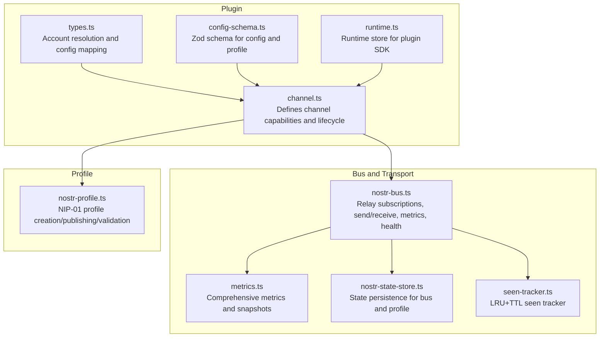
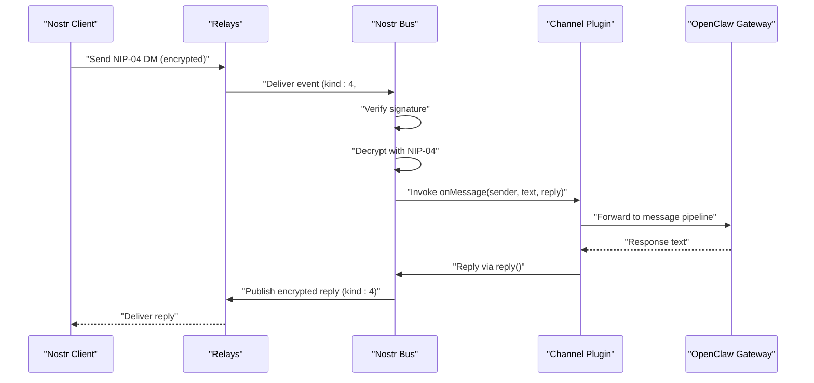
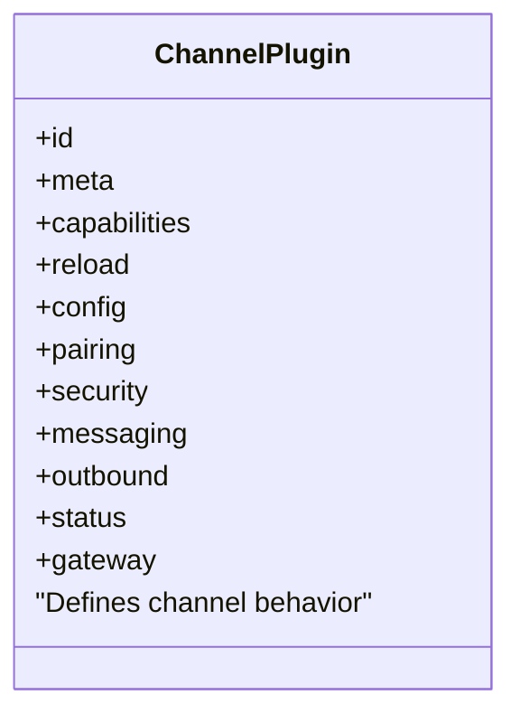
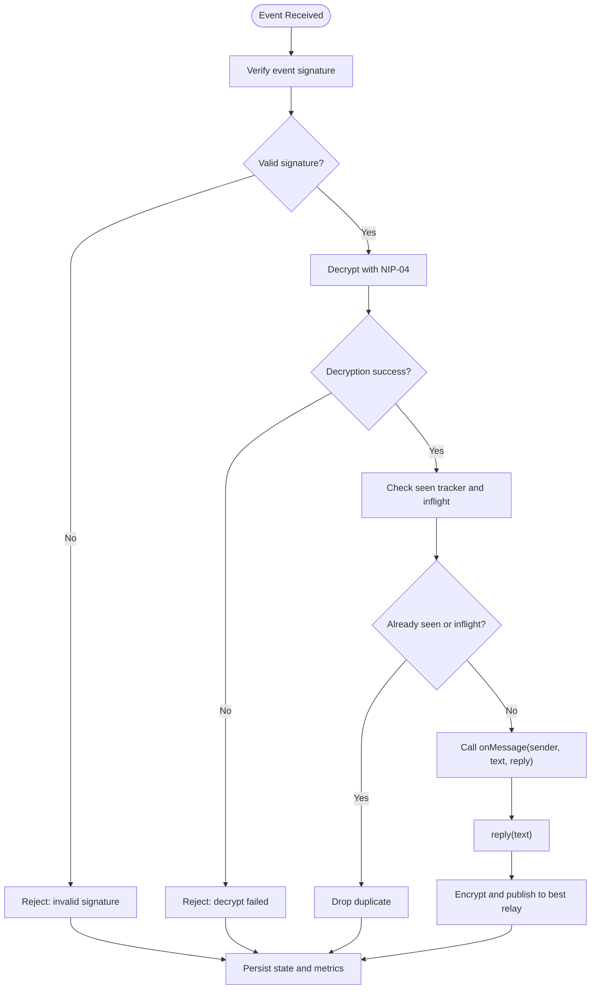
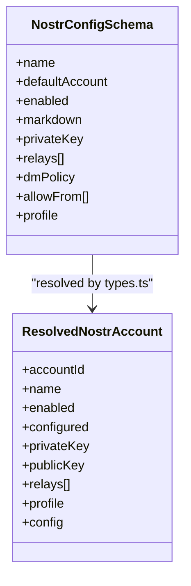
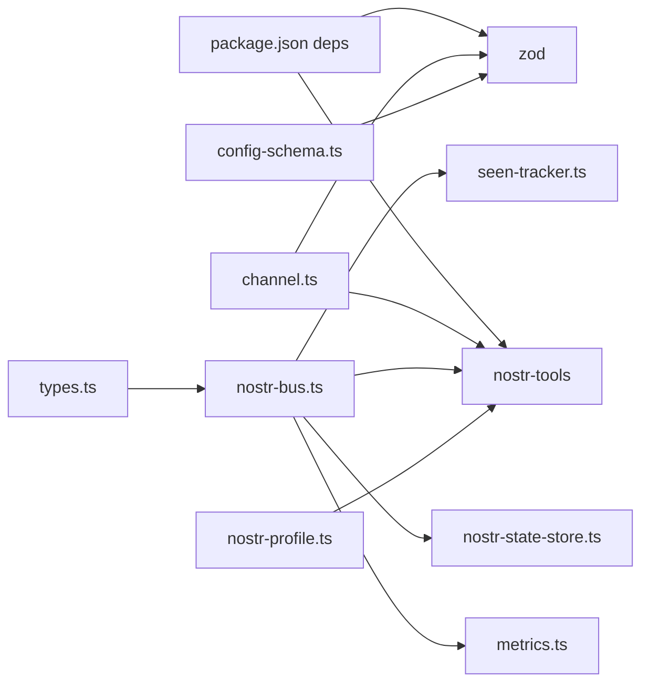

# Nostr Channel

<cite>
**Referenced Files in This Document**
- [docs/channels/nostr.md](file://docs/channels/nostr.md)
- [extensions/nostr/package.json](file://extensions/nostr/package.json)
- [extensions/nostr/openclaw.plugin.json](file://extensions/nostr/openclaw.plugin.json)
- [extensions/nostr/src/channel.ts](file://extensions/nostr/src/channel.ts)
- [extensions/nostr/src/nostr-bus.ts](file://extensions/nostr/src/nostr-bus.ts)
- [extensions/nostr/src/config-schema.ts](file://extensions/nostr/src/config-schema.ts)
- [extensions/nostr/src/types.ts](file://extensions/nostr/src/types.ts)
- [extensions/nostr/src/runtime.ts](file://extensions/nostr/src/runtime.ts)
- [extensions/nostr/src/nostr-profile.ts](file://extensions/nostr/src/nostr-profile.ts)
- [extensions/nostr/src/metrics.ts](file://extensions/nostr/src/metrics.ts)
- [extensions/nostr/src/nostr-state-store.ts](file://extensions/nostr/src/nostr-state-store.ts)
- [extensions/nostr/src/seen-tracker.ts](file://extensions/nostr/src/seen-tracker.ts)
</cite>

## Table of Contents
1. [Introduction](#introduction)
2. [Project Structure](#project-structure)
3. [Core Components](#core-components)
4. [Architecture Overview](#architecture-overview)
5. [Detailed Component Analysis](#detailed-component-analysis)
6. [Dependency Analysis](#dependency-analysis)
7. [Performance Considerations](#performance-considerations)
8. [Troubleshooting Guide](#troubleshooting-guide)
9. [Privacy and Censorship Resistance](#privacy-and-censorship-resistance)
10. [Conclusion](#conclusion)

## Introduction
This document explains the Nostr channel integration that delivers decentralized, encrypted direct messages (DMs) via NIP-04. It covers key generation, relay configuration, encrypted message handling, client setup, event signing, relay selection, and operational guidance. It also includes troubleshooting for relay connectivity, privacy considerations, and how the decentralized architecture enhances censorship resistance.

## Project Structure
The Nostr channel is implemented as a plugin with a clear separation of concerns:
- Channel plugin entry and capability definition
- Nostr bus for connecting to relays, subscribing to DMs, and publishing replies
- Configuration schema and account resolution
- Metrics and observability
- State persistence for resiliency across restarts
- Profile publishing (NIP-01 kind:0)
- Seen tracker for deduplication and memory control

**Diagram sources**
- [extensions/nostr/src/channel.ts](file://extensions/nostr/src/channel.ts#L29-L287)
- [extensions/nostr/src/types.ts](file://extensions/nostr/src/types.ts#L11-L116)
- [extensions/nostr/src/config-schema.ts](file://extensions/nostr/src/config-schema.ts#L59-L94)
- [extensions/nostr/src/runtime.ts](file://extensions/nostr/src/runtime.ts#L1-L7)
- [extensions/nostr/src/nostr-bus.ts](file://extensions/nostr/src/nostr-bus.ts#L321-L589)
- [extensions/nostr/src/metrics.ts](file://extensions/nostr/src/metrics.ts#L157-L424)
- [extensions/nostr/src/nostr-state-store.ts](file://extensions/nostr/src/nostr-state-store.ts#L95-L158)
- [extensions/nostr/src/seen-tracker.ts](file://extensions/nostr/src/seen-tracker.ts#L44-L289)
- [extensions/nostr/src/nostr-profile.ts](file://extensions/nostr/src/nostr-profile.ts#L127-L224)

**Section sources**
- [extensions/nostr/src/channel.ts](file://extensions/nostr/src/channel.ts#L29-L287)
- [extensions/nostr/src/nostr-bus.ts](file://extensions/nostr/src/nostr-bus.ts#L321-L589)
- [extensions/nostr/src/config-schema.ts](file://extensions/nostr/src/config-schema.ts#L59-L94)
- [extensions/nostr/src/types.ts](file://extensions/nostr/src/types.ts#L11-L116)
- [extensions/nostr/src/metrics.ts](file://extensions/nostr/src/metrics.ts#L157-L424)
- [extensions/nostr/src/nostr-state-store.ts](file://extensions/nostr/src/nostr-state-store.ts#L95-L158)
- [extensions/nostr/src/seen-tracker.ts](file://extensions/nostr/src/seen-tracker.ts#L44-L289)
- [extensions/nostr/src/nostr-profile.ts](file://extensions/nostr/src/nostr-profile.ts#L127-L224)

## Core Components
- Channel plugin: defines capabilities (direct messages only), configuration schema, security policy, messaging target normalization, outbound send, and lifecycle hooks.
- Nostr bus: manages relay connections, subscription filters, decryption, reply publishing, circuit breakers, relay health scoring, and metrics.
- Configuration and types: validates and normalizes keys and pubkeys, resolves accounts, and exposes profile schema.
- Metrics: comprehensive counters and snapshots for observability.
- State store: persists last processed timestamps and recent event IDs to avoid replay and resume efficiently.
- Seen tracker: LRU+TTL mechanism to prevent duplicate processing and bound memory usage.
- Profile publisher: creates and publishes NIP-01 kind:0 events with monotonic timestamps.

**Section sources**
- [extensions/nostr/src/channel.ts](file://extensions/nostr/src/channel.ts#L29-L287)
- [extensions/nostr/src/nostr-bus.ts](file://extensions/nostr/src/nostr-bus.ts#L321-L589)
- [extensions/nostr/src/config-schema.ts](file://extensions/nostr/src/config-schema.ts#L59-L94)
- [extensions/nostr/src/types.ts](file://extensions/nostr/src/types.ts#L11-L116)
- [extensions/nostr/src/metrics.ts](file://extensions/nostr/src/metrics.ts#L157-L424)
- [extensions/nostr/src/nostr-state-store.ts](file://extensions/nostr/src/nostr-state-store.ts#L95-L158)
- [extensions/nostr/src/seen-tracker.ts](file://extensions/nostr/src/seen-tracker.ts#L44-L289)
- [extensions/nostr/src/nostr-profile.ts](file://extensions/nostr/src/nostr-profile.ts#L127-L224)

## Architecture Overview
The Nostr channel integrates with the OpenClaw gateway through a channel plugin. The plugin starts a Nostr bus per account that:
- Subscribes to NIP-04 DMs filtered by the bot’s pubkey
- Verifies signatures, decrypts messages, deduplicates, and forwards to the gateway
- Publishes replies back to the sender using NIP-04 encryption
- Tracks relay health and applies circuit breakers to handle failures gracefully
- Persists state to avoid replay and resumes efficiently after restarts

**Diagram sources**
- [extensions/nostr/src/nostr-bus.ts](file://extensions/nostr/src/nostr-bus.ts#L402-L489)
- [extensions/nostr/src/channel.ts](file://extensions/nostr/src/channel.ts#L211-L229)
- [extensions/nostr/src/nostr-bus.ts](file://extensions/nostr/src/nostr-bus.ts#L598-L658)

**Section sources**
- [extensions/nostr/src/channel.ts](file://extensions/nostr/src/channel.ts#L187-L286)
- [extensions/nostr/src/nostr-bus.ts](file://extensions/nostr/src/nostr-bus.ts#L321-L589)

## Detailed Component Analysis

### Channel Plugin (capability, config, security, messaging, outbound)
- Capabilities: supports direct messages only (MVP), no media attachments.
- Configuration: builds a schema around private key, relays, DM policy, allowlist, and profile metadata.
- Security: resolves DM policy and allow-from entries; normalizes pubkeys and formats pairing hints.
- Messaging: normalizes targets (npub/hex/nostr: URI); identifies direct message targets.
- Outbound: sends NIP-04 DMs; converts markdown tables to a channel-specific format; returns a synthetic message ID.

**Diagram sources**
- [extensions/nostr/src/channel.ts](file://extensions/nostr/src/channel.ts#L29-L287)

**Section sources**
- [extensions/nostr/src/channel.ts](file://extensions/nostr/src/channel.ts#L29-L287)
- [extensions/nostr/src/config-schema.ts](file://extensions/nostr/src/config-schema.ts#L59-L94)
- [extensions/nostr/src/types.ts](file://extensions/nostr/src/types.ts#L75-L116)

### Nostr Bus (subscription, decryption, reply, health, metrics)
- Subscription: filters for kind:4 events targeting the bot’s pubkey; respects a computed since timestamp to avoid stale messages.
- Decryption: uses NIP-04 to decrypt content; rejects invalid or undecryptable messages.
- Reply: constructs and signs NIP-04 DMs; publishes to relays ordered by health and circuit breaker state.
- Health and resilience: tracks relay success/failure, latency, and applies circuit breakers to avoid cascading failures.
- Metrics: emits granular counters for events, relays, decryption, memory, and rate limiting.

**Diagram sources**
- [extensions/nostr/src/nostr-bus.ts](file://extensions/nostr/src/nostr-bus.ts#L402-L489)
- [extensions/nostr/src/nostr-bus.ts](file://extensions/nostr/src/nostr-bus.ts#L598-L658)

**Section sources**
- [extensions/nostr/src/nostr-bus.ts](file://extensions/nostr/src/nostr-bus.ts#L321-L589)
- [extensions/nostr/src/metrics.ts](file://extensions/nostr/src/metrics.ts#L157-L424)

### Configuration and Types (schema, normalization, account resolution)
- Schema: enforces HTTPS URLs for profile images and website; validates pubkey formats; supports allowlist entries as strings or numbers.
- Normalization: validates and normalizes private keys (nsec or hex) and pubkeys (npub or hex).
- Account resolution: computes default account IDs, lists configured accounts, and resolves per-account settings.

**Diagram sources**
- [extensions/nostr/src/config-schema.ts](file://extensions/nostr/src/config-schema.ts#L59-L94)
- [extensions/nostr/src/types.ts](file://extensions/nostr/src/types.ts#L75-L116)

**Section sources**
- [extensions/nostr/src/config-schema.ts](file://extensions/nostr/src/config-schema.ts#L1-L94)
- [extensions/nostr/src/types.ts](file://extensions/nostr/src/types.ts#L11-L116)

### Metrics and Observability
- Event metrics: counts received, processed, duplicates, and rejections by reason.
- Relay metrics: connect/disconnect/reconnect, error counts, message types, and circuit breaker state transitions.
- Decrypt metrics: success/failure counters.
- Memory metrics: seen tracker size and rate limiter entries.
- Snapshot: aggregates counters into a structured snapshot for status reporting.

**Section sources**
- [extensions/nostr/src/metrics.ts](file://extensions/nostr/src/metrics.ts#L157-L424)

### State Persistence and Replay Prevention
- Bus state: stores last processed timestamp, gateway start timestamp, and recent event IDs to prevent replay across restarts.
- Profile state: tracks last published timestamp, event ID, and per-relay results for monotonic ordering and auditing.
- Since computation: chooses the most recent timestamp to minimize redundant fetches.

**Section sources**
- [extensions/nostr/src/nostr-state-store.ts](file://extensions/nostr/src/nostr-state-store.ts#L95-L158)

### Seen Tracker (LRU + TTL)
- Maintains a bounded set of event IDs with LRU eviction and TTL expiration.
- Supports seeding from persisted IDs to avoid restart replays.
- Prevents memory growth under sustained loads.

**Section sources**
- [extensions/nostr/src/seen-tracker.ts](file://extensions/nostr/src/seen-tracker.ts#L44-L289)

### Profile Publishing (NIP-01)
- Converts profile data to NIP-01 content, validates HTTPS URLs, and creates a signed kind:0 event with monotonic timestamps.
- Publishes in parallel to relays with timeouts and records per-relay results.
- Persists profile state for auditing and monotonic ordering.

**Section sources**
- [extensions/nostr/src/nostr-profile.ts](file://extensions/nostr/src/nostr-profile.ts#L127-L224)
- [extensions/nostr/src/nostr-state-store.ts](file://extensions/nostr/src/nostr-state-store.ts#L187-L226)

## Dependency Analysis
The plugin depends on:
- nostr-tools for cryptographic operations (signing, verification, encryption/decryption) and relay pooling
- zod for configuration validation
- Internal runtime store for SDK integration

**Diagram sources**
- [extensions/nostr/package.json](file://extensions/nostr/package.json#L6-L9)
- [extensions/nostr/src/channel.ts](file://extensions/nostr/src/channel.ts#L1-L21)
- [extensions/nostr/src/nostr-bus.ts](file://extensions/nostr/src/nostr-bus.ts#L1-L26)
- [extensions/nostr/src/nostr-profile.ts](file://extensions/nostr/src/nostr-profile.ts#L8-L9)
- [extensions/nostr/src/config-schema.ts](file://extensions/nostr/src/config-schema.ts#L1-L2)

**Section sources**
- [extensions/nostr/package.json](file://extensions/nostr/package.json#L6-L9)
- [extensions/nostr/src/channel.ts](file://extensions/nostr/src/channel.ts#L1-L21)
- [extensions/nostr/src/nostr-bus.ts](file://extensions/nostr/src/nostr-bus.ts#L1-L26)
- [extensions/nostr/src/nostr-profile.ts](file://extensions/nostr/src/nostr-profile.ts#L8-L9)
- [extensions/nostr/src/config-schema.ts](file://extensions/nostr/src/config-schema.ts#L1-L2)

## Performance Considerations
- Relay health scoring prioritizes reliable relays to reduce latency and failures.
- Circuit breakers prevent cascading failures by temporarily skipping failing relays.
- Deduplication via seen tracker and inflight set avoids redundant processing.
- Debounced state persistence reduces I/O overhead during bursts.
- Monotonic timestamps for profile publishing ensure deterministic ordering.

[No sources needed since this section provides general guidance]

## Troubleshooting Guide
Common issues and remedies:
- Not receiving messages
  - Validate private key format and correctness.
  - Ensure relay URLs are reachable; use secure WebSocket for remote relays and local plain WebSocket only for local testing.
  - Confirm the channel is enabled.
  - Review gateway logs for relay connection errors.
- Not sending responses
  - Verify relays accept writes and outbound connectivity is intact.
  - Watch for relay rate limits indicated by metrics.
- Duplicate responses
  - Expected when multiple relays are used; messages are deduplicated by event ID; only the first delivery triggers a response.
- Private key exposure risk
  - Never commit private keys; use environment variables.
  - Prefer allowlist for production deployments.

**Section sources**
- [docs/channels/nostr.md](file://docs/channels/nostr.md#L203-L234)
- [extensions/nostr/src/nostr-bus.ts](file://extensions/nostr/src/nostr-bus.ts#L402-L489)
- [extensions/nostr/src/metrics.ts](file://extensions/nostr/src/metrics.ts#L157-L424)

## Privacy and Censorship Resistance
- Decentralized architecture
  - Relays are independent; the bot can choose multiple relays to avoid single points of failure.
  - Users can self-host or select trusted relays.
- Encrypted DMs (NIP-04)
  - Messages are end-to-end encrypted; only sender and recipient can read them.
- Access control
  - Pairing mode issues pairing codes for unknown senders.
  - Allowlist restricts DMs to trusted pubkeys.
  - Open mode allows public DMs with explicit allowlist configuration.
- Censorship resistance
  - Multiple relays reduce the impact of individual relay shutdowns or content moderation.
  - Profiles (NIP-01) are replaceable; latest content supersedes older ones.

**Section sources**
- [docs/channels/nostr.md](file://docs/channels/nostr.md#L115-L175)
- [extensions/nostr/src/nostr-bus.ts](file://extensions/nostr/src/nostr-bus.ts#L321-L589)
- [extensions/nostr/src/nostr-profile.ts](file://extensions/nostr/src/nostr-profile.ts#L127-L224)

## Conclusion
The Nostr channel provides a robust, decentralized, and privacy-preserving path for encrypted DMs using NIP-04. Its architecture emphasizes reliability through relay health scoring and circuit breakers, resilience via state persistence and deduplication, and transparency via comprehensive metrics. With flexible access controls and a clear plugin integration, it fits seamlessly into the OpenClaw ecosystem while leveraging the decentralized strengths of the Nostr protocol.