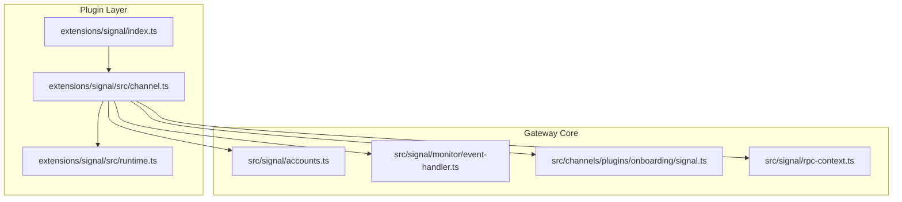
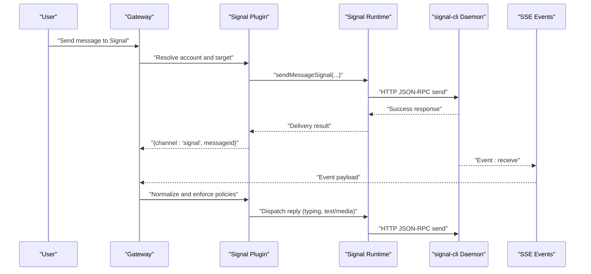
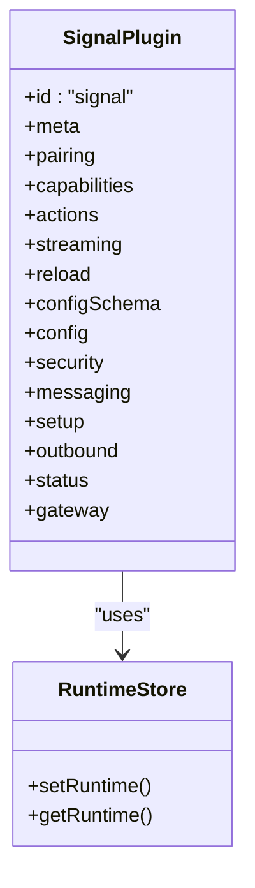
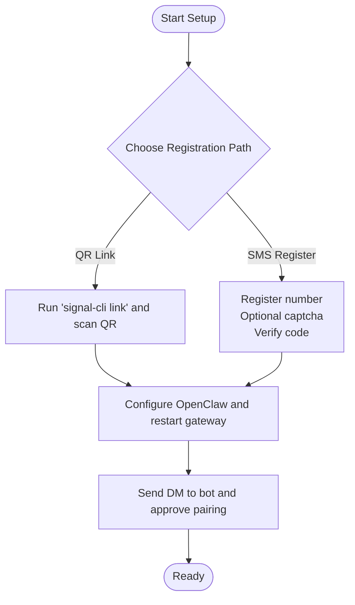
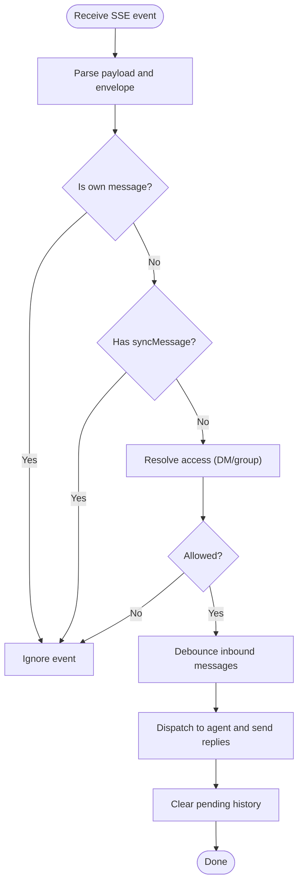
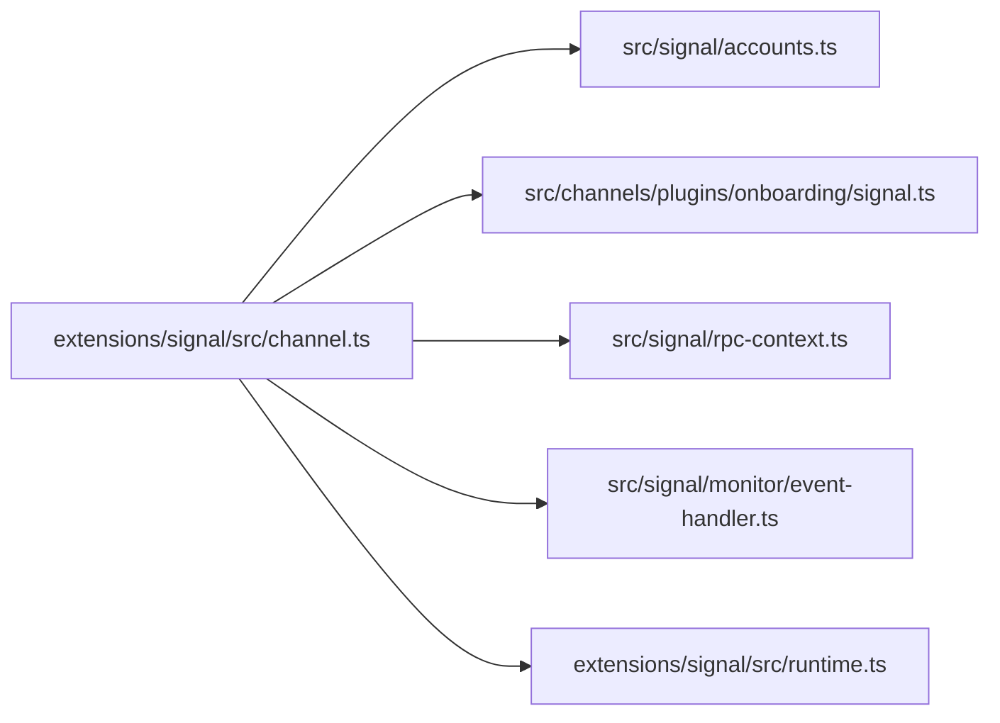

# Signal Channel

<cite>
**Referenced Files in This Document**
- [index.ts](file://extensions/signal/index.ts)
- [package.json](file://extensions/signal/package.json)
- [channel.ts](file://extensions/signal/src/channel.ts)
- [runtime.ts](file://extensions/signal/src/runtime.ts)
- [signal.md](file://docs/channels/signal.md)
- [accounts.ts](file://src/signal/accounts.ts)
- [event-handler.ts](file://src/signal/monitor/event-handler.ts)
- [signal.ts](file://src/channels/plugins/onboarding/signal.ts)
- [rpc-context.ts](file://src/signal/rpc-context.ts)
</cite>

## Table of Contents
1. [Introduction](#introduction)
2. [Project Structure](#project-structure)
3. [Core Components](#core-components)
4. [Architecture Overview](#architecture-overview)
5. [Detailed Component Analysis](#detailed-component-analysis)
6. [Dependency Analysis](#dependency-analysis)
7. [Performance Considerations](#performance-considerations)
8. [Troubleshooting Guide](#troubleshooting-guide)
9. [Conclusion](#conclusion)
10. [Appendices](#appendices)

## Introduction
This document explains the Signal channel integration powered by signal-cli. It covers phone number registration, QR device pairing, message handling, group creation, attachment support, and encryption considerations. It also provides setup procedures, configuration references, privacy features, message threading, and compliance guidance.

## Project Structure
The Signal channel is implemented as an OpenClaw plugin that registers a channel adapter and delegates runtime operations to a shared plugin SDK. The plugin integrates with the gateway’s monitoring and message pipeline to deliver inbound/outbound messaging via signal-cli over HTTP JSON-RPC + SSE.

**Diagram sources**
- [index.ts](file://extensions/signal/index.ts#L1-L18)
- [channel.ts](file://extensions/signal/src/channel.ts#L1-L324)
- [runtime.ts](file://extensions/signal/src/runtime.ts#L1-L7)
- [accounts.ts](file://src/signal/accounts.ts#L1-L70)
- [event-handler.ts](file://src/signal/monitor/event-handler.ts#L1-L790)
- [signal.ts](file://src/channels/plugins/onboarding/signal.ts#L1-L245)
- [rpc-context.ts](file://src/signal/rpc-context.ts#L1-L24)

**Section sources**
- [index.ts](file://extensions/signal/index.ts#L1-L18)
- [package.json](file://extensions/signal/package.json#L1-L13)

## Core Components
- Plugin registration: The plugin module exports a plugin descriptor that registers the Signal channel with the gateway runtime.
- Channel adapter: Implements outbound messaging, security policies, targeting, setup, and status collection.
- Runtime store: Provides a plugin runtime store for the Signal channel to access shared utilities and adapters.
- Onboarding adapter: Guides users through signal-cli detection, account setup, and device pairing.
- Account resolution: Resolves per-account configuration and base URL for signal-cli daemon.
- Event handler: Processes inbound events from signal-cli SSE, normalizes messages, enforces access policies, and dispatches replies.

**Section sources**
- [channel.ts](file://extensions/signal/src/channel.ts#L105-L324)
- [runtime.ts](file://extensions/signal/src/runtime.ts#L1-L7)
- [signal.ts](file://src/channels/plugins/onboarding/signal.ts#L108-L244)
- [accounts.ts](file://src/signal/accounts.ts#L35-L69)
- [event-handler.ts](file://src/signal/monitor/event-handler.ts#L451-L789)

## Architecture Overview
The Signal channel runs signal-cli as a daemon and communicates with it over HTTP JSON-RPC. The gateway subscribes to SSE events to receive inbound messages. Outbound messages are sent via the runtime’s message adapters. Security and access policies are enforced at the gateway layer.

**Diagram sources**
- [channel.ts](file://extensions/signal/src/channel.ts#L259-L286)
- [event-handler.ts](file://src/signal/monitor/event-handler.ts#L451-L789)
- [rpc-context.ts](file://src/signal/rpc-context.ts#L4-L24)

## Detailed Component Analysis

### Plugin Registration and Channel Adapter
- Registration: The plugin module registers the Signal channel with the gateway runtime and sets the plugin runtime store.
- Channel capabilities: Supports direct and group chats, media, and reactions.
- Outbound: Text and media sending with configurable chunking and media limits.
- Security: DM and group policies with allowlists and pairing-based approval for DMs.
- Messaging: Target normalization and resolver for E.164, UUID, group IDs, and username hints.
- Setup: Validates inputs and applies account-scoped configuration (account, CLI path, HTTP URL/host/port).
- Status: Probes daemon availability and builds runtime snapshots.

**Diagram sources**
- [channel.ts](file://extensions/signal/src/channel.ts#L105-L324)
- [runtime.ts](file://extensions/signal/src/runtime.ts#L4-L6)

**Section sources**
- [index.ts](file://extensions/signal/index.ts#L6-L15)
- [channel.ts](file://extensions/signal/src/channel.ts#L105-L324)

### Device Pairing and Authentication
- QR link mode: Use signal-cli link to pair a device to the Signal account.
- SMS registration: Dedicated number registration with optional captcha and verification.
- Access control: Default DM policy is pairing; unknown senders receive a pairing code and must be approved.
- Pairing approval: Gateway sends an approval message upon successful pairing.

**Diagram sources**
- [signal.md](file://docs/channels/signal.md#L19-L157)
- [signal.ts](file://src/channels/plugins/onboarding/signal.ts#L127-L241)

**Section sources**
- [signal.md](file://docs/channels/signal.md#L19-L157)
- [signal.ts](file://src/channels/plugins/onboarding/signal.ts#L108-L244)

### Message Handling and Threading
- Inbound processing: Parses SSE events, filters out sync messages from the bot’s own account, resolves sender identity, and enforces DM/group access policies.
- Debouncing: Combines rapid successive messages into a single inbound context.
- Group context: Builds history context from recent group messages to inform agent replies.
- Reply dispatch: Starts typing indicators, sends replies, and clears pending history entries after dispatch.
- Read receipts: Optionally forwards read receipts for DMs when supported.

**Diagram sources**
- [event-handler.ts](file://src/signal/monitor/event-handler.ts#L451-L789)

**Section sources**
- [event-handler.ts](file://src/signal/monitor/event-handler.ts#L100-L323)
- [event-handler.ts](file://src/signal/monitor/event-handler.ts#L325-L370)

### Group Creation, Mentions, and Reactions
- Group creation: Managed by Signal; OpenClaw routes replies to group identifiers and maintains group histories.
- Mentions: Not natively supported by Signal; OpenClaw uses mention patterns and gating to require explicit mentions in group contexts.
- Reactions: Supported via message actions; reactions can be sent to DMs or group messages with optional removal.

**Section sources**
- [signal.md](file://docs/channels/signal.md#L194-L243)
- [event-handler.ts](file://src/signal/monitor/event-handler.ts#L622-L644)

### Attachment Support and Limits
- Attachments: Downloaded from signal-cli when present; supports multiple attachments with MIME-kind summaries.
- Limits: Configurable media caps and chunking for outbound text; newline chunking mode available.
- Ignore attachments: Option to skip downloading media to reduce bandwidth and storage usage.

**Section sources**
- [signal.md](file://docs/channels/signal.md#L206-L214)
- [event-handler.ts](file://src/signal/monitor/event-handler.ts#L689-L734)

### Encryption Considerations
- Local storage: signal-cli stores account keys locally; back up before migration or rebuild.
- Account separation: Use a dedicated bot number to avoid de-authenticating the primary Signal app session.
- Policy enforcement: Keep DM policy at pairing unless broader access is explicitly required.

**Section sources**
- [signal.md](file://docs/channels/signal.md#L287-L293)

### Privacy Features and Compliance
- Pairing-based DM access: Unknown senders must be approved; codes expire after one hour.
- Allowlists: Configure allowFrom lists for DMs and group triggers; wildcard support varies by policy.
- History limits: Control group and DM history included in context to minimize data retention.
- Read receipts: Optional forwarding for DMs; not supported for group read receipts.

**Section sources**
- [signal.md](file://docs/channels/signal.md#L182-L219)
- [channel.ts](file://extensions/signal/src/channel.ts#L158-L183)

## Dependency Analysis
The Signal plugin depends on shared SDK utilities for configuration scoping, account resolution, and messaging adapters. The runtime store centralizes access to channel-specific helpers.

**Diagram sources**
- [channel.ts](file://extensions/signal/src/channel.ts#L1-L34)
- [accounts.ts](file://src/signal/accounts.ts#L1-L70)
- [signal.ts](file://src/channels/plugins/onboarding/signal.ts#L1-L14)
- [rpc-context.ts](file://src/signal/rpc-context.ts#L1-L24)
- [event-handler.ts](file://src/signal/monitor/event-handler.ts#L1-L59)
- [runtime.ts](file://extensions/signal/src/runtime.ts#L1-L7)

**Section sources**
- [channel.ts](file://extensions/signal/src/channel.ts#L1-L34)

## Performance Considerations
- Startup: Auto-spawn daemon or external daemon mode; tune startup timeout for slow environments.
- Chunking: Adjust textChunkLimit and chunkMode to balance throughput and readability.
- Debouncing: Inbound debouncing reduces redundant agent invocations for bursty messages.
- Media: Limit mediaMaxMb and optionally ignore attachments to control resource usage.

[No sources needed since this section provides general guidance]

## Troubleshooting Guide
- Verify daemon reachability and account settings; confirm httpUrl/account and receive mode.
- Check pairing approvals for unknown DM senders.
- Review group gating and allowlists for group messages.
- Run diagnostic commands to probe channel status and review logs.

**Section sources**
- [signal.md](file://docs/channels/signal.md#L251-L286)

## Conclusion
The Signal channel integrates signal-cli via HTTP JSON-RPC + SSE, providing robust DM and group messaging with strong access controls, media support, and flexible configuration. Following the setup paths and security recommendations ensures reliable operation and compliance with privacy expectations.

[No sources needed since this section summarizes without analyzing specific files]

## Appendices

### Setup Procedures
- Install signal-cli and choose QR link or SMS registration.
- Configure OpenClaw with account, CLI path, and optional HTTP URL/host/port.
- Approve pairing for DM senders and verify channel status.

**Section sources**
- [signal.md](file://docs/channels/signal.md#L20-L157)

### Configuration Reference (selected fields)
- channels.signal.enabled: Enable/disable channel startup.
- channels.signal.account: E.164 for the bot account.
- channels.signal.cliPath: Path to signal-cli.
- channels.signal.httpUrl/httpHost/httpPort: Daemon binding.
- channels.signal.autoStart/startupTimeoutMs: Daemon lifecycle and startup wait.
- channels.signal.receiveMode: Receive mode selection.
- channels.signal.ignoreAttachments/mediaMaxMb: Attachment behavior and limits.
- channels.signal.dmPolicy/groupPolicy: Access control modes.
- channels.signal.allowFrom/groupAllowFrom: Allowlists for DMs/groups.
- channels.signal.historyLimit/dmHistoryLimit: Group and DM history context limits.
- channels.signal.textChunkLimit/chunkMode: Outbound text chunking.
- channels.signal.sendReadReceipts: Forward read receipts for DMs.

**Section sources**
- [signal.md](file://docs/channels/signal.md#L294-L326)