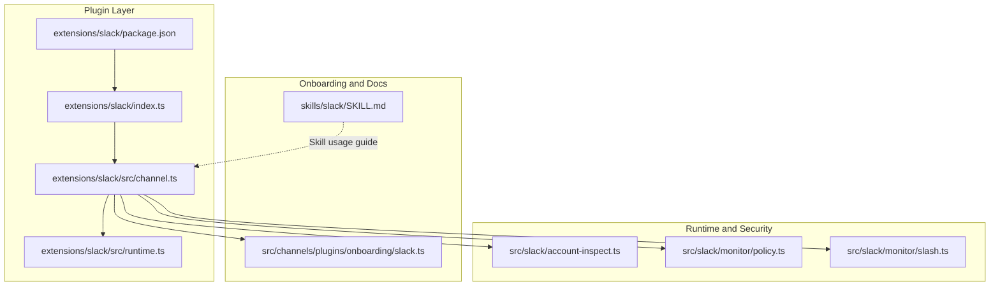
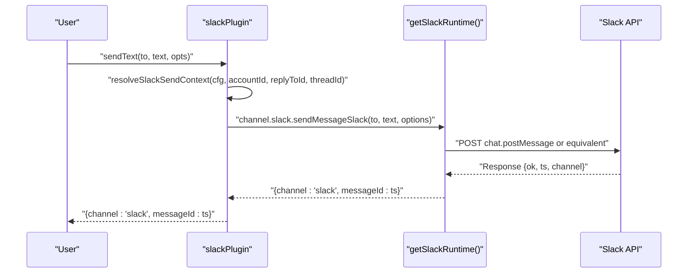
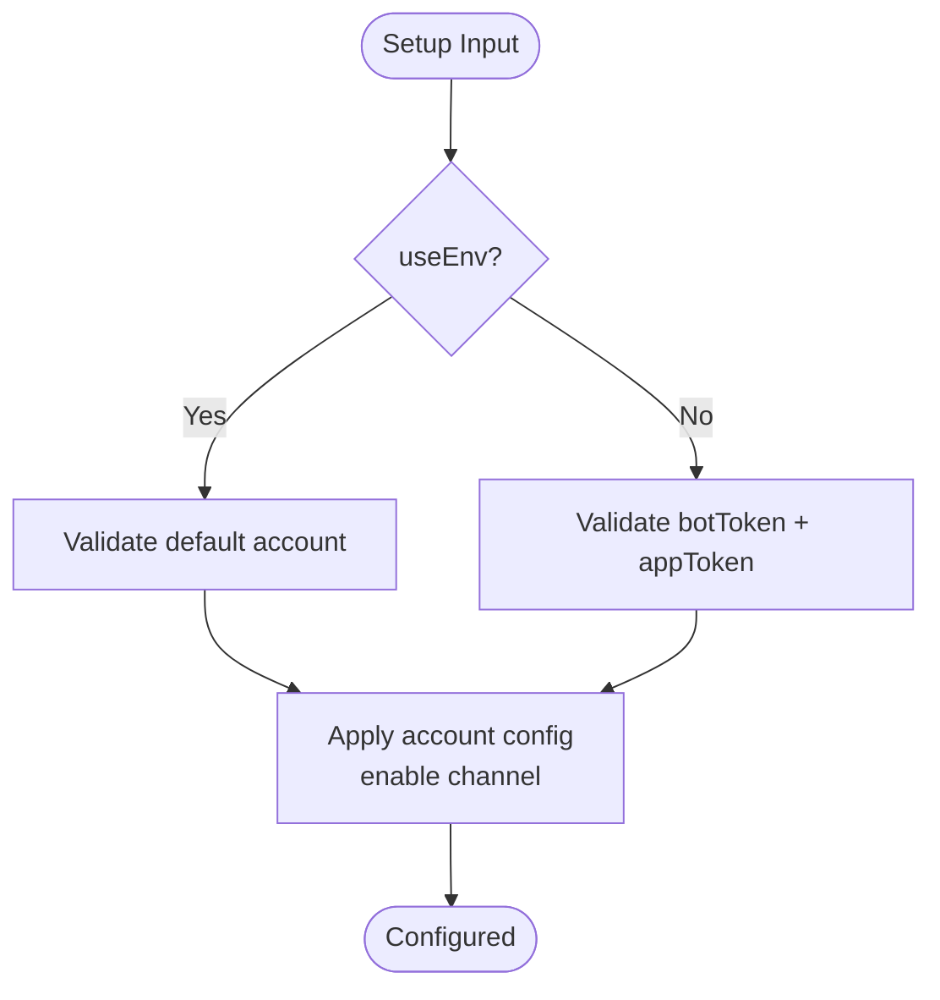
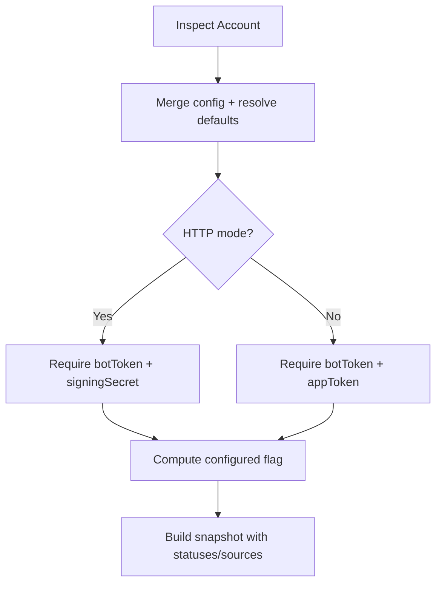
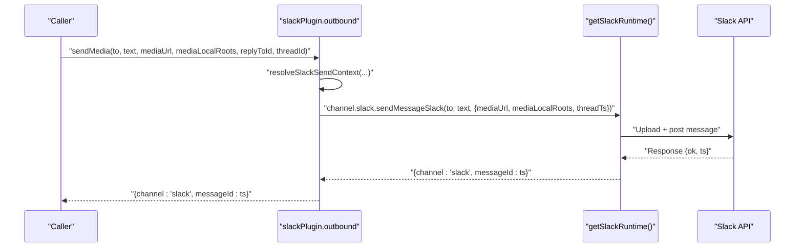
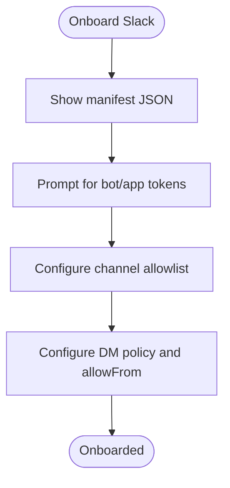
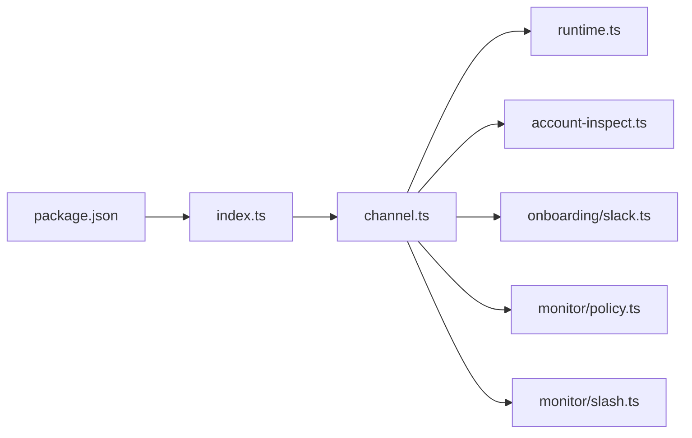

# Slack Channel

<cite>
**Referenced Files in This Document**
- [index.ts](file://extensions/slack/index.ts)
- [package.json](file://extensions/slack/package.json)
- [channel.ts](file://extensions/slack/src/channel.ts)
- [runtime.ts](file://extensions/slack/src/runtime.ts)
- [channel.test.ts](file://extensions/slack/src/channel.test.ts)
- [SKILL.md](file://skills/slack/SKILL.md)
- [account-inspect.ts](file://src/slack/account-inspect.ts)
- [slack.ts](file://src/channels/plugins/onboarding/slack.ts)
- [slash.ts](file://src/slack/monitor/slash.ts)
- [policy.ts](file://src/slack/monitor/policy.ts)
</cite>

## Table of Contents
1. [Introduction](#introduction)
2. [Project Structure](#project-structure)
3. [Core Components](#core-components)
4. [Architecture Overview](#architecture-overview)
5. [Detailed Component Analysis](#detailed-component-analysis)
6. [Dependency Analysis](#dependency-analysis)
7. [Performance Considerations](#performance-considerations)
8. [Troubleshooting Guide](#troubleshooting-guide)
9. [Conclusion](#conclusion)
10. [Appendices](#appendices)

## Introduction
This document explains the Slack channel integration built with the OpenClaw plugin SDK. It covers workspace app setup, OAuth scopes, event subscriptions, bot permissions, channel management, interactive components, webhook and socket modes, message formatting, file sharing, rate limits, workspace policies, and Enterprise Grid considerations. The integration supports both socket mode and HTTP (webhook) configurations, with robust configuration inspection, onboarding guidance, and runtime monitoring.

## Project Structure
The Slack integration is implemented as a plugin that registers a channel provider into OpenClaw’s runtime. The plugin exposes capabilities such as chat types, reactions, threads, media, and native commands. It also provides configuration, security, directory, resolver, actions, outbound messaging, status, and gateway lifecycle hooks.

**Diagram sources**
- [index.ts](file://extensions/slack/index.ts#L1-L18)
- [package.json](file://extensions/slack/package.json#L1-L13)
- [channel.ts](file://extensions/slack/src/channel.ts#L1-L475)
- [runtime.ts](file://extensions/slack/src/runtime.ts#L1-L7)
- [slack.ts](file://src/channels/plugins/onboarding/slack.ts#L1-L372)
- [SKILL.md](file://skills/slack/SKILL.md#L1-L145)
- [account-inspect.ts](file://src/slack/account-inspect.ts#L1-L184)
- [policy.ts](file://src/slack/monitor/policy.ts#L1-L13)
- [slash.ts](file://src/slack/monitor/slash.ts#L438-L456)

**Section sources**
- [index.ts](file://extensions/slack/index.ts#L1-L18)
- [package.json](file://extensions/slack/package.json#L1-L13)
- [channel.ts](file://extensions/slack/src/channel.ts#L1-L475)
- [runtime.ts](file://extensions/slack/src/runtime.ts#L1-L7)
- [slack.ts](file://src/channels/plugins/onboarding/slack.ts#L1-L372)
- [SKILL.md](file://skills/slack/SKILL.md#L1-L145)
- [account-inspect.ts](file://src/slack/account-inspect.ts#L1-L184)
- [policy.ts](file://src/slack/monitor/policy.ts#L1-L13)
- [slash.ts](file://src/slack/monitor/slash.ts#L438-L456)

## Core Components
- Plugin registration: Declares the Slack plugin ID, name, description, and registers the channel with OpenClaw runtime.
- Runtime store: Provides a plugin-scoped runtime store for Slack operations.
- Channel plugin: Implements capabilities, configuration, security, directory, resolver, actions, outbound messaging, status, and gateway lifecycle.
- Onboarding adapter: Guides workspace app setup, token acquisition, and channel allowlisting.
- Skill documentation: Describes supported actions (reactions, messages, pins, member info, emoji list) and inputs.

Key responsibilities:
- Token selection for read vs write operations.
- Configuration inspection for socket vs HTTP modes.
- Security policy evaluation for channel access.
- Outbound send with threadTs fallback and media support.
- Slash command authorization checks.

**Section sources**
- [index.ts](file://extensions/slack/index.ts#L6-L15)
- [runtime.ts](file://extensions/slack/src/runtime.ts#L4-L7)
- [channel.ts](file://extensions/slack/src/channel.ts#L107-L475)
- [slack.ts](file://src/channels/plugins/onboarding/slack.ts#L200-L372)
- [SKILL.md](file://skills/slack/SKILL.md#L7-L145)

## Architecture Overview
The Slack channel plugin integrates with OpenClaw’s plugin SDK to expose a channel provider. It resolves tokens per operation, inspects configuration, enforces security policies, and delegates runtime operations to the Slack-specific runtime store.

**Diagram sources**
- [channel.ts](file://extensions/slack/src/channel.ts#L357-L372)
- [runtime.ts](file://extensions/slack/src/runtime.ts#L4-L7)

**Section sources**
- [channel.ts](file://extensions/slack/src/channel.ts#L357-L372)
- [runtime.ts](file://extensions/slack/src/runtime.ts#L4-L7)

## Detailed Component Analysis

### Plugin Registration and Metadata
- Registers the Slack channel with OpenClaw runtime.
- Exposes capabilities such as direct, channel, and thread chat types, reactions, threads, media, and native commands.
- Defines streaming coalescing defaults and reload triggers for channel configuration.

**Section sources**
- [index.ts](file://extensions/slack/index.ts#L6-L15)
- [channel.ts](file://extensions/slack/src/channel.ts#L107-L152)

### Runtime Store
- Creates a plugin-scoped runtime store keyed under “Slack runtime not initialized”.
- Enables the channel plugin to call runtime methods for Slack operations.

**Section sources**
- [runtime.ts](file://extensions/slack/src/runtime.ts#L4-L7)

### Configuration and Setup
- Supports socket mode and HTTP mode.
- Validates inputs for bot/app tokens and environment usage.
- Applies account configuration and enables the channel.

**Diagram sources**
- [channel.ts](file://extensions/slack/src/channel.ts#L291-L351)

**Section sources**
- [channel.ts](file://extensions/slack/src/channel.ts#L282-L351)

### Token Selection for Read/Write
- Chooses user token for reads when available.
- Prefers bot token for writes unless user writes are explicitly allowed.
- Supports token override when a non-default token is used.

**Section sources**
- [channel.ts](file://extensions/slack/src/channel.ts#L44-L59)

### Configuration Inspection and Status
- Inspects tokens from config or environment, tracks sources and statuses.
- Determines configured state differently for socket vs HTTP modes.
- Builds status snapshots and probes for runtime health.

**Diagram sources**
- [account-inspect.ts](file://src/slack/account-inspect.ts#L60-L184)
- [channel.ts](file://extensions/slack/src/channel.ts#L421-L452)

**Section sources**
- [account-inspect.ts](file://src/slack/account-inspect.ts#L60-L184)
- [channel.ts](file://extensions/slack/src/channel.ts#L421-L452)

### Security and Group Policy
- Resolves DM policy scoped to the account.
- Collects warnings for open provider group policy and route allowlists.
- Evaluates whether a channel is allowed by policy.

**Section sources**
- [channel.ts](file://extensions/slack/src/channel.ts#L167-L207)
- [policy.ts](file://src/slack/monitor/policy.ts#L3-L13)

### Directory and Resolver
- Lists peers/groups from config and live Slack APIs.
- Resolves channel and user allowlists using tokens.

**Section sources**
- [channel.ts](file://extensions/slack/src/channel.ts#L225-L269)

### Messaging and Outbound Delivery
- Normalizes targets and validates IDs.
- Sends text and media with optional threadTs fallback and media roots.
- Supports replyToId precedence over threadId for media.

**Diagram sources**
- [channel.ts](file://extensions/slack/src/channel.ts#L373-L401)

**Section sources**
- [channel.ts](file://extensions/slack/src/channel.ts#L357-L401)
- [channel.test.ts](file://extensions/slack/src/channel.test.ts#L51-L138)

### Actions and Tooling
- Lists available message actions and extracts tool send arguments.
- Handles actions by delegating to runtime Slack action handler.
- Reads messages with threadId forwarding.

**Section sources**
- [channel.ts](file://extensions/slack/src/channel.ts#L270-L281)
- [channel.test.ts](file://extensions/slack/src/channel.test.ts#L18-L49)

### Gateway Lifecycle and Monitoring
- Starts provider with bot/app tokens, media limits, slash command toggles, and status callbacks.
- Probes account connectivity and builds runtime snapshots.

**Section sources**
- [channel.ts](file://extensions/slack/src/channel.ts#L454-L474)

### Onboarding Adapter and Workspace App Setup
- Generates a Slack app manifest with bot user, slash commands, OAuth scopes, and event subscriptions.
- Guides users through Socket Mode, tokens, and enabling event subscriptions.
- Prompts for channel allowlist and DM allowFrom with resolution.

**Diagram sources**
- [slack.ts](file://src/channels/plugins/onboarding/slack.ts#L33-L119)
- [slack.ts](file://src/channels/plugins/onboarding/slack.ts#L215-L372)

**Section sources**
- [slack.ts](file://src/channels/plugins/onboarding/slack.ts#L33-L119)
- [slack.ts](file://src/channels/plugins/onboarding/slack.ts#L215-L372)

### Skill Usage (Reactions, Messages, Pins, Member Info, Emoji List)
- Describes supported actions and inputs for controlling Slack via OpenClaw.
- Includes examples for reactions, sending/editing/deleting messages, reading recent messages, pin/unpin/list pins, member info, and emoji list.

**Section sources**
- [SKILL.md](file://skills/slack/SKILL.md#L7-L145)

## Dependency Analysis
The Slack plugin depends on:
- OpenClaw plugin SDK for channel configuration, security, and runtime integration.
- Slack-specific runtime store for API operations.
- Onboarding adapter for workspace setup.
- Policy and inspection utilities for configuration and access control.

**Diagram sources**
- [channel.ts](file://extensions/slack/src/channel.ts#L1-L475)
- [runtime.ts](file://extensions/slack/src/runtime.ts#L1-L7)
- [account-inspect.ts](file://src/slack/account-inspect.ts#L1-L184)
- [slack.ts](file://src/channels/plugins/onboarding/slack.ts#L1-L372)
- [policy.ts](file://src/slack/monitor/policy.ts#L1-L13)
- [slash.ts](file://src/slack/monitor/slash.ts#L438-L456)
- [index.ts](file://extensions/slack/index.ts#L1-L18)
- [package.json](file://extensions/slack/package.json#L1-L13)

**Section sources**
- [channel.ts](file://extensions/slack/src/channel.ts#L1-L475)
- [runtime.ts](file://extensions/slack/src/runtime.ts#L1-L7)
- [account-inspect.ts](file://src/slack/account-inspect.ts#L1-L184)
- [slack.ts](file://src/channels/plugins/onboarding/slack.ts#L1-L372)
- [policy.ts](file://src/slack/monitor/policy.ts#L1-L13)
- [slash.ts](file://src/slack/monitor/slash.ts#L438-L456)
- [index.ts](file://extensions/slack/index.ts#L1-L18)
- [package.json](file://extensions/slack/package.json#L1-L13)

## Performance Considerations
- Streaming coalescing defaults: Minimum character threshold and idle delay are defined for efficient streaming behavior.
- Text chunk limit: Enforced outbound text chunk limit to avoid API errors.
- Media upload: Supports media URLs and local roots for controlled uploads.
- Rate limits: Slack rate limits apply; implement backoff and retry strategies at higher layers. Monitor runtime status and adjust concurrency accordingly.

[No sources needed since this section provides general guidance]

## Troubleshooting Guide
Common issues and resolutions:
- Missing tokens: Ensure bot/app tokens are present for socket mode or bot/signing secret for HTTP mode. Environment variables are accepted for the default account.
- Channel not allowed: Configure group policy and channel allowlist; use onboarding adapter to resolve and persist entries.
- Slash command unauthorized: Verify channel user allowlist configuration and user resolution.
- Outbound failures: Confirm threadTs precedence and media URL accessibility; check runtime status and logs.

**Section sources**
- [account-inspect.ts](file://src/slack/account-inspect.ts#L165-L169)
- [slack.ts](file://src/channels/plugins/onboarding/slack.ts#L309-L365)
- [slash.ts](file://src/slack/monitor/slash.ts#L440-L456)
- [channel.ts](file://extensions/slack/src/channel.ts#L357-L401)

## Conclusion
The Slack channel integration provides a robust, configurable, and secure pathway to interact with Slack via OpenClaw. It supports modern workspace app setups, flexible token management, comprehensive security policies, and rich messaging capabilities including media and interactive components. Use the onboarding adapter to streamline setup and rely on runtime monitoring for operational visibility.

## Appendices

### OAuth Scopes and Event Subscriptions (from manifest)
- OAuth scopes include chat:write, channels:history, channels:read, groups:history, im:history, mpim:history, users:read, app_mentions:read, reactions:read, reactions:write, pins:read, pins:write, emoji:read, commands, files:read, files:write.
- Event subscriptions include app_mention, message.channels, message.groups, message.im, message.mpim, reaction_added, reaction_removed, member_joined_channel, member_left_channel, channel_rename, pin_added, pin_removed.

**Section sources**
- [slack.ts](file://src/channels/plugins/onboarding/slack.ts#L57-L98)

### Webhook vs Socket Mode
- Socket mode: Requires app-level token (xapp-...) and bot token (xoxb-...); recommended for real-time events and interactivity.
- HTTP mode: Requires bot token and signing secret; suitable for webhook-based event handling.

**Section sources**
- [account-inspect.ts](file://src/slack/account-inspect.ts#L165-L169)
- [slack.ts](file://src/channels/plugins/onboarding/slack.ts#L102-L119)

### Message Formatting and File Sharing
- Text chunk limit is enforced for outbound messages.
- Media uploads support URLs and local roots; replyToId takes precedence over threadId for media.

**Section sources**
- [channel.ts](file://extensions/slack/src/channel.ts#L149-L151)
- [channel.ts](file://extensions/slack/src/channel.ts#L356-L401)
- [channel.test.ts](file://extensions/slack/src/channel.test.ts#L85-L137)

### Enterprise Grid Considerations
- Use the default account for environment-based tokens.
- Configure per-account credentials and policies as needed; ensure tokens are valid across grids.

**Section sources**
- [channel.ts](file://extensions/slack/src/channel.ts#L291-L299)
- [account-inspect.ts](file://src/slack/account-inspect.ts#L72-L73)