# Supported Channels

<cite>
**Referenced Files in This Document**
- [docs/channels/index.md](file://docs/channels/index.md)
- [docs/channels/troubleshooting.md](file://docs/channels/troubleshooting.md)
- [docs/channels/whatsapp.md](file://docs/channels/whatsapp.md)
- [docs/channels/telegram.md](file://docs/channels/telegram.md)
- [docs/channels/discord.md](file://docs/channels/discord.md)
- [docs/channels/googlechat.md](file://docs/channels/googlechat.md)
- [docs/channels/signal.md](file://docs/channels/signal.md)
- [docs/channels/imessage.md](file://docs/channels/imessage.md)
- [docs/channels/bluebubbles.md](file://docs/channels/bluebubbles.md)
- [docs/channels/irc.md](file://docs/channels/irc.md)
- [docs/channels/msteams.md](file://docs/channels/msteams.md)
- [docs/channels/matrix.md](file://docs/channels/matrix.md)
- [docs/channels/feishu.md](file://docs/channels/feishu.md)
- [docs/channels/line.md](file://docs/channels/line.md)
- [docs/channels/mattermost.md](file://docs/channels/mattermost.md)
- [docs/channels/nextcloud-talk.md](file://docs/channels/nextcloud-talk.md)
- [docs/channels/nostr.md](file://docs/channels/nostr.md)
</cite>

## Table of Contents
1. [Introduction](#introduction)
2. [Project Structure](#project-structure)
3. [Core Components](#core-components)
4. [Architecture Overview](#architecture-overview)
5. [Detailed Component Analysis](#detailed-component-analysis)
6. [Dependency Analysis](#dependency-analysis)
7. [Performance Considerations](#performance-considerations)
8. [Troubleshooting Guide](#troubleshooting-guide)
9. [Conclusion](#conclusion)

## Introduction
This document provides a comprehensive overview of all supported messaging channels in OpenClaw. It consolidates setup requirements, authentication methods, configuration options, feature capabilities, installation steps, webhook configurations, troubleshooting procedures, and platform-specific limitations and compliance considerations for each channel. The goal is to help operators deploy and operate OpenClaw across a wide range of messaging platforms with confidence.

## Project Structure
OpenClaw organizes channel documentation under a central index and per-platform guides. The index enumerates supported channels and links to detailed pages. Each channel page documents prerequisites, setup, configuration, capabilities, and troubleshooting.

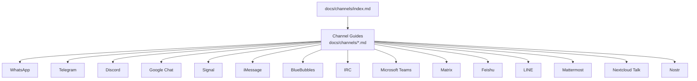

**Diagram sources**
- [docs/channels/index.md](file://docs/channels/index.md#L1-L48)

**Section sources**
- [docs/channels/index.md](file://docs/channels/index.md#L1-L48)

## Core Components
- Channel index and overview: Central hub for supported channels and quick notes.
- Per-channel documentation: Deep dives into setup, configuration, capabilities, and troubleshooting.
- Troubleshooting playbook: Cross-channel diagnostics and remediation steps.

**Section sources**
- [docs/channels/index.md](file://docs/channels/index.md#L1-L48)
- [docs/channels/troubleshooting.md](file://docs/channels/troubleshooting.md#L1-L118)

## Architecture Overview
OpenClaw integrates with messaging platforms through a unified Gateway. Channels are configured centrally and can run concurrently. Each channel implements its own transport, authentication, and routing rules, while OpenClaw ensures deterministic reply routing and consistent session handling.

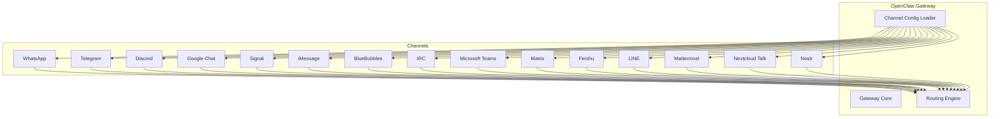

[No sources needed since this diagram shows conceptual workflow, not actual code structure]

## Detailed Component Analysis

### WhatsApp
- Status: Production-ready via WhatsApp Web (Baileys). Gateway owns linked sessions.
- Setup: Configure access policy, link via QR, start gateway, approve pairing.
- Authentication: QR-based pairing; optional multi-account support.
- Configuration highlights:
  - Access control: dmPolicy, allowFrom, groupPolicy, groupAllowFrom, groups.
  - Delivery: textChunkLimit, chunkMode, mediaMaxMb, sendReadReceipts, ackReaction.
  - Multi-account: accounts.<id>.enabled, accounts.<id>.authDir.
  - Operations: configWrites, debounceMs, web.enabled, web.heartbeatSeconds, web.reconnect.*
  - Session behavior: session.dmScope, historyLimit, dmHistoryLimit, dms.<id>.historyLimit.
- Features: Immediate ack reactions, media handling, mention gating, group isolation.
- Webhook: Not required; uses Baileys-based transport.
- Limitations: Requires Node runtime; Bun is incompatible; QR-based pairing; potential reconnect loops.

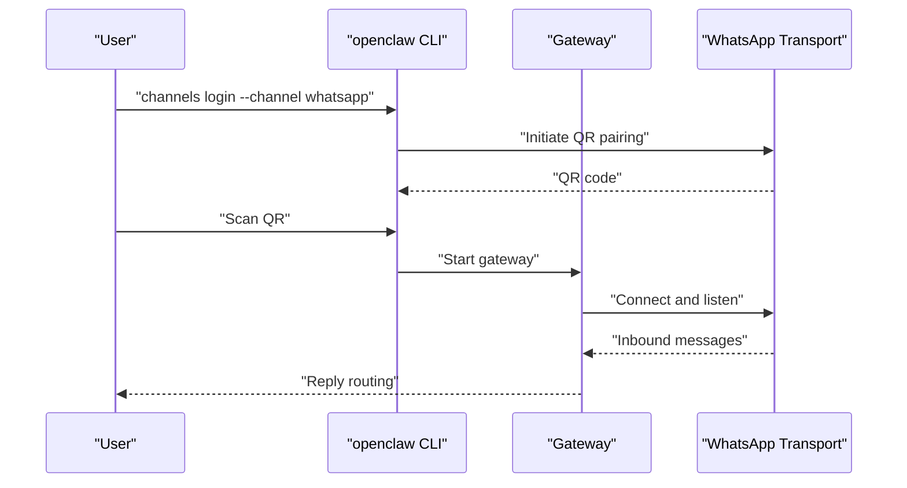

**Diagram sources**
- [docs/channels/whatsapp.md](file://docs/channels/whatsapp.md#L24-L76)

**Section sources**
- [docs/channels/whatsapp.md](file://docs/channels/whatsapp.md#L1-L446)

### Telegram
- Status: Production-ready for bot DMs + groups via grammY. Long polling default; webhook optional.
- Setup: Create bot token in BotFather, configure token and DM policy, start gateway, approve first DM, add bot to groups.
- Authentication: Bot token; optional environment fallback; privacy mode and group visibility toggles.
- Configuration highlights:
  - Access control: dmPolicy, allowFrom, groupPolicy, groupAllowFrom, groups, requireMention.
  - Features: Live stream preview (partial), HTML fallback, inline buttons, reactions, forum topics, stickers, exec approvals.
  - Webhook: webhookUrl, webhookSecret, webhookPath, webhookHost, webhookPort.
  - Limits: textChunkLimit, chunkMode, mediaMaxMb, timeoutSeconds, historyLimit, retry.
- Webhook: Optional; requires reverse proxy if public endpoint differs.
- Limitations: Privacy mode affects group visibility; DNS/HTTPS to api.telegram.org required for command registration.

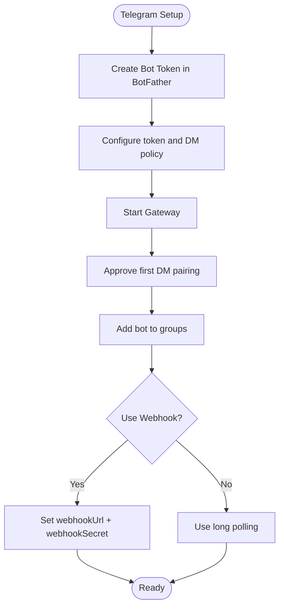

**Diagram sources**
- [docs/channels/telegram.md](file://docs/channels/telegram.md#L24-L69)

**Section sources**
- [docs/channels/telegram.md](file://docs/channels/telegram.md#L1-L948)

### Discord
- Status: Ready for DMs and guild channels via official Discord gateway.
- Setup: Create application and bot, enable privileged intents, copy token, generate invite URL, enable Developer Mode, set DMs from server members, configure token securely, configure allowlists, approve first DM pairing.
- Authentication: Bot token + app token (Socket Mode) or bot token + signing secret (HTTP Events API).
- Configuration highlights:
  - Access control: dmPolicy, allowFrom, groupPolicy, guilds, requireMention, ignoreOtherMentions.
  - Features: Components (buttons, selects, modals), slash commands, reply threading, reaction notifications, persistent ACP bindings, thread-bound sessions.
  - Modes: Socket Mode (default) and HTTP Events API.
- Webhook: HTTP Events API mode requires signing secret and unique webhook paths per account.
- Limitations: Requires proper intents; name/tag matching disabled by default; group DMs default disabled.

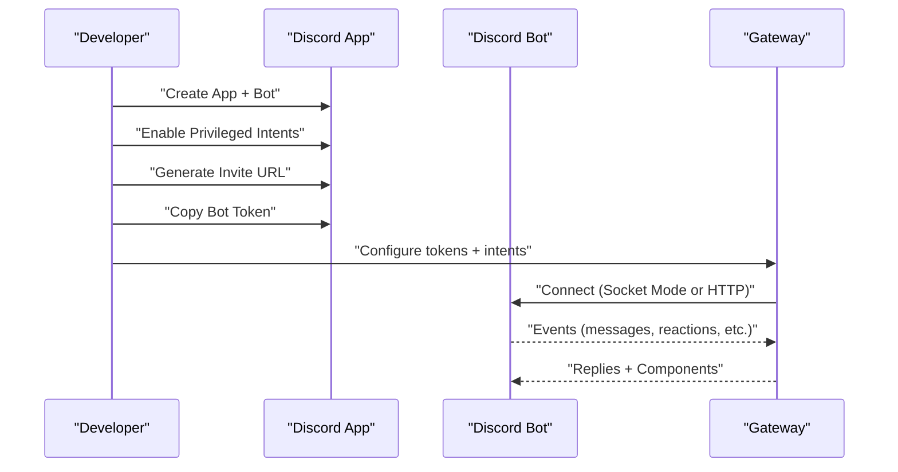

**Diagram sources**
- [docs/channels/discord.md](file://docs/channels/discord.md#L24-L167)

**Section sources**
- [docs/channels/discord.md](file://docs/channels/discord.md#L1-L1223)

### Google Chat (Chat API)
- Status: Ready for DMs + spaces via Google Chat API webhooks (HTTP only).
- Setup: Create Google Cloud project, enable Google Chat API, create service account, download JSON key, configure Chat app with webhook URL, add to Google Chat, authorize visibility, configure OpenClaw with service account path + webhook audience, start gateway.
- Authentication: Service account file or inline JSON; webhook audience type + value; bearer auth verification.
- Configuration highlights:
  - Access control: dm.policy, allowFrom, groupPolicy, groups, requireMention, botUser.
  - Features: Reactions, typing indicator, media handling, targets (users/spaces).
  - Webhook: Public HTTPS endpoint; Tailscale Funnel or reverse proxy recommended.
- Webhook: HTTP-only; requires strict pre-auth body budget and audience verification.
- Limitations: Requires public HTTPS endpoint; visibility must include your email; audience type must match Chat app config.

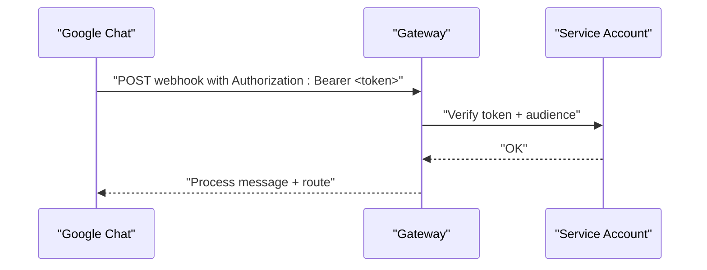

**Diagram sources**
- [docs/channels/googlechat.md](file://docs/channels/googlechat.md#L139-L153)

**Section sources**
- [docs/channels/googlechat.md](file://docs/channels/googlechat.md#L1-L262)

### Signal (signal-cli)
- Status: External CLI integration. Gateway talks to signal-cli over HTTP JSON-RPC + SSE.
- Setup: Use separate Signal number for bot, install signal-cli, choose QR link or SMS register path, configure OpenClaw, restart gateway, approve pairing.
- Authentication: signal-cli daemon; optional external daemon mode; receive mode configuration.
- Configuration highlights:
  - Access control: dmPolicy, allowFrom, groupPolicy, groupAllowFrom.
  - Features: Reactions, typing indicators, read receipts, media handling, history limits.
  - Daemon: httpUrl, autoStart, startupTimeoutMs, receiveMode, ignoreAttachments.
- Webhook: Not applicable; uses signal-cli daemon.
- Limitations: Requires Java for JVM builds; upstream notes that old releases can break; registering can de-authenticate main app session.

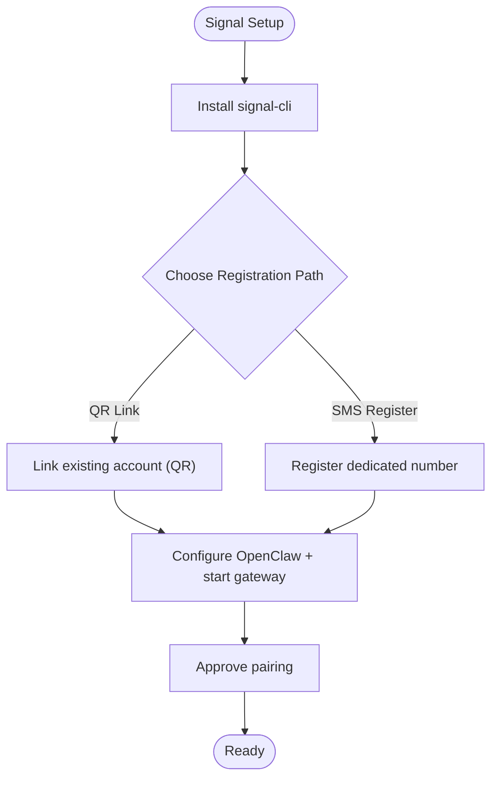

**Diagram sources**
- [docs/channels/signal.md](file://docs/channels/signal.md#L20-L28)

**Section sources**
- [docs/channels/signal.md](file://docs/channels/signal.md#L1-L326)

### iMessage (Legacy: imsg)
- Status: Legacy external CLI integration. Gateway spawns imsg rpc over stdio.
- Setup: Install and verify imsg, configure OpenClaw, start gateway, approve first DM pairing, optional remote Mac over SSH.
- Authentication: Messages DB access; automation permissions; optional remote host for attachment fetching.
- Configuration highlights:
  - Access control: dmPolicy, allowFrom, groupPolicy, groupAllowFrom.
  - Features: Attachments, chunking, delivery targets, multi-account support.
  - Remote: cliPath wrapper, remoteHost, attachment roots.
- Webhook: Not applicable; uses imsg RPC.
- Limitations: Legacy; may be removed; requires macOS permissions; remote attachment fetch via SCP.

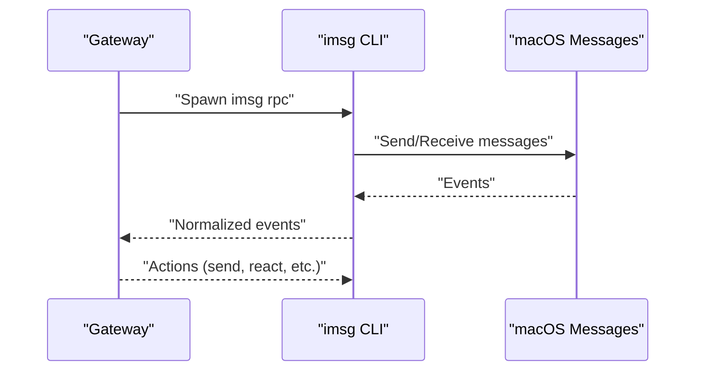

**Diagram sources**
- [docs/channels/imessage.md](file://docs/channels/imessage.md#L31-L78)

**Section sources**
- [docs/channels/imessage.md](file://docs/channels/imessage.md#L1-L368)

### BlueBubbles (macOS REST)
- Status: Bundled plugin talks to BlueBubbles macOS server over HTTP. Recommended for iMessage integration.
- Setup: Install BlueBubbles server, enable web API + password, configure OpenClaw, point BlueBubbles webhooks to gateway, start gateway.
- Authentication: Server URL + password; webhook authentication required; password checked before parsing bodies.
- Configuration highlights:
  - Access control: dmPolicy, allowFrom, groupPolicy, groupAllowFrom, groups, requireMention.
  - Features: Reactions, typing indicators, read receipts, advanced actions (react, edit, unsend, reply, effects, group management).
  - Webhook: webhookPath + password; localhost trust caveat with proxies.
- Webhook: REST API; webhook authentication required.
- Limitations: Edit/unsend require macOS 13+; edit is broken on macOS 26 Tahoe; group icon updates can be flaky.

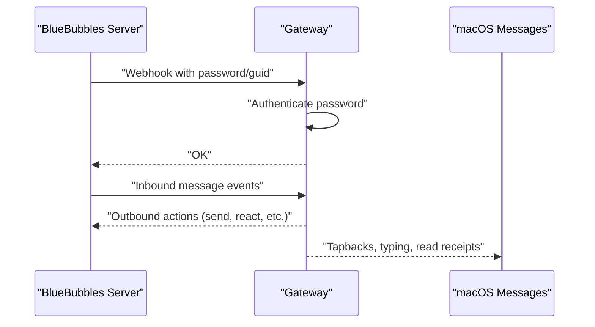

**Diagram sources**
- [docs/channels/bluebubbles.md](file://docs/channels/bluebubbles.md#L25-L46)

**Section sources**
- [docs/channels/bluebubbles.md](file://docs/channels/bluebubbles.md#L1-L348)

### IRC
- Status: Extension plugin for classic IRC channels and DMs.
- Setup: Enable IRC config, set host/port/TLS/nick/channels, start gateway.
- Authentication: Server password (optional); NickServ identification (optional).
- Configuration highlights:
  - Access control: dmPolicy, groupPolicy, allowFrom, groupAllowFrom, groups allowlist + per-channel controls.
  - Features: Reply triggering via mentions, security via allowlists, environment variables.
- Webhook: Not applicable; uses IRC client.
- Limitations: Requires TLS unless intentional plaintext; allowFrom is for DMs, not channels; per-channel allowlists required for channel access.

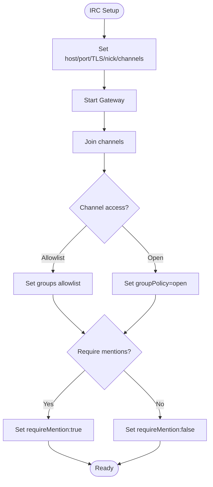

**Diagram sources**
- [docs/channels/irc.md](file://docs/channels/irc.md#L13-L31)

**Section sources**
- [docs/channels/irc.md](file://docs/channels/irc.md#L1-L242)

### Microsoft Teams (plugin)
- Status: Text + DM attachments supported; channel/group file sending requires SharePoint site ID + Graph permissions.
- Setup: Install plugin, create Azure Bot (App ID + client secret + tenant ID), configure OpenClaw, expose webhook path, install Teams app, start gateway.
- Authentication: App ID + App password + Tenant ID; webhook endpoint must be reachable.
- Configuration highlights:
  - Access control: dmPolicy, allowFrom, groupPolicy, groupAllowFrom, teams allowlist, requireMention.
  - Features: Adaptive Cards (polls), reply style (threads vs posts), proactive messaging after user interaction.
  - Graph: Optional permissions for media downloads and history; SharePoint site ID for file uploads in group chats.
- Webhook: HTTP-based Bot Framework webhook (/api/messages).
- Limitations: Webhook timeouts can cause duplicates; limited formatting; DMs require user-initiated message; Graph permissions required for channel media/history.

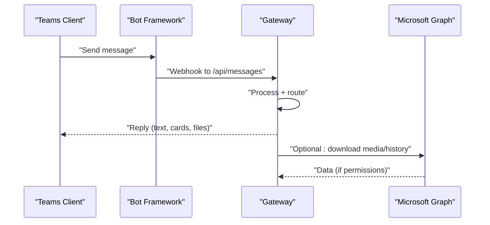

**Diagram sources**
- [docs/channels/msteams.md](file://docs/channels/msteams.md#L142-L149)

**Section sources**
- [docs/channels/msteams.md](file://docs/channels/msteams.md#L1-L777)

### Matrix (plugin)
- Status: Supported via plugin (@vector-im/matrix-bot-sdk). DMs, rooms, threads, media, reactions, polls, locations, E2EE (with crypto support).
- Setup: Install plugin, create Matrix account, get access token, configure credentials, restart gateway, start DM or invite to room.
- Authentication: Access token or user ID + password; optional E2EE with crypto module.
- Configuration highlights:
  - Access control: dm.policy, groupPolicy, allowFrom, groupAllowFrom, groups, requireMention.
  - Features: E2EE, multi-account, device verification, thread replies, reply-to mode, inline buttons.
  - Crypto: Rust crypto SDK; device verification required; separate stores per account + access token.
- Webhook: Not applicable; uses Matrix client SDK.
- Limitations: Crypto module must be available; device verification required; serialized account startup to avoid import races.

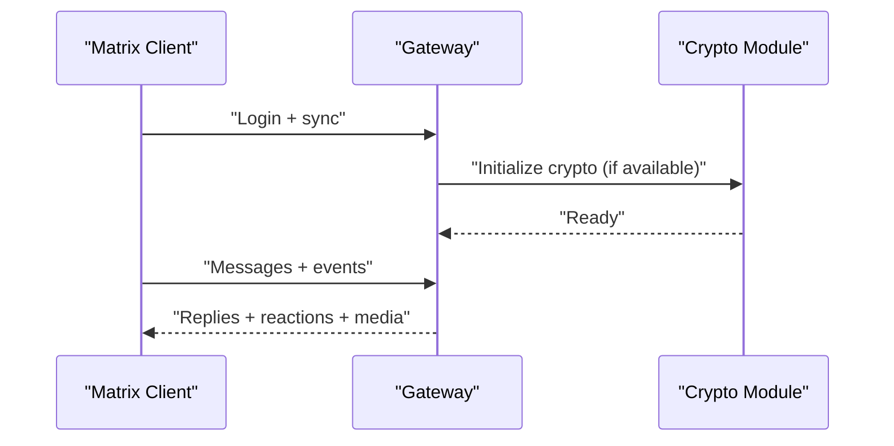

**Diagram sources**
- [docs/channels/matrix.md](file://docs/channels/matrix.md#L39-L76)

**Section sources**
- [docs/channels/matrix.md](file://docs/channels/matrix.md#L1-L304)

### Feishu (plugin)
- Status: Bundled plugin. WebSocket event subscription; DMs, group chats, media, locations, Flex messages, template messages supported.
- Setup: Install plugin, create Feishu app, collect credentials, configure permissions, enable bot capability, configure event subscription, start gateway, approve pairing.
- Authentication: App ID + App Secret; optional verification token (webhook mode).
- Configuration highlights:
  - Access control: dmPolicy, allowFrom, groupPolicy, groupAllowFrom, groups requireMention.
  - Features: Streaming replies via interactive cards, multi-agent routing via bindings, typing indicator, sender name resolution.
  - Webhook: WebSocket (default) or optional webhook mode with verification token.
- Webhook: Optional; long connection preferred; webhook mode requires verification token.
- Limitations: Requires published app; event subscription must include im.message.receive_v1; long connection must be enabled.

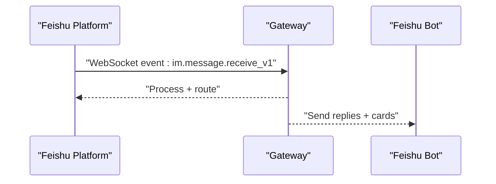

**Diagram sources**
- [docs/channels/feishu.md](file://docs/channels/feishu.md#L140-L154)

**Section sources**
- [docs/channels/feishu.md](file://docs/channels/feishu.md#L1-L652)

### LINE (plugin)
- Status: Supported via plugin. DMs, group chats, media, locations, Flex messages, template messages, quick replies supported.
- Setup: Install plugin, create LINE Developers account, create Messaging API channel, copy tokens, enable webhook, set webhook URL, configure OpenClaw, start gateway.
- Authentication: Channel access token + channel secret; webhook signature verification is body-dependent.
- Configuration highlights:
  - Access control: dmPolicy, allowFrom, groupPolicy, groupAllowFrom, per-group allowFrom.
  - Features: Quick replies, locations, Flex cards, template messages, media downloads capped.
  - Webhook: Strict pre-auth body limits and timeout before verification.
- Webhook: Required; HTTPS; signature verification depends on raw body.
- Limitations: Reactions and threads not supported; media download errors can occur; LINE IDs are case-sensitive.

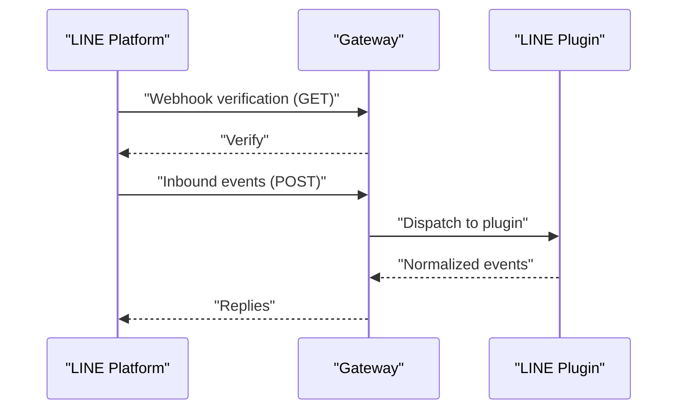

**Diagram sources**
- [docs/channels/line.md](file://docs/channels/line.md#L34-L49)

**Section sources**
- [docs/channels/line.md](file://docs/channels/line.md#L1-L192)

### Mattermost (plugin)
- Status: Supported via plugin (bot token + WebSocket events). Channels, groups, DMs supported.
- Setup: Install plugin, create bot account, copy bot token, copy base URL, configure OpenClaw, start gateway.
- Authentication: Bot token; optional native slash commands with callback URL; HMAC-SHA256 verification for button interactions.
- Configuration highlights:
  - Access control: dmPolicy, allowFrom, groupPolicy, groupAllowFrom, chatmode (oncall/onmessage/onchar).
  - Features: Reactions, inline buttons, directory adapter, multi-account.
  - Webhook: WebSocket events; optional callback URL for slash commands and button interactions.
- Webhook: WebSocket events; callback URL must be reachable from Mattermost server.
- Limitations: Button IDs must be alphanumeric; HMAC signing must match gateway verification; AllowedUntrustedInternalConnections may be required.

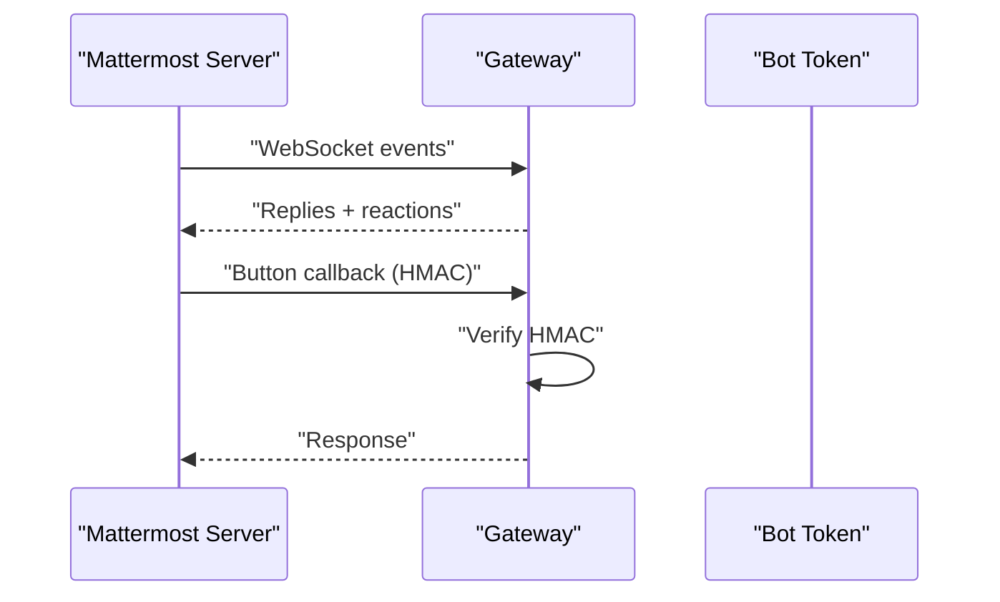

**Diagram sources**
- [docs/channels/mattermost.md](file://docs/channels/mattermost.md#L106-L125)

**Section sources**
- [docs/channels/mattermost.md](file://docs/channels/mattermost.md#L1-L363)

### Nextcloud Talk (plugin)
- Status: Supported via plugin (webhook bot). DMs, rooms, reactions, markdown messages supported.
- Setup: Install plugin, create bot on Nextcloud server, enable bot in target room, configure OpenClaw with baseUrl + botSecret, restart gateway.
- Authentication: Bot shared secret; optional API user/password for room lookups (DM detection).
- Configuration highlights:
  - Access control: dmPolicy, allowFrom, groupPolicy, groupAllowFrom, rooms allowlist.
  - Features: Webhook-based; media sent as URLs; pairing-based DMs.
  - Webhook: Port/host/path; webhookPublicUrl if behind proxy.
- Webhook: Required; webhook URL must be reachable by Gateway.
- Limitations: Bots cannot initiate DMs; media uploads not supported by bot API; webhook cannot distinguish DM vs room without API credentials.

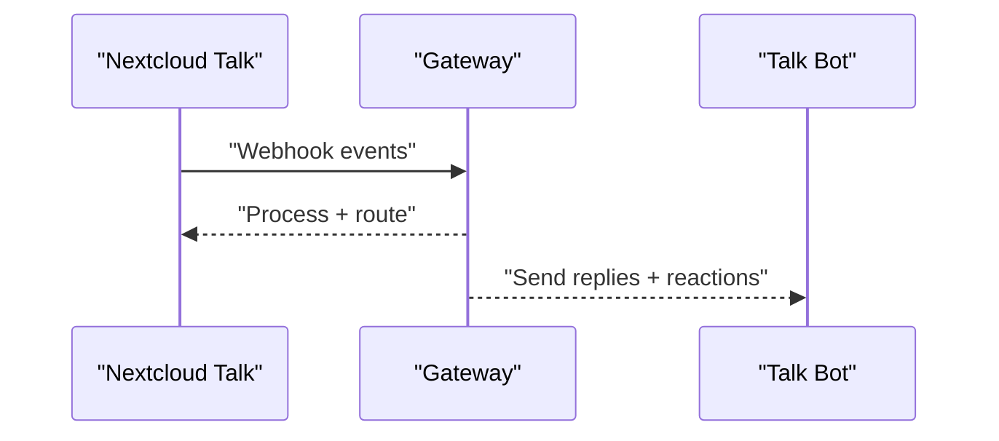

**Diagram sources**
- [docs/channels/nextcloud-talk.md](file://docs/channels/nextcloud-talk.md#L33-L47)

**Section sources**
- [docs/channels/nextcloud-talk.md](file://docs/channels/nextcloud-talk.md#L1-L139)

### Nostr
- Status: Optional plugin (disabled by default). Decentralized DMs via NIP-04.
- Setup: Install plugin, generate Nostr keypair, add privateKey to config, export key, restart gateway.
- Authentication: Private key (nsec or hex); optional profile metadata; relay URLs (WebSocket).
- Configuration highlights:
  - Access control: dmPolicy, allowFrom, relays.
  - Features: Encrypted DMs (NIP-04), profile metadata (NIP-01), pairing-based DMs.
  - Webhook: Not applicable; uses relays.
- Webhook: Not applicable; uses WebSocket relays.
- Limitations: MVP scope: DMs only, no media, NIP-04 only.

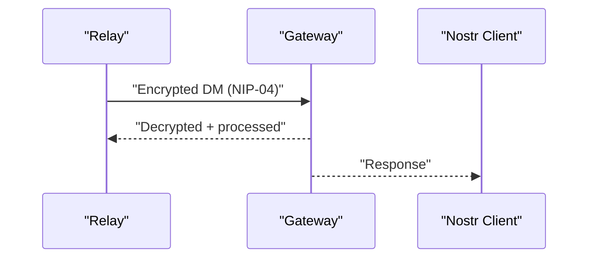

**Diagram sources**
- [docs/channels/nostr.md](file://docs/channels/nostr.md#L139-L140)

**Section sources**
- [docs/channels/nostr.md](file://docs/channels/nostr.md#L1-L234)

## Dependency Analysis
- Channel plugins are optional and installed on demand except where noted (e.g., Feishu is bundled).
- Gateway loads channel configurations and manages transports independently.
- Cross-channel diagnostics and remediation steps are centralized in the troubleshooting guide.

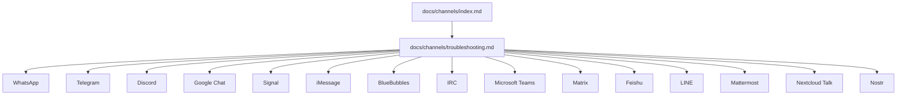

**Diagram sources**
- [docs/channels/index.md](file://docs/channels/index.md#L14-L37)
- [docs/channels/troubleshooting.md](file://docs/channels/troubleshooting.md#L9-L118)

**Section sources**
- [docs/channels/index.md](file://docs/channels/index.md#L1-L48)
- [docs/channels/troubleshooting.md](file://docs/channels/troubleshooting.md#L1-L118)

## Performance Considerations
- Chunking: Many channels support configurable text chunking (e.g., textChunkLimit, chunkMode) to optimize delivery and comply with platform limits.
- Media handling: Media size caps (mediaMaxMb) prevent excessive memory usage and ensure reliable delivery.
- Streaming: Some channels support live preview streaming (e.g., Telegram partial streaming, Discord block streaming) to improve perceived latency.
- Rate limiting: Respect platform-specific rate limits and webhook timeouts (e.g., Teams webhook timeouts).
- Multi-account: Serialized startup for Matrix accounts avoids race conditions; consider startupTimeoutMs for signal-cli.

[No sources needed since this section provides general guidance]

## Troubleshooting Guide
- Command ladder: Use openclaw status, gateway status, logs --follow, doctor, channels status --probe to diagnose channel issues.
- Channel-specific signatures:
  - WhatsApp: Not linked, reconnect loops, group messages ignored, Bun runtime warning.
  - Telegram: /start flow issues, privacy mode, network errors, allowlist upgrades.
  - Discord: Socket mode connected but no responses, DMs blocked, group messages ignored.
  - Slack: Socket mode not connecting, HTTP mode not receiving events, native/slash commands not firing.
  - iMessage/BlueBubbles: No inbound events, macOS privacy permissions, DM sender blocked.
  - Signal: Daemon reachable but bot silent, DM blocked, group replies do not trigger.
  - Matrix: Logged in but ignores room messages, DMs do not process, encrypted rooms fail.
- General steps: Validate credentials, check network reachability, verify webhook audience and signatures, review logs, and run doctor --fix for configuration migrations.

**Section sources**
- [docs/channels/troubleshooting.md](file://docs/channels/troubleshooting.md#L13-L118)

## Conclusion
OpenClaw provides robust, configurable support for a broad spectrum of messaging platforms. Each channel’s documentation covers setup, authentication, configuration, capabilities, and troubleshooting. Operators should carefully review platform-specific limitations, compliance requirements, and rate constraints to ensure reliable operation. The centralized troubleshooting guide and channel index streamline onboarding and ongoing maintenance across diverse environments.