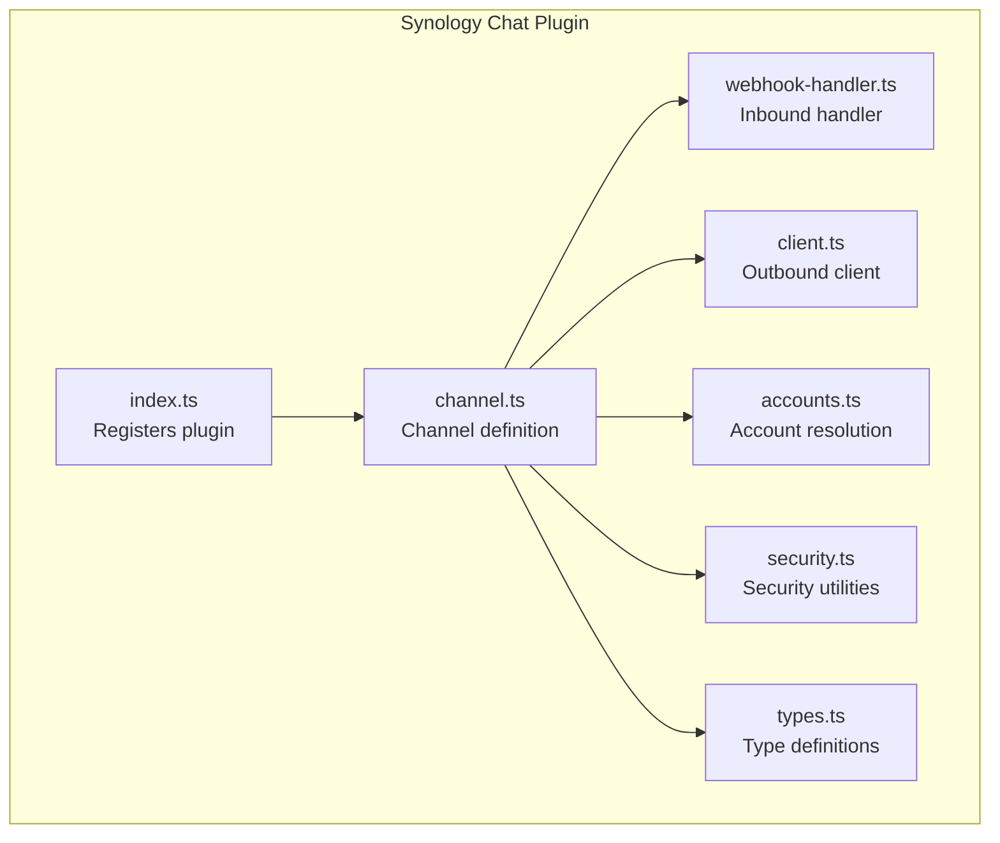
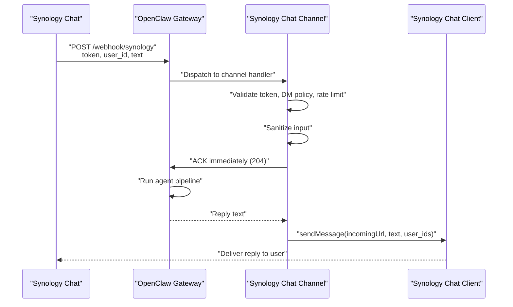
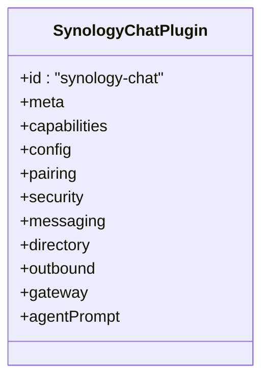
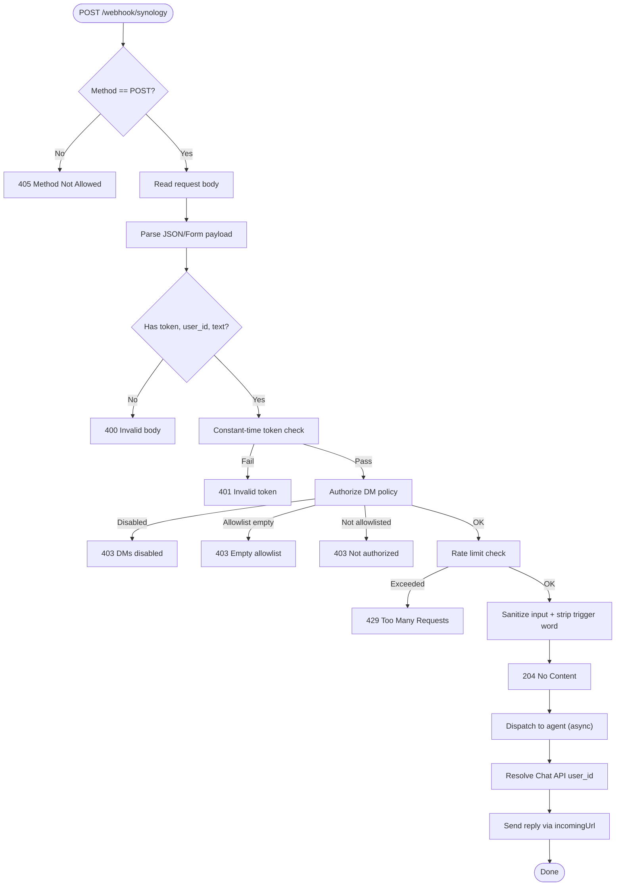
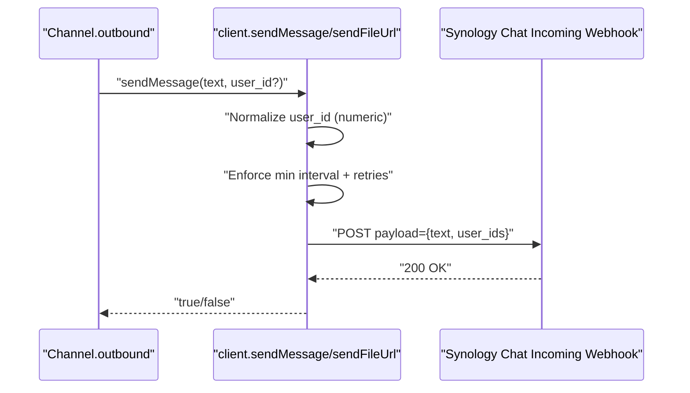
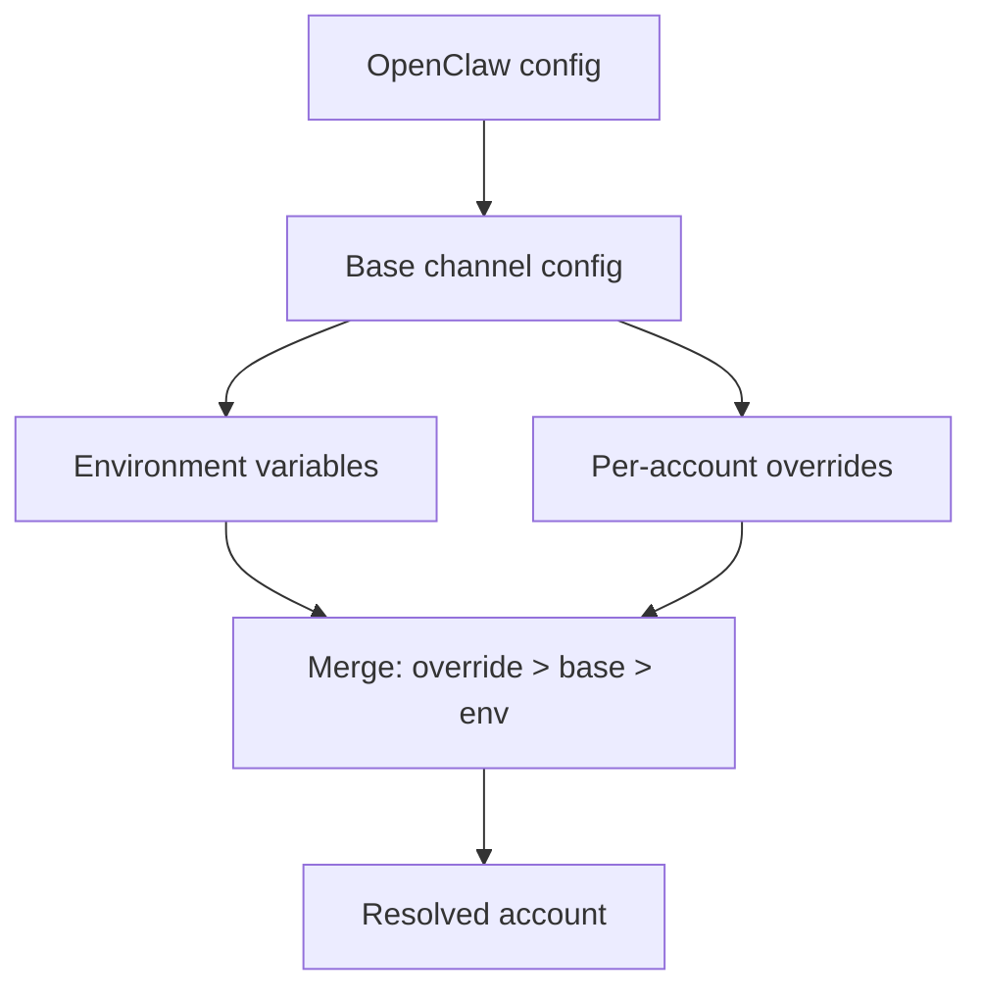
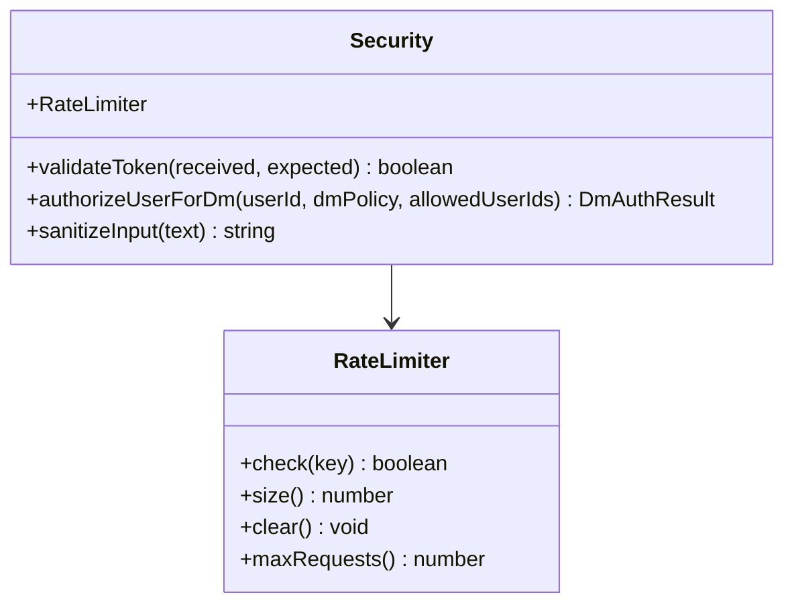
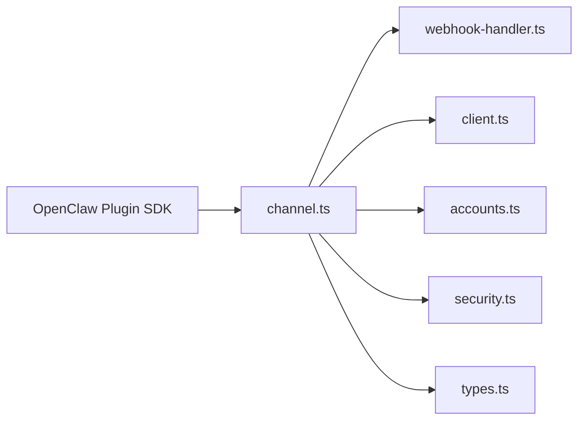

# Synology Chat Channel

<cite>
**Referenced Files in This Document**
- [index.ts](file://extensions/synology-chat/index.ts)
- [channel.ts](file://extensions/synology-chat/src/channel.ts)
- [webhook-handler.ts](file://extensions/synology-chat/src/webhook-handler.ts)
- [client.ts](file://extensions/synology-chat/src/client.ts)
- [accounts.ts](file://extensions/synology-chat/src/accounts.ts)
- [security.ts](file://extensions/synology-chat/src/security.ts)
- [types.ts](file://extensions/synology-chat/src/types.ts)
- [synology-chat.md](file://docs/channels/synology-chat.md)
</cite>

## Table of Contents
1. [Introduction](#introduction)
2. [Project Structure](#project-structure)
3. [Core Components](#core-components)
4. [Architecture Overview](#architecture-overview)
5. [Detailed Component Analysis](#detailed-component-analysis)
6. [Dependency Analysis](#dependency-analysis)
7. [Performance Considerations](#performance-considerations)
8. [Troubleshooting Guide](#troubleshooting-guide)
9. [Conclusion](#conclusion)
10. [Appendices](#appendices)

## Introduction
This document explains how the Synology Chat channel integration works in OpenClaw. It covers NAS server setup, webhook configuration, authentication, chat room management, file sharing, and notification handling. It also documents multi-account support, security considerations, and NAS-specific deployment and maintenance practices.

## Project Structure
The Synology Chat channel is implemented as a plugin with a small set of focused modules:
- Plugin bootstrap and registration
- Channel definition and capabilities
- Inbound webhook handler (outgoing webhooks)
- Outbound client (incoming webhook)
- Account resolution and environment variable fallbacks
- Security utilities (token validation, rate limiting, input sanitization)
- Type definitions

**Diagram sources**
- [index.ts](file://extensions/synology-chat/index.ts#L1-L18)
- [channel.ts](file://extensions/synology-chat/src/channel.ts#L1-L380)
- [webhook-handler.ts](file://extensions/synology-chat/src/webhook-handler.ts#L1-L396)
- [client.ts](file://extensions/synology-chat/src/client.ts#L1-L266)
- [accounts.ts](file://extensions/synology-chat/src/accounts.ts#L1-L97)
- [security.ts](file://extensions/synology-chat/src/security.ts#L1-L125)
- [types.ts](file://extensions/synology-chat/src/types.ts#L1-L61)

**Section sources**
- [index.ts](file://extensions/synology-chat/index.ts#L1-L18)
- [channel.ts](file://extensions/synology-chat/src/channel.ts#L1-L380)
- [webhook-handler.ts](file://extensions/synology-chat/src/webhook-handler.ts#L1-L396)
- [client.ts](file://extensions/synology-chat/src/client.ts#L1-L266)
- [accounts.ts](file://extensions/synology-chat/src/accounts.ts#L1-L97)
- [security.ts](file://extensions/synology-chat/src/security.ts#L1-L125)
- [types.ts](file://extensions/synology-chat/src/types.ts#L1-L61)

## Core Components
- Plugin registration: Declares the channel identity, capabilities, and registers HTTP routes.
- Channel definition: Defines supported chat types, media support, and outbound delivery modes.
- Inbound webhook handler: Parses payloads, validates tokens, enforces DM policies, rate limits, and sanitizes input.
- Outbound client: Sends text and file URL messages via Synology Chat’s incoming webhook.
- Account resolver: Merges base config, per-account overrides, and environment variables.
- Security utilities: Constant-time token validation, user allowlists, rate limiting, and input sanitization.

**Section sources**
- [index.ts](file://extensions/synology-chat/index.ts#L6-L15)
- [channel.ts](file://extensions/synology-chat/src/channel.ts#L42-L380)
- [webhook-handler.ts](file://extensions/synology-chat/src/webhook-handler.ts#L251-L396)
- [client.ts](file://extensions/synology-chat/src/client.ts#L42-L115)
- [accounts.ts](file://extensions/synology-chat/src/accounts.ts#L64-L96)
- [security.ts](file://extensions/synology-chat/src/security.ts#L19-L124)

## Architecture Overview
The integration uses two webhooks:
- Outgoing webhook: Synology Chat posts messages to OpenClaw’s gateway route.
- Incoming webhook: OpenClaw replies using Synology Chat’s incoming webhook URL.

**Diagram sources**
- [webhook-handler.ts](file://extensions/synology-chat/src/webhook-handler.ts#L255-L394)
- [channel.ts](file://extensions/synology-chat/src/channel.ts#L257-L334)
- [client.ts](file://extensions/synology-chat/src/client.ts#L42-L87)

## Detailed Component Analysis

### Plugin Registration and Channel Definition
- Registers the channel with OpenClaw’s plugin system.
- Declares capabilities: direct messages, media, no threads/reactions/edit/unsend/reply/effects.
- Provides config schema and account management helpers.
- Starts/stops HTTP routes per account and normalizes targets for outbound delivery.

**Diagram sources**
- [channel.ts](file://extensions/synology-chat/src/channel.ts#L42-L380)

**Section sources**
- [index.ts](file://extensions/synology-chat/index.ts#L6-L15)
- [channel.ts](file://extensions/synology-chat/src/channel.ts#L42-L380)

### Inbound Webhook Handler (Outgoing Webhooks)
- Accepts POST only; parses JSON or form-encoded payloads.
- Extracts token from body, query, or headers; supports multiple header formats.
- Validates token using constant-time comparison.
- Enforces DM policy (open/allowlist/disabled) and checks allowlist membership.
- Applies fixed-window rate limiting per user.
- Sanitizes input and strips trigger words.
- Immediately acknowledges (204) to prevent retries.
- Resolves Chat API user_id for replies and dispatches to the agent pipeline.

**Diagram sources**
- [webhook-handler.ts](file://extensions/synology-chat/src/webhook-handler.ts#L255-L394)
- [security.ts](file://extensions/synology-chat/src/security.ts#L19-L62)

**Section sources**
- [webhook-handler.ts](file://extensions/synology-chat/src/webhook-handler.ts#L138-L204)
- [webhook-handler.ts](file://extensions/synology-chat/src/webhook-handler.ts#L255-L394)
- [security.ts](file://extensions/synology-chat/src/security.ts#L19-L62)

### Outbound Delivery (Incoming Webhook)
- Sends text and file URL messages to Synology Chat via the incoming webhook URL.
- Resolves Chat API user_id from the username/nickname using the user_list API and caches results.
- Enforces minimum send interval and retries with exponential backoff.
- Supports optional TLS verification bypass for local NAS scenarios.

**Diagram sources**
- [channel.ts](file://extensions/synology-chat/src/channel.ts#L198-L227)
- [client.ts](file://extensions/synology-chat/src/client.ts#L42-L115)
- [client.ts](file://extensions/synology-chat/src/client.ts#L198-L216)

**Section sources**
- [channel.ts](file://extensions/synology-chat/src/channel.ts#L194-L228)
- [client.ts](file://extensions/synology-chat/src/client.ts#L42-L115)
- [client.ts](file://extensions/synology-chat/src/client.ts#L198-L216)

### Account Resolution and Environment Variables
- Supports a base “default” account and named accounts under accounts.
- Merges per-account overrides with base channel config and environment variables.
- Provides helpers to list account IDs and resolve a specific account.

**Diagram sources**
- [accounts.ts](file://extensions/synology-chat/src/accounts.ts#L64-L96)

**Section sources**
- [accounts.ts](file://extensions/synology-chat/src/accounts.ts#L38-L58)
- [accounts.ts](file://extensions/synology-chat/src/accounts.ts#L64-L96)

### Security Utilities
- Constant-time token comparison to prevent timing attacks.
- DM policy enforcement with three modes: open, allowlist, disabled.
- Rate limiting with fixed window and configurable limits.
- Input sanitization to mitigate prompt injection.

**Diagram sources**
- [security.ts](file://extensions/synology-chat/src/security.ts#L19-L124)

**Section sources**
- [security.ts](file://extensions/synology-chat/src/security.ts#L19-L124)

## Dependency Analysis
- The plugin depends on OpenClaw’s plugin SDK for channel registration, HTTP route registration, and config schema building.
- The channel module orchestrates the webhook handler, outbound client, account resolution, and security utilities.
- The client module depends on Node’s HTTP/HTTPS transports and caches user lists to minimize API calls.

**Diagram sources**
- [channel.ts](file://extensions/synology-chat/src/channel.ts#L7-L18)
- [webhook-handler.ts](file://extensions/synology-chat/src/webhook-handler.ts#L6-L15)
- [client.ts](file://extensions/synology-chat/src/client.ts#L6-L8)
- [accounts.ts](file://extensions/synology-chat/src/accounts.ts#L6)
- [security.ts](file://extensions/synology-chat/src/security.ts#L5-L9)
- [types.ts](file://extensions/synology-chat/src/types.ts#L5-L6)

**Section sources**
- [channel.ts](file://extensions/synology-chat/src/channel.ts#L7-L18)
- [webhook-handler.ts](file://extensions/synology-chat/src/webhook-handler.ts#L6-L15)
- [client.ts](file://extensions/synology-chat/src/client.ts#L6-L8)
- [accounts.ts](file://extensions/synology-chat/src/accounts.ts#L6)
- [security.ts](file://extensions/synology-chat/src/security.ts#L5-L9)
- [types.ts](file://extensions/synology-chat/src/types.ts#L5-L6)

## Performance Considerations
- Fixed-window rate limiting prevents abuse and stabilizes throughput per user.
- Minimum send interval and retries reduce API churn and improve reliability.
- User list caching avoids repeated user_list API calls.
- Immediate acknowledgment ensures Synology Chat does not keep connections hanging.

[No sources needed since this section provides general guidance]

## Troubleshooting Guide
Common issues and resolutions:
- Missing token or incoming URL: The webhook route rejects all requests; configure both values.
- Empty allowlist in allowlist mode: Blocks all senders; switch to open or populate allowedUserIds.
- SSL verification errors: Disable allowInsecureSsl only for local NAS with self-signed certs.
- DMs disabled: Users cannot message the bot; adjust dmPolicy accordingly.
- Rate limit exceeded: Reduce message frequency or increase rateLimitPerMinute.
- Agent response timeout: Ensure gateway can reach the agent within 120 seconds.

Operational tips:
- Use multi-account configuration to separate environments (e.g., default vs alerts).
- Monitor warnings emitted by the security collector for misconfigurations.
- Verify webhookPath matches Synology Chat outgoing webhook configuration.

**Section sources**
- [channel.ts](file://extensions/synology-chat/src/channel.ts#L139-L167)
- [webhook-handler.ts](file://extensions/synology-chat/src/webhook-handler.ts#L284-L315)
- [synology-chat.md](file://docs/channels/synology-chat.md#L123-L129)

## Conclusion
The Synology Chat channel integrates seamlessly with OpenClaw using outgoing and incoming webhooks. It provides secure, rate-limited, and configurable direct message support with multi-account capability, environment variable fallbacks, and robust outbound delivery. Proper NAS setup, token management, and DM policy configuration are essential for reliable operation.

[No sources needed since this section summarizes without analyzing specific files]

## Appendices

### Setup Procedures
- Install the plugin from a local checkout.
- Create an incoming webhook and copy its URL.
- Create an outgoing webhook with a secret token.
- Point the outgoing webhook URL to your OpenClaw gateway route.
- Configure channels.synology-chat with token, incomingUrl, webhookPath, dmPolicy, allowedUserIds, and rateLimitPerMinute.
- Restart the gateway and test by sending a DM to the bot.

Environment variables for the default account:
- SYNOLOGY_CHAT_TOKEN
- SYNOLOGY_CHAT_INCOMING_URL
- SYNOLOGY_NAS_HOST
- SYNOLOGY_ALLOWED_USER_IDS
- SYNOLOGY_RATE_LIMIT
- OPENCLAW_BOT_NAME

**Section sources**
- [synology-chat.md](file://docs/channels/synology-chat.md#L19-L37)
- [synology-chat.md](file://docs/channels/synology-chat.md#L58-L69)

### Chat Room Management and File Sharing
- Chat rooms are not supported; only direct messages are available.
- File sharing is supported via URL-based file delivery; the NAS downloads and attaches files up to a maximum size.
- Use numeric Synology Chat user IDs as targets for outbound messages.

**Section sources**
- [channel.ts](file://extensions/synology-chat/src/channel.ts#L56-L66)
- [channel.ts](file://extensions/synology-chat/src/channel.ts#L212-L227)
- [synology-chat.md](file://docs/channels/synology-chat.md#L82-L94)

### Authentication Methods
- Token-based authentication with constant-time comparison.
- Support for multiple token locations: body, query, headers (including Authorization Bearer).
- DM policy controls who can message the bot.

**Section sources**
- [webhook-handler.ts](file://extensions/synology-chat/src/webhook-handler.ts#L123-L136)
- [webhook-handler.ts](file://extensions/synology-chat/src/webhook-handler.ts#L284-L308)
- [security.ts](file://extensions/synology-chat/src/security.ts#L19-L29)
- [security.ts](file://extensions/synology-chat/src/security.ts#L44-L62)

### Security Considerations
- Keep tokens secret and rotate them regularly.
- Prefer allowlist DM policy for production.
- Avoid disabling SSL verification except for local NAS with self-signed certificates.
- Input sanitization reduces prompt injection risks.

**Section sources**
- [synology-chat.md](file://docs/channels/synology-chat.md#L123-L129)
- [security.ts](file://extensions/synology-chat/src/security.ts#L68-L87)

### NAS-Specific Deployment and Maintenance
- Ensure the NAS host and incoming webhook URL are reachable from the gateway.
- Use allowInsecureSsl only when necessary for local networks with self-signed certificates.
- Monitor rate limits and adjust per-account configurations as needed.
- Use multi-account setups to isolate environments and permissions.

**Section sources**
- [accounts.ts](file://extensions/synology-chat/src/accounts.ts#L72-L77)
- [accounts.ts](file://extensions/synology-chat/src/accounts.ts#L84-L94)
- [synology-chat.md](file://docs/channels/synology-chat.md#L95-L121)