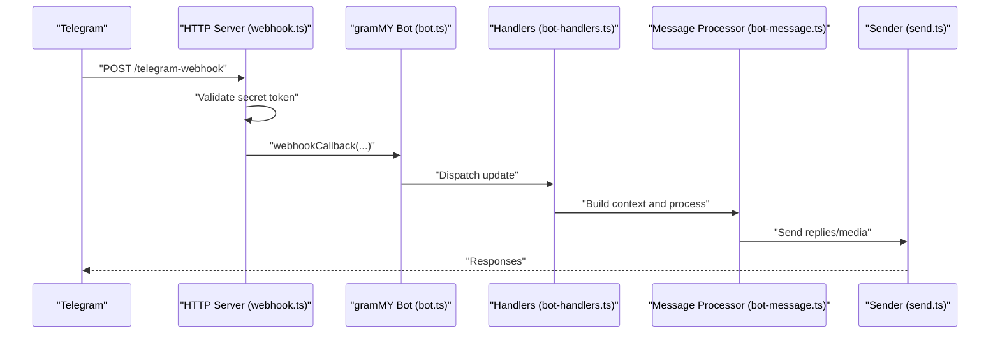
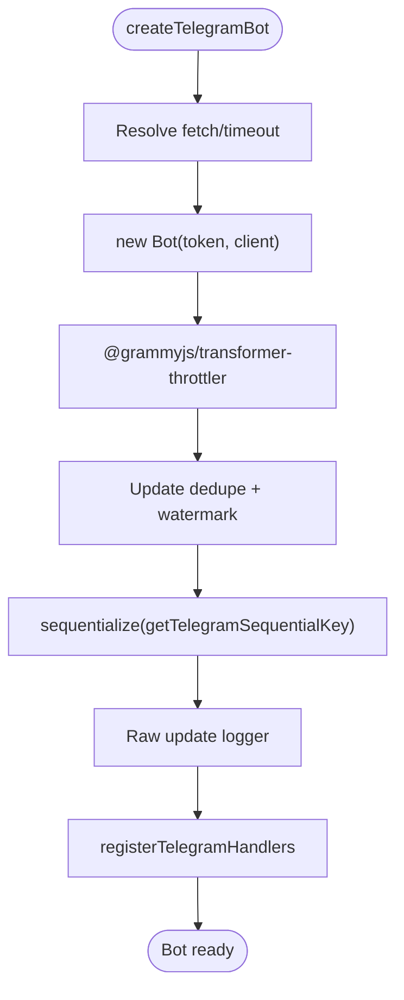
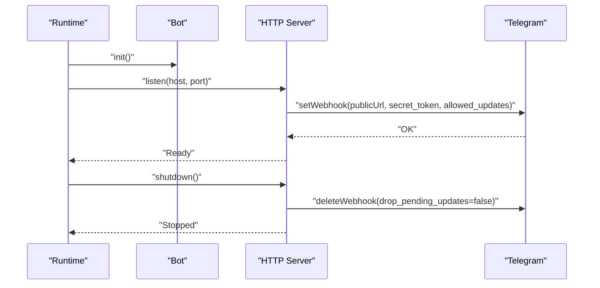
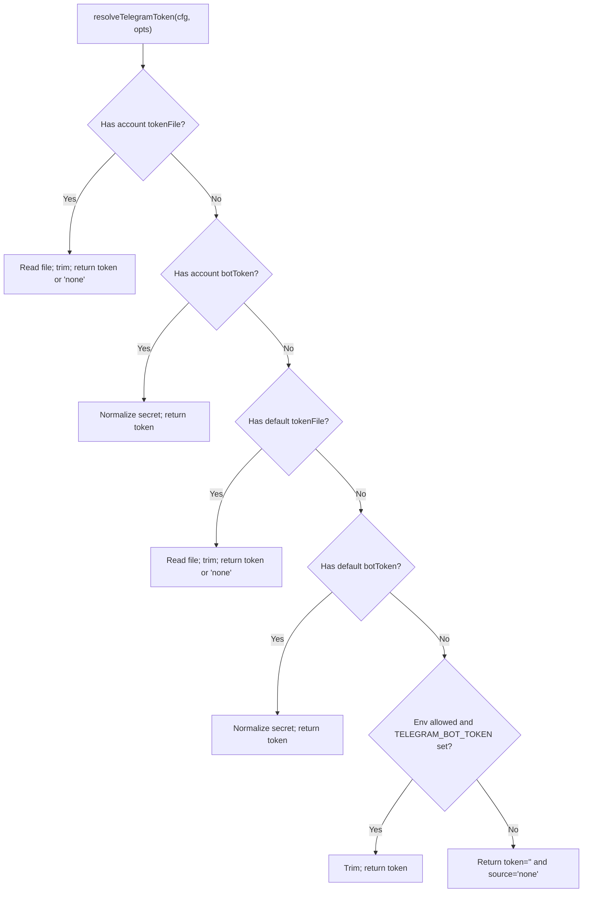
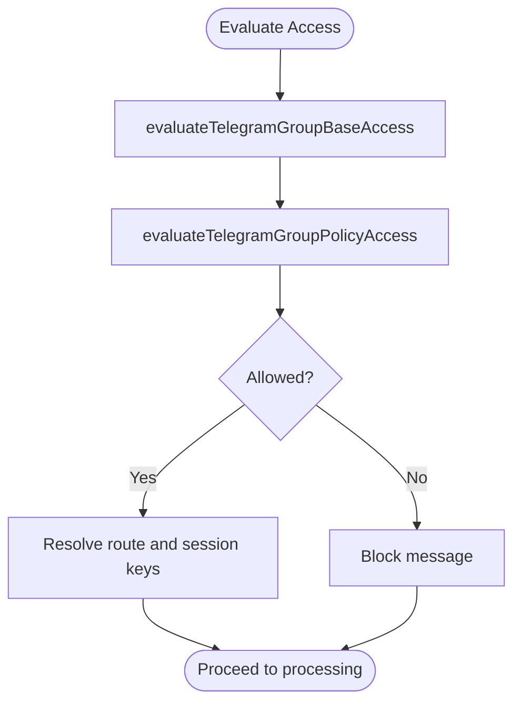
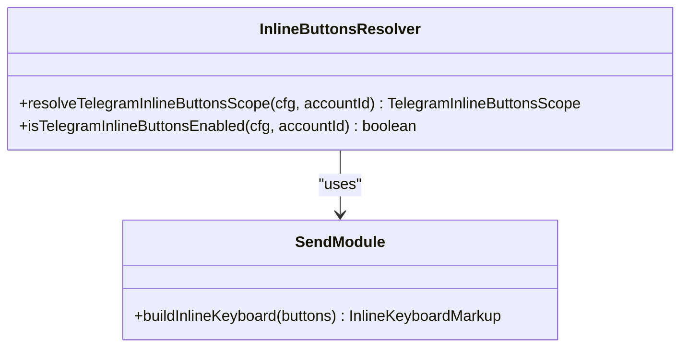
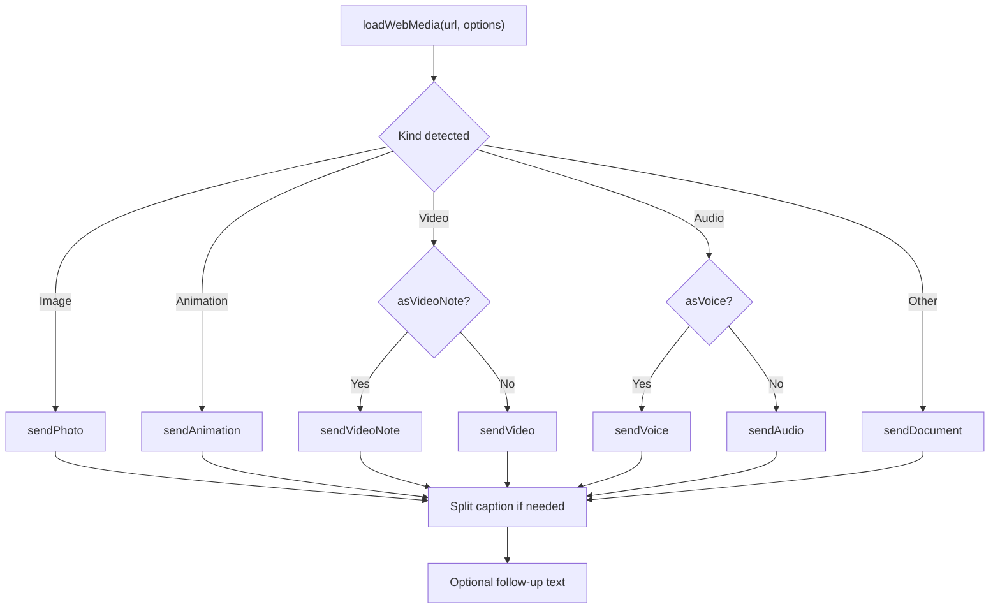
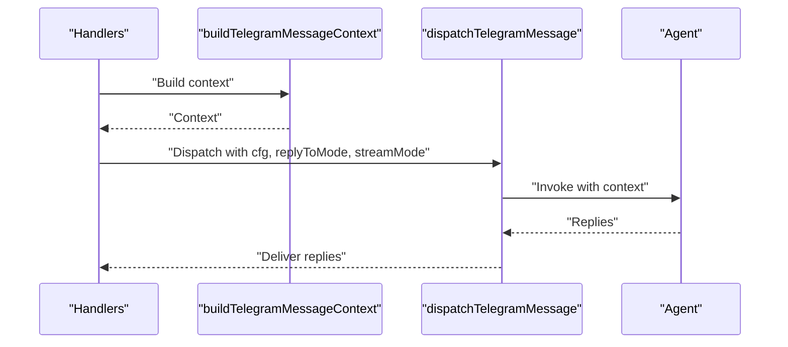
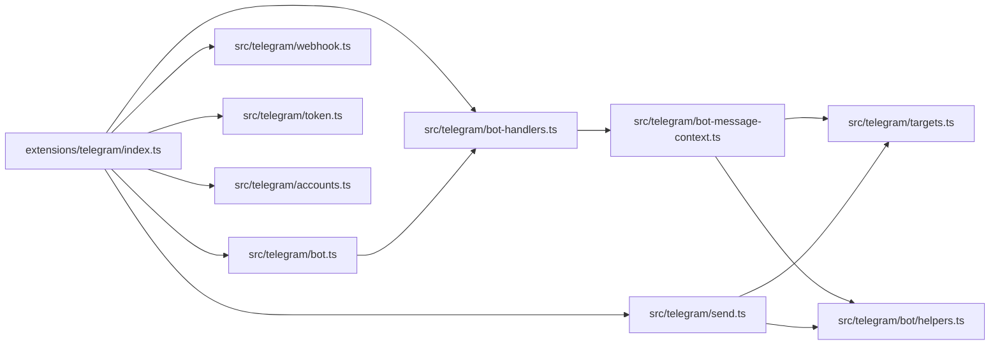

# Telegram Channel

<cite>
**Referenced Files in This Document**
- [extensions/telegram/index.ts](file://extensions/telegram/index.ts)
- [extensions/telegram/package.json](file://extensions/telegram/package.json)
- [src/telegram/bot.ts](file://src/telegram/bot.ts)
- [src/telegram/webhook.ts](file://src/telegram/webhook.ts)
- [src/telegram/token.ts](file://src/telegram/token.ts)
- [src/telegram/accounts.ts](file://src/telegram/accounts.ts)
- [src/telegram/bot-handlers.ts](file://src/telegram/bot-handlers.ts)
- [src/telegram/bot-message.ts](file://src/telegram/bot-message.ts)
- [src/telegram/bot-message-context.ts](file://src/telegram/bot-message-context.ts)
- [src/telegram/bot/helpers.ts](file://src/telegram/bot/helpers.ts)
- [src/telegram/group-access.ts](file://src/telegram/group-access.ts)
- [src/telegram/targets.ts](file://src/telegram/targets.ts)
- [src/telegram/inline-buttons.ts](file://src/telegram/inline-buttons.ts)
- [src/telegram/send.ts](file://src/telegram/send.ts)
</cite>

## Table of Contents
1. [Introduction](#introduction)
2. [Project Structure](#project-structure)
3. [Core Components](#core-components)
4. [Architecture Overview](#architecture-overview)
5. [Detailed Component Analysis](#detailed-component-analysis)
6. [Dependency Analysis](#dependency-analysis)
7. [Performance Considerations](#performance-considerations)
8. [Troubleshooting Guide](#troubleshooting-guide)
9. [Conclusion](#conclusion)

## Introduction
This document explains the Telegram channel integration built on the grammY framework. It covers bot creation, token-based authentication, webhook configuration, group and DM access controls, inline keyboards, media handling, file uploads/downloads, setup procedures, BotFather configuration, and operational troubleshooting. Privacy settings, bot permissions, and rate limits are addressed alongside best practices for reliable deployments.

## Project Structure
The Telegram channel is implemented as a core runtime module and a plugin that registers the channel into the OpenClaw platform. The plugin wires the runtime and exposes the channel interface.

```mermaid
graph TB
subgraph "Plugin Layer"
EXT_INDEX["extensions/telegram/index.ts"]
EXT_PKG["extensions/telegram/package.json"]
end
subgraph "Telegram Channel Runtime"
BOT["src/telegram/bot.ts"]
WEBHOOK["src/telegram/webhook.ts"]
TOKEN["src/telegram/token.ts"]
ACCOUNTS["src/telegram/accounts.ts"]
HANDLERS["src/telegram/bot-handlers.ts"]
MSG_PROC["src/telegram/bot-message.ts"]
MSG_CTX["src/telegram/bot-message-context.ts"]
HELPERS["src/telegram/bot/helpers.ts"]
GROUP_ACCESS["src/telegram/group-access.ts"]
TARGETS["src/telegram/targets.ts"]
INLINE["src/telegram/inline-buttons.ts"]
SEND["src/telegram/send.ts"]
end
EXT_INDEX --> EXT_PKG
EXT_INDEX --> BOT
EXT_INDEX --> WEBHOOK
EXT_INDEX --> TOKEN
EXT_INDEX --> ACCOUNTS
EXT_INDEX --> HANDLERS
EXT_INDEX --> MSG_PROC
EXT_INDEX --> MSG_CTX
EXT_INDEX --> HELPERS
EXT_INDEX --> GROUP_ACCESS
EXT_INDEX --> TARGETS
EXT_INDEX --> INLINE
EXT_INDEX --> SEND
```

**Diagram sources**
- [extensions/telegram/index.ts](file://extensions/telegram/index.ts#L1-L18)
- [extensions/telegram/package.json](file://extensions/telegram/package.json#L1-L13)
- [src/telegram/bot.ts](file://src/telegram/bot.ts#L1-L463)
- [src/telegram/webhook.ts](file://src/telegram/webhook.ts#L1-L285)
- [src/telegram/token.ts](file://src/telegram/token.ts#L1-L110)
- [src/telegram/accounts.ts](file://src/telegram/accounts.ts#L1-L209)
- [src/telegram/bot-handlers.ts](file://src/telegram/bot-handlers.ts#L1-L800)
- [src/telegram/bot-message.ts](file://src/telegram/bot-message.ts#L1-L108)
- [src/telegram/bot-message-context.ts](file://src/telegram/bot-message-context.ts#L1-L474)
- [src/telegram/bot/helpers.ts](file://src/telegram/bot/helpers.ts#L1-L608)
- [src/telegram/group-access.ts](file://src/telegram/group-access.ts#L1-L206)
- [src/telegram/targets.ts](file://src/telegram/targets.ts#L1-L121)
- [src/telegram/inline-buttons.ts](file://src/telegram/inline-buttons.ts#L1-L68)
- [src/telegram/send.ts](file://src/telegram/send.ts#L1-L800)

**Section sources**
- [extensions/telegram/index.ts](file://extensions/telegram/index.ts#L1-L18)
- [extensions/telegram/package.json](file://extensions/telegram/package.json#L1-L13)

## Core Components
- Bot factory and middleware: creates a grammY bot with throttling, deduplication, sequentialization, and raw update logging.
- Webhook server: runs an HTTP server, validates secret tokens, sets Telegram webhook, and handles incoming updates.
- Token resolution: supports environment variables, token files, and configuration-backed tokens.
- Accounts and policies: resolves per-account configuration, default account selection, and action gating.
- Handler registration: registers message, reaction, and callback handlers with authorization and debouncing.
- Message processing: builds context, enforces access, computes routes, and dispatches replies.
- Inline keyboards and buttons: constructs inline keyboards and scopes button availability.
- Media handling and sending: loads, validates, and sends media with caption handling, link previews, and thread-aware replies.

**Section sources**
- [src/telegram/bot.ts](file://src/telegram/bot.ts#L71-L463)
- [src/telegram/webhook.ts](file://src/telegram/webhook.ts#L77-L285)
- [src/telegram/token.ts](file://src/telegram/token.ts#L20-L110)
- [src/telegram/accounts.ts](file://src/telegram/accounts.ts#L166-L209)
- [src/telegram/bot-handlers.ts](file://src/telegram/bot-handlers.ts#L121-L800)
- [src/telegram/bot-message.ts](file://src/telegram/bot-message.ts#L27-L108)
- [src/telegram/inline-buttons.ts](file://src/telegram/inline-buttons.ts#L43-L68)
- [src/telegram/send.ts](file://src/telegram/send.ts#L547-L800)

## Architecture Overview
The Telegram channel integrates via a plugin that registers the channel into the platform. The runtime composes a grammY bot with middleware, then registers handlers for messages, reactions, and callbacks. Outbound operations use a dedicated API context resolver and retry runner.

**Diagram sources**
- [src/telegram/webhook.ts](file://src/telegram/webhook.ts#L117-L219)
- [src/telegram/bot.ts](file://src/telegram/bot.ts#L163-L169)
- [src/telegram/bot-handlers.ts](file://src/telegram/bot-handlers.ts#L121-L800)
- [src/telegram/bot-message.ts](file://src/telegram/bot-message.ts#L51-L108)
- [src/telegram/send.ts](file://src/telegram/send.ts#L547-L800)

## Detailed Component Analysis

### Bot Creation and Middleware
- Creates a grammY bot with throttling transformer and optional custom fetch/timeout.
- Wraps fetch with an abort signal to cancel long-polling or webhook requests during shutdown.
- Deduplicates updates, tracks pending update IDs, and persists a safe watermark to avoid skipping updates.
- Logs raw updates for diagnostics with truncation and circular reference handling.
- Registers sequentialization keyed by chat/topic to maintain ordering.

**Diagram sources**
- [src/telegram/bot.ts](file://src/telegram/bot.ts#L101-L237)

**Section sources**
- [src/telegram/bot.ts](file://src/telegram/bot.ts#L71-L463)

### Webhook Configuration
- Validates webhook secret from configuration and throws if missing.
- Starts an HTTP server, reads and parses JSON bodies with limits and timeouts.
- Uses grammY’s webhookCallback with secret token and callback timeout.
- Sets Telegram webhook with allowed_updates and optional certificate.
- Provides health endpoint and graceful shutdown that deletes the webhook.

**Diagram sources**
- [src/telegram/webhook.ts](file://src/telegram/webhook.ts#L77-L285)

**Section sources**
- [src/telegram/webhook.ts](file://src/telegram/webhook.ts#L77-L285)

### Token-Based Authentication
- Supports multiple token sources: per-account token file, per-account config, default account token file/config, and environment variable for default account.
- Returns a source indicator (“env”, “tokenFile”, “config”, “none”) to aid diagnostics.

**Diagram sources**
- [src/telegram/token.ts](file://src/telegram/token.ts#L20-L110)

**Section sources**
- [src/telegram/token.ts](file://src/telegram/token.ts#L20-L110)
- [src/telegram/accounts.ts](file://src/telegram/accounts.ts#L166-L202)

### Group Management and Access Controls
- Evaluates base access for groups and DMs, honoring allowFrom overrides per group/topic.
- Enforces group policy allowlists and chat-level allowlist entries.
- Supports requireTopic for DMs and requireMention overrides per topic/group/account.
- Builds thread specs for forum topics and DM topics, with special handling for General topic.

**Diagram sources**
- [src/telegram/group-access.ts](file://src/telegram/group-access.ts#L43-L205)
- [src/telegram/bot/helpers.ts](file://src/telegram/bot/helpers.ts#L21-L122)

**Section sources**
- [src/telegram/group-access.ts](file://src/telegram/group-access.ts#L1-L206)
- [src/telegram/bot/helpers.ts](file://src/telegram/bot/helpers.ts#L85-L122)

### Inline Keyboards and Button Scopes
- Constructs inline keyboards from button definitions.
- Resolves inline button scope from capabilities or defaults to allowlist.
- Enables/disables inline buttons depending on configuration and account IDs.

**Diagram sources**
- [src/telegram/inline-buttons.ts](file://src/telegram/inline-buttons.ts#L43-L68)
- [src/telegram/send.ts](file://src/telegram/send.ts#L522-L545)

**Section sources**
- [src/telegram/inline-buttons.ts](file://src/telegram/inline-buttons.ts#L1-L68)
- [src/telegram/send.ts](file://src/telegram/send.ts#L522-L545)

### Media Handling and File Uploads/Downloads
- Loads outbound media from URLs with size limits and local roots.
- Detects media kind and chooses appropriate API method (photo, animation, video, audio, document).
- Splits captions respecting Telegram limits; falls back to separate text message when caption is too long.
- Supports GIFs, video notes, voice messages, and link previews.
- Handles thread-aware replies and reply_parameters quoting.

**Diagram sources**
- [src/telegram/send.ts](file://src/telegram/send.ts#L650-L800)

**Section sources**
- [src/telegram/send.ts](file://src/telegram/send.ts#L547-L800)

### Message Processing Pipeline
- Builds a context with sender, routing, thread info, and history keys.
- Enforces DM access policies and mentions/activation rules.
- Dispatches to the agent with reply-to mode, streaming mode, and text limits.

**Diagram sources**
- [src/telegram/bot-message-context.ts](file://src/telegram/bot-message-context.ts#L40-L474)
- [src/telegram/bot-message.ts](file://src/telegram/bot-message.ts#L27-L108)
- [src/telegram/bot-handlers.ts](file://src/telegram/bot-handlers.ts#L121-L800)

**Section sources**
- [src/telegram/bot-message-context.ts](file://src/telegram/bot-message-context.ts#L1-L474)
- [src/telegram/bot-message.ts](file://src/telegram/bot-message.ts#L1-L108)
- [src/telegram/bot-handlers.ts](file://src/telegram/bot-handlers.ts#L121-L800)

### Setup Procedures and BotFather Configuration
- Obtain a bot token from BotFather and set it via:
  - Environment variable for default account
  - Per-account token file or config
- Configure webhook:
  - Set webhookSecret in configuration
  - Expose a public URL and ensure TLS certificate if self-signed
  - Ensure allowed_updates align with the deployment mode
- Configure groups and DM policies:
  - Define allowFrom lists per group/topic
  - Set requireMention and requireTopic as needed
  - Configure inline buttons scope and DM policy

[No sources needed since this section provides general guidance]

### Privacy Settings, Bot Permissions, and Rate Limits
- Privacy settings:
  - Respect DM policy (open, pairing, disabled) and per-DM/topic overrides
  - Use requireTopic to enforce DM topics for sensitive conversations
- Bot permissions:
  - Ensure the bot is member of groups/channels
  - Verify it can read messages and send replies
- Rate limits and retries:
  - Built-in throttler and retry runner with configurable backoff
  - Safe-to-retry predicates for transient network errors
  - Diagnostic logging for HTTP errors and retry attempts

**Section sources**
- [src/telegram/bot.ts](file://src/telegram/bot.ts#L163-L169)
- [src/telegram/send.ts](file://src/telegram/send.ts#L420-L448)

## Dependency Analysis
The Telegram channel composes several subsystems: configuration, routing, media loading, and Telegram-specific utilities. The plugin entry wires the runtime and registers the channel.

**Diagram sources**
- [extensions/telegram/index.ts](file://extensions/telegram/index.ts#L1-L18)
- [src/telegram/bot.ts](file://src/telegram/bot.ts#L1-L463)
- [src/telegram/webhook.ts](file://src/telegram/webhook.ts#L1-L285)
- [src/telegram/token.ts](file://src/telegram/token.ts#L1-L110)
- [src/telegram/accounts.ts](file://src/telegram/accounts.ts#L1-L209)
- [src/telegram/bot-handlers.ts](file://src/telegram/bot-handlers.ts#L1-L800)
- [src/telegram/bot-message-context.ts](file://src/telegram/bot-message-context.ts#L1-L474)
- [src/telegram/targets.ts](file://src/telegram/targets.ts#L1-L121)
- [src/telegram/bot/helpers.ts](file://src/telegram/bot/helpers.ts#L1-L608)
- [src/telegram/send.ts](file://src/telegram/send.ts#L1-L800)

**Section sources**
- [extensions/telegram/index.ts](file://extensions/telegram/index.ts#L1-L18)

## Performance Considerations
- Sequentialization per chat/topic ensures ordered processing and avoids race conditions.
- Deduplication prevents reprocessing duplicates and watermarks avoid skipping updates.
- Throttling and retry policies reduce API pressure and improve resilience.
- Media splitting and link preview toggles optimize payload sizes and rendering costs.

[No sources needed since this section provides general guidance]

## Troubleshooting Guide
Common issues and remedies:
- Webhook secret missing: ensure webhookSecret is configured; otherwise startup fails.
- Chat not found or thread not found: verify bot membership, correct chat IDs, and remove thread IDs when necessary.
- HTML parse errors: the system automatically retries as plain text; review markup formatting.
- Rate limits and 429s: rely on built-in throttler and retry runner; adjust retry configuration if needed.
- Shutdown hangs: fetch abort signal cancels in-flight requests; ensure shutdown listeners are attached.

**Section sources**
- [src/telegram/webhook.ts](file://src/telegram/webhook.ts#L97-L102)
- [src/telegram/send.ts](file://src/telegram/send.ts#L323-L325)
- [src/telegram/bot.ts](file://src/telegram/bot.ts#L114-L149)

## Conclusion
The Telegram channel integrates tightly with grammY, offering robust webhook handling, flexible access controls, inline keyboards, and comprehensive media support. By combining per-account configuration, strict authorization, and resilient networking, it provides a production-grade foundation for Telegram automation and messaging.