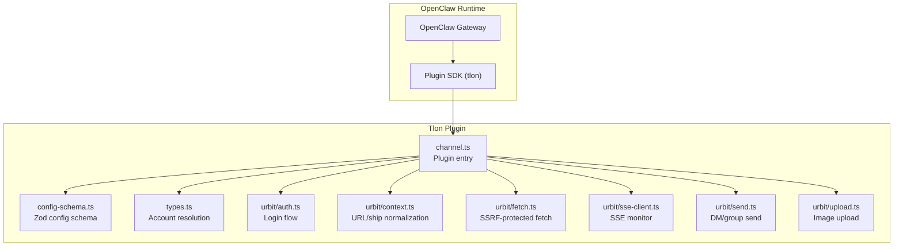
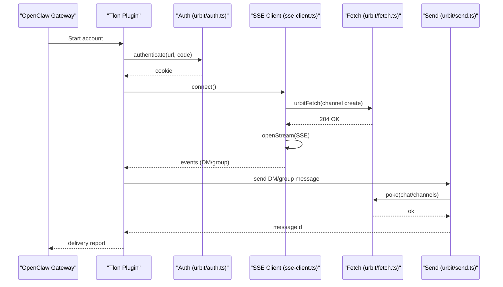
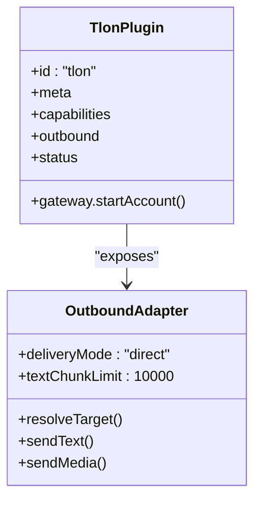
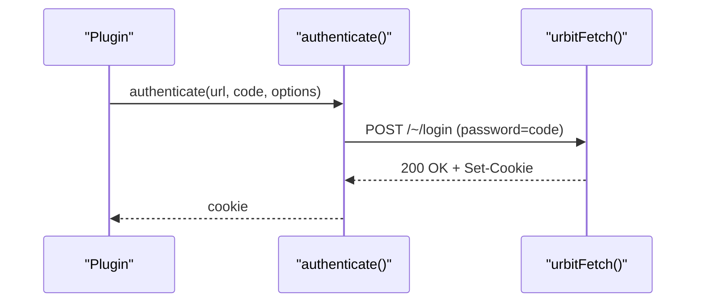
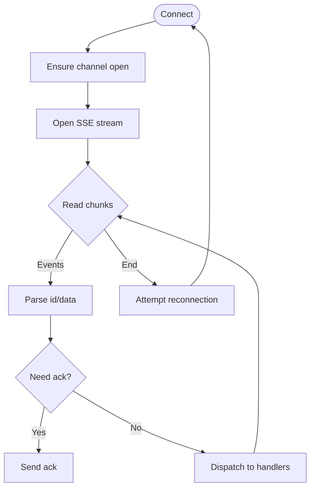
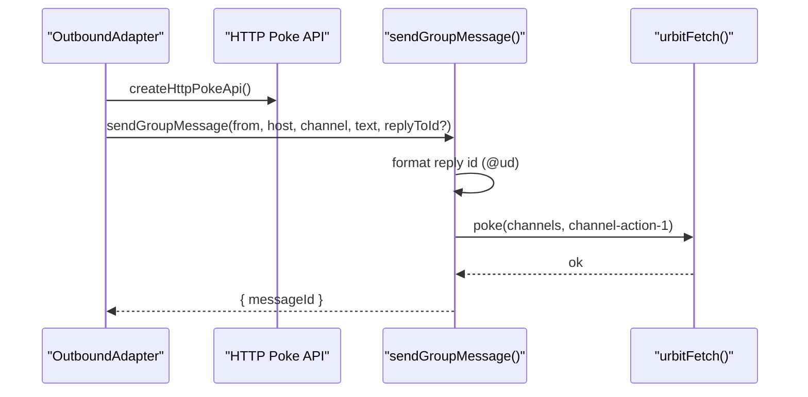
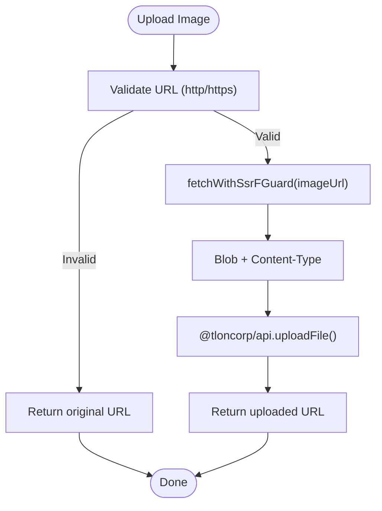
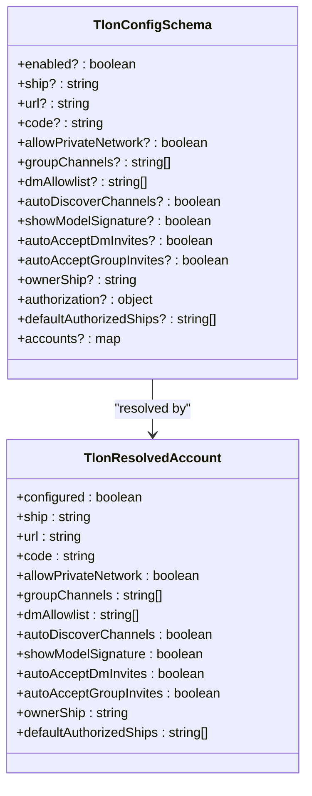
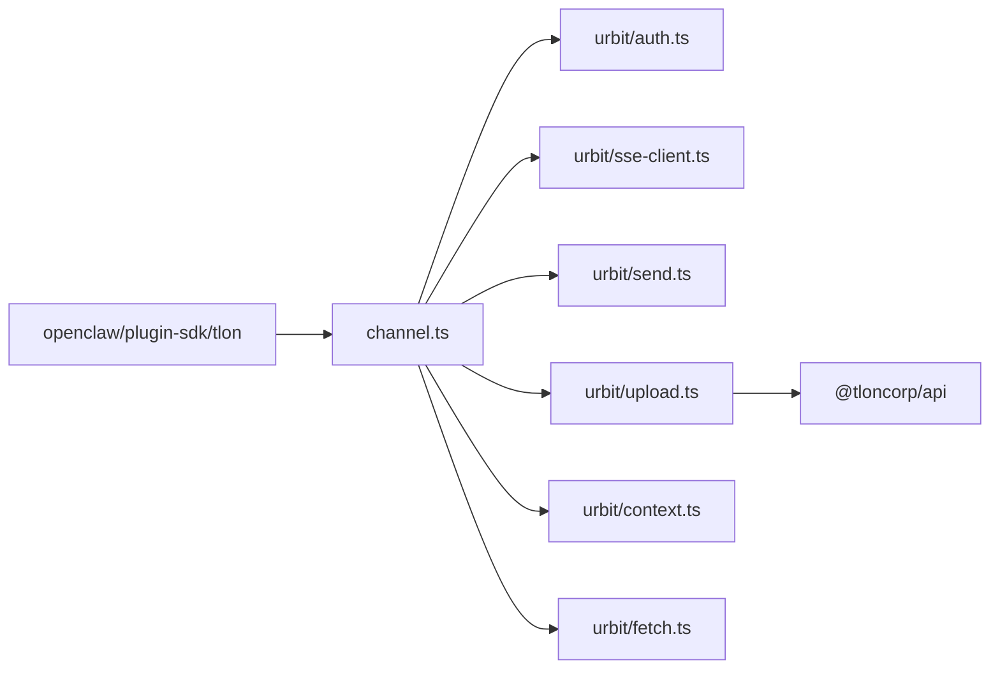

# Tlon Channel

<cite>
**Referenced Files in This Document**
- [docs/channels/tlon.md](file://docs/channels/tlon.md)
- [extensions/tlon/README.md](file://extensions/tlon/README.md)
- [extensions/tlon/src/channel.ts](file://extensions/tlon/src/channel.ts)
- [extensions/tlon/src/config-schema.ts](file://extensions/tlon/src/config-schema.ts)
- [extensions/tlon/src/types.ts](file://extensions/tlon/src/types.ts)
- [extensions/tlon/src/urbit/auth.ts](file://extensions/tlon/src/urbit/auth.ts)
- [extensions/tlon/src/urbit/context.ts](file://extensions/tlon/src/urbit/context.ts)
- [extensions/tlon/src/urbit/fetch.ts](file://extensions/tlon/src/urbit/fetch.ts)
- [extensions/tlon/src/urbit/send.ts](file://extensions/tlon/src/urbit/send.ts)
- [extensions/tlon/src/urbit/sse-client.ts](file://extensions/tlon/src/urbit/sse-client.ts)
- [extensions/tlon/src/urbit/upload.ts](file://extensions/tlon/src/urbit/upload.ts)
</cite>

## Table of Contents
1. [Introduction](#introduction)
2. [Project Structure](#project-structure)
3. [Core Components](#core-components)
4. [Architecture Overview](#architecture-overview)
5. [Detailed Component Analysis](#detailed-component-analysis)
6. [Dependency Analysis](#dependency-analysis)
7. [Performance Considerations](#performance-considerations)
8. [Troubleshooting Guide](#troubleshooting-guide)
9. [Conclusion](#conclusion)
10. [Appendices](#appendices)

## Introduction
This document explains the Tlon (Urbit) channel integration for OpenClaw. It covers how to set up a Urbit ship, authenticate with Tlon, configure the channel, manage groups and messages, and integrate with the Urbit ecosystem. It also documents privacy and security controls, including SSRF protections, private network access, and decentralized identity via Urbit ships.

## Project Structure
The Tlon channel is implemented as an OpenClaw plugin under extensions/tlon. The plugin exposes:
- A channel adapter that integrates with OpenClaw’s messaging pipeline
- Urbit/Tlon authentication and SSE event streaming
- Message sending for DMs and group channels, including media uploads
- Configuration schema and account resolution
- Utilities for SSRF protection and URL handling

**Diagram sources**
- [extensions/tlon/src/channel.ts](file://extensions/tlon/src/channel.ts#L1-L520)
- [extensions/tlon/src/config-schema.ts](file://extensions/tlon/src/config-schema.ts#L1-L47)
- [extensions/tlon/src/types.ts](file://extensions/tlon/src/types.ts#L1-L134)
- [extensions/tlon/src/urbit/auth.ts](file://extensions/tlon/src/urbit/auth.ts#L1-L49)
- [extensions/tlon/src/urbit/context.ts](file://extensions/tlon/src/urbit/context.ts#L1-L57)
- [extensions/tlon/src/urbit/fetch.ts](file://extensions/tlon/src/urbit/fetch.ts#L1-L40)
- [extensions/tlon/src/urbit/sse-client.ts](file://extensions/tlon/src/urbit/sse-client.ts#L1-L505)
- [extensions/tlon/src/urbit/send.ts](file://extensions/tlon/src/urbit/send.ts#L1-L189)
- [extensions/tlon/src/urbit/upload.ts](file://extensions/tlon/src/urbit/upload.ts#L1-L61)

**Section sources**
- [extensions/tlon/README.md](file://extensions/tlon/README.md#L1-L6)
- [extensions/tlon/src/channel.ts](file://extensions/tlon/src/channel.ts#L1-L520)

## Core Components
- Channel plugin definition and capabilities
- Outbound messaging adapter for DMs and group channels
- Authentication and session management with Tlon
- SSE-based monitoring for incoming messages
- Message building and sending utilities
- Media upload pipeline
- Configuration schema and account resolution

**Section sources**
- [extensions/tlon/src/channel.ts](file://extensions/tlon/src/channel.ts#L277-L520)
- [extensions/tlon/src/config-schema.ts](file://extensions/tlon/src/config-schema.ts#L1-L47)
- [extensions/tlon/src/types.ts](file://extensions/tlon/src/types.ts#L1-L134)

## Architecture Overview
The Tlon channel runs as a plugin within OpenClaw. It authenticates against a Tlon ship, opens an SSE channel to receive events, and sends messages via HTTP poke operations. Media uploads are handled by fetching and uploading to Tlon’s storage.

**Diagram sources**
- [extensions/tlon/src/channel.ts](file://extensions/tlon/src/channel.ts#L504-L518)
- [extensions/tlon/src/urbit/auth.ts](file://extensions/tlon/src/urbit/auth.ts#L12-L48)
- [extensions/tlon/src/urbit/sse-client.ts](file://extensions/tlon/src/urbit/sse-client.ts#L148-L168)
- [extensions/tlon/src/urbit/fetch.ts](file://extensions/tlon/src/urbit/fetch.ts#L20-L39)
- [extensions/tlon/src/urbit/send.ts](file://extensions/tlon/src/urbit/send.ts#L22-L56)

## Detailed Component Analysis

### Channel Plugin and Messaging Adapter
- Defines plugin metadata, capabilities, and lifecycle hooks
- Implements outbound messaging adapter supporting text and media
- Resolves targets (DM vs group) and normalizes them
- Probes account health and builds snapshots for status reporting

**Diagram sources**
- [extensions/tlon/src/channel.ts](file://extensions/tlon/src/channel.ts#L277-L520)

**Section sources**
- [extensions/tlon/src/channel.ts](file://extensions/tlon/src/channel.ts#L156-L275)
- [extensions/tlon/src/channel.ts](file://extensions/tlon/src/channel.ts#L406-L520)

### Authentication and Session Management
- Authenticates against Tlon using a login code
- Validates base URL and enforces SSRF policy
- Returns a normalized cookie for subsequent requests

**Diagram sources**
- [extensions/tlon/src/urbit/auth.ts](file://extensions/tlon/src/urbit/auth.ts#L12-L48)
- [extensions/tlon/src/urbit/fetch.ts](file://extensions/tlon/src/urbit/fetch.ts#L20-L39)

**Section sources**
- [extensions/tlon/src/urbit/auth.ts](file://extensions/tlon/src/urbit/auth.ts#L1-L49)
- [extensions/tlon/src/urbit/context.ts](file://extensions/tlon/src/urbit/context.ts#L31-L47)

### SSE Monitoring and Event Handling
- Creates a channel and subscribes to app/path streams
- Streams events over SSE, tracks and acknowledges event IDs
- Handles reconnection with exponential backoff and resets after max attempts

**Diagram sources**
- [extensions/tlon/src/urbit/sse-client.ts](file://extensions/tlon/src/urbit/sse-client.ts#L148-L252)
- [extensions/tlon/src/urbit/sse-client.ts](file://extensions/tlon/src/urbit/sse-client.ts#L389-L433)

**Section sources**
- [extensions/tlon/src/urbit/sse-client.ts](file://extensions/tlon/src/urbit/sse-client.ts#L1-L505)

### Message Sending (DMs and Groups)
- Converts Markdown to Tlon story format
- Sends DMs via chat-dm-action
- Sends group posts/replies via channels/mark
- Formats numeric reply IDs as @ud for thread replies

**Diagram sources**
- [extensions/tlon/src/channel.ts](file://extensions/tlon/src/channel.ts#L183-L217)
- [extensions/tlon/src/urbit/send.ts](file://extensions/tlon/src/urbit/send.ts#L76-L152)

**Section sources**
- [extensions/tlon/src/urbit/send.ts](file://extensions/tlon/src/urbit/send.ts#L1-L189)

### Media Upload Pipeline
- Fetches images via SSRF-protected fetch
- Uploads to Tlon storage and returns the uploaded URL
- Embeds images or links into stories

**Diagram sources**
- [extensions/tlon/src/urbit/upload.ts](file://extensions/tlon/src/urbit/upload.ts#L14-L60)

**Section sources**
- [extensions/tlon/src/urbit/upload.ts](file://extensions/tlon/src/urbit/upload.ts#L1-L61)

### Configuration and Account Resolution
- Zod-based configuration schema for channel settings
- Support for single and multi-account configurations
- Resolves effective account values, defaults, and flags

**Diagram sources**
- [extensions/tlon/src/config-schema.ts](file://extensions/tlon/src/config-schema.ts#L16-L46)
- [extensions/tlon/src/types.ts](file://extensions/tlon/src/types.ts#L25-L122)

**Section sources**
- [extensions/tlon/src/config-schema.ts](file://extensions/tlon/src/config-schema.ts#L1-L47)
- [extensions/tlon/src/types.ts](file://extensions/tlon/src/types.ts#L1-L134)

## Dependency Analysis
- The plugin depends on the OpenClaw plugin SDK for channel interfaces and SSRF utilities
- It uses TlonCorp APIs for authentication and media upload
- It interacts with Urbit via HTTP pokes and SSE streams

**Diagram sources**
- [extensions/tlon/src/channel.ts](file://extensions/tlon/src/channel.ts#L1-L31)
- [extensions/tlon/src/urbit/upload.ts](file://extensions/tlon/src/urbit/upload.ts#L4-L6)
- [extensions/tlon/src/urbit/fetch.ts](file://extensions/tlon/src/urbit/fetch.ts#L2-L3)

**Section sources**
- [extensions/tlon/src/channel.ts](file://extensions/tlon/src/channel.ts#L1-L31)

## Performance Considerations
- SSE event acknowledgment threshold prevents backlog and maintains responsiveness
- Exponential backoff with periodic reset avoids thundering herds on persistent failures
- Text chunk limit ensures long messages are delivered reliably
- SSRF-protected fetch prevents unnecessary DNS pinning overhead outside of controlled paths

[No sources needed since this section provides general guidance]

## Troubleshooting Guide
- Use the documented status and doctor commands to diagnose connectivity and configuration
- Common issues include missing allowlist entries, untrusted private network URLs, and expired login codes
- Verify ship URL reachability and enable private network allowance only when necessary

**Section sources**
- [docs/channels/tlon.md](file://docs/channels/tlon.md#L232-L277)

## Conclusion
The Tlon channel plugin integrates OpenClaw with Tlon/Urbit, enabling secure DMs, group mentions, thread replies, and media sharing. It enforces strong privacy controls via SSRF policies, supports multi-account configurations, and provides robust monitoring and delivery mechanisms.

[No sources needed since this section summarizes without analyzing specific files]

## Appendices

### Setup and Configuration Reference
- Install the plugin and configure minimal settings for a single account
- Enable private network access only for local ships and trust your network
- Manage group channels via auto-discovery or manual pinning
- Control access with allowlists and owner-based approval flows
- Use CLI delivery targets for DMs and group channels

**Section sources**
- [docs/channels/tlon.md](file://docs/channels/tlon.md#L35-L110)
- [docs/channels/tlon.md](file://docs/channels/tlon.md#L111-L196)
- [docs/channels/tlon.md](file://docs/channels/tlon.md#L198-L218)
- [docs/channels/tlon.md](file://docs/channels/tlon.md#L250-L277)