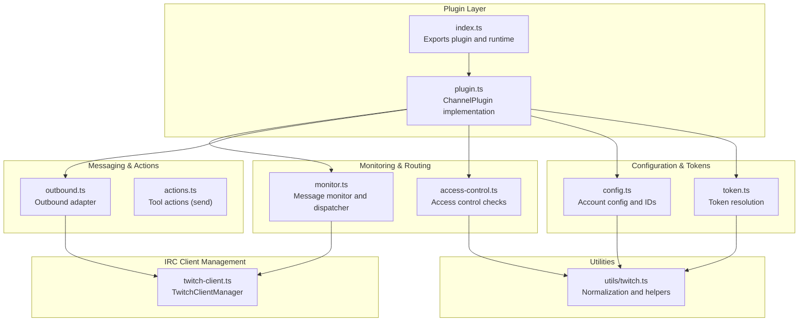
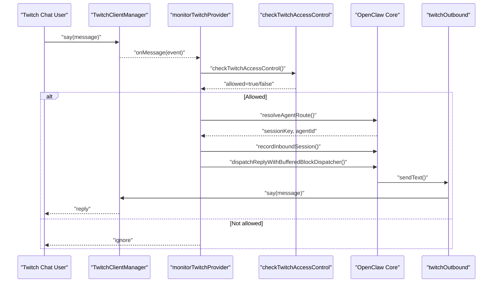
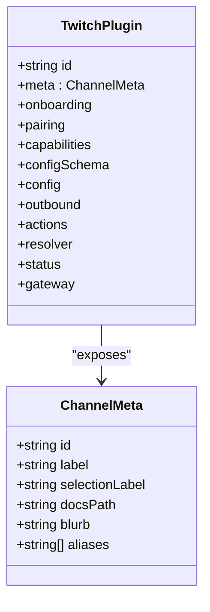
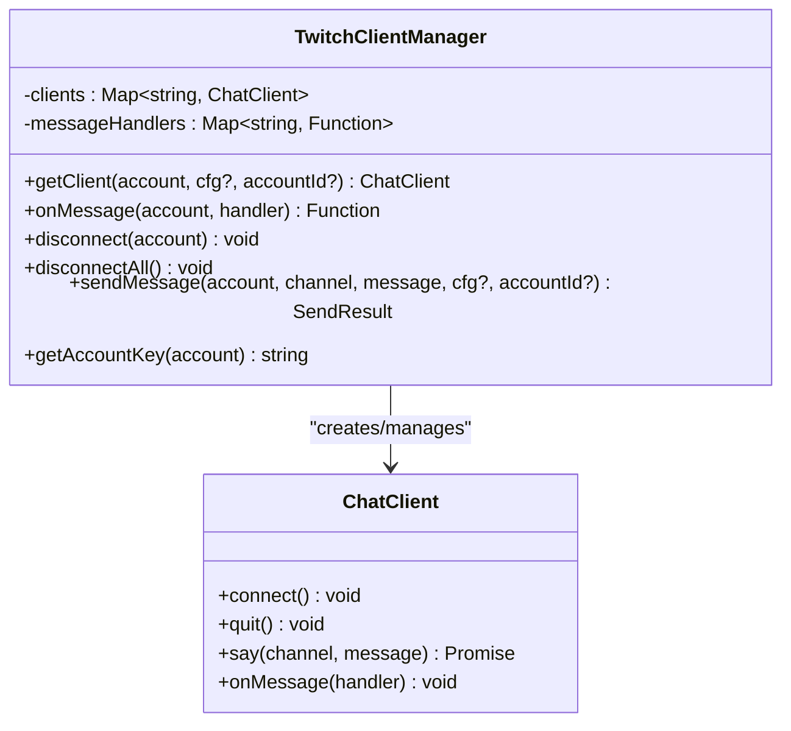
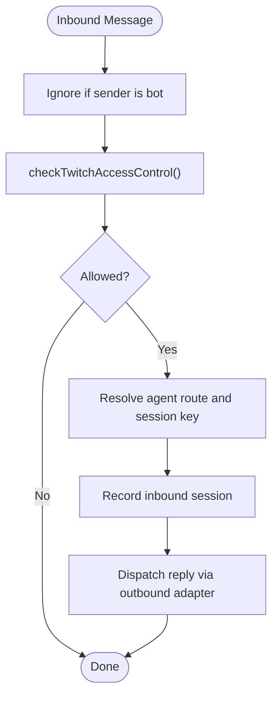
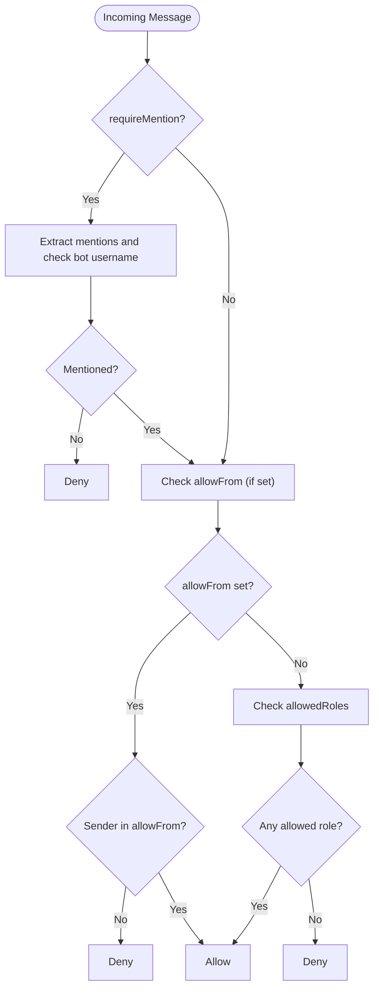
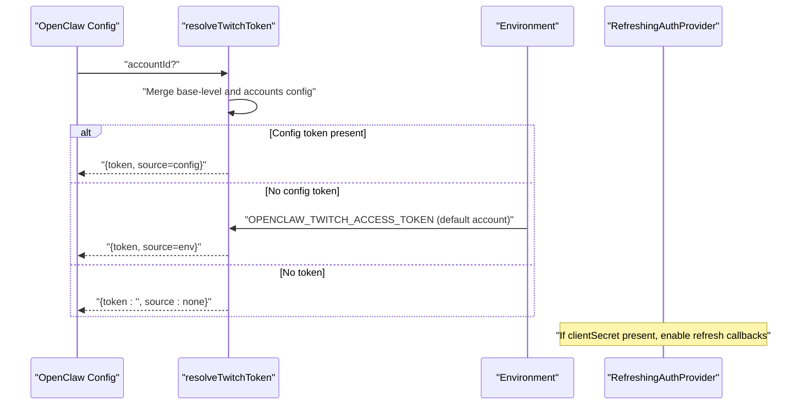
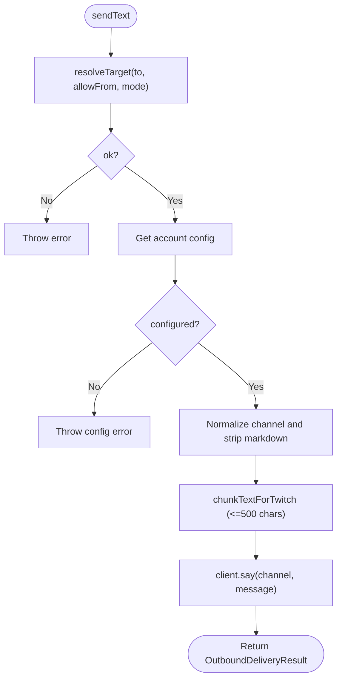
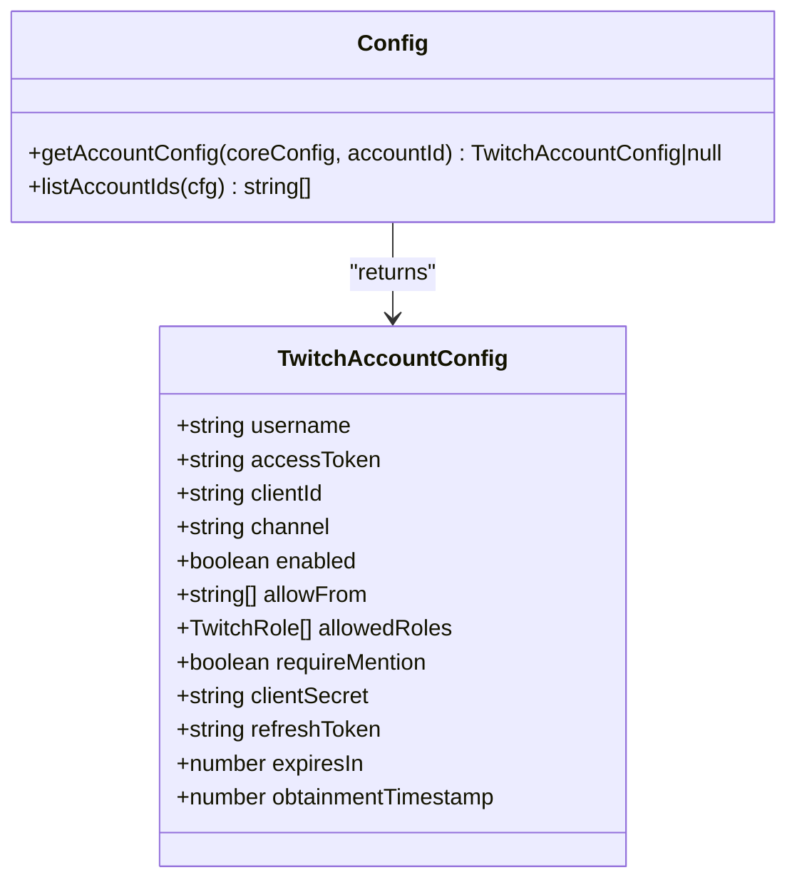
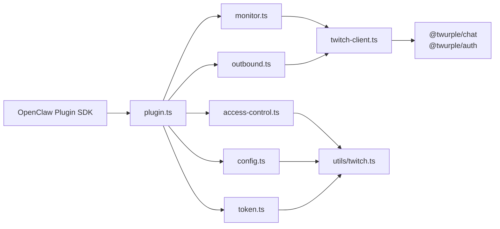

# Twitch Channel

<cite>
**Referenced Files in This Document**
- [index.ts](file://extensions/twitch/index.ts)
- [plugin.ts](file://extensions/twitch/src/plugin.ts)
- [twitch-client.ts](file://extensions/twitch/src/twitch-client.ts)
- [monitor.ts](file://extensions/twitch/src/monitor.ts)
- [access-control.ts](file://extensions/twitch/src/access-control.ts)
- [token.ts](file://extensions/twitch/src/token.ts)
- [outbound.ts](file://extensions/twitch/src/outbound.ts)
- [config.ts](file://extensions/twitch/src/config.ts)
- [types.ts](file://extensions/twitch/src/types.ts)
- [utils/twitch.ts](file://extensions/twitch/src/utils/twitch.ts)
- [README.md](file://extensions/twitch/README.md)
- [twitch.md](file://docs/channels/twitch.md)
</cite>

## Table of Contents
1. [Introduction](#introduction)
2. [Project Structure](#project-structure)
3. [Core Components](#core-components)
4. [Architecture Overview](#architecture-overview)
5. [Detailed Component Analysis](#detailed-component-analysis)
6. [Dependency Analysis](#dependency-analysis)
7. [Performance Considerations](#performance-considerations)
8. [Troubleshooting Guide](#troubleshooting-guide)
9. [Conclusion](#conclusion)
10. [Appendices](#appendices)

## Introduction
This document explains the Twitch channel integration for OpenClaw, focusing on IRC-based chat connectivity, OAuth authentication, access control, and operational features. It covers how the plugin connects to Twitch chat, authenticates via OAuth tokens, enforces access control policies, and supports outbound messaging and moderation-related capabilities. It also provides setup guidance for the Twitch developer console, IRC connection, and webhook configuration, along with streaming-specific features and community management tools.

## Project Structure
The Twitch integration is implemented as an OpenClaw plugin with a clear separation of concerns:
- Plugin entry and registration
- Client management for IRC connections
- Message monitoring and routing
- Access control enforcement
- Token resolution and refresh
- Outbound messaging and chunking
- Configuration parsing and account management
- Utility functions for Twitch-specific normalization and validation

**Diagram sources**
- [index.ts](file://extensions/twitch/index.ts#L1-L21)
- [plugin.ts](file://extensions/twitch/src/plugin.ts#L1-L275)
- [twitch-client.ts](file://extensions/twitch/src/twitch-client.ts#L1-L278)
- [monitor.ts](file://extensions/twitch/src/monitor.ts#L1-L274)
- [access-control.ts](file://extensions/twitch/src/access-control.ts#L1-L167)
- [outbound.ts](file://extensions/twitch/src/outbound.ts#L1-L188)
- [config.ts](file://extensions/twitch/src/config.ts#L1-L117)
- [token.ts](file://extensions/twitch/src/token.ts#L1-L95)
- [utils/twitch.ts](file://extensions/twitch/src/utils/twitch.ts#L1-L81)

**Section sources**
- [index.ts](file://extensions/twitch/index.ts#L1-L21)
- [plugin.ts](file://extensions/twitch/src/plugin.ts#L1-L275)
- [README.md](file://extensions/twitch/README.md#L1-L90)
- [twitch.md](file://docs/channels/twitch.md#L1-L380)

## Core Components
- Plugin registration and metadata: registers the Twitch channel with OpenClaw and sets runtime context.
- Client manager: creates and maintains ChatClient instances per account, manages authentication providers, and handles message events.
- Monitor: receives inbound messages, applies access control, records sessions, and dispatches replies.
- Access control: enforces allowlists, role-based restrictions, and mention requirements.
- Token resolution: resolves tokens from config or environment variables with precedence rules.
- Outbound adapter: resolves targets, chunks text respecting Twitch limits, and sends messages.
- Configuration: merges simplified single-account and multi-account configurations.
- Utilities: normalize channel names, generate message IDs, and validate account configuration.

**Section sources**
- [plugin.ts](file://extensions/twitch/src/plugin.ts#L39-L275)
- [twitch-client.ts](file://extensions/twitch/src/twitch-client.ts#L11-L278)
- [monitor.ts](file://extensions/twitch/src/monitor.ts#L38-L274)
- [access-control.ts](file://extensions/twitch/src/access-control.ts#L34-L167)
- [token.ts](file://extensions/twitch/src/token.ts#L54-L95)
- [outbound.ts](file://extensions/twitch/src/outbound.ts#L24-L188)
- [config.ts](file://extensions/twitch/src/config.ts#L19-L117)
- [utils/twitch.ts](file://extensions/twitch/src/utils/twitch.ts#L20-L81)

## Architecture Overview
The Twitch integration follows a modular architecture:
- The plugin exposes a ChannelPlugin interface with adapters for onboarding, configuration, outbound messaging, actions, resolver, status, and gateway lifecycle.
- The monitor subscribes to inbound messages via the client manager, applies access control, and dispatches replies.
- The outbound adapter chunks and sends messages, leveraging the client manager for IRC connectivity.
- Token resolution and configuration management ensure proper authentication and routing across accounts.

**Diagram sources**
- [monitor.ts](file://extensions/twitch/src/monitor.ts#L228-L263)
- [access-control.ts](file://extensions/twitch/src/access-control.ts#L34-L110)
- [outbound.ts](file://extensions/twitch/src/outbound.ts#L108-L149)
- [twitch-client.ts](file://extensions/twitch/src/twitch-client.ts#L162-L187)

**Section sources**
- [plugin.ts](file://extensions/twitch/src/plugin.ts#L118-L274)
- [monitor.ts](file://extensions/twitch/src/monitor.ts#L192-L274)
- [twitch-client.ts](file://extensions/twitch/src/twitch-client.ts#L77-L153)

## Detailed Component Analysis

### Plugin Registration and Metadata
The plugin exports metadata, registers the channel with OpenClaw, and wires runtime context for Twitch-specific operations.

**Diagram sources**
- [plugin.ts](file://extensions/twitch/src/plugin.ts#L44-L51)

**Section sources**
- [index.ts](file://extensions/twitch/index.ts#L8-L21)
- [plugin.ts](file://extensions/twitch/src/plugin.ts#L39-L117)

### IRC Client Management and Authentication
The client manager encapsulates authentication providers and ChatClient lifecycle:
- Uses StaticAuthProvider when only an access token is provided.
- Uses RefreshingAuthProvider when clientSecret is present, enabling automatic token refresh with callbacks for success/failure.
- Connects to the specified channel and normalizes log levels to OpenClaw’s logging sink.
- Emits inbound messages to registered handlers and supports sending replies.

**Diagram sources**
- [twitch-client.ts](file://extensions/twitch/src/twitch-client.ts#L11-L278)

**Section sources**
- [twitch-client.ts](file://extensions/twitch/src/twitch-client.ts#L20-L72)
- [twitch-client.ts](file://extensions/twitch/src/twitch-client.ts#L77-L153)
- [twitch-client.ts](file://extensions/twitch/src/twitch-client.ts#L158-L190)
- [twitch-client.ts](file://extensions/twitch/src/twitch-client.ts#L235-L261)

### Message Monitoring and Dispatch
The monitor coordinates inbound message processing:
- Ignores self-messages.
- Applies access control checks.
- Resolves agent routes and session keys.
- Records inbound sessions and dispatches replies via the outbound adapter.

**Diagram sources**
- [monitor.ts](file://extensions/twitch/src/monitor.ts#L228-L263)
- [access-control.ts](file://extensions/twitch/src/access-control.ts#L34-L110)

**Section sources**
- [monitor.ts](file://extensions/twitch/src/monitor.ts#L38-L137)
- [monitor.ts](file://extensions/twitch/src/monitor.ts#L142-L185)

### Access Control and Permissions
Access control supports:
- Mention requirement: messages must mention the bot when enabled.
- Allowlist: restrict to specific user IDs (recommended for security).
- Role-based access: moderators, owners, VIPs, subscribers, or “all”.

**Diagram sources**
- [access-control.ts](file://extensions/twitch/src/access-control.ts#L34-L110)
- [access-control.ts](file://extensions/twitch/src/access-control.ts#L115-L145)

**Section sources**
- [access-control.ts](file://extensions/twitch/src/access-control.ts#L13-L110)

### Token Resolution and Refresh
Token resolution prioritizes:
- Account-level token from merged config.
- Environment variable for the default account only.
Automatic refresh is enabled when clientSecret is provided and a refresh token is available.

**Diagram sources**
- [token.ts](file://extensions/twitch/src/token.ts#L54-L95)
- [twitch-client.ts](file://extensions/twitch/src/twitch-client.ts#L28-L72)

**Section sources**
- [token.ts](file://extensions/twitch/src/token.ts#L25-L95)
- [twitch-client.ts](file://extensions/twitch/src/twitch-client.ts#L28-L72)

### Outbound Messaging and Chunking
The outbound adapter:
- Resolves targets with allowlist support for implicit/heartbeat modes.
- Enforces a 500-character limit and uses word-boundary chunking with markdown stripping.
- Sends via the client manager and returns delivery results with message IDs.

**Diagram sources**
- [outbound.ts](file://extensions/twitch/src/outbound.ts#L43-L89)
- [outbound.ts](file://extensions/twitch/src/outbound.ts#L108-L149)

**Section sources**
- [outbound.ts](file://extensions/twitch/src/outbound.ts#L24-L188)
- [utils/twitch.ts](file://extensions/twitch/src/utils/twitch.ts#L20-L46)

### Configuration and Account Management
Configuration supports:
- Simplified single-account mode (base-level properties) and multi-account mode (accounts object).
- Merging base-level and accounts.default properties, with base-level precedence for the default account.
- Listing configured account IDs and validating account completeness.

**Diagram sources**
- [config.ts](file://extensions/twitch/src/config.ts#L19-L117)
- [types.ts](file://extensions/twitch/src/types.ts#L39-L66)

**Section sources**
- [config.ts](file://extensions/twitch/src/config.ts#L19-L117)
- [types.ts](file://extensions/twitch/src/types.ts#L39-L66)

### Twitch-Specific Utilities
Utilities provide:
- Channel name normalization (lowercase, strip leading #).
- Standardized error creation for missing targets.
- Message ID generation for tracking.
- Token normalization (strip oauth: prefix).
- Account configuration validation.

**Section sources**
- [utils/twitch.ts](file://extensions/twitch/src/utils/twitch.ts#L20-L81)

## Dependency Analysis
The plugin depends on OpenClaw’s plugin SDK and integrates with external libraries for Twitch authentication and chat:
- OpenClaw plugin SDK types and adapters
- Twurple for authentication and chat client
- Internal utilities for Twitch-specific normalization

**Diagram sources**
- [plugin.ts](file://extensions/twitch/src/plugin.ts#L1-L31)
- [twitch-client.ts](file://extensions/twitch/src/twitch-client.ts#L1-L7)
- [monitor.ts](file://extensions/twitch/src/monitor.ts#L1-L15)

**Section sources**
- [plugin.ts](file://extensions/twitch/src/plugin.ts#L1-L31)
- [twitch-client.ts](file://extensions/twitch/src/twitch-client.ts#L1-L7)

## Performance Considerations
- Rate limiting: relies on Twitch’s built-in rate limits; the outbound adapter respects a 500-character limit and chunks messages at word boundaries.
- Logging: client logs are normalized to OpenClaw’s logging levels; verbose logging can be enabled via the core logger.
- Token refresh: automatic refresh reduces downtime and improves reliability for long-running deployments.

[No sources needed since this section provides general guidance]

## Troubleshooting Guide
Common issues and resolutions:
- Bot does not respond: verify access control settings (allowFrom or allowedRoles), ensure the bot is joined to the correct channel.
- Authentication failures: confirm the access token has required scopes, includes the oauth: prefix, and that clientId/clientSecret/refreshToken are correctly configured for automatic refresh.
- Token refresh not working: check for refresh callbacks and ensure clientSecret and refreshToken are provided.

Operational diagnostics:
- Use diagnostic commands to probe channel status and connectivity.

**Section sources**
- [twitch.md](file://docs/channels/twitch.md#L249-L286)
- [twitch.md](file://docs/channels/twitch.md#L251-L256)

## Conclusion
The Twitch channel integration provides a robust, configurable, and secure bridge to Twitch chat via IRC. It supports flexible authentication, granular access control, reliable message delivery with chunking, and operational monitoring. By following the setup and configuration guidance, operators can deploy a production-ready bot with strong security controls and clear observability.

[No sources needed since this section summarizes without analyzing specific files]

## Appendices

### Setup Procedures
- Install the plugin via npm or local checkout.
- Generate credentials using the Twitch Token Generator (Bot Token with chat:read and chat:write scopes).
- Configure tokens via environment variables or config; for automatic refresh, add clientSecret and refreshToken.
- Start the gateway and verify connectivity.

**Section sources**
- [README.md](file://extensions/twitch/README.md#L5-L90)
- [twitch.md](file://docs/channels/twitch.md#L30-L106)

### Webhook Configuration
Webhooks are not used for Twitch chat integration in this implementation. The plugin connects directly to Twitch chat via IRC and does not expose webhook endpoints for chat events.

[No sources needed since this section clarifies absence of webhooks]

### Streaming and Community Features
- Subscriber and VIP indicators are used for access control decisions.
- Broadcaster permissions are represented via ownership flags for moderation-aware routing.
- Channel points and other monetization features are not integrated in this plugin; focus is on chat moderation and message routing.

**Section sources**
- [access-control.ts](file://extensions/twitch/src/access-control.ts#L117-L142)
- [types.ts](file://extensions/twitch/src/types.ts#L96-L103)