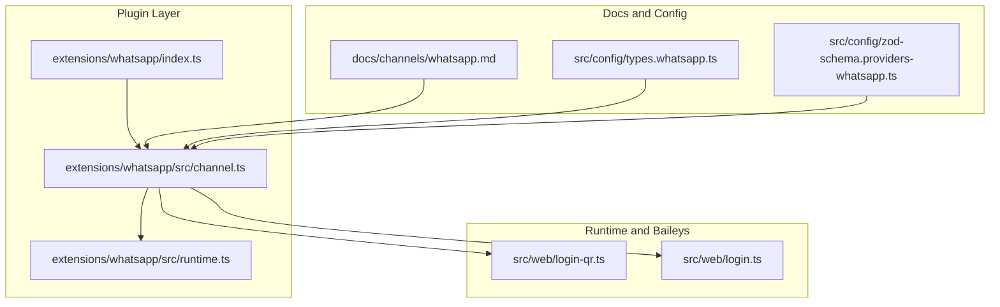
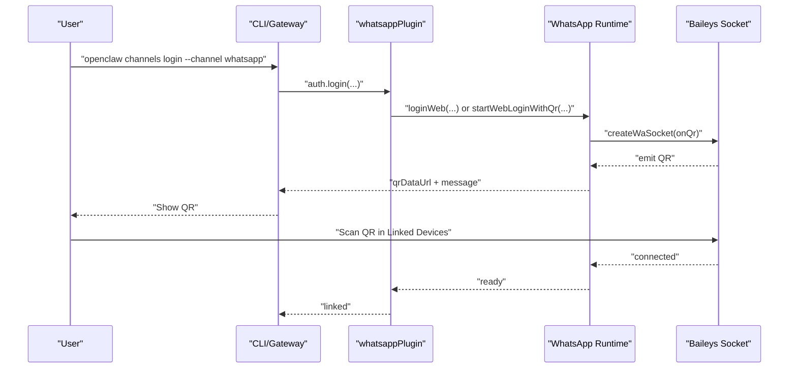
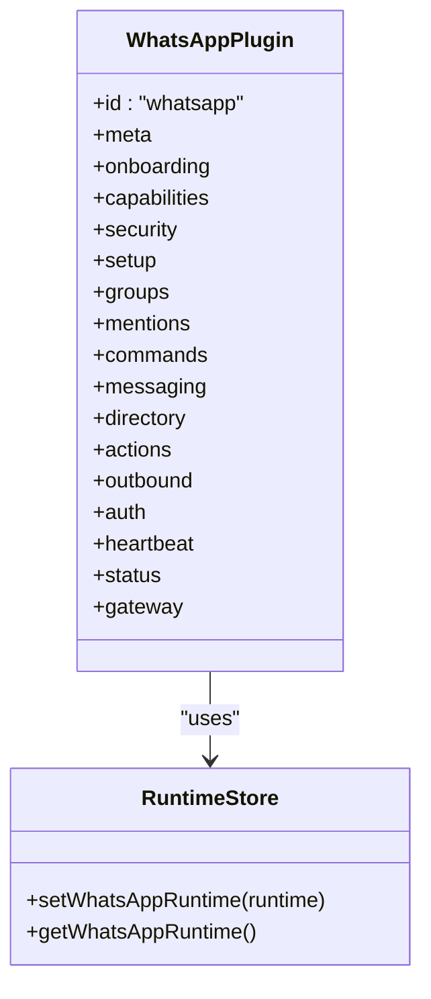
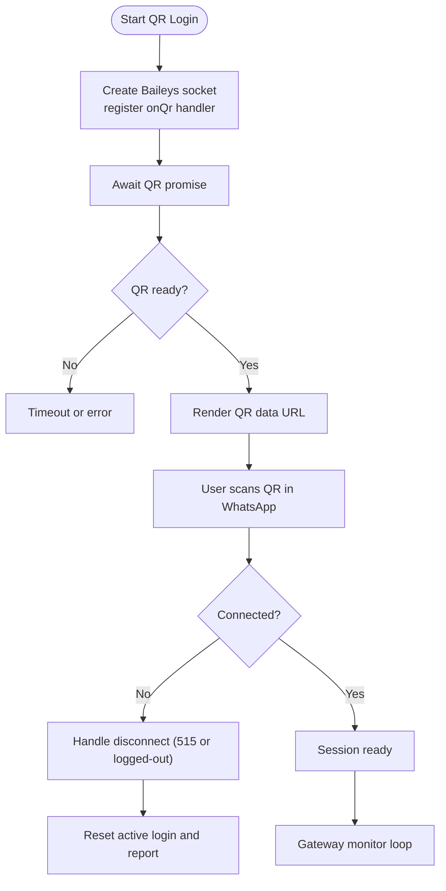
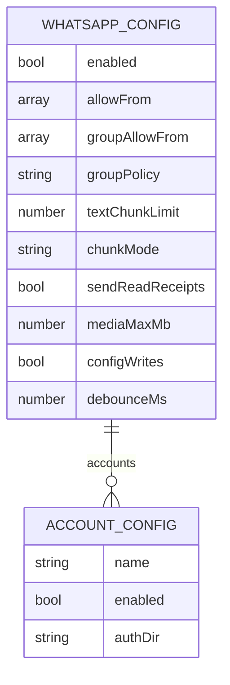
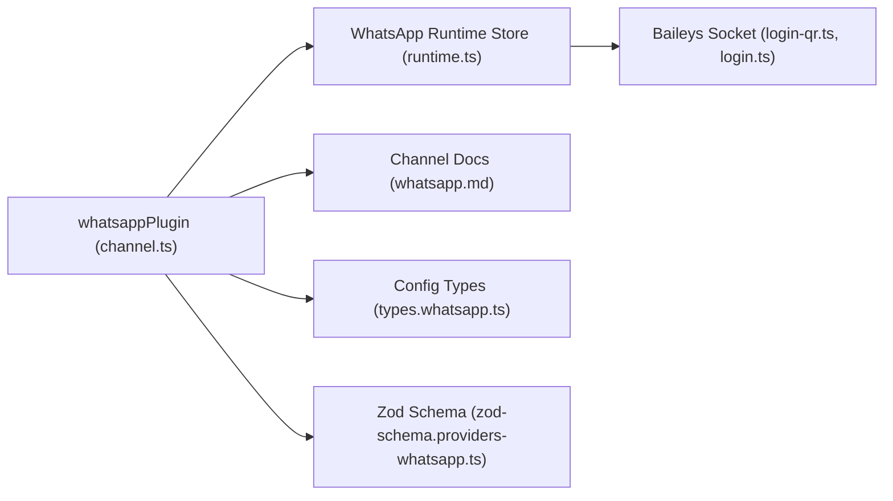

# WhatsApp Channel

<cite>
**Referenced Files in This Document**
- [index.ts](file://extensions/whatsapp/index.ts)
- [channel.ts](file://extensions/whatsapp/src/channel.ts)
- [runtime.ts](file://extensions/whatsapp/src/runtime.ts)
- [channel.test.ts](file://extensions/whatsapp/src/channel.test.ts)
- [channel.outbound.test.ts](file://extensions/whatsapp/src/channel.outbound.test.ts)
- [openclaw.plugin.json](file://extensions/whatsapp/openclaw.plugin.json)
- [whatsapp.md](file://docs/channels/whatsapp.md)
- [login-qr.ts](file://src/web/login-qr.ts)
- [login.ts](file://src/web/login.ts)
- [types.whatsapp.ts](file://src/config/types.whatsapp.ts)
- [zod-schema.providers-whatsapp.ts](file://src/config/zod-schema.providers-whatsapp.ts)
- [SKILL.md](file://skills/wacli/SKILL.md)
</cite>

## Table of Contents
1. [Introduction](#introduction)
2. [Project Structure](#project-structure)
3. [Core Components](#core-components)
4. [Architecture Overview](#architecture-overview)
5. [Detailed Component Analysis](#detailed-component-analysis)
6. [Dependency Analysis](#dependency-analysis)
7. [Performance Considerations](#performance-considerations)
8. [Troubleshooting Guide](#troubleshooting-guide)
9. [Conclusion](#conclusion)
10. [Appendices](#appendices)

## Introduction
This document describes the WhatsApp channel integration powered by Baileys (WhatsApp Web). It covers the plugin architecture, QR pairing flow, authentication and session management, configuration options, message handling, media support, rate limiting considerations, security posture, and platform-specific constraints. It also provides setup procedures, webhook-related operations, and troubleshooting guidance.

## Project Structure
The WhatsApp channel is implemented as a plugin that registers a ChannelPlugin with the OpenClaw runtime. The plugin delegates Baileys-based operations to a runtime store that exposes WhatsApp-specific APIs for login, monitoring, sending messages, and managing credentials.

**Diagram sources**
- [index.ts](file://extensions/whatsapp/index.ts#L1-L18)
- [channel.ts](file://extensions/whatsapp/src/channel.ts#L1-L474)
- [runtime.ts](file://extensions/whatsapp/src/runtime.ts#L1-L7)
- [login-qr.ts](file://src/web/login-qr.ts#L1-L296)
- [login.ts](file://src/web/login.ts#L1-L79)
- [whatsapp.md](file://docs/channels/whatsapp.md#L1-L446)
- [types.whatsapp.ts](file://src/config/types.whatsapp.ts#L83-L116)
- [zod-schema.providers-whatsapp.ts](file://src/config/zod-schema.providers-whatsapp.ts#L34-L59)

**Section sources**
- [index.ts](file://extensions/whatsapp/index.ts#L1-L18)
- [channel.ts](file://extensions/whatsapp/src/channel.ts#L1-L474)
- [runtime.ts](file://extensions/whatsapp/src/runtime.ts#L1-L7)
- [whatsapp.md](file://docs/channels/whatsapp.md#L1-L446)
- [types.whatsapp.ts](file://src/config/types.whatsapp.ts#L83-L116)
- [zod-schema.providers-whatsapp.ts](file://src/config/zod-schema.providers-whatsapp.ts#L34-L59)

## Core Components
- Plugin registration and bootstrap:
  - The plugin exports an id, name, description, and an empty config schema, and registers the ChannelPlugin with the runtime.
- Channel plugin definition:
  - Provides capabilities (direct/group chat, media, reactions, polls), security policies, messaging targets, directory resolution, outbound senders, auth/login, heartbeat/status, and gateway lifecycle hooks.
- Runtime store:
  - Exposes WhatsApp runtime APIs (login, monitor, send, auth checks) to the plugin.
- Baileys QR login and connection:
  - Implements QR generation, waiting for scans, and robust handling of disconnect reasons (including restart code 515 and logged-out state).
- Documentation and configuration:
  - Comprehensive channel docs define policies, delivery behavior, media limits, acknowledgment reactions, and troubleshooting.
  - TypeScript and Zod schemas define configuration shapes and defaults.

**Section sources**
- [index.ts](file://extensions/whatsapp/index.ts#L1-L18)
- [channel.ts](file://extensions/whatsapp/src/channel.ts#L43-L474)
- [runtime.ts](file://extensions/whatsapp/src/runtime.ts#L1-L7)
- [login-qr.ts](file://src/web/login-qr.ts#L108-L296)
- [login.ts](file://src/web/login.ts#L10-L79)
- [whatsapp.md](file://docs/channels/whatsapp.md#L1-L446)
- [types.whatsapp.ts](file://src/config/types.whatsapp.ts#L83-L116)
- [zod-schema.providers-whatsapp.ts](file://src/config/zod-schema.providers-whatsapp.ts#L34-L59)

## Architecture Overview
The WhatsApp channel integrates with the OpenClaw runtime via a plugin contract. The plugin orchestrates:
- Authentication: QR-based linking via Baileys.
- Monitoring: Long-lived gateway listener per account.
- Messaging: Text, media, and poll sends; inbound normalization and context.
- Security: DM/group allowlists, mention gating, and self-chat protections.
- Operations: Heartbeat, status snapshots, and logout.

**Diagram sources**
- [channel.ts](file://extensions/whatsapp/src/channel.ts#L332-L342)
- [login-qr.ts](file://src/web/login-qr.ts#L108-L214)
- [login.ts](file://src/web/login.ts#L10-L79)

## Detailed Component Analysis

### Plugin Registration and Channel Contract
- Registration:
  - Sets the runtime for WhatsApp and registers the ChannelPlugin under the "whatsapp" id.
- Channel contract highlights:
  - Capabilities: direct/group chat, media, reactions, polls.
  - Security: DM policy builder, warnings collection for group policies.
  - Messaging: target normalization, resolver hints, directory self/peers/groups.
  - Outbound: gateway-driven delivery, chunking, text/media/poll senders.
  - Auth/Login: QR start/wait, logout.
  - Heartbeat/Status: readiness checks, snapshots, issue collection.
  - Gateway lifecycle: start account monitor, QR login methods.

**Diagram sources**
- [channel.ts](file://extensions/whatsapp/src/channel.ts#L43-L474)
- [runtime.ts](file://extensions/whatsapp/src/runtime.ts#L1-L7)

**Section sources**
- [index.ts](file://extensions/whatsapp/index.ts#L6-L15)
- [channel.ts](file://extensions/whatsapp/src/channel.ts#L43-L474)
- [runtime.ts](file://extensions/whatsapp/src/runtime.ts#L1-L7)

### QR Pairing Flow and Session Management
- Start QR:
  - Creates a Baileys socket, listens for QR, renders a data URL, and tracks an active login window.
- Wait for login:
  - Polls until connection or timeout; handles special disconnect codes (e.g., 515 restart, logged-out).
- Session lifecycle:
  - After successful pairing, the gateway monitors the account and maintains connectivity.
- Logout:
  - Clears stored credentials for the selected account.

**Diagram sources**
- [login-qr.ts](file://src/web/login-qr.ts#L108-L296)
- [login.ts](file://src/web/login.ts#L10-L79)

**Section sources**
- [login-qr.ts](file://src/web/login-qr.ts#L108-L296)
- [login.ts](file://src/web/login.ts#L10-L79)
- [channel.ts](file://extensions/whatsapp/src/channel.ts#L455-L471)

### Authentication Requirements and Credential Paths
- Credential storage:
  - Current path: user credential directory with per-account subfolders.
  - Backup file is maintained alongside credentials.
  - Legacy default location is still recognized and migrated for default accounts.
- Logout behavior:
  - Clears Baileys auth files; preserves OAuth where applicable.

**Section sources**
- [whatsapp.md](file://docs/channels/whatsapp.md#L352-L363)

### Configuration Options
- Access control:
  - DM policy, allow-from lists, group policy, group sender allowlist, and group allowlist.
- Delivery and media:
  - Text chunking limits and modes, read receipts toggle, media size caps, acknowledgment reactions.
- Multi-account:
  - Account enablement, auth directory overrides, and per-account settings.
- Operations:
  - Config writes toggle, debounce, heartbeat visibility, and reconnect behavior.
- Session behavior:
  - DM scope, history limits, and per-session overrides.

**Diagram sources**
- [types.whatsapp.ts](file://src/config/types.whatsapp.ts#L83-L116)
- [zod-schema.providers-whatsapp.ts](file://src/config/zod-schema.providers-whatsapp.ts#L34-L59)

**Section sources**
- [whatsapp.md](file://docs/channels/whatsapp.md#L24-L124)
- [whatsapp.md](file://docs/channels/whatsapp.md#L134-L316)
- [whatsapp.md](file://docs/channels/whatsapp.md#L343-L364)
- [types.whatsapp.ts](file://src/config/types.whatsapp.ts#L83-L116)
- [zod-schema.providers-whatsapp.ts](file://src/config/zod-schema.providers-whatsapp.ts#L34-L59)

### Message Handling, Normalization, and Context
- Envelope and reply context:
  - Inbound messages are wrapped; quoted replies append contextual markers.
- Media placeholders and location/contact extraction:
  - Media-only messages normalized with placeholders; location/contact payloads converted to text.
- Group history injection:
  - Buffered context injection with configurable limits and markers.
- Read receipts:
  - Enabled by default; can be disabled globally or per account; self-chat skips receipts.

**Section sources**
- [whatsapp.md](file://docs/channels/whatsapp.md#L210-L290)

### Outbound Delivery, Media Support, and Rate Limiting
- Delivery mode:
  - Gateway-driven delivery; outbound requires an active listener for the target account.
- Text chunking:
  - Default limit and newline-aware mode for better readability.
- Media:
  - Supports images, videos, audio (PTT), documents; optional animated playback; captions on first media; HTTP/file sources.
- Size limits and fallback:
  - Inbound/outbound media caps; auto-optimization; first-item fallback on send failure.
- Rate limiting considerations:
  - Debounce setting available; general guidance to avoid flooding; platform throttling may apply.

**Section sources**
- [channel.ts](file://extensions/whatsapp/src/channel.ts#L286-L331)
- [whatsapp.md](file://docs/channels/whatsapp.md#L292-L316)

### Acknowledgment Reactions
- Immediate ack reactions on receipt; configurable emoji, direct vs. mention-triggered behavior in groups; failures logged but do not block replies.

**Section sources**
- [whatsapp.md](file://docs/channels/whatsapp.md#L318-L342)

### Security Aspects and Self-Chat Protections
- DM allowlists and pairing defaults; group membership and sender allowlists; mention gating and activation commands.
- Self-chat safeguards:
  - Skips read receipts for self-chat turns; avoids self-pinging mention triggers; default response prefix fallback for self-chat.

**Section sources**
- [whatsapp.md](file://docs/channels/whatsapp.md#L134-L210)

### Platform-Specific Limitations
- Runtime compatibility:
  - Node recommended; Bun flagged as incompatible for stable operation.
- Channel scope:
  - Built-in registry focuses on WhatsApp Web (Baileys); no separate Twilio channel included.

**Section sources**
- [whatsapp.md](file://docs/channels/whatsapp.md#L118-L124)
- [whatsapp.md](file://docs/channels/whatsapp.md#L421-L423)

### Webhook Configuration and Message Routing
- Webhooks:
  - Not a primary integration mechanism for the WhatsApp channel; the channel operates via gateway listeners and outbound sends.
- Message routing:
  - Inbound messages are normalized and routed according to DM/group policies and mention gating; outbound sends require an active listener.

**Section sources**
- [whatsapp.md](file://docs/channels/whatsapp.md#L126-L133)

### Session Persistence and Lifecycle
- Persistence:
  - Baileys auth state persists in credential directories; backups maintained.
- Lifecycle:
  - Start account monitor, heartbeat readiness checks, and status snapshots.

**Section sources**
- [channel.ts](file://extensions/whatsapp/src/channel.ts#L436-L473)
- [whatsapp.md](file://docs/channels/whatsapp.md#L352-L363)

### wacli Tooling (External CLI)
- The wacli skill provides a separate CLI for advanced operations (auth, sync, search, send) outside of normal user chats. It is not required for routine OpenClaw-managed WhatsApp conversations.

**Section sources**
- [SKILL.md](file://skills/wacli/SKILL.md#L1-L73)

## Dependency Analysis
The plugin depends on the runtime store for WhatsApp operations, which in turn relies on Baileys for the underlying WebSocket connection and QR handling. The channel config schemas and documentation guide policy enforcement and operational behavior.

**Diagram sources**
- [channel.ts](file://extensions/whatsapp/src/channel.ts#L1-L474)
- [runtime.ts](file://extensions/whatsapp/src/runtime.ts#L1-L7)
- [login-qr.ts](file://src/web/login-qr.ts#L1-L296)
- [login.ts](file://src/web/login.ts#L1-L79)
- [whatsapp.md](file://docs/channels/whatsapp.md#L1-L446)
- [types.whatsapp.ts](file://src/config/types.whatsapp.ts#L83-L116)
- [zod-schema.providers-whatsapp.ts](file://src/config/zod-schema.providers-whatsapp.ts#L34-L59)

**Section sources**
- [channel.ts](file://extensions/whatsapp/src/channel.ts#L1-L474)
- [runtime.ts](file://extensions/whatsapp/src/runtime.ts#L1-L7)
- [login-qr.ts](file://src/web/login-qr.ts#L1-L296)
- [login.ts](file://src/web/login.ts#L1-L79)
- [whatsapp.md](file://docs/channels/whatsapp.md#L1-L446)
- [types.whatsapp.ts](file://src/config/types.whatsapp.ts#L83-L116)
- [zod-schema.providers-whatsapp.ts](file://src/config/zod-schema.providers-whatsapp.ts#L34-L59)

## Performance Considerations
- Chunking and batching:
  - Tune textChunkLimit and chunkMode to balance readability and throughput.
- Media optimization:
  - Respect mediaMaxMb and rely on auto-optimization to reduce payload sizes.
- Debounce:
  - Use debounceMs to smooth bursts of activity.
- Listener availability:
  - Ensure gateway is running and the account is linked to avoid send failures.

[No sources needed since this section provides general guidance]

## Troubleshooting Guide
Common scenarios and resolutions:
- Not linked (QR required):
  - Run the login command and confirm QR appears; scan in WhatsApp.
- Linked but disconnected/reconnecting:
  - Use diagnostics and logs; relink if needed.
- No active listener when sending:
  - Start the gateway and ensure the account is linked.
- Group messages ignored:
  - Review groupPolicy, groupAllowFrom, groups allowlist, mention gating, and JSON5 duplicates.
- Bun runtime warning:
  - Prefer Node for stable operation.

**Section sources**
- [whatsapp.md](file://docs/channels/whatsapp.md#L374-L424)

## Conclusion
The WhatsApp channel leverages Baileys for reliable WhatsApp Web connectivity, with a robust plugin architecture enabling secure, configurable, and observable messaging. The QR pairing flow, session management, and comprehensive configuration options support both dedicated-number and personal-number deployments. Adhering to the documented policies and operational guidance ensures resilient, scalable integration.

[No sources needed since this section summarizes without analyzing specific files]

## Appendices

### Setup Procedures
- Configure access policy and start gateway as described in the channel docs.
- Link via QR using the CLI or gateway methods.
- Approve pairing requests if using pairing mode.

**Section sources**
- [whatsapp.md](file://docs/channels/whatsapp.md#L24-L76)

### Verification and Testing
- Unit tests demonstrate forwarding of mediaLocalRoots and threading of config into poll sends.

**Section sources**
- [channel.test.ts](file://extensions/whatsapp/src/channel.test.ts#L1-L42)
- [channel.outbound.test.ts](file://extensions/whatsapp/src/channel.outbound.test.ts#L1-L47)