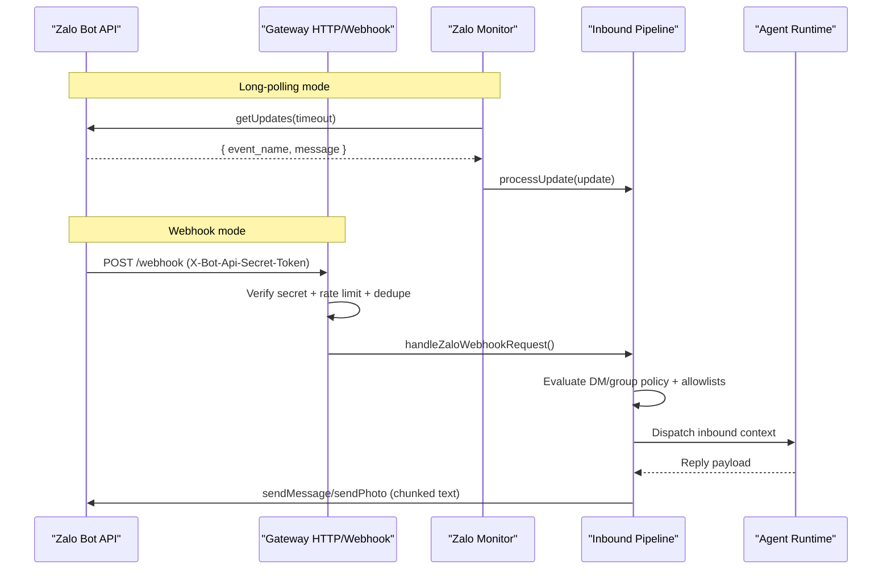
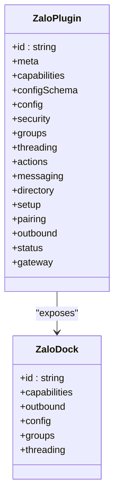
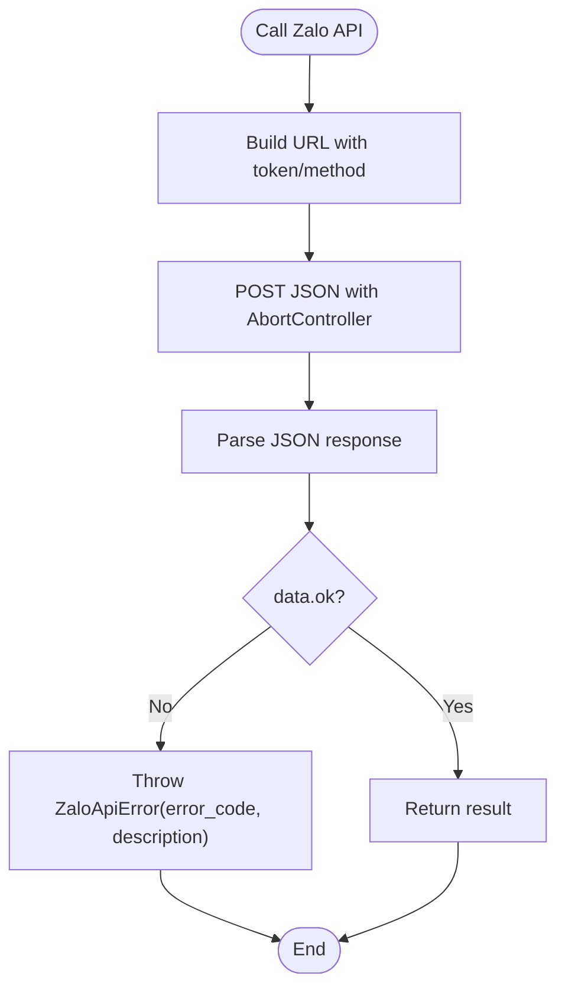
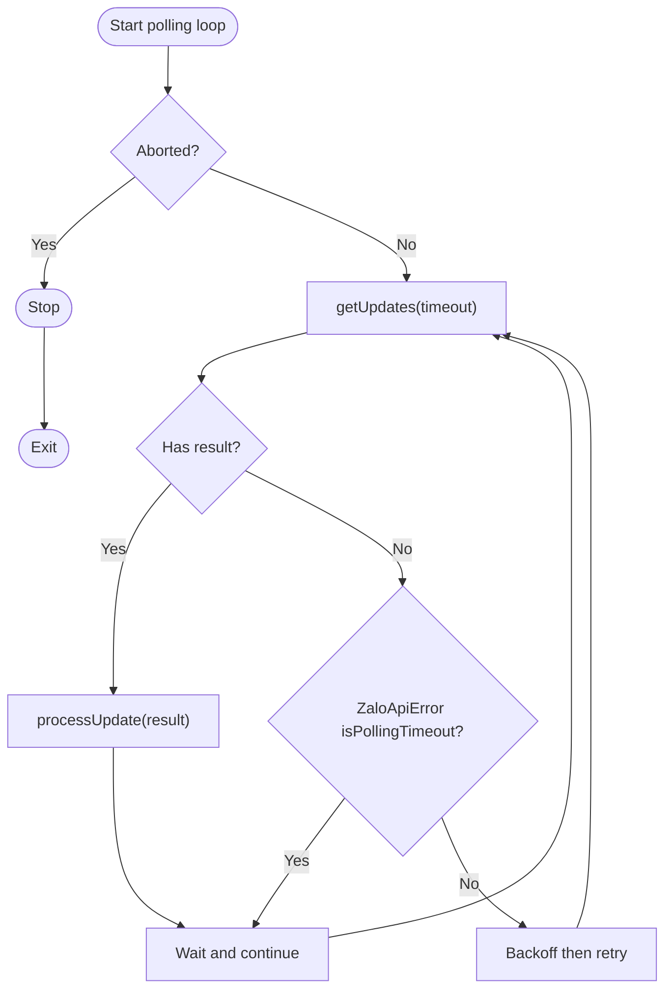
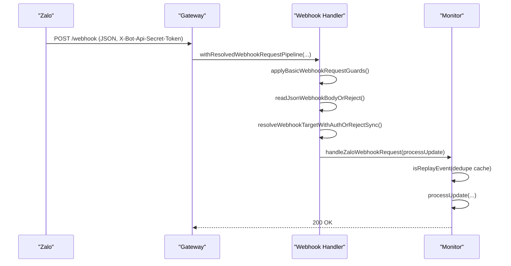
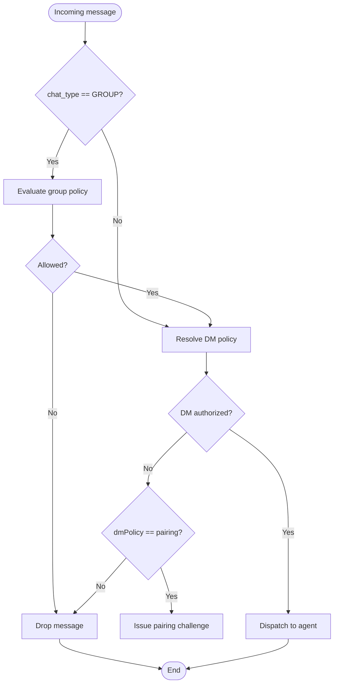
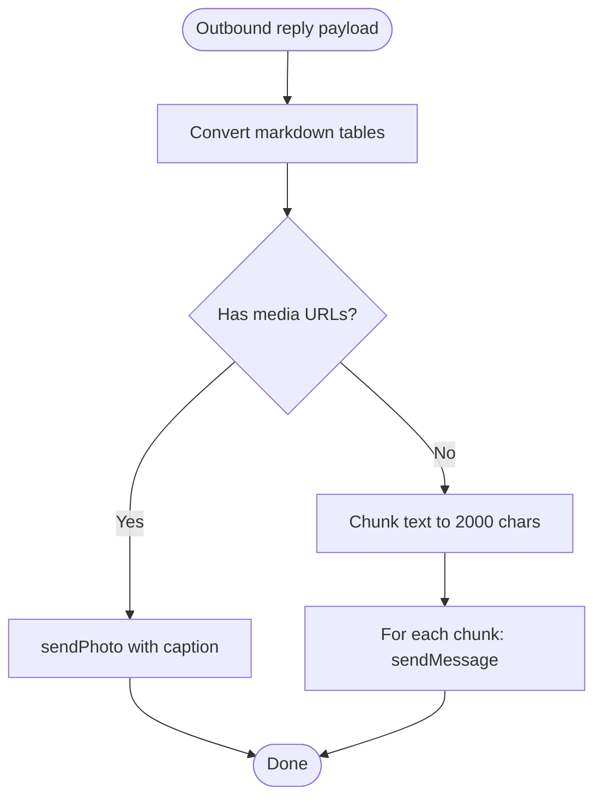
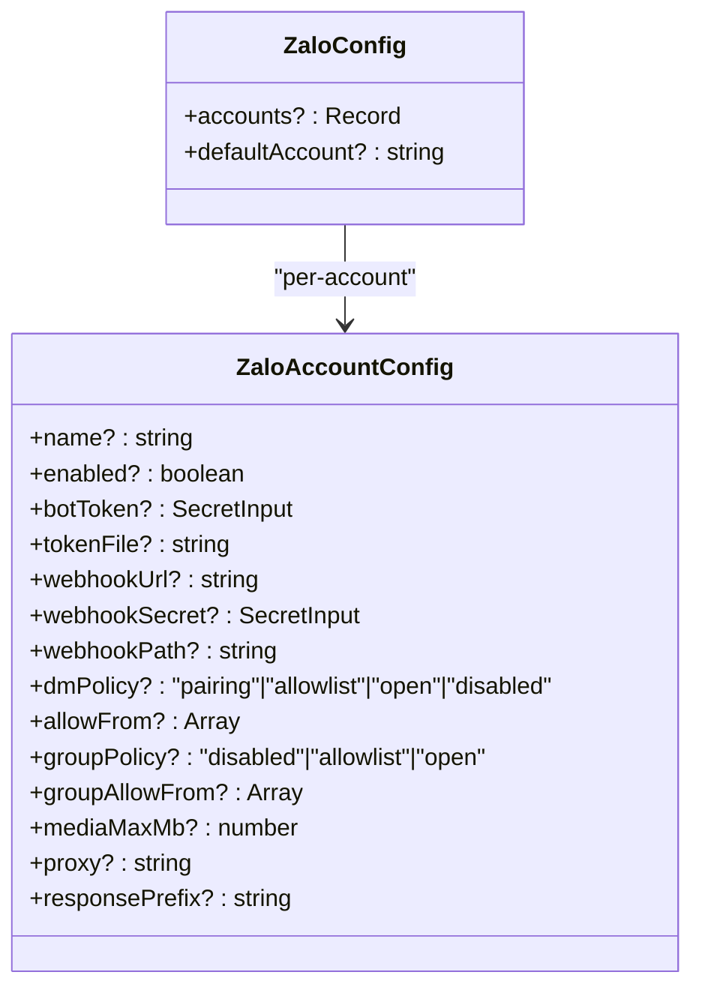
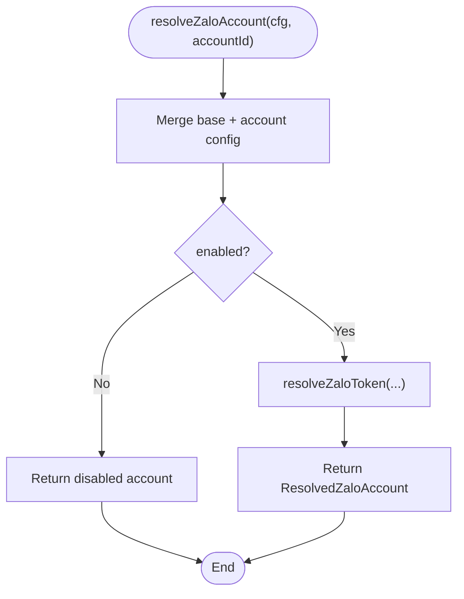
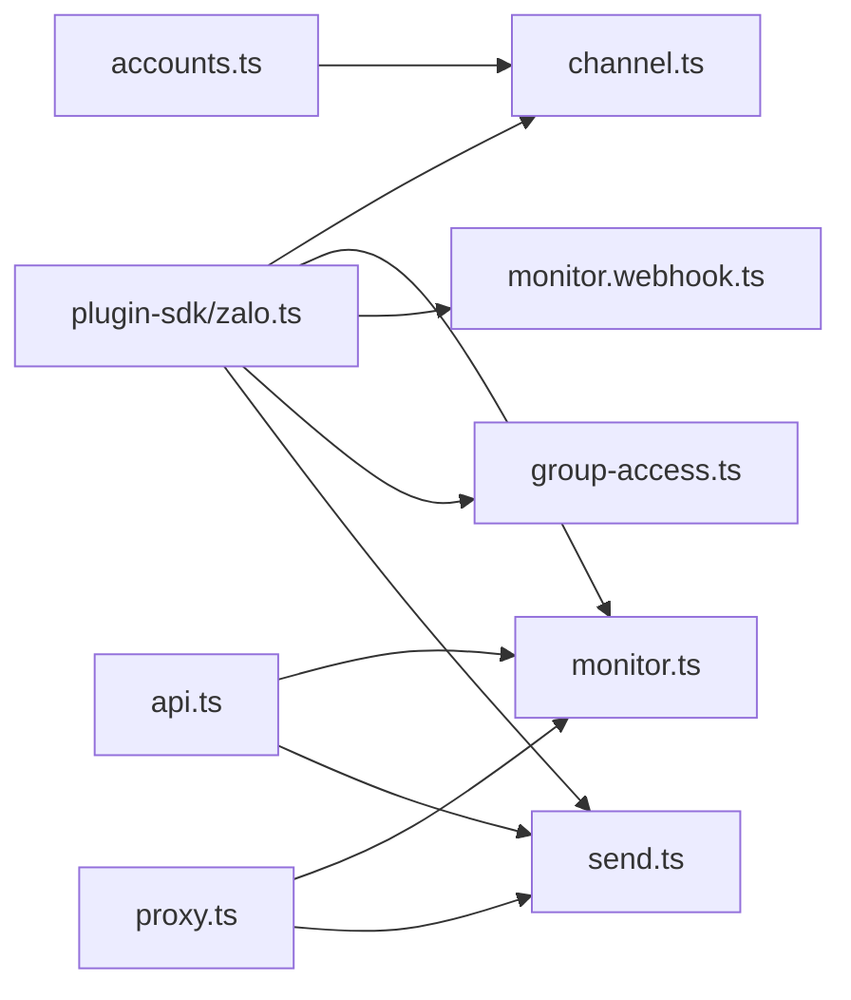

# Zalo Channel

<cite>
**Referenced Files in This Document**
- [docs/channels/zalo.md](file://docs/channels/zalo.md)
- [extensions/zalo/index.ts](file://extensions/zalo/index.ts)
- [extensions/zalo/src/channel.ts](file://extensions/zalo/src/channel.ts)
- [extensions/zalo/src/api.ts](file://extensions/zalo/src/api.ts)
- [extensions/zalo/src/config-schema.ts](file://extensions/zalo/src/config-schema.ts)
- [extensions/zalo/src/types.ts](file://extensions/zalo/src/types.ts)
- [extensions/zalo/src/monitor.ts](file://extensions/zalo/src/monitor.ts)
- [extensions/zalo/src/monitor.webhook.ts](file://extensions/zalo/src/monitor.webhook.ts)
- [extensions/zalo/src/send.ts](file://extensions/zalo/src/send.ts)
- [extensions/zalo/src/group-access.ts](file://extensions/zalo/src/group-access.ts)
- [extensions/zalo/src/accounts.ts](file://extensions/zalo/src/accounts.ts)
- [extensions/zalo/src/proxy.ts](file://extensions/zalo/src/proxy.ts)
- [src/plugin-sdk/zalo.ts](file://src/plugin-sdk/zalo.ts)
</cite>

## Table of Contents
1. [Introduction](#introduction)
2. [Project Structure](#project-structure)
3. [Core Components](#core-components)
4. [Architecture Overview](#architecture-overview)
5. [Detailed Component Analysis](#detailed-component-analysis)
6. [Dependency Analysis](#dependency-analysis)
7. [Performance Considerations](#performance-considerations)
8. [Troubleshooting Guide](#troubleshooting-guide)
9. [Conclusion](#conclusion)
10. [Appendices](#appendices)

## Introduction
This document explains how the Zalo channel integrates with the OpenClaw gateway using the Zalo Bot API. It covers bot setup, authentication, webhook configuration, group management, message formatting, and regional/cultural considerations for the Vietnamese market. It also documents the plugin architecture, configuration options, and operational behaviors such as long-polling versus webhook modes, media handling, and access control policies.

## Project Structure
The Zalo channel is implemented as a plugin with a clear separation of concerns:
- Plugin registration and exposure of channel capabilities
- API client for Zalo Bot API
- Monitoring loop for long-polling and webhook handling
- Configuration schema and typed configuration
- Group access evaluation and security policies
- Outbound sending helpers and media handling
- Account resolution and proxy support

```mermaid
graph TB
subgraph "Plugin Layer"
IDX["index.ts<br/>Registers channel"]
CH["channel.ts<br/>Channel plugin + dock"]
CFG["config-schema.ts<br/>Zod schema"]
TYP["types.ts<br/>Typed config + account"]
end
subgraph "Zalo Integration"
API["api.ts<br/>Zalo Bot API client"]
MON["monitor.ts<br/>Long-polling + webhook orchestration"]
WH["monitor.webhook.ts<br/>Webhook handlers + guards"]
ACC["accounts.ts<br/>Account resolution"]
GA["group-access.ts<br/>Group policy + allowlists"]
SND["send.ts<br/>Outbound send helpers"]
PRX["proxy.ts<br/>Proxy fetcher"]
end
subgraph "SDK"
SDK["plugin-sdk/zalo.ts<br/>Shared SDK exports"]
end
IDX --> CH
CH --> CFG
CH --> TYP
CH --> API
CH --> MON
MON --> WH
MON --> GA
MON --> SND
MON --> PRX
CH --> ACC
CH --> SDK
```

**Diagram sources**
- [extensions/zalo/index.ts](file://extensions/zalo/index.ts#L1-L18)
- [extensions/zalo/src/channel.ts](file://extensions/zalo/src/channel.ts#L1-L378)
- [extensions/zalo/src/config-schema.ts](file://extensions/zalo/src/config-schema.ts#L1-L28)
- [extensions/zalo/src/types.ts](file://extensions/zalo/src/types.ts#L1-L51)
- [extensions/zalo/src/api.ts](file://extensions/zalo/src/api.ts#L1-L239)
- [extensions/zalo/src/monitor.ts](file://extensions/zalo/src/monitor.ts#L1-L806)
- [extensions/zalo/src/monitor.webhook.ts](file://extensions/zalo/src/monitor.webhook.ts#L1-L214)
- [extensions/zalo/src/accounts.ts](file://extensions/zalo/src/accounts.ts#L1-L61)
- [extensions/zalo/src/group-access.ts](file://extensions/zalo/src/group-access.ts#L1-L49)
- [extensions/zalo/src/send.ts](file://extensions/zalo/src/send.ts#L1-L130)
- [extensions/zalo/src/proxy.ts](file://extensions/zalo/src/proxy.ts#L1-L25)
- [src/plugin-sdk/zalo.ts](file://src/plugin-sdk/zalo.ts#L1-L117)

**Section sources**
- [extensions/zalo/index.ts](file://extensions/zalo/index.ts#L1-L18)
- [extensions/zalo/src/channel.ts](file://extensions/zalo/src/channel.ts#L1-L378)
- [extensions/zalo/src/config-schema.ts](file://extensions/zalo/src/config-schema.ts#L1-L28)
- [extensions/zalo/src/types.ts](file://extensions/zalo/src/types.ts#L1-L51)
- [extensions/zalo/src/api.ts](file://extensions/zalo/src/api.ts#L1-L239)
- [extensions/zalo/src/monitor.ts](file://extensions/zalo/src/monitor.ts#L1-L806)
- [extensions/zalo/src/monitor.webhook.ts](file://extensions/zalo/src/monitor.webhook.ts#L1-L214)
- [extensions/zalo/src/accounts.ts](file://extensions/zalo/src/accounts.ts#L1-L61)
- [extensions/zalo/src/group-access.ts](file://extensions/zalo/src/group-access.ts#L1-L49)
- [extensions/zalo/src/send.ts](file://extensions/zalo/src/send.ts#L1-L130)
- [extensions/zalo/src/proxy.ts](file://extensions/zalo/src/proxy.ts#L1-L25)
- [src/plugin-sdk/zalo.ts](file://src/plugin-sdk/zalo.ts#L1-L117)

## Core Components
- Channel plugin and dock define capabilities, messaging targets, security policies, and outbound behavior.
- API client encapsulates Zalo Bot API calls, error handling, and typing for requests/responses.
- Monitor orchestrates long-polling or webhook mode, validates webhook security, deduplicates events, and applies rate limits.
- Configuration schema enforces valid options for multi-account setups, policies, and webhook settings.
- Group access evaluation enforces allowlists and default group policy behavior.
- Outbound helpers manage text chunking, media uploads, and reply delivery.
- Account resolution merges base and per-account settings and resolves tokens.
- Proxy support enables outbound requests through a proxy.

**Section sources**
- [extensions/zalo/src/channel.ts](file://extensions/zalo/src/channel.ts#L69-L378)
- [extensions/zalo/src/api.ts](file://extensions/zalo/src/api.ts#L1-L239)
- [extensions/zalo/src/monitor.ts](file://extensions/zalo/src/monitor.ts#L648-L806)
- [extensions/zalo/src/config-schema.ts](file://extensions/zalo/src/config-schema.ts#L1-L28)
- [extensions/zalo/src/group-access.ts](file://extensions/zalo/src/group-access.ts#L1-L49)
- [extensions/zalo/src/send.ts](file://extensions/zalo/src/send.ts#L1-L130)
- [extensions/zalo/src/accounts.ts](file://extensions/zalo/src/accounts.ts#L30-L61)
- [extensions/zalo/src/proxy.ts](file://extensions/zalo/src/proxy.ts#L1-L25)

## Architecture Overview
The Zalo channel operates in two primary modes:
- Long-polling: The monitor periodically calls getUpdates to receive inbound events.
- Webhook: The gateway registers a webhook with Zalo, validates the signature, deduplicates events, and dispatches inbound messages.



**Diagram sources**
- [extensions/zalo/src/monitor.ts](file://extensions/zalo/src/monitor.ts#L152-L216)
- [extensions/zalo/src/monitor.ts](file://extensions/zalo/src/monitor.ts#L218-L602)
- [extensions/zalo/src/monitor.webhook.ts](file://extensions/zalo/src/monitor.webhook.ts#L132-L213)
- [extensions/zalo/src/api.ts](file://extensions/zalo/src/api.ts#L194-L239)
- [extensions/zalo/src/send.ts](file://extensions/zalo/src/send.ts#L58-L130)

## Detailed Component Analysis

### Plugin Registration and Channel Dock
- The plugin registers the Zalo channel with the gateway, exposing capabilities such as direct and group chats, media support, and streaming blocking.
- The dock defines outbound text chunking limits and target normalization for Zalo chat IDs.



**Diagram sources**
- [extensions/zalo/src/channel.ts](file://extensions/zalo/src/channel.ts#L69-L378)
- [extensions/zalo/index.ts](file://extensions/zalo/index.ts#L1-L18)

**Section sources**
- [extensions/zalo/index.ts](file://extensions/zalo/index.ts#L1-L18)
- [extensions/zalo/src/channel.ts](file://extensions/zalo/src/channel.ts#L69-L378)

### API Client and Error Handling
- The API client wraps Zalo Bot API endpoints, including getMe, sendMessage, sendPhoto, sendChatAction, getUpdates, setWebhook, deleteWebhook, and getWebhookInfo.
- Errors are normalized into a typed ZaloApiError with an isPollingTimeout helper for long-polling timeouts.



**Diagram sources**
- [extensions/zalo/src/api.ts](file://extensions/zalo/src/api.ts#L101-L140)

**Section sources**
- [extensions/zalo/src/api.ts](file://extensions/zalo/src/api.ts#L1-L239)

### Monitoring: Long-Polling Loop
- The monitor starts a polling loop when webhook is not configured.
- It respects abort signals, handles polling timeouts, and processes updates by dispatching to the inbound pipeline.



**Diagram sources**
- [extensions/zalo/src/monitor.ts](file://extensions/zalo/src/monitor.ts#L152-L216)

**Section sources**
- [extensions/zalo/src/monitor.ts](file://extensions/zalo/src/monitor.ts#L152-L216)

### Monitoring: Webhook Handling
- The monitor registers a webhook target with the gateway HTTP router and validates incoming requests using a timing-safe secret comparison.
- It applies rate limiting, deduplication windows, and anomaly tracking for webhook health.



**Diagram sources**
- [extensions/zalo/src/monitor.webhook.ts](file://extensions/zalo/src/monitor.webhook.ts#L132-L213)
- [extensions/zalo/src/monitor.ts](file://extensions/zalo/src/monitor.ts#L133-L150)

**Section sources**
- [extensions/zalo/src/monitor.webhook.ts](file://extensions/zalo/src/monitor.webhook.ts#L1-L214)
- [extensions/zalo/src/monitor.ts](file://extensions/zalo/src/monitor.ts#L133-L150)

### Group Access and Security Policies
- Group policy evaluation supports open, allowlist, and disabled modes with fallback behavior when provider configuration is missing.
- Allowlists strip prefixes (e.g., zalo:, zl:) and enforce numeric sender IDs.



**Diagram sources**
- [extensions/zalo/src/monitor.ts](file://extensions/zalo/src/monitor.ts#L380-L476)
- [extensions/zalo/src/group-access.ts](file://extensions/zalo/src/group-access.ts#L33-L49)

**Section sources**
- [extensions/zalo/src/group-access.ts](file://extensions/zalo/src/group-access.ts#L1-L49)
- [extensions/zalo/src/monitor.ts](file://extensions/zalo/src/monitor.ts#L380-L476)

### Outbound Delivery and Text Chunking
- Outbound replies convert markdown tables, chunk text to 2000 characters, and send media with leading captions.
- The monitor sends typing indicators before agent replies.



**Diagram sources**
- [extensions/zalo/src/monitor.ts](file://extensions/zalo/src/monitor.ts#L604-L646)
- [extensions/zalo/src/send.ts](file://extensions/zalo/src/send.ts#L58-L130)

**Section sources**
- [extensions/zalo/src/monitor.ts](file://extensions/zalo/src/monitor.ts#L604-L646)
- [extensions/zalo/src/send.ts](file://extensions/zalo/src/send.ts#L58-L130)

### Configuration Schema and Typed Config
- Multi-account configuration is supported with per-account overrides for tokens, policies, webhook settings, and proxies.
- The schema enforces secret inputs for tokens and webhook secrets and validates policy enums.



**Diagram sources**
- [extensions/zalo/src/types.ts](file://extensions/zalo/src/types.ts#L3-L51)
- [extensions/zalo/src/config-schema.ts](file://extensions/zalo/src/config-schema.ts#L9-L27)

**Section sources**
- [extensions/zalo/src/types.ts](file://extensions/zalo/src/types.ts#L1-L51)
- [extensions/zalo/src/config-schema.ts](file://extensions/zalo/src/config-schema.ts#L1-L28)

### Account Resolution and Token Handling
- Accounts are merged from base channel settings and per-account overrides.
- Tokens are resolved from env/config/tokenFile with proper normalization and source tracking.



**Diagram sources**
- [extensions/zalo/src/accounts.ts](file://extensions/zalo/src/accounts.ts#L30-L61)

**Section sources**
- [extensions/zalo/src/accounts.ts](file://extensions/zalo/src/accounts.ts#L1-L61)

### Proxy Support
- A cached ProxyAgent-based fetcher is used for outbound API requests when a proxy URL is configured.

**Section sources**
- [extensions/zalo/src/proxy.ts](file://extensions/zalo/src/proxy.ts#L1-L25)

## Dependency Analysis
- The plugin depends on the OpenClaw plugin SDK for shared utilities (pairing, group access, webhook guards, text chunking).
- The monitor coordinates between the API client, webhook handlers, group access, and outbound helpers.
- Configuration resolution and schema enforcement ensure consistent behavior across multi-account deployments.



**Diagram sources**
- [src/plugin-sdk/zalo.ts](file://src/plugin-sdk/zalo.ts#L1-L117)
- [extensions/zalo/src/channel.ts](file://extensions/zalo/src/channel.ts#L1-L378)
- [extensions/zalo/src/monitor.ts](file://extensions/zalo/src/monitor.ts#L1-L806)
- [extensions/zalo/src/monitor.webhook.ts](file://extensions/zalo/src/monitor.webhook.ts#L1-L214)
- [extensions/zalo/src/group-access.ts](file://extensions/zalo/src/group-access.ts#L1-L49)
- [extensions/zalo/src/send.ts](file://extensions/zalo/src/send.ts#L1-L130)
- [extensions/zalo/src/api.ts](file://extensions/zalo/src/api.ts#L1-L239)
- [extensions/zalo/src/accounts.ts](file://extensions/zalo/src/accounts.ts#L1-L61)
- [extensions/zalo/src/proxy.ts](file://extensions/zalo/src/proxy.ts#L1-L25)

**Section sources**
- [src/plugin-sdk/zalo.ts](file://src/plugin-sdk/zalo.ts#L1-L117)
- [extensions/zalo/src/channel.ts](file://extensions/zalo/src/channel.ts#L1-L378)
- [extensions/zalo/src/monitor.ts](file://extensions/zalo/src/monitor.ts#L1-L806)
- [extensions/zalo/src/monitor.webhook.ts](file://extensions/zalo/src/monitor.webhook.ts#L1-L214)
- [extensions/zalo/src/group-access.ts](file://extensions/zalo/src/group-access.ts#L1-L49)
- [extensions/zalo/src/send.ts](file://extensions/zalo/src/send.ts#L1-L130)
- [extensions/zalo/src/api.ts](file://extensions/zalo/src/api.ts#L1-L239)
- [extensions/zalo/src/accounts.ts](file://extensions/zalo/src/accounts.ts#L1-L61)
- [extensions/zalo/src/proxy.ts](file://extensions/zalo/src/proxy.ts#L1-L25)

## Performance Considerations
- Long-polling: Uses a 30-second timeout and retries on errors with backoff.
- Webhook: Applies fixed-window rate limiting and deduplication caches to handle burst traffic and prevent replays.
- Text chunking: Limits outbound text to 2000 characters to comply with Zalo API constraints.
- Media caps: Enforces inbound/outbound media size limits configurable per account.
- Typing indicators: Sends a “typing” action before agent replies to improve perceived responsiveness.

[No sources needed since this section provides general guidance]

## Troubleshooting Guide
Common issues and resolutions:
- Bot does not respond:
  - Verify token validity and reachability using the channel status probe.
  - Ensure the sender is approved via pairing or allowFrom entries.
  - Review gateway logs for errors.
- Webhook not receiving events:
  - Confirm webhook URL uses HTTPS.
  - Ensure the webhook secret is 8–256 characters.
  - Verify the gateway HTTP endpoint is reachable at the configured path.
  - Ensure long-polling is not running concurrently (mutually exclusive with webhook).
- Group messages ignored:
  - Check groupPolicy and groupAllowFrom settings; default is allowlist.
  - Ensure sender IDs are numeric and prefixed correctly when using allowFrom entries.

**Section sources**
- [docs/channels/zalo.md](file://docs/channels/zalo.md#L159-L173)
- [extensions/zalo/src/monitor.ts](file://extensions/zalo/src/monitor.ts#L687-L701)
- [extensions/zalo/src/monitor.ts](file://extensions/zalo/src/monitor.ts#L744-L774)

## Conclusion
The Zalo channel plugin provides a robust integration with the Zalo Bot API, supporting both long-polling and webhook modes, secure access controls, and media-aware messaging. Its modular design leverages the OpenClaw plugin SDK to ensure consistent behavior across multi-account deployments while respecting Vietnamese market preferences and constraints.

[No sources needed since this section summarizes without analyzing specific files]

## Appendices

### Setup Procedures and Configuration Reference
- Install the Zalo plugin and configure the bot token via environment variable or configuration.
- Choose between long-polling (default) and webhook mode; webhook requires HTTPS URL and a secret token.
- Define DM and group policies with allowlists; groupPolicy defaults to allowlist when unspecified.
- Configure media size limits and optional proxy for outbound requests.

**Section sources**
- [docs/channels/zalo.md](file://docs/channels/zalo.md#L20-L86)
- [docs/channels/zalo.md](file://docs/channels/zalo.md#L174-L207)
- [extensions/zalo/src/config-schema.ts](file://extensions/zalo/src/config-schema.ts#L9-L27)

### Regional Features and Cultural Considerations
- Zalo is a Vietnam-focused platform; the channel emphasizes deterministic routing back to Zalo and supports Vietnamese users’ expectations for direct messaging and group interactions.
- Pairing is the default DM policy, aligning with localized trust-building patterns.

**Section sources**
- [docs/channels/zalo.md](file://docs/channels/zalo.md#L46-L54)
- [docs/channels/zalo.md](file://docs/channels/zalo.md#L99-L109)