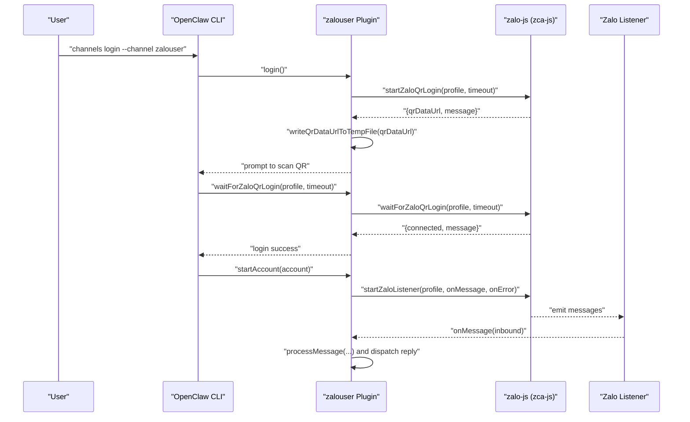
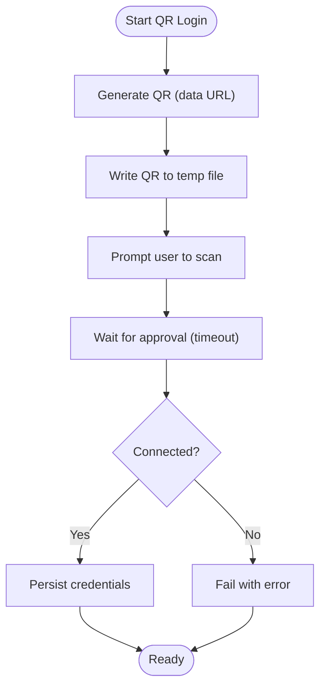
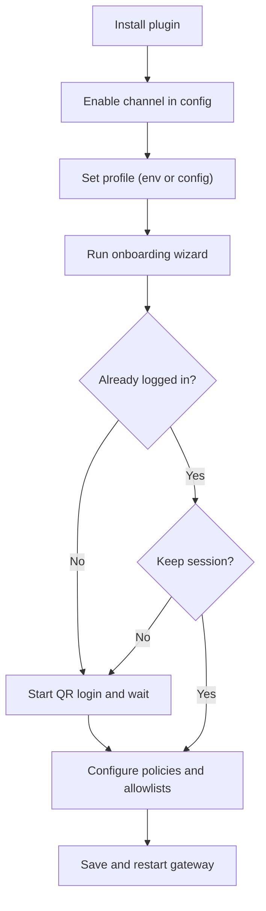
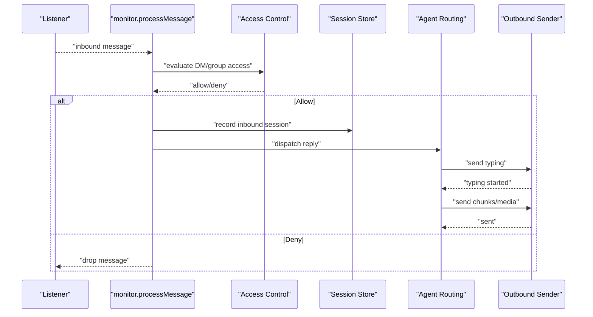
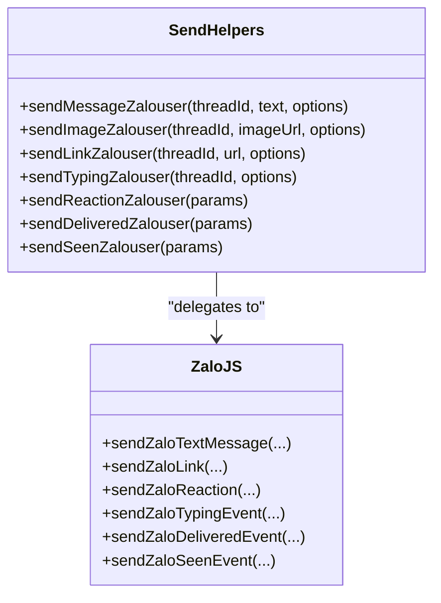
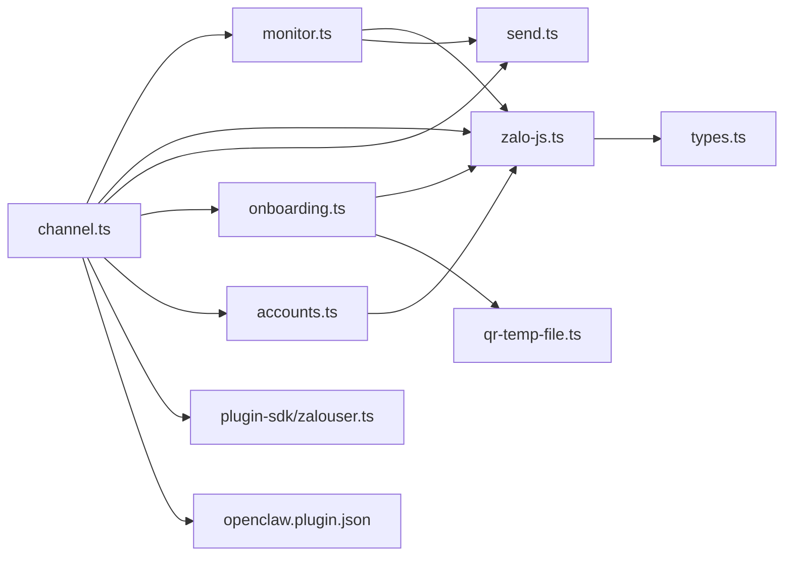

# Zalo Personal Channel

<cite>
**Referenced Files in This Document**
- [docs/channels/zalouser.md](file://docs/channels/zalouser.md)
- [extensions/zalouser/src/channel.ts](file://extensions/zalouser/src/channel.ts)
- [extensions/zalouser/src/zalo-js.ts](file://extensions/zalouser/src/zalo-js.ts)
- [extensions/zalouser/src/qr-temp-file.ts](file://extensions/zalouser/src/qr-temp-file.ts)
- [extensions/zalouser/src/onboarding.ts](file://extensions/zalouser/src/onboarding.ts)
- [extensions/zalouser/src/monitor.ts](file://extensions/zalouser/src/monitor.ts)
- [extensions/zalouser/src/send.ts](file://extensions/zalouser/src/send.ts)
- [extensions/zalouser/src/accounts.ts](file://extensions/zalouser/src/accounts.ts)
- [extensions/zalouser/src/types.ts](file://extensions/zalouser/src/types.ts)
- [src/plugin-sdk/zalouser.ts](file://src/plugin-sdk/zalouser.ts)
- [extensions/zalouser/openclaw.plugin.json](file://extensions/zalouser/openclaw.plugin.json)
</cite>

## Table of Contents
1. [Introduction](#introduction)
2. [Project Structure](#project-structure)
3. [Core Components](#core-components)
4. [Architecture Overview](#architecture-overview)
5. [Detailed Component Analysis](#detailed-component-analysis)
6. [Dependency Analysis](#dependency-analysis)
7. [Performance Considerations](#performance-considerations)
8. [Troubleshooting Guide](#troubleshooting-guide)
9. [Privacy, Compliance, and Data Protection](#privacy-compliance-and-data-protection)
10. [Conclusion](#conclusion)

## Introduction
This document explains the Zalo Personal channel integration using QR login. It covers the QR authentication flow, personal account setup, message handling pipeline, privacy and compliance considerations, session management, and troubleshooting procedures. The integration automates a personal Zalo account via the zca-js library inside OpenClaw and is labeled as experimental.

## Project Structure
The Zalo Personal channel is implemented as a plugin with the following key areas:
- Channel plugin entry and orchestration
- QR login and session persistence
- Inbound message monitoring and routing
- Outbound sending and reactions
- Onboarding and configuration helpers
- Types and configuration schemas

```mermaid
graph TB
subgraph "Plugin Layer"
CH["channel.ts<br/>Plugin entry and capabilities"]
ON["onboarding.ts<br/>Wizard-driven setup"]
ACC["accounts.ts<br/>Account resolution and state"]
CFG["openclaw.plugin.json<br/>Plugin manifest"]
end
subgraph "Core Implementation"
MON["monitor.ts<br/>Listener and message processing"]
ZJS["zalo-js.ts<br/>zca-js wrapper and APIs"]
SEND["send.ts<br/>Outbound send helpers"]
QR["qr-temp-file.ts<br/>Write QR to temp file"]
TYPES["types.ts<br/>Type definitions"]
end
subgraph "SDK"
SDK["plugin-sdk/zalouser.ts<br/>Shared plugin SDK"]
end
CH --> MON
CH --> ZJS
CH --> SEND
CH --> ON
CH --> ACC
CH --> SDK
MON --> ZJS
MON --> SEND
ON --> ZJS
ON --> QR
ACC --> ZJS
ZJS --> TYPES
```

**Diagram sources**
- [extensions/zalouser/src/channel.ts](file://extensions/zalouser/src/channel.ts#L57-L716)
- [extensions/zalouser/src/monitor.ts](file://extensions/zalouser/src/monitor.ts#L1-L984)
- [extensions/zalouser/src/zalo-js.ts](file://extensions/zalouser/src/zalo-js.ts#L1-L1649)
- [extensions/zalouser/src/send.ts](file://extensions/zalouser/src/send.ts#L1-L88)
- [extensions/zalouser/src/onboarding.ts](file://extensions/zalouser/src/onboarding.ts#L1-L364)
- [extensions/zalouser/src/qr-temp-file.ts](file://extensions/zalouser/src/qr-temp-file.ts#L1-L23)
- [extensions/zalouser/src/accounts.ts](file://extensions/zalouser/src/accounts.ts#L1-L117)
- [extensions/zalouser/src/types.ts](file://extensions/zalouser/src/types.ts#L1-L119)
- [src/plugin-sdk/zalouser.ts](file://src/plugin-sdk/zalouser.ts#L1-L77)
- [extensions/zalouser/openclaw.plugin.json](file://extensions/zalouser/openclaw.plugin.json#L1-L10)

**Section sources**
- [extensions/zalouser/src/channel.ts](file://extensions/zalouser/src/channel.ts#L57-L716)
- [extensions/zalouser/src/monitor.ts](file://extensions/zalouser/src/monitor.ts#L1-L984)
- [extensions/zalouser/src/zalo-js.ts](file://extensions/zalouser/src/zalo-js.ts#L1-L1649)
- [extensions/zalouser/src/send.ts](file://extensions/zalouser/src/send.ts#L1-L88)
- [extensions/zalouser/src/onboarding.ts](file://extensions/zalouser/src/onboarding.ts#L1-L364)
- [extensions/zalouser/src/qr-temp-file.ts](file://extensions/zalouser/src/qr-temp-file.ts#L1-L23)
- [extensions/zalouser/src/accounts.ts](file://extensions/zalouser/src/accounts.ts#L1-L117)
- [extensions/zalouser/src/types.ts](file://extensions/zalouser/src/types.ts#L1-L119)
- [src/plugin-sdk/zalouser.ts](file://src/plugin-sdk/zalouser.ts#L1-L77)
- [extensions/zalouser/openclaw.plugin.json](file://extensions/zalouser/openclaw.plugin.json#L1-L10)

## Core Components
- Channel plugin definition and capabilities
  - Defines channel id, labels, and capabilities such as direct and group chats, media support, reactions, and streaming blocking.
  - Provides outbound chunking limits and configuration schema binding.
- QR login and session lifecycle
  - Starts QR generation, writes QR image to a temporary file, waits for approval, and persists credentials.
- Inbound monitoring and routing
  - Listens for messages, enforces access control (DM/group policies), mention gating, and session scoping.
  - Dispatches replies with typing indicators and markdown table rendering.
- Outbound sending and reactions
  - Sends text, images, links, typing events, reactions, and delivery/seen acknowledgments.
- Onboarding and configuration
  - Guides users through QR login, allowlist/group configuration, and account setup.
- Account resolution and state
  - Resolves per-account profiles, merges configuration, and checks authentication state.

**Section sources**
- [extensions/zalouser/src/channel.ts](file://extensions/zalouser/src/channel.ts#L295-L427)
- [extensions/zalouser/src/zalo-js.ts](file://extensions/zalouser/src/zalo-js.ts#L569-L631)
- [extensions/zalouser/src/monitor.ts](file://extensions/zalouser/src/monitor.ts#L249-L744)
- [extensions/zalouser/src/send.ts](file://extensions/zalouser/src/send.ts#L14-L88)
- [extensions/zalouser/src/onboarding.ts](file://extensions/zalouser/src/onboarding.ts#L214-L362)
- [extensions/zalouser/src/accounts.ts](file://extensions/zalouser/src/accounts.ts#L46-L89)

## Architecture Overview
The Zalo Personal channel integrates with zca-js to manage a personal Zalo account. The plugin orchestrates:
- Authentication via QR code
- Persistent session storage
- Real-time message listening
- Access control and mention gating
- Reply dispatch with typing and media support



**Diagram sources**
- [extensions/zalouser/src/channel.ts](file://extensions/zalouser/src/channel.ts#L561-L594)
- [extensions/zalouser/src/zalo-js.ts](file://extensions/zalouser/src/zalo-js.ts#L569-L631)
- [extensions/zalouser/src/qr-temp-file.ts](file://extensions/zalouser/src/qr-temp-file.ts#L5-L22)
- [extensions/zalouser/src/monitor.ts](file://extensions/zalouser/src/monitor.ts#L889-L932)

## Detailed Component Analysis

### QR Authentication Flow
- Start QR login
  - Initiates QR generation and returns a data URL and status message.
  - Writes QR image to a temporary file for convenience.
- Wait for login
  - Waits for the user to scan and approve the QR on their phone.
  - Returns connection status and message.
- Session persistence
  - Credentials are stored under a profile-specific credentials file.
  - Subsequent starts restore the session using stored credentials.



**Diagram sources**
- [extensions/zalouser/src/zalo-js.ts](file://extensions/zalouser/src/zalo-js.ts#L569-L631)
- [extensions/zalouser/src/qr-temp-file.ts](file://extensions/zalouser/src/qr-temp-file.ts#L5-L22)
- [extensions/zalouser/src/onboarding.ts](file://extensions/zalouser/src/onboarding.ts#L244-L272)

**Section sources**
- [extensions/zalouser/src/zalo-js.ts](file://extensions/zalouser/src/zalo-js.ts#L569-L631)
- [extensions/zalouser/src/qr-temp-file.ts](file://extensions/zalouser/src/qr-temp-file.ts#L5-L22)
- [extensions/zalouser/src/onboarding.ts](file://extensions/zalouser/src/onboarding.ts#L244-L272)

### Personal Account Setup and Configuration
- Installation and activation
  - Install via CLI and enable the channel in configuration.
- Profile and multi-account
  - Profiles are derived from account id, environment variables, or explicit config.
  - Supports multiple accounts with separate profiles and configurations.
- Access control
  - DM policy and allowlists for users and groups.
  - Group policy with open/allowlist/disabled modes.
- Onboarding wizard
  - Guides through QR login, allowlist/group configuration, and policy selection.



**Diagram sources**
- [extensions/zalouser/src/onboarding.ts](file://extensions/zalouser/src/onboarding.ts#L214-L362)
- [extensions/zalouser/src/accounts.ts](file://extensions/zalouser/src/accounts.ts#L30-L44)

**Section sources**
- [extensions/zalouser/src/onboarding.ts](file://extensions/zalouser/src/onboarding.ts#L214-L362)
- [extensions/zalouser/src/accounts.ts](file://extensions/zalouser/src/accounts.ts#L30-L44)
- [docs/channels/zalouser.md](file://docs/channels/zalouser.md#L25-L46)

### Message Handling Pipeline
- Inbound processing
  - Enforces group policy and sender allowlists.
  - Handles mention gating and implicit mentions.
  - Records session state and builds agent envelopes.
- Reply dispatch
  - Sends typing indicators before replies.
  - Renders markdown tables and chunks text respecting Zalo limits.
  - Supports media sending with leading captions.
- Acknowledgments
  - Sends delivered and seen acknowledgments when available.



**Diagram sources**
- [extensions/zalouser/src/monitor.ts](file://extensions/zalouser/src/monitor.ts#L249-L744)
- [extensions/zalouser/src/send.ts](file://extensions/zalouser/src/send.ts#L690-L744)

**Section sources**
- [extensions/zalouser/src/monitor.ts](file://extensions/zalouser/src/monitor.ts#L249-L744)
- [extensions/zalouser/src/send.ts](file://extensions/zalouser/src/send.ts#L690-L744)

### Outbound Sending and Reactions
- Text and media
  - Sends text with chunking and media with leading captions.
- Reactions
  - Adds or removes reactions on messages with proper message identifiers.
- Typing and acknowledgments
  - Emits typing events and sends delivered/seen acknowledgments when present.



**Diagram sources**
- [extensions/zalouser/src/send.ts](file://extensions/zalouser/src/send.ts#L14-L88)
- [extensions/zalouser/src/zalo-js.ts](file://extensions/zalouser/src/zalo-js.ts#L745-L794)

**Section sources**
- [extensions/zalouser/src/send.ts](file://extensions/zalouser/src/send.ts#L14-L88)
- [extensions/zalouser/src/zalo-js.ts](file://extensions/zalouser/src/zalo-js.ts#L745-L794)

### Session Management and Privacy
- Session scoping
  - Direct messages use per-peer session keys based on agent id, channel, account id, and peer id.
  - Legacy compatibility maintained for upgraded environments.
- Credential storage
  - Credentials are stored under a profile-specific file in the OpenClaw state directory.
- Privacy considerations
  - The integration runs locally on the gateway host and does not expose a public webhook.
  - No external zca CLI binary is required; the integration is self-contained.

**Section sources**
- [extensions/zalouser/src/monitor.ts](file://extensions/zalouser/src/monitor.ts#L146-L189)
- [extensions/zalouser/src/zalo-js.ts](file://extensions/zalouser/src/zalo-js.ts#L496-L567)
- [docs/channels/zalouser.md](file://docs/channels/zalouser.md#L13-L23)

## Dependency Analysis
- Internal dependencies
  - channel.ts depends on monitor.ts, zalo-js.ts, send.ts, onboarding.ts, accounts.ts, and plugin-sdk/zalouser.ts.
  - monitor.ts depends on zalo-js.ts and send.ts.
  - onboarding.ts depends on zalo-js.ts and qr-temp-file.ts.
- External integration
  - zalo-js.ts wraps zca-js and exposes typed APIs for login, listener, message sending, and reactions.
- Plugin manifest
  - openclaw.plugin.json declares the channel id and channel list.



**Diagram sources**
- [extensions/zalouser/src/channel.ts](file://extensions/zalouser/src/channel.ts#L1-L716)
- [extensions/zalouser/src/monitor.ts](file://extensions/zalouser/src/monitor.ts#L1-L984)
- [extensions/zalouser/src/zalo-js.ts](file://extensions/zalouser/src/zalo-js.ts#L1-L1649)
- [extensions/zalouser/src/send.ts](file://extensions/zalouser/src/send.ts#L1-L88)
- [extensions/zalouser/src/onboarding.ts](file://extensions/zalouser/src/onboarding.ts#L1-L364)
- [extensions/zalouser/src/qr-temp-file.ts](file://extensions/zalouser/src/qr-temp-file.ts#L1-L23)
- [extensions/zalouser/src/accounts.ts](file://extensions/zalouser/src/accounts.ts#L1-L117)
- [extensions/zalouser/src/types.ts](file://extensions/zalouser/src/types.ts#L1-L119)
- [src/plugin-sdk/zalouser.ts](file://src/plugin-sdk/zalouser.ts#L1-L77)
- [extensions/zalouser/openclaw.plugin.json](file://extensions/zalouser/openclaw.plugin.json#L1-L10)

**Section sources**
- [extensions/zalouser/src/channel.ts](file://extensions/zalouser/src/channel.ts#L1-L716)
- [extensions/zalouser/src/monitor.ts](file://extensions/zalouser/src/monitor.ts#L1-L984)
- [extensions/zalouser/src/zalo-js.ts](file://extensions/zalouser/src/zalo-js.ts#L1-L1649)
- [extensions/zalouser/src/send.ts](file://extensions/zalouser/src/send.ts#L1-L88)
- [extensions/zalouser/src/onboarding.ts](file://extensions/zalouser/src/onboarding.ts#L1-L364)
- [extensions/zalouser/src/qr-temp-file.ts](file://extensions/zalouser/src/qr-temp-file.ts#L1-L23)
- [extensions/zalouser/src/accounts.ts](file://extensions/zalouser/src/accounts.ts#L1-L117)
- [extensions/zalouser/src/types.ts](file://extensions/zalouser/src/types.ts#L1-L119)
- [src/plugin-sdk/zalouser.ts](file://src/plugin-sdk/zalouser.ts#L1-L77)
- [extensions/zalouser/openclaw.plugin.json](file://extensions/zalouser/openclaw.plugin.json#L1-L10)

## Performance Considerations
- Message throughput
  - Messages are queued by thread to preserve ordering.
  - Group history buffering improves context for group replies.
- Chunking and limits
  - Text is chunked to 2000 characters to respect client limits.
  - Media uploads are handled with leading captions and URL resolution.
- Listener stability
  - Watchdog timers and cache TTLs prevent stale state and reduce overhead.

[No sources needed since this section provides general guidance]

## Troubleshooting Guide
Common issues and resolutions:
- Login does not stick
  - Probe authentication status and re-run login.
  - Clear session and force a new QR login.
- Allowlist/group name did not resolve
  - Use numeric IDs or exact friend/group names.
- Upgraded from old CLI-based setup
  - Remove assumptions about external zca processes; the integration runs in-process.
- Pairing approvals
  - Use pairing commands to list and approve pending requests.

**Section sources**
- [docs/channels/zalouser.md](file://docs/channels/zalouser.md#L165-L180)
- [extensions/zalouser/src/onboarding.ts](file://extensions/zalouser/src/onboarding.ts#L274-L297)

## Privacy, Compliance, and Data Protection
- Risk acknowledgment
  - The integration is experimental and unofficial; it may lead to account suspension or ban.
- Data handling
  - Credentials are stored locally under the OpenClaw state directory.
  - No public webhook is exposed; communication remains local to the gateway host.
- Best practices
  - Use pairing and allowlists to restrict access.
  - Keep sessions fresh and avoid sharing credentials.
  - Review and prune group histories as needed.

**Section sources**
- [docs/channels/zalouser.md](file://docs/channels/zalouser.md#L13-L13)
- [extensions/zalouser/src/zalo-js.ts](file://extensions/zalouser/src/zalo-js.ts#L496-L567)
- [extensions/zalouser/src/monitor.ts](file://extensions/zalouser/src/monitor.ts#L146-L189)

## Conclusion
The Zalo Personal channel provides a robust, in-process integration for automating a personal Zalo account. It supports QR login, persistent sessions, real-time messaging, access control, and rich outbound capabilities. Users should carefully consider the risks, follow the setup and troubleshooting steps, and adhere to privacy and compliance best practices.