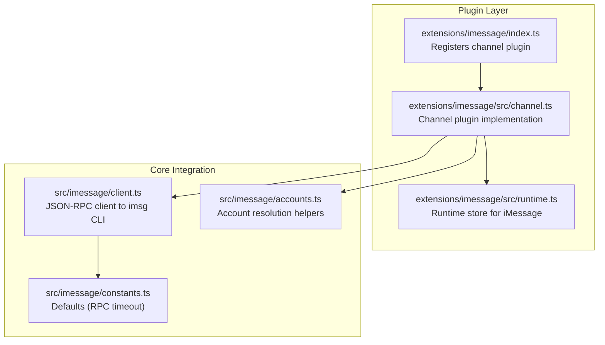
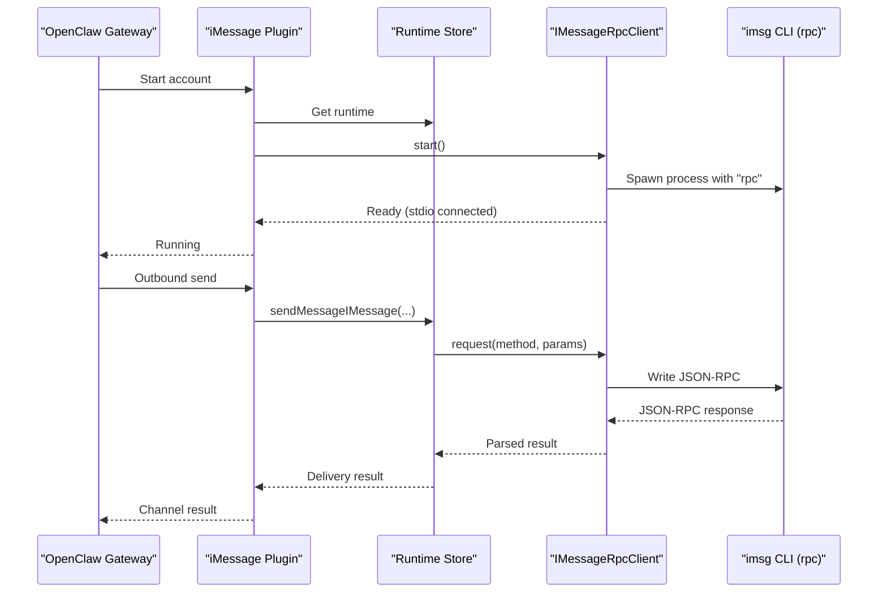
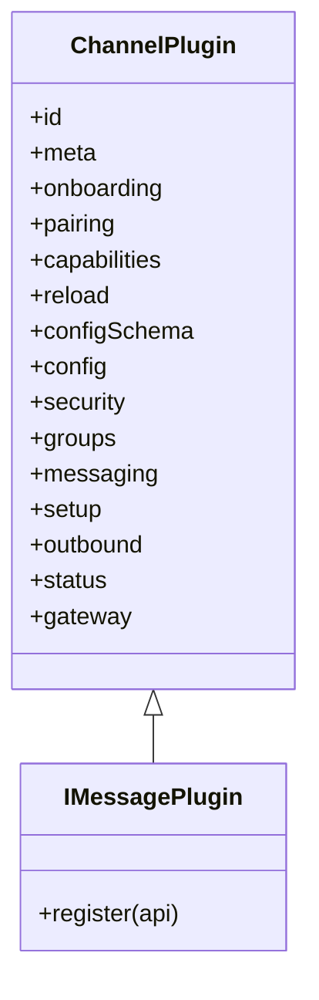
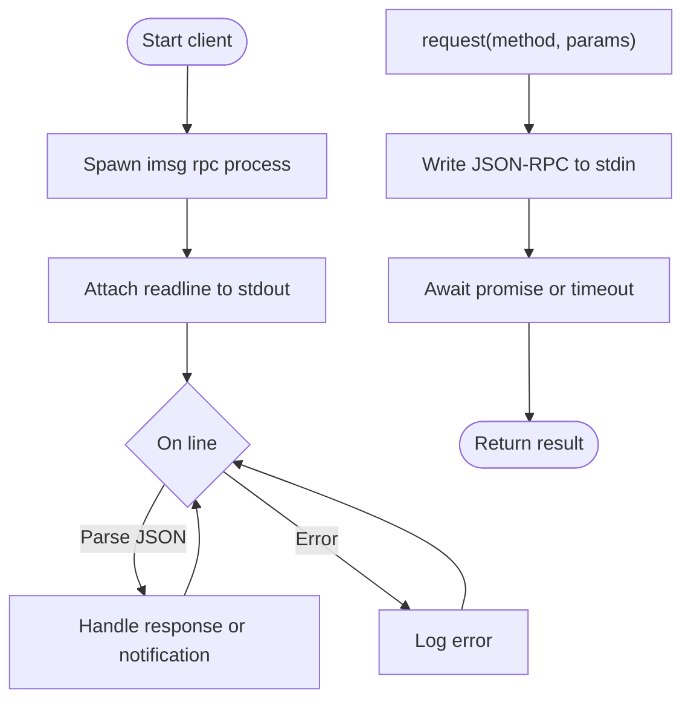
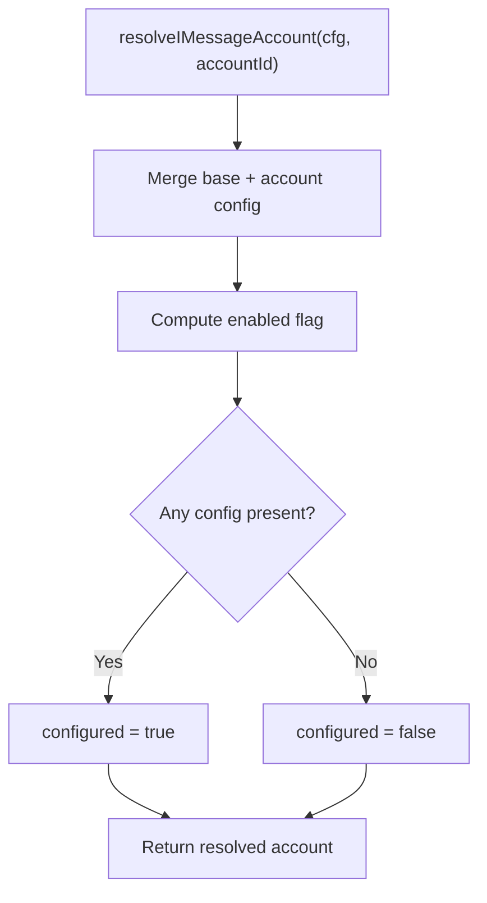
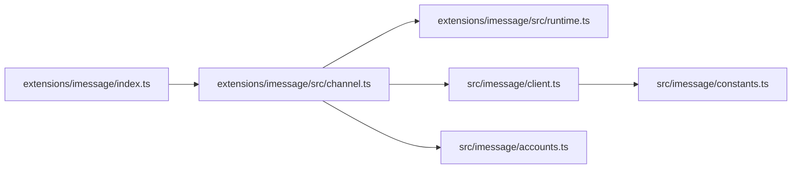

# iMessage Channel

<cite>
**Referenced Files in This Document**
- [docs/channels/imessage.md](file://docs/channels/imessage.md)
- [docs/channels/bluebubbles.md](file://docs/channels/bluebubbles.md)
- [extensions/imessage/index.ts](file://extensions/imessage/index.ts)
- [extensions/imessage/src/channel.ts](file://extensions/imessage/src/channel.ts)
- [extensions/imessage/src/runtime.ts](file://extensions/imessage/src/runtime.ts)
- [skills/imsg/SKILL.md](file://skills/imsg/SKILL.md)
- [src/imessage/client.ts](file://src/imessage/client.ts)
- [src/imessage/accounts.ts](file://src/imessage/accounts.ts)
- [src/imessage/constants.ts](file://src/imessage/constants.ts)
</cite>

## Table of Contents
1. [Introduction](#introduction)
2. [Project Structure](#project-structure)
3. [Core Components](#core-components)
4. [Architecture Overview](#architecture-overview)
5. [Detailed Component Analysis](#detailed-component-analysis)
6. [Dependency Analysis](#dependency-analysis)
7. [Performance Considerations](#performance-considerations)
8. [Troubleshooting Guide](#troubleshooting-guide)
9. [Conclusion](#conclusion)
10. [Appendices](#appendices)

## Introduction
This document describes the iMessage channel integration for OpenClaw, focusing on the legacy macOS implementation via the external imsg CLI and JSON-RPC over stdio. It covers system requirements, configuration options, account setup, message routing, platform-specific limitations, and troubleshooting steps. For new installations, the recommended path is BlueBubbles, which provides a modern REST-based integration with richer capabilities.

## Project Structure
The iMessage channel is implemented as a plugin that integrates with the OpenClaw plugin SDK. The plugin registers a channel provider that coordinates with the external imsg CLI process and manages configuration, security policies, and runtime status.

**Diagram sources**
- [extensions/imessage/index.ts](file://extensions/imessage/index.ts#L1-L18)
- [extensions/imessage/src/channel.ts](file://extensions/imessage/src/channel.ts#L1-L319)
- [extensions/imessage/src/runtime.ts](file://extensions/imessage/src/runtime.ts#L1-L7)
- [src/imessage/client.ts](file://src/imessage/client.ts#L1-L256)
- [src/imessage/accounts.ts](file://src/imessage/accounts.ts#L1-L71)
- [src/imessage/constants.ts](file://src/imessage/constants.ts#L1-L3)

**Section sources**
- [extensions/imessage/index.ts](file://extensions/imessage/index.ts#L1-L18)
- [extensions/imessage/src/channel.ts](file://extensions/imessage/src/channel.ts#L1-L319)
- [extensions/imessage/src/runtime.ts](file://extensions/imessage/src/runtime.ts#L1-L7)
- [src/imessage/client.ts](file://src/imessage/client.ts#L1-L256)
- [src/imessage/accounts.ts](file://src/imessage/accounts.ts#L1-L71)
- [src/imessage/constants.ts](file://src/imessage/constants.ts#L1-L3)

## Core Components
- Plugin registration and runtime wiring:
  - The plugin module registers the iMessage channel with OpenClaw and sets the runtime store used by the channel implementation.
- Channel plugin:
  - Implements configuration schema, security policies, messaging targets, outbound senders, and status collection.
- JSON-RPC client:
  - Spawns the imsg CLI with the rpc subcommand, reads/writes JSON-RPC over stdio, and manages lifecycle and timeouts.
- Account helpers:
  - Resolve and merge per-account configuration, compute enabled/disabled state, and detect if an account is configured.

**Section sources**
- [extensions/imessage/index.ts](file://extensions/imessage/index.ts#L1-L18)
- [extensions/imessage/src/channel.ts](file://extensions/imessage/src/channel.ts#L83-L319)
- [src/imessage/client.ts](file://src/imessage/client.ts#L48-L256)
- [src/imessage/accounts.ts](file://src/imessage/accounts.ts#L19-L71)

## Architecture Overview
The iMessage channel runs as a plugin that starts a long-lived JSON-RPC session with the external imsg CLI. The plugin handles configuration, security gating, message normalization, outbound sending, and status reporting. The CLI is responsible for interacting with macOS Messages.app and the Messages database.

**Diagram sources**
- [extensions/imessage/src/channel.ts](file://extensions/imessage/src/channel.ts#L298-L318)
- [extensions/imessage/src/runtime.ts](file://extensions/imessage/src/runtime.ts#L1-L7)
- [src/imessage/client.ts](file://src/imessage/client.ts#L70-L184)

## Detailed Component Analysis

### Legacy iMessage Plugin (imsg)
The plugin defines channel capabilities, security policies, messaging targets, outbound senders, and status collection. It integrates with the plugin SDK’s configuration and onboarding adapters.

**Diagram sources**
- [extensions/imessage/src/channel.ts](file://extensions/imessage/src/channel.ts#L83-L319)

**Section sources**
- [extensions/imessage/src/channel.ts](file://extensions/imessage/src/channel.ts#L83-L319)

### JSON-RPC Client to imsg CLI
The client spawns the imsg CLI with the rpc subcommand, connects to stdio, and implements JSON-RPC request/response handling with timeouts and notifications.

**Diagram sources**
- [src/imessage/client.ts](file://src/imessage/client.ts#L70-L184)

**Section sources**
- [src/imessage/client.ts](file://src/imessage/client.ts#L48-L256)

### Account Resolution and Configuration
The account helpers merge base and per-account configuration, compute enabled/disabled state, and detect if an account is configured. They support multi-account setups under channels.imessage.accounts.

**Diagram sources**
- [src/imessage/accounts.ts](file://src/imessage/accounts.ts#L33-L64)

**Section sources**
- [src/imessage/accounts.ts](file://src/imessage/accounts.ts#L1-L71)

### Configuration Reference and Setup
- Quick setup:
  - Install and verify the imsg CLI, configure OpenClaw with cliPath and dbPath, start the gateway, and approve pairing for DMs.
  - Remote Mac over SSH is supported via a wrapper script; remoteHost enables SCP for attachments.
- Requirements and permissions:
  - Messages sign-in, Full Disk Access, and Automation permissions are required.
- Access control and routing:
  - DM policy defaults to pairing; group policy defaults to allowlist.
  - Mentions in groups rely on regex patterns; control commands bypass gating.
- Media, chunking, and delivery targets:
  - Attachment ingestion is optional; outbound media size is controlled by mediaMaxMb.
  - Addressing supports chat_id, chat_guid, chat_identifier, and handles.
- Config writes:
  - Channel-initiated config writes are allowed by default; can be disabled.

**Section sources**
- [docs/channels/imessage.md](file://docs/channels/imessage.md#L31-L368)

### Migration Path to BlueBubbles
- BlueBubbles is the recommended path for new setups, offering REST APIs, webhooks, typing indicators, reactions, and advanced actions.
- The documentation outlines quick start, onboarding, access control, media limits, and troubleshooting.

**Section sources**
- [docs/channels/bluebubbles.md](file://docs/channels/bluebubbles.md#L1-L348)

## Dependency Analysis
The iMessage plugin depends on the plugin SDK for configuration, security, and runtime integration. The runtime store is set by the plugin and consumed by the channel implementation. The JSON-RPC client depends on the imsg CLI binary and the macOS Messages environment.

**Diagram sources**
- [extensions/imessage/index.ts](file://extensions/imessage/index.ts#L1-L18)
- [extensions/imessage/src/channel.ts](file://extensions/imessage/src/channel.ts#L1-L32)
- [extensions/imessage/src/runtime.ts](file://extensions/imessage/src/runtime.ts#L1-L7)
- [src/imessage/client.ts](file://src/imessage/client.ts#L1-L6)
- [src/imessage/accounts.ts](file://src/imessage/accounts.ts#L1-L6)
- [src/imessage/constants.ts](file://src/imessage/constants.ts#L1-L3)

**Section sources**
- [extensions/imessage/index.ts](file://extensions/imessage/index.ts#L1-L18)
- [extensions/imessage/src/channel.ts](file://extensions/imessage/src/channel.ts#L1-L32)
- [extensions/imessage/src/runtime.ts](file://extensions/imessage/src/runtime.ts#L1-L7)
- [src/imessage/client.ts](file://src/imessage/client.ts#L1-L6)
- [src/imessage/accounts.ts](file://src/imessage/accounts.ts#L1-L6)
- [src/imessage/constants.ts](file://src/imessage/constants.ts#L1-L3)

## Performance Considerations
- RPC timeout:
  - Default timeout for probe/RPC operations is 10 seconds; adjust as needed for slow environments.
- Chunking:
  - Text is chunked at 4000 characters by default; newline-based chunking can improve readability.
- Media limits:
  - Enforce mediaMaxMb to avoid large transfers and reduce latency.

**Section sources**
- [src/imessage/constants.ts](file://src/imessage/constants.ts#L1-L3)
- [extensions/imessage/src/channel.ts](file://extensions/imessage/src/channel.ts#L226-L230)
- [docs/channels/imessage.md](file://docs/channels/imessage.md#L247-L286)

## Troubleshooting Guide
Common issues and resolutions:
- imsg not found or RPC unsupported:
  - Verify the binary and RPC support; update imsg if probe reports RPC unsupported.
- DMs ignored:
  - Check dmPolicy, allowFrom, and pairing approvals.
- Group messages ignored:
  - Review groupPolicy, groupAllowFrom, groups allowlist behavior, and mention patterns.
- Remote attachments fail:
  - Confirm remoteHost, remoteAttachmentRoots, SSH/SCP key auth, and host key presence in known_hosts.
- macOS permission prompts missed:
  - Re-run in an interactive GUI terminal in the same user/session context and approve Full Disk Access and Automation.

**Section sources**
- [docs/channels/imessage.md](file://docs/channels/imessage.md#L304-L360)

## Conclusion
The legacy iMessage channel relies on the external imsg CLI and JSON-RPC over stdio. While functional, new deployments should prefer BlueBubbles for a more robust, feature-rich integration. Existing setups should validate permissions, configure access control, and leverage the troubleshooting guidance for reliable operation.

## Appendices

### System Requirements and Permissions (macOS)
- Messages must be signed in on the Mac running imsg.
- Full Disk Access is required for the process context running OpenClaw/IMessage.
- Automation permission is required to send messages through Messages.app.

**Section sources**
- [docs/channels/imessage.md](file://docs/channels/imessage.md#L117-L132)

### Platform-Specific Limitations
- Legacy status and potential deprecation:
  - The imsg integration is marked as legacy and may be removed in a future release.
- Remote execution:
  - SSH wrapper scripts enable running imsg remotely; strict host-key checking applies for SCP.

**Section sources**
- [docs/channels/imessage.md](file://docs/channels/imessage.md#L11-L15)
- [docs/channels/imessage.md](file://docs/channels/imessage.md#L82-L114)

### iMessage CLI Skill Reference
- The imsg CLI skill provides usage guidance, requirements, and examples for listing chats, viewing history, watching for new messages, and sending messages with attachments.

**Section sources**
- [skills/imsg/SKILL.md](file://skills/imsg/SKILL.md#L1-L123)