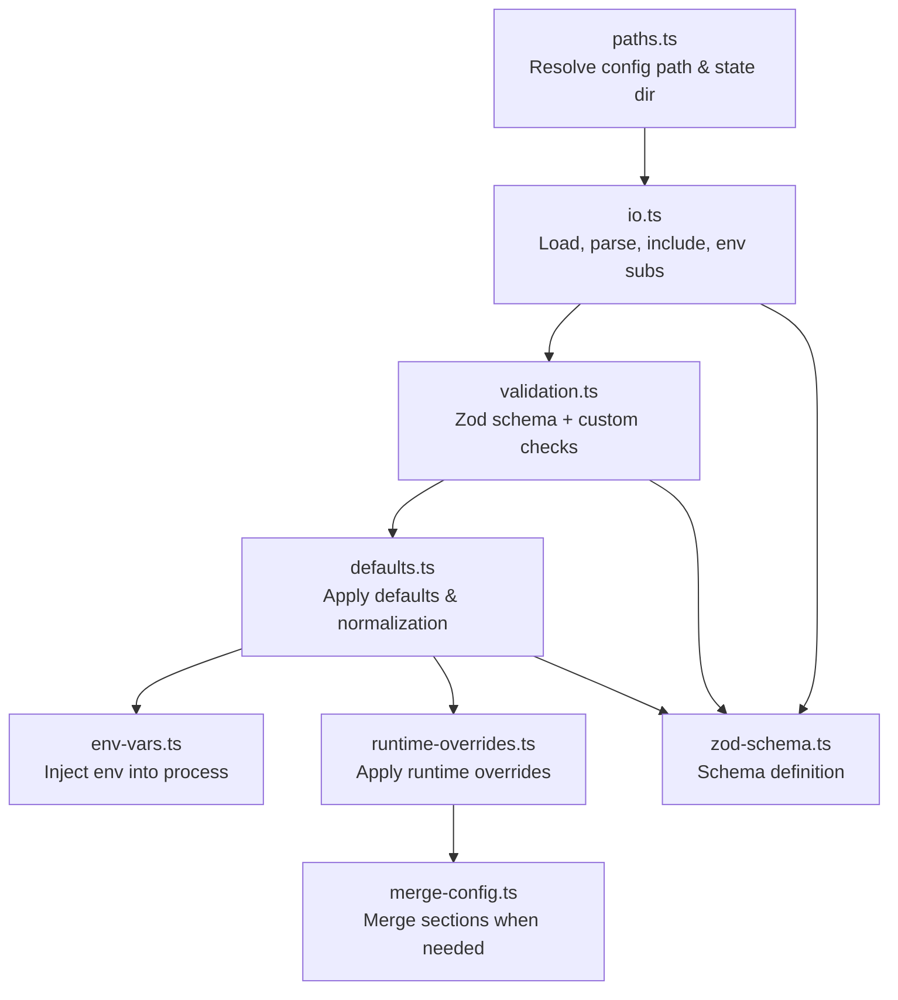
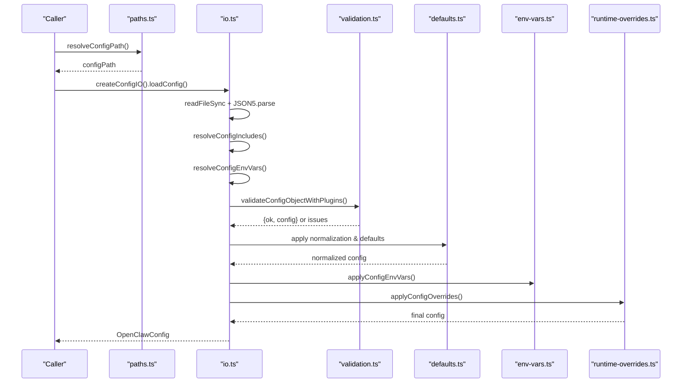
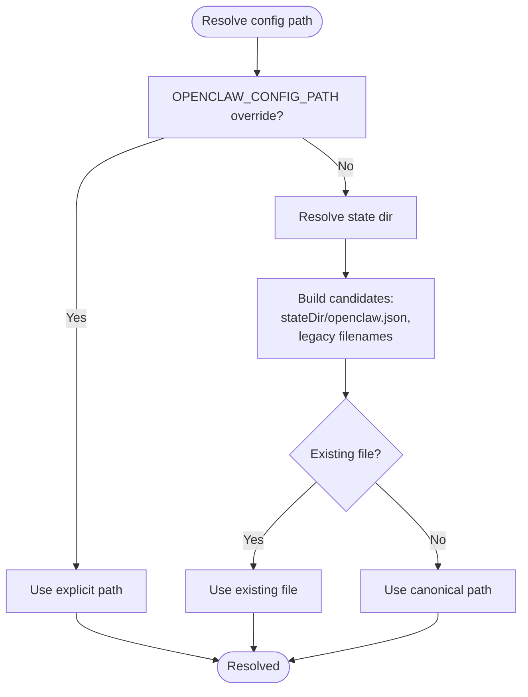
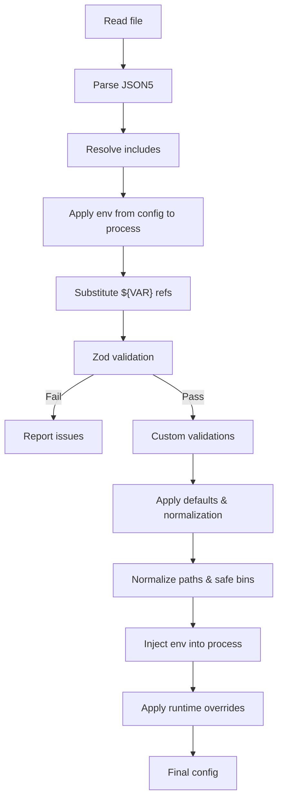
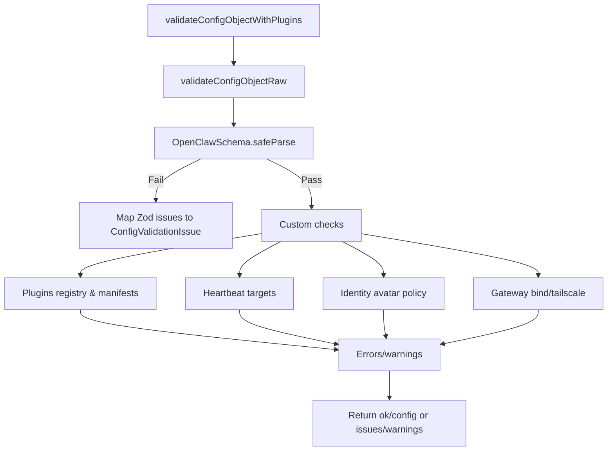
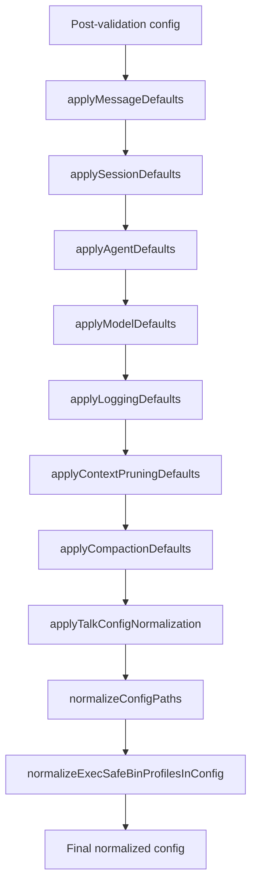
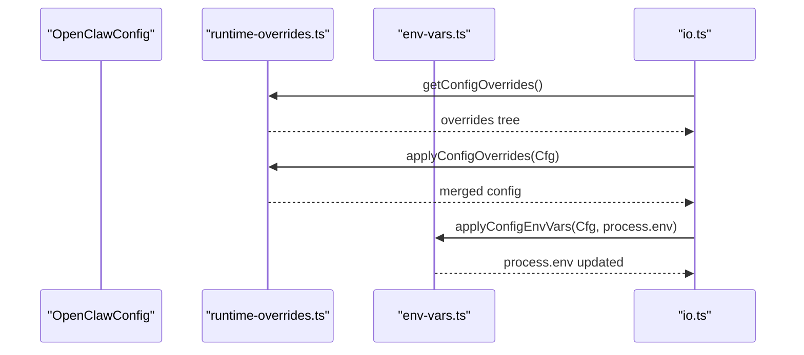
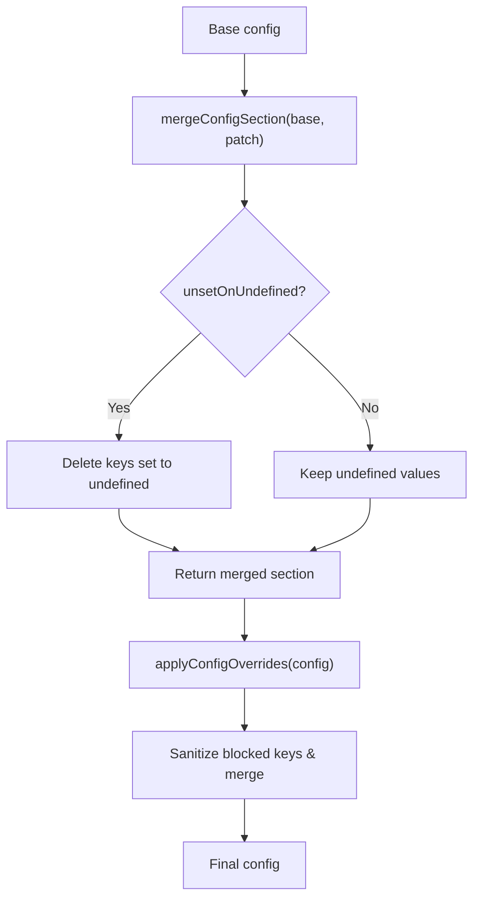
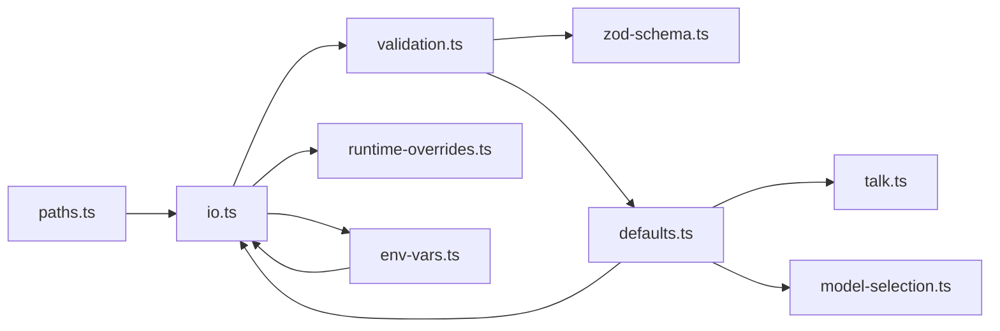

# Configuration Architecture

<cite>
**Referenced Files in This Document**
- [config.ts](file://src/config/config.ts)
- [io.ts](file://src/config/io.ts)
- [validation.ts](file://src/config/validation.ts)
- [defaults.ts](file://src/config/defaults.ts)
- [runtime-overrides.ts](file://src/config/runtime-overrides.ts)
- [merge-config.ts](file://src/config/merge-config.ts)
- [paths.ts](file://src/config/paths.ts)
- [env-vars.ts](file://src/config/env-vars.ts)
- [zod-schema.ts](file://src/config/zod-schema.ts)
- [types.ts](file://src/config/types.ts)
</cite>

## Table of Contents
1. [Introduction](#introduction)
2. [Project Structure](#project-structure)
3. [Core Components](#core-components)
4. [Architecture Overview](#architecture-overview)
5. [Detailed Component Analysis](#detailed-component-analysis)
6. [Dependency Analysis](#dependency-analysis)
7. [Performance Considerations](#performance-considerations)
8. [Troubleshooting Guide](#troubleshooting-guide)
9. [Conclusion](#conclusion)

## Introduction
This document explains OpenClaw’s configuration architecture: how configuration is discovered, loaded, validated, normalized, and applied at runtime. It covers the hierarchical configuration system, file organization patterns, precedence rules, and the interplay between global configuration, agent-specific settings, and runtime overrides. It also documents the configuration loading pipeline, validation mechanisms, error handling, inheritance and merging strategies, and conflict resolution. Practical examples and best practices are included for organizing large-scale configurations.

## Project Structure
OpenClaw’s configuration system is centered in the src/config directory. Key modules include:
- Discovery and path resolution for configuration files
- JSON5 parsing, include resolution, and environment variable substitution
- Validation against a Zod schema and post-validation normalization
- Default application and model/agent/session normalization
- Runtime overrides and environment injection
- Write-time snapshotting and safe persistence

**Diagram sources**
- [paths.ts](file://src/config/paths.ts#L118-L194)
- [io.ts](file://src/config/io.ts#L698-L800)
- [validation.ts](file://src/config/validation.ts#L229-L286)
- [defaults.ts](file://src/config/defaults.ts#L146-L532)
- [env-vars.ts](file://src/config/env-vars.ts#L70-L98)
- [runtime-overrides.ts](file://src/config/runtime-overrides.ts#L86-L92)
- [merge-config.ts](file://src/config/merge-config.ts#L8-L39)
- [zod-schema.ts](file://src/config/zod-schema.ts#L206-L800)

**Section sources**
- [paths.ts](file://src/config/paths.ts#L118-L194)
- [io.ts](file://src/config/io.ts#L698-L800)
- [validation.ts](file://src/config/validation.ts#L229-L286)
- [defaults.ts](file://src/config/defaults.ts#L146-L532)
- [env-vars.ts](file://src/config/env-vars.ts#L70-L98)
- [runtime-overrides.ts](file://src/config/runtime-overrides.ts#L86-L92)
- [merge-config.ts](file://src/config/merge-config.ts#L8-L39)
- [zod-schema.ts](file://src/config/zod-schema.ts#L206-L800)

## Core Components
- Configuration discovery and path resolution: Determines the active configuration file and state directory, supporting legacy and modern locations.
- IO and parsing: Reads JSON5, resolves includes, applies environment variable substitution, and captures snapshots for safe writes.
- Validation: Applies Zod schema validation and custom checks, including plugin registry validation and allowed values hints.
- Defaults and normalization: Applies model, agent, session, logging, and talk defaults; normalizes paths and safe binary profiles.
- Environment injection: Collects and injects environment variables into the process, respecting safety constraints.
- Runtime overrides: Allows programmatic overrides merged into the configuration at runtime.
- Schema and types: Centralized Zod schema and modular type exports define the shape of configuration.

**Section sources**
- [paths.ts](file://src/config/paths.ts#L118-L194)
- [io.ts](file://src/config/io.ts#L698-L800)
- [validation.ts](file://src/config/validation.ts#L229-L286)
- [defaults.ts](file://src/config/defaults.ts#L146-L532)
- [env-vars.ts](file://src/config/env-vars.ts#L70-L98)
- [runtime-overrides.ts](file://src/config/runtime-overrides.ts#L86-L92)
- [zod-schema.ts](file://src/config/zod-schema.ts#L206-L800)
- [types.ts](file://src/config/types.ts#L1-L36)

## Architecture Overview
The configuration lifecycle follows a strict pipeline:
1. Resolve the active configuration path and state directory.
2. Load and parse JSON5; resolve includes; substitute environment variables.
3. Validate against the Zod schema and run custom validators.
4. Normalize and apply defaults for models, agents, sessions, logging, and talk.
5. Inject environment variables into the process.
6. Apply runtime overrides.
7. Persist snapshots and write configuration safely.

**Diagram sources**
- [paths.ts](file://src/config/paths.ts#L118-L194)
- [io.ts](file://src/config/io.ts#L707-L795)
- [validation.ts](file://src/config/validation.ts#L308-L311)
- [defaults.ts](file://src/config/defaults.ts#L146-L532)
- [env-vars.ts](file://src/config/env-vars.ts#L79-L97)
- [runtime-overrides.ts](file://src/config/runtime-overrides.ts#L86-L92)

## Detailed Component Analysis

### Hierarchical Configuration System and File Organization
- Path resolution supports explicit override, state directory, and legacy fallbacks. The canonical path is under the state directory (~/.openclaw/openclaw.json), with support for legacy filenames and directories.
- Includes resolution allows splitting configuration across files; environment variable substitution occurs after includes are resolved.
- Environment variables can be injected from configuration into the process environment prior to substitution, ensuring ${VAR} references resolve correctly.

**Diagram sources**
- [paths.ts](file://src/config/paths.ts#L118-L194)

**Section sources**
- [paths.ts](file://src/config/paths.ts#L118-L194)
- [io.ts](file://src/config/io.ts#L653-L691)

### Configuration Loading Pipeline
- Loads JSON5, resolves includes, substitutes environment variables, validates, normalizes, injects environment, applies runtime overrides, and ensures path normalization and safe binary profile normalization.
- Captures environment snapshots for safe restoration during writes.

**Diagram sources**
- [io.ts](file://src/config/io.ts#L707-L795)
- [validation.ts](file://src/config/validation.ts#L229-L286)
- [defaults.ts](file://src/config/defaults.ts#L146-L532)
- [env-vars.ts](file://src/config/env-vars.ts#L79-L97)
- [runtime-overrides.ts](file://src/config/runtime-overrides.ts#L86-L92)

**Section sources**
- [io.ts](file://src/config/io.ts#L707-L795)
- [validation.ts](file://src/config/validation.ts#L229-L286)
- [defaults.ts](file://src/config/defaults.ts#L146-L532)
- [env-vars.ts](file://src/config/env-vars.ts#L79-L97)
- [runtime-overrides.ts](file://src/config/runtime-overrides.ts#L86-L92)

### Validation Mechanisms and Error Handling
- Zod schema enforces structural correctness and cross-field constraints.
- Custom validators augment schema checks with domain-specific rules (e.g., identity avatar policies, gateway bind/tailscale constraints, heartbeat targets, plugin registry diagnostics).
- Allowed values hints are generated for invalid union/enum errors to aid remediation.
- Validation failures are aggregated and returned with sanitized messages; warnings are emitted separately.

**Diagram sources**
- [validation.ts](file://src/config/validation.ts#L308-L311)
- [validation.ts](file://src/config/validation.ts#L229-L286)
- [zod-schema.ts](file://src/config/zod-schema.ts#L206-L800)

**Section sources**
- [validation.ts](file://src/config/validation.ts#L117-L140)
- [validation.ts](file://src/config/validation.ts#L229-L286)
- [validation.ts](file://src/config/validation.ts#L308-L311)
- [zod-schema.ts](file://src/config/zod-schema.ts#L206-L800)

### Defaults and Normalization
- Applies defaults for models, agents, sessions, logging, talk, context pruning, and compaction.
- Normalizes talk configuration, paths, and safe binary profiles.
- Ensures session mainKey is normalized to a canonical value and warns when overridden.

**Diagram sources**
- [defaults.ts](file://src/config/defaults.ts#L131-L532)

**Section sources**
- [defaults.ts](file://src/config/defaults.ts#L131-L532)

### Runtime Overrides and Environment Injection
- Runtime overrides are stored in a tree and merged into the configuration at load time, sanitized to avoid unsafe keys.
- Environment variables defined in configuration are injected into the process environment, with safeguards to prevent unresolved references from polluting process.env.

**Diagram sources**
- [runtime-overrides.ts](file://src/config/runtime-overrides.ts#L86-L92)
- [env-vars.ts](file://src/config/env-vars.ts#L79-L97)
- [io.ts](file://src/config/io.ts#L794-L795)

**Section sources**
- [runtime-overrides.ts](file://src/config/runtime-overrides.ts#L86-L92)
- [env-vars.ts](file://src/config/env-vars.ts#L79-L97)
- [io.ts](file://src/config/io.ts#L794-L795)

### Configuration Precedence Rules
- File precedence:
  - Explicit override via environment variable takes highest precedence.
  - Existing files in candidate locations are preferred over canonical path.
  - Legacy state directories are considered for backward compatibility.
- Environment variable precedence:
  - Variables defined in configuration are injected into process.env before substitution.
  - Substitution respects current process.env; if a variable is already present, it is not overwritten.
- Schema and defaults:
  - Zod schema defines allowed shapes and constraints.
  - Post-validation defaults fill missing fields and normalize values.
- Runtime overrides:
  - Programmatic overrides are merged into the configuration after defaults and normalization.

**Section sources**
- [paths.ts](file://src/config/paths.ts#L118-L194)
- [io.ts](file://src/config/io.ts#L653-L691)
- [io.ts](file://src/config/io.ts#L794-L795)
- [defaults.ts](file://src/config/defaults.ts#L146-L532)
- [runtime-overrides.ts](file://src/config/runtime-overrides.ts#L86-L92)

### Configuration Inheritance, Merging Strategies, and Conflict Resolution
- Section-level merging:
  - mergeConfigSection merges a patch into a base section, honoring unsetOnUndefined to remove keys explicitly set to undefined.
  - mergeWhatsAppConfig demonstrates targeted merging for subsections (e.g., channels.whatsapp).
- Runtime overrides:
  - applyConfigOverrides merges the overrides tree into the configuration, sanitizing blocked keys and preventing cycles.
- Conflict resolution:
  - Zod constraints resolve structural conflicts.
  - Custom validators surface semantic conflicts (e.g., gateway bind/tailscale mode) with actionable guidance.
  - Allowed values hints assist in resolving invalid union/enum values.

**Diagram sources**
- [merge-config.ts](file://src/config/merge-config.ts#L8-L39)
- [runtime-overrides.ts](file://src/config/runtime-overrides.ts#L86-L92)

**Section sources**
- [merge-config.ts](file://src/config/merge-config.ts#L8-L39)
- [runtime-overrides.ts](file://src/config/runtime-overrides.ts#L86-L92)

### Examples of Complex Configuration Scenarios and Best Practices
- Multi-agent configuration with per-agent heartbeat targets and channel-specific models:
  - Define agents.defaults.heartbeat.target and agents.list[].heartbeat.target with allowed values.
  - Use channels.<id> sections for channel-specific overrides; ensure channel IDs are registered or recognized.
- Gateway and tailscale binding:
  - When gateway.tailscale.mode is serve or funnel, gateway.bind must resolve to loopback; otherwise validation fails with guidance.
- Plugin configuration:
  - Use plugins.entries.<id>.config with plugin-provided schemas; missing or stale plugin IDs produce warnings or errors depending on context.
- Environment variable hygiene:
  - Place sensitive values in configuration.env.vars or environment; avoid unresolved ${VAR} references in configuration to prevent accidental pollution of process.env.
- Large-scale organization:
  - Split configuration into includes; keep global defaults in one file and environment-specific overrides in separate files.
  - Use runtime overrides for ephemeral changes (e.g., testing) without modifying persistent files.

[No sources needed since this section provides general guidance]

## Dependency Analysis
The configuration system exhibits clear separation of concerns:
- io.ts depends on paths.ts, includes resolution, env substitution, validation, defaults, and runtime overrides.
- validation.ts depends on zod-schema.ts and defaults.ts.
- defaults.ts depends on model selection and talk configuration utilities.
- runtime-overrides.ts and env-vars.ts are leaf consumers of configuration.

**Diagram sources**
- [paths.ts](file://src/config/paths.ts#L118-L194)
- [io.ts](file://src/config/io.ts#L698-L800)
- [validation.ts](file://src/config/validation.ts#L229-L286)
- [defaults.ts](file://src/config/defaults.ts#L1-L537)
- [zod-schema.ts](file://src/config/zod-schema.ts#L206-L800)
- [runtime-overrides.ts](file://src/config/runtime-overrides.ts#L86-L92)
- [env-vars.ts](file://src/config/env-vars.ts#L70-L98)

**Section sources**
- [paths.ts](file://src/config/paths.ts#L118-L194)
- [io.ts](file://src/config/io.ts#L698-L800)
- [validation.ts](file://src/config/validation.ts#L229-L286)
- [defaults.ts](file://src/config/defaults.ts#L1-L537)
- [zod-schema.ts](file://src/config/zod-schema.ts#L206-L800)
- [runtime-overrides.ts](file://src/config/runtime-overrides.ts#L86-L92)
- [env-vars.ts](file://src/config/env-vars.ts#L70-L98)

## Performance Considerations
- JSON5 parsing and include resolution are lightweight; most overhead comes from validation and normalization.
- Environment variable substitution and injection occur once per load; caching is implicit via process.env reuse.
- Defaults and normalization are shallow merges and transformations; complexity is linear in the size of configuration sections.
- Consider keeping configuration files compact and avoiding excessive nesting to minimize validation and normalization costs.

[No sources needed since this section provides general guidance]

## Troubleshooting Guide
Common issues and resolutions:
- Invalid configuration:
  - Validation failures report path and message; use allowed values hints to fix union/enum errors.
  - Fix gateway bind/tailscale mode mismatches with suggested commands.
- Missing environment variables:
  - Unresolved ${VAR} references produce warnings; ensure variables are present in process.env or defined in configuration.env.vars.
- Plugin-related issues:
  - Missing or stale plugin IDs produce warnings or errors; remove stale entries or install the plugin.
- Duplicate agent directories:
  - Validation detects and reports duplicate agent directories; adjust agents.list entries accordingly.

**Section sources**
- [validation.ts](file://src/config/validation.ts#L166-L185)
- [io.ts](file://src/config/io.ts#L729-L733)
- [validation.ts](file://src/config/validation.ts#L467-L490)

## Conclusion
OpenClaw’s configuration architecture balances flexibility and safety. The hierarchical discovery, robust validation, and careful normalization ensure reliable operation across diverse environments. By leveraging includes, environment injection, and runtime overrides, operators can manage complex, multi-agent setups while maintaining strong guarantees around correctness and security.