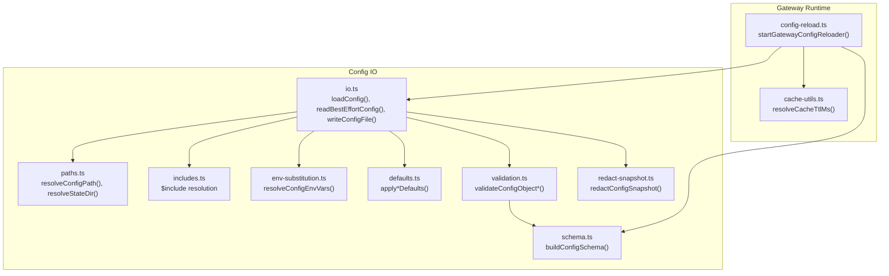
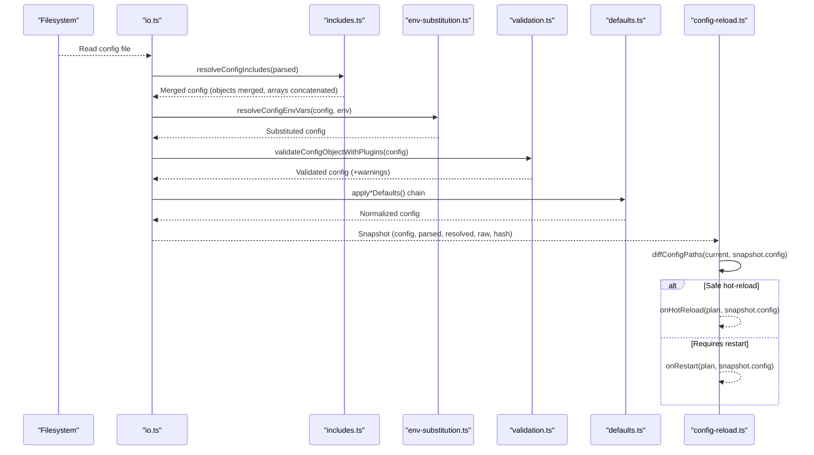
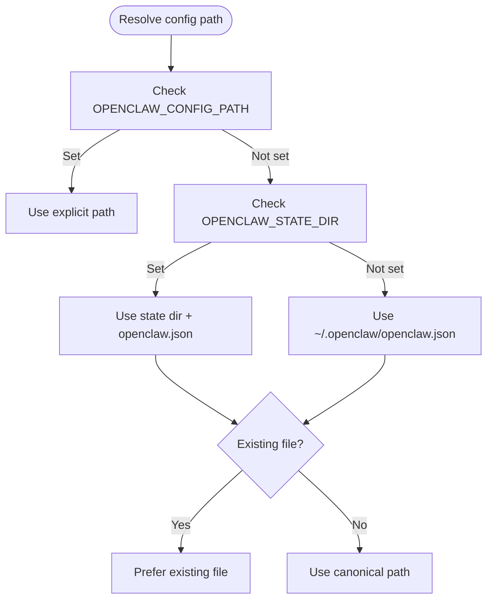
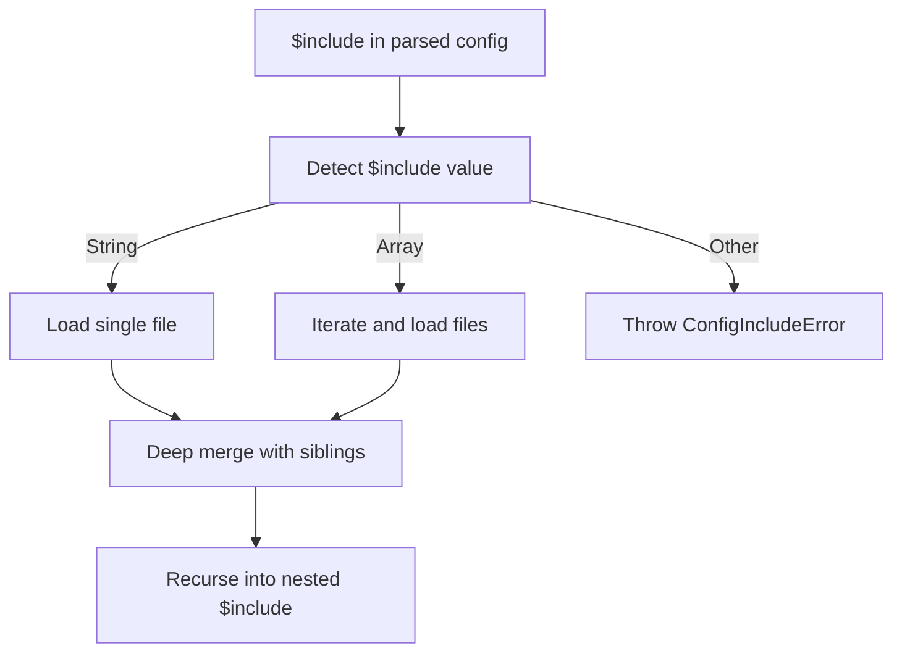
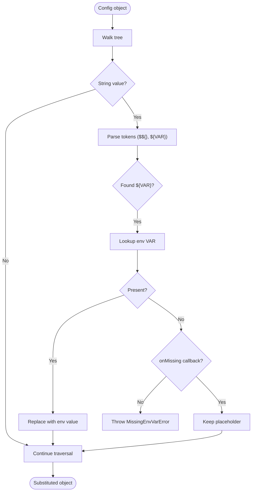
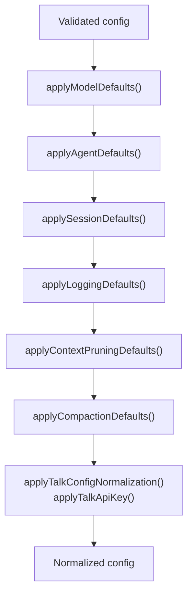
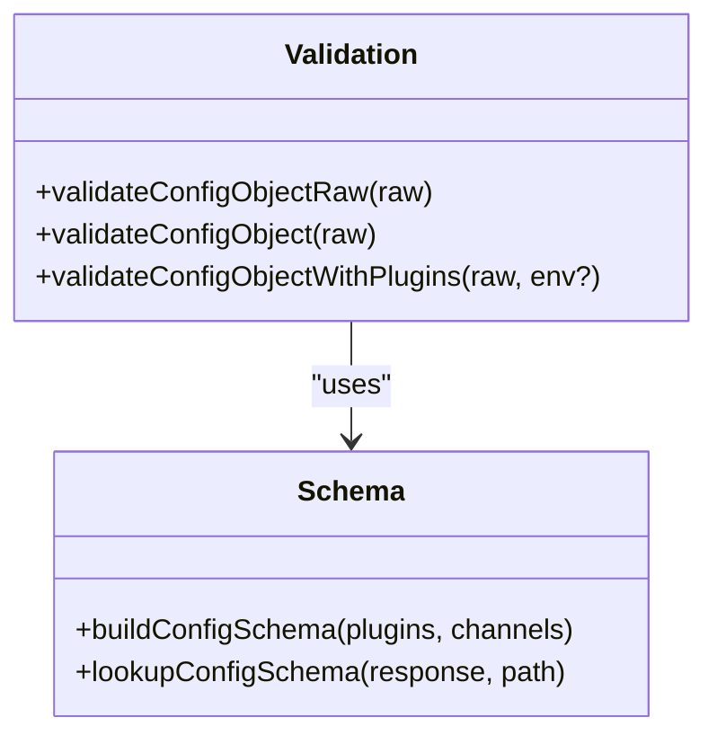
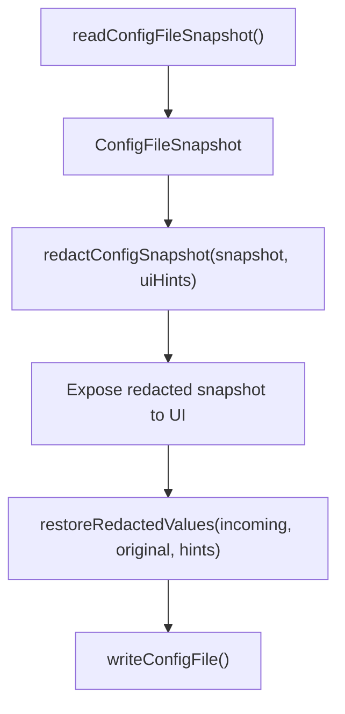
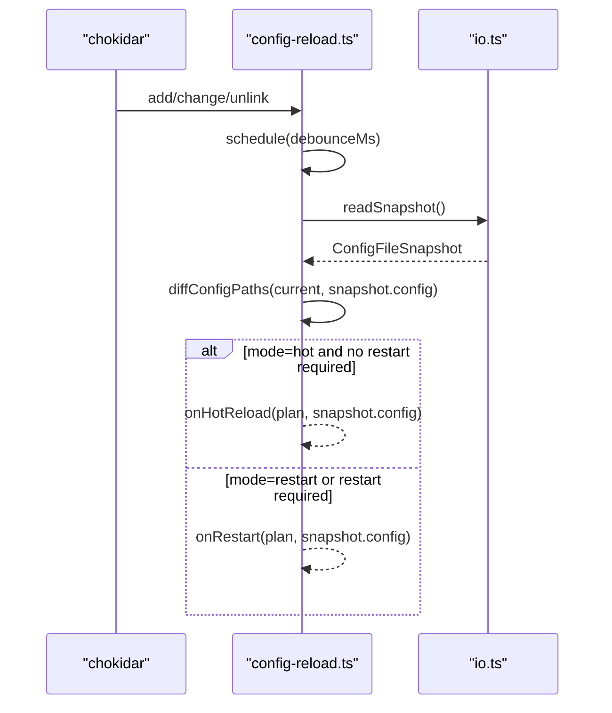
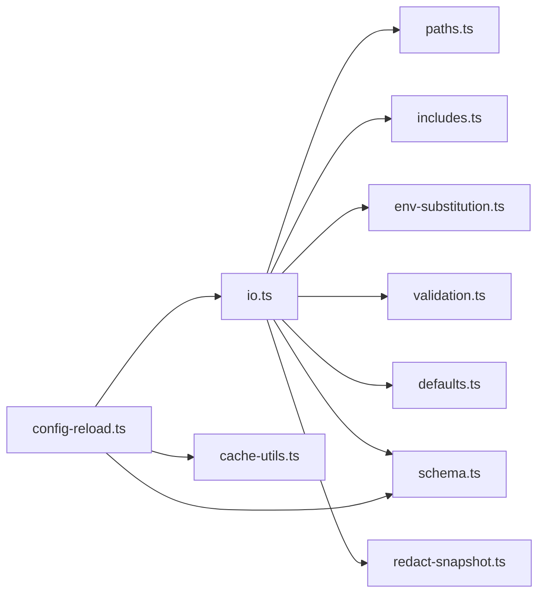

# Configuration Architecture

<cite>
**Referenced Files in This Document**
- [io.ts](file://src/config/io.ts)
- [paths.ts](file://src/config/paths.ts)
- [includes.ts](file://src/config/includes.ts)
- [env-substitution.ts](file://src/config/env-substitution.ts)
- [defaults.ts](file://src/config/defaults.ts)
- [validation.ts](file://src/config/validation.ts)
- [schema.ts](file://src/config/schema.ts)
- [redact-snapshot.ts](file://src/config/redact-snapshot.ts)
- [config-reload.ts](file://src/gateway/config-reload.ts)
- [cache-utils.ts](file://src/config/cache-utils.ts)
- [merge-config.ts](file://src/config/merge-config.ts)
- [config.ts](file://src/config/config.ts)
</cite>

## Table of Contents
1. [Introduction](#introduction)
2. [Project Structure](#project-structure)
3. [Core Components](#core-components)
4. [Architecture Overview](#architecture-overview)
5. [Detailed Component Analysis](#detailed-component-analysis)
6. [Dependency Analysis](#dependency-analysis)
7. [Performance Considerations](#performance-considerations)
8. [Troubleshooting Guide](#troubleshooting-guide)
9. [Conclusion](#conclusion)

## Introduction
This document explains OpenClaw’s hierarchical configuration architecture. It covers how configuration files are organized, how precedence and inclusion rules are applied, how environment substitution works, and how defaults and validation shape runtime configuration. It also documents the configuration IO system, runtime snapshots, source tracking, and hot-reload capabilities. Practical examples illustrate loading, validation, and refresh processes, along with caching, error handling, and the lifecycle from file parsing to runtime application.

## Project Structure
OpenClaw’s configuration system is centered in the src/config module and integrates with gateway runtime reloading. Key areas:
- File organization and precedence: canonical path resolution, legacy fallbacks, and environment overrides
- Loading pipeline: includes resolution, environment substitution, validation, defaults, and normalization
- Schema and UI hints: dynamic schema building with plugin/channel metadata
- Runtime snapshots and source tracking: separation of parsed vs. resolved config for safe UI exposure
- Hot-reload: filesystem watching, change detection, and reload planning

```mermaid
graph TB
subgraph "Config IO"
A["io.ts<br/>loadConfig(), readBestEffortConfig(), writeConfigFile()"]
B["paths.ts<br/>resolveConfigPath(), resolveStateDir()"]
C["includes.ts<br/>$include resolution"]
D["env-substitution.ts<br/>resolveConfigEnvVars()"]
E["defaults.ts<br/>apply*Defaults()"]
F["validation.ts<br/>validateConfigObject*()"]
G["schema.ts<br/>buildConfigSchema()"]
H["redact-snapshot.ts<br/>redactConfigSnapshot()"]
end
subgraph "Gateway Runtime"
I["config-reload.ts<br/>startGatewayConfigReloader()"]
J["cache-utils.ts<br/>resolveCacheTtlMs()"]
end
A --> B
A --> C
A --> D
A --> F
A --> E
F --> G
A --> H
I --> A
I --> G
I --> J
```

**Diagram sources**
- [io.ts:725-800](file://src/config/io.ts#L725-L800)
- [paths.ts:106-182](file://src/config/paths.ts#L106-L182)
- [includes.ts:340-347](file://src/config/includes.ts#L340-L347)
- [env-substitution.ts:197-204](file://src/config/env-substitution.ts#L197-L204)
- [defaults.ts:209-347](file://src/config/defaults.ts#L209-L347)
- [validation.ts:229-286](file://src/config/validation.ts#L229-L286)
- [schema.ts:449-484](file://src/config/schema.ts#L449-L484)
- [redact-snapshot.ts:382-431](file://src/config/redact-snapshot.ts#L382-L431)
- [config-reload.ts:72-247](file://src/gateway/config-reload.ts#L72-L247)
- [cache-utils.ts:4-20](file://src/config/cache-utils.ts#L4-L20)

**Section sources**
- [paths.ts:106-182](file://src/config/paths.ts#L106-L182)
- [io.ts:725-800](file://src/config/io.ts#L725-L800)

## Core Components
- Configuration IO and loading
  - createConfigIO and loadConfig orchestrate file discovery, includes, environment substitution, validation, defaults, and normalization.
- File organization and precedence
  - Canonical path resolution with environment overrides and legacy fallbacks.
- Includes and merging
  - $include directive resolution with security guards, circular include detection, and deep merge semantics.
- Environment substitution
  - ${VAR} expansion with warnings for missing variables and escaping support.
- Defaults and normalization
  - Provider defaults, model defaults, agent/session defaults, logging defaults, and talk config normalization.
- Validation and schema
  - Zod-based validation, plugin/channel-aware schema building, and UI hints for Control UI.
- Runtime snapshots and redaction
  - Separate parsed/resolved/raw snapshots; redaction of sensitive values; source tracking for safe UI exposure.
- Hot-reload
  - Filesystem watching, debounced reload, change diffing, and reload plan evaluation.

**Section sources**
- [io.ts:725-800](file://src/config/io.ts#L725-L800)
- [paths.ts:106-182](file://src/config/paths.ts#L106-L182)
- [includes.ts:340-347](file://src/config/includes.ts#L340-L347)
- [env-substitution.ts:197-204](file://src/config/env-substitution.ts#L197-L204)
- [defaults.ts:209-347](file://src/config/defaults.ts#L209-L347)
- [validation.ts:229-286](file://src/config/validation.ts#L229-L286)
- [schema.ts:449-484](file://src/config/schema.ts#L449-L484)
- [redact-snapshot.ts:382-431](file://src/config/redact-snapshot.ts#L382-L431)
- [config-reload.ts:72-247](file://src/gateway/config-reload.ts#L72-L247)

## Architecture Overview
The configuration lifecycle spans file discovery, includes resolution, environment substitution, validation, defaults application, normalization, and optional writing back to disk. At runtime, the gateway watches the config file and applies hot-reloads when safe, otherwise restarting the gateway.

```mermaid
sequenceDiagram
participant FS as "Filesystem"
participant IO as "io.ts"
participant INC as "includes.ts"
participant ENV as "env-substitution.ts"
participant VAL as "validation.ts"
participant DEF as "defaults.ts"
participant GW as "config-reload.ts"
FS-->>IO : Read config file
IO->>INC : resolveConfigIncludes(parsed)
INC-->>IO : Merged config (objects merged, arrays concatenated)
IO->>ENV : resolveConfigEnvVars(config, env)
ENV-->>IO : Substituted config
IO->>VAL : validateConfigObjectWithPlugins(config)
VAL-->>IO : Validated config (+warnings)
IO->>DEF : apply*Defaults() chain
DEF-->>IO : Normalized config
IO-->>GW : Snapshot (config, parsed, resolved, raw, hash)
GW->>GW : diffConfigPaths(current, snapshot.config)
alt Safe hot-reload
GW-->>GW : onHotReload(plan, snapshot.config)
else Requires restart
GW-->>GW : onRestart(plan, snapshot.config)
end
```

**Diagram sources**
- [io.ts:725-800](file://src/config/io.ts#L725-L800)
- [includes.ts:340-347](file://src/config/includes.ts#L340-L347)
- [env-substitution.ts:197-204](file://src/config/env-substitution.ts#L197-L204)
- [validation.ts:300-312](file://src/config/validation.ts#L300-L312)
- [defaults.ts:209-347](file://src/config/defaults.ts#L209-L347)
- [config-reload.ts:150-182](file://src/gateway/config-reload.ts#L150-L182)

## Detailed Component Analysis

### File Organization and Precedence
- Canonical path resolution
  - OPENCLAW_CONFIG_PATH overrides default state dir; OPENCLAW_STATE_DIR influences default location; legacy state dirs supported.
- Default candidates and preference
  - Existing files are preferred over canonical path; supports legacy filenames.
- Environment overrides
  - OPENCLAW_STATE_DIR, OPENCLAW_CONFIG_PATH, OPENCLAW_GATEWAY_PORT influence runtime behavior.

```mermaid
flowchart TD
Start(["Resolve config path"]) --> CheckEnv["Check OPENCLAW_CONFIG_PATH"]
CheckEnv --> |Set| UseEnv["Use explicit path"]
CheckEnv --> |Not set| CheckState["Check OPENCLAW_STATE_DIR"]
CheckState --> |Set| UseState["Use state dir + openclaw.json"]
CheckState --> |Not set| Default["Use ~/.openclaw/openclaw.json"]
UseState --> Exists{"Existing file?"}
Default --> Exists
Exists --> |Yes| Prefer["Prefer existing file"]
Exists --> |No| Canonical["Use canonical path"]
```

**Diagram sources**
- [paths.ts:106-182](file://src/config/paths.ts#L106-L182)

**Section sources**
- [paths.ts:106-182](file://src/config/paths.ts#L106-L182)

### Includes Resolution and Merging
- $include directive supports single file or array of files.
- Security: path traversal guard, symlink resolution, maximum depth, and file size limits.
- Merge semantics: arrays concatenate, objects merge recursively, primitives favor source.

```mermaid
flowchart TD
Parsed["$include in parsed config"] --> Detect["Detect $include value"]
Detect --> |String| LoadOne["Load single file"]
Detect --> |Array| LoadMany["Iterate and load files"]
Detect --> |Other| Error["Throw ConfigIncludeError"]
LoadOne --> Merge["Deep merge with siblings"]
LoadMany --> Merge
Merge --> Recurse["Recurse into nested $include"]
```

**Diagram sources**
- [includes.ts:131-176](file://src/config/includes.ts#L131-L176)
- [includes.ts:340-347](file://src/config/includes.ts#L340-L347)

**Section sources**
- [includes.ts:131-176](file://src/config/includes.ts#L131-L176)
- [includes.ts:289-324](file://src/config/includes.ts#L289-L324)

### Environment Variable Substitution
- ${VAR} expansion with uppercase name pattern; escaped with $$${}.
- Missing variables can emit warnings instead of failing when using onMissing option.
- Applied after config.env is hydrated into process.env during read.

```mermaid
flowchart TD
Start(["Config object"]) --> Walk["Walk tree"]
Walk --> CheckStr{"String value?"}
CheckStr --> |No| Next["Continue traversal"]
CheckStr --> |Yes| Parse["Parse tokens ($${}, ${VAR})"]
Parse --> Found{"Found ${VAR}?"}
Found --> |Yes| Lookup["Lookup env VAR"]
Lookup --> Missing{"Present?"}
Missing --> |Yes| Replace["Replace with env value"]
Missing --> |No| OnMissing{"onMissing callback?"}
OnMissing --> |Yes| Keep["Keep placeholder"]
OnMissing --> |No| Throw["Throw MissingEnvVarError"]
Replace --> Next
Keep --> Next
Next --> End(["Substituted object"])
```

**Diagram sources**
- [env-substitution.ts:88-135](file://src/config/env-substitution.ts#L88-L135)
- [env-substitution.ts:197-204](file://src/config/env-substitution.ts#L197-L204)

**Section sources**
- [env-substitution.ts:88-135](file://src/config/env-substitution.ts#L88-L135)
- [env-substitution.ts:197-204](file://src/config/env-substitution.ts#L197-L204)

### Defaults and Normalization
- Provider defaults, model defaults, agent/session defaults, logging defaults, and context pruning defaults.
- Talk config normalization and API key fallback.
- Ensures consistent runtime behavior even when users omit optional fields.

```mermaid
flowchart TD
Base["Validated config"] --> Models["applyModelDefaults()"]
Models --> Agents["applyAgentDefaults()"]
Agents --> Sessions["applySessionDefaults()"]
Sessions --> Logging["applyLoggingDefaults()"]
Logging --> Context["applyContextPruningDefaults()"]
Context --> Compaction["applyCompactionDefaults()"]
Compaction --> Talk["applyTalkConfigNormalization()<br/>applyTalkApiKey()"]
Talk --> Final["Normalized config"]
```

**Diagram sources**
- [defaults.ts:209-347](file://src/config/defaults.ts#L209-L347)

**Section sources**
- [defaults.ts:209-347](file://src/config/defaults.ts#L209-L347)

### Validation and Schema
- Zod-based validation with rich issue mapping and allowed values hints.
- Plugin/channel-aware schema building with UI hints and sensitive tag derivation.
- Heartbeat target validation, unknown channel detection, and plugin presence checks.

```mermaid
classDiagram
class Validation {
+validateConfigObjectRaw(raw)
+validateConfigObject(raw)
+validateConfigObjectWithPlugins(raw, env?)
}
class Schema {
+buildConfigSchema(plugins, channels)
+lookupConfigSchema(response, path)
}
Validation --> Schema : "uses"
```

**Diagram sources**
- [validation.ts:229-286](file://src/config/validation.ts#L229-L286)
- [schema.ts:449-484](file://src/config/schema.ts#L449-L484)

**Section sources**
- [validation.ts:229-286](file://src/config/validation.ts#L229-L286)
- [schema.ts:449-484](file://src/config/schema.ts#L449-L484)

### Runtime Snapshots and Source Tracking
- Snapshots capture parsed, resolved, raw, and hash for safe handling.
- Redaction replaces sensitive values with sentinel; supports restoring originals during writes.
- Source projection ensures edits remain compatible with runtime snapshot shape.

```mermaid
flowchart TD
Read["readConfigFileSnapshot()"] --> Snap["ConfigFileSnapshot"]
Snap --> Redact["redactConfigSnapshot(snapshot, uiHints)"]
Redact --> Expose["Expose redacted snapshot to UI"]
Expose --> Restore["restoreRedactedValues(incoming, original, hints)"]
Restore --> Write["writeConfigFile()"]
```

**Diagram sources**
- [redact-snapshot.ts:382-431](file://src/config/redact-snapshot.ts#L382-L431)
- [redact-snapshot.ts:447-481](file://src/config/redact-snapshot.ts#L447-L481)
- [io.ts:1438-1465](file://src/config/io.ts#L1438-L1465)

**Section sources**
- [redact-snapshot.ts:382-431](file://src/config/redact-snapshot.ts#L382-L431)
- [redact-snapshot.ts:447-481](file://src/config/redact-snapshot.ts#L447-L481)
- [io.ts:1438-1465](file://src/config/io.ts#L1438-L1465)

### Hot-Reload and Lifecycle
- Filesystem watching with debounce; change diffing determines safe hot-reload vs. restart.
- Reload plan evaluates impact and invokes callbacks for hot-reload or restart.
- Cache TTL and enablement utilities support configuration caching behavior.

```mermaid
sequenceDiagram
participant Watch as "chokidar"
participant Reloader as "config-reload.ts"
participant IO as "io.ts"
Watch->>Reloader : add/change/unlink
Reloader->>Reloader : schedule(debounceMs)
Reloader->>IO : readSnapshot()
IO-->>Reloader : ConfigFileSnapshot
Reloader->>Reloader : diffConfigPaths(current, snapshot.config)
alt mode=hot and no restart required
Reloader-->>Reloader : onHotReload(plan, snapshot.config)
else mode=restart or restart required
Reloader-->>Reloader : onRestart(plan, snapshot.config)
end
```

**Diagram sources**
- [config-reload.ts:23-52](file://src/gateway/config-reload.ts#L23-L52)
- [config-reload.ts:150-182](file://src/gateway/config-reload.ts#L150-L182)
- [config-reload.ts:217-247](file://src/gateway/config-reload.ts#L217-L247)

**Section sources**
- [config-reload.ts:23-52](file://src/gateway/config-reload.ts#L23-L52)
- [config-reload.ts:150-182](file://src/gateway/config-reload.ts#L150-L182)
- [config-reload.ts:217-247](file://src/gateway/config-reload.ts#L217-L247)
- [cache-utils.ts:4-20](file://src/config/cache-utils.ts#L4-L20)

### Practical Examples

- Loading and validation
  - Use createConfigIO and loadConfig to read, merge includes, substitute environment variables, validate, and apply defaults.
  - Example path: [io.ts:725-800](file://src/config/io.ts#L725-L800)

- Writing and redaction
  - writeConfigFile persists normalized config; redactConfigSnapshot protects sensitive values in UI responses.
  - Example path: [redact-snapshot.ts:382-431](file://src/config/redact-snapshot.ts#L382-L431)

- Refresh and projection
  - projectConfigOntoRuntimeSourceSnapshot projects edits onto the runtime source snapshot to preserve environment references and resolved values.
  - Example path: [io.ts:1438-1465](file://src/config/io.ts#L1438-L1465)

- Hot-reload
  - startGatewayConfigReloader sets up watchers, computes reload plans, and delegates to onHotReload/onRestart.
  - Example path: [config-reload.ts:72-247](file://src/gateway/config-reload.ts#L72-L247)

**Section sources**
- [io.ts:725-800](file://src/config/io.ts#L725-L800)
- [redact-snapshot.ts:382-431](file://src/config/redact-snapshot.ts#L382-L431)
- [io.ts:1438-1465](file://src/config/io.ts#L1438-L1465)
- [config-reload.ts:72-247](file://src/gateway/config-reload.ts#L72-L247)

## Dependency Analysis
The configuration system composes several modules with clear boundaries:
- io.ts depends on paths.ts, includes.ts, env-substitution.ts, validation.ts, defaults.ts, schema.ts, and redact-snapshot.ts.
- config-reload.ts depends on io.ts and schema.ts for change detection and UI hints.
- cache-utils.ts provides TTL utilities used by higher-level components.

```mermaid
graph LR
IO["io.ts"] --> PATHS["paths.ts"]
IO --> INC["includes.ts"]
IO --> ENV["env-substitution.ts"]
IO --> VAL["validation.ts"]
IO --> DEF["defaults.ts"]
IO --> SCH["schema.ts"]
IO --> RED["redact-snapshot.ts"]
GW["config-reload.ts"] --> IO
GW --> SCH
GW --> CU["cache-utils.ts"]
```

**Diagram sources**
- [io.ts:725-800](file://src/config/io.ts#L725-L800)
- [paths.ts:106-182](file://src/config/paths.ts#L106-L182)
- [includes.ts:340-347](file://src/config/includes.ts#L340-L347)
- [env-substitution.ts:197-204](file://src/config/env-substitution.ts#L197-L204)
- [validation.ts:229-286](file://src/config/validation.ts#L229-L286)
- [defaults.ts:209-347](file://src/config/defaults.ts#L209-L347)
- [schema.ts:449-484](file://src/config/schema.ts#L449-L484)
- [redact-snapshot.ts:382-431](file://src/config/redact-snapshot.ts#L382-L431)
- [config-reload.ts:72-247](file://src/gateway/config-reload.ts#L72-L247)
- [cache-utils.ts:4-20](file://src/config/cache-utils.ts#L4-L20)

**Section sources**
- [io.ts:725-800](file://src/config/io.ts#L725-L800)
- [config-reload.ts:72-247](file://src/gateway/config-reload.ts#L72-L247)

## Performance Considerations
- Debounce and batching: config-reload.ts debounces filesystem events to avoid thrashing during rapid edits.
- Change diffing: diffConfigPaths minimizes reload scope by focusing only changed paths.
- Schema caching: schema.ts caches merged schemas keyed by plugin/channel metadata to reduce recomputation.
- Redaction strategies: selective redaction avoids expensive full scans when UI hints are available.

[No sources needed since this section provides general guidance]

## Troubleshooting Guide
- Invalid configuration
  - validateConfigObjectWithPlugins reports issues and warnings; errors include a code and details for programmatic handling.
  - Example path: [validation.ts:300-312](file://src/config/validation.ts#L300-L312)

- Missing environment variables
  - MissingEnvVarError indicates which variable and path caused failure; use onMissing to collect warnings instead of throwing.
  - Example path: [env-substitution.ts:29-37](file://src/config/env-substitution.ts#L29-L37)

- Circular or invalid includes
  - CircularIncludeError and ConfigIncludeError indicate include chain or read/parsing failures; check include paths and depth limits.
  - Example path: [includes.ts:58-63](file://src/config/includes.ts#L58-L63)

- Hot-reload failures
  - startGatewayConfigReloader logs and retries on missing config; restart queued when plan requires gateway restart.
  - Example path: [config-reload.ts:124-148](file://src/gateway/config-reload.ts#L124-L148)

**Section sources**
- [validation.ts:300-312](file://src/config/validation.ts#L300-L312)
- [env-substitution.ts:29-37](file://src/config/env-substitution.ts#L29-L37)
- [includes.ts:58-63](file://src/config/includes.ts#L58-L63)
- [config-reload.ts:124-148](file://src/gateway/config-reload.ts#L124-L148)

## Conclusion
OpenClaw’s configuration architecture balances flexibility and safety. Hierarchical includes, environment substitution, robust validation, and defaults ensure predictable runtime behavior. Runtime snapshots and redaction protect sensitive data, while hot-reload and schema-driven UI hints enable safe, iterative configuration updates. The system’s modularity and clear boundaries make it extensible for plugins and channels, with strong safeguards against path traversal, circular includes, and credential leakage.