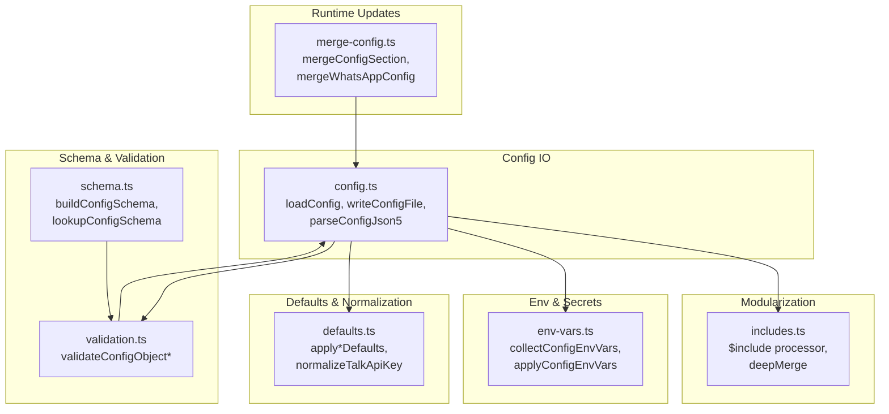
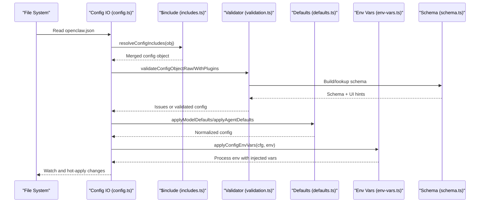
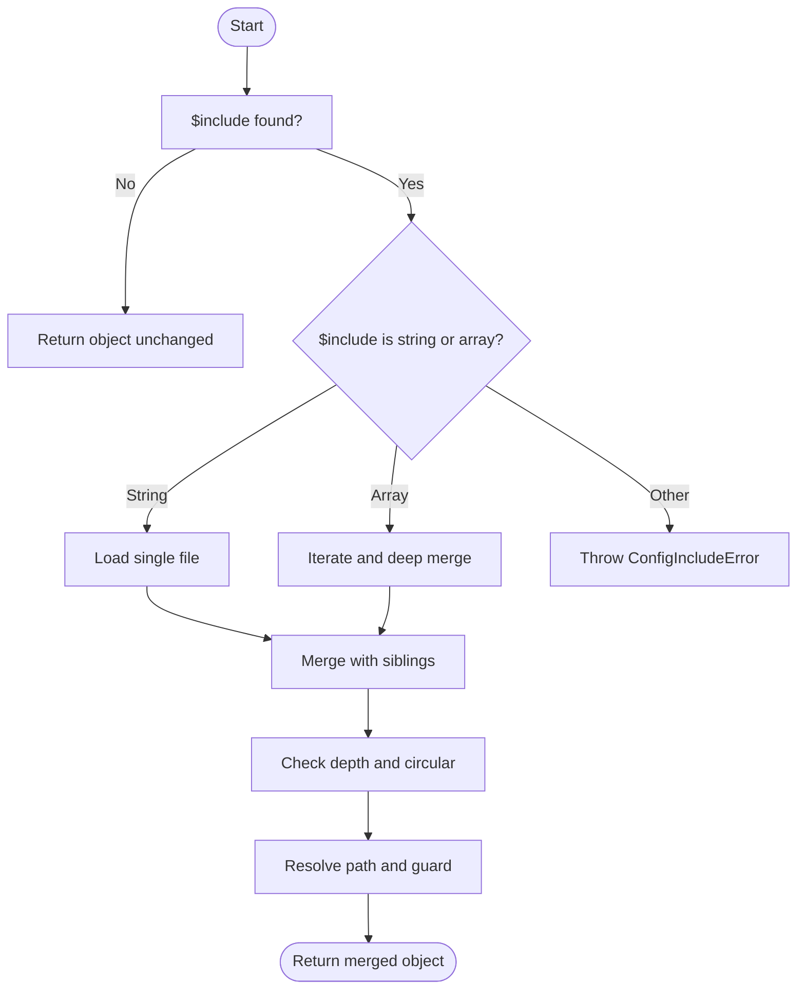
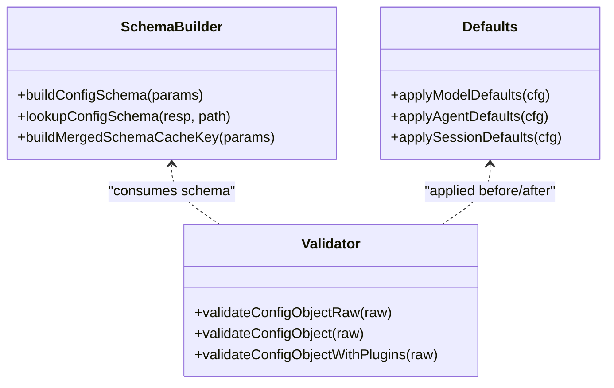
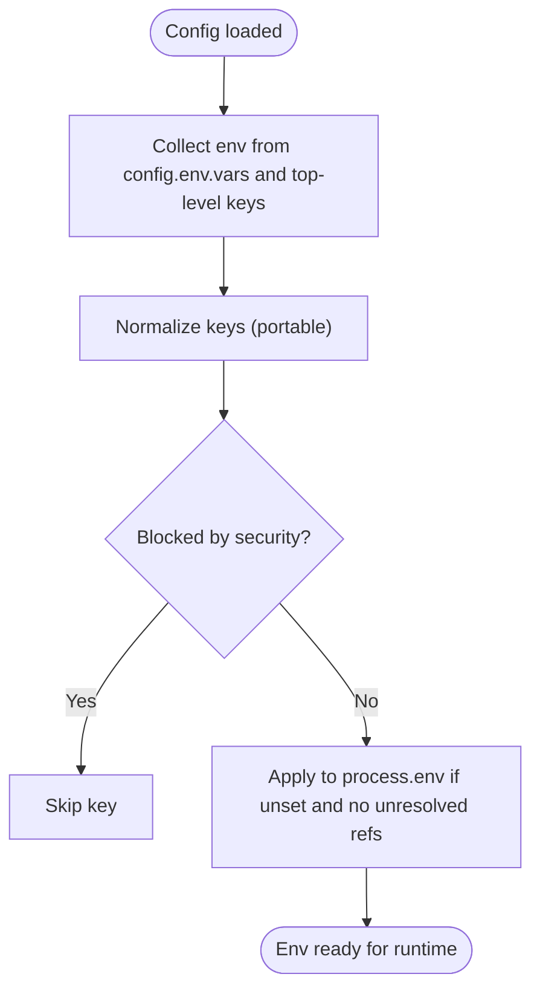
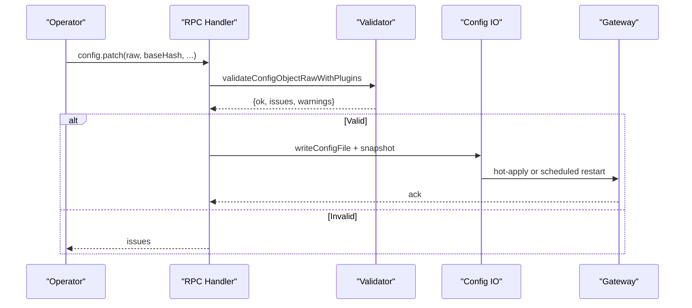
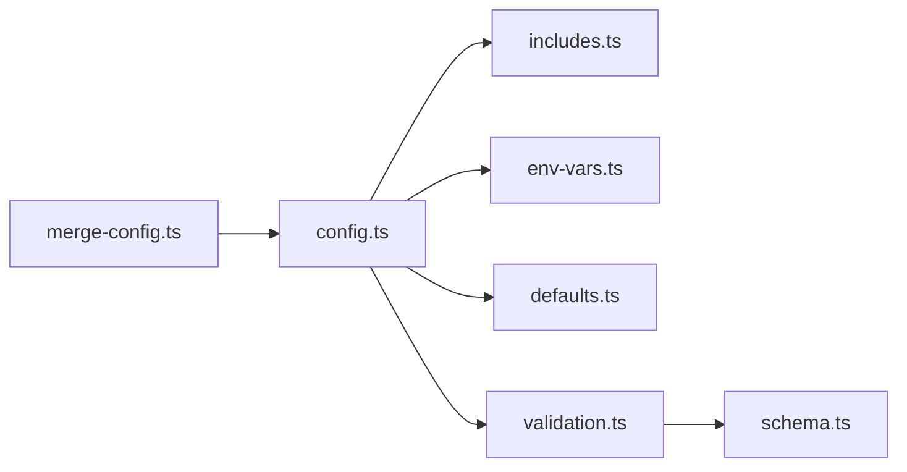

# Configuration Management

<cite>
**Referenced Files in This Document**
- [configuration.md](file://docs/gateway/configuration.md)
- [configuration-reference.md](file://docs/gateway/configuration-reference.md)
- [config.ts](file://src/config/config.ts)
- [schema.ts](file://src/config/schema.ts)
- [env-vars.ts](file://src/config/env-vars.ts)
- [includes.ts](file://src/config/includes.ts)
- [defaults.ts](file://src/config/defaults.ts)
- [validation.ts](file://src/config/validation.ts)
- [merge-config.ts](file://src/config/merge-config.ts)
- [types.ts](file://src/config/types.ts)
</cite>

## Table of Contents
1. [Introduction](#introduction)
2. [Project Structure](#project-structure)
3. [Core Components](#core-components)
4. [Architecture Overview](#architecture-overview)
5. [Detailed Component Analysis](#detailed-component-analysis)
6. [Dependency Analysis](#dependency-analysis)
7. [Performance Considerations](#performance-considerations)
8. [Troubleshooting Guide](#troubleshooting-guide)
9. [Conclusion](#conclusion)
10. [Appendices](#appendices)

## Introduction
This document explains OpenClaw’s hierarchical configuration system: how configuration is loaded, validated, merged, and applied at runtime; how environment variables and secret references integrate; and how to manage configuration safely and collaboratively. It covers the JSON5 configuration file, environment variable precedence, runtime hot reload, programmatic updates, and the template system for agent and system bootstrapping.

## Project Structure
OpenClaw’s configuration system is implemented in the src/config module and documented in docs/gateway. The key areas are:
- Configuration loading and IO
- Schema generation and validation
- Environment variable handling
- Includes and modularization
- Defaults and normalization
- Runtime updates and hot reload

**Diagram sources**
- [config.ts](file://src/config/config.ts#L1-L28)
- [schema.ts](file://src/config/schema.ts#L1-L712)
- [validation.ts](file://src/config/validation.ts#L1-L605)
- [env-vars.ts](file://src/config/env-vars.ts#L1-L98)
- [includes.ts](file://src/config/includes.ts#L1-L347)
- [defaults.ts](file://src/config/defaults.ts#L1-L537)
- [merge-config.ts](file://src/config/merge-config.ts#L1-L39)

**Section sources**
- [configuration.md](file://docs/gateway/configuration.md#L1-L547)
- [configuration-reference.md](file://docs/gateway/configuration-reference.md#L1-L800)
- [config.ts](file://src/config/config.ts#L1-L28)
- [schema.ts](file://src/config/schema.ts#L1-L712)
- [validation.ts](file://src/config/validation.ts#L1-L605)
- [env-vars.ts](file://src/config/env-vars.ts#L1-L98)
- [includes.ts](file://src/config/includes.ts#L1-L347)
- [defaults.ts](file://src/config/defaults.ts#L1-L537)
- [merge-config.ts](file://src/config/merge-config.ts#L1-L39)

## Core Components
- Configuration IO and parsing: load, parse, write, and snapshot APIs.
- Schema and UI hints: dynamic schema building with plugin/channel hints and sensitive field tagging.
- Validation: strict schema validation with plugin-aware checks and custom rules.
- Environment variables: collection, normalization, and safe application.
- Includes: $include directive with deep merge semantics and security guards.
- Defaults and normalization: model, agent, logging, and heartbeat defaults.
- Runtime updates: programmatic patching and merging.

**Section sources**
- [config.ts](file://src/config/config.ts#L1-L28)
- [schema.ts](file://src/config/schema.ts#L449-L484)
- [validation.ts](file://src/config/validation.ts#L229-L286)
- [env-vars.ts](file://src/config/env-vars.ts#L13-L97)
- [includes.ts](file://src/config/includes.ts#L13-L347)
- [defaults.ts](file://src/config/defaults.ts#L213-L347)
- [merge-config.ts](file://src/config/merge-config.ts#L8-L39)

## Architecture Overview
OpenClaw reads a JSON5 configuration file (~/.openclaw/openclaw.json), optionally merges included files, validates against a dynamic schema, applies defaults, and then applies environment variables and secret references. The system supports hot reload and programmatic updates.

**Diagram sources**
- [config.ts](file://src/config/config.ts#L1-L28)
- [includes.ts](file://src/config/includes.ts#L340-L347)
- [validation.ts](file://src/config/validation.ts#L229-L286)
- [schema.ts](file://src/config/schema.ts#L449-L484)
- [defaults.ts](file://src/config/defaults.ts#L213-L347)
- [env-vars.ts](file://src/config/env-vars.ts#L79-L97)

**Section sources**
- [configuration.md](file://docs/gateway/configuration.md#L36-L547)
- [configuration-reference.md](file://docs/gateway/configuration-reference.md#L1-L800)

## Detailed Component Analysis

### Configuration Loading and Includes
- $include directive supports single file replacement or array-based deep merge.
- Security: path traversal prevention, symlink resolution, max depth, and file size limits.
- Sibling keys merge after includes; nested includes supported up to a fixed depth.

**Diagram sources**
- [includes.ts](file://src/config/includes.ts#L13-L347)

**Section sources**
- [includes.ts](file://src/config/includes.ts#L13-L347)
- [configuration.md](file://docs/gateway/configuration.md#L325-L346)

### Schema, Validation, and UI Hints
- Dynamic schema generation with plugin/channel contributions.
- UI hints and sensitive field tagging for Control UI and redaction.
- Lookup helper to resolve schema fragments and children for a given path.

**Diagram sources**
- [schema.ts](file://src/config/schema.ts#L449-L484)
- [validation.ts](file://src/config/validation.ts#L229-L286)
- [defaults.ts](file://src/config/defaults.ts#L213-L347)

**Section sources**
- [schema.ts](file://src/config/schema.ts#L449-L484)
- [validation.ts](file://src/config/validation.ts#L229-L286)
- [defaults.ts](file://src/config/defaults.ts#L213-L347)

### Environment Variables and Secret References
- Config-defined env vars are collected and applied to process.env if not already set and do not contain unresolved references.
- Supports SecretRef for fields that accept secret inputs; see reference for supported paths.
- Shell env import can be enabled to lazily import missing keys from the login shell.

**Diagram sources**
- [env-vars.ts](file://src/config/env-vars.ts#L13-L97)

**Section sources**
- [env-vars.ts](file://src/config/env-vars.ts#L13-L97)
- [configuration.md](file://docs/gateway/configuration.md#L449-L539)

### Runtime Configuration Updates and Hot Reload
- File watching applies safe changes instantly; critical changes trigger a controlled restart.
- Programmatic RPCs (config.apply, config.patch) enforce rate limiting and base-hash verification.

**Diagram sources**
- [validation.ts](file://src/config/validation.ts#L308-L306)
- [config.ts](file://src/config/config.ts#L1-L28)
- [configuration.md](file://docs/gateway/configuration.md#L389-L447)

**Section sources**
- [configuration.md](file://docs/gateway/configuration.md#L349-L447)
- [validation.ts](file://src/config/validation.ts#L308-L306)

### Template System: AGENTS, BOOTSTRAP, IDENTITY, SOUL, TOOLS, USER
OpenClaw supports workspace bootstrap templates that are created automatically when the agent workspace is initialized. These templates provide scaffolding for agents, identity, tools, and user context. The behavior is governed by agent defaults and can be toggled or tuned.

- Bootstrap files: AGENTS.md, BOOTSTRAP.md, IDENTITY.md, SOUL.md, TOOLS.md, USER.md
- Controls: skipBootstrap, bootstrapMaxChars, bootstrapTotalMaxChars
- Workspace defaults: agents.defaults.workspace and agents.defaults.repoRoot influence template placement and context

**Section sources**
- [configuration-reference.md](file://docs/gateway/configuration-reference.md#L757-L800)
- [defaults.ts](file://src/config/defaults.ts#L780-L800)

## Dependency Analysis
- IO depends on includes, env, defaults, and validation.
- Schema and validation are decoupled and reusable.
- Runtime updates rely on IO and validation for safety.

**Diagram sources**
- [config.ts](file://src/config/config.ts#L1-L28)
- [includes.ts](file://src/config/includes.ts#L1-L347)
- [env-vars.ts](file://src/config/env-vars.ts#L1-L98)
- [defaults.ts](file://src/config/defaults.ts#L1-L537)
- [validation.ts](file://src/config/validation.ts#L1-L605)
- [schema.ts](file://src/config/schema.ts#L1-L712)
- [merge-config.ts](file://src/config/merge-config.ts#L1-L39)

**Section sources**
- [config.ts](file://src/config/config.ts#L1-L28)
- [schema.ts](file://src/config/schema.ts#L1-L712)
- [validation.ts](file://src/config/validation.ts#L1-L605)
- [env-vars.ts](file://src/config/env-vars.ts#L1-L98)
- [includes.ts](file://src/config/includes.ts#L1-L347)
- [defaults.ts](file://src/config/defaults.ts#L1-L537)
- [merge-config.ts](file://src/config/merge-config.ts#L1-L39)

## Performance Considerations
- Schema caching: merged schema responses are cached with a bounded size to avoid recomputation.
- Include depth and file size limits prevent excessive resource consumption.
- Hot reload debouncing reduces churn during rapid edits.
- Defaults normalization avoids repeated computation by applying once during validation.

[No sources needed since this section provides general guidance]

## Troubleshooting Guide
Common issues and remedies:
- Unknown keys or invalid types: validation fails and refuses to start; use openclaw doctor to diagnose and fix.
- Missing or invalid environment variables in config: errors at load time; ensure env vars are set or use SecretRef.
- Circular or out-of-root includes: include processor throws explicit errors; fix paths and nesting.
- Heartbeat target validation: unknown channel ids or malformed targets reported during validation.
- Plugin-related issues: missing or renamed plugins produce warnings or errors depending on severity.

**Section sources**
- [configuration.md](file://docs/gateway/configuration.md#L61-L73)
- [validation.ts](file://src/config/validation.ts#L229-L286)
- [includes.ts](file://src/config/includes.ts#L197-L237)

## Conclusion
OpenClaw’s configuration system is robust, secure, and extensible. It enforces strict validation, supports modular composition via $include, integrates environment variables and secret references, and provides safe runtime updates. By following the guidelines in this document, teams can maintain reliable, auditable, and collaborative configuration management.

[No sources needed since this section summarizes without analyzing specific files]

## Appendices

### Configuration Precedence and Inheritance Patterns
- File precedence: ~/.openclaw/openclaw.json (main), with $include files merged per rules.
- Environment variables: parent process env, .env in cwd, ~/.openclaw/.env; config.env.vars and top-level keys are applied last and only if unset.
- Defaults: applied after validation to ensure consistent behavior.
- Inheritance: $include merges sibling keys with included content; arrays concatenate, objects merge recursively.

**Section sources**
- [configuration.md](file://docs/gateway/configuration.md#L325-L346)
- [env-vars.ts](file://src/config/env-vars.ts#L13-L97)
- [defaults.ts](file://src/config/defaults.ts#L213-L347)
- [includes.ts](file://src/config/includes.ts#L69-L85)

### Configuration Reference Highlights
- Channels: DM and group access policies, heartbeat, and provider-specific settings.
- Agents: defaults, concurrency, context pruning, and model catalogs.
- Tools, browser, skills, audio, talk: runtime and media controls.
- UI and logging: UI origins, logging levels, and redaction.
- Gateway server: port, bind, auth, tailscale, TLS, HTTP.
- Infrastructure: discovery, canvasHost, plugins.

**Section sources**
- [configuration-reference.md](file://docs/gateway/configuration-reference.md#L18-L800)

### Security Considerations
- $include security: path traversal, symlink checks, max depth, and file size limits.
- Env injection: blocked dangerous keys; values with unresolved references are skipped.
- Redaction: logging defaults redact sensitive fields; UI hints mark sensitive paths.
- SecretRefs: supported for fields that accept secret inputs; consult reference for supported paths.

**Section sources**
- [includes.ts](file://src/config/includes.ts#L197-L237)
- [env-vars.ts](file://src/config/env-vars.ts#L9-L11)
- [defaults.ts](file://src/config/defaults.ts#L390-L405)
- [configuration.md](file://docs/gateway/configuration.md#L501-L536)

### Best Practices for Organization and Collaboration
- Split large configs using $include; keep sibling keys minimal and intentional.
- Use env vars for environment-specific values; prefer SecretRef for credentials.
- Leverage templates (AGENTS, BOOTSTRAP, IDENTITY, SOUL, TOOLS, USER) to standardize agent scaffolding.
- Use openclaw doctor regularly to detect and fix issues proactively.
- Use programmatic updates (config.patch) for targeted changes; avoid full replacements unless necessary.

**Section sources**
- [configuration.md](file://docs/gateway/configuration.md#L325-L346)
- [configuration.md](file://docs/gateway/configuration.md#L389-L447)
- [configuration-reference.md](file://docs/gateway/configuration-reference.md#L757-L800)