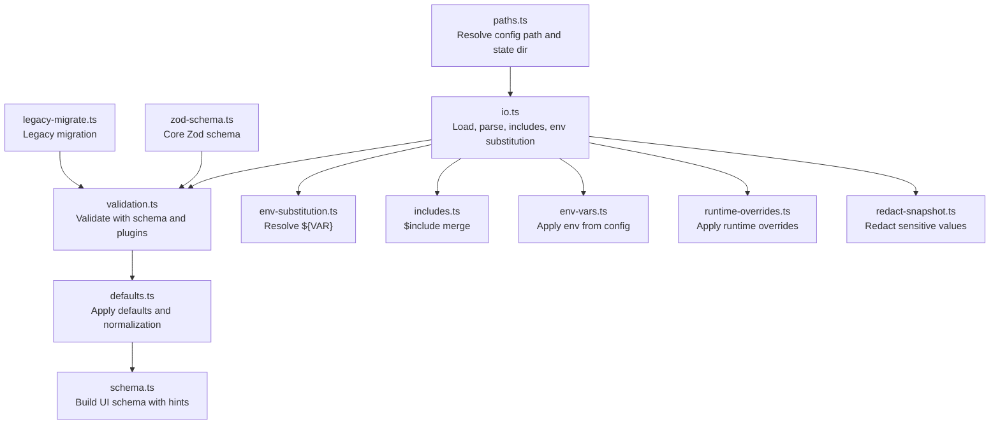
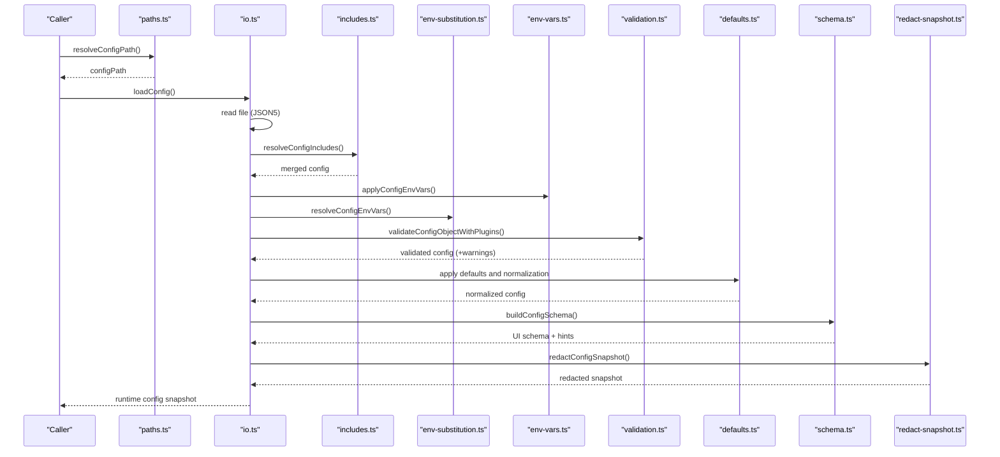
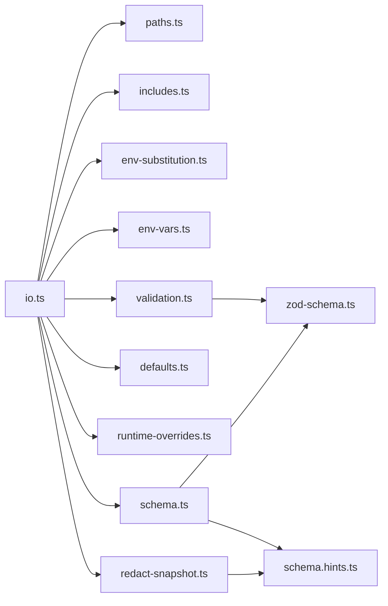

# Configuration Management

<cite>
**Referenced Files in This Document**
- [config.ts](file://src/config/config.ts)
- [io.ts](file://src/config/io.ts)
- [validation.ts](file://src/config/validation.ts)
- [schema.ts](file://src/config/schema.ts)
- [types.ts](file://src/config/types.ts)
- [types.openclaw.ts](file://src/config/types.openclaw.ts)
- [paths.ts](file://src/config/paths.ts)
- [includes.ts](file://src/config/includes.ts)
- [env-substitution.ts](file://src/config/env-substitution.ts)
- [env-vars.ts](file://src/config/env-vars.ts)
- [defaults.ts](file://src/config/defaults.ts)
- [runtime-overrides.ts](file://src/config/runtime-overrides.ts)
- [redact-snapshot.ts](file://src/config/redact-snapshot.ts)
- [zod-schema.ts](file://src/config/zod-schema.ts)
- [legacy-migrate.ts](file://src/config/legacy-migrate.ts)
- [schema.hints.ts](file://src/config/schema.hints.ts)
</cite>

## Table of Contents
1. [Introduction](#introduction)
2. [Project Structure](#project-structure)
3. [Core Components](#core-components)
4. [Architecture Overview](#architecture-overview)
5. [Detailed Component Analysis](#detailed-component-analysis)
6. [Dependency Analysis](#dependency-analysis)
7. [Performance Considerations](#performance-considerations)
8. [Troubleshooting Guide](#troubleshooting-guide)
9. [Conclusion](#con conclusion)
10. [Appendices](#appendices)

## Introduction
This document explains OpenClaw’s hierarchical configuration system and schema validation. It covers how configuration is discovered, loaded, validated, defaulted, and transformed; how environment variables integrate; how sensitive data is handled; and how hot-reloading and migration work. It also provides practical guidance for organizing configuration across environments, writing secure and maintainable config, and troubleshooting common issues.

## Project Structure
OpenClaw’s configuration system is implemented primarily under src/config. Key areas:
- Loading and IO: reading, parsing, merging includes, environment substitution, and writing back
- Validation: Zod-based schema validation plus plugin-aware checks and legacy migrations
- Defaults: automatic normalization and defaulting of models, agents, logging, and other subsystems
- Schema and hints: generating UI-friendly schemas with sensitivity tagging and derived metadata
- Security: redaction of sensitive values in snapshots and round-trips
- Paths and precedence: resolving config file locations and precedence across legacy/new directories
- Runtime overrides: temporary in-memory overrides for testing and dynamic tuning

```mermaid
graph TB
A["paths.ts<br/>Resolve config path and state dir"] --> B["io.ts<br/>Load, parse, includes, env substitution"]
B --> C["validation.ts<br/>Validate with schema and plugins"]
C --> D["defaults.ts<br/>Apply defaults and normalization"]
D --> E["schema.ts<br/>Build UI schema with hints"]
B --> F["env-substitution.ts<br/>Resolve ${VAR}"]
B --> G["includes.ts<br/>$include merge"]
B --> H["env-vars.ts<br/>Apply env from config"]
B --> I["runtime-overrides.ts<br/>Apply runtime overrides"]
B --> J["redact-snapshot.ts<br/>Redact sensitive values"]
K["zod-schema.ts<br/>Core Zod schema"] --> C
L["legacy-migrate.ts<br/>Legacy migration"] --> C
```

**Diagram sources**
- [paths.ts:106-182](file://src/config/paths.ts#L106-L182)
- [io.ts:725-800](file://src/config/io.ts#L725-L800)
- [validation.ts:229-286](file://src/config/validation.ts#L229-L286)
- [defaults.ts:213-347](file://src/config/defaults.ts#L213-L347)
- [schema.ts:449-484](file://src/config/schema.ts#L449-L484)
- [env-substitution.ts:197-203](file://src/config/env-substitution.ts#L197-L203)
- [includes.ts:340-347](file://src/config/includes.ts#L340-L347)
- [env-vars.ts:79-97](file://src/config/env-vars.ts#L79-L97)
- [runtime-overrides.ts:86-91](file://src/config/runtime-overrides.ts#L86-L91)
- [redact-snapshot.ts:382-431](file://src/config/redact-snapshot.ts#L382-L431)
- [zod-schema.ts:206-800](file://src/config/zod-schema.ts#L206-L800)
- [legacy-migrate.ts:5-19](file://src/config/legacy-migrate.ts#L5-L19)

**Section sources**
- [paths.ts:106-182](file://src/config/paths.ts#L106-L182)
- [io.ts:725-800](file://src/config/io.ts#L725-L800)
- [validation.ts:229-286](file://src/config/validation.ts#L229-L286)
- [defaults.ts:213-347](file://src/config/defaults.ts#L213-L347)
- [schema.ts:449-484](file://src/config/schema.ts#L449-L484)
- [env-substitution.ts:197-203](file://src/config/env-substitution.ts#L197-L203)
- [includes.ts:340-347](file://src/config/includes.ts#L340-L347)
- [env-vars.ts:79-97](file://src/config/env-vars.ts#L79-L97)
- [runtime-overrides.ts:86-91](file://src/config/runtime-overrides.ts#L86-L91)
- [redact-snapshot.ts:382-431](file://src/config/redact-snapshot.ts#L382-L431)
- [zod-schema.ts:206-800](file://src/config/zod-schema.ts#L206-L800)
- [legacy-migrate.ts:5-19](file://src/config/legacy-migrate.ts#L5-L19)

## Core Components
- Configuration loader and writer: reads JSON5, resolves includes, applies env substitution, validates, normalizes, and writes back safely with backups and audit logging.
- Schema and validation: Zod schema plus plugin-aware validation and legacy migration.
- Defaults and normalization: applies sensible defaults for models, agents, logging, and other subsystems.
- Environment integration: inline env from config and optional shell environment import; supports ${VAR} substitution with warnings for missing values.
- Security: redacts sensitive values in snapshots and round-trips; preserves hash for identity tracking.
- Hot-reload support: runtime overrides and snapshot refresh handlers; write audit trail for suspicious changes.
- Paths and precedence: resolves canonical and candidate paths across legacy and new state directories.

**Section sources**
- [io.ts:725-800](file://src/config/io.ts#L725-L800)
- [validation.ts:229-286](file://src/config/validation.ts#L229-L286)
- [defaults.ts:213-347](file://src/config/defaults.ts#L213-L347)
- [env-substitution.ts:197-203](file://src/config/env-substitution.ts#L197-L203)
- [env-vars.ts:79-97](file://src/config/env-vars.ts#L79-L97)
- [redact-snapshot.ts:382-431](file://src/config/redact-snapshot.ts#L382-L431)
- [paths.ts:106-182](file://src/config/paths.ts#L106-L182)
- [runtime-overrides.ts:86-91](file://src/config/runtime-overrides.ts#L86-L91)

## Architecture Overview
The configuration lifecycle:
1. Resolve active config path (with precedence across legacy/new directories).
2. Load JSON5, parse, and resolve $include directives.
3. Optionally import missing secrets from a login shell environment.
4. Apply env from config (only if not already present) and resolve ${VAR} placeholders.
5. Validate against Zod schema and plugin manifests.
6. Apply defaults and normalization.
7. Build UI schema with hints and sensitivity tagging.
8. Optionally apply runtime overrides.
9. Persist changes with backups and audit logging; redact sensitive values in snapshots.

```mermaid
sequenceDiagram
participant CLI as "Caller"
participant Paths as "paths.ts"
participant IO as "io.ts"
participant Includes as "includes.ts"
participant EnvSub as "env-substitution.ts"
participant EnvVars as "env-vars.ts"
participant Valid as "validation.ts"
participant Def as "defaults.ts"
participant Schema as "schema.ts"
participant Snap as "redact-snapshot.ts"
CLI->>Paths : resolveConfigPath()
Paths-->>CLI : configPath
CLI->>IO : loadConfig()
IO->>IO : read file (JSON5)
IO->>Includes : resolveConfigIncludes()
Includes-->>IO : merged config
IO->>EnvVars : applyConfigEnvVars()
IO->>EnvSub : resolveConfigEnvVars()
IO->>Valid : validateConfigObjectWithPlugins()
Valid-->>IO : validated config (+warnings)
IO->>Def : apply defaults and normalization
Def-->>IO : normalized config
IO->>Schema : buildConfigSchema()
Schema-->>IO : UI schema + hints
IO->>Snap : redactConfigSnapshot()
Snap-->>IO : redacted snapshot
IO-->>CLI : runtime config snapshot
```

**Diagram sources**
- [paths.ts:106-182](file://src/config/paths.ts#L106-L182)
- [io.ts:725-800](file://src/config/io.ts#L725-L800)
- [includes.ts:340-347](file://src/config/includes.ts#L340-L347)
- [env-substitution.ts:197-203](file://src/config/env-substitution.ts#L197-L203)
- [env-vars.ts:79-97](file://src/config/env-vars.ts#L79-L97)
- [validation.ts:300-312](file://src/config/validation.ts#L300-L312)
- [defaults.ts:213-347](file://src/config/defaults.ts#L213-L347)
- [schema.ts:449-484](file://src/config/schema.ts#L449-L484)
- [redact-snapshot.ts:382-431](file://src/config/redact-snapshot.ts#L382-L431)

## Detailed Component Analysis

### Configuration Loading and Precedence
- Canonical path resolution: supports OPENCLAW_CONFIG_PATH and CLAWDBOT_CONFIG_PATH overrides; otherwise defaults to ~/.openclaw/openclaw.json or legacy state directories.
- Candidate resolution: tries multiple legacy/new combinations and prefers existing files.
- State directory resolution: supports OPENCLAW_STATE_DIR and CLAWDBOT_STATE_DIR; detects legacy directories (.clawdbot, .moldbot, .moltbot) and migrates to .openclaw automatically.

Practical tips:
- Prefer OPENCLAW_STATE_DIR to colocate config/state per environment.
- Use OPENCLAW_CONFIG_PATH to point to a shared config file across machines.

**Section sources**
- [paths.ts:106-182](file://src/config/paths.ts#L106-L182)
- [paths.ts:188-212](file://src/config/paths.ts#L188-L212)

### Includes and Modular Configuration
- $include supports single file or array of files; merges recursively with arrays concatenated and objects merged.
- Security: enforces maximum depth, rejects escaping the root directory, and guards file sizes and types.
- Circular include detection prevents infinite loops.

Common patterns:
- Split base/common config from environment-specific overlays.
- Use arrays to compose multiple modular files (e.g., providers, channels).

**Section sources**
- [includes.ts:1-347](file://src/config/includes.ts#L1-L347)

### Environment Variable Integration
- Inline env from config: env.vars and top-level env keys are applied to process.env only if not already present.
- Shell import: optional login shell environment import for missing secrets; controlled by env.shellEnv.enabled and timeoutMs.
- ${VAR} substitution: resolves ${VAR} placeholders; missing vars can emit warnings instead of failing.
- Blocked keys: dangerous host env var names are filtered out to prevent overriding critical process settings.

Security note:
- Values containing unresolved ${VAR} placeholders are skipped during inline env application to avoid injecting literal placeholders into process.env.

**Section sources**
- [env-vars.ts:79-97](file://src/config/env-vars.ts#L79-L97)
- [env-substitution.ts:197-203](file://src/config/env-substitution.ts#L197-L203)
- [io.ts:738-746](file://src/config/io.ts#L738-L746)

### Schema Validation and Plugin-Aware Checks
- Zod schema: comprehensive validation of the entire configuration tree.
- Plugin-aware validation: loads plugin manifests, normalizes plugin entries, and validates plugin-specific config schemas.
- Legacy migration: detects and migrates legacy constructs; post-migration validation ensures correctness.
- Warnings: collects non-fatal issues (e.g., unknown channels, heartbeat targets) alongside fatal ones.

Validation flow:
- Raw validation (no defaults).
- Apply defaults and re-validate.
- Plugin manifest load and per-plugin schema validation.
- Collect warnings for stale or incompatible plugin entries.

**Section sources**
- [validation.ts:229-286](file://src/config/validation.ts#L229-L286)
- [validation.ts:300-312](file://src/config/validation.ts#L300-L312)
- [legacy-migrate.ts:5-19](file://src/config/legacy-migrate.ts#L5-L19)
- [zod-schema.ts:206-800](file://src/config/zod-schema.ts#L206-L800)

### Defaults and Normalization
- Models: default provider APIs, cost, input types, context/window/max tokens, and alias normalization.
- Agents: default concurrency caps and heartbeat/context pruning defaults based on auth mode.
- Logging: default redaction policy for tools.
- Talk: normalize provider selection and API key fallback.

Defaults are applied after validation to ensure correctness and avoid leaking runtime defaults into persisted files.

**Section sources**
- [defaults.ts:213-347](file://src/config/defaults.ts#L213-L347)
- [defaults.ts:349-388](file://src/config/defaults.ts#L349-L388)
- [defaults.ts:390-405](file://src/config/defaults.ts#L390-L405)
- [defaults.ts:407-507](file://src/config/defaults.ts#L407-L507)

### Schema Generation and UI Hints
- Base schema: generated from Zod schema with draft-07 target and unrepresentable types mapped to “any”.
- Extension hints: merges plugin/channel-specific schemas and UI hints; marks sensitive fields and adds labels/help.
- Lookup: resolves child schemas and hints for UI forms and editors.

**Section sources**
- [schema.ts:429-447](file://src/config/schema.ts#L429-L447)
- [schema.ts:449-484](file://src/config/schema.ts#L449-L484)
- [schema.ts:678-711](file://src/config/schema.ts#L678-L711)
- [schema.hints.ts:125-147](file://src/config/schema.hints.ts#L125-L147)

### Security and Sensitive Data Handling
- Redaction: replaces sensitive values with a sentinel in both parsed and raw JSON5; restores originals during write to avoid credential loss.
- URL userinfo stripping: removes credentials embedded in URLs for display and logs.
- Audit trail: writes config write events with suspicious change indicators (e.g., size drops, missing meta, gateway mode removal).
- Hashing: computes SHA-256 over raw config for identity tracking.

Operational guidance:
- Never commit raw credentials; rely on redaction and env substitution.
- Use SecretRef-style structures for external secret stores when applicable.

**Section sources**
- [redact-snapshot.ts:382-431](file://src/config/redact-snapshot.ts#L382-L431)
- [redact-snapshot.ts:447-481](file://src/config/redact-snapshot.ts#L447-L481)
- [io.ts:567-581](file://src/config/io.ts#L567-L581)
- [io.ts:322-336](file://src/config/io.ts#L322-L336)

### Hot-Reloading and Runtime Overrides
- Runtime overrides: in-memory overrides applied over the loaded config; useful for testing and dynamic tuning.
- Snapshot refresh handler: allows external systems to refresh runtime snapshots and handle failures gracefully.
- Write audit: captures write events with process context and suspicious indicators.

Hot-reload patterns:
- Use runtime overrides for temporary changes during development.
- For production, prefer writing to disk and restarting or using a dedicated refresh handler.

**Section sources**
- [runtime-overrides.ts:86-91](file://src/config/runtime-overrides.ts#L86-L91)
- [io.ts:144-151](file://src/config/io.ts#L144-L151)
- [io.ts:567-581](file://src/config/io.ts#L567-L581)

### Migration and Backwards Compatibility
- Legacy detection and migration: identifies legacy constructs and transforms them into modern equivalents.
- Post-migration validation: ensures migrated config passes current validation; reports remaining issues.
- Version stamping: records last touched version/time to detect future configs.

Migration guidance:
- Run migration before validating; address reported issues manually if validation fails after migration.

**Section sources**
- [legacy-migrate.ts:5-19](file://src/config/legacy-migrate.ts#L5-L19)
- [io.ts:607-617](file://src/config/io.ts#L607-L617)

### Practical Configuration Scenarios and Patterns
- Multi-environment composition:
  - Base config in ~/.openclaw/openclaw.json
  - Environment overlay via $include: ["./providers.json", "./channels.json"]
  - Secrets via ${VAR} placeholders or inline env from config
- Plugin-specific config:
  - Define plugin entries under plugins.entries.<id> with plugin-specific config schemas
  - Use plugins.allow/deny and slots to control activation
- Channel-specific config:
  - Define per-channel sections under channels.<id> with channel-specific schemas
- Gateway modes and TLS:
  - Configure gateway.bind, gateway.mode, and gateway.tls according to deployment needs
- Logging and diagnostics:
  - Tune logging.level and logging.redactSensitive
  - Enable diagnostics flags for troubleshooting

[No sources needed since this section aggregates patterns without quoting specific code]

## Dependency Analysis
The configuration system exhibits strong modularity with clear boundaries:
- io.ts depends on paths.ts, includes.ts, env-substitution.ts, env-vars.ts, validation.ts, defaults.ts, runtime-overrides.ts, redact-snapshot.ts, and schema.ts.
- validation.ts depends on zod-schema.ts, plugin registry, and legacy detection.
- schema.ts depends on zod-schema.ts and schema.hints.ts.
- redact-snapshot.ts depends on schema.hints.ts and URL/userinfo utilities.

```mermaid
graph LR
IO["io.ts"] --> P["paths.ts"]
IO --> INC["includes.ts"]
IO --> EVS["env-substitution.ts"]
IO --> EV["env-vars.ts"]
IO --> VAL["validation.ts"]
IO --> DEF["defaults.ts"]
IO --> RO["runtime-overrides.ts"]
IO --> RS["redact-snapshot.ts"]
IO --> SCH["schema.ts"]
VAL --> ZS["zod-schema.ts"]
SCH --> ZS
SCH --> SH["schema.hints.ts"]
RS --> SH
```

**Diagram sources**
- [io.ts:725-800](file://src/config/io.ts#L725-L800)
- [paths.ts:106-182](file://src/config/paths.ts#L106-L182)
- [includes.ts:340-347](file://src/config/includes.ts#L340-L347)
- [env-substitution.ts:197-203](file://src/config/env-substitution.ts#L197-L203)
- [env-vars.ts:79-97](file://src/config/env-vars.ts#L79-L97)
- [validation.ts:229-286](file://src/config/validation.ts#L229-L286)
- [defaults.ts:213-347](file://src/config/defaults.ts#L213-L347)
- [runtime-overrides.ts:86-91](file://src/config/runtime-overrides.ts#L86-L91)
- [redact-snapshot.ts:382-431](file://src/config/redact-snapshot.ts#L382-L431)
- [schema.ts:449-484](file://src/config/schema.ts#L449-L484)
- [zod-schema.ts:206-800](file://src/config/zod-schema.ts#L206-L800)
- [schema.hints.ts:125-147](file://src/config/schema.hints.ts#L125-L147)

**Section sources**
- [io.ts:725-800](file://src/config/io.ts#L725-L800)
- [validation.ts:229-286](file://src/config/validation.ts#L229-L286)
- [schema.ts:449-484](file://src/config/schema.ts#L449-L484)

## Performance Considerations
- Include depth and file size limits prevent excessive memory and I/O overhead.
- Structured redaction avoids expensive regex scans on large raw strings by leveraging UI hints.
- Schema caching: merged schema responses are cached with a bounded size to reduce recomputation.
- Defaults are applied once after validation to minimize repeated transformations.

[No sources needed since this section provides general guidance]

## Troubleshooting Guide
Common issues and resolutions:
- Invalid config errors:
  - Review validation issues and allowed values hints; fix schema mismatches.
  - Use config.set or config.patch to apply corrections without losing credentials.
- Missing environment variables:
  - Ensure ${VAR} placeholders are set or use env.shellEnv.enabled to import from a login shell.
  - Use env.vars to inject missing values only if not already present in process env.
- Sensitive data exposure:
  - Rely on redaction in UI responses; avoid printing raw config.
  - Verify audit logs for suspicious write events.
- Legacy configuration:
  - Run migration to convert legacy constructs; review reported changes.
- Plugin config errors:
  - Confirm plugin IDs exist and schemas are present; check warnings for missing or stale entries.
- Hot-reload not taking effect:
  - Apply runtime overrides for temporary changes; for persistent changes, write to disk and trigger refresh.

**Section sources**
- [validation.ts:117-140](file://src/config/validation.ts#L117-L140)
- [env-substitution.ts:29-37](file://src/config/env-substitution.ts#L29-L37)
- [env-vars.ts:79-97](file://src/config/env-vars.ts#L79-L97)
- [redact-snapshot.ts:382-431](file://src/config/redact-snapshot.ts#L382-L431)
- [legacy-migrate.ts:5-19](file://src/config/legacy-migrate.ts#L5-L19)
- [io.ts:567-581](file://src/config/io.ts#L567-L581)

## Conclusion
OpenClaw’s configuration system combines a robust JSON5 loader, powerful include composition, strict schema validation, and comprehensive defaults to deliver a secure, extensible, and maintainable configuration experience. By leveraging environment integration, sensitive data redaction, and hot-reload capabilities, teams can manage complex deployments across diverse environments while maintaining safety and operability.

[No sources needed since this section summarizes without analyzing specific files]

## Appendices

### Configuration Keys Reference (Selected)
- meta.lastTouchedVersion, lastTouchedAt: version/time stamps for config provenance
- env.shellEnv.enabled, env.shellEnv.timeoutMs, env.vars: inline env and optional shell import
- wizard.*: wizard run metadata
- diagnostics.enabled, diagnostics.flags, diagnostics.stuckSessionWarnMs, diagnostics.otel.*, diagnostics.cacheTrace.*: diagnostics controls
- logging.level, logging.file, logging.maxFileBytes, logging.consoleLevel, logging.consoleStyle, logging.redactSensitive, logging.redactPatterns: logging configuration
- update.channel, update.checkOnStart, update.auto.*: update policy
- browser.*, ui.*, secrets.*, skills.*, plugins.*, models.*, nodeHost.*, agents.*, tools.*, bindings.*, audio.*, media.*, messages.*, commands.*, approvals.*, session.*, web.*, channels.*, cron.*, hooks.*, discovery.*, canvasHost.*, talk.*, gateway.*, memory.*: subsystem-specific configuration

**Section sources**
- [types.openclaw.ts:31-123](file://src/config/types.openclaw.ts#L31-L123)
- [zod-schema.ts:206-800](file://src/config/zod-schema.ts#L206-L800)

### Environment Variables and Precedence
- OPENCLAW_CONFIG_PATH, CLAWDBOT_CONFIG_PATH: explicit config path override
- OPENCLAW_STATE_DIR, CLAWDBOT_STATE_DIR: state directory override
- OPENCLAW_GATEWAY_PORT, CLAWDBOT_GATEWAY_PORT: gateway port override
- OPENCLAW_OAUTH_DIR: OAuth credentials directory override
- OPENCLAW_NIX_MODE=1: Nix mode detection (read-only config management)
- Inline env from config: env.vars and top-level env keys applied only if not already present

**Section sources**
- [paths.ts:106-182](file://src/config/paths.ts#L106-L182)
- [env-vars.ts:79-97](file://src/config/env-vars.ts#L79-L97)

### Template Usage and Advanced Patterns
- Modular composition: split base and environment overlays using $include arrays
- Secrets management: prefer ${VAR} placeholders and env.shellEnv.enabled for dynamic injection
- Plugin/channel extension: define plugin/channel-specific schemas and UI hints via schema builder
- Runtime tuning: use runtime overrides for temporary adjustments; persist via config.set/patch for permanent changes

**Section sources**
- [includes.ts:340-347](file://src/config/includes.ts#L340-L347)
- [env-substitution.ts:197-203](file://src/config/env-substitution.ts#L197-L203)
- [schema.ts:449-484](file://src/config/schema.ts#L449-L484)
- [runtime-overrides.ts:86-91](file://src/config/runtime-overrides.ts#L86-L91)