# Configuration Validation

<cite>
**Referenced Files in This Document**
- [validation.ts](file://src/config/validation.ts)
- [schema.ts](file://src/config/schema.ts)
- [zod-schema.ts](file://src/config/zod-schema.ts)
- [issue-format.ts](file://src/config/issue-format.ts)
- [allowed-values.ts](file://src/config/allowed-values.ts)
- [defaults.ts](file://src/config/defaults.ts)
- [legacy.ts](file://src/config/legacy.ts)
- [config-validation.ts](file://src/commands/config-validation.ts)
- [validation.ts](file://src/gateway/server-methods/validation.ts)
- [types.ts](file://src/config/types.ts)
</cite>

## Table of Contents
1. [Introduction](#introduction)
2. [Project Structure](#project-structure)
3. [Core Components](#core-components)
4. [Architecture Overview](#architecture-overview)
5. [Detailed Component Analysis](#detailed-component-analysis)
6. [Dependency Analysis](#dependency-analysis)
7. [Performance Considerations](#performance-considerations)
8. [Troubleshooting Guide](#troubleshooting-guide)
9. [Conclusion](#conclusion)
10. [Appendices](#appendices)

## Introduction
This document explains OpenClaw’s configuration validation system comprehensively. It covers static validation via Zod schemas, runtime validation with custom checks, type safety, schema generation and UI hints, error reporting, and diagnostic formatting. It also documents extension points for plugins and channels, validation performance characteristics, and integration patterns for local development and CI/CD.

## Project Structure
The configuration validation system spans several modules:
- Static schema definition and JSON Schema generation
- Runtime validation and custom checks
- Error formatting and allowed-values hints
- Defaults application and legacy compatibility
- CLI and gateway integration points

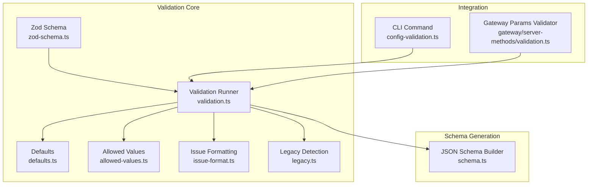

**Diagram sources**
- [zod-schema.ts](file://src/config/zod-schema.ts#L1-L911)
- [validation.ts](file://src/config/validation.ts#L1-L605)
- [defaults.ts](file://src/config/defaults.ts#L1-L537)
- [allowed-values.ts](file://src/config/allowed-values.ts#L1-L99)
- [issue-format.ts](file://src/config/issue-format.ts#L1-L69)
- [legacy.ts](file://src/config/legacy.ts#L1-L59)
- [schema.ts](file://src/config/schema.ts#L1-L712)
- [config-validation.ts](file://src/commands/config-validation.ts#L1-L22)
- [validation.ts](file://src/gateway/server-methods/validation.ts#L1-L28)

**Section sources**
- [validation.ts](file://src/config/validation.ts#L1-L605)
- [schema.ts](file://src/config/schema.ts#L1-L712)
- [zod-schema.ts](file://src/config/zod-schema.ts#L1-L911)
- [issue-format.ts](file://src/config/issue-format.ts#L1-L69)
- [allowed-values.ts](file://src/config/allowed-values.ts#L1-L99)
- [defaults.ts](file://src/config/defaults.ts#L1-L537)
- [legacy.ts](file://src/config/legacy.ts#L1-L59)
- [config-validation.ts](file://src/commands/config-validation.ts#L1-L22)
- [validation.ts](file://src/gateway/server-methods/validation.ts#L1-L28)

## Core Components
- Zod schema definitions: Centralized, composable schema for static validation.
- Validation runner: Applies Zod parsing, collects custom checks, and merges plugin/channel schemas.
- Defaults application: Applies runtime defaults and normalization.
- Schema generation: Produces JSON Schema and UI hints for forms and editors.
- Error formatting: Normalizes and formats validation issues for CLI and UI.
- Allowed values hints: Summarizes and appends allowed value lists to error messages.
- Legacy detection: Identifies deprecated or incompatible configurations.
- CLI and gateway integration: Enforces validation before operation and on protocol parameters.

**Section sources**
- [zod-schema.ts](file://src/config/zod-schema.ts#L1-L911)
- [validation.ts](file://src/config/validation.ts#L229-L286)
- [defaults.ts](file://src/config/defaults.ts#L146-L388)
- [schema.ts](file://src/config/schema.ts#L429-L484)
- [issue-format.ts](file://src/config/issue-format.ts#L13-L69)
- [allowed-values.ts](file://src/config/allowed-values.ts#L54-L99)
- [legacy.ts](file://src/config/legacy.ts#L16-L59)
- [config-validation.ts](file://src/commands/config-validation.ts#L6-L21)
- [validation.ts](file://src/gateway/server-methods/validation.ts#L9-L27)

## Architecture Overview
The validation pipeline proceeds in stages:
1. Legacy compatibility checks
2. Zod static parsing
3. Duplicate and identity/avatar policy checks
4. Gateway/Tailscale binding rules
5. Optional defaults application
6. Plugin and channel-specific validation
7. Error aggregation and formatting

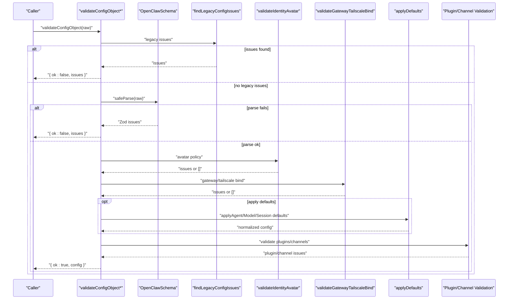

**Diagram sources**
- [validation.ts](file://src/config/validation.ts#L229-L286)
- [zod-schema.ts](file://src/config/zod-schema.ts#L206-L204)
- [validation.ts](file://src/config/validation.ts#L148-L223)
- [defaults.ts](file://src/config/defaults.ts#L213-L388)
- [validation.ts](file://src/config/validation.ts#L308-L604)

## Detailed Component Analysis

### Static Validation with Zod Schemas
- The central schema is composed from modular pieces covering agents, models, sessions, tools, channels, and more.
- Super-refinements enforce cross-field constraints (e.g., talk provider selection).
- Sensitive fields are annotated for downstream redaction and UI treatment.

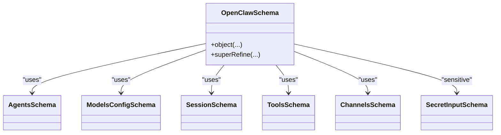

**Diagram sources**
- [zod-schema.ts](file://src/config/zod-schema.ts#L1-L911)

**Section sources**
- [zod-schema.ts](file://src/config/zod-schema.ts#L1-L911)

### Runtime Validation and Custom Checks
- Duplicate agent directories are detected and reported.
- Identity avatar policy enforces allowed formats and workspace boundaries.
- Gateway/Tailscale bind rules ensure loopback-only binding when external serving is enabled.
- Heartbeat target validation supports canonical channel IDs and plugin-provided channels.

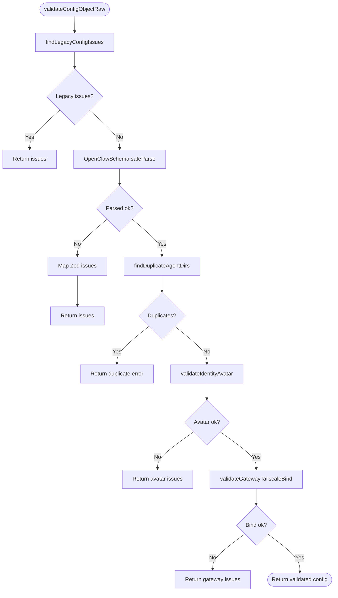

**Diagram sources**
- [validation.ts](file://src/config/validation.ts#L229-L273)
- [validation.ts](file://src/config/validation.ts#L148-L223)

**Section sources**
- [validation.ts](file://src/config/validation.ts#L229-L273)
- [validation.ts](file://src/config/validation.ts#L148-L196)
- [validation.ts](file://src/config/validation.ts#L198-L223)

### Defaults Application and Type Checking
- Defaults are applied in a deterministic order: session, agent, model, talk, logging, context pruning, compaction.
- Type checking leverages Zod’s strict parsing and super-refinements to ensure semantic correctness.
- Environment-driven defaults (e.g., Anthropic OAuth/API key modes) influence derived values.

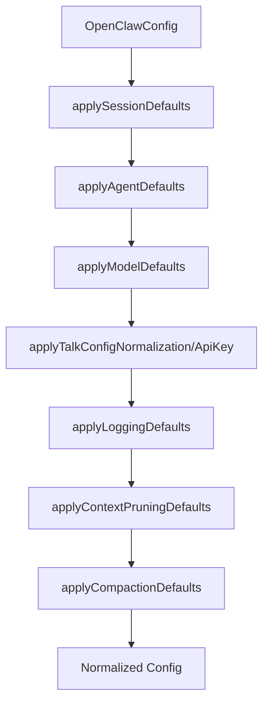

**Diagram sources**
- [defaults.ts](file://src/config/defaults.ts#L146-L532)

**Section sources**
- [defaults.ts](file://src/config/defaults.ts#L146-L532)

### Schema Generation and UI Hints
- JSON Schema is built from Zod and optionally merged with plugin/channel schemas.
- UI hints annotate labels, help text, placeholders, and sensitivity.
- Lookup utilities support dynamic form rendering and validation.

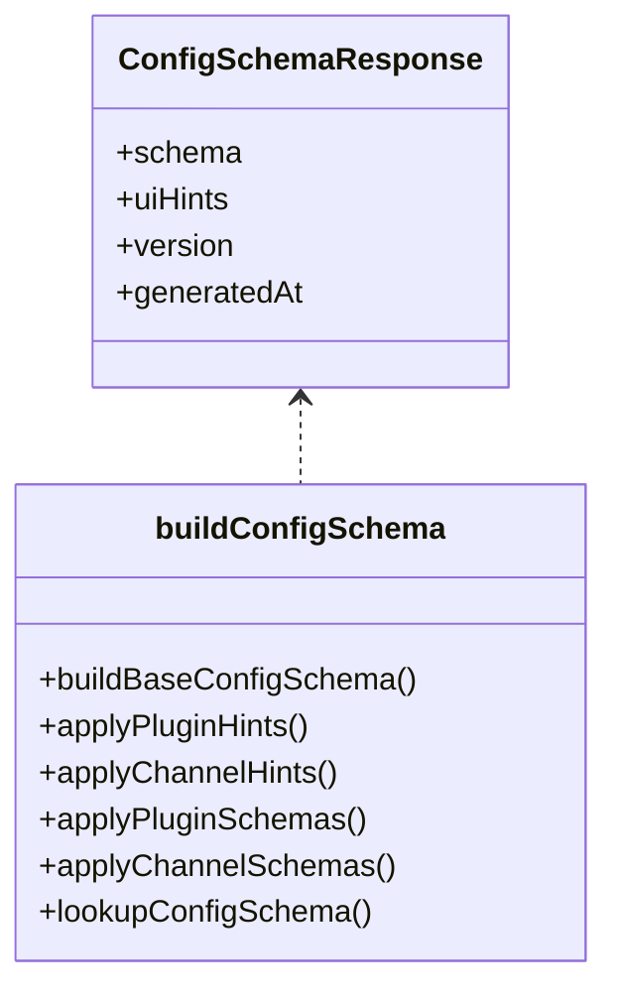

**Diagram sources**
- [schema.ts](file://src/config/schema.ts#L101-L124)
- [schema.ts](file://src/config/schema.ts#L429-L484)
- [schema.ts](file://src/config/schema.ts#L678-L712)

**Section sources**
- [schema.ts](file://src/config/schema.ts#L429-L484)
- [schema.ts](file://src/config/schema.ts#L678-L712)

### Error Reporting and Allowed Values Hints
- Issues are normalized and formatted with optional root path normalization.
- Allowed values are summarized and appended to messages when available, with truncation and deduplication.

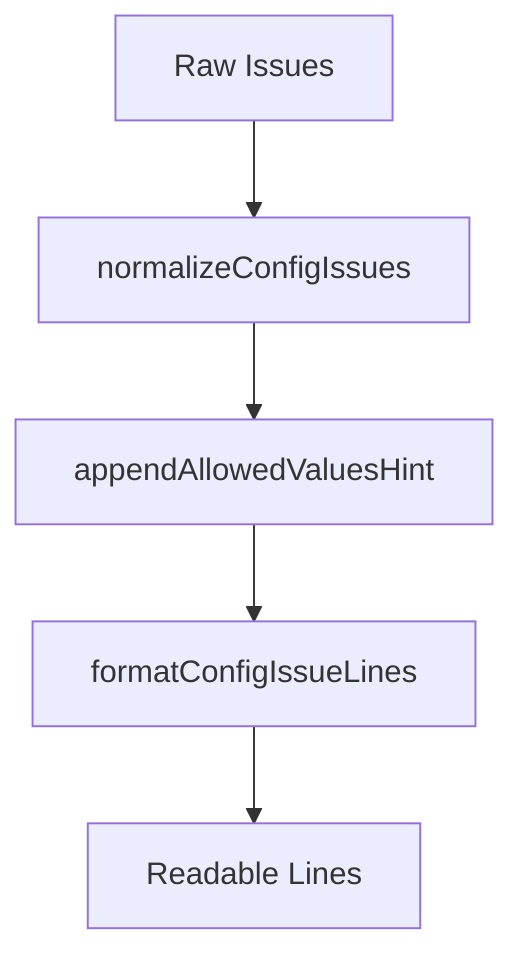

**Diagram sources**
- [issue-format.ts](file://src/config/issue-format.ts#L13-L69)
- [allowed-values.ts](file://src/config/allowed-values.ts#L54-L99)

**Section sources**
- [issue-format.ts](file://src/config/issue-format.ts#L13-L69)
- [allowed-values.ts](file://src/config/allowed-values.ts#L54-L99)

### Legacy Compatibility and Migration
- Legacy detection scans for deprecated keys and incompatible constructs.
- Migrations transform legacy structures into modern equivalents.

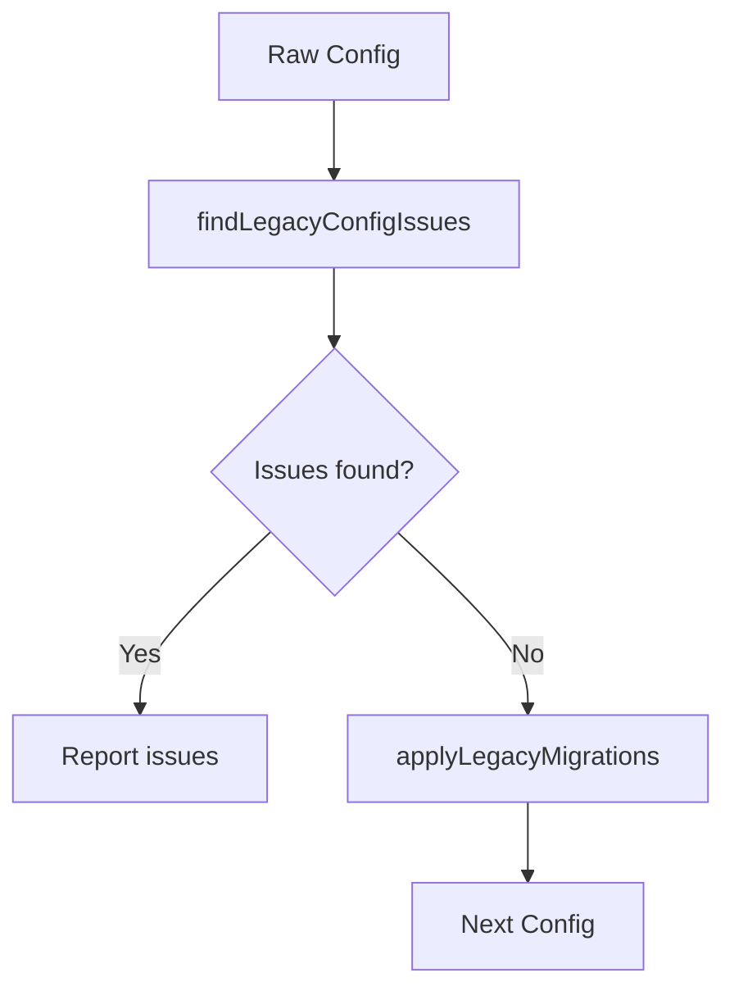

**Diagram sources**
- [legacy.ts](file://src/config/legacy.ts#L16-L59)

**Section sources**
- [legacy.ts](file://src/config/legacy.ts#L16-L59)

### CLI and Gateway Integration
- CLI requires a valid config snapshot before proceeding; invalid configs are reported with actionable guidance.
- Gateway validates method parameters and returns structured error responses.

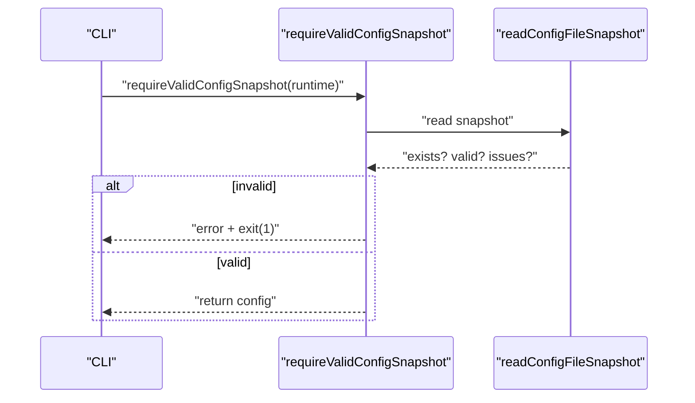

**Diagram sources**
- [config-validation.ts](file://src/commands/config-validation.ts#L6-L21)

**Section sources**
- [config-validation.ts](file://src/commands/config-validation.ts#L6-L21)

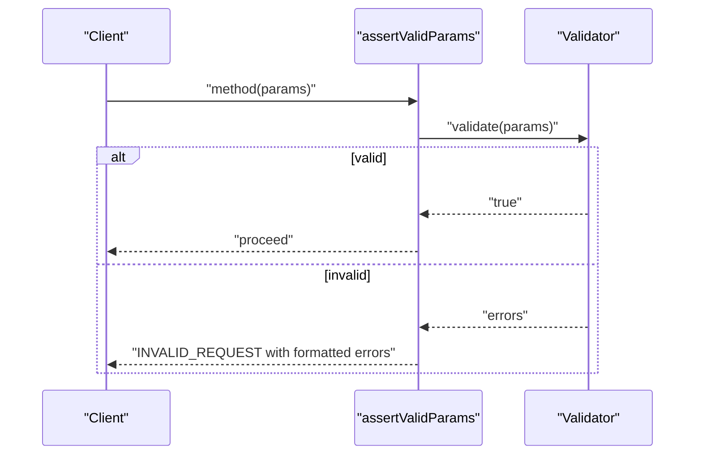

**Diagram sources**
- [validation.ts](file://src/gateway/server-methods/validation.ts#L9-L27)

**Section sources**
- [validation.ts](file://src/gateway/server-methods/validation.ts#L9-L27)

## Dependency Analysis
- Validation depends on Zod schemas for static checks and on plugin/channel registries for dynamic validation.
- Defaults application depends on environment variables and authentication profiles.
- Schema generation caches merged schemas to reduce overhead.

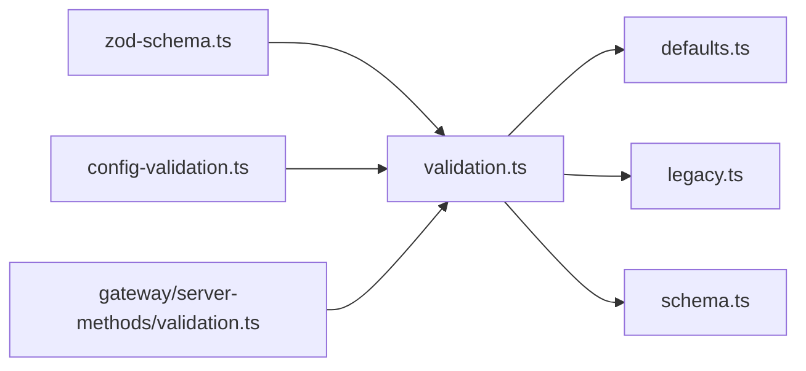

**Diagram sources**
- [validation.ts](file://src/config/validation.ts#L1-L605)
- [zod-schema.ts](file://src/config/zod-schema.ts#L1-L911)
- [defaults.ts](file://src/config/defaults.ts#L1-L537)
- [legacy.ts](file://src/config/legacy.ts#L1-L59)
- [schema.ts](file://src/config/schema.ts#L1-L712)
- [config-validation.ts](file://src/commands/config-validation.ts#L1-L22)
- [validation.ts](file://src/gateway/server-methods/validation.ts#L1-L28)

**Section sources**
- [validation.ts](file://src/config/validation.ts#L1-L605)
- [schema.ts](file://src/config/schema.ts#L352-L406)

## Performance Considerations
- Schema caching: Merged plugin/channel schemas are cached with a bounded size to avoid repeated computation.
- Lookup pruning: Only essential schema metadata is retained during lookups to minimize memory footprint.
- Early exits: Validation short-circuits upon encountering legacy issues or parse failures.
- Defaults are computed once per validation pass; consider batching operations in high-throughput scenarios.

[No sources needed since this section provides general guidance]

## Troubleshooting Guide
Common validation failures and resolutions:
- Invalid type or union mismatch
  - Symptom: Error indicates expected type or allowed values.
  - Resolution: Adjust the field to the expected type or select from the allowed values list appended to the message.
  - Reference: [allowed-values.ts](file://src/config/allowed-values.ts#L54-L99), [issue-format.ts](file://src/config/issue-format.ts#L51-L69)

- Duplicate agent directories
  - Symptom: Error on agents.list path indicating duplicates.
  - Resolution: Ensure each agent directory is unique; fix or remove duplicates.
  - Reference: [validation.ts](file://src/config/validation.ts#L249-L260)

- Identity avatar policy violation
  - Symptom: Error on identity.avatar path.
  - Resolution: Use workspace-relative path, http(s) URL, or data URI; avoid absolute or disallowed schemes.
  - Reference: [validation.ts](file://src/config/validation.ts#L148-L196)

- Gateway/Tailscale bind misconfiguration
  - Symptom: Error on gateway.bind path.
  - Resolution: Use loopback binding when tailscale serving/funnel is enabled; or specify custom loopback host.
  - Reference: [validation.ts](file://src/config/validation.ts#L198-L223)

- Unknown channel or heartbeat target
  - Symptom: Error referencing unknown channel id or heartbeat target.
  - Resolution: Use supported channel IDs or plugin-provided channel IDs; avoid empty targets except reserved values.
  - Reference: [validation.ts](file://src/config/validation.ts#L386-L455)

- Plugin not found or schema missing
  - Symptom: Error indicating plugin not found or missing schema.
  - Resolution: Remove stale entries, ensure plugin is installed, or provide a valid config schema.
  - Reference: [validation.ts](file://src/config/validation.ts#L467-L589)

- Legacy configuration detected
  - Symptom: Error indicating deprecated keys or incompatible constructs.
  - Resolution: Review and migrate to supported fields; rely on migrations where applicable.
  - Reference: [legacy.ts](file://src/config/legacy.ts#L16-L59)

- CLI invalid config snapshot
  - Symptom: CLI exits with validation errors and suggests running doctor.
  - Resolution: Fix reported issues; run the doctor command for diagnostics.
  - Reference: [config-validation.ts](file://src/commands/config-validation.ts#L6-L21)

**Section sources**
- [allowed-values.ts](file://src/config/allowed-values.ts#L54-L99)
- [issue-format.ts](file://src/config/issue-format.ts#L51-L69)
- [validation.ts](file://src/config/validation.ts#L249-L260)
- [validation.ts](file://src/config/validation.ts#L148-L196)
- [validation.ts](file://src/config/validation.ts#L198-L223)
- [validation.ts](file://src/config/validation.ts#L386-L455)
- [validation.ts](file://src/config/validation.ts#L467-L589)
- [legacy.ts](file://src/config/legacy.ts#L16-L59)
- [config-validation.ts](file://src/commands/config-validation.ts#L6-L21)

## Conclusion
OpenClaw’s configuration validation system combines robust static schema enforcement with targeted runtime checks, comprehensive error reporting, and extensible schema generation for plugins and channels. It balances correctness, usability, and performance while providing clear diagnostics and actionable guidance for users and CI/CD systems.

[No sources needed since this section summarizes without analyzing specific files]

## Appendices

### Extension Points
- Plugins: Provide configSchema and configUiHints; validation runs against plugin entries and warns on missing schemas.
- Channels: Provide channel configSchema; merged into the base schema for validation and UI.
- UI Hints: Labels, help text, placeholders, and sensitivity metadata are applied and cached.

**Section sources**
- [schema.ts](file://src/config/schema.ts#L167-L208)
- [schema.ts](file://src/config/schema.ts#L210-L241)
- [schema.ts](file://src/config/schema.ts#L285-L324)
- [schema.ts](file://src/config/schema.ts#L326-L350)
- [validation.ts](file://src/config/validation.ts#L567-L589)

### Validation in Different Environments
- Local development: Use CLI to validate snapshots; leverage doctor for diagnostics.
- CI/CD: Integrate config validation into pre-deploy steps; fail builds on validation errors and display formatted issues.
- Gateway: Validate method parameters; return structured error responses with formatted messages.

**Section sources**
- [config-validation.ts](file://src/commands/config-validation.ts#L6-L21)
- [validation.ts](file://src/gateway/server-methods/validation.ts#L9-L27)