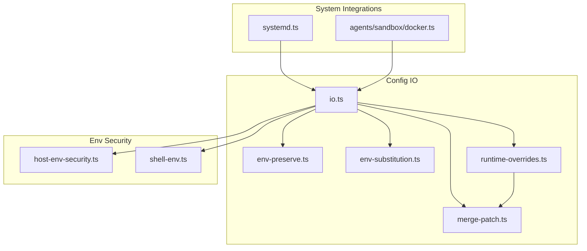
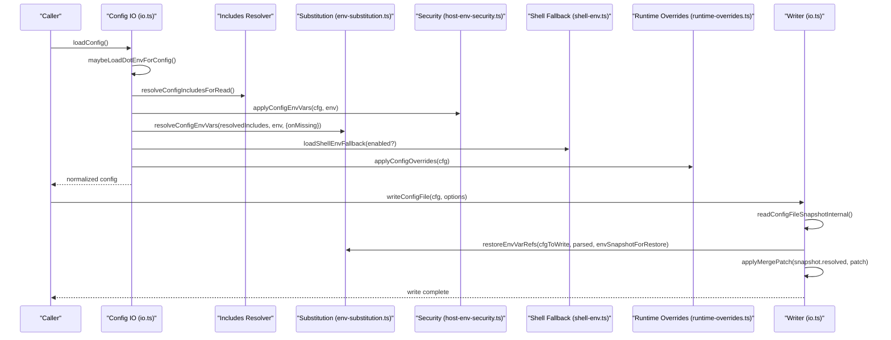
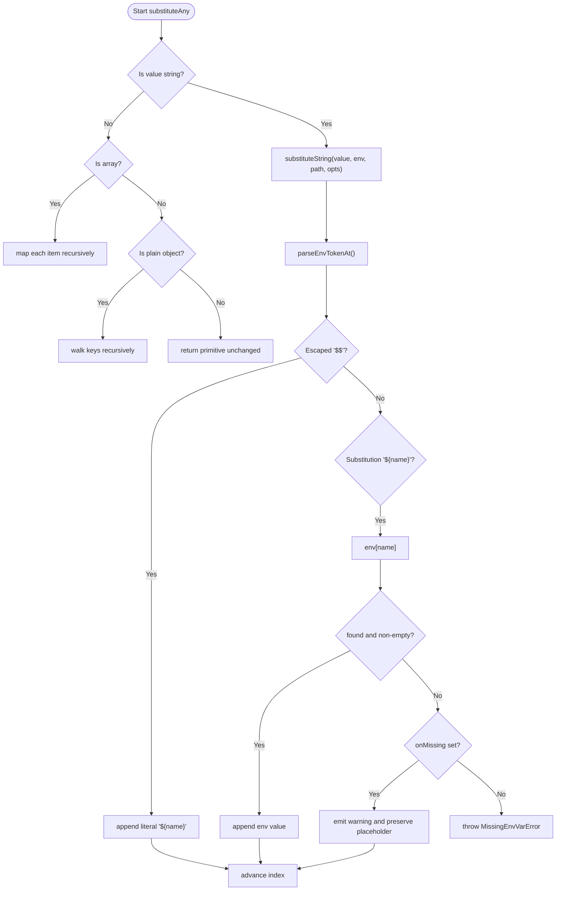
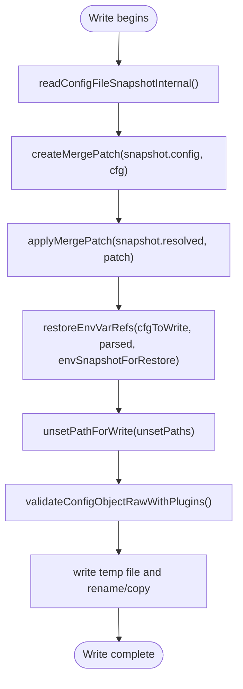
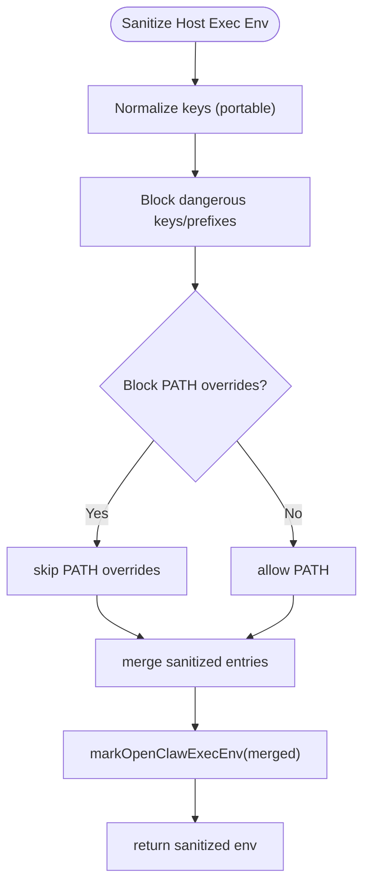
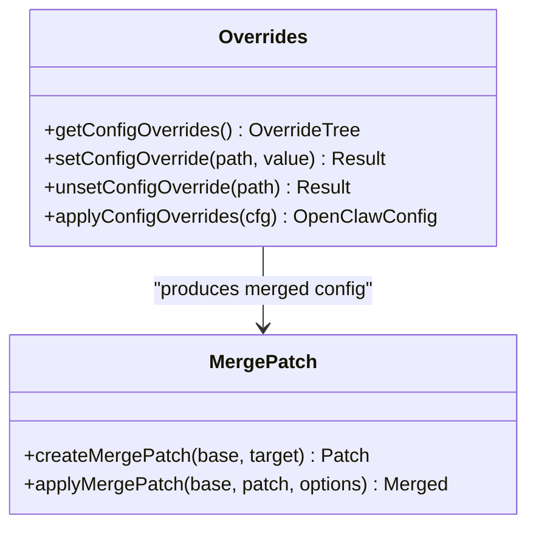
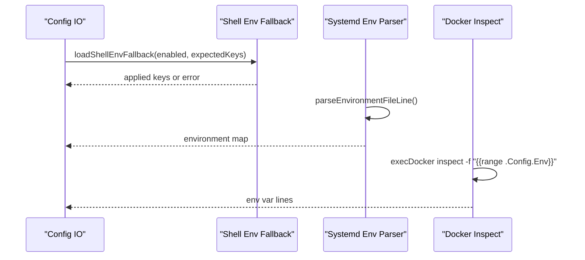
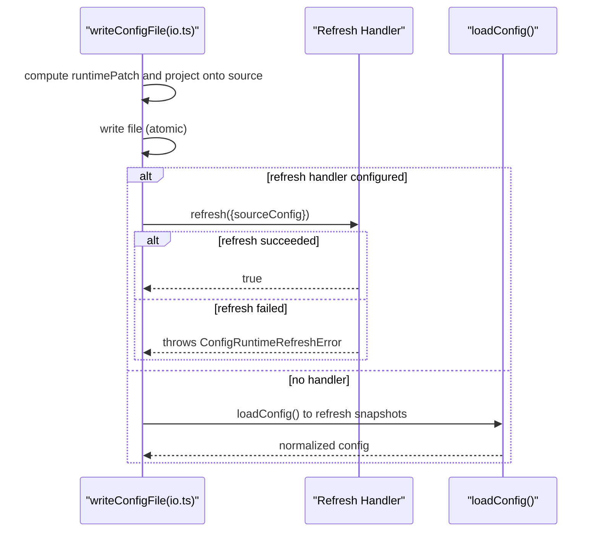
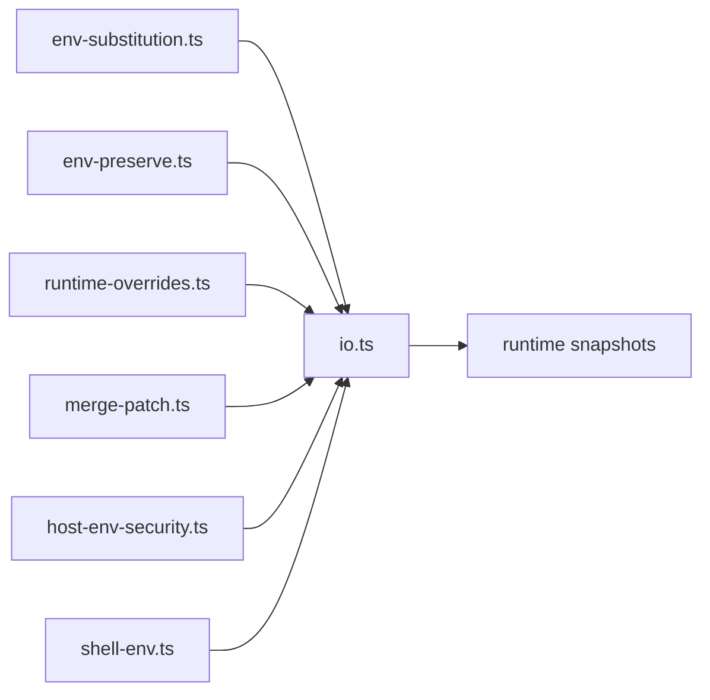

# Environment Integration

<cite>
**Referenced Files in This Document**
- [env-substitution.ts](file://src/config/env-substitution.ts)
- [env-preserve.ts](file://src/config/env-preserve.ts)
- [env-vars.ts](file://src/config/env-vars.ts)
- [io.ts](file://src/config/io.ts)
- [runtime-overrides.ts](file://src/config/runtime-overrides.ts)
- [merge-patch.ts](file://src/config/merge-patch.ts)
- [host-env-security.ts](file://src/infra/host-env-security.ts)
- [shell-env.ts](file://src/infra/shell-env.ts)
- [docker.ts](file://src/agents/sandbox/docker.ts)
- [systemd.ts](file://src/daemon/systemd.ts)
- [docker-setup.e2e.test.ts](file://src/docker-setup.e2e.test.ts)
</cite>

## Table of Contents
1. [Introduction](#introduction)
2. [Project Structure](#project-structure)
3. [Core Components](#core-components)
4. [Architecture Overview](#architecture-overview)
5. [Detailed Component Analysis](#detailed-component-analysis)
6. [Dependency Analysis](#dependency-analysis)
7. [Performance Considerations](#performance-considerations)
8. [Troubleshooting Guide](#troubleshooting-guide)
9. [Conclusion](#conclusion)
10. [Appendices](#appendices)

## Introduction
This document explains how OpenClaw integrates environment variables into its configuration system. It covers environment variable handling, substitution semantics, secure management, runtime overrides, configuration merging, precedence rules, and dynamic updates. Practical examples illustrate environment-specific configurations for development and production, and guidance for containerized deployments.

## Project Structure
OpenClaw’s configuration environment integration spans several modules:
- Environment variable substitution and validation
- Secure environment variable handling and normalization
- Runtime overrides and configuration merging
- Write-time preservation of environment references
- Shell environment fallback and systemd/environment file parsing
- Container and service integration

**Diagram sources**
- [io.ts:680-768](file://src/config/io.ts#L680-L768)
- [env-substitution.ts:1-204](file://src/config/env-substitution.ts#L1-L204)
- [env-preserve.ts:1-135](file://src/config/env-preserve.ts#L1-L135)
- [runtime-overrides.ts:1-92](file://src/config/runtime-overrides.ts#L1-L92)
- [merge-patch.ts:1-98](file://src/config/merge-patch.ts#L1-L98)
- [host-env-security.ts:1-157](file://src/infra/host-env-security.ts#L1-L157)
- [shell-env.ts:1-249](file://src/infra/shell-env.ts#L1-L249)
- [systemd.ts:125-178](file://src/daemon/systemd.ts#L125-L178)
- [docker.ts:191-242](file://src/agents/sandbox/docker.ts#L191-L242)

**Section sources**
- [io.ts:680-768](file://src/config/io.ts#L680-L768)
- [env-substitution.ts:1-204](file://src/config/env-substitution.ts#L1-L204)
- [env-preserve.ts:1-135](file://src/config/env-preserve.ts#L1-L135)
- [runtime-overrides.ts:1-92](file://src/config/runtime-overrides.ts#L1-L92)
- [merge-patch.ts:1-98](file://src/config/merge-patch.ts#L1-L98)
- [host-env-security.ts:1-157](file://src/infra/host-env-security.ts#L1-L157)
- [shell-env.ts:1-249](file://src/infra/shell-env.ts#L1-L249)
- [systemd.ts:125-178](file://src/daemon/systemd.ts#L125-L178)
- [docker.ts:191-242](file://src/agents/sandbox/docker.ts#L191-L242)

## Core Components
- Environment variable substitution: Parses and resolves `${VAR}` placeholders with strict validation and graceful missing-variable handling.
- Environment variable preservation: Restores `${VAR}` references during write-back when values match the original resolved form.
- Secure environment handling: Normalizes and sanitizes environment variables, blocking dangerous keys/prefixes and controlling overrides.
- Runtime overrides: Applies user-driven overrides to the loaded configuration tree.
- Configuration merging: Computes diffs and applies merge-patches to preserve environment references and unset paths.
- Shell environment fallback: Loads environment variables from a login shell when configured.
- System integrations: Reads systemd environment files and Docker container environment variables.

**Section sources**
- [env-substitution.ts:1-204](file://src/config/env-substitution.ts#L1-L204)
- [env-preserve.ts:1-135](file://src/config/env-preserve.ts#L1-L135)
- [env-vars.ts:1-98](file://src/config/env-vars.ts#L1-L98)
- [io.ts:680-768](file://src/config/io.ts#L680-L768)
- [runtime-overrides.ts:1-92](file://src/config/runtime-overrides.ts#L1-L92)
- [merge-patch.ts:1-98](file://src/config/merge-patch.ts#L1-L98)
- [shell-env.ts:1-249](file://src/infra/shell-env.ts#L1-L249)
- [systemd.ts:125-178](file://src/daemon/systemd.ts#L125-L178)
- [docker.ts:191-242](file://src/agents/sandbox/docker.ts#L191-L242)

## Architecture Overview
The configuration lifecycle integrates environment variables at multiple stages: include resolution, substitution, defaults, validation, and write-back.

**Diagram sources**
- [io.ts:734-883](file://src/config/io.ts#L734-L883)
- [io.ts:1086-1333](file://src/config/io.ts#L1086-L1333)
- [env-substitution.ts:197-204](file://src/config/env-substitution.ts#L197-L204)
- [env-vars.ts:79-98](file://src/config/env-vars.ts#L79-L98)
- [shell-env.ts:149-189](file://src/infra/shell-env.ts#L149-L189)
- [runtime-overrides.ts:86-91](file://src/config/runtime-overrides.ts#L86-L91)

## Detailed Component Analysis

### Environment Variable Substitution
- Syntax: `${VAR_NAME}` supported; escapes via `$${}` produce literal `${VAR}`.
- Validation: Only uppercase identifiers matching `[A-Z_][A-Z0-9_]*` are accepted.
- Missing variables: By default, missing variables cause a fatal error; an `onMissing` option collects warnings instead of throwing.
- Scope: Applied after config.env is applied to process.env so `${VAR}` placeholders inside config.env can reference config-defined variables.

**Diagram sources**
- [env-substitution.ts:88-135](file://src/config/env-substitution.ts#L88-L135)
- [env-substitution.ts:43-76](file://src/config/env-substitution.ts#L43-L76)
- [env-substitution.ts:161-186](file://src/config/env-substitution.ts#L161-L186)

**Section sources**
- [env-substitution.ts:1-204](file://src/config/env-substitution.ts#L1-L204)

### Environment Variable Preservation During Writes
- Purpose: Prevents replacing `${VAR}` references with literal values when unchanged.
- Mechanism: Compares resolved values against the original parsed file content and restores references when they match the current environment.
- Snapshot: Uses an env snapshot captured at read time to avoid time-of-check/time-of-use issues.

**Diagram sources**
- [io.ts:1086-1333](file://src/config/io.ts#L1086-L1333)
- [env-preserve.ts:89-134](file://src/config/env-preserve.ts#L89-L134)

**Section sources**
- [io.ts:1086-1333](file://src/config/io.ts#L1086-L1333)
- [env-preserve.ts:1-135](file://src/config/env-preserve.ts#L1-L135)

### Secure Environment Variable Management
- Normalization: Keys are normalized and validated for portability.
- Blocking: Dangerous keys and prefixes are blocked; overrides are restricted by policy.
- Execution environment: Sanitization ensures only safe overrides are passed to child processes and system commands.

**Diagram sources**
- [host-env-security.ts:100-135](file://src/infra/host-env-security.ts#L100-L135)

**Section sources**
- [host-env-security.ts:1-157](file://src/infra/host-env-security.ts#L1-L157)
- [env-vars.ts:1-98](file://src/config/env-vars.ts#L1-L98)

### Runtime Overrides and Configuration Merging
- Overrides: User-set overrides are parsed into a path tree and merged into the loaded configuration.
- Merge semantics: Deep merges with protection against prototype pollution and blocked keys.
- Compatibility: Projection onto runtime source snapshot ensures consistent shape and avoids accidental deletions.

**Diagram sources**
- [runtime-overrides.ts:46-91](file://src/config/runtime-overrides.ts#L46-L91)
- [merge-patch.ts:62-97](file://src/config/merge-patch.ts#L62-L97)

**Section sources**
- [runtime-overrides.ts:1-92](file://src/config/runtime-overrides.ts#L1-L92)
- [merge-patch.ts:1-98](file://src/config/merge-patch.ts#L1-L98)
- [io.ts:1438-1465](file://src/config/io.ts#L1438-L1465)

### Shell Environment Fallback and Systemd Integration
- Shell fallback: When enabled and no expected keys are present, a login shell is executed to source environment variables.
- Systemd environment files: Environment variables can be read from environment files and applied consistently.
- Docker integration: Container environment variables can be inspected for diagnostics and configuration alignment.

**Diagram sources**
- [shell-env.ts:149-189](file://src/infra/shell-env.ts#L149-L189)
- [systemd.ts:167-178](file://src/daemon/systemd.ts#L167-L178)
- [docker.ts:209-226](file://src/agents/sandbox/docker.ts#L209-L226)

**Section sources**
- [shell-env.ts:1-249](file://src/infra/shell-env.ts#L1-L249)
- [systemd.ts:125-178](file://src/daemon/systemd.ts#L125-L178)
- [docker.ts:191-242](file://src/agents/sandbox/docker.ts#L191-L242)

### Precedence and Configuration Sources
- Order of application:
  1. Load .env if applicable.
  2. Resolve $include directives.
  3. Apply config.env to process.env so ${VAR} placeholders inside config.env can reference config-defined variables.
  4. Substitute environment variables with graceful missing handling.
  5. Apply defaults and validations.
  6. Apply shell environment fallback if enabled and needed.
  7. Apply runtime overrides.
- Write-back precedence:
  - Restore ${VAR} references when values match the original resolved form.
  - Apply unsetPaths to remove schema-introduced values.
  - Validate and persist with atomic write strategy.

**Section sources**
- [io.ts:734-883](file://src/config/io.ts#L734-L883)
- [io.ts:1086-1333](file://src/config/io.ts#L1086-L1333)

### Dynamic Configuration Updates and Runtime Snapshots
- Runtime snapshots: Maintain a normalized runtime configuration and a source snapshot to enable safe projection and refresh.
- Refresh handler: Optional handler can refresh snapshots after writes; failures are surfaced with a dedicated error type.
- Atomic refresh: After successful writes, both snapshots are refreshed atomically to ensure consistency.

**Diagram sources**
- [io.ts:1507-1560](file://src/config/io.ts#L1507-L1560)

**Section sources**
- [io.ts:1386-1465](file://src/config/io.ts#L1386-L1465)
- [io.ts:1507-1560](file://src/config/io.ts#L1507-L1560)

## Dependency Analysis
- Substitution depends on environment variable names and patterns.
- Preservation depends on original parsed content and environment snapshots.
- Overrides depend on path parsing and merge-patch semantics.
- Security depends on policy files and normalization.
- IO orchestrates all of the above and coordinates write-back and runtime snapshot management.

**Diagram sources**
- [env-substitution.ts:1-204](file://src/config/env-substitution.ts#L1-L204)
- [env-preserve.ts:1-135](file://src/config/env-preserve.ts#L1-L135)
- [runtime-overrides.ts:1-92](file://src/config/runtime-overrides.ts#L1-L92)
- [merge-patch.ts:1-98](file://src/config/merge-patch.ts#L1-L98)
- [host-env-security.ts:1-157](file://src/infra/host-env-security.ts#L1-L157)
- [shell-env.ts:1-249](file://src/infra/shell-env.ts#L1-L249)
- [io.ts:680-768](file://src/config/io.ts#L680-L768)

**Section sources**
- [io.ts:680-768](file://src/config/io.ts#L680-L768)
- [env-substitution.ts:1-204](file://src/config/env-substitution.ts#L1-L204)
- [env-preserve.ts:1-135](file://src/config/env-preserve.ts#L1-L135)
- [runtime-overrides.ts:1-92](file://src/config/runtime-overrides.ts#L1-L92)
- [merge-patch.ts:1-98](file://src/config/merge-patch.ts#L1-L98)
- [host-env-security.ts:1-157](file://src/infra/host-env-security.ts#L1-L157)
- [shell-env.ts:1-249](file://src/infra/shell-env.ts#L1-L249)

## Performance Considerations
- Caching: Config load results can be cached with configurable TTL to reduce repeated IO and parsing overhead.
- Atomic writes: Temporary files and atomic rename/copy minimize partial writes and race conditions.
- Minimal work during load: Substitution and validation are scoped to the loaded configuration to avoid unnecessary computation.

[No sources needed since this section provides general guidance]

## Troubleshooting Guide
- Missing environment variables:
  - Behavior: By default, missing variables cause a fatal error; with graceful mode, warnings are emitted and placeholders are preserved.
  - Action: Set the required environment variables or adjust configuration to avoid missing keys.
- Permission errors on config file:
  - Behavior: Permission denied errors during read are reported with actionable hints (e.g., fixing ownership).
  - Action: Adjust file ownership/permissions to allow the process to read the config.
- Shell environment fallback:
  - Behavior: If enabled and no expected keys are present, a login shell is executed to source environment variables.
  - Action: Verify shell path and startup files; adjust timeout or disable fallback if needed.
- Containerized deployments:
  - Behavior: Ensure environment variables are properly propagated into containers and that file permissions allow the process to read/write config.
  - Action: Mount volumes with correct ownership and propagate required environment variables.

**Section sources**
- [env-substitution.ts:29-37](file://src/config/env-substitution.ts#L29-L37)
- [io.ts:1034-1067](file://src/config/io.ts#L1034-L1067)
- [shell-env.ts:149-189](file://src/infra/shell-env.ts#L149-L189)
- [docker-setup.e2e.test.ts:71-95](file://src/docker-setup.e2e.test.ts#L71-L95)

## Conclusion
OpenClaw’s environment integration provides a robust, secure, and flexible configuration system. Environment variables are substituted with strict validation and graceful handling, preserved during writes, and merged safely with runtime overrides. Security policies prevent dangerous environment modifications, while shell fallback and system integrations support diverse deployment scenarios. Together, these mechanisms enable reliable development and production configurations, including containerized environments.

[No sources needed since this section summarizes without analyzing specific files]

## Appendices

### Practical Examples

- Development vs Production
  - Development: Use shell environment fallback to automatically populate API keys from login shells when none are set.
  - Production: Prefer explicit environment variables and avoid shell fallback; rely on secure secret management systems.

- Containerized Deployments
  - Set environment variables at container runtime and ensure the config file is writable by the process user.
  - Example environment setup for tests demonstrates how to construct a minimal environment with required keys.

- Credential Injection Patterns
  - Inline references: Use `${VAR}` in configuration to inject credentials at load time.
  - Environment references: Configure providers to read from environment variables via secret references.
  - Systemd environment files: Populate environment variables from environment files for service units.

**Section sources**
- [shell-env.ts:149-189](file://src/infra/shell-env.ts#L149-L189)
- [docker-setup.e2e.test.ts:71-95](file://src/docker-setup.e2e.test.ts#L71-L95)
- [systemd.ts:167-178](file://src/daemon/systemd.ts#L167-L178)
- [env-vars.ts:79-98](file://src/config/env-vars.ts#L79-L98)