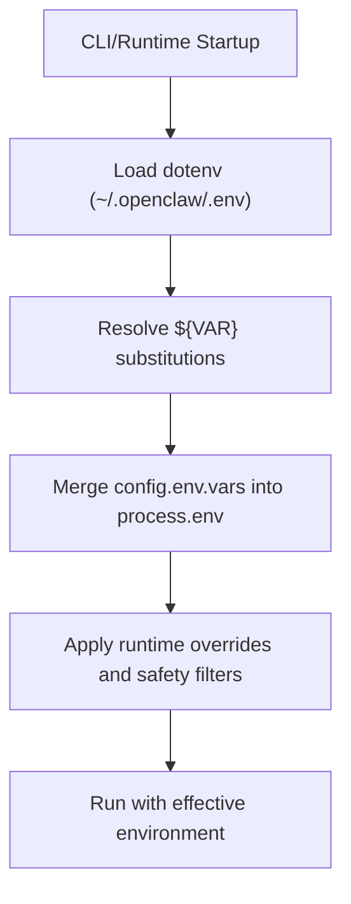
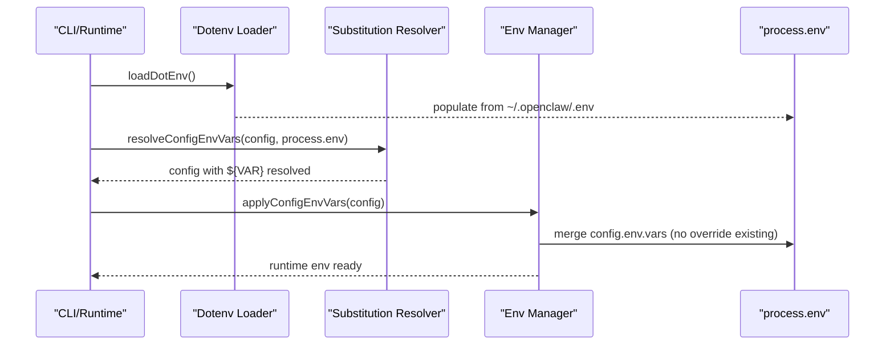
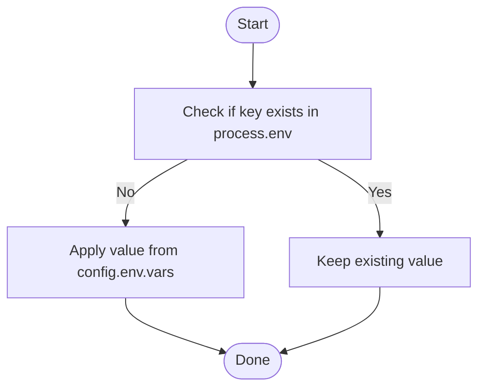
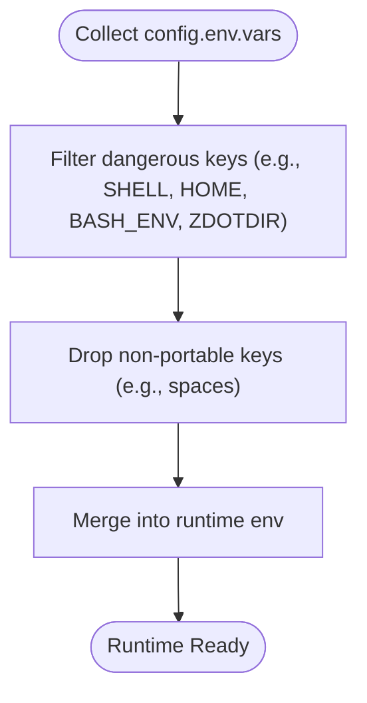
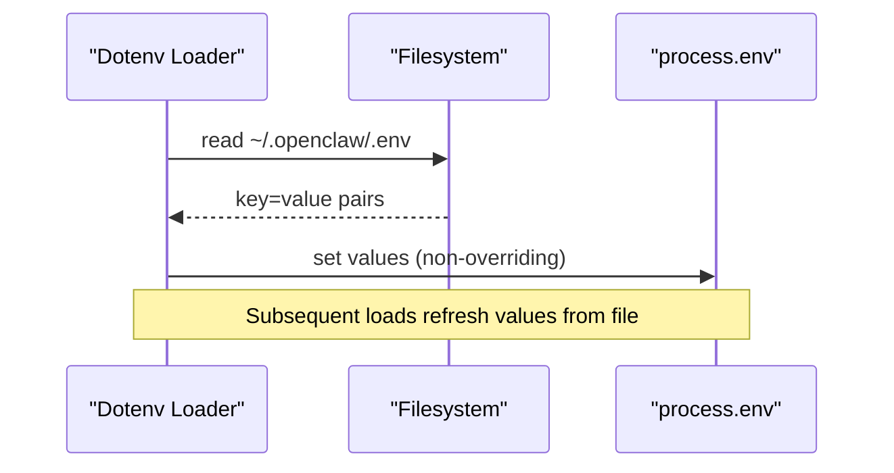
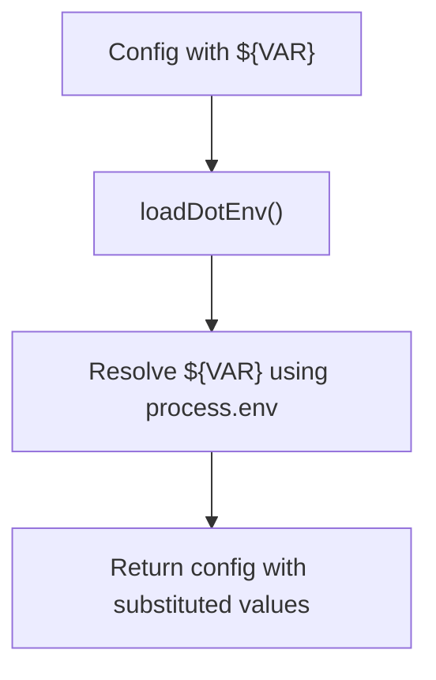
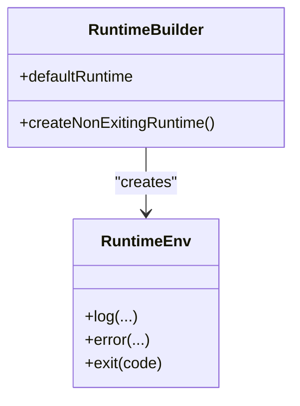
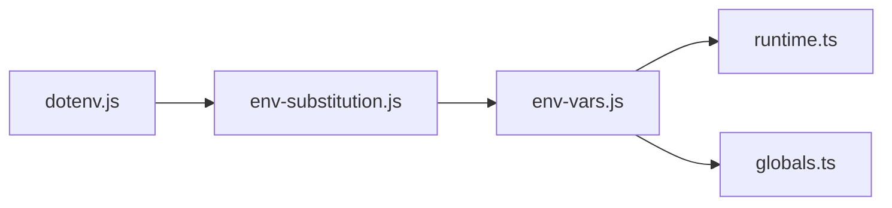

# Environment Variables

<cite>
**Referenced Files in This Document**
- [openclaw.podman.env](file://openclaw.podman.env)
- [config.env-vars.test.ts](file://src/config/config.env-vars.test.ts)
- [env-vars.js](file://src/config/env-vars.js)
- [env-substitution.js](file://src/config/env-substitution.js)
- [dotenv.js](file://src/infra/dotenv.js)
- [runtime.ts](file://src/runtime.ts)
- [globals.ts](file://src/globals.ts)
- [config.ts](file://src/config/config.ts)
- [config-paths.ts](file://src/config/config-paths.ts)
- [config.acp-binding-cutover.test.ts](file://src/config/config.acp-binding-cutover.test.ts)
- [config.allowlist-requires-allowfrom.test.ts](file://src/config/config.allowlist-requires-allowfrom.test.ts)
- [config.agent-concurrency-defaults.test.ts](file://src/config/config.agent-concurrency-defaults.test.ts)
- [config.allowlist-requires-allowfrom.test.ts](file://src/config/config.allowlist-requires-allowfrom.test.ts)
- [config.backup-rotation.test-helpers.ts](file://src/config/config.backup-rotation.test-helpers.ts)
- [config-misc.test.ts](file://src/config/config-misc.test.ts)
- [config-paths.ts](file://src/config/config-paths.ts)
- [config.ts](file://src/config/config.ts)
- [config.ts](file://src/config/types.ts)
- [config.ts](file://src/config/agent-dirs.ts)
- [config.ts](file://src/config/agent-limits.ts)
- [config.ts](file://src/config/bindings.ts)
- [config.ts](file://src/config/byte-size.ts)
- [config.ts](file://src/config/cache-utils.ts)
- [config.ts](file://src/config/channel-capabilities.ts)
- [config.ts](file://src/config/commands.ts)
- [config.ts](file://src/config/config-misc.ts)
- [config.ts](file://src/config/config-paths.ts)
- [config.ts](file://src/config/config.ts)
- [config.ts](file://src/config/types.ts)
- [config.ts](file://src/config/agent-dirs.ts)
- [config.ts](file://src/config/agent-limits.ts)
- [config.ts](file://src/config/bindings.ts)
- [config.ts](file://src/config/byte-size.ts)
- [config.ts](file://src/config/cache-utils.ts)
- [config.ts](file://src/config/channel-capabilities.ts)
- [config.ts](file://src/config/commands.ts)
- [config.ts](file://src/config/config-misc.ts)
- [config.ts](file://src/config/config-paths.ts)
- [config.ts](file://src/config/config.ts)
- [config.ts](file://src/config/types.ts)
- [config.ts](file://src/config/agent-dirs.ts)
- [config.ts](file://src/config/agent-limits.ts)
- [config.ts](file://src/config/bindings.ts)
- [config.ts](file://src/config/byte-size.ts)
- [config.ts](file://src/config/cache-utils.ts)
- [config.ts](file://src/config/channel-capabilities.ts)
- [config.ts](file://src/config/commands.ts)
- [config.ts](file://src/config/config-misc.ts)
- [config.ts](file://src/config/config-paths.ts)
- [config.ts](file://src/config/config.ts)
- [config.ts](file://src/config/types.ts)
- [config.ts](file://src/config/agent-dirs.ts)
- [config.ts](file://src/config/agent-limits.ts)
- [config.ts](file://src/config/bindings.ts)
- [config.ts](file://src/config/byte-size.ts)
- [config.ts](file://src/config/cache-utils.ts)
- [config.ts](file://src/config/channel-capabilities.ts)
- [config.ts](file://src/config/commands.ts)
- [config.ts](file://src/config/config-misc.ts)
- [config.ts](file://src/config/config-paths.ts)
- [config.ts](file://src/config/config.ts)
- [config.ts](file://src/config/types.ts)
- [config.ts](file://src/config/agent-dirs.ts)
- [config.ts](file://src/config/agent-limits.ts)
- [config.ts](file://src/config/bindings.ts)
- [config.ts](file://src/config/byte-size.ts)
- [config.ts](file://src/config/cache-utils.ts)
- [config.ts](file://src/config/channel-capabilities.ts)
- [config.ts](file://src/config/commands.ts)
- [config.ts](file://src/config/config-misc.ts)
- [config.ts](file://src/config/config-paths.ts)
- [config.ts](file://src/config/config.ts)
- [config.ts](file://src/config/types.ts)
- [config.ts](file://src/config/agent-dirs.ts)
- [config.ts](file://src/config/agent-limits.ts)
- [config.ts](file://src/config/bindings.ts)
- [config.ts](file://src/config/byte-size.ts)
- [config.ts](file://src/config/cache-utils.ts)
- [config.ts](file://src/config/channel-capabilities.ts)
- [config.ts](file://src/config/commands.ts)
- [config.ts](file://src/config/config-misc.ts)
- [config.ts](file://src/config/config-paths.ts)
- [config.ts](file://src/config/config.ts)
- [config.ts](file://src/config/types.ts)
- [config.ts](file://src/config/agent-dirs.ts)
- [config.ts](file://src/config/agent-limits.ts)
- [config.ts](file://src/config/bindings.ts)
- [config.ts](file://src/config/byte-size.ts)
- [config.ts](file://src/config/cache-utils.ts)
......
</cite>

## Table of Contents
1. [Introduction](#introduction)
2. [Project Structure](#project-structure)
3. [Core Components](#core-components)
4. [Architecture Overview](#architecture-overview)
5. [Detailed Component Analysis](#detailed-component-analysis)
6. [Dependency Analysis](#dependency-analysis)
7. [Performance Considerations](#performance-considerations)
8. [Troubleshooting Guide](#troubleshooting-guide)
9. [Conclusion](#conclusion)
10. [Appendices](#appendices)

## Introduction
This document explains how environment variables are configured, validated, and consumed in OpenClaw. It covers supported variables, precedence, substitution patterns, scoping, inheritance, and security considerations. It also provides practical examples for common deployment scenarios and outlines best practices for managing sensitive credentials and rotating them safely.

## Project Structure
OpenClaw centralizes environment variable handling in the configuration subsystem. Key areas include:
- Environment variable loading and merging from configuration blocks
- Dotenv-style file loading and variable substitution
- Runtime environment creation and safety checks
- CLI and runtime logging behavior influenced by environment

**Diagram sources**
- [dotenv.js](file://src/infra/dotenv.js)
- [env-substitution.js](file://src/config/env-substitution.js)
- [env-vars.js](file://src/config/env-vars.js)

**Section sources**
- [openclaw.podman.env](file://openclaw.podman.env)
- [dotenv.js](file://src/infra/dotenv.js)
- [env-substitution.js](file://src/config/env-substitution.js)
- [env-vars.js](file://src/config/env-vars.js)

## Core Components
- Environment variable application and safety filtering
- Dotenv loading and repeated-load caching behavior
- Variable substitution resolution
- Runtime environment construction and logging controls

Key behaviors validated by tests:
- Existing environment variables take precedence over config-defined values.
- Dangerous or non-portable environment keys are filtered out from configuration-defined environments.
- Substitutions from ~/.openclaw/.env persist across repeated loads.

**Section sources**
- [config.env-vars.test.ts](file://src/config/config.env-vars.test.ts)
- [env-vars.js](file://src/config/env-vars.js)
- [env-substitution.js](file://src/config/env-substitution.js)
- [dotenv.js](file://src/infra/dotenv.js)

## Architecture Overview
The environment pipeline integrates configuration, dotenv loading, and runtime application:

**Diagram sources**
- [dotenv.js](file://src/infra/dotenv.js)
- [env-substitution.js](file://src/config/env-substitution.js)
- [env-vars.js](file://src/config/env-vars.js)
- [config.env-vars.test.ts](file://src/config/config.env-vars.test.ts)

## Detailed Component Analysis

### Environment Variable Application and Precedence
- Configuration-defined variables are applied only when not already present in the environment.
- Existing environment variables (e.g., from the OS, shell, or container) are never overridden by configuration-defined values.
- This establishes a clear precedence: OS/container > CLI/runtime > config block.

**Diagram sources**
- [env-vars.js](file://src/config/env-vars.js)
- [config.env-vars.test.ts](file://src/config/config.env-vars.test.ts)

**Section sources**
- [env-vars.js](file://src/config/env-vars.js)
- [config.env-vars.test.ts](file://src/config/config.env-vars.test.ts)

### Safety Filtering and Non-Portable Keys
- Certain environment keys are blocked from being set via configuration-defined environments because they can impact shell initialization or process behavior.
- Keys containing spaces or otherwise non-portable names are dropped to ensure cross-platform portability.

**Diagram sources**
- [config.env-vars.test.ts](file://src/config/config.env-vars.test.ts)

**Section sources**
- [config.env-vars.test.ts](file://src/config/config.env-vars.test.ts)

### Dotenv Loading and Repeated Loads
- Dotenv files under the state directory (~/.openclaw/.env) are loaded and can influence substitution resolution.
- On subsequent loads, the loader re-applies the dotenv values so that substitutions remain consistent even if the process environment changes.

**Diagram sources**
- [dotenv.js](file://src/infra/dotenv.js)
- [config.env-vars.test.ts](file://src/config/config.env-vars.test.ts)

**Section sources**
- [dotenv.js](file://src/infra/dotenv.js)
- [config.env-vars.test.ts](file://src/config/config.env-vars.test.ts)

### Variable Substitution Patterns
- Values in configuration supporting environment substitution use ${VAR} syntax.
- Substitution occurs against the current environment, including values loaded from dotenv.
- Tests demonstrate that repeated dotenv reloads preserve substitution results.

**Diagram sources**
- [env-substitution.js](file://src/config/env-substitution.js)
- [dotenv.js](file://src/infra/dotenv.js)
- [config.env-vars.test.ts](file://src/config/config.env-vars.test.ts)

**Section sources**
- [env-substitution.js](file://src/config/env-substitution.js)
- [dotenv.js](file://src/infra/dotenv.js)
- [config.env-vars.test.ts](file://src/config/config.env-vars.test.ts)

### Runtime Environment Construction and Logging Controls
- The runtime environment exposes log/error handlers and exit behavior.
- Logging emission can be controlled by environment flags, particularly during tests.

**Diagram sources**
- [runtime.ts](file://src/runtime.ts)

**Section sources**
- [runtime.ts](file://src/runtime.ts)

### Naming Conventions, Scoping, and Inheritance
- Naming conventions:
  - Uppercase with underscores preferred for compatibility.
  - Avoid spaces and special characters in keys to maintain portability.
- Scoping:
  - Variables defined in configuration blocks are scoped to the runtime process and do not mutate the parent environment unless the process inherits them.
- Inheritance:
  - Child processes inherit the effective environment established at startup, including merged dotenv and configuration-defined values.

[No sources needed since this section provides general guidance]

### Examples of Environment-Specific Configurations
- Containerized deployments:
  - Use a dedicated environment file and pass it to the container runtime. See the Podman example for required and optional variables.
- Local development:
  - Store provider credentials in ~/.openclaw/.env; reference them in configuration via ${VAR}.
- CI/CD:
  - Provide secrets via CI environment; configuration-defined values will not override them.

**Section sources**
- [openclaw.podman.env](file://openclaw.podman.env)
- [dotenv.js](file://src/infra/dotenv.js)

### Validation, Type Conversion, and Error Handling
- Validation:
  - Dangerous keys are filtered out before applying to the runtime environment.
  - Non-portable keys are dropped to prevent cross-platform issues.
- Type conversion:
  - Environment values are strings; consumers should parse according to their needs.
- Error handling:
  - Runtime logging can be suppressed or redirected; tests can enable additional logging via environment flags.

**Section sources**
- [config.env-vars.test.ts](file://src/config/config.env-vars.test.ts)
- [runtime.ts](file://src/runtime.ts)

## Dependency Analysis
The environment subsystem depends on:
- Dotenv loader for file-backed variables
- Substitution resolver for ${VAR} expansion
- Environment manager for safe application and merging
- Runtime for logging and exit behavior

**Diagram sources**
- [dotenv.js](file://src/infra/dotenv.js)
- [env-substitution.js](file://src/config/env-substitution.js)
- [env-vars.js](file://src/config/env-vars.js)
- [runtime.ts](file://src/runtime.ts)
- [globals.ts](file://src/globals.ts)

**Section sources**
- [dotenv.js](file://src/infra/dotenv.js)
- [env-substitution.js](file://src/config/env-substitution.js)
- [env-vars.js](file://src/config/env-vars.js)
- [runtime.ts](file://src/runtime.ts)
- [globals.ts](file://src/globals.ts)

## Performance Considerations
- Prefer keeping environment variables minimal and only those required by active components.
- Avoid excessive dotenv reloads; rely on stable values where possible.
- Use configuration-defined variables sparingly to reduce merge overhead.

[No sources needed since this section provides general guidance]

## Troubleshooting Guide
- A variable is unexpectedly empty:
  - Confirm whether it was overridden by an existing environment variable.
  - Verify dotenv file contents and that the state directory is correctly set.
- Substitution does not resolve:
  - Ensure the referenced variable is present in the effective environment (including dotenv-loaded values).
- Unexpected behavior after repeated loads:
  - Confirm that dotenv is being reloaded consistently and that the state directory is writable.

**Section sources**
- [config.env-vars.test.ts](file://src/config/config.env-vars.test.ts)
- [dotenv.js](file://src/infra/dotenv.js)

## Conclusion
OpenClaw’s environment configuration is designed to be explicit, safe, and portable. By leveraging dotenv files, substitution, and careful application rules, it ensures predictable behavior across diverse deployment scenarios while preventing unsafe mutations to the runtime environment.

[No sources needed since this section summarizes without analyzing specific files]

## Appendices

### Supported Environment Variables (by example)
- Gateway and container orchestration:
  - OPENCLAW_GATEWAY_TOKEN
  - OPENCLAW_PODMAN_GATEWAY_HOST_PORT
  - OPENCLAW_PODMAN_BRIDGE_HOST_PORT
  - OPENCLAW_GATEWAY_BIND
- Provider credentials:
  - CLAUDE_AI_SESSION_KEY
  - CLAUDE_WEB_SESSION_KEY
  - CLAUDE_WEB_COOKIE
  - OLLAMA_API_KEY
  - GROQ_API_KEY
  - BRAVE_API_KEY (example used in tests)
- Runtime and logging:
  - VITEST
  - OPENCLAW_TEST_RUNTIME_LOG
  - OPENCLAW_STATE_DIR (used by tests to locate ~/.openclaw/.env)

Note: These variables are referenced in repository files and examples. Always validate their presence and correctness in your deployment context.

**Section sources**
- [openclaw.podman.env](file://openclaw.podman.env)
- [config.env-vars.test.ts](file://src/config/config.env-vars.test.ts)
- [dotenv.js](file://src/infra/dotenv.js)

### Security Considerations and Best Practices
- Treat environment variables as secrets; never commit them to version control.
- Use separate environment files per environment (local, staging, production).
- Rotate credentials regularly and invalidate old tokens/secrets promptly.
- Limit the scope of sensitive variables to the minimum required by each component.
- Audit environment variables at startup and log only non-sensitive summaries.

[No sources needed since this section provides general guidance]