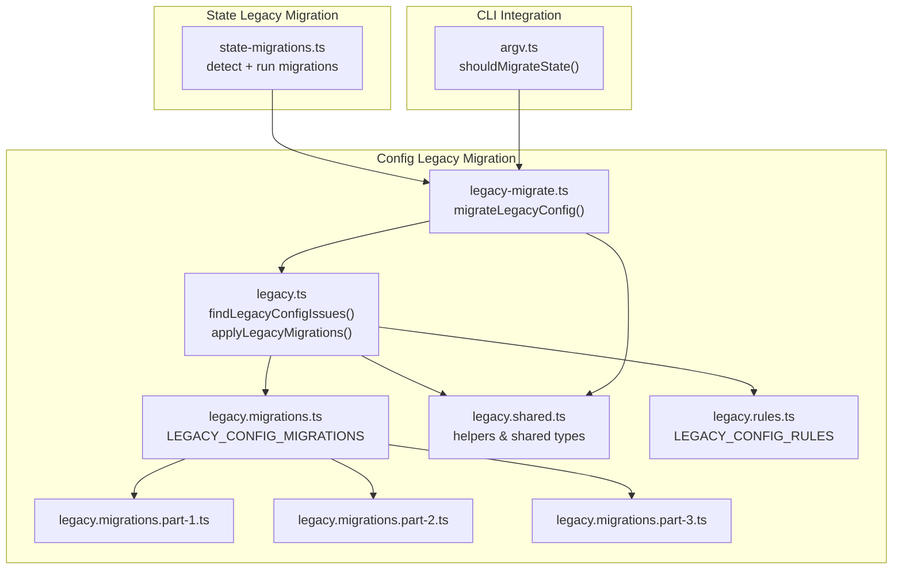
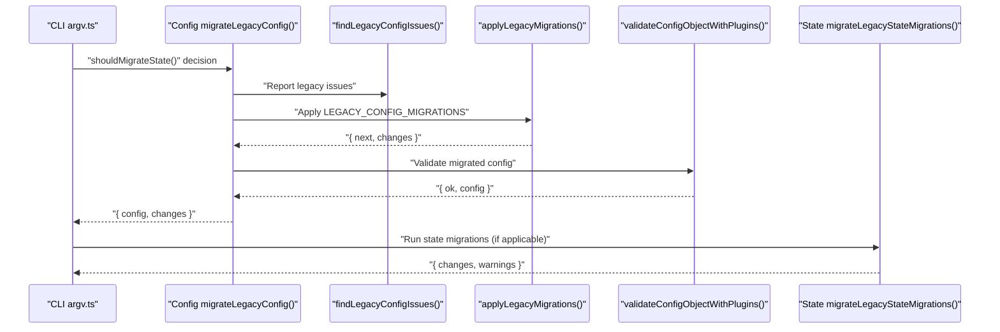
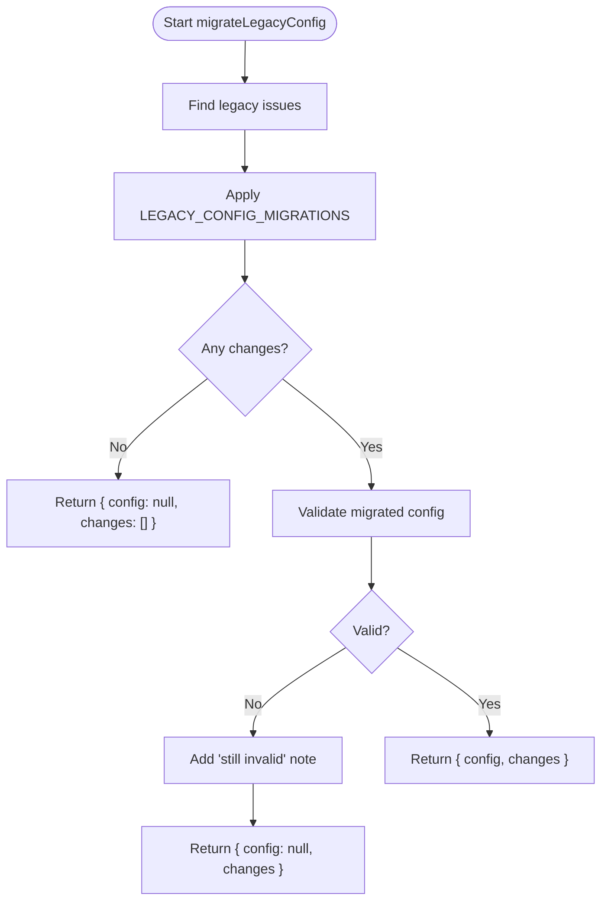
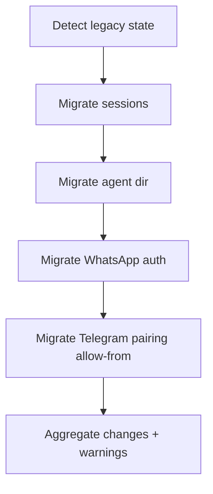
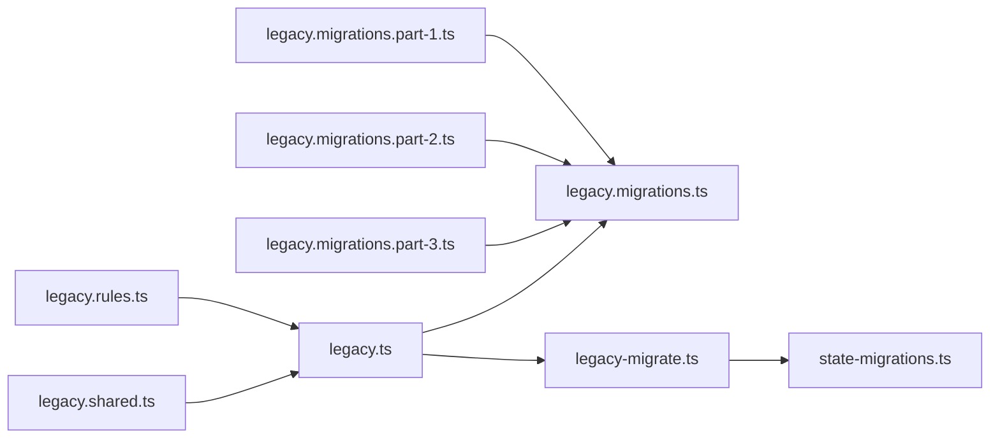

# Legacy Migration

<cite>
**Referenced Files in This Document**
- [legacy.ts](file://src/config/legacy.ts)
- [legacy.migrations.ts](file://src/config/legacy.migrations.ts)
- [legacy.migrations.part-1.ts](file://src/config/legacy.migrations.part-1.ts)
- [legacy.migrations.part-2.ts](file://src/config/legacy.migrations.part-2.ts)
- [legacy.migrations.part-3.ts](file://src/config/legacy.migrations.part-3.ts)
- [legacy.shared.ts](file://src/config/legacy.shared.ts)
- [legacy.rules.ts](file://src/config/legacy.rules.ts)
- [legacy-migrate.ts](file://src/config/legacy-migrate.ts)
- [legacy-migrate.test.ts](file://src/config/legacy-migrate.test.ts)
- [state-migrations.ts](file://src/infra/state-migrations.ts)
- [argv.ts](file://src/cli/argv.ts)
</cite>

## Table of Contents
1. [Introduction](#introduction)
2. [Project Structure](#project-structure)
3. [Core Components](#core-components)
4. [Architecture Overview](#architecture-overview)
5. [Detailed Component Analysis](#detailed-component-analysis)
6. [Dependency Analysis](#dependency-analysis)
7. [Performance Considerations](#performance-considerations)
8. [Troubleshooting Guide](#troubleshooting-guide)
9. [Conclusion](#conclusion)
10. [Appendices](#appendices)

## Introduction
This document explains the legacy configuration migration system in OpenClaw. It covers how the system detects legacy configuration, applies automated upgrades, validates results, and integrates with state migrations. It also documents migration rules, conversion semantics, testing, rollback strategies, and error recovery mechanisms. The goal is to help operators and developers safely upgrade from older configuration formats to the current schema while preserving functionality and minimizing downtime.

## Project Structure
The legacy migration system is primarily implemented in the configuration subsystem and integrated with infrastructure-level state migrations. Key areas:
- Configuration-level migration pipeline: detection, migration rules, and validation
- State-level migration pipeline: detection and migration of legacy runtime state directories
- CLI integration: decides whether to run migrations based on command context

**Diagram sources**
- [legacy.ts:16-58](file://src/config/legacy.ts#L16-L58)
- [legacy.migrations.ts:1-9](file://src/config/legacy.migrations.ts#L1-L9)
- [legacy.migrations.part-1.ts:97-616](file://src/config/legacy.migrations.part-1.ts#L97-L616)
- [legacy.migrations.part-2.ts:38-427](file://src/config/legacy.migrations.part-2.ts#L38-L427)
- [legacy.migrations.part-3.ts:100-385](file://src/config/legacy.migrations.part-3.ts#L100-L385)
- [legacy.shared.ts:1-134](file://src/config/legacy.shared.ts#L1-L134)
- [legacy.rules.ts:49-212](file://src/config/legacy.rules.ts#L49-L212)
- [legacy-migrate.ts:5-19](file://src/config/legacy-migrate.ts#L5-L19)
- [state-migrations.ts:36-65](file://src/infra/state-migrations.ts#L36-L65)
- [argv.ts:303-328](file://src/cli/argv.ts#L303-L328)

**Section sources**
- [legacy.ts:16-58](file://src/config/legacy.ts#L16-L58)
- [legacy.migrations.ts:1-9](file://src/config/legacy.migrations.ts#L1-L9)
- [legacy.shared.ts:1-134](file://src/config/legacy.shared.ts#L1-L134)
- [legacy.rules.ts:49-212](file://src/config/legacy.rules.ts#L49-L212)
- [legacy-migrate.ts:5-19](file://src/config/legacy-migrate.ts#L5-L19)
- [state-migrations.ts:36-65](file://src/infra/state-migrations.ts#L36-L65)
- [argv.ts:303-328](file://src/cli/argv.ts#L303-L328)

## Core Components
- Legacy configuration detection and reporting
  - Scans configuration against a curated list of legacy paths and conditions, optionally requiring literal presence in the original source.
  - Produces human-readable issue reports for remediation.
- Automated migration engine
  - Applies a sequence of migrations to transform legacy structures into modern equivalents.
  - Tracks per-migration change notes for auditability.
- Validation integration
  - After migration, validates the transformed configuration to ensure it passes schema checks.
- State migration engine
  - Detects and migrates legacy runtime state directories (sessions, agent directories, auth artifacts) into the new layout.
- CLI gating
  - Determines whether migrations should run based on the command being executed.

**Section sources**
- [legacy.ts:16-58](file://src/config/legacy.ts#L16-L58)
- [legacy.rules.ts:49-212](file://src/config/legacy.rules.ts#L49-L212)
- [legacy-migrate.ts:5-19](file://src/config/legacy-migrate.ts#L5-L19)
- [state-migrations.ts:36-65](file://src/infra/state-migrations.ts#L36-L65)
- [argv.ts:303-328](file://src/cli/argv.ts#L303-L328)

## Architecture Overview
The migration pipeline operates in two stages:
1) Configuration migration
- Load raw configuration
- Optionally detect legacy issues
- Apply ordered migrations
- Validate resulting configuration
- Persist or surface changes

2) State migration
- Detect legacy state directories and files
- Migrate sessions, agent directories, and auth artifacts
- Seed missing control UI origins for non-loopback gateway binds

**Diagram sources**
- [legacy-migrate.ts:5-19](file://src/config/legacy-migrate.ts#L5-L19)
- [legacy.ts:16-58](file://src/config/legacy.ts#L16-L58)
- [legacy.migrations.ts:1-9](file://src/config/legacy.migrations.ts#L1-L9)
- [state-migrations.ts:943-967](file://src/infra/state-migrations.ts#L943-L967)
- [argv.ts:303-328](file://src/cli/argv.ts#L303-L328)

## Detailed Component Analysis

### Configuration Migration Pipeline
- Detection
  - Uses LEGACY_CONFIG_RULES to scan for legacy paths and optional matching predicates.
  - Supports requireSourceLiteral to avoid flagging values introduced by includes/env resolution.
- Migration
  - LEGACY_CONFIG_MIGRATIONS is a concatenation of three parts, each containing targeted migrations for different domains (bindings, routing, tools, channels, heartbeat, identity, etc.).
  - Each migration is a small, composable function that mutates the configuration in place and records a change note.
- Validation
  - After applying migrations, the system validates the transformed configuration to ensure it conforms to the current schema.
  - If validation fails, the migration returns partial results with a note to fix remaining issues manually.

**Diagram sources**
- [legacy-migrate.ts:5-19](file://src/config/legacy-migrate.ts#L5-L19)
- [legacy.ts:16-58](file://src/config/legacy.ts#L16-L58)
- [legacy.migrations.ts:1-9](file://src/config/legacy.migrations.ts#L1-L9)

**Section sources**
- [legacy.ts:16-58](file://src/config/legacy.ts#L16-L58)
- [legacy.migrations.ts:1-9](file://src/config/legacy.migrations.ts#L1-L9)
- [legacy.migrations.part-1.ts:97-616](file://src/config/legacy.migrations.part-1.ts#L97-L616)
- [legacy.migrations.part-2.ts:38-427](file://src/config/legacy.migrations.part-2.ts#L38-L427)
- [legacy.migrations.part-3.ts:100-385](file://src/config/legacy.migrations.part-3.ts#L100-L385)
- [legacy.shared.ts:1-134](file://src/config/legacy.shared.ts#L1-L134)
- [legacy.rules.ts:49-212](file://src/config/legacy.rules.ts#L49-L212)
- [legacy-migrate.ts:5-19](file://src/config/legacy-migrate.ts#L5-L19)

### Migration Rules and Conversion Semantics
- Provider configuration
  - Legacy top-level provider sections (e.g., whatsapp, telegram, discord, slack, signal, imessage, msteams) are moved under channels.<provider>.
- Bindings and routing
  - bindings.match.provider → bindings.match.channel
  - routing.bindings → bindings
  - routing.agents → agents.list
  - routing.defaultAgentId → agents.list[].default
  - routing.agentToAgent → tools.agentToAgent
  - routing.queue → messages.queue
  - routing.groupChat.requireMention → channels.<provider>.groups."*".requireMention
  - routing.allowFrom → channels.whatsapp.allowFrom
- Streaming and TTS
  - channels.<provider>.streamMode → channels.<provider>.streaming (with provider-specific normalization)
  - messages.tts.enabled → messages.tts.auto
- Heartbeat
  - Top-level heartbeat → agents.defaults.heartbeat (cadence/model/target) and channels.defaults.heartbeat (visibility flags)
- Identity and memory
  - identity → agents.list[].identity
  - memorySearch → agents.defaults.memorySearch
- Tools and agent defaults
  - agent.* → agents.defaults.* and tools.* (agent.tools.allow → tools.allow, agent.bash → tools.exec, agent.elevated → tools.elevated, agent.sandbox.tools → tools.sandbox.tools, agent.subagents.tools → tools.subagents.tools)
- Audio transcription
  - routing.transcribeAudio → tools.media.audio.models (with safety checks and timeouts)
- Gateway bind normalization
  - gateway.bind host aliases (e.g., 0.0.0.0, localhost) → bind modes (lan, loopback, custom, tailnet, auto)
- Control UI origins seeding
  - For non-loopback gateway binds, seed gateway.controlUi.allowedOrigins to prevent startup crashes

Examples of migration scenarios and scripts
- Moving routing bindings and agents:
  - Source: routing.bindings and routing.agents present
  - Target: top-level bindings and agents.list
  - Migration: move and merge with existing entries
- Normalizing streaming keys:
  - Source: channels.slack.streamMode or channels.telegram/streaming boolean
  - Target: channels.<provider>.streaming enum with nativeStreaming parity
- Seeding control UI origins:
  - Source: gateway.bind=lan without allowedOrigins
  - Target: seed http://localhost:<port> and http://127.0.0.1:<port> origins

Manual intervention procedures
- Fix remaining validation errors after migration
- Review change notes to confirm expected transformations
- Manually adjust any migrated fields if defaults are unsuitable

**Section sources**
- [legacy.migrations.part-1.ts:97-616](file://src/config/legacy.migrations.part-1.ts#L97-L616)
- [legacy.migrations.part-2.ts:38-427](file://src/config/legacy.migrations.part-2.ts#L38-L427)
- [legacy.migrations.part-3.ts:100-385](file://src/config/legacy.migrations.part-3.ts#L100-L385)
- [legacy.shared.ts:53-85](file://src/config/legacy.shared.ts#L53-L85)
- [legacy.rules.ts:49-212](file://src/config/legacy.rules.ts#L49-L212)

### State Migration Pipeline
State migrations handle runtime artifacts left behind by previous versions:
- Sessions
  - Detect legacy session directories and files
  - Canonicalize session keys and migrate to new layout
  - Save migrated stores
- Agent directories
  - Move legacy agent files into agents/<agentId>/agent
  - Back up leftover legacy directories if conflicts arise
- WhatsApp auth
  - Migrate legacy auth files into OAuth storage
- Telegram pairing allow-from
  - Copy allow-from files into new locations

**Diagram sources**
- [state-migrations.ts:36-65](file://src/infra/state-migrations.ts#L36-L65)
- [state-migrations.ts:943-967](file://src/infra/state-migrations.ts#L943-L967)

**Section sources**
- [state-migrations.ts:36-65](file://src/infra/state-migrations.ts#L36-L65)
- [state-migrations.ts:848-891](file://src/infra/state-migrations.ts#L848-L891)
- [state-migrations.ts:943-967](file://src/infra/state-migrations.ts#L943-L967)

### CLI Integration and Migration Gating
- The CLI determines whether to run migrations based on the command path.
- Certain commands (e.g., health, status, sessions, models status, memory status, agent) skip state migration to avoid unintended side effects.

**Section sources**
- [argv.ts:303-328](file://src/cli/argv.ts#L303-L328)

## Dependency Analysis
- Configuration migration depends on:
  - Shared helpers (legacy.shared.ts) for record manipulation, merging, and agent resolution
  - Ordered migration parts (legacy.migrations.*) that collectively define the transformation rules
  - Rule set (legacy.rules.ts) for detection and reporting
  - Validation (legacy-migrate.ts) to ensure post-migration correctness
- State migration depends on:
  - Path resolution and filesystem helpers
  - Session canonicalization and store persistence
  - Channel-specific logic (e.g., Telegram account enumeration)

**Diagram sources**
- [legacy.rules.ts:49-212](file://src/config/legacy.rules.ts#L49-L212)
- [legacy.shared.ts:1-134](file://src/config/legacy.shared.ts#L1-L134)
- [legacy.migrations.ts:1-9](file://src/config/legacy.migrations.ts#L1-L9)
- [legacy.ts:16-58](file://src/config/legacy.ts#L16-L58)
- [legacy-migrate.ts:5-19](file://src/config/legacy-migrate.ts#L5-L19)
- [state-migrations.ts:36-65](file://src/infra/state-migrations.ts#L36-L65)

**Section sources**
- [legacy.ts:16-58](file://src/config/legacy.ts#L16-L58)
- [legacy.migrations.ts:1-9](file://src/config/legacy.migrations.ts#L1-L9)
- [legacy.shared.ts:1-134](file://src/config/legacy.shared.ts#L1-L134)
- [legacy.rules.ts:49-212](file://src/config/legacy.rules.ts#L49-L212)
- [legacy-migrate.ts:5-19](file://src/config/legacy-migrate.ts#L5-L19)
- [state-migrations.ts:36-65](file://src/infra/state-migrations.ts#L36-L65)

## Performance Considerations
- Migration cost
  - Migrations operate on a single pass over the configuration tree with O(n) complexity relative to the number of keys processed.
  - Each migration function short-circuits when no relevant keys are found.
- Validation overhead
  - Post-migration validation ensures correctness but adds CPU time proportional to schema complexity.
- State migration cost
  - File copies and renames are linear in the number of legacy files.
  - Directory scanning and key canonicalization add modest overhead.

Recommendations
- Keep configuration minimal and avoid excessive nesting to reduce traversal costs.
- Run migrations during maintenance windows to minimize impact on live workloads.

[No sources needed since this section provides general guidance]

## Troubleshooting Guide
Common issues and recovery strategies
- Migration returns null with changes
  - Indicates that migrations were applied but the configuration still fails validation. Review the change notes and fix remaining schema violations manually.
- Empty or partially migrated sections
  - Some migrations only apply when legacy keys are present; otherwise they are no-ops. Verify that the expected legacy keys exist in the source.
- State migration warnings
  - File copy/renames may fail due to permissions or existing targets. Review warnings and retry with corrected permissions or cleanup conflicting files.
- Startup crash on non-loopback bind
  - The control UI origins seeding migration prevents startup crashes for non-loopback binds. If the bind is loopback, no seeding occurs by design.

Validation during migration
- The system validates the migrated configuration against the current schema. Failures are surfaced with a note to fix remaining issues manually.

Rollback strategies
- Manual rollback
  - Revert to the previous configuration snapshot and re-run migrations after fixing schema issues.
- Partial rollback
  - Undo specific migrations by restoring affected sections from backups and re-running validation.

Error recovery mechanisms
- Change notes
  - Each migration records a human-readable change note. Use these to understand what changed and guide recovery.
- Warnings
  - State migrations collect warnings for failed operations. Address underlying causes (permissions, missing files, etc.) and retry.

**Section sources**
- [legacy-migrate.ts:5-19](file://src/config/legacy-migrate.ts#L5-L19)
- [legacy-migrate.test.ts:239-347](file://src/config/legacy-migrate.test.ts#L239-L347)
- [state-migrations.ts:111-129](file://src/infra/state-migrations.ts#L111-L129)

## Conclusion
OpenClaw’s legacy migration system provides a robust, auditable, and safe upgrade path from older configuration and state formats. By combining precise detection, ordered migrations, and post-migration validation, it minimizes risk and maximizes operability. Operators should review change notes, address validation failures, and leverage warnings to recover from partial state migrations. The system’s design supports incremental improvements and future-proofing of the configuration schema.

[No sources needed since this section summarizes without analyzing specific files]

## Appendices

### Migration Testing Highlights
- Audio transcription migration tests verify movement into tools.media.audio.models and proper handling of invalid payloads.
- Routing mention migration tests verify movement into channel group defaults for telegram, imessage, and whatsapp.
- Heartbeat migration tests verify splitting into agents.defaults.heartbeat and channels.defaults.heartbeat, with precedence rules and blocked prototype keys handling.
- Control UI origins seeding tests verify behavior for bind=lan, custom port, custom bind host, existing allowedOrigins, and loopback binds.

**Section sources**
- [legacy-migrate.test.ts:1-348](file://src/config/legacy-migrate.test.ts#L1-L348)