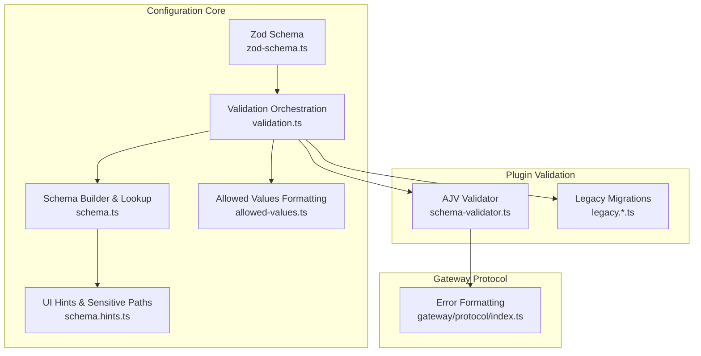
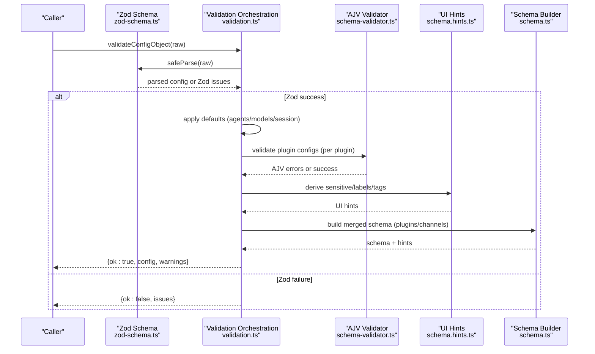
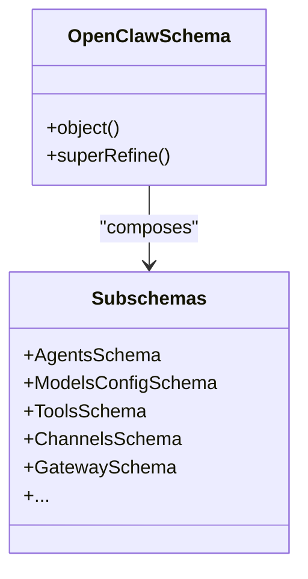
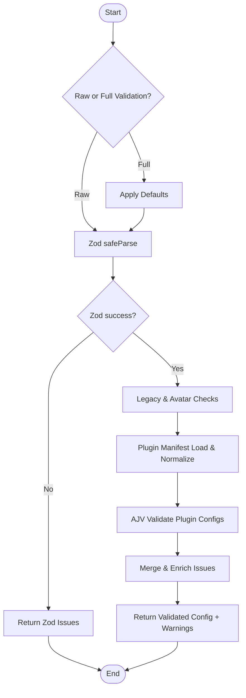
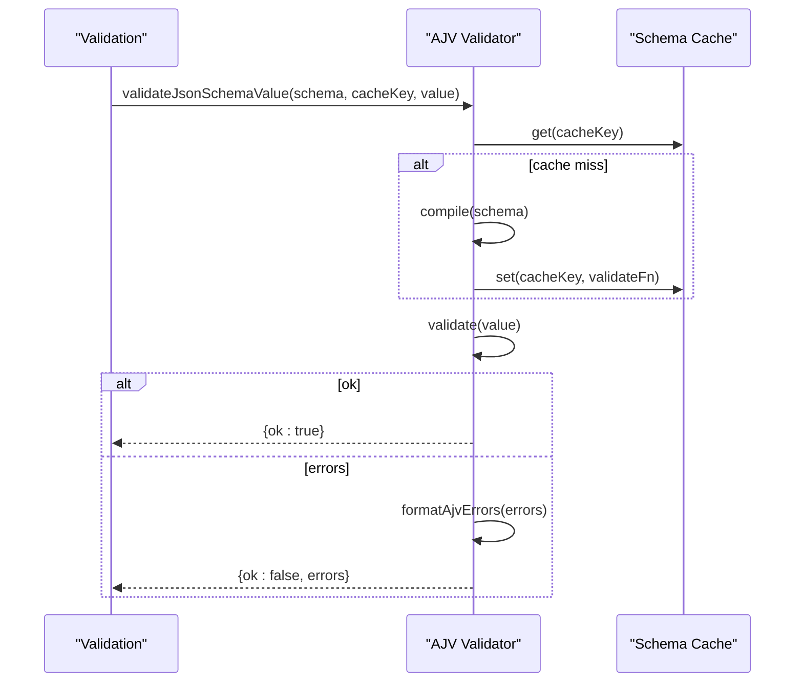
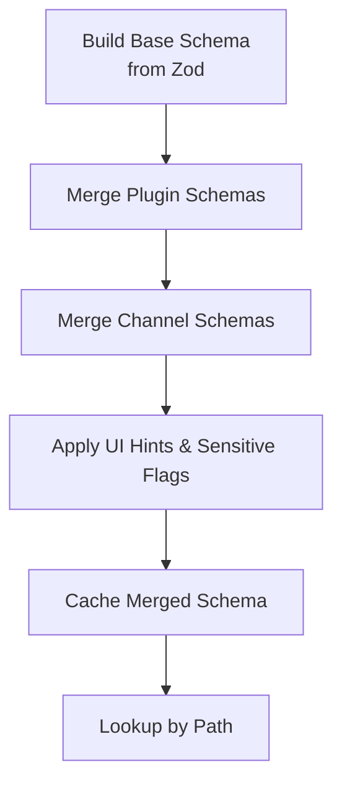
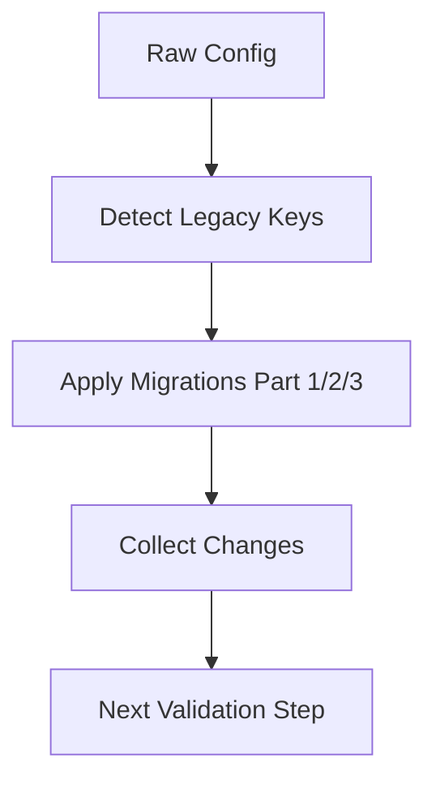
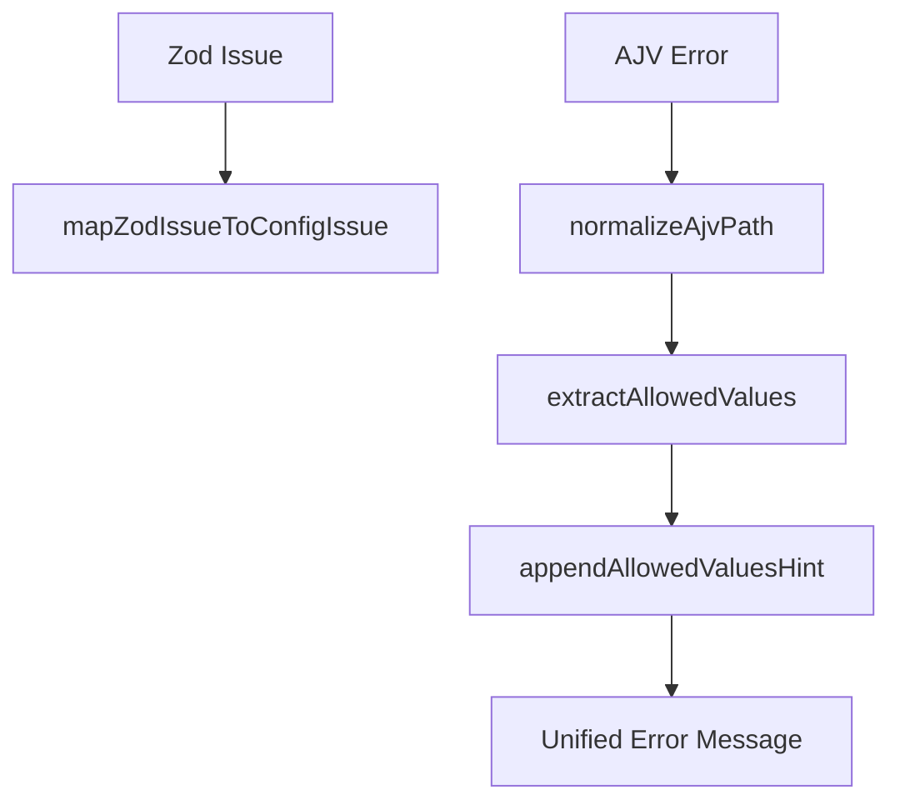
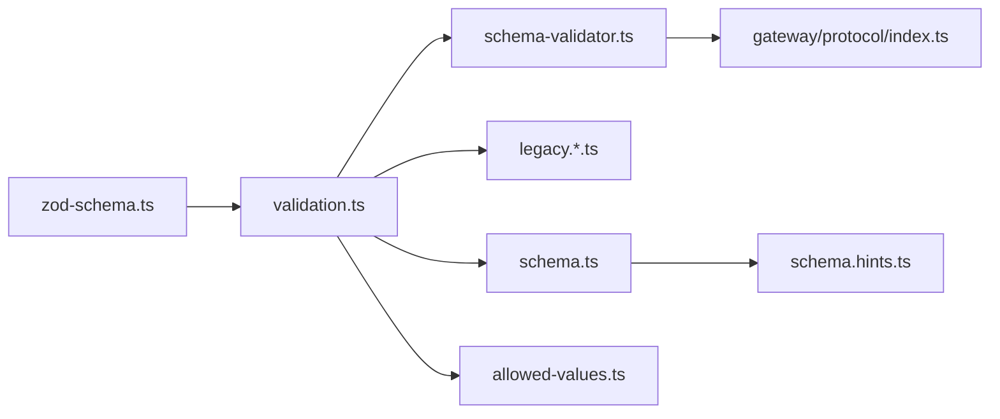

# Schema Validation

<cite>
**Referenced Files in This Document**
- [zod-schema.ts](file://src/config/zod-schema.ts)
- [validation.ts](file://src/config/validation.ts)
- [schema.ts](file://src/config/schema.ts)
- [schema-validator.ts](file://src/plugins/schema-validator.ts)
- [allowed-values.ts](file://src/config/allowed-values.ts)
- [schema.hints.ts](file://src/config/schema.hints.ts)
- [legacy.ts](file://src/config/legacy.ts)
- [legacy.migrations.ts](file://src/config/legacy.migrations.ts)
- [legacy.migrations.part-1.ts](file://src/config/legacy.migrations.part-1.ts)
- [legacy.migrations.part-2.ts](file://src/config/legacy.migrations.part-2.ts)
- [legacy.migrations.part-3.ts](file://src/config/legacy.migrations.part-3.ts)
- [protocol/index.ts](file://src/gateway/protocol/index.ts)
- [config-schema.test.ts](file://src/channels/plugins/config-schema.test.ts)
- [schema.test.ts](file://src/config/schema.test.ts)
- [config-form.analyze.ts](file://ui/src/ui/views/config-form.analyze.ts)
</cite>

## Table of Contents
1. [Introduction](#introduction)
2. [Project Structure](#project-structure)
3. [Core Components](#core-components)
4. [Architecture Overview](#architecture-overview)
5. [Detailed Component Analysis](#detailed-component-analysis)
6. [Dependency Analysis](#dependency-analysis)
7. [Performance Considerations](#performance-considerations)
8. [Troubleshooting Guide](#troubleshooting-guide)
9. [Conclusion](#conclusion)
10. [Appendices](#appendices)

## Introduction
This document explains OpenClaw’s configuration validation system with a focus on the Zod-based schema definitions, validation rules, and error reporting mechanisms. It covers three validation contexts—plugin validation, raw validation, and runtime validation—and documents schema evolution, backwards compatibility, and migration strategies. Practical guidance is included for common validation errors, resolution strategies, and performance considerations. Finally, it clarifies the relationship between configuration schemas and runtime behavior validation.

## Project Structure
The configuration validation system spans several modules:
- Zod schema definitions that define the canonical configuration shape and constraints
- Validation orchestration that applies Zod parsing, plugin-specific checks, and runtime behavior rules
- JSON Schema-based plugin validation powered by AJV
- Schema building and merging for UI and tooling
- Legacy migration pipeline to maintain backwards compatibility
- Error formatting utilities for user-friendly reporting

**Diagram sources**
- [zod-schema.ts:1-954](file://src/config/zod-schema.ts#L1-L954)
- [validation.ts:1-624](file://src/config/validation.ts#L1-L624)
- [schema.ts:1-712](file://src/config/schema.ts#L1-L712)
- [schema-validator.ts:1-151](file://src/plugins/schema-validator.ts#L1-L151)
- [schema.hints.ts:1-240](file://src/config/schema.hints.ts#L1-L240)
- [allowed-values.ts:1-99](file://src/config/allowed-values.ts#L1-L99)
- [legacy.ts:42-58](file://src/config/legacy.ts#L42-L58)
- [legacy.migrations.ts:1-10](file://src/config/legacy.migrations.ts#L1-L10)
- [protocol/index.ts:424-458](file://src/gateway/protocol/index.ts#L424-L458)

**Section sources**
- [zod-schema.ts:1-954](file://src/config/zod-schema.ts#L1-L954)
- [validation.ts:1-624](file://src/config/validation.ts#L1-L624)
- [schema.ts:1-712](file://src/config/schema.ts#L1-L712)
- [schema-validator.ts:1-151](file://src/plugins/schema-validator.ts#L1-L151)
- [schema.hints.ts:1-240](file://src/config/schema.hints.ts#L1-L240)
- [allowed-values.ts:1-99](file://src/config/allowed-values.ts#L1-L99)
- [legacy.ts:42-58](file://src/config/legacy.ts#L42-L58)
- [legacy.migrations.ts:1-10](file://src/config/legacy.migrations.ts#L1-L10)
- [protocol/index.ts:424-458](file://src/gateway/protocol/index.ts#L424-L458)

## Core Components
- Zod-based configuration schema: Defines the canonical structure, types, enums, and constraints for all configuration sections. It also includes custom refinements and super-refinements for cross-field validation and semantic checks.
- Validation orchestration: Applies Zod parsing, collects issues, enriches them with allowed values, and performs runtime checks (e.g., avatar policy, gateway bind/tailscale rules).
- JSON Schema plugin validation: Uses AJV to validate plugin-provided JSON schemas, with caching and friendly error formatting.
- Schema builder and lookup: Merges base schema with plugin/channel contributions, builds UI hints, and supports efficient schema lookups for tooling.
- Legacy migration pipeline: Detects and migrates legacy configuration keys/values to current shapes, preserving backwards compatibility.
- Error formatting: Produces human-readable messages and aggregates AJV errors into a unified format.

**Section sources**
- [zod-schema.ts:206-954](file://src/config/zod-schema.ts#L206-L954)
- [validation.ts:229-623](file://src/config/validation.ts#L229-L623)
- [schema-validator.ts:133-151](file://src/plugins/schema-validator.ts#L133-L151)
- [schema.ts:449-484](file://src/config/schema.ts#L449-L484)
- [legacy.migrations.ts:1-10](file://src/config/legacy.migrations.ts#L1-L10)

## Architecture Overview
The validation pipeline integrates Zod parsing, plugin JSON schema validation, and runtime checks. It produces a validated configuration object enriched with defaults and UI hints, and formats errors for user feedback.

**Diagram sources**
- [validation.ts:275-286](file://src/config/validation.ts#L275-L286)
- [zod-schema.ts:206-954](file://src/config/zod-schema.ts#L206-L954)
- [schema-validator.ts:133-151](file://src/plugins/schema-validator.ts#L133-L151)
- [schema.hints.ts:125-147](file://src/config/schema.hints.ts#L125-L147)
- [schema.ts:449-484](file://src/config/schema.ts#L449-L484)

## Detailed Component Analysis

### Zod-Based Configuration Schema
- Canonical structure: The OpenClaw configuration schema is defined as a single Zod object that composes subsections (agents, models, tools, channels, gateway, etc.). It enforces types, enums, and cross-field constraints.
- Custom refinements: Includes super-refinements for semantic checks (e.g., ensuring talk.provider matches a defined provider key, validating durations and sizes).
- Sensitivity tagging: Uses a dedicated set of sensitive Zod types to mark secret-like fields; these propagate into UI hints and sensitive path detection.

**Diagram sources**
- [zod-schema.ts:206-954](file://src/config/zod-schema.ts#L206-L954)

**Section sources**
- [zod-schema.ts:206-954](file://src/config/zod-schema.ts#L206-L954)

### Validation Orchestration and Error Reporting
- Raw validation: Parses configuration with Zod and reports issues mapped to a unified ConfigValidationIssue format. It also detects legacy issues and applies basic runtime checks (e.g., avatar path policy).
- Full validation: Applies defaults for agents, models, and sessions, then proceeds to plugin validation.
- Plugin validation: Loads plugin manifests, normalizes plugin entries, and validates each plugin’s config against its JSON schema using AJV. Issues are mapped back to plugin-specific paths.
- Error enrichment: Collects allowed values from Zod/AJV issues and appends them to messages for clarity.

**Diagram sources**
- [validation.ts:229-623](file://src/config/validation.ts#L229-L623)
- [schema-validator.ts:133-151](file://src/plugins/schema-validator.ts#L133-L151)

**Section sources**
- [validation.ts:229-623](file://src/config/validation.ts#L229-L623)

### JSON Schema Plugin Validation (AJV)
- AJV singleton: Lazily initializes AJV with specific options and caches compiled validators keyed by schema cache key.
- Error formatting: Converts AJV errors to a unified format with sanitized terminal-safe text, path normalization, and allowed values hints.
- Caching: Prevents recompiling the same schema, improving performance during repeated validations.

**Diagram sources**
- [schema-validator.ts:12-27](file://src/plugins/schema-validator.ts#L12-L27)
- [schema-validator.ts:133-151](file://src/plugins/schema-validator.ts#L133-L151)

**Section sources**
- [schema-validator.ts:1-151](file://src/plugins/schema-validator.ts#L1-L151)

### Schema Building, Merging, and Lookup
- Base schema: Built from Zod schema JSON, then stripped of channel-specific properties for UI presentation.
- Extension merging: Applies plugin and channel JSON schemas into the base schema, merging object properties and preserving required fields.
- UI hints: Builds labels, help texts, placeholders, and sensitive flags; sensitive paths are propagated from Zod sensitivity markers.
- Lookup: Supports efficient schema lookup by path, with wildcard support and child enumeration for UI forms.

**Diagram sources**
- [schema.ts:429-484](file://src/config/schema.ts#L429-L484)
- [schema.ts:678-712](file://src/config/schema.ts#L678-L712)
- [schema.hints.ts:125-240](file://src/config/schema.hints.ts#L125-L240)

**Section sources**
- [schema.ts:429-484](file://src/config/schema.ts#L429-L484)
- [schema.ts:678-712](file://src/config/schema.ts#L678-L712)
- [schema.hints.ts:125-240](file://src/config/schema.hints.ts#L125-L240)

### Legacy Migration Pipeline
- Detection: Scans raw configuration for known legacy keys and values.
- Migration: Applies a series of migrations grouped across three parts, transforming legacy shapes into current ones and seeding missing fields where appropriate.
- Backwards compatibility: Ensures older configurations continue to work without manual intervention.

**Diagram sources**
- [legacy.ts:42-58](file://src/config/legacy.ts#L42-L58)
- [legacy.migrations.ts:1-10](file://src/config/legacy.migrations.ts#L1-L10)
- [legacy.migrations.part-1.ts:97-616](file://src/config/legacy.migrations.part-1.ts#L97-L616)
- [legacy.migrations.part-2.ts:38-427](file://src/config/legacy.migrations.part-2.ts#L38-L427)
- [legacy.migrations.part-3.ts:100-385](file://src/config/legacy.migrations.part-3.ts#L100-L385)

**Section sources**
- [legacy.ts:42-58](file://src/config/legacy.ts#L42-L58)
- [legacy.migrations.ts:1-10](file://src/config/legacy.migrations.ts#L1-L10)
- [legacy.migrations.part-1.ts:97-616](file://src/config/legacy.migrations.part-1.ts#L97-L616)
- [legacy.migrations.part-2.ts:38-427](file://src/config/legacy.migrations.part-2.ts#L38-L427)
- [legacy.migrations.part-3.ts:100-385](file://src/config/legacy.migrations.part-3.ts#L100-L385)

### Error Formatting and Reporting
- Zod issues: Mapped to ConfigValidationIssue with path construction and allowed values hints appended when available.
- AJV errors: Normalized to a consistent format, with path segments resolved and allowed values extracted for user guidance.
- Gateway protocol: Formats AJV errors into a readable string for gateway error reporting.

**Diagram sources**
- [validation.ts:117-140](file://src/config/validation.ts#L117-L140)
- [schema-validator.ts:106-131](file://src/plugins/schema-validator.ts#L106-L131)
- [protocol/index.ts:424-458](file://src/gateway/protocol/index.ts#L424-L458)

**Section sources**
- [validation.ts:117-140](file://src/config/validation.ts#L117-L140)
- [schema-validator.ts:106-131](file://src/plugins/schema-validator.ts#L106-L131)
- [protocol/index.ts:424-458](file://src/gateway/protocol/index.ts#L424-L458)

### Validation Contexts
- Plugin validation: Per-plugin JSON schema validation using AJV; errors are attributed to plugin-specific paths and include allowed values hints.
- Raw validation: Zod-only validation without applying runtime defaults; used when persisting validated configuration.
- Runtime validation: Additional checks beyond schema (e.g., avatar path policy, gateway bind/tailscale constraints) applied after Zod parsing.

**Section sources**
- [validation.ts:300-623](file://src/config/validation.ts#L300-L623)
- [schema-validator.ts:133-151](file://src/plugins/schema-validator.ts#L133-L151)

### Schema Evolution and Backwards Compatibility
- Zod schema composition: New features are added as optional fields or new subsections; existing fields retain backward compatibility.
- Legacy migrations: Transform legacy keys/values into current shapes; seed missing fields for safety (e.g., gateway control UI allowed origins).
- UI compatibility: Schema builder merges plugin/channel schemas and strips channel properties for UI presentation, ensuring a clean form surface.

**Section sources**
- [zod-schema.ts:206-954](file://src/config/zod-schema.ts#L206-L954)
- [legacy.migrations.ts:1-10](file://src/config/legacy.migrations.ts#L1-L10)
- [schema.ts:408-427](file://src/config/schema.ts#L408-L427)

### Examples of Common Validation Errors and Resolutions
- Enum mismatch: A field expects a specific enum value; allowed values are appended to the error message for guidance.
- Missing required field: Path is constructed to pinpoint the missing key; for AJV, missing property is resolved from error metadata.
- Unknown channel id: Detected during plugin validation; ensure the channel id exists or is provided by an installed plugin.
- Heartbeat target invalid: Target must be “last”, “none”, a known channel id, or a normalized channel id; adjust to a valid value.
- Avatar path outside workspace: Avatar must be a workspace-relative path, http(s) URL, or data URI; move avatar inside workspace or use a URL/data URI.

Resolution strategies:
- Review the reported path and allowed values; correct the value to one of the allowed options.
- Ensure required fields are present and properly typed.
- Verify channel ids match known channels or plugin-provided channels.
- Use absolute URLs or data URIs for avatars when not within the workspace.

**Section sources**
- [schema-validator.ts:81-104](file://src/plugins/schema-validator.ts#L81-L104)
- [validation.ts:416-462](file://src/config/validation.ts#L416-L462)
- [validation.ts:148-196](file://src/config/validation.ts#L148-L196)

### Relationship Between Configuration Schemas and Runtime Behavior
- Zod schema defines the structure and constraints; AJV-based plugin schemas define plugin-specific constraints.
- Runtime checks enforce behavioral rules (e.g., gateway bind/tailscale, avatar policy) that are orthogonal to schema definitions.
- UI hints and schema lookup support form rendering and dynamic field generation in the Control UI.

**Section sources**
- [schema.ts:449-484](file://src/config/schema.ts#L449-L484)
- [schema.hints.ts:125-240](file://src/config/schema.hints.ts#L125-L240)
- [config-form.analyze.ts:27-40](file://ui/src/ui/views/config-form.analyze.ts#L27-L40)

## Dependency Analysis
The validation system exhibits clear module boundaries:
- Zod schema depends on shared utilities for parsing durations/bytes and composite subschemas.
- Validation orchestrator depends on Zod, AJV-based plugin validator, legacy migration, and UI hint derivation.
- Schema builder depends on Zod JSON schema output and UI hint utilities.
- Error formatting bridges Zod and AJV outputs into a unified format.

**Diagram sources**
- [zod-schema.ts:1-954](file://src/config/zod-schema.ts#L1-L954)
- [validation.ts:1-624](file://src/config/validation.ts#L1-L624)
- [schema-validator.ts:1-151](file://src/plugins/schema-validator.ts#L1-L151)
- [schema.ts:1-712](file://src/config/schema.ts#L1-L712)
- [schema.hints.ts:1-240](file://src/config/schema.hints.ts#L1-L240)
- [allowed-values.ts:1-99](file://src/config/allowed-values.ts#L1-L99)
- [protocol/index.ts:424-458](file://src/gateway/protocol/index.ts#L424-L458)

**Section sources**
- [zod-schema.ts:1-954](file://src/config/zod-schema.ts#L1-L954)
- [validation.ts:1-624](file://src/config/validation.ts#L1-L624)
- [schema-validator.ts:1-151](file://src/plugins/schema-validator.ts#L1-L151)
- [schema.ts:1-712](file://src/config/schema.ts#L1-L712)
- [schema.hints.ts:1-240](file://src/config/schema.hints.ts#L1-L240)
- [allowed-values.ts:1-99](file://src/config/allowed-values.ts#L1-L99)
- [protocol/index.ts:424-458](file://src/gateway/protocol/index.ts#L424-L458)

## Performance Considerations
- Schema compilation caching: AJV validators are cached by cacheKey, avoiding repeated compilation overhead.
- Merged schema caching: Base + plugin/channel merged schemas are cached with a bounded size to reduce recomputation.
- Minimal cloning: Structured cloning is used judiciously; arrays and objects are cloned only when necessary.
- Early exits: Validation short-circuits on Zod parse failures and known legacy issues to avoid unnecessary work.

Optimization recommendations:
- Reuse cache keys consistently across plugin validations to maximize cache hits.
- Keep plugin JSON schemas concise and avoid excessive branching to reduce AJV compilation cost.
- Prefer additive changes to schemas to minimize cache invalidation.

**Section sources**
- [schema-validator.ts:133-151](file://src/plugins/schema-validator.ts#L133-L151)
- [schema.ts:352-406](file://src/config/schema.ts#L352-L406)

## Troubleshooting Guide
Common issues and resolutions:
- Unknown channel id: Ensure the channel id exists or is provided by an installed plugin; the validation routine enumerates known channels and plugin-provided channels.
- Heartbeat target invalid: Use “last”, “none”, or a known channel id; normalization is applied to known channel ids.
- Avatar path policy violation: Use workspace-relative paths, http(s) URLs, or data URIs; absolute paths outside the workspace are rejected.
- Plugin schema missing: Some plugins expose no native schema; treat as schema-less capability packs rather than failing validation.
- Legacy configuration detected: Run validation again after migrations are applied; legacy migrations transform old keys into current shapes.

Diagnostic tips:
- Inspect the reported path to locate the problematic field.
- Use allowed values hints to pick from the permitted set.
- For AJV errors, review the formatted message and the resolved path.

**Section sources**
- [validation.ts:393-462](file://src/config/validation.ts#L393-L462)
- [validation.ts:148-196](file://src/config/validation.ts#L148-L196)
- [schema-validator.ts:106-131](file://src/plugins/schema-validator.ts#L106-L131)

## Conclusion
OpenClaw’s schema validation system combines Zod-based structural validation with AJV-powered plugin validation and runtime behavioral checks. It emphasizes user-friendly error reporting, backwards compatibility via legacy migrations, and performance through caching. The schema builder and UI hints enable a cohesive configuration experience across the platform.

## Appendices

### Appendix A: Validation Contexts Reference
- Plugin validation: Per-plugin JSON schema validation via AJV; errors mapped to plugin-specific paths.
- Raw validation: Zod-only validation without applying runtime defaults; suitable for writing back validated configuration.
- Runtime validation: Additional checks (e.g., avatar policy, gateway bind/tailscale) applied after Zod parsing.

**Section sources**
- [validation.ts:229-286](file://src/config/validation.ts#L229-L286)
- [schema-validator.ts:133-151](file://src/plugins/schema-validator.ts#L133-L151)

### Appendix B: Schema Lookup and UI Integration
- Schema lookup supports dot notation and wildcards; returns schema fragments and child enumerations for UI forms.
- UI hint analysis normalizes schema nodes and flags unsupported paths for user guidance.

**Section sources**
- [schema.ts:678-712](file://src/config/schema.ts#L678-L712)
- [config-form.analyze.ts:27-40](file://ui/src/ui/views/config-form.analyze.ts#L27-L40)

### Appendix C: Test Coverage References
- Channel config schema compatibility tests validate JSON schema generation and draft-07 compatibility.
- Schema lookup tests validate path resolution and deep path handling.

**Section sources**
- [config-schema.test.ts:1-36](file://src/channels/plugins/config-schema.test.ts#L1-L36)
- [schema.test.ts:362-376](file://src/config/schema.test.ts#L362-L376)