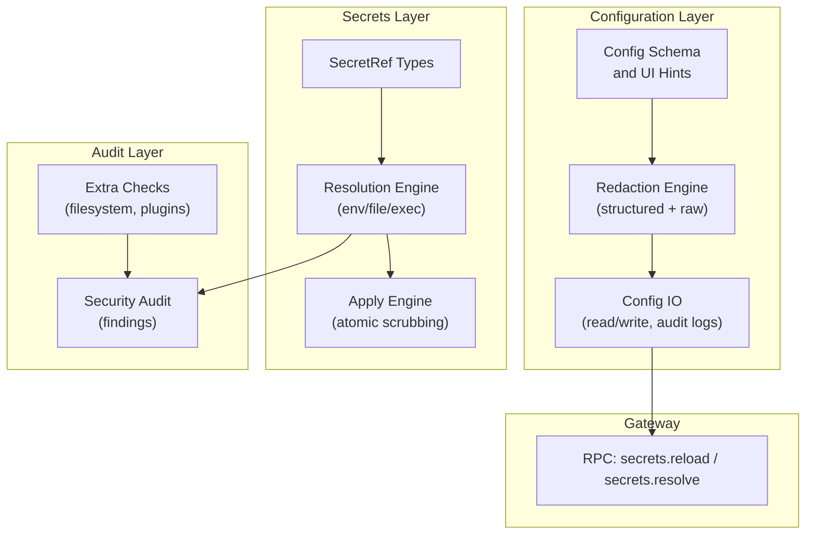
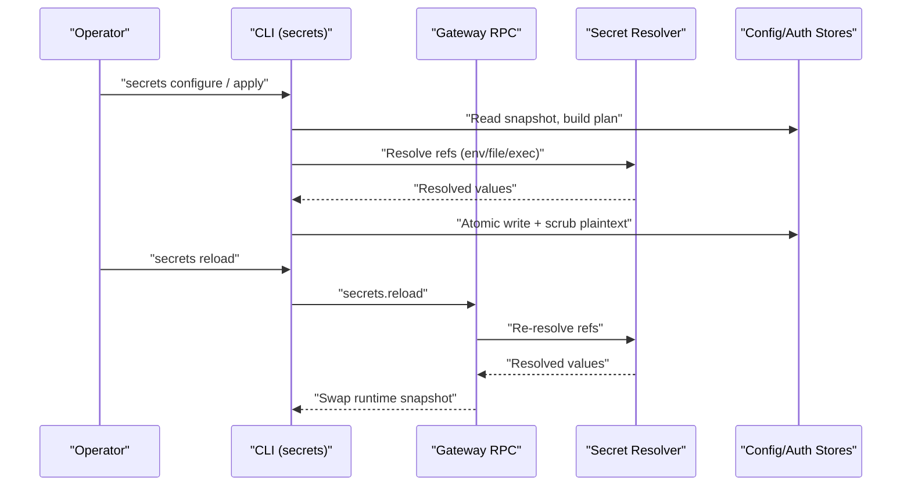
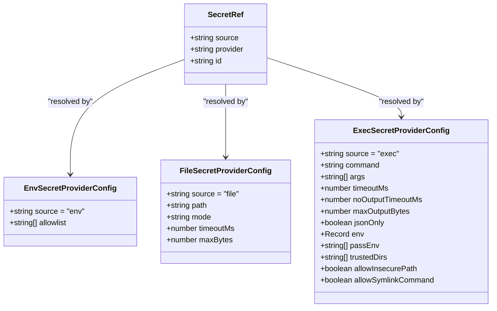
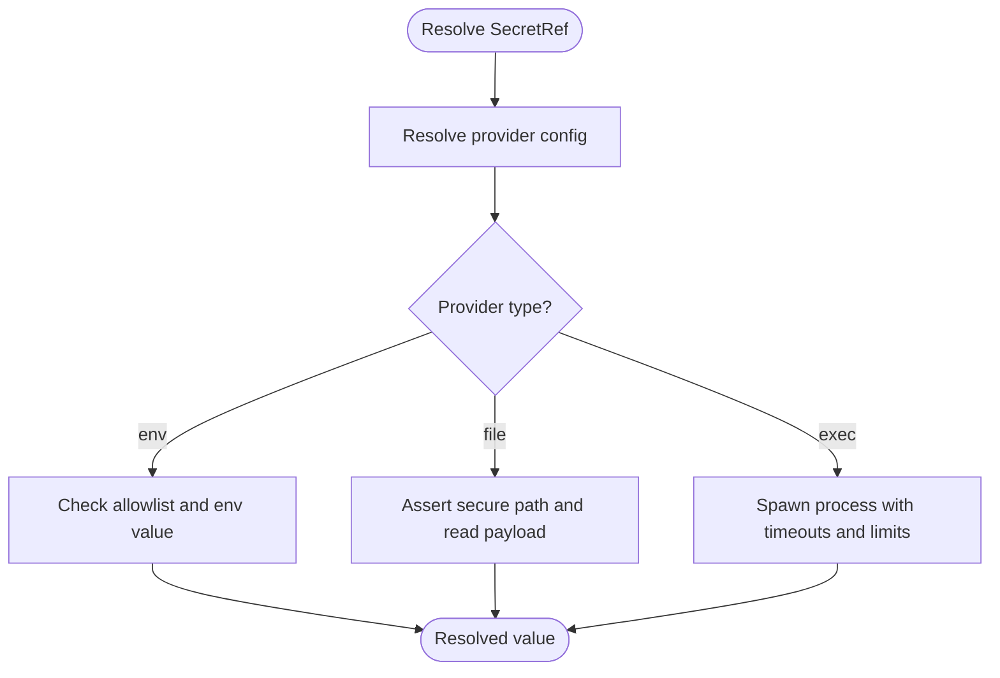
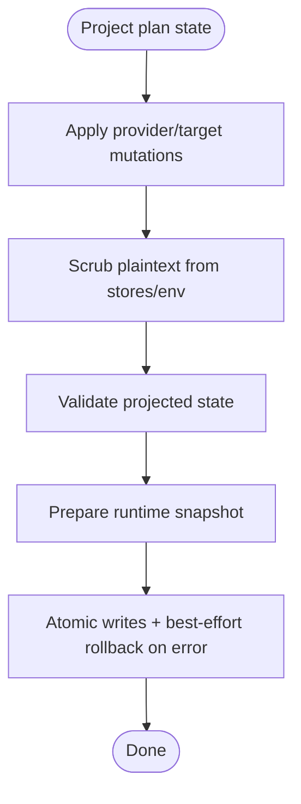
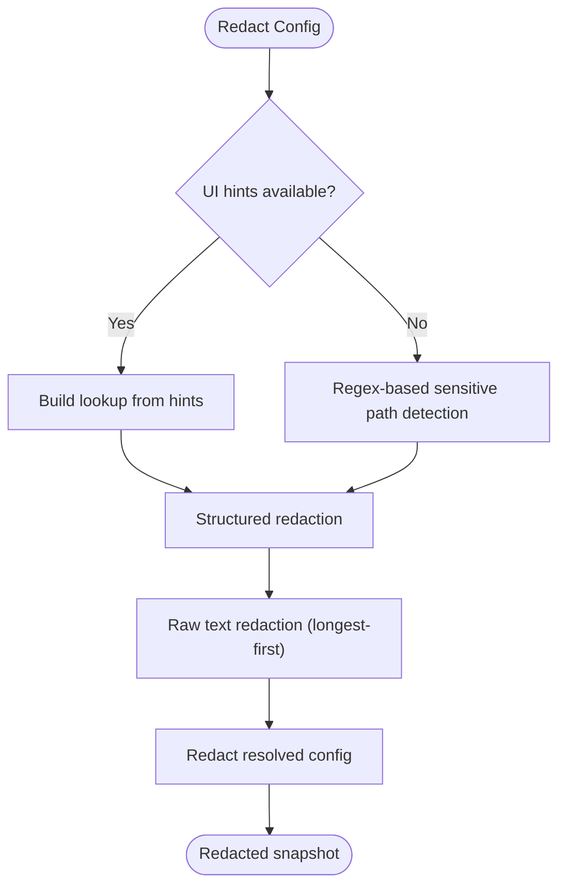
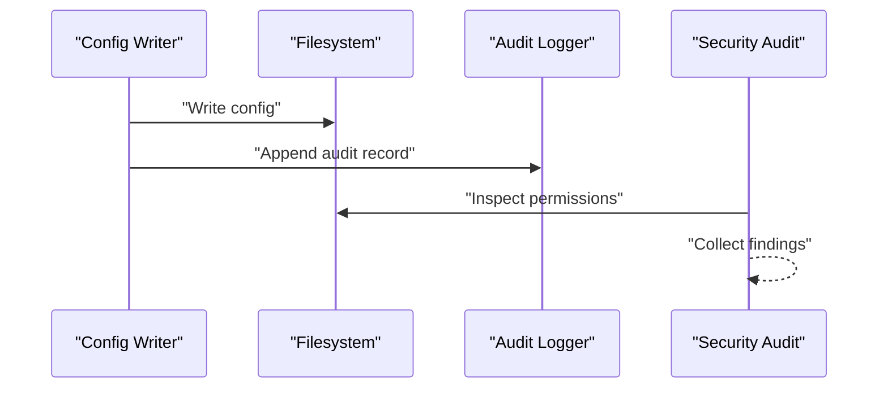
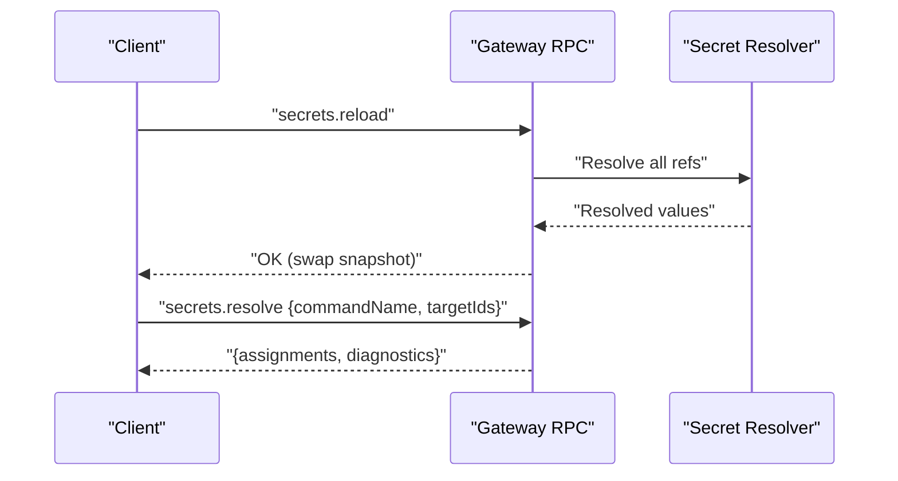
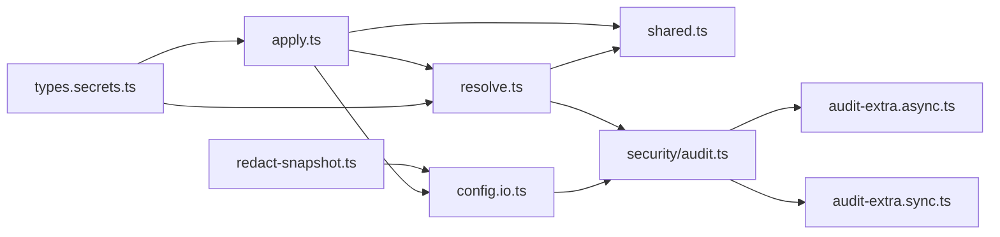

# Security Configuration

<cite>
**Referenced Files in This Document**
- [src/config/types.secrets.ts](file://src/config/types.secrets.ts)
- [src/config/redact-snapshot.ts](file://src/config/redact-snapshot.ts)
- [src/config/io.ts](file://src/config/io.ts)
- [src/config/schema.ts](file://src/config/schema.ts)
- [src/secrets/resolve.ts](file://src/secrets/resolve.ts)
- [src/secrets/apply.ts](file://src/secrets/apply.ts)
- [src/secrets/shared.ts](file://src/secrets/shared.ts)
- [src/secrets/credential-matrix.ts](file://src/secrets/credential-matrix.ts)
- [src/gateway/protocol/schema/secrets.ts](file://src/gateway/protocol/schema/secrets.ts)
- [src/gateway/server-methods/secrets.ts](file://src/gateway/server-methods/secrets.ts)
- [src/security/audit.ts](file://src/security/audit.ts)
- [src/security/audit-extra.async.ts](file://src/security/audit-extra.async.ts)
- [src/security/audit-extra.sync.ts](file://src/security/audit-extra.sync.ts)
- [docs/reference/secretref-credential-surface.md](file://docs/reference/secretref-credential-surface.md)
- [docs/cli/secrets.md](file://docs/cli/secrets.md)
</cite>

## Table of Contents
1. [Introduction](#introduction)
2. [Project Structure](#project-structure)
3. [Core Components](#core-components)
4. [Architecture Overview](#architecture-overview)
5. [Detailed Component Analysis](#detailed-component-analysis)
6. [Dependency Analysis](#dependency-analysis)
7. [Performance Considerations](#performance-considerations)
8. [Troubleshooting Guide](#troubleshooting-guide)
9. [Conclusion](#conclusion)
10. [Appendices](#appendices)

## Introduction
This document provides a comprehensive, security-focused guide to configuration management in OpenClaw. It explains how secrets are modeled, resolved, stored, and audited; how sensitive configuration data is protected; and how to harden deployments, audit for risks, and respond to incidents. It covers the SecretRef system, provider-backed resolution, access control patterns, audit logging, and compliance-oriented safeguards.

## Project Structure
OpenClaw’s security configuration spans several subsystems:
- Configuration schema and redaction: schema-driven hints and redaction of sensitive values
- Secrets resolution and application: SecretRef parsing, provider resolution, and atomic scrubbing
- Audit and hardening: filesystem, gateway, and plugin security checks
- Gateway RPC: runtime reload and resolution APIs for secrets

**Diagram sources**
- [src/config/schema.ts](file://src/config/schema.ts#L1-L200)
- [src/config/redact-snapshot.ts](file://src/config/redact-snapshot.ts#L1-L402)
- [src/config/io.ts](file://src/config/io.ts#L507-L554)
- [src/config/types.secrets.ts](file://src/config/types.secrets.ts#L1-L225)
- [src/secrets/resolve.ts](file://src/secrets/resolve.ts#L1-L200)
- [src/secrets/apply.ts](file://src/secrets/apply.ts#L1-L120)
- [src/security/audit.ts](file://src/security/audit.ts#L1-L120)
- [src/security/audit-extra.async.ts](file://src/security/audit-extra.async.ts#L1095-L1127)
- [src/gateway/protocol/schema/secrets.ts](file://src/gateway/protocol/schema/secrets.ts#L1-L35)
- [src/gateway/server-methods/secrets.ts](file://src/gateway/server-methods/secrets.ts#L26-L68)

**Section sources**
- [src/config/schema.ts](file://src/config/schema.ts#L1-L200)
- [src/config/redact-snapshot.ts](file://src/config/redact-snapshot.ts#L1-L402)
- [src/config/io.ts](file://src/config/io.ts#L507-L554)
- [src/config/types.secrets.ts](file://src/config/types.secrets.ts#L1-L225)
- [src/secrets/resolve.ts](file://src/secrets/resolve.ts#L1-L200)
- [src/secrets/apply.ts](file://src/secrets/apply.ts#L1-L120)
- [src/security/audit.ts](file://src/security/audit.ts#L1-L120)
- [src/security/audit-extra.async.ts](file://src/security/audit-extra.async.ts#L1095-L1127)
- [src/gateway/protocol/schema/secrets.ts](file://src/gateway/protocol/schema/secrets.ts#L1-L35)
- [src/gateway/server-methods/secrets.ts](file://src/gateway/server-methods/secrets.ts#L26-L68)

## Core Components
- SecretRef model and providers: SecretRef types, provider configs (env/file/exec), and defaults
- Resolution engine: concurrency limits, timeouts, path security checks, and provider-specific parsing
- Apply engine: atomic writes, scrubbing of plaintext residues, and best-effort rollback
- Redaction: structured and raw redaction of sensitive values for UI and logs
- Audit: filesystem, gateway, and plugin hardening checks; audit logs for write events
- Gateway RPC: secrets.reload and secrets.resolve for runtime snapshot updates

**Section sources**
- [src/config/types.secrets.ts](file://src/config/types.secrets.ts#L1-L225)
- [src/secrets/resolve.ts](file://src/secrets/resolve.ts#L165-L274)
- [src/secrets/apply.ts](file://src/secrets/apply.ts#L179-L257)
- [src/config/redact-snapshot.ts](file://src/config/redact-snapshot.ts#L353-L402)
- [src/config/io.ts](file://src/config/io.ts#L540-L554)
- [src/gateway/protocol/schema/secrets.ts](file://src/gateway/protocol/schema/secrets.ts#L1-L35)

## Architecture Overview
The secrets lifecycle integrates configuration, resolution, auditing, and runtime updates:

**Diagram sources**
- [docs/cli/secrets.md](file://docs/cli/secrets.md#L21-L30)
- [src/gateway/server-methods/secrets.ts](file://src/gateway/server-methods/secrets.ts#L26-L68)
- [src/secrets/resolve.ts](file://src/secrets/resolve.ts#L784-L800)
- [src/secrets/apply.ts](file://src/secrets/apply.ts#L700-L778)

## Detailed Component Analysis

### SecretRef Model and Providers
- SecretRef supports three sources: env, file, and exec. Each ref carries a provider alias and an id.
- Provider configs define allowlists, file modes, timeouts, and environment propagation.
- Defaults for provider aliases are supported for concise configuration.

**Diagram sources**
- [src/config/types.secrets.ts](file://src/config/types.secrets.ts#L10-L225)

**Section sources**
- [src/config/types.secrets.ts](file://src/config/types.secrets.ts#L1-L225)

### Resolution Engine: Security Controls and Limits
- Concurrency and batch limits prevent resource exhaustion during provider resolution.
- Path security checks enforce absolute paths, disallow symlinks (with exceptions), and validate ownership and permissions.
- File provider enforces size limits and single-value mode when required.
- Exec provider enforces protocolVersion, validates JSON output, and applies timeouts and output limits.
- Environment provider enforces allowlists and rejects missing or empty values.

**Diagram sources**
- [src/secrets/resolve.ts](file://src/secrets/resolve.ts#L165-L274)
- [src/secrets/resolve.ts](file://src/secrets/resolve.ts#L276-L426)
- [src/secrets/resolve.ts](file://src/secrets/resolve.ts#L650-L782)

**Section sources**
- [src/secrets/resolve.ts](file://src/secrets/resolve.ts#L165-L274)
- [src/secrets/resolve.ts](file://src/secrets/resolve.ts#L276-L426)
- [src/secrets/resolve.ts](file://src/secrets/resolve.ts#L650-L782)

### Apply Engine: Atomic Writes and Scrubbing
- Projected state builds a next configuration and identifies changed files.
- Scrubs plaintext values from:
  - Auth-profile stores (removes api_key/token fields and references)
  - Legacy auth.json stores
  - Known secret keys in ~/.openclaw/.env
- Validates projected state by resolving refs and preparing a runtime snapshot.
- Atomic writes use temporary files and rename to minimize partial-state exposure.

**Diagram sources**
- [src/secrets/apply.ts](file://src/secrets/apply.ts#L179-L257)
- [src/secrets/apply.ts](file://src/secrets/apply.ts#L341-L397)
- [src/secrets/apply.ts](file://src/secrets/apply.ts#L627-L668)
- [src/secrets/apply.ts](file://src/secrets/apply.ts#L700-L778)

**Section sources**
- [src/secrets/apply.ts](file://src/secrets/apply.ts#L179-L257)
- [src/secrets/apply.ts](file://src/secrets/apply.ts#L341-L397)
- [src/secrets/apply.ts](file://src/secrets/apply.ts#L627-L668)
- [src/secrets/apply.ts](file://src/secrets/apply.ts#L700-L778)

### Redaction and Sensitive Data Handling
- Structured redaction uses UI hints to mark sensitive paths and replaces values with a sentinel.
- Raw redaction collects sensitive strings and replaces them in JSON5 source text.
- Restore mechanism replaces sentinels with original values during write operations to preserve user intent.

**Diagram sources**
- [src/config/redact-snapshot.ts](file://src/config/redact-snapshot.ts#L116-L125)
- [src/config/redact-snapshot.ts](file://src/config/redact-snapshot.ts#L312-L319)
- [src/config/redact-snapshot.ts](file://src/config/redact-snapshot.ts#L353-L402)

**Section sources**
- [src/config/redact-snapshot.ts](file://src/config/redact-snapshot.ts#L116-L125)
- [src/config/redact-snapshot.ts](file://src/config/redact-snapshot.ts#L312-L319)
- [src/config/redact-snapshot.ts](file://src/config/redact-snapshot.ts#L353-L402)

### Audit Logging and Hardening
- Config write audit logs capture metadata, suspicious changes, and process context.
- Security audit scans filesystem permissions, gateway exposure, control UI origins, and plugin/code safety.
- Extra checks include state directory permissions, log file permissions, and include file permissions.

**Diagram sources**
- [src/config/io.ts](file://src/config/io.ts#L540-L554)
- [src/security/audit.ts](file://src/security/audit.ts#L208-L337)
- [src/security/audit-extra.async.ts](file://src/security/audit-extra.async.ts#L1095-L1127)

**Section sources**
- [src/config/io.ts](file://src/config/io.ts#L540-L554)
- [src/security/audit.ts](file://src/security/audit.ts#L208-L337)
- [src/security/audit-extra.async.ts](file://src/security/audit-extra.async.ts#L1095-L1127)

### Gateway RPC: Runtime Reload and Resolution
- secrets.reload re-resolves refs and swaps the runtime snapshot only on full success.
- secrets.resolve validates parameters and returns assignments and diagnostics.

**Diagram sources**
- [src/gateway/server-methods/secrets.ts](file://src/gateway/server-methods/secrets.ts#L26-L68)
- [src/gateway/protocol/schema/secrets.ts](file://src/gateway/protocol/schema/secrets.ts#L6-L33)

**Section sources**
- [src/gateway/server-methods/secrets.ts](file://src/gateway/server-methods/secrets.ts#L26-L68)
- [src/gateway/protocol/schema/secrets.ts](file://src/gateway/protocol/schema/secrets.ts#L6-L33)

### Secure Configuration Deployment and Rotation
- Use the operator loop: audit → configure → dry-run apply → apply → audit → reload.
- Providers: configure env/file/exec providers with allowlists, trustedDirs, and timeouts.
- Rotation: update SecretRef targets; run apply with scrubbing; reload to activate.

**Section sources**
- [docs/cli/secrets.md](file://docs/cli/secrets.md#L21-L30)
- [docs/cli/secrets.md](file://docs/cli/secrets.md#L93-L131)
- [docs/cli/secrets.md](file://docs/cli/secrets.md#L138-L158)

### Incident Response Procedures
- If unresolved refs are detected, prioritize fixing provider configuration or environment variables.
- If plaintext residues remain, re-run configure and apply with scrubbing enabled.
- For permission issues, adjust filesystem permissions and re-run audit.
- For gateway exposure, tighten bind/auth and control UI allowed origins.

**Section sources**
- [docs/cli/secrets.md](file://docs/cli/secrets.md#L78-L82)
- [src/security/audit.ts](file://src/security/audit.ts#L428-L436)
- [src/security/audit.ts](file://src/security/audit.ts#L463-L480)

### Security Validation, Assessment, and Penetration Testing
- Use audit --check to gate PRs and CI pipelines.
- Validate provider setups with exec/file path security and env allowlists.
- PenTest: enumerate gateway exposure, control UI origins, and plugin/code safety; verify redaction in UI and logs.

**Section sources**
- [docs/cli/secrets.md](file://docs/cli/secrets.md#L32-L36)
- [src/security/audit.ts](file://src/security/audit.ts#L1-L120)
- [src/security/audit-extra.async.ts](file://src/security/audit-extra.async.ts#L1095-L1127)

## Dependency Analysis
- SecretRef types depend on provider configs; resolution depends on filesystem and environment; apply depends on atomic file writes and snapshot preparation.
- Audit depends on filesystem inspection and gateway probing; redaction depends on schema hints and regex heuristics.

**Diagram sources**
- [src/config/types.secrets.ts](file://src/config/types.secrets.ts#L1-L225)
- [src/secrets/resolve.ts](file://src/secrets/resolve.ts#L1-L120)
- [src/secrets/apply.ts](file://src/secrets/apply.ts#L1-L120)
- [src/secrets/shared.ts](file://src/secrets/shared.ts#L1-L86)
- [src/config/io.ts](file://src/config/io.ts#L507-L554)
- [src/config/redact-snapshot.ts](file://src/config/redact-snapshot.ts#L1-L120)
- [src/security/audit.ts](file://src/security/audit.ts#L1-L120)
- [src/security/audit-extra.async.ts](file://src/security/audit-extra.async.ts#L1095-L1127)
- [src/security/audit-extra.sync.ts](file://src/security/audit-extra.sync.ts#L1-L41)

**Section sources**
- [src/config/types.secrets.ts](file://src/config/types.secrets.ts#L1-L225)
- [src/secrets/resolve.ts](file://src/secrets/resolve.ts#L1-L120)
- [src/secrets/apply.ts](file://src/secrets/apply.ts#L1-L120)
- [src/secrets/shared.ts](file://src/secrets/shared.ts#L1-L86)
- [src/config/io.ts](file://src/config/io.ts#L507-L554)
- [src/config/redact-snapshot.ts](file://src/config/redact-snapshot.ts#L1-L120)
- [src/security/audit.ts](file://src/security/audit.ts#L1-L120)
- [src/security/audit-extra.async.ts](file://src/security/audit-extra.async.ts#L1095-L1127)
- [src/security/audit-extra.sync.ts](file://src/security/audit-extra.sync.ts#L1-L41)

## Performance Considerations
- Resolution limits (concurrency, refs per provider, batch bytes) protect against resource exhaustion.
- Atomic writes minimize I/O overhead and reduce partial-state risk.
- Redaction prioritizes longest-first replacement to avoid partial matches and reduces log sizes.

[No sources needed since this section provides general guidance]

## Troubleshooting Guide
- Permission errors on file/exec providers: verify absolute paths, ownership, and permissions; adjust trustedDirs and allowlist flags.
- Empty or missing env values: ensure allowlist entries and environment hydration.
- Exec provider failures: validate protocolVersion, JSON output, and timeouts.
- Audit findings: address filesystem permissions, gateway bind/auth, and control UI origins.

**Section sources**
- [src/secrets/resolve.ts](file://src/secrets/resolve.ts#L206-L274)
- [src/secrets/resolve.ts](file://src/secrets/resolve.ts#L650-L782)
- [src/security/audit.ts](file://src/security/audit.ts#L208-L337)

## Conclusion
OpenClaw’s configuration security model centers on SecretRef-based resolution, provider-backed secret sourcing, atomic apply with scrubbing, robust redaction, and comprehensive audit coverage. By following the operator loop, enforcing provider security controls, and leveraging audit logs and checks, operators can deploy and operate OpenClaw with strong confidentiality, integrity, and availability for sensitive configuration data.

## Appendices

### SecretRef Credential Surface
- Supported: user-supplied credentials across providers and channels.
- Unsupported: runtime-generated, rotating, OAuth refresh, and session-like artifacts.

**Section sources**
- [docs/reference/secretref-credential-surface.md](file://docs/reference/secretref-credential-surface.md#L14-L130)

### Gateway RPC Reference
- secrets.reload: re-resolve and swap runtime snapshot.
- secrets.resolve: resolve assignments and diagnostics for given targets.

**Section sources**
- [src/gateway/protocol/schema/secrets.ts](file://src/gateway/protocol/schema/secrets.ts#L6-L33)
- [src/gateway/server-methods/secrets.ts](file://src/gateway/server-methods/secrets.ts#L26-L68)