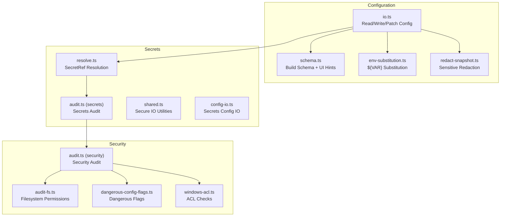
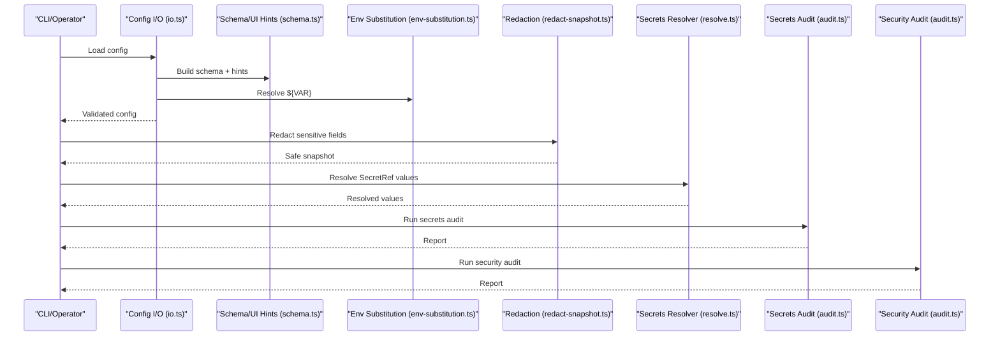
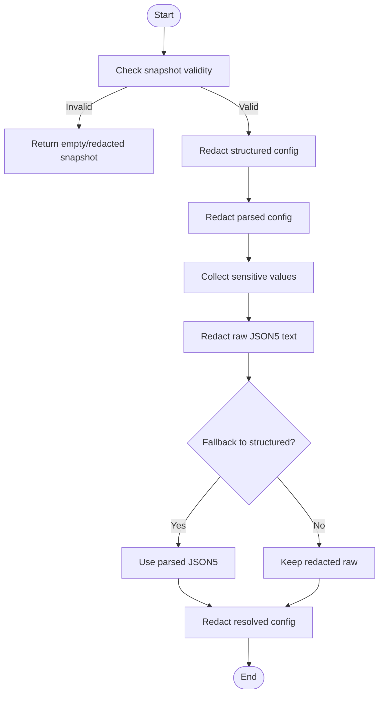
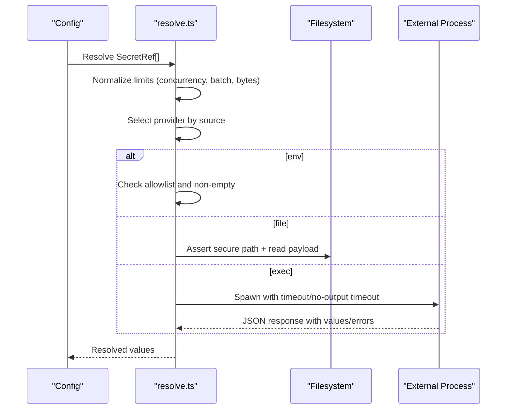
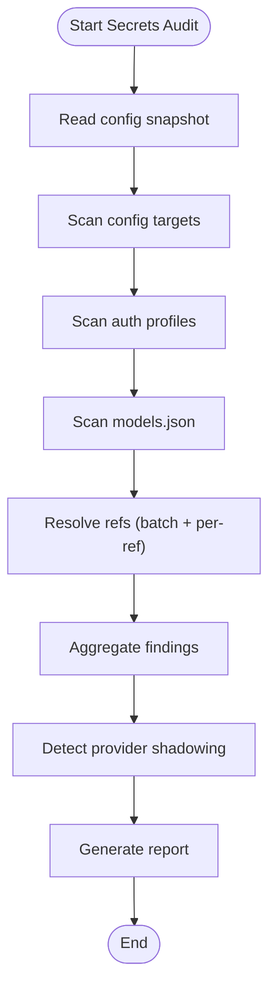
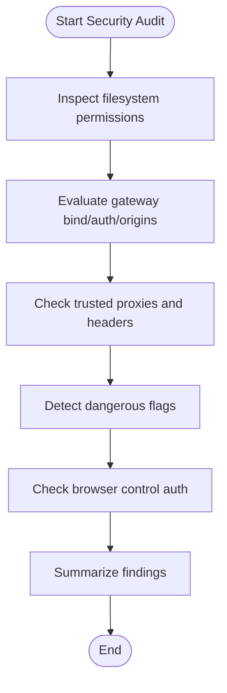
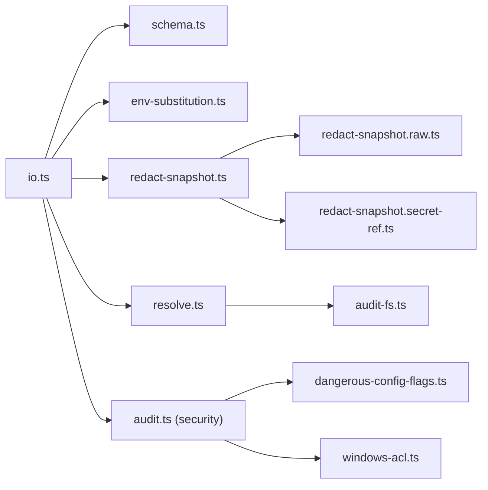

# Security Configuration

<cite>
**Referenced Files in This Document**
- [redact-snapshot.ts](file://src/config/redact-snapshot.ts)
- [redact-snapshot.secret-ref.ts](file://src/config/redact-snapshot.secret-ref.ts)
- [redact-snapshot.raw.ts](file://src/config/redact-snapshot.raw.ts)
- [schema.ts](file://src/config/schema.ts)
- [types.secrets.ts](file://src/config/types.secrets.ts)
- [env-substitution.ts](file://src/config/env-substitution.ts)
- [io.ts](file://src/config/io.ts)
- [resolve.ts](file://src/secrets/resolve.ts)
- [audit.ts (secrets)](file://src/secrets/audit.ts)
- [audit.ts (security)](file://src/security/audit.ts)
- [shared.ts](file://src/secrets/shared.ts)
- [config-io.ts](file://src/secrets/config-io.ts)
- [audit-fs.ts](file://src/security/audit-fs.ts)
- [scan-paths.ts](file://src/security/scan-paths.ts)
- [dangerous-config-flags.ts](file://src/security/dangerous-config-flags.ts)
- [windows-acl.ts](file://src/security/windows-acl.ts)
- [config.md](file://docs/cli/config.md)
- [secrets.md](file://docs/cli/secrets.md)
- [security.md](file://docs/cli/security.md)
- [configuration.md](file://docs/gateway/configuration.md)
- [configuration-reference.md](file://docs/gateway/configuration-reference.md)
- [configuration-examples.md](file://docs/gateway/configuration-examples.md)
- [secrets.md (gateway)](file://docs/gateway/secrets.md)
- [secrets-plan-contract.md](file://docs/gateway/secrets-plan-contract.md)
- [secretref-credential-surface.md](file://docs/reference/secretref-credential-surface.md)
</cite>

## Table of Contents
1. [Introduction](#introduction)
2. [Project Structure](#project-structure)
3. [Core Components](#core-components)
4. [Architecture Overview](#architecture-overview)
5. [Detailed Component Analysis](#detailed-component-analysis)
6. [Dependency Analysis](#dependency-analysis)
7. [Performance Considerations](#performance-considerations)
8. [Troubleshooting Guide](#troubleshooting-guide)
9. [Conclusion](#conclusion)
10. [Appendices](#appendices)

## Introduction
This document provides a comprehensive guide to security-focused configuration management in OpenClaw. It covers secure configuration practices, credential handling, sensitive data protection, configuration redaction, secret management, access control, encryption strategies, secure storage, transmission security, auditing, integrity verification, and compliance considerations. The goal is to help operators deploy and operate OpenClaw securely while minimizing risk from misconfiguration, credential leakage, and insecure access.

## Project Structure
OpenClaw’s security configuration spans several modules:
- Configuration parsing, validation, and redaction
- Secret reference resolution and storage scanning
- Security audit and filesystem permission inspection
- Gateway configuration and secrets integration

```mermaid
graph TB
subgraph "Configuration"
A["io.ts<br/>Read/Write/Patch Config"]
B["schema.ts<br/>Build Schema + UI Hints"]
C["env-substitution.ts<br/>${VAR} Substitution"]
D["redact-snapshot.ts<br/>Sensitive Redaction"]
end
subgraph "Secrets"
E["resolve.ts<br/>SecretRef Resolution"]
F["audit.ts (secrets)<br/>Secrets Audit"]
G["shared.ts<br/>Secure IO Utilities"]
H["config-io.ts<br/>Secrets Config IO"]
end
subgraph "Security"
I["audit.ts (security)<br/>Security Audit"]
J["audit-fs.ts<br/>Filesystem Permissions"]
K["dangerous-config-flags.ts<br/>Dangerous Flags"]
L["windows-acl.ts<br/>ACL Checks"]
end
A --> B
A --> C
A --> D
A --> E
E --> F
F --> I
I --> J
I --> K
I --> L
```

**Diagram sources**
- [io.ts:725-800](file://src/config/io.ts#L725-L800)
- [schema.ts:429-484](file://src/config/schema.ts#L429-L484)
- [env-substitution.ts:197-204](file://src/config/env-substitution.ts#L197-L204)
- [redact-snapshot.ts:378-431](file://src/config/redact-snapshot.ts#L378-L431)
- [resolve.ts:1-120](file://src/secrets/resolve.ts#L1-L120)
- [audit.ts (secrets):601-683](file://src/secrets/audit.ts#L601-L683)
- [audit.ts (security):1-120](file://src/security/audit.ts#L1-L120)
- [audit-fs.ts:1-120](file://src/security/audit-fs.ts#L1-L120)
- [dangerous-config-flags.ts:1-120](file://src/security/dangerous-config-flags.ts#L1-L120)
- [windows-acl.ts:1-120](file://src/security/windows-acl.ts#L1-L120)

**Section sources**
- [io.ts:725-800](file://src/config/io.ts#L725-L800)
- [schema.ts:429-484](file://src/config/schema.ts#L429-L484)
- [env-substitution.ts:197-204](file://src/config/env-substitution.ts#L197-L204)
- [redact-snapshot.ts:378-431](file://src/config/redact-snapshot.ts#L378-L431)
- [resolve.ts:1-120](file://src/secrets/resolve.ts#L1-L120)
- [audit.ts (secrets):601-683](file://src/secrets/audit.ts#L601-L683)
- [audit.ts (security):1-120](file://src/security/audit.ts#L1-L120)
- [audit-fs.ts:1-120](file://src/security/audit-fs.ts#L1-L120)
- [dangerous-config-flags.ts:1-120](file://src/security/dangerous-config-flags.ts#L1-L120)
- [windows-acl.ts:1-120](file://src/security/windows-acl.ts#L1-L120)

## Core Components
- Configuration I/O and validation: Reads, parses, validates, normalizes, and writes configuration with include support, environment substitution, and runtime overrides.
- Schema and UI hints: Builds a JSON schema augmented with UI hints and sensitive-path tagging for redaction.
- Environment variable substitution: Safely resolves ${VAR} placeholders with strict uppercase naming rules and optional missing-var warnings.
- Redaction pipeline: Removes sensitive values from snapshots and raw config text, preserving structure integrity and restoring values during write operations.
- Secret reference resolution: Securely resolves SecretRef objects from env, file, or exec providers with concurrency limits, timeouts, and path security checks.
- Secrets audit: Scans config, auth stores, and models.json for plaintext secrets, unresolved refs, and legacy residues.
- Security audit: Reviews gateway exposure, control UI origins, trusted proxies, dangerous flags, filesystem permissions, and browser control auth.
- Secure IO utilities: Atomic writes, secure chmod, and temporary file handling to prevent leakage.

**Section sources**
- [io.ts:725-800](file://src/config/io.ts#L725-L800)
- [schema.ts:429-484](file://src/config/schema.ts#L429-L484)
- [env-substitution.ts:197-204](file://src/config/env-substitution.ts#L197-L204)
- [redact-snapshot.ts:378-431](file://src/config/redact-snapshot.ts#L378-L431)
- [resolve.ts:1-120](file://src/secrets/resolve.ts#L1-L120)
- [audit.ts (secrets):601-683](file://src/secrets/audit.ts#L601-L683)
- [audit.ts (security):1-120](file://src/security/audit.ts#L1-L120)
- [shared.ts:45-64](file://src/secrets/shared.ts#L45-L64)

## Architecture Overview
The security configuration architecture integrates configuration lifecycle with secret management and security auditing.

```mermaid
sequenceDiagram
participant CLI as "CLI/Operator"
participant CFG as "Config I/O (io.ts)"
participant SCH as "Schema/UI Hints (schema.ts)"
participant ENV as "Env Substitution (env-substitution.ts)"
participant RED as "Redaction (redact-snapshot.ts)"
participant SEC as "Secrets Resolver (resolve.ts)"
participant AUDSEC as "Secrets Audit (audit.ts)"
participant AUDSECUR as "Security Audit (audit.ts)"
CLI->>CFG : Load config
CFG->>SCH : Build schema + hints
CFG->>ENV : Resolve ${VAR}
CFG-->>CLI : Validated config
CLI->>RED : Redact sensitive fields
RED-->>CLI : Safe snapshot
CLI->>SEC : Resolve SecretRef values
SEC-->>CLI : Resolved values
CLI->>AUDSEC : Run secrets audit
AUDSEC-->>CLI : Report
CLI->>AUDSECUR : Run security audit
AUDSECUR-->>CLI : Report
```

**Diagram sources**
- [io.ts:725-800](file://src/config/io.ts#L725-L800)
- [schema.ts:429-484](file://src/config/schema.ts#L429-L484)
- [env-substitution.ts:197-204](file://src/config/env-substitution.ts#L197-L204)
- [redact-snapshot.ts:378-431](file://src/config/redact-snapshot.ts#L378-L431)
- [resolve.ts:1-120](file://src/secrets/resolve.ts#L1-L120)
- [audit.ts (secrets):601-683](file://src/secrets/audit.ts#L601-L683)
- [audit.ts (security):1-120](file://src/security/audit.ts#L1-L120)

## Detailed Component Analysis

### Configuration Redaction Pipeline
The redaction pipeline ensures sensitive values are hidden from UI responses and logs while preserving structural integrity. It supports:
- Structured redaction using UI hints and sensitive-path detection
- Raw text redaction by collecting sensitive strings and replacing them in the JSON5 source
- Restoration of redacted values during write operations to avoid credential loss

```mermaid
flowchart TD
Start(["Start"]) --> CheckValid["Check snapshot validity"]
CheckValid --> |Invalid| ReturnEmpty["Return empty/redacted snapshot"]
CheckValid --> |Valid| RedactObj["Redact structured config"]
RedactObj --> RedactParsed["Redact parsed config"]
RedactParsed --> CollectVals["Collect sensitive values"]
CollectVals --> RedactRaw["Redact raw JSON5 text"]
RedactRaw --> Fallback{"Fallback to structured?"}
Fallback --> |Yes| UseParsed["Use parsed JSON5"]
Fallback --> |No| KeepRaw["Keep redacted raw"]
UseParsed --> RedactResolved["Redact resolved config"]
KeepRaw --> RedactResolved
RedactResolved --> End(["End"])
```

**Diagram sources**
- [redact-snapshot.ts:382-431](file://src/config/redact-snapshot.ts#L382-L431)
- [redact-snapshot.raw.ts:17-32](file://src/config/redact-snapshot.raw.ts#L17-L32)

**Section sources**
- [redact-snapshot.ts:378-431](file://src/config/redact-snapshot.ts#L378-L431)
- [redact-snapshot.secret-ref.ts:1-21](file://src/config/redact-snapshot.secret-ref.ts#L1-L21)
- [redact-snapshot.raw.ts:1-33](file://src/config/redact-snapshot.raw.ts#L1-L33)

### Secret Reference Resolution and Storage
Secrets are referenced via SecretRef objects and resolved from providers:
- env: allowlisted environment variables
- file: single-value or JSON payloads with path security checks
- exec: protocol-based external resolver with timeouts and output limits

```mermaid
sequenceDiagram
participant CFG as "Config"
participant RES as "resolve.ts"
participant FS as "Filesystem"
participant PROC as "External Process"
CFG->>RES : Resolve SecretRef[]
RES->>RES : Normalize limits (concurrency, batch, bytes)
RES->>RES : Select provider by source
alt env
RES->>RES : Check allowlist and non-empty
else file
RES->>FS : Assert secure path + read payload
else exec
RES->>PROC : Spawn with timeout/no-output timeout
PROC-->>RES : JSON response with values/errors
end
RES-->>CFG : Resolved values
```

**Diagram sources**
- [resolve.ts:167-180](file://src/secrets/resolve.ts#L167-L180)
- [resolve.ts:278-343](file://src/secrets/resolve.ts#L278-L343)
- [resolve.ts:378-428](file://src/secrets/resolve.ts#L378-L428)
- [resolve.ts:652-784](file://src/secrets/resolve.ts#L652-L784)

**Section sources**
- [types.secrets.ts:1-225](file://src/config/types.secrets.ts#L1-L225)
- [resolve.ts:167-180](file://src/secrets/resolve.ts#L167-L180)
- [resolve.ts:278-343](file://src/secrets/resolve.ts#L278-L343)
- [resolve.ts:378-428](file://src/secrets/resolve.ts#L378-L428)
- [resolve.ts:652-784](file://src/secrets/resolve.ts#L652-L784)

### Secrets Audit
The secrets audit scans for plaintext secrets, unresolved references, provider shadowing, and legacy residues across config, auth profiles, and models.json.

```mermaid
flowchart TD
Start(["Start Secrets Audit"]) --> ReadCfg["Read config snapshot"]
ReadCfg --> ScanCfg["Scan config targets"]
ScanCfg --> ScanAuth["Scan auth profiles"]
ScanAuth --> ScanModels["Scan models.json"]
ScanModels --> ResolveRefs["Resolve refs (batch + per-ref)"]
ResolveRefs --> Findings["Aggregate findings"]
Findings --> Shadowing["Detect provider shadowing"]
Shadowing --> Report["Generate report"]
Report --> End(["End"])
```

**Diagram sources**
- [audit.ts (secrets):601-683](file://src/secrets/audit.ts#L601-L683)

**Section sources**
- [audit.ts (secrets):601-683](file://src/secrets/audit.ts#L601-L683)

### Security Audit
The security audit evaluates gateway exposure, control UI origins, trusted proxies, dangerous flags, filesystem permissions, and browser control auth.

```mermaid
flowchart TD
Start(["Start Security Audit"]) --> FS["Inspect filesystem permissions"]
FS --> GW["Evaluate gateway bind/auth/origins"]
GW --> TRUST["Check trusted proxies and headers"]
TRUST --> FLAGS["Detect dangerous flags"]
FLAGS --> BROWSER["Check browser control auth"]
BROWSER --> Report["Summarize findings"]
Report --> End(["End"])
```

**Diagram sources**
- [audit.ts (security):221-350](file://src/security/audit.ts#L221-L350)
- [audit.ts (security):352-701](file://src/security/audit.ts#L352-L701)
- [audit.ts (security):732-800](file://src/security/audit.ts#L732-L800)

**Section sources**
- [audit.ts (security):221-350](file://src/security/audit.ts#L221-L350)
- [audit.ts (security):352-701](file://src/security/audit.ts#L352-L701)
- [audit.ts (security):732-800](file://src/security/audit.ts#L732-L800)

### Secure Storage and Transmission
- Secure file creation and atomic writes: Ensures minimal exposure windows and correct permissions.
- Path security: Enforces absolute paths, disallows symlinks (with opt-in), and verifies ownership and permissions.
- Transmission security: Gateways and control UI should be protected by tokens, trusted proxies, or Tailscale serve/funnel modes with strict origin policies.

**Section sources**
- [shared.ts:45-64](file://src/secrets/shared.ts#L45-L64)
- [resolve.ts:208-276](file://src/secrets/resolve.ts#L208-L276)
- [audit-fs.ts:1-120](file://src/security/audit-fs.ts#L1-L120)
- [audit.ts (security):352-701](file://src/security/audit.ts#L352-L701)

## Dependency Analysis
- Configuration I/O depends on schema generation, environment substitution, and includes resolution.
- Redaction depends on schema hints and sensitive-path detection.
- Secret resolution depends on filesystem permissions and provider contracts.
- Security audit depends on filesystem inspection, dangerous flags, and gateway configuration.

```mermaid
graph LR
io_ts["io.ts"] --> schema_ts["schema.ts"]
io_ts --> env_sub["env-substitution.ts"]
io_ts --> redact["redact-snapshot.ts"]
redact --> redact_raw["redact-snapshot.raw.ts"]
redact --> redact_ref["redact-snapshot.secret-ref.ts"]
io_ts --> resolve_ts["resolve.ts"]
resolve_ts --> audit_fs["audit-fs.ts"]
io_ts --> audit_sec["audit.ts (security)"]
audit_sec --> dangerous_flags["dangerous-config-flags.ts"]
audit_sec --> windows_acl["windows-acl.ts"]
```

**Diagram sources**
- [io.ts:725-800](file://src/config/io.ts#L725-L800)
- [schema.ts:429-484](file://src/config/schema.ts#L429-L484)
- [env-substitution.ts:197-204](file://src/config/env-substitution.ts#L197-L204)
- [redact-snapshot.ts:378-431](file://src/config/redact-snapshot.ts#L378-L431)
- [redact-snapshot.raw.ts:1-33](file://src/config/redact-snapshot.raw.ts#L1-L33)
- [redact-snapshot.secret-ref.ts:1-21](file://src/config/redact-snapshot.secret-ref.ts#L1-L21)
- [resolve.ts:1-120](file://src/secrets/resolve.ts#L1-L120)
- [audit-fs.ts:1-120](file://src/security/audit-fs.ts#L1-L120)
- [audit.ts (security):1-120](file://src/security/audit.ts#L1-L120)
- [dangerous-config-flags.ts:1-120](file://src/security/dangerous-config-flags.ts#L1-L120)
- [windows-acl.ts:1-120](file://src/security/windows-acl.ts#L1-L120)

**Section sources**
- [io.ts:725-800](file://src/config/io.ts#L725-L800)
- [schema.ts:429-484](file://src/config/schema.ts#L429-L484)
- [env-substitution.ts:197-204](file://src/config/env-substitution.ts#L197-L204)
- [redact-snapshot.ts:378-431](file://src/config/redact-snapshot.ts#L378-L431)
- [redact-snapshot.raw.ts:1-33](file://src/config/redact-snapshot.raw.ts#L1-L33)
- [redact-snapshot.secret-ref.ts:1-21](file://src/config/redact-snapshot.secret-ref.ts#L1-L21)
- [resolve.ts:1-120](file://src/secrets/resolve.ts#L1-L120)
- [audit-fs.ts:1-120](file://src/security/audit-fs.ts#L1-L120)
- [audit.ts (security):1-120](file://src/security/audit.ts#L1-L120)
- [dangerous-config-flags.ts:1-120](file://src/security/dangerous-config-flags.ts#L1-L120)
- [windows-acl.ts:1-120](file://src/security/windows-acl.ts#L1-L120)

## Performance Considerations
- Concurrency limits for secret resolution prevent resource exhaustion.
- Batch sizes and timeouts bound exec and file providers to mitigate DoS.
- Schema caching reduces repeated computation for plugin/channel additions.
- Atomic writes minimize disk contention and reduce partial writes.

[No sources needed since this section provides general guidance]

## Troubleshooting Guide
Common issues and mitigations:
- Missing environment variables in ${VAR} substitution: Configure required env vars or use onMissing callback to warn instead of fail.
- Unresolved SecretRef: Verify provider configuration, allowlists, and path security; run secrets audit to identify failures.
- Plaintext secrets detected: Migrate to SecretRef; review provider configurations and file permissions.
- Exposed gateway or control UI: Enforce strict allowed origins, disable wildcard origins, and use loopback-only or trusted proxy modes.
- Dangerous flags enabled: Disable flags when not debugging; restrict exposure to trusted networks.

**Section sources**
- [env-substitution.ts:29-37](file://src/config/env-substitution.ts#L29-L37)
- [env-substitution.ts:197-204](file://src/config/env-substitution.ts#L197-L204)
- [resolve.ts:167-180](file://src/secrets/resolve.ts#L167-L180)
- [audit.ts (secrets):601-683](file://src/secrets/audit.ts#L601-L683)
- [audit.ts (security):352-701](file://src/security/audit.ts#L352-L701)
- [dangerous-config-flags.ts:1-120](file://src/security/dangerous-config-flags.ts#L1-L120)

## Conclusion
OpenClaw’s security configuration framework combines robust configuration I/O, schema-driven redaction, secure secret resolution, and comprehensive audits to minimize risk. Operators should enforce strict provider security, audit regularly, and apply least-privilege principles for gateway exposure and control UI access.

[No sources needed since this section summarizes without analyzing specific files]

## Appendices

### Secure Configuration Patterns
- Prefer SecretRef over plaintext credentials; use env allowlists and file provider path security.
- Enforce strict gateway bind/auth and control UI allowed origins; avoid wildcard origins.
- Use atomic writes and secure chmod for sensitive files; avoid world/group readability.
- Regularly run secrets and security audits; address findings promptly.

**Section sources**
- [types.secrets.ts:176-225](file://src/config/types.secrets.ts#L176-L225)
- [resolve.ts:208-276](file://src/secrets/resolve.ts#L208-L276)
- [shared.ts:45-64](file://src/secrets/shared.ts#L45-L64)
- [audit.ts (security):352-701](file://src/security/audit.ts#L352-L701)
- [audit.ts (secrets):601-683](file://src/secrets/audit.ts#L601-L683)

### Compliance and Regulatory Considerations
- Data minimization: Limit sensitive data in configuration; redact where possible.
- Access control: Restrict filesystem permissions; use trusted proxies and strict origins.
- Integrity and auditability: Maintain config audit logs; validate schema and signatures where applicable.
- Transport security: Prefer HTTPS/TLS for control UI and gateway exposure; avoid exposing plaintext HTTP.

**Section sources**
- [io.ts:567-581](file://src/config/io.ts#L567-L581)
- [audit.ts (security):352-701](file://src/security/audit.ts#L352-L701)

### Documentation References
- CLI configuration and secrets: [config.md](file://docs/cli/config.md), [secrets.md](file://docs/cli/secrets.md), [security.md](file://docs/cli/security.md)
- Gateway configuration and secrets: [configuration.md](file://docs/gateway/configuration.md), [configuration-reference.md](file://docs/gateway/configuration-reference.md), [configuration-examples.md](file://docs/gateway/configuration-examples.md), [secrets.md (gateway)](file://docs/gateway/secrets.md), [secrets-plan-contract.md](file://docs/gateway/secrets-plan-contract.md)
- Credential surface and reference: [secretref-credential-surface.md](file://docs/reference/secretref-credential-surface.md)

**Section sources**
- [config.md](file://docs/cli/config.md)
- [secrets.md](file://docs/cli/secrets.md)
- [security.md](file://docs/cli/security.md)
- [configuration.md](file://docs/gateway/configuration.md)
- [configuration-reference.md](file://docs/gateway/configuration-reference.md)
- [configuration-examples.md](file://docs/gateway/configuration-examples.md)
- [secrets.md (gateway)](file://docs/gateway/secrets.md)
- [secrets-plan-contract.md](file://docs/gateway/secrets-plan-contract.md)
- [secretref-credential-surface.md](file://docs/reference/secretref-credential-surface.md)