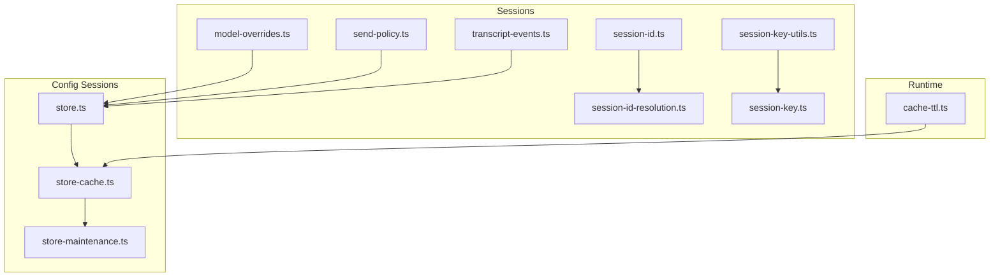
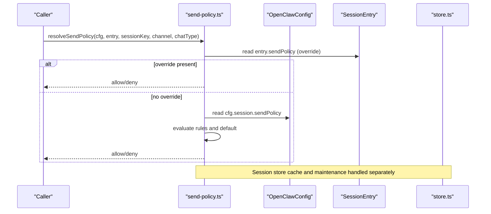
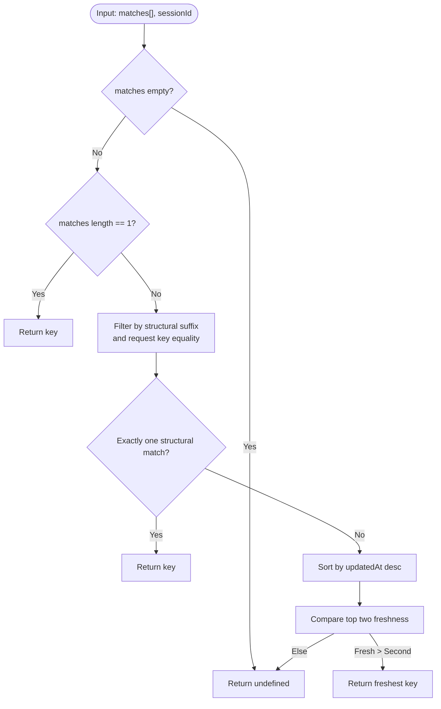
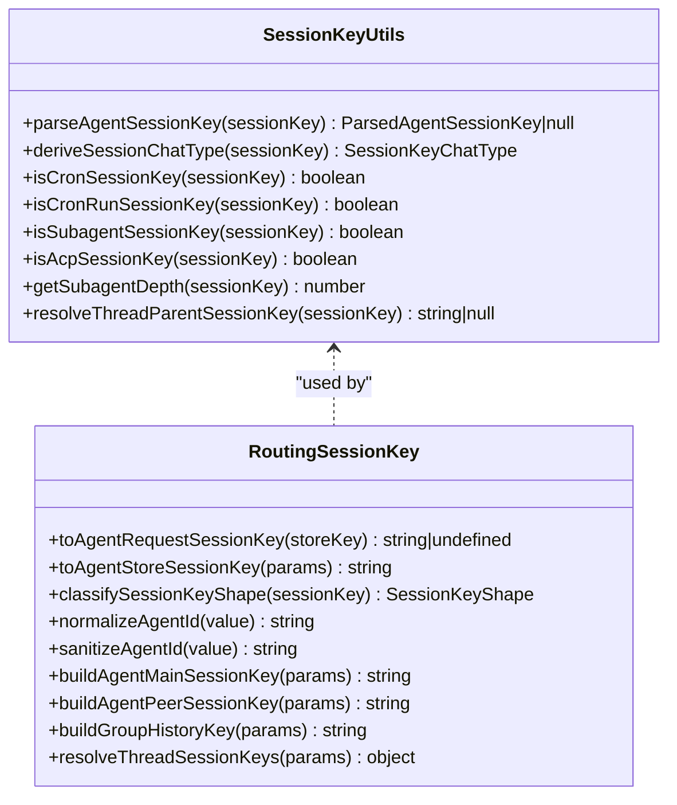
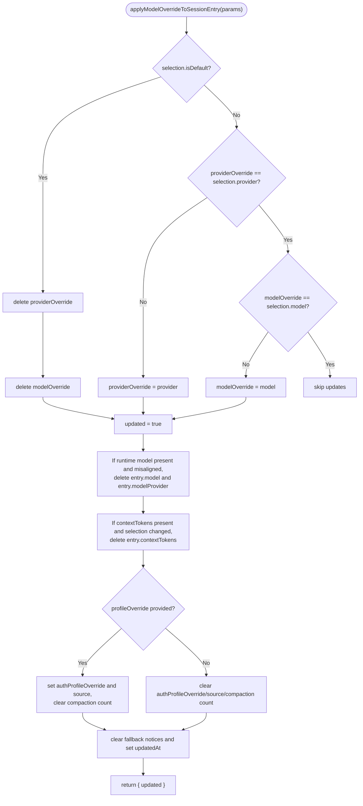
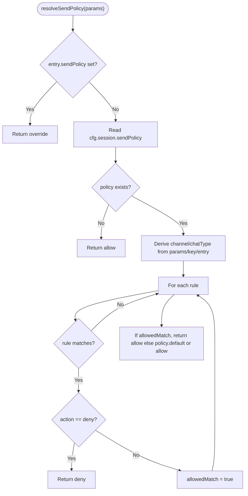
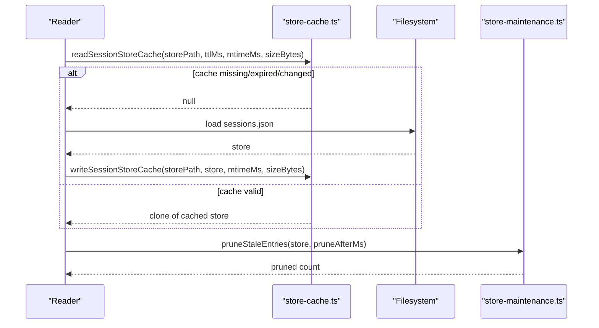
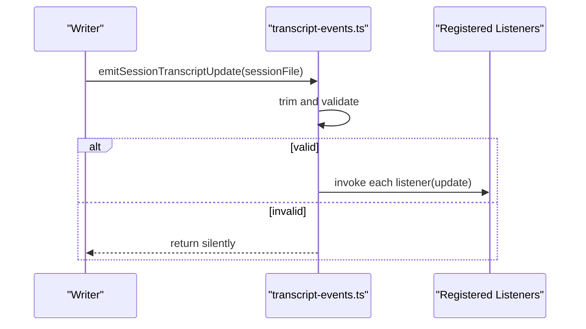
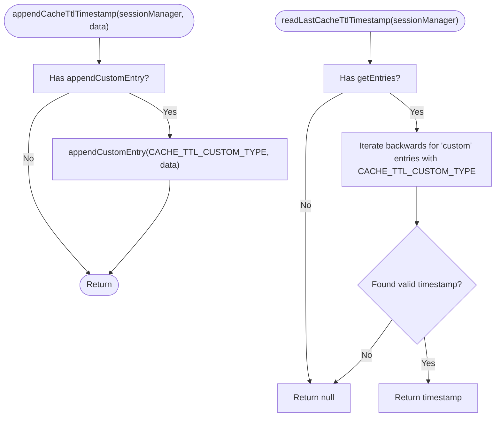
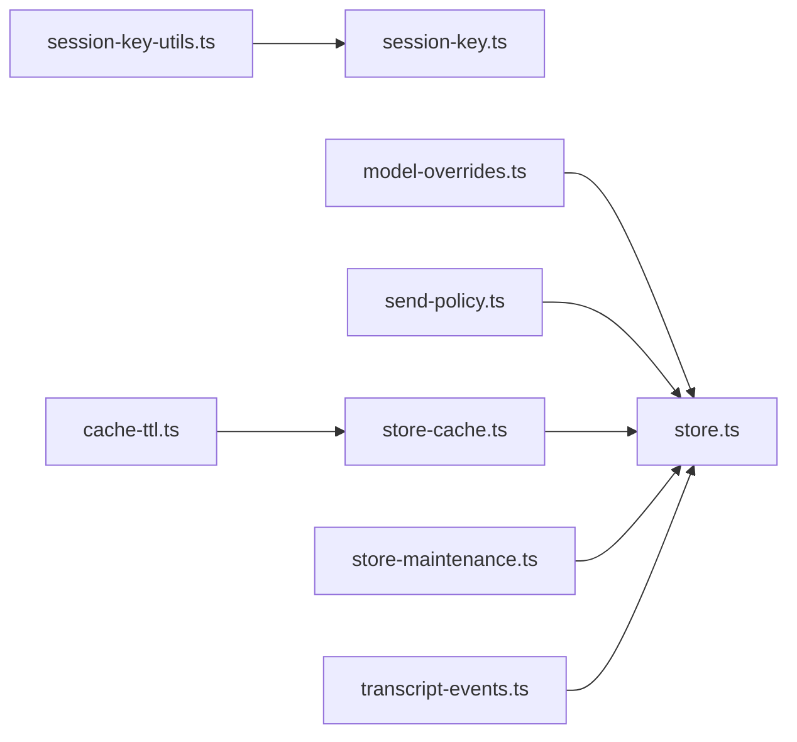

# Session Configuration

<cite>
**Referenced Files in This Document**
- [session-id.ts](file://src/sessions/session-id.ts)
- [session-id-resolution.ts](file://src/sessions/session-id-resolution.ts)
- [transcript-events.ts](file://src/sessions/transcript-events.ts)
- [model-overrides.ts](file://src/sessions/model-overrides.ts)
- [send-policy.ts](file://src/sessions/send-policy.ts)
- [session-key-utils.ts](file://src/sessions/session-key-utils.ts)
- [session-key.ts](file://src/routing/session-key.ts)
- [store.ts](file://src/config/sessions/store.ts)
- [store-cache.ts](file://src/config/sessions/store-cache.ts)
- [store-maintenance.ts](file://src/config/sessions/store-maintenance.ts)
- [cache-ttl.ts](file://src/agents/pi-embedded-runner/cache-ttl.ts)
- [configuration-reference.md](file://docs/gateway/configuration-reference.md)
- [session-config.ts](file://src/agents/test-helpers/session-config.ts)
</cite>

## Table of Contents
1. [Introduction](#introduction)
2. [Project Structure](#project-structure)
3. [Core Components](#core-components)
4. [Architecture Overview](#architecture-overview)
5. [Detailed Component Analysis](#detailed-component-analysis)
6. [Dependency Analysis](#dependency-analysis)
7. [Performance Considerations](#performance-considerations)
8. [Troubleshooting Guide](#troubleshooting-guide)
9. [Conclusion](#conclusion)
10. [Appendices](#appendices)

## Introduction
This document explains session configuration management in OpenClaw. It covers session-specific configuration options, caching strategies, lifecycle management, inheritance and defaults, customization, state persistence, cache invalidation, performance optimization, security and isolation, and practical patterns and troubleshooting.

## Project Structure
OpenClaw’s session configuration spans several subsystems:
- Session identification and resolution utilities
- Session key normalization and derivation
- Model override application and runtime alignment
- Send policy evaluation against configuration and session keys
- Session store cache and maintenance
- Transcript event broadcasting
- Test helpers for session configuration patterns

**Diagram sources**
- [session-id.ts:1-6](file://src/sessions/session-id.ts#L1-L6)
- [session-id-resolution.ts:1-38](file://src/sessions/session-id-resolution.ts#L1-L38)
- [transcript-events.ts:1-30](file://src/sessions/transcript-events.ts#L1-L30)
- [model-overrides.ts:1-113](file://src/sessions/model-overrides.ts#L1-L113)
- [send-policy.ts:1-124](file://src/sessions/send-policy.ts#L1-L124)
- [session-key-utils.ts:1-133](file://src/sessions/session-key-utils.ts#L1-L133)
- [session-key.ts:1-254](file://src/routing/session-key.ts#L1-L254)
- [store.ts:46-67](file://src/config/sessions/store.ts#L46-L67)
- [store-cache.ts:37-81](file://src/config/sessions/store-cache.ts#L37-L81)
- [store-maintenance.ts:150-178](file://src/config/sessions/store-maintenance.ts#L150-L178)
- [cache-ttl.ts:42-80](file://src/agents/pi-embedded-runner/cache-ttl.ts#L42-L80)

**Section sources**
- [session-id.ts:1-6](file://src/sessions/session-id.ts#L1-L6)
- [session-id-resolution.ts:1-38](file://src/sessions/session-id-resolution.ts#L1-L38)
- [transcript-events.ts:1-30](file://src/sessions/transcript-events.ts#L1-L30)
- [model-overrides.ts:1-113](file://src/sessions/model-overrides.ts#L1-L113)
- [send-policy.ts:1-124](file://src/sessions/send-policy.ts#L1-L124)
- [session-key-utils.ts:1-133](file://src/sessions/session-key-utils.ts#L1-L133)
- [session-key.ts:1-254](file://src/routing/session-key.ts#L1-L254)
- [store.ts:46-67](file://src/config/sessions/store.ts#L46-L67)
- [store-cache.ts:37-81](file://src/config/sessions/store-cache.ts#L37-L81)
- [store-maintenance.ts:150-178](file://src/config/sessions/store-maintenance.ts#L150-L178)
- [cache-ttl.ts:42-80](file://src/agents/pi-embedded-runner/cache-ttl.ts#L42-L80)

## Core Components
- Session identification and validation
- Session key parsing, classification, and normalization
- Model override application and runtime model alignment
- Send policy evaluation with inheritance from global and session-level configuration
- Session store cache with TTL and invalidation
- Maintenance pruning and rotation policies
- Transcript update listeners and persistence events
- Cache TTL tracking for diagnostics

**Section sources**
- [session-id.ts:1-6](file://src/sessions/session-id.ts#L1-L6)
- [session-key-utils.ts:1-133](file://src/sessions/session-key-utils.ts#L1-L133)
- [session-key.ts:1-254](file://src/routing/session-key.ts#L1-L254)
- [model-overrides.ts:1-113](file://src/sessions/model-overrides.ts#L1-L113)
- [send-policy.ts:1-124](file://src/sessions/send-policy.ts#L1-L124)
- [store.ts:46-67](file://src/config/sessions/store.ts#L46-L67)
- [store-cache.ts:37-81](file://src/config/sessions/store-cache.ts#L37-L81)
- [store-maintenance.ts:150-178](file://src/config/sessions/store-maintenance.ts#L150-L178)
- [transcript-events.ts:1-30](file://src/sessions/transcript-events.ts#L1-L30)
- [cache-ttl.ts:42-80](file://src/agents/pi-embedded-runner/cache-ttl.ts#L42-L80)

## Architecture Overview
The session configuration system integrates configuration-driven policies with runtime session keys and store caches. Global configuration provides defaults; session entries override where applicable. Model overrides and send policies are resolved dynamically. The session store caches entries with TTL and supports maintenance operations.

**Diagram sources**
- [send-policy.ts:53-124](file://src/sessions/send-policy.ts#L53-L124)
- [store.ts:46-67](file://src/config/sessions/store.ts#L46-L67)

## Detailed Component Analysis

### Session Identification and Resolution
- Validates session identifiers via regular expressions.
- Resolves preferred session keys among multiple matches using structural heuristics and recency.

**Diagram sources**
- [session-id-resolution.ts:4-37](file://src/sessions/session-id-resolution.ts#L4-L37)

**Section sources**
- [session-id.ts:1-6](file://src/sessions/session-id.ts#L1-L6)
- [session-id-resolution.ts:1-38](file://src/sessions/session-id-resolution.ts#L1-L38)

### Session Keys and Chat Type Derivation
- Parses agent-scoped session keys and derives chat types (direct, group, channel, unknown).
- Provides utilities to detect cron, subagent, and ACP session keys and to resolve thread parents.

**Diagram sources**
- [session-key-utils.ts:1-133](file://src/sessions/session-key-utils.ts#L1-L133)
- [session-key.ts:1-254](file://src/routing/session-key.ts#L1-L254)

**Section sources**
- [session-key-utils.ts:1-133](file://src/sessions/session-key-utils.ts#L1-L133)
- [session-key.ts:1-254](file://src/routing/session-key.ts#L1-L254)

### Model Overrides and Runtime Alignment
- Applies model/provider overrides to a session entry.
- Clears stale runtime model fields and context tokens when selections change.
- Updates auth profile overrides and clears fallback notices.

**Diagram sources**
- [model-overrides.ts:9-112](file://src/sessions/model-overrides.ts#L9-L112)

**Section sources**
- [model-overrides.ts:1-113](file://src/sessions/model-overrides.ts#L1-L113)

### Send Policy Evaluation and Inheritance
- Normalizes policy decisions and match criteria.
- Resolves channel and chat type from session keys or entry metadata.
- Supports rule-based matching by channel, chat type, and key prefixes; denies take precedence.

**Diagram sources**
- [send-policy.ts:53-124](file://src/sessions/send-policy.ts#L53-L124)

**Section sources**
- [send-policy.ts:1-124](file://src/sessions/send-policy.ts#L1-L124)

### Session Store Cache and Maintenance
- Session store cache supports TTL and file metadata checks to avoid serving stale data.
- Maintenance prunes stale entries and enforces rotation and retention policies.
- Environment variable controls cache TTL.

**Diagram sources**
- [store-cache.ts:37-81](file://src/config/sessions/store-cache.ts#L37-L81)
- [store.ts:46-67](file://src/config/sessions/store.ts#L46-L67)
- [store-maintenance.ts:150-178](file://src/config/sessions/store-maintenance.ts#L150-L178)

**Section sources**
- [store.ts:46-67](file://src/config/sessions/store.ts#L46-L67)
- [store-cache.ts:37-81](file://src/config/sessions/store-cache.ts#L37-L81)
- [store-maintenance.ts:150-178](file://src/config/sessions/store-maintenance.ts#L150-L178)

### Transcript Events and Persistence Hooks
- Emits transcript update notifications to registered listeners.
- Ensures non-empty, trimmed session file paths and ignores listener errors.

**Diagram sources**
- [transcript-events.ts:16-29](file://src/sessions/transcript-events.ts#L16-L29)

**Section sources**
- [transcript-events.ts:1-30](file://src/sessions/transcript-events.ts#L1-L30)

### Cache TTL Diagnostics
- Tracks last cache TTL timestamp appended to a session manager’s custom entries.
- Reads timestamps from most recent custom entries for diagnostics.

**Diagram sources**
- [cache-ttl.ts:42-80](file://src/agents/pi-embedded-runner/cache-ttl.ts#L42-L80)

**Section sources**
- [cache-ttl.ts:42-80](file://src/agents/pi-embedded-runner/cache-ttl.ts#L42-L80)

## Dependency Analysis
- Session key utilities underpin routing and session key construction.
- Send policy depends on configuration and session key parsing.
- Model overrides mutate session entries and influence runtime model fields.
- Store cache and maintenance operate independently but integrate with the session store lifecycle.
- Transcript events decouple persistence updates from session configuration logic.

**Diagram sources**
- [session-key-utils.ts:1-133](file://src/sessions/session-key-utils.ts#L1-L133)
- [session-key.ts:1-254](file://src/routing/session-key.ts#L1-L254)
- [model-overrides.ts:1-113](file://src/sessions/model-overrides.ts#L1-L113)
- [send-policy.ts:1-124](file://src/sessions/send-policy.ts#L1-L124)
- [store-cache.ts:37-81](file://src/config/sessions/store-cache.ts#L37-L81)
- [store-maintenance.ts:150-178](file://src/config/sessions/store-maintenance.ts#L150-L178)
- [transcript-events.ts:1-30](file://src/sessions/transcript-events.ts#L1-L30)
- [cache-ttl.ts:42-80](file://src/agents/pi-embedded-runner/cache-ttl.ts#L42-L80)

**Section sources**
- [session-key-utils.ts:1-133](file://src/sessions/session-key-utils.ts#L1-L133)
- [session-key.ts:1-254](file://src/routing/session-key.ts#L1-L254)
- [model-overrides.ts:1-113](file://src/sessions/model-overrides.ts#L1-L113)
- [send-policy.ts:1-124](file://src/sessions/send-policy.ts#L1-L124)
- [store-cache.ts:37-81](file://src/config/sessions/store-cache.ts#L37-L81)
- [store-maintenance.ts:150-178](file://src/config/sessions/store-maintenance.ts#L150-L178)
- [transcript-events.ts:1-30](file://src/sessions/transcript-events.ts#L1-L30)
- [cache-ttl.ts:42-80](file://src/agents/pi-embedded-runner/cache-ttl.ts#L42-L80)

## Performance Considerations
- Cache TTL tuning: Adjust OPENCLAW_SESSION_CACHE_TTL_MS to balance freshness and IO cost.
- Cache invalidation: Changes in mtime/size invalidate cache; ensure minimal churn to reduce reloads.
- Maintenance pruning: Configure pruneAfterMs and rotation thresholds to cap storage growth.
- Send policy evaluation: Prefer concise rule sets and avoid overly broad keyPrefix matches.
- Model override propagation: Frequent model switches trigger cache invalidation of contextTokens and runtime model fields.

[No sources needed since this section provides general guidance]

## Troubleshooting Guide
Common issues and resolutions:
- Unexpected sendPolicy decisions
  - Verify session entry overrides and global policy rules.
  - Confirm channel and chatType derivations from session keys.
  - Check rawKeyPrefix vs keyPrefix semantics.
  - See [send-policy.ts:53-124](file://src/sessions/send-policy.ts#L53-L124).

- Stale runtime model or contextTokens after switching models
  - Model overrides clear runtime fields and contextTokens when selections change.
  - Ensure overrides are applied and updatedAt is refreshed.
  - See [model-overrides.ts:9-112](file://src/sessions/model-overrides.ts#L9-L112).

- Session store cache serving old data
  - Check TTL and mtime/size mismatches.
  - Drop cache explicitly if needed.
  - See [store-cache.ts:37-81](file://src/config/sessions/store-cache.ts#L37-L81).

- Pruning removing expected sessions
  - Adjust pruneAfterMs and review maintenance mode.
  - See [store-maintenance.ts:150-178](file://src/config/sessions/store-maintenance.ts#L150-L178).

- Transcript update not observed
  - Ensure emitSessionTranscriptUpdate receives a non-empty session file path.
  - Confirm listeners registration and absence of thrown errors.
  - See [transcript-events.ts:16-29](file://src/sessions/transcript-events.ts#L16-L29).

- Cache TTL diagnostics
  - Append and read cache TTL timestamps for session managers.
  - See [cache-ttl.ts:42-80](file://src/agents/pi-embedded-runner/cache-ttl.ts#L42-L80).

**Section sources**
- [send-policy.ts:53-124](file://src/sessions/send-policy.ts#L53-L124)
- [model-overrides.ts:9-112](file://src/sessions/model-overrides.ts#L9-L112)
- [store-cache.ts:37-81](file://src/config/sessions/store-cache.ts#L37-L81)
- [store-maintenance.ts:150-178](file://src/config/sessions/store-maintenance.ts#L150-L178)
- [transcript-events.ts:16-29](file://src/sessions/transcript-events.ts#L16-L29)
- [cache-ttl.ts:42-80](file://src/agents/pi-embedded-runner/cache-ttl.ts#L42-L80)

## Conclusion
OpenClaw’s session configuration system combines robust key parsing, flexible policy evaluation, and efficient caching with maintenance. By leveraging session overrides, structured keys, and TTL-aware stores, operators can achieve predictable behavior, strong isolation, and reliable performance across diverse channel and agent contexts.

[No sources needed since this section summarizes without analyzing specific files]

## Appendices

### Session Configuration Reference
- dmScope options and reset policies
- Send policy matchers (channel, chatType, keyPrefix, rawKeyPrefix)
- Maintenance controls (mode, pruneAfter, maxEntries, rotateBytes, resetArchiveRetention, maxDiskBytes, highWaterBytes)
- Thread bindings defaults

See [configuration-reference.md:1599-1623](file://docs/gateway/configuration-reference.md#L1599-L1623).

**Section sources**
- [configuration-reference.md:1599-1623](file://docs/gateway/configuration-reference.md#L1599-L1623)

### Example Patterns and Customization
- Per-sender session configuration pattern
  - Demonstrates overriding mainKey and scope for per-sender isolation.
  - See [session-config.ts:1-11](file://src/agents/test-helpers/session-config.ts#L1-L11).

**Section sources**
- [session-config.ts:1-11](file://src/agents/test-helpers/session-config.ts#L1-L11)