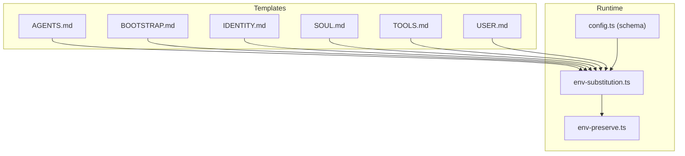
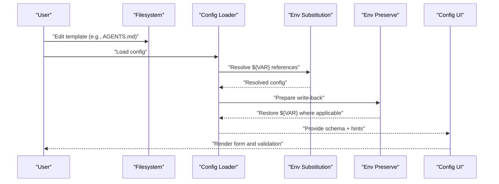
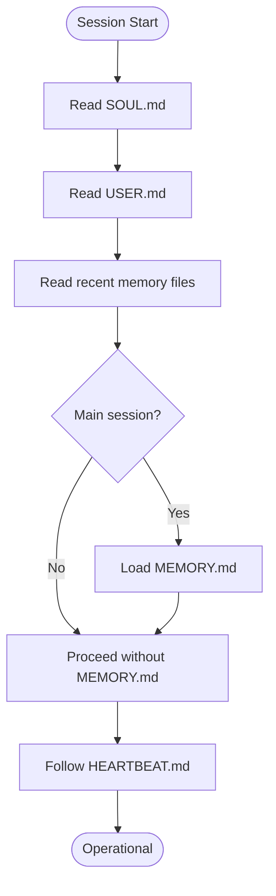
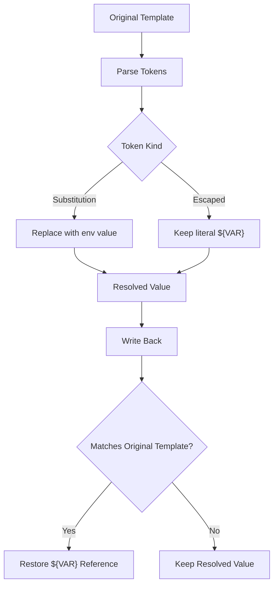
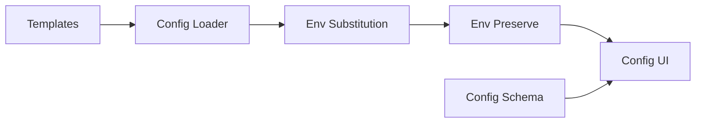

# Template System

<cite>
**Referenced Files in This Document**
- [AGENTS.md](file://docs/reference/templates/AGENTS.md)
- [BOOTSTRAP.md](file://docs/reference/templates/BOOTSTRAP.md)
- [IDENTITY.md](file://docs/reference/templates/IDENTITY.md)
- [SOUL.md](file://docs/reference/templates/SOUL.md)
- [TOOLS.md](file://docs/reference/templates/TOOLS.md)
- [USER.md](file://docs/reference/templates/USER.md)
- [env-substitution.ts](file://src/config/env-substitution.ts)
- [env-preserve.ts](file://src/config/env-preserve.ts)
- [config.ts](file://src/gateway/protocol/schema/config.ts)
- [config.ts](file://src/config/config.ts)
- [config-paths.ts](file://src/config/config-paths.ts)
- [config.acp-binding-cutover.test.ts](file://src/config/config.acp-binding-cutover.test.ts)
- [config.agent-concurrency-defaults.test.ts](file://src/config/config.agent-concurrency-defaults.test.ts)
- [config.allowlist-requires-allowfrom.test.ts](file://src/config/config.allowlist-requires-allowfrom.test.ts)
- [config.backup-rotation.test-helpers.ts](file://src/config/config.backup-rotation.test-helpers.ts)
- [config-misc.test.ts](file://src/config/config-misc.test.ts)
- [config.ts](file://src/config/commands.ts)
- [config.ts](file://src/config/allowed-values.ts)
- [config.ts](file://src/config/agent-limits.ts)
- [config.ts](file://src/config/byte-size.ts)
- [config.ts](file://src/config/bindings.ts)
- [config.ts](file://src/config/cache-utils.ts)
- [config.ts](file://src/config/channel-capabilities.ts)
- [config.ts](file://src/config/commands.ts)
- [config.ts](file://src/config/commands.test.ts)
- [config.ts](file://src/config/commands.ts)
- [config.ts](file://src/config/commands.ts)
- [config.ts](file://src/config/commands.ts)
- [config.ts](file://src/config/commands.ts)
- [config.ts](file://src/config/commands.ts)
- [config.ts](file://src/config/commands.ts)
- [config.ts](file://src/config/commands.ts)
- [config.ts](file://src/config/commands.ts)
- [config.ts](file://src/config/commands.ts)
- [config.ts](file://src/config/commands.ts)
- [config.ts](file://src/config/commands.ts)
- [config.ts](file://src/config/commands.ts)
- [config.ts](file://src/config/commands.ts)
- [config.ts](file://src/config/commands.ts)
- [config.ts](file://src/config/commands.ts)
- [config.ts](file://src/config/commands.ts)
- [config.ts](file://src/config/commands.ts)
- [config.ts](file://src/config/commands.ts)
- [config.ts](file://src/config/commands.ts)
- [config.ts](file://src/config/commands.ts)
- [config.ts](file://src/config/commands.ts)
- [config.ts](file://src/config/commands.ts)
- [config.ts](file://src/config/commands.ts)
- [config.ts](file://src/config/commands.ts)
- [config.ts](file://src/config/commands.ts)
- [config.ts](file://src/config/commands.ts)
- [config.ts](file://src/config/commands.ts)
- [config.ts](file://src/config/commands.ts)
- [config.ts](file://src/config/commands.ts)
- [config.ts](file://src/config/commands.ts)
- [config.ts](file://src/config/commands.ts)
- [config.ts](file://src/config/commands.ts)
- [config.ts](file://src/config/commands.ts)
- [config.ts](file://src/config/commands.ts)
- [config.ts](file://src/config/commands.ts)
- [config.ts](file://src/config/commands.ts)
- [config.ts](file://src/config/commands.ts)
- [config.ts](file://src/config/commands.ts)
- [config.ts](file://src/config/commands.ts)
- [config.ts](file://src/config/......)
</cite>

## Table of Contents
1. [Introduction](#introduction)
2. [Project Structure](#project-structure)
3. [Core Components](#core-components)
4. [Architecture Overview](#architecture-overview)
5. [Detailed Component Analysis](#detailed-component-analysis)
6. [Dependency Analysis](#dependency-analysis)
7. [Performance Considerations](#performance-considerations)
8. [Troubleshooting Guide](#troubleshooting-guide)
9. [Conclusion](#conclusion)
10. [Appendices](#appendices)

## Introduction
This document describes OpenClaw’s template system for configuration management. Templates are Markdown-based artifacts that define workspace context and operational guidance for agents. The documented template types include AGENTS, BOOTSTRAP, IDENTITY, SOUL, TOOLS, and USER. The system also includes robust environment variable substitution and preservation mechanisms to safely round-trip configuration values while maintaining user intent.

## Project Structure
OpenClaw organizes configuration templates under docs/reference/templates. Each template is a self-contained Markdown document that captures role, identity, and operational patterns. The configuration runtime provides environment variable substitution and preservation utilities to safely manage sensitive or dynamic values.

**Diagram sources**
- [AGENTS.md](file://docs/reference/templates/AGENTS.md#L1-L220)
- [BOOTSTRAP.md](file://docs/reference/templates/BOOTSTRAP.md#L1-L63)
- [IDENTITY.md](file://docs/reference/templates/IDENTITY.md#L1-L30)
- [SOUL.md](file://docs/reference/templates/SOUL.md#L1-L44)
- [TOOLS.md](file://docs/reference/templates/TOOLS.md#L1-L48)
- [USER.md](file://docs/reference/templates/USER.md#L1-L24)
- [env-substitution.ts](file://src/config/env-substitution.ts#L1-L204)
- [env-preserve.ts](file://src/config/env-preserve.ts#L1-L135)
- [config.ts](file://src/gateway/protocol/schema/config.ts#L53-L100)

**Section sources**
- [AGENTS.md](file://docs/reference/templates/AGENTS.md#L1-L220)
- [BOOTSTRAP.md](file://docs/reference/templates/BOOTSTRAP.md#L1-L63)
- [IDENTITY.md](file://docs/reference/templates/IDENTITY.md#L1-L30)
- [SOUL.md](file://docs/reference/templates/SOUL.md#L1-L44)
- [TOOLS.md](file://docs/reference/templates/TOOLS.md#L1-L48)
- [USER.md](file://docs/reference/templates/USER.md#L1-L24)
- [env-substitution.ts](file://src/config/env-substitution.ts#L1-L204)
- [env-preserve.ts](file://src/config/env-preserve.ts#L1-L135)
- [config.ts](file://src/gateway/protocol/schema/config.ts#L53-L100)

## Core Components
- Template types and roles:
  - AGENTS.md: Workspace guidance, memory practices, heartbeat and cron usage, and operational norms.
  - BOOTSTRAP.md: First-run ritual to establish identity, user profile, and initial setup.
  - IDENTITY.md: Identity attributes (name, creature, vibe, emoji, avatar).
  - SOUL.md: Core truths, boundaries, and behavioral principles.
  - TOOLS.md: Local notes for environment-specific tooling and device details.
  - USER.md: Human profile and contextual notes.
- Environment variable substitution:
  - Supports ${VAR} syntax with escape $${VAR} for literal output.
  - Validates uppercase environment variable names and throws or warns on missing values.
- Environment variable preservation:
  - Restores ${VAR} references during write-back when the resolved value matches the original template.

**Section sources**
- [AGENTS.md](file://docs/reference/templates/AGENTS.md#L1-L220)
- [BOOTSTRAP.md](file://docs/reference/templates/BOOTSTRAP.md#L1-L63)
- [IDENTITY.md](file://docs/reference/templates/IDENTITY.md#L1-L30)
- [SOUL.md](file://docs/reference/templates/SOUL.md#L1-L44)
- [TOOLS.md](file://docs/reference/templates/TOOLS.md#L1-L48)
- [USER.md](file://docs/reference/templates/USER.md#L1-L24)
- [env-substitution.ts](file://src/config/env-substitution.ts#L1-L204)
- [env-preserve.ts](file://src/config/env-preserve.ts#L1-L135)

## Architecture Overview
The template system integrates with the configuration runtime to enable safe, dynamic configuration. The flow below illustrates how templates inform runtime behavior and how environment variables are substituted and preserved.

**Diagram sources**
- [env-substitution.ts](file://src/config/env-substitution.ts#L197-L203)
- [env-preserve.ts](file://src/config/env-preserve.ts#L89-L134)
- [config.ts](file://src/gateway/protocol/schema/config.ts#L53-L100)

## Detailed Component Analysis

### AGENTS.md Template
- Purpose: Establishes workspace norms, memory practices, heartbeat and cron usage, and group chat etiquette.
- Key topics:
  - First-run guidance and deletion of BOOTSTRAP.md after initial setup.
  - Session startup routines: reading SOUL.md, USER.md, and daily memory files.
  - Memory maintenance: daily notes and curated long-term MEMORY.md.
  - Tools and platform-specific formatting guidelines.
  - Heartbeat vs cron guidance and proactive work patterns.
- Template syntax: Standard Markdown with YAML frontmatter for metadata.

**Diagram sources**
- [AGENTS.md](file://docs/reference/templates/AGENTS.md#L12-L26)

**Section sources**
- [AGENTS.md](file://docs/reference/templates/AGENTS.md#L1-L220)

### BOOTSTRAP.md Template
- Purpose: First-run ritual to discover identity and initial setup steps.
- Key topics:
  - Initial conversation prompts to establish name, creature, vibe, and emoji.
  - Updating IDENTITY.md and USER.md after discovery.
  - Optional connectivity setup (web chat, WhatsApp, Telegram).
  - Deletion of BOOTSTRAP.md after completion.
- Template syntax: Standard Markdown with YAML frontmatter.

**Section sources**
- [BOOTSTRAP.md](file://docs/reference/templates/BOOTSTRAP.md#L1-L63)

### IDENTITY.md Template
- Purpose: Captures agent identity attributes.
- Fields: Name, Creature, Vibe, Emoji, Avatar (workspace-relative path, URL, or data URI).
- Template syntax: Standard Markdown with YAML frontmatter.

**Section sources**
- [IDENTITY.md](file://docs/reference/templates/IDENTITY.md#L1-L30)

### SOUL.md Template
- Purpose: Defines core truths, boundaries, and behavioral principles.
- Topics: Helpful behavior, personality, resourcefulness, trust, and respect for user privacy.
- Template syntax: Standard Markdown with YAML frontmatter.

**Section sources**
- [SOUL.md](file://docs/reference/templates/SOUL.md#L1-L44)

### TOOLS.md Template
- Purpose: Local notes for environment-specific tooling and device details.
- Topics: Cameras, SSH hosts, TTS preferences, speakers, and device nicknames.
- Template syntax: Standard Markdown with YAML frontmatter.

**Section sources**
- [TOOLS.md](file://docs/reference/templates/TOOLS.md#L1-L48)

### USER.md Template
- Purpose: Records human profile and contextual notes.
- Fields: Name, address, pronouns, timezone, and notes.
- Template syntax: Standard Markdown with YAML frontmatter.

**Section sources**
- [USER.md](file://docs/reference/templates/USER.md#L1-L24)

### Environment Variable Substitution and Preservation
- Substitution:
  - ${VAR} expands to the environment variable value.
  - $${VAR} produces a literal ${VAR}.
  - Missing variables either throw an error or trigger a warning callback depending on options.
- Preservation:
  - During write-back, ${VAR} references are restored if the resolved value matches the original template.

**Diagram sources**
- [env-substitution.ts](file://src/config/env-substitution.ts#L43-L135)
- [env-preserve.ts](file://src/config/env-preserve.ts#L89-L134)

**Section sources**
- [env-substitution.ts](file://src/config/env-substitution.ts#L1-L204)
- [env-preserve.ts](file://src/config/env-preserve.ts#L1-L135)

### Configuration Schema and UI Hints
- The configuration schema supports UI hints for rendering forms and validation.
- Keys include label, help, tags, group, order, advanced, sensitive, placeholder, and itemTemplate.
- Lookup results include path, schema, hint, hintPath, and children for navigation.

**Section sources**
- [config.ts](file://src/gateway/protocol/schema/config.ts#L53-L100)

## Dependency Analysis
- Templates are authored as Markdown documents and consumed by the configuration loader.
- The loader applies environment variable substitution and preserves references during write-back.
- UI components consume the configuration schema and hints to render forms and enforce validation.

**Diagram sources**
- [env-substitution.ts](file://src/config/env-substitution.ts#L197-L203)
- [env-preserve.ts](file://src/config/env-preserve.ts#L89-L134)
- [config.ts](file://src/gateway/protocol/schema/config.ts#L53-L100)

**Section sources**
- [env-substitution.ts](file://src/config/env-substitution.ts#L1-L204)
- [env-preserve.ts](file://src/config/env-preserve.ts#L1-L135)
- [config.ts](file://src/gateway/protocol/schema/config.ts#L53-L100)

## Performance Considerations
- Environment variable substitution operates recursively over nested structures. Keep template sizes reasonable to minimize traversal overhead.
- Avoid excessive ${VAR} nesting to reduce parsing complexity.
- Use the onMissing callback to batch warnings instead of throwing, reducing early termination costs during validation.

## Troubleshooting Guide
- Missing environment variables:
  - Symptom: Errors indicating missing variables at specific config paths.
  - Action: Set the required environment variables or use the onMissing callback to log and continue.
- Unexpected literal output:
  - Symptom: ${VAR} appears in output instead of the resolved value.
  - Action: Ensure the environment variable is set and not empty; confirm correct naming convention.
- References lost during write-back:
  - Symptom: ${VAR} becomes a resolved value after editing.
  - Action: Confirm the original template still contains ${VAR}; the preserve mechanism restores references only when the resolved value matches the original.

**Section sources**
- [env-substitution.ts](file://src/config/env-substitution.ts#L29-L37)
- [env-substitution.ts](file://src/config/env-substitution.ts#L114-L124)
- [env-preserve.ts](file://src/config/env-preserve.ts#L99-L107)

## Conclusion
OpenClaw’s template system combines human-readable guidance with robust configuration management. Templates define agent behavior and context, while environment variable substitution and preservation ensure secure, dynamic configuration that survives round-trips. Together, these components provide a flexible, maintainable foundation for agent configuration across diverse environments.

## Appendices

### Template Creation, Modification, and Deployment
- Create or modify templates under docs/reference/templates with Markdown and YAML frontmatter.
- Use ${VAR} for dynamic values and $${VAR} for literal output.
- Validate by loading configuration and checking for errors or warnings.
- Deploy by committing templates to the repository and ensuring environment variables are available in the target runtime.

**Section sources**
- [AGENTS.md](file://docs/reference/templates/AGENTS.md#L1-L220)
- [BOOTSTRAP.md](file://docs/reference/templates/BOOTSTRAP.md#L1-L63)
- [IDENTITY.md](file://docs/reference/templates/IDENTITY.md#L1-L30)
- [SOUL.md](file://docs/reference/templates/SOUL.md#L1-L44)
- [TOOLS.md](file://docs/reference/templates/TOOLS.md#L1-L48)
- [USER.md](file://docs/reference/templates/USER.md#L1-L24)
- [env-substitution.ts](file://src/config/env-substitution.ts#L1-L204)

### Validation, Testing, and Debugging Approaches
- Validation:
  - Use the configuration schema to validate structure and types.
  - Employ UI hints to guide users and prevent invalid inputs.
- Testing:
  - Leverage existing test suites for configuration components to ensure correctness.
  - Add targeted tests for environment variable scenarios and edge cases.
- Debugging:
  - Enable onMissing callbacks to capture warnings for missing variables.
  - Inspect resolved values and preserved references to confirm expected behavior.

**Section sources**
- [config.ts](file://src/gateway/protocol/schema/config.ts#L53-L100)
- [env-substitution.ts](file://src/config/env-substitution.ts#L83-L86)
- [env-substitution.ts](file://src/config/env-substitution.ts#L114-L124)

### Versioning, Migration, and Backward Compatibility
- Versioning:
  - Track template changes alongside configuration schema versions.
- Migration:
  - Introduce deprecation notices in templates and provide migration paths.
- Backward compatibility:
  - Maintain stable field names and optionalize breaking changes.
  - Use schema versioning to detect incompatible configurations and guide upgrades.

**Section sources**
- [config.ts](file://src/gateway/protocol/schema/config.ts#L68-L76)