# Context Management

<cite>
**Referenced Files in This Document**
- [index.ts](file://src/context-engine/index.ts)
- [types.ts](file://src/context-engine/types.ts)
- [registry.ts](file://src/context-engine/registry.ts)
- [legacy.ts](file://src/context-engine/legacy.ts)
- [init.ts](file://src/context-engine/init.ts)
- [attempt.ts](file://src/agents/pi-embedded-runner/run/attempt.ts)
- [compaction.ts](file://src/agents/compaction.ts)
- [pi-settings.ts](file://src/agents/pi-settings.ts)
- [system-prompt.ts](file://src/agents/pi-embedded-runner/system-prompt.ts)
- [session.md](file://extensions/open-prose/skills/prose/primitives/session.md)
- [in-context.md](file://extensions/open-prose/skills/prose/state/in-context.md)
- [compaction.md](file://docs/zh-CN/concepts/compaction.md)
- [context.md](file://docs/concepts/context.md)
- [schema.hints.ts](file://src/config/schema.hints.ts)
- [THREAT-MODEL-ATLAS.md](file://docs/security/THREAT-MODEL-ATLAS.md)
- [session.ts](file://src/commands/agent/session.ts)
- [session-context.test.ts](file://src/infra/outbound/session-context.test.ts)
- [directive-handling.parse.ts](file://src/auto-reply/reply/directive-handling.parse.ts)
- [directive-handling.persist.ts](file://src/auto-reply/reply/directive-handling.persist.ts)
- [response-prefix-template.ts](file://src/auto-reply/reply/response-prefix-template.ts)
</cite>

## Table of Contents
1. [Introduction](#introduction)
2. [Project Structure](#project-structure)
3. [Core Components](#core-components)
4. [Architecture Overview](#architecture-overview)
5. [Detailed Component Analysis](#detailed-component-analysis)
6. [Dependency Analysis](#dependency-analysis)
7. [Performance Considerations](#performance-considerations)
8. [Troubleshooting Guide](#troubleshooting-guide)
9. [Conclusion](#conclusion)
10. [Appendices](#appendices)

## Introduction
This document explains OpenClaw’s dynamic context management system. It covers how the system assembles model context under a token budget, compresses long histories, and preserves continuity across agent transitions and multi-modal contexts. It documents system prompt engineering, context injection strategies, model-specific formatting, and privacy-preserving safeguards. Implementation details include context transformers, summarization strategies, overflow handling, and performance optimizations for long conversations.

## Project Structure
OpenClaw’s context management spans several subsystems:
- Context Engine framework: pluggable interface and registry for assembling, compacting, and managing context lifecycles.
- Legacy engine: backward-compatible compaction and assembly behavior.
- Agent runtime: integrates context assembly and compaction into the run loop.
- Compaction utilities: token-aware summarization, chunking, and pruning.
- System prompt building: constructs runtime system prompts with optional context files and guidance.
- Security and privacy: sensitive key detection and redaction heuristics.
- Session continuity: session resolution, outbound context derivation, and directive handling.

```mermaid
graph TB
subgraph "Context Engine Framework"
CEI["index.ts"]
CET["types.ts"]
CER["registry.ts"]
CEL["legacy.ts"]
CEINIT["init.ts"]
end
subgraph "Agent Runtime"
RUNATTEMPT["run/attempt.ts"]
PISET["pi-settings.ts"]
SYSBUILD["system-prompt.ts"]
end
subgraph "Compaction Utilities"
COMP["compaction.ts"]
end
subgraph "System Prompt & Docs"
DOCCONCEPT["docs/concepts/context.md"]
DOCCOMPACT["docs/zh-CN/concepts/compaction.md"]
OPSESSION["extensions/open-prose/skills/prose/primitives/session.md"]
OPISTATE["extensions/open-prose/skills/prose/state/in-context.md"]
end
subgraph "Security & Privacy"
SCHEMAHINTS["src/config/schema.hints.ts"]
THREAT["docs/security/THREAT-MODEL-ATLAS.md"]
end
subgraph "Session Continuity"
SESSCMD["src/commands/agent/session.ts"]
OUTBOUNDCTX["src/infra/outbound/session-context.test.ts"]
DIRECTPARSE["auto-reply/directive-handling.parse.ts"]
DIRECTPERSIST["auto-reply/directive-handling.persist.ts"]
RESPREFIX["auto-reply/response-prefix-template.ts"]
end
CEI --> CER
CEI --> CEL
CEI --> CEINIT
RUNATTEMPT --> CER
RUNATTEMPT --> CEL
RUNATTEMPT --> COMP
RUNATTEMPT --> SYSBUILD
PISET --> RUNATTEMPT
DOCCONCEPT --> RUNATTEMPT
DOCCOMPACT --> COMP
OPSESSION --> RUNATTEMPT
OPISTATE --> RUNATTEMPT
SCHEMAHINTS --> RUNATTEMPT
THREAT --> RUNATTEMPT
SESSCMD --> RUNATTEMPT
OUTBOUNDCTX --> RUNATTEMPT
DIRECTPARSE --> RUNATTEMPT
DIRECTPERSIST --> RUNATTEMPT
RESPREFIX --> RUNATTEMPT
```

**Diagram sources**
- [index.ts:1-20](file://src/context-engine/index.ts#L1-L20)
- [types.ts:1-178](file://src/context-engine/types.ts#L1-L178)
- [registry.ts:1-144](file://src/context-engine/registry.ts#L1-L144)
- [legacy.ts:1-131](file://src/context-engine/legacy.ts#L1-L131)
- [init.ts:1-24](file://src/context-engine/init.ts#L1-L24)
- [attempt.ts:2109-2144](file://src/agents/pi-embedded-runner/run/attempt.ts#L2109-L2144)
- [compaction.ts:1-465](file://src/agents/compaction.ts#L1-L465)
- [pi-settings.ts:79-122](file://src/agents/pi-settings.ts#L79-L122)
- [system-prompt.ts:53-87](file://src/agents/pi-embedded-runner/system-prompt.ts#L53-L87)
- [context.md:154-170](file://docs/concepts/context.md#L154-L170)
- [compaction.md:1-68](file://docs/zh-CN/concepts/compaction.md#L1-L68)
- [session.md:1-53](file://extensions/open-prose/skills/prose/primitives/session.md#L1-L53)
- [in-context.md:234-259](file://extensions/open-prose/skills/prose/state/in-context.md#L234-L259)
- [schema.hints.ts:83-123](file://src/config/schema.hints.ts#L83-L123)
- [THREAT-MODEL-ATLAS.md:342-355](file://docs/security/THREAT-MODEL-ATLAS.md#L342-L355)
- [session.ts:108-151](file://src/commands/agent/session.ts#L108-L151)
- [session-context.test.ts:1-37](file://src/infra/outbound/session-context.test.ts#L1-L37)
- [directive-handling.parse.ts:67-121](file://src/auto-reply/reply/directive-handling.parse.ts#L67-L121)
- [directive-handling.persist.ts:25-67](file://src/auto-reply/reply/directive-handling.persist.ts#L25-L67)
- [response-prefix-template.ts:1-89](file://src/auto-reply/reply/response-prefix-template.ts#L1-L89)

**Section sources**
- [index.ts:1-20](file://src/context-engine/index.ts#L1-L20)
- [types.ts:1-178](file://src/context-engine/types.ts#L1-L178)
- [registry.ts:1-144](file://src/context-engine/registry.ts#L1-L144)
- [legacy.ts:1-131](file://src/context-engine/legacy.ts#L1-L131)
- [init.ts:1-24](file://src/context-engine/init.ts#L1-L24)
- [attempt.ts:2109-2144](file://src/agents/pi-embedded-runner/run/attempt.ts#L2109-L2144)
- [compaction.ts:1-465](file://src/agents/compaction.ts#L1-L465)
- [pi-settings.ts:79-122](file://src/agents/pi-settings.ts#L79-L122)
- [system-prompt.ts:53-87](file://src/agents/pi-embedded-runner/system-prompt.ts#L53-L87)
- [context.md:154-170](file://docs/concepts/context.md#L154-L170)
- [compaction.md:1-68](file://docs/zh-CN/concepts/compaction.md#L1-L68)
- [session.md:1-53](file://extensions/open-prose/skills/prose/primitives/session.md#L1-L53)
- [in-context.md:234-259](file://extensions/open-prose/skills/prose/state/in-context.md#L234-L259)
- [schema.hints.ts:83-123](file://src/config/schema.hints.ts#L83-L123)
- [THREAT-MODEL-ATLAS.md:342-355](file://docs/security/THREAT-MODEL-ATLAS.md#L342-L355)
- [session.ts:108-151](file://src/commands/agent/session.ts#L108-L151)
- [session-context.test.ts:1-37](file://src/infra/outbound/session-context.test.ts#L1-L37)
- [directive-handling.parse.ts:67-121](file://src/auto-reply/reply/directive-handling.parse.ts#L67-L121)
- [directive-handling.persist.ts:25-67](file://src/auto-reply/reply/directive-handling.persist.ts#L25-L67)
- [response-prefix-template.ts:1-89](file://src/auto-reply/reply/response-prefix-template.ts#L1-L89)

## Core Components
- Context Engine interface: defines the lifecycle methods for ingestion, assembly, compaction, and subagent context hooks.
- Registry: resolves and registers context engines, ensuring a safe default and enforcing ownership rules.
- Legacy engine: wraps existing compaction behavior behind the interface for backward compatibility.
- Agent runtime integration: invokes the context engine during run attempts, applies system prompt additions, and coordinates compaction.
- Compaction utilities: token-aware summarization, chunking, pruning, and safety guards for oversized content.
- System prompt builder: composes runtime system prompts with optional context files and guidance.
- Session continuity: session resolution, outbound context derivation, and inline directive handling for model selection and behavior overrides.

**Section sources**
- [types.ts:68-177](file://src/context-engine/types.ts#L68-L177)
- [registry.ts:103-143](file://src/context-engine/registry.ts#L103-L143)
- [legacy.ts:20-124](file://src/context-engine/legacy.ts#L20-L124)
- [attempt.ts:2109-2144](file://src/agents/pi-embedded-runner/run/attempt.ts#L2109-L2144)
- [compaction.ts:72-175](file://src/agents/compaction.ts#L72-L175)
- [system-prompt.ts:53-87](file://src/agents/pi-embedded-runner/system-prompt.ts#L53-L87)
- [session.ts:108-151](file://src/commands/agent/session.ts#L108-L151)
- [session-context.test.ts:1-37](file://src/infra/outbound/session-context.test.ts#L1-L37)
- [directive-handling.parse.ts:67-121](file://src/auto-reply/reply/directive-handling.parse.ts#L67-L121)
- [directive-handling.persist.ts:25-67](file://src/auto-reply/reply/directive-handling.persist.ts#L25-L67)

## Architecture Overview
The runtime integrates the Context Engine into the agent loop. During each run attempt, the system:
- Resolves the active Context Engine from configuration.
- Asks the engine to assemble context under the token budget.
- Optionally prepends a system prompt addition returned by the engine.
- Executes the model call and then triggers compaction if needed.
- Coordinates with Pi settings to avoid redundant auto-compaction when the engine owns compaction.

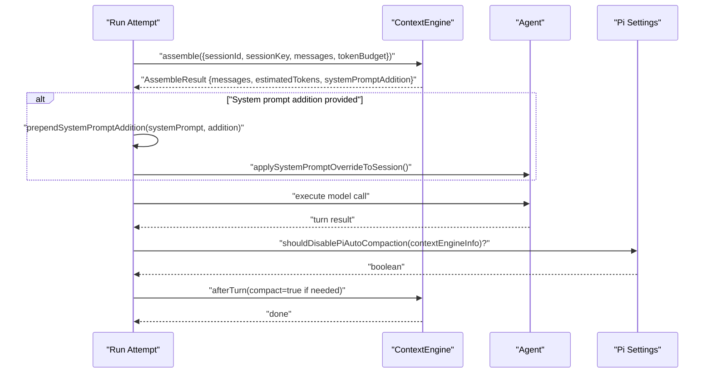

**Diagram sources**
- [attempt.ts:2109-2144](file://src/agents/pi-embedded-runner/run/attempt.ts#L2109-L2144)
- [pi-settings.ts:101-122](file://src/agents/pi-settings.ts#L101-L122)
- [types.ts:129-134](file://src/context-engine/types.ts#L129-L134)

**Section sources**
- [attempt.ts:2109-2144](file://src/agents/pi-embedded-runner/run/attempt.ts#L2109-L2144)
- [pi-settings.ts:79-122](file://src/agents/pi-settings.ts#L79-L122)
- [types.ts:108-123](file://src/context-engine/types.ts#L108-L123)

## Detailed Component Analysis

### Context Engine Framework
The Context Engine framework defines a pluggable contract for context management:
- Lifecycle methods: bootstrap, ingest, ingestBatch, afterTurn, assemble, compact, prepareSubagentSpawn, onSubagentEnded, dispose.
- Result types: AssembleResult, CompactResult, IngestResult, IngestBatchResult, BootstrapResult.
- Registry supports owner-based registration and resolution, with a safe fallback to the legacy engine.

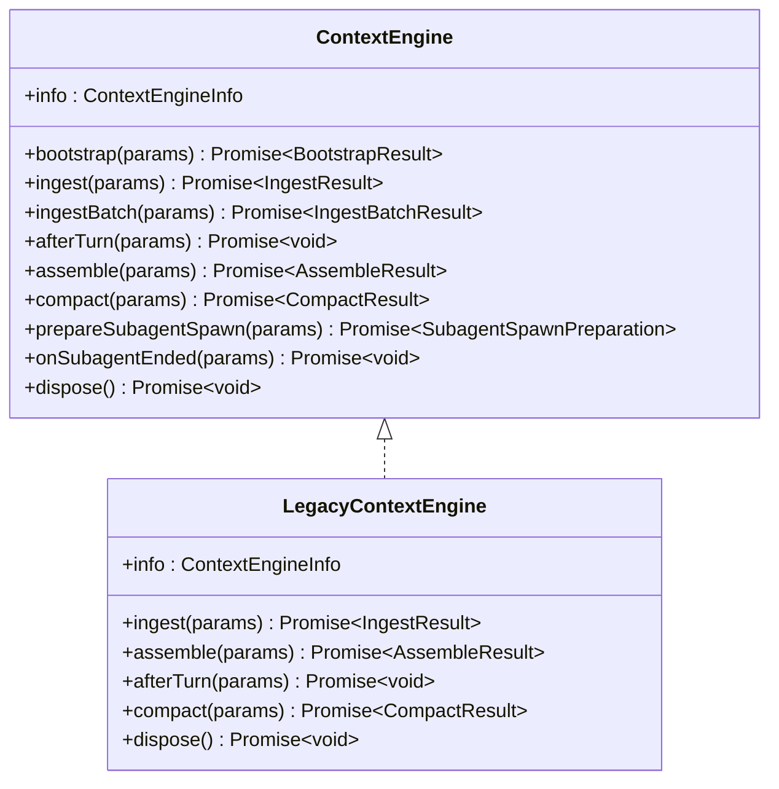

**Diagram sources**
- [types.ts:68-177](file://src/context-engine/types.ts#L68-L177)
- [legacy.ts:20-124](file://src/context-engine/legacy.ts#L20-L124)

**Section sources**
- [types.ts:46-177](file://src/context-engine/types.ts#L46-L177)
- [registry.ts:103-143](file://src/context-engine/registry.ts#L103-L143)
- [init.ts:15-23](file://src/context-engine/init.ts#L15-L23)
- [legacy.ts:20-124](file://src/context-engine/legacy.ts#L20-L124)

### Context Assembly and System Prompt Injection
During each run attempt, the system requests assembled context from the Context Engine and optionally injects a system prompt addition. The runtime replaces the agent’s message list if the engine returns modified messages and updates the system prompt accordingly.

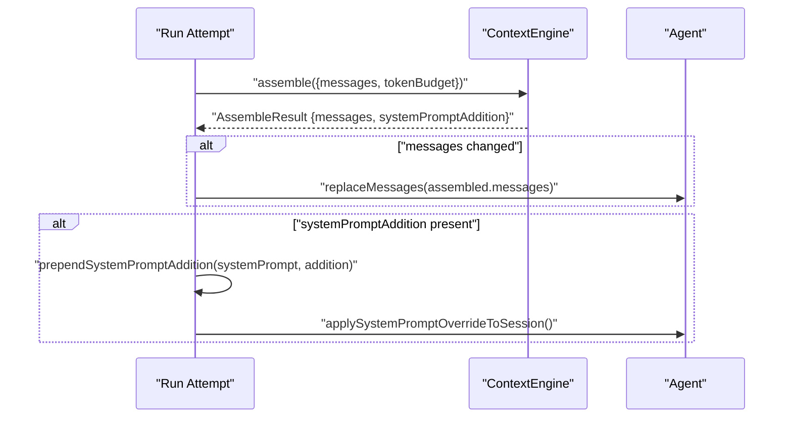

**Diagram sources**
- [attempt.ts:2109-2135](file://src/agents/pi-embedded-runner/run/attempt.ts#L2109-L2135)
- [types.ts:5-12](file://src/context-engine/types.ts#L5-L12)

**Section sources**
- [attempt.ts:2109-2144](file://src/agents/pi-embedded-runner/run/attempt.ts#L2109-L2144)
- [types.ts:5-12](file://src/context-engine/types.ts#L5-L12)

### Dynamic Context Compression and Summarization
OpenClaw compresses long histories by:
- Estimating token usage with safety margins.
- Chunking messages by token share and optionally splitting into parts.
- Summarizing chunks progressively, with fallback strategies for oversized content.
- Repairing tool_use/tool_result pairings after chunk drops to prevent API errors.
- Preserving recent turns and identifiers according to policies.

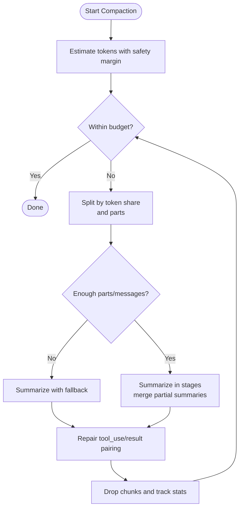

**Diagram sources**
- [compaction.ts:333-396](file://src/agents/compaction.ts#L333-L396)
- [compaction.ts:420-460](file://src/agents/compaction.ts#L420-L460)

**Section sources**
- [compaction.ts:72-175](file://src/agents/compaction.ts#L72-L175)
- [compaction.ts:211-258](file://src/agents/compaction.ts#L211-L258)
- [compaction.ts:264-331](file://src/agents/compaction.ts#L264-L331)
- [compaction.ts:333-396](file://src/agents/compaction.ts#L333-L396)
- [compaction.ts:398-460](file://src/agents/compaction.ts#L398-L460)

### Context Window Management and Token Budgeting
- Context window is derived from the selected model; defaults are applied when unspecified.
- Adaptive chunk ratios adjust based on average message size to avoid exceeding model limits.
- Reserve tokens and keep-recent tokens are configurable and can be overridden per run to balance budget and continuity.

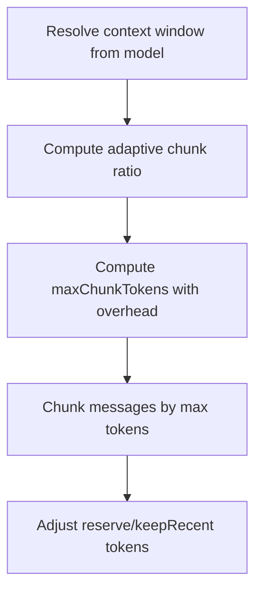

**Diagram sources**
- [compaction.ts:462-465](file://src/agents/compaction.ts#L462-L465)
- [compaction.ts:181-200](file://src/agents/compaction.ts#L181-L200)
- [compaction.ts:135-175](file://src/agents/compaction.ts#L135-L175)
- [pi-settings.ts:79-99](file://src/agents/pi-settings.ts#L79-L99)

**Section sources**
- [compaction.ts:462-465](file://src/agents/compaction.ts#L462-L465)
- [compaction.ts:181-200](file://src/agents/compaction.ts#L181-L200)
- [compaction.ts:135-175](file://src/agents/compaction.ts#L135-L175)
- [pi-settings.ts:79-99](file://src/agents/pi-settings.ts#L79-L99)

### System Prompt Engineering and Context Injection
- System prompts are built dynamically, incorporating optional context files, tool summaries, and runtime guidance.
- Context files are included only when paths are valid; warnings can be injected for bootstrap truncation.
- The runtime can prepend context-engine-provided instructions to the system prompt.

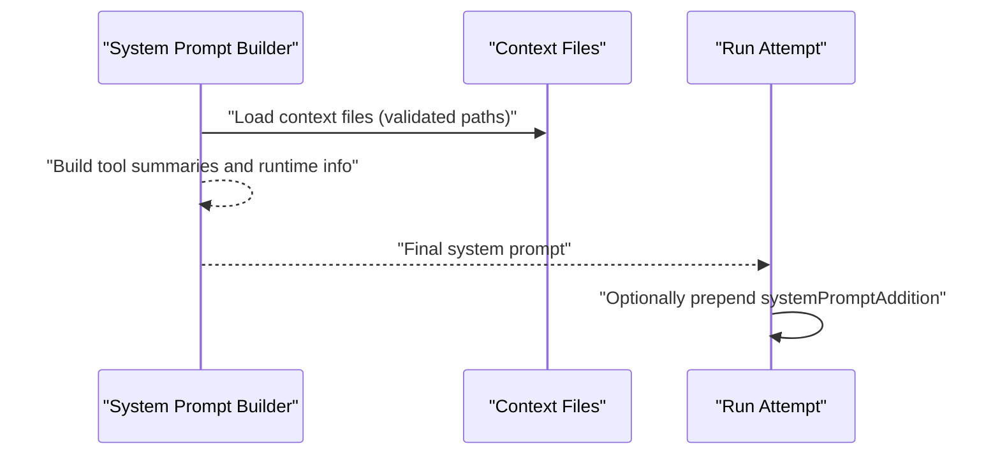

**Diagram sources**
- [system-prompt.ts:53-87](file://src/agents/pi-embedded-runner/system-prompt.ts#L53-L87)
- [attempt.ts:2120-2129](file://src/agents/pi-embedded-runner/run/attempt.ts#L2120-L2129)

**Section sources**
- [system-prompt.ts:53-87](file://src/agents/pi-embedded-runner/system-prompt.ts#L53-L87)
- [attempt.ts:2120-2129](file://src/agents/pi-embedded-runner/run/attempt.ts#L2120-L2129)

### Context Preservation Across Agent Transitions and Multi-Modal Handling
- Subagent lifecycle hooks enable engines to prepare and manage subagent context before spawning and to finalize state after completion.
- OpenProse primitives document how outer agent state, persistent memory, and in-context state are handled across sessions.
- In-context state serialization guidelines ensure appropriate formatting and limits for large values.

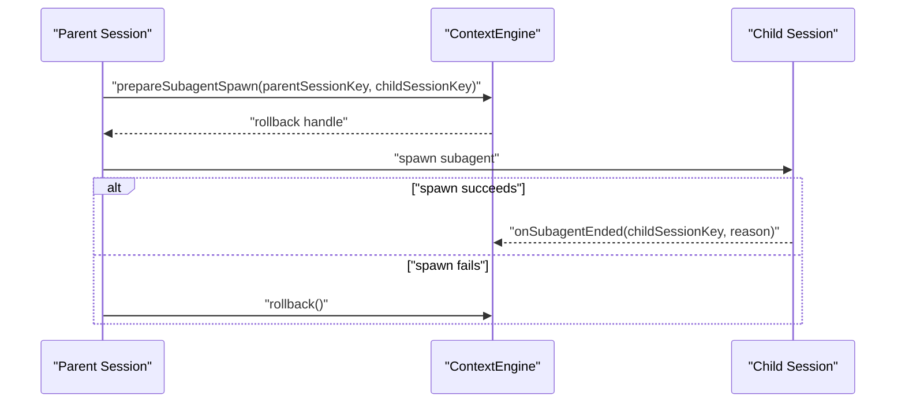

**Diagram sources**
- [types.ts:162-171](file://src/context-engine/types.ts#L162-L171)
- [session.md:1-53](file://extensions/open-prose/skills/prose/primitives/session.md#L1-L53)
- [in-context.md:234-259](file://extensions/open-prose/skills/prose/state/in-context.md#L234-L259)

**Section sources**
- [types.ts:162-171](file://src/context-engine/types.ts#L162-L171)
- [session.md:1-53](file://extensions/open-prose/skills/prose/primitives/session.md#L1-L53)
- [in-context.md:234-259](file://extensions/open-prose/skills/prose/state/in-context.md#L234-L259)

### Session Continuity and Outbound Context
- Session resolution determines session identity and freshness, supporting reset policies and channel-specific overrides.
- Outbound context derivation respects explicit agent IDs and session keys, returning undefined when neither is provided.
- Inline directives parsing and persistence allow model and behavior overrides to be applied consistently across runs.

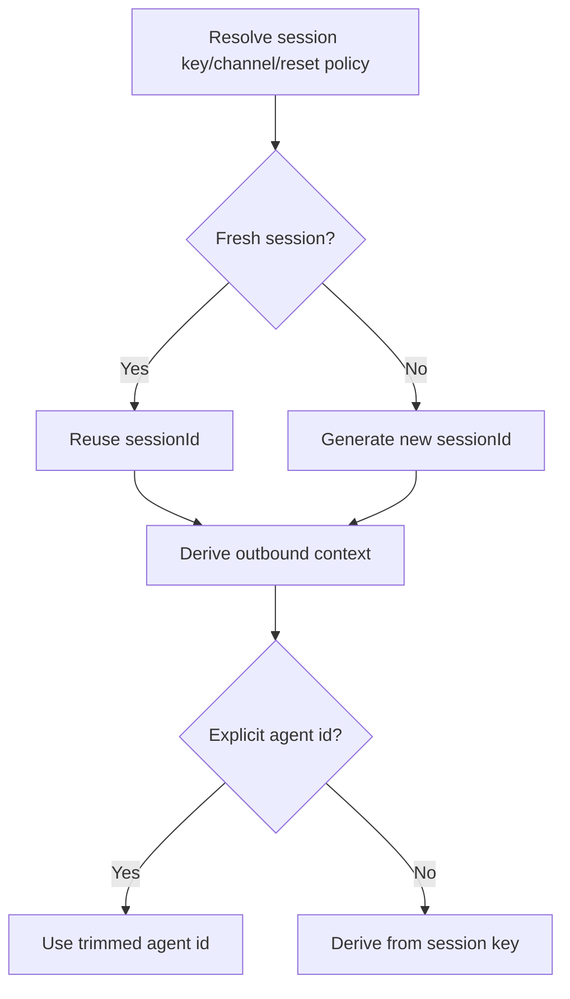

**Diagram sources**
- [session.ts:111-151](file://src/commands/agent/session.ts#L111-L151)
- [session-context.test.ts:12-37](file://src/infra/outbound/session-context.test.ts#L12-L37)
- [directive-handling.parse.ts:67-121](file://src/auto-reply/reply/directive-handling.parse.ts#L67-L121)
- [directive-handling.persist.ts:25-67](file://src/auto-reply/reply/directive-handling.persist.ts#L25-L67)

**Section sources**
- [session.ts:111-151](file://src/commands/agent/session.ts#L111-L151)
- [session-context.test.ts:1-37](file://src/infra/outbound/session-context.test.ts#L1-L37)
- [directive-handling.parse.ts:67-121](file://src/auto-reply/reply/directive-handling.parse.ts#L67-L121)
- [directive-handling.persist.ts:25-67](file://src/auto-reply/reply/directive-handling.persist.ts#L25-L67)

### Context Security and Privacy
- Sensitive configuration paths are detected using normalized suffix whitelists and pattern matching; non-sensitive token-related keys are explicitly whitelisted.
- The threat model highlights session data extraction risks and recommends sensitive data redaction in context.
- Compaction strips potentially untrusted tool result details before summarization to mitigate content leakage.

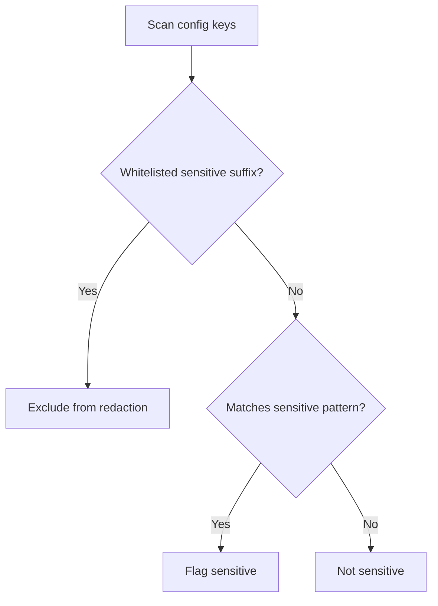

**Diagram sources**
- [schema.hints.ts:83-123](file://src/config/schema.hints.ts#L83-L123)
- [THREAT-MODEL-ATLAS.md:342-355](file://docs/security/THREAT-MODEL-ATLAS.md#L342-L355)
- [compaction.ts:72-80](file://src/agents/compaction.ts#L72-L80)

**Section sources**
- [schema.hints.ts:83-123](file://src/config/schema.hints.ts#L83-L123)
- [THREAT-MODEL-ATLAS.md:342-355](file://docs/security/THREAT-MODEL-ATLAS.md#L342-L355)
- [compaction.ts:72-80](file://src/agents/compaction.ts#L72-L80)

## Dependency Analysis
The runtime depends on the Context Engine registry and the legacy engine as a fallback. The agent runtime integrates with Pi settings to coordinate compaction behavior and uses compaction utilities for summarization and pruning.

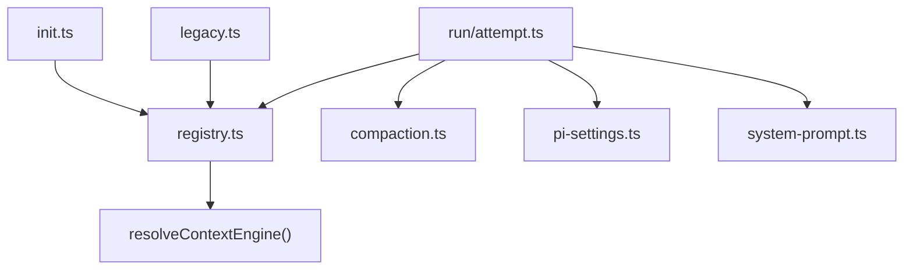

**Diagram sources**
- [registry.ts:127-143](file://src/context-engine/registry.ts#L127-L143)
- [init.ts:15-23](file://src/context-engine/init.ts#L15-L23)
- [legacy.ts:126-130](file://src/context-engine/legacy.ts#L126-L130)
- [attempt.ts:2109-2144](file://src/agents/pi-embedded-runner/run/attempt.ts#L2109-L2144)
- [compaction.ts:1-465](file://src/agents/compaction.ts#L1-L465)
- [pi-settings.ts:79-122](file://src/agents/pi-settings.ts#L79-L122)
- [system-prompt.ts:53-87](file://src/agents/pi-embedded-runner/system-prompt.ts#L53-L87)

**Section sources**
- [registry.ts:127-143](file://src/context-engine/registry.ts#L127-L143)
- [init.ts:15-23](file://src/context-engine/init.ts#L15-L23)
- [legacy.ts:126-130](file://src/context-engine/legacy.ts#L126-L130)
- [attempt.ts:2109-2144](file://src/agents/pi-embedded-runner/run/attempt.ts#L2109-L2144)

## Performance Considerations
- Use adaptive chunk ratios to reduce oversized chunks and improve compaction throughput.
- Prefer summarization in stages for very large histories to distribute cost across multiple calls.
- Apply reserve and keepRecent token overrides judiciously to balance continuity and budget.
- Strip tool result details before summarization to reduce token usage and avoid leaking verbose content.
- Leverage Pi auto-compaction guard when a context engine owns compaction to avoid redundant work.

[No sources needed since this section provides general guidance]

## Troubleshooting Guide
- If context assembly fails, the runtime falls back to the existing pipeline messages and logs a warning.
- If compaction fails, fallback strategies summarize only small messages or note oversized content.
- If Pi auto-compaction conflicts with engine-owned compaction, Pi settings can disable it for the run.
- For session continuity issues, verify session key derivation and outbound context construction.

**Section sources**
- [attempt.ts:2130-2135](file://src/agents/pi-embedded-runner/run/attempt.ts#L2130-L2135)
- [compaction.ts:284-331](file://src/agents/compaction.ts#L284-L331)
- [pi-settings.ts:101-122](file://src/agents/pi-settings.ts#L101-L122)
- [session-context.test.ts:1-37](file://src/infra/outbound/session-context.test.ts#L1-L37)

## Conclusion
OpenClaw’s context management system combines a flexible Context Engine framework with robust compaction and summarization utilities. It ensures session continuity, preserves critical context across agent transitions, and maintains performance for long conversations. Security and privacy safeguards protect sensitive data, while system prompt engineering and directive handling enable precise control over model behavior.

[No sources needed since this section summarizes without analyzing specific files]

## Appendices

### Model-Specific Context Formatting Notes
- Context window is derived from the selected model; defaults are applied when unspecified.
- Summarization overhead and reserve tokens are considered when computing chunk budgets.
- Identifier preservation policies can be configured to meet compliance requirements.

**Section sources**
- [compaction.ts:462-465](file://src/agents/compaction.ts#L462-L465)
- [compaction.ts:130-133](file://src/agents/compaction.ts#L130-L133)
- [compaction.ts:40-70](file://src/agents/compaction.ts#L40-L70)

### Context Caching Mechanisms
- The legacy engine defers persistence to the session manager; newer engines may manage their own stores via bootstrap and afterTurn hooks.
- Engines can expose ingest and ingestBatch methods to cache or index messages proactively.

**Section sources**
- [legacy.ts:27-64](file://src/context-engine/legacy.ts#L27-L64)
- [types.ts:75-101](file://src/context-engine/types.ts#L75-L101)

### Dynamic Context Resizing and Overflow Handling
- Pruning utilities drop chunks while repairing tool_use/tool_result pairings to maintain API compatibility.
- Oversized messages are detected and either summarized partially or noted to avoid exceeding model limits.

**Section sources**
- [compaction.ts:398-460](file://src/agents/compaction.ts#L398-L460)
- [compaction.ts:202-209](file://src/agents/compaction.ts#L202-L209)

### Implementation Details for Context Transformers and Summarization Strategies
- Summarization uses progressive fallbacks: full summarization, partial summarization excluding oversized messages, and a concise note when necessary.
- Stage-wise merging aggregates partial summaries with curated instructions to preserve recent context and key decisions.

**Section sources**
- [compaction.ts:264-331](file://src/agents/compaction.ts#L264-L331)
- [compaction.ts:333-396](file://src/agents/compaction.ts#L333-L396)