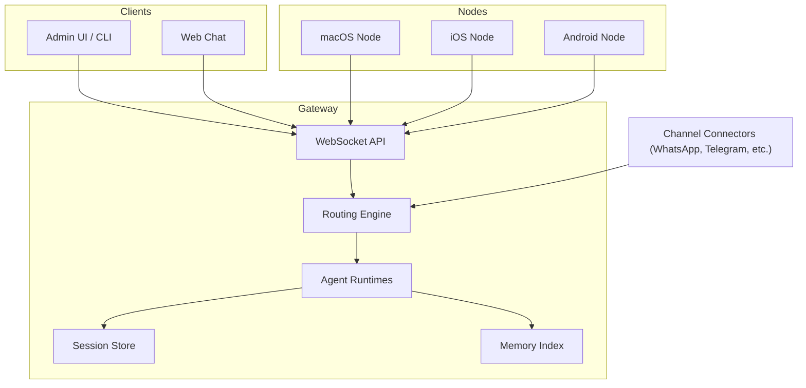
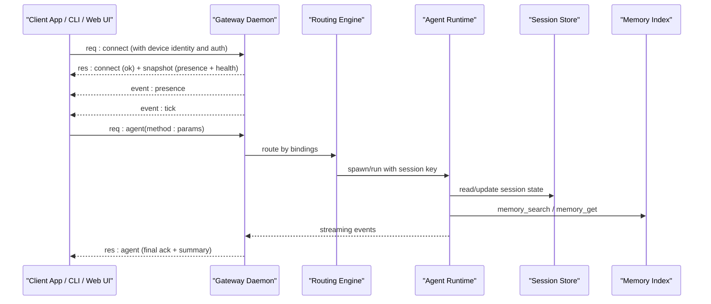
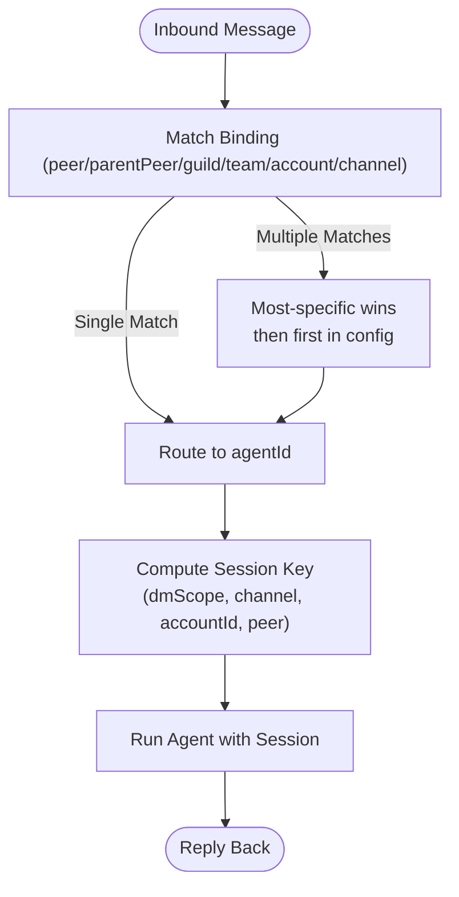
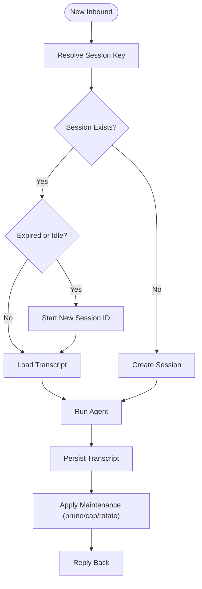
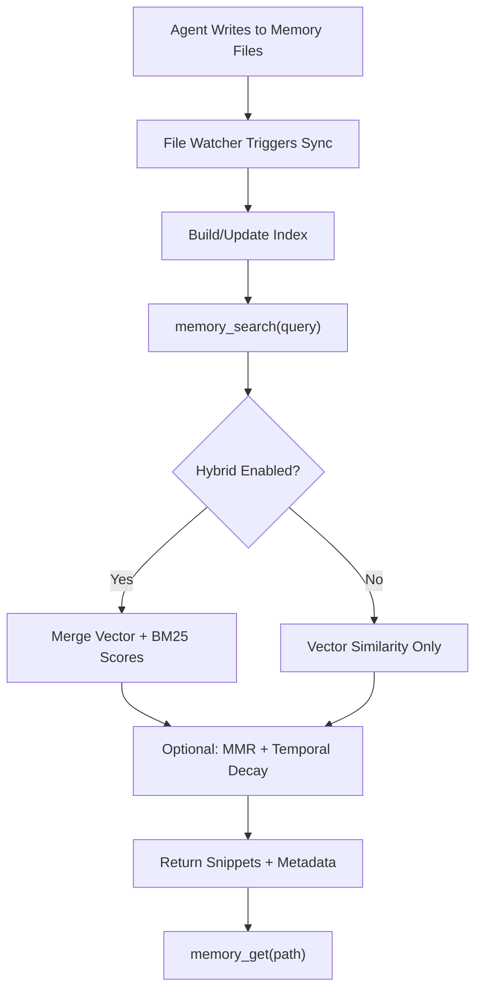
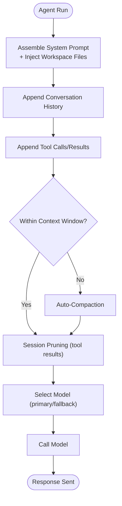
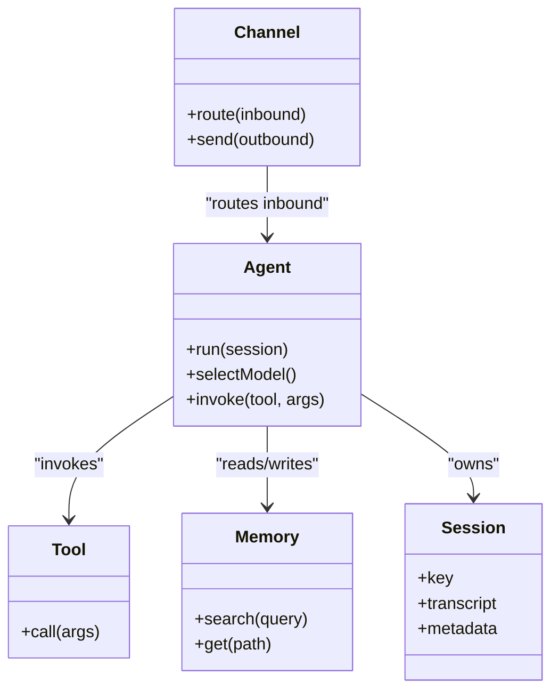
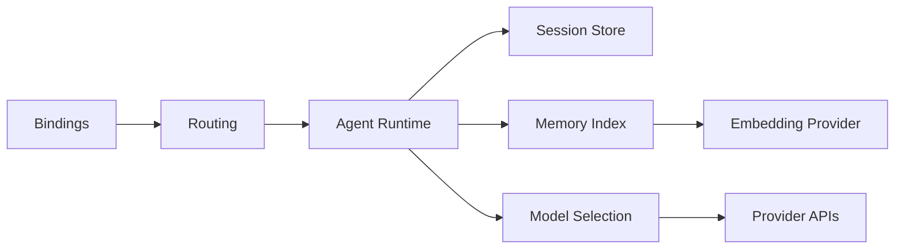

# Core Concepts

<cite>
**Referenced Files in This Document**
- [docs/concepts/architecture.md](file://docs/concepts/architecture.md)
- [docs/concepts/multi-agent.md](file://docs/concepts/multi-agent.md)
- [docs/concepts/session.md](file://docs/concepts/session.md)
- [docs/concepts/memory.md](file://docs/concepts/memory.md)
- [docs/concepts/context.md](file://docs/concepts/context.md)
- [docs/concepts/agent.md](file://docs/concepts/agent.md)
- [docs/concepts/models.md](file://docs/concepts/models.md)
- [docs/concepts/agent-workspace.md](file://docs/concepts/agent-workspace.md)
- [docs/concepts/session-pruning.md](file://docs/concepts/session-pruning.md)
- [docs/concepts/compaction.md](file://docs/concepts/compaction.md)
- [docs/concepts/queue.md](file://docs/concepts/queue.md)
- [docs/concepts/streaming.md](file://docs/concepts/streaming.md)
- [docs/concepts/typing-indicators.md](file://docs/concepts/typing-indicators.md)
</cite>

## Table of Contents
1. [Introduction](#introduction)
2. [Project Structure](#project-structure)
3. [Core Components](#core-components)
4. [Architecture Overview](#architecture-overview)
5. [Detailed Component Analysis](#detailed-component-analysis)
6. [Dependency Analysis](#dependency-analysis)
7. [Performance Considerations](#performance-considerations)
8. [Troubleshooting Guide](#troubleshooting-guide)
9. [Conclusion](#conclusion)

## Introduction
This document presents the core architecture and design principles of OpenClaw with a focus on multi-agent isolation, session management, memory systems, context control, model selection, and the relationships among channels, agents, and tools. It explains both the conceptual foundations and the technical implementation details, and includes diagrams to illustrate agent routing, session management, and memory indexing.

## Project Structure
OpenClaw organizes its runtime around a central Gateway that:
- Serves as the control plane for all messaging surfaces (channels) and client integrations (macOS app, CLI, web UI, automations).
- Owns session stores and memory indices per agent.
- Routes inbound messages to agents via deterministic bindings.
- Provides a WebSocket-based protocol for clients and nodes.

**Diagram sources**
- [docs/concepts/architecture.md:27-140](file://docs/concepts/architecture.md#L27-L140)
- [docs/concepts/multi-agent.md:10-553](file://docs/concepts/multi-agent.md#L10-L553)

**Section sources**
- [docs/concepts/architecture.md:12-140](file://docs/concepts/architecture.md#L12-L140)
- [docs/concepts/multi-agent.md:10-553](file://docs/concepts/multi-agent.md#L10-L553)

## Core Components
- Gateway and WebSocket control plane: single daemon owning provider connections and exposing a typed WebSocket API for clients and nodes.
- Multi-agent routing: each agent has an isolated workspace, state directory, and session store; bindings route inbound messages deterministically.
- Session management: persistent chat state keyed by transport-specific rules; maintenance and pruning keep stores bounded.
- Memory system: Markdown-backed memory with semantic search and hybrid retrieval; optional QMD backend and SQLite vector acceleration.
- Context management: system prompt assembly, injected workspace files, and tools schemas; compaction and pruning keep within model context windows.
- Model selection: primary + fallbacks with allowlist and provider auth rotation; per-agent overrides and bindings.
- Channels, agents, and tools: channels feed messages; agents orchestrate tools and models; tools are governed by per-agent policies.

**Section sources**
- [docs/concepts/architecture.md:27-140](file://docs/concepts/architecture.md#L27-L140)
- [docs/concepts/multi-agent.md:10-553](file://docs/concepts/multi-agent.md#L10-L553)
- [docs/concepts/session.md:57-311](file://docs/concepts/session.md#L57-L311)
- [docs/concepts/memory.md:14-803](file://docs/concepts/memory.md#L14-L803)
- [docs/concepts/context.md:10-170](file://docs/concepts/context.md#L10-L170)
- [docs/concepts/models.md:16-224](file://docs/concepts/models.md#L16-L224)
- [docs/concepts/agent.md:8-124](file://docs/concepts/agent.md#L8-L124)

## Architecture Overview
OpenClaw’s architecture centers on a single Gateway that:
- Accepts long-lived WebSocket connections from clients and nodes.
- Enforces device-based pairing and optional auth tokens.
- Hosts one or more agents with isolated workspaces and session stores.
- Provides a typed request/response and event bus over WebSocket.

**Diagram sources**
- [docs/concepts/architecture.md:59-140](file://docs/concepts/architecture.md#L59-L140)
- [docs/concepts/multi-agent.md:172-193](file://docs/concepts/multi-agent.md#L172-L193)
- [docs/concepts/session.md:189-218](file://docs/concepts/session.md#L189-L218)
- [docs/concepts/memory.md:448-469](file://docs/concepts/memory.md#L448-L469)

## Detailed Component Analysis

### Multi-Agent Routing and Isolation
- An agent is a fully scoped brain with:
  - Workspace (files, persona rules, local notes).
  - State directory for auth profiles and per-agent config.
  - Session store under the agent’s directory.
- Multiple agents can run in one Gateway; bindings route inbound messages deterministically by channel, account, peer, and thread.
- Direct chats collapse to a main session key unless configured otherwise; group chats get isolated keys.
- Per-agent sandbox and tool policies can restrict capabilities and resource usage.

**Diagram sources**
- [docs/concepts/multi-agent.md:172-193](file://docs/concepts/multi-agent.md#L172-L193)
- [docs/concepts/session.md:189-206](file://docs/concepts/session.md#L189-L206)

**Section sources**
- [docs/concepts/multi-agent.md:10-553](file://docs/concepts/multi-agent.md#L10-L553)
- [docs/concepts/session.md:10-56](file://docs/concepts/session.md#L10-L56)

### Session Management: Keys, Lifecycle, and Reply-Back
- Session keys encode transport semantics:
  - Direct chats: main, per-peer, per-channel-peer, or per-account-channel-peer.
  - Groups: agent:<agentId>:<channel>:group:<id>.
  - Other sources: cron, webhooks, node runs.
- Lifecycle:
  - Reset policy: daily reset at a configured hour and optional idle reset.
  - Reset triggers: explicit commands to start a new session id.
  - Maintenance: prune stale entries, cap counts, rotate store, enforce disk budgets.
- Reply-back:
  - Queue modes serialize runs to prevent collisions while preserving parallelism across sessions.
  - Block streaming and preview streaming deliver assistant output progressively to channels.

**Diagram sources**
- [docs/concepts/session.md:189-218](file://docs/concepts/session.md#L189-L218)
- [docs/concepts/session.md:74-120](file://docs/concepts/session.md#L74-L120)
- [docs/concepts/queue.md:17-40](file://docs/concepts/queue.md#L17-L40)
- [docs/concepts/streaming.md:19-56](file://docs/concepts/streaming.md#L19-L56)

**Section sources**
- [docs/concepts/session.md:189-311](file://docs/concepts/session.md#L189-L311)
- [docs/concepts/queue.md:17-90](file://docs/concepts/queue.md#L17-L90)
- [docs/concepts/streaming.md:19-156](file://docs/concepts/streaming.md#L19-L156)

### Memory System: Storage, Search, Retrieval, and Indexing
- Memory is Markdown-backed in the agent workspace:
  - Daily logs and curated MEMORY.md.
  - Automatic memory flush before compaction to capture durable notes.
- Vector memory search:
  - Default provider auto-selection; remote embeddings with fallbacks.
  - SQLite vector acceleration (sqlite-vec) and optional QMD backend.
  - Hybrid search (BM25 + vector) with optional MMR and temporal decay.
- Session memory search (experimental) indexes transcripts for recall.

**Diagram sources**
- [docs/concepts/memory.md:448-513](file://docs/concepts/memory.md#L448-L513)
- [docs/concepts/memory.md:524-677](file://docs/concepts/memory.md#L524-L677)
- [docs/concepts/memory.md:697-721](file://docs/concepts/memory.md#L697-L721)

**Section sources**
- [docs/concepts/memory.md:14-803](file://docs/concepts/memory.md#L14-L803)

### Context Management and Model Selection
- Context is everything sent to the model for a run and is bounded by the model’s context window.
- System prompt composition includes injected workspace files, tools list/schema, skills list, and runtime metadata.
- Compaction summarizes older history; pruning trims old tool results from in-memory context before LLM calls.
- Model selection:
  - Primary model with ordered fallbacks.
  - Allowlist and aliases; provider auth rotation and cooldowns.
  - Per-agent overrides via bindings and per-session switches.

**Diagram sources**
- [docs/concepts/context.md:80-170](file://docs/concepts/context.md#L80-L170)
- [docs/concepts/compaction.md:57-87](file://docs/concepts/compaction.md#L57-L87)
- [docs/concepts/session-pruning.md:13-41](file://docs/concepts/session-pruning.md#L13-L41)
- [docs/concepts/models.md:16-77](file://docs/concepts/models.md#L16-L77)

**Section sources**
- [docs/concepts/context.md:10-170](file://docs/concepts/context.md#L10-L170)
- [docs/concepts/compaction.md:9-105](file://docs/concepts/compaction.md#L9-L105)
- [docs/concepts/session-pruning.md:9-122](file://docs/concepts/session-pruning.md#L9-L122)
- [docs/concepts/models.md:16-224](file://docs/concepts/models.md#L16-L224)

### Channels, Agents, and Tools
- Channels are integrated via connectors; routing is configured via bindings.
- Agents orchestrate tools and models; tool policies are per-agent and can restrict capabilities.
- Workspace contract defines bootstrap files and memory layout; sandboxing can isolate file operations.

**Diagram sources**
- [docs/concepts/multi-agent.md:10-553](file://docs/concepts/multi-agent.md#L10-L553)
- [docs/concepts/agent.md:49-124](file://docs/concepts/agent.md#L49-L124)
- [docs/concepts/memory.md:14-803](file://docs/concepts/memory.md#L14-L803)
- [docs/concepts/session.md:57-73](file://docs/concepts/session.md#L57-L73)

**Section sources**
- [docs/concepts/multi-agent.md:10-553](file://docs/concepts/multi-agent.md#L10-L553)
- [docs/concepts/agent.md:12-124](file://docs/concepts/agent.md#L12-L124)
- [docs/concepts/agent-workspace.md:64-137](file://docs/concepts/agent-workspace.md#L64-L137)

## Dependency Analysis
- Coupling:
  - Routing depends on bindings and channel metadata; tightly coupled to session key computation.
  - Agent runtime depends on session store and memory index; loosely coupled to tools via policies.
  - Context assembly depends on workspace files and tool schemas; decoupled from provider internals via model selection.
- Cohesion:
  - Session store encapsulates persistence and maintenance; memory index encapsulates search and hybrid scoring.
  - Model selection and provider auth are cohesive concerns managed centrally.
- External dependencies:
  - Providers (OpenAI, Anthropic, etc.) via allowlist and auth profiles.
  - Optional QMD and sqlite-vec for enhanced search.

**Diagram sources**
- [docs/concepts/multi-agent.md:172-193](file://docs/concepts/multi-agent.md#L172-L193)
- [docs/concepts/session.md:189-218](file://docs/concepts/session.md#L189-L218)
- [docs/concepts/memory.md:94-128](file://docs/concepts/memory.md#L94-L128)
- [docs/concepts/models.md:16-30](file://docs/concepts/models.md#L16-L30)

**Section sources**
- [docs/concepts/multi-agent.md:172-193](file://docs/concepts/multi-agent.md#L172-L193)
- [docs/concepts/session.md:189-218](file://docs/concepts/session.md#L189-L218)
- [docs/concepts/memory.md:94-128](file://docs/concepts/memory.md#L94-L128)
- [docs/concepts/models.md:16-30](file://docs/concepts/models.md#L16-L30)

## Performance Considerations
- Session maintenance:
  - Tune pruneAfter, maxEntries, rotateBytes, and disk budgets to keep write latency low.
  - Prefer enforce mode in production and monitor with dry-run previews.
- Memory indexing:
  - Enable sqlite-vec for vector acceleration; consider QMD for hybrid BM25 + vectors.
  - Use embedding cache and batch indexing for large corpora.
- Context control:
  - Use compaction and pruning to keep within model context windows.
  - Adjust bootstrap caps and tool schema sizes to reduce overhead.
- Streaming and queueing:
  - Configure block streaming and coalescing to balance responsiveness and bandwidth.
  - Tune queue debounce, cap, and drop policies to handle bursts without overwhelming the agent.

[No sources needed since this section provides general guidance]

## Troubleshooting Guide
- Session issues:
  - Use inspection commands to check context size, session keys, and maintenance status.
  - Trigger cleanup and verify projected impact before enforcing.
- Memory search problems:
  - Verify embedding provider keys and fallbacks; check QMD availability and update intervals.
  - Confirm indexing scopes and session memory search settings.
- Context bloat:
  - Apply compaction or prune tool results; adjust bootstrap caps and tool schema sizes.
- Streaming and typing:
  - Adjust block streaming and preview modes per channel; tune typing indicators and human delay.

**Section sources**
- [docs/concepts/session.md:279-294](file://docs/concepts/session.md#L279-L294)
- [docs/concepts/memory.md:262-269](file://docs/concepts/memory.md#L262-L269)
- [docs/concepts/context.md:22-31](file://docs/concepts/context.md#L22-L31)
- [docs/concepts/streaming.md:108-156](file://docs/concepts/streaming.md#L108-L156)
- [docs/concepts/typing-indicators.md:10-69](file://docs/concepts/typing-indicators.md#L10-L69)

## Conclusion
OpenClaw’s architecture enables robust multi-agent isolation with deterministic routing, bounded session stores, and a powerful memory system with semantic search. Context management and model selection keep long-running conversations efficient and reliable, while the WebSocket control plane and plugin-oriented design support extensibility and sandboxed execution. Together, these concepts provide a scalable foundation for building intelligent, privacy-preserving conversational agents across diverse channels.