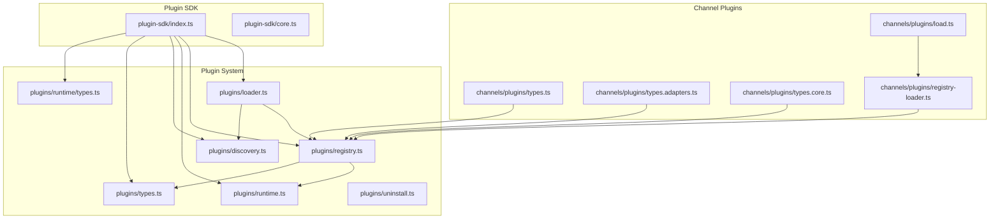
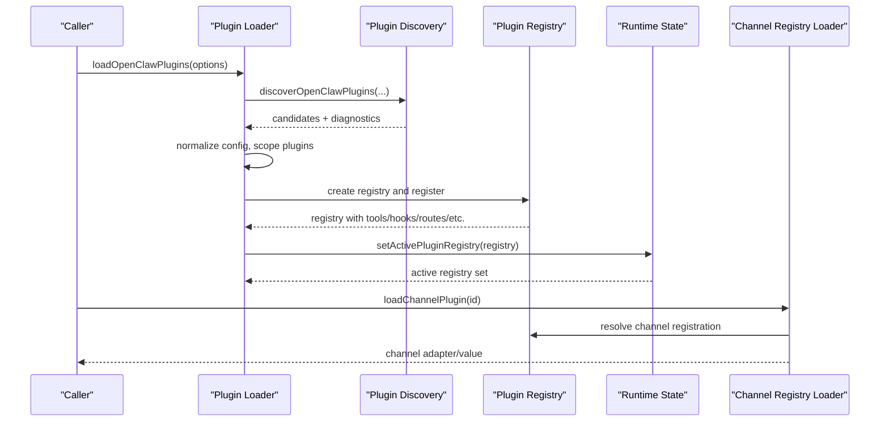
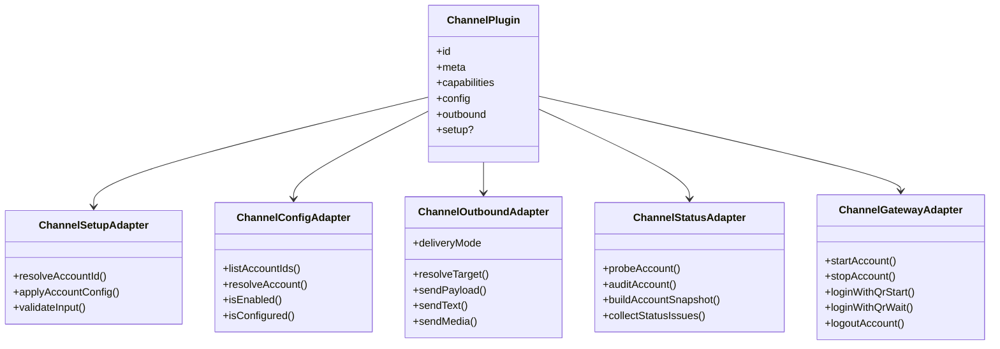
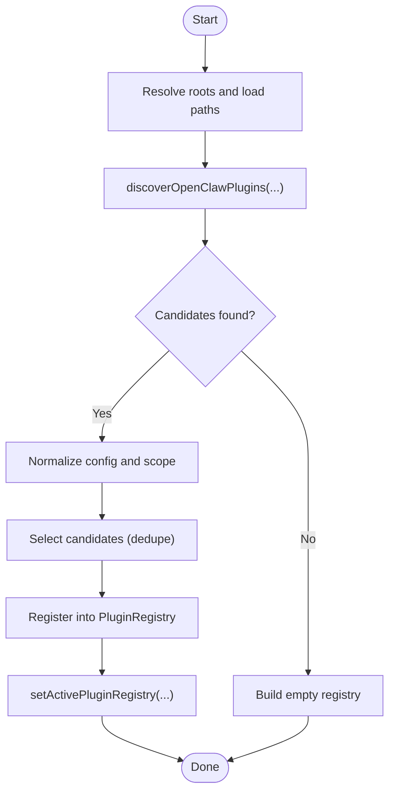
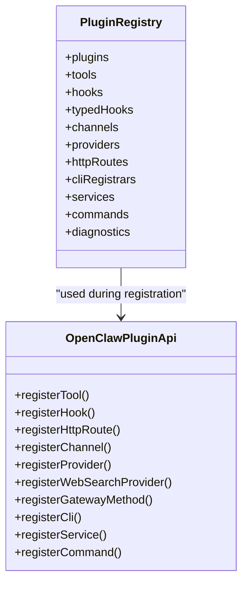
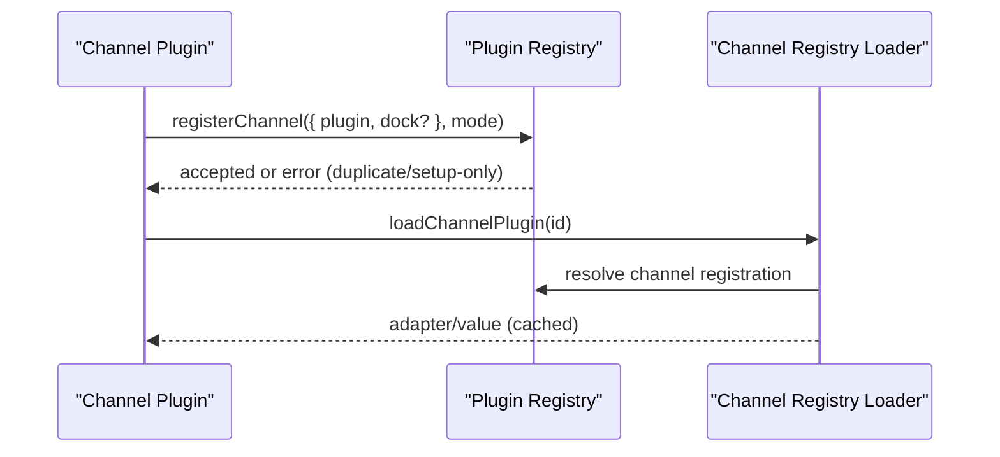
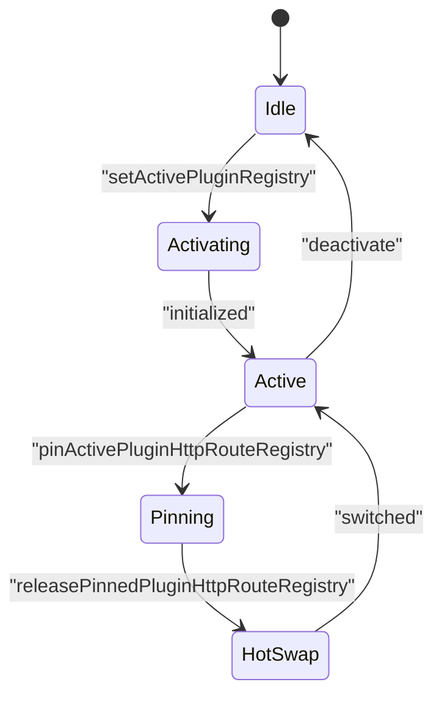
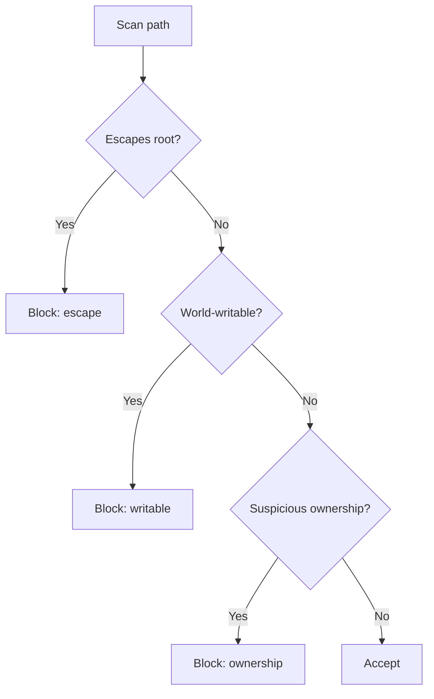
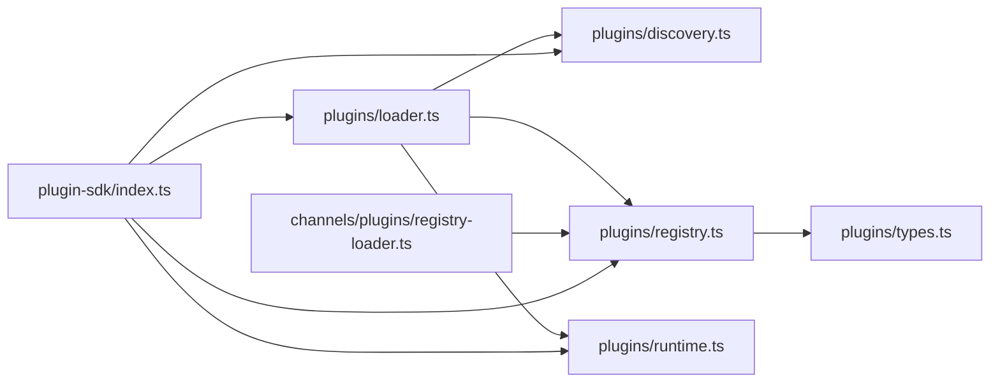

# Feature Architecture

<cite>
**Referenced Files in This Document**
- [src/plugin-sdk/index.ts](file://src/plugin-sdk/index.ts)
- [src/plugins/types.ts](file://src/plugins/types.ts)
- [src/plugins/registry.ts](file://src/plugins/registry.ts)
- [src/plugins/runtime.ts](file://src/plugins/runtime.ts)
- [src/plugins/loader.ts](file://src/plugins/loader.ts)
- [src/plugins/discovery.ts](file://src/plugins/discovery.ts)
- [src/channels/plugins/types.ts](file://src/channels/plugins/types.ts)
- [src/channels/plugins/types.adapters.ts](file://src/channels/plugins/types.adapters.ts)
- [src/channels/plugins/types.core.ts](file://src/channels/plugins/types.core.ts)
- [src/channels/plugins/registry-loader.ts](file://src/channels/plugins/registry-loader.ts)
- [src/channels/plugins/load.ts](file://src/channels/plugins/load.ts)
- [src/plugin-sdk/core.ts](file://src/plugin-sdk/core.ts)
- [src/plugins/runtime/types.ts](file://src/plugins/runtime/types.ts)
- [src/plugins/uninstall.ts](file://src/plugins/uninstall.ts)
</cite>

## Table of Contents
1. [Introduction](#introduction)
2. [Project Structure](#project-structure)
3. [Core Components](#core-components)
4. [Architecture Overview](#architecture-overview)
5. [Detailed Component Analysis](#detailed-component-analysis)
6. [Dependency Analysis](#dependency-analysis)
7. [Performance Considerations](#performance-considerations)
8. [Troubleshooting Guide](#troubleshooting-guide)
9. [Conclusion](#conclusion)

## Introduction
This document explains OpenClaw’s extensible plugin-based feature architecture. It covers the plugin SDK, channel adapter patterns, feature registration mechanisms, and how core features, plugins, and extensions relate. It also documents feature discovery, dependency resolution, runtime loading, lifecycle management, hot-swapping strategies, backward compatibility, security, sandboxing, and performance considerations.

## Project Structure
OpenClaw organizes plugin-related logic under a cohesive set of modules:
- Plugin SDK: Public API surface for plugin authors, including channel adapters, runtime helpers, and utilities.
- Plugin loader and registry: Discovery, validation, and activation of plugins and their registrations.
- Channel plugin types and adapters: Contracts for channel capabilities, outbound/inbound handling, setup, and runtime behavior.
- Runtime state: Global registry and HTTP route registry management for activation and hot-swapping.

**Diagram sources**
- [src/plugin-sdk/index.ts:1-800](file://src/plugin-sdk/index.ts#L1-L800)
- [src/plugins/loader.ts:1-800](file://src/plugins/loader.ts#L1-L800)
- [src/plugins/registry.ts:1-800](file://src/plugins/registry.ts#L1-L800)
- [src/plugins/runtime.ts:1-100](file://src/plugins/runtime.ts#L1-L100)
- [src/plugins/discovery.ts:1-800](file://src/plugins/discovery.ts#L1-L800)
- [src/channels/plugins/types.ts:1-68](file://src/channels/plugins/types.ts#L1-L68)
- [src/channels/plugins/types.adapters.ts:1-386](file://src/channels/plugins/types.adapters.ts#L1-L386)
- [src/channels/plugins/types.core.ts:1-410](file://src/channels/plugins/types.core.ts#L1-L410)
- [src/channels/plugins/registry-loader.ts:1-35](file://src/channels/plugins/registry-loader.ts#L1-L35)
- [src/channels/plugins/load.ts:1-8](file://src/channels/plugins/load.ts#L1-L8)

**Section sources**
- [src/plugin-sdk/index.ts:1-800](file://src/plugin-sdk/index.ts#L1-L800)
- [src/plugins/loader.ts:1-800](file://src/plugins/loader.ts#L1-L800)
- [src/plugins/registry.ts:1-800](file://src/plugins/registry.ts#L1-L800)
- [src/plugins/runtime.ts:1-100](file://src/plugins/runtime.ts#L1-L100)
- [src/plugins/discovery.ts:1-800](file://src/plugins/discovery.ts#L1-L800)
- [src/channels/plugins/types.ts:1-68](file://src/channels/plugins/types.ts#L1-L68)
- [src/channels/plugins/types.adapters.ts:1-386](file://src/channels/plugins/types.adapters.ts#L1-L386)
- [src/channels/plugins/types.core.ts:1-410](file://src/channels/plugins/types.core.ts#L1-L410)
- [src/channels/plugins/registry-loader.ts:1-35](file://src/channels/plugins/registry-loader.ts#L1-L35)
- [src/channels/plugins/load.ts:1-8](file://src/channels/plugins/load.ts#L1-L8)

## Core Components
- Plugin SDK: Exposes channel adapters, runtime helpers, configuration schemas, and utilities for building plugins.
- Plugin loader: Discovers plugins, validates configuration, resolves duplicates, and constructs a registry.
- Plugin registry: Central store of plugin registrations (tools, hooks, HTTP routes, channels, providers, CLI, services, commands).
- Runtime state: Global registry and HTTP route registry with activation and pinning for hot-swapping.
- Channel plugin types: Contracts for channel capabilities, adapters, and runtime behavior.

Key responsibilities:
- Discovery and safety: Scans roots, validates permissions, and blocks unsafe candidates.
- Registration: Validates and records plugin capabilities, preventing duplicates and overlaps.
- Activation: Sets active registry, initializes global hooks, and manages HTTP route registry.
- Hot-swapping: Pins and releases HTTP route registries to minimize downtime.

**Section sources**
- [src/plugin-sdk/index.ts:1-800](file://src/plugin-sdk/index.ts#L1-L800)
- [src/plugins/types.ts:1-800](file://src/plugins/types.ts#L1-L800)
- [src/plugins/registry.ts:1-800](file://src/plugins/registry.ts#L1-L800)
- [src/plugins/runtime.ts:1-100](file://src/plugins/runtime.ts#L1-L100)
- [src/plugins/discovery.ts:1-800](file://src/plugins/discovery.ts#L1-L800)
- [src/channels/plugins/types.ts:1-68](file://src/channels/plugins/types.ts#L1-L68)
- [src/channels/plugins/types.adapters.ts:1-386](file://src/channels/plugins/types.adapters.ts#L1-L386)
- [src/channels/plugins/types.core.ts:1-410](file://src/channels/plugins/types.core.ts#L1-L410)

## Architecture Overview
OpenClaw’s plugin architecture separates concerns across discovery, validation, registration, and runtime activation. The loader orchestrates discovery and safety checks, the registry enforces uniqueness and compatibility, and the runtime manages activation and hot-swapping.

**Diagram sources**
- [src/plugins/loader.ts:774-842](file://src/plugins/loader.ts#L774-L842)
- [src/plugins/discovery.ts:750-842](file://src/plugins/discovery.ts#L750-L842)
- [src/plugins/registry.ts:234-800](file://src/plugins/registry.ts#L234-L800)
- [src/plugins/runtime.ts:29-91](file://src/plugins/runtime.ts#L29-L91)
- [src/channels/plugins/registry-loader.ts:1-35](file://src/channels/plugins/registry-loader.ts#L1-L35)
- [src/channels/plugins/load.ts:1-8](file://src/channels/plugins/load.ts#L1-L8)

## Detailed Component Analysis

### Plugin SDK and Contracts
The SDK aggregates public types and helpers for plugin authors:
- Channel plugin types: Core channel shapes, capabilities, and action contracts.
- Channel adapters: Setup, config, outbound, status, gateway, resolver, directory, security, and command adapters.
- Runtime helpers: HTTP route registration, webhook targets, status helpers, sandboxing, and more.
- Provider and web search plugin contracts: Authentication, catalog, usage, and model augmentation hooks.

**Diagram sources**
- [src/channels/plugins/types.ts:1-68](file://src/channels/plugins/types.ts#L1-L68)
- [src/channels/plugins/types.adapters.ts:24-291](file://src/channels/plugins/types.adapters.ts#L24-L291)
- [src/channels/plugins/types.core.ts:16-410](file://src/channels/plugins/types.core.ts#L16-L410)

**Section sources**
- [src/plugin-sdk/index.ts:1-800](file://src/plugin-sdk/index.ts#L1-L800)
- [src/channels/plugins/types.ts:1-68](file://src/channels/plugins/types.ts#L1-L68)
- [src/channels/plugins/types.adapters.ts:1-386](file://src/channels/plugins/types.adapters.ts#L1-L386)
- [src/channels/plugins/types.core.ts:1-410](file://src/channels/plugins/types.core.ts#L1-L410)

### Plugin Loader and Discovery
The loader coordinates discovery, validation, and activation:
- Discovers candidates from roots, respecting safety gates (escaping roots, world-writable paths, ownership).
- Normalizes configuration, scopes plugin sets, and selects among duplicates.
- Builds a registry and activates it globally, initializing hooks and HTTP route registry.
- Supports snapshot loads (non-activating) to avoid command registry divergence.

**Diagram sources**
- [src/plugins/discovery.ts:750-842](file://src/plugins/discovery.ts#L750-L842)
- [src/plugins/loader.ts:774-842](file://src/plugins/loader.ts#L774-L842)
- [src/plugins/registry.ts:234-800](file://src/plugins/registry.ts#L234-L800)
- [src/plugins/runtime.ts:29-91](file://src/plugins/runtime.ts#L29-L91)

**Section sources**
- [src/plugins/discovery.ts:1-800](file://src/plugins/discovery.ts#L1-L800)
- [src/plugins/loader.ts:1-800](file://src/plugins/loader.ts#L1-L800)
- [src/plugins/registry.ts:1-800](file://src/plugins/registry.ts#L1-L800)
- [src/plugins/runtime.ts:1-100](file://src/plugins/runtime.ts#L1-L100)

### Plugin Registry and Feature Contracts
The registry centralizes all plugin registrations:
- Tools, hooks, HTTP routes, channels, providers, web search providers, CLI registrars, services, commands, diagnostics.
- Enforces uniqueness and compatibility (e.g., duplicate channel ids, overlapping HTTP routes).
- Provides typed hook policies and constraint enforcement.

**Diagram sources**
- [src/plugins/registry.ts:171-186](file://src/plugins/registry.ts#L171-L186)
- [src/plugins/registry.ts:762-800](file://src/plugins/registry.ts#L762-L800)

**Section sources**
- [src/plugins/registry.ts:1-800](file://src/plugins/registry.ts#L1-L800)
- [src/plugins/types.ts:1-800](file://src/plugins/types.ts#L1-L800)

### Channel Adapter Patterns and Feature Registration
Channel plugins declare capabilities and adapters. The registry enforces uniqueness and setup-only vs runtime registration modes. Channel registry loader provides cached resolution of channel adapters and values.

**Diagram sources**
- [src/plugins/registry.ts:463-523](file://src/plugins/registry.ts#L463-L523)
- [src/channels/plugins/registry-loader.ts:1-35](file://src/channels/plugins/registry-loader.ts#L1-L35)
- [src/channels/plugins/load.ts:1-8](file://src/channels/plugins/load.ts#L1-L8)

**Section sources**
- [src/plugins/registry.ts:463-523](file://src/plugins/registry.ts#L463-L523)
- [src/channels/plugins/registry-loader.ts:1-35](file://src/channels/plugins/registry-loader.ts#L1-L35)
- [src/channels/plugins/load.ts:1-8](file://src/channels/plugins/load.ts#L1-L8)

### Runtime State and Hot-Swapping
The runtime maintains:
- Active plugin registry and HTTP route registry.
- Pinning/release semantics to support hot-swapping without downtime.
- Version tracking to coordinate cache invalidation.

**Diagram sources**
- [src/plugins/runtime.ts:29-91](file://src/plugins/runtime.ts#L29-L91)

**Section sources**
- [src/plugins/runtime.ts:1-100](file://src/plugins/runtime.ts#L1-L100)

### Security and Safety Gates
Discovery enforces safety:
- Blocks sources that escape plugin roots.
- Flags world-writable directories and suspicious ownership.
- Validates package boundaries and rejects hardlinks when appropriate.

**Diagram sources**
- [src/plugins/discovery.ts:121-276](file://src/plugins/discovery.ts#L121-L276)

**Section sources**
- [src/plugins/discovery.ts:1-800](file://src/plugins/discovery.ts#L1-L800)

### Backward Compatibility Strategies
- Typed hook policy constrains legacy prompt injection when disabled.
- Deprecated API hints surfaced in diagnostics.
- Provider plugin hooks maintain compatibility with legacy discovery and catalog methods.

**Section sources**
- [src/plugins/registry.ts:201-213](file://src/plugins/registry.ts#L201-L213)
- [src/plugins/types.ts:516-535](file://src/plugins/types.ts#L516-L535)

### Sandbox and Security Integration
- Plugin SDK exposes sandbox backends and SSH sessions for secure execution contexts.
- Runtime types define subagent operations for controlled agent lifecycles.

**Section sources**
- [src/plugin-sdk/core.ts:33-79](file://src/plugin-sdk/core.ts#L33-L79)
- [src/plugins/runtime/types.ts:51-64](file://src/plugins/runtime/types.ts#L51-L64)

### Uninstall and Slot Management
- Uninstall cleans load paths, resets memory slots, and prunes undefined config fields.
- Maintains stability by resetting slot selections when affected plugins are removed.

**Section sources**
- [src/plugins/uninstall.ts:106-156](file://src/plugins/uninstall.ts#L106-L156)

## Dependency Analysis
The plugin system exhibits low coupling and high cohesion:
- Loader depends on Discovery, Registry, and Runtime.
- Registry depends on Plugin types and validation helpers.
- Channel Registry Loader depends on the active Plugin Registry.
- SDK aggregates types and helpers used by both core and external plugins.

**Diagram sources**
- [src/plugins/loader.ts:1-800](file://src/plugins/loader.ts#L1-L800)
- [src/plugins/discovery.ts:1-800](file://src/plugins/discovery.ts#L1-L800)
- [src/plugins/registry.ts:1-800](file://src/plugins/registry.ts#L1-L800)
- [src/plugins/runtime.ts:1-100](file://src/plugins/runtime.ts#L1-L100)
- [src/channels/plugins/registry-loader.ts:1-35](file://src/channels/plugins/registry-loader.ts#L1-L35)
- [src/plugin-sdk/index.ts:1-800](file://src/plugin-sdk/index.ts#L1-L800)

**Section sources**
- [src/plugins/loader.ts:1-800](file://src/plugins/loader.ts#L1-L800)
- [src/plugins/registry.ts:1-800](file://src/plugins/registry.ts#L1-L800)
- [src/plugins/runtime.ts:1-100](file://src/plugins/runtime.ts#L1-L100)
- [src/plugins/discovery.ts:1-800](file://src/plugins/discovery.ts#L1-L800)
- [src/channels/plugins/registry-loader.ts:1-35](file://src/channels/plugins/registry-loader.ts#L1-L35)
- [src/plugin-sdk/index.ts:1-800](file://src/plugin-sdk/index.ts#L1-L800)

## Performance Considerations
- Discovery caching: Short-lived cache collapses bursty reloads during startup.
- Registry cache: LRU-like cache with bounded entries to reduce repeated construction.
- Channel registry loader: Per-channel adapter/value caching keyed to active registry.
- HTTP route registry pinning: Enables hot-swapping without rebuilding route tables.

Recommendations:
- Tune discovery cache window via environment variables.
- Monitor registry and route counts to size resources appropriately.
- Use scoped plugin IDs to limit discovery and activation scope.

**Section sources**
- [src/plugins/discovery.ts:40-70](file://src/plugins/discovery.ts#L40-L70)
- [src/plugins/loader.ts:61-68](file://src/plugins/loader.ts#L61-L68)
- [src/channels/plugins/registry-loader.ts:11-34](file://src/channels/plugins/registry-loader.ts#L11-L34)
- [src/plugins/runtime.ts:53-64](file://src/plugins/runtime.ts#L53-L64)

## Troubleshooting Guide
Common issues and resolutions:
- Duplicate registrations: Diagnostics report conflicting channel or hook registrations; ensure unique IDs and correct registration mode.
- Overlapping HTTP routes: Diagnostics report overlap with auth mismatch; align auth and match semantics.
- Unsafe candidates: Blocked due to escaping roots, world-writable paths, or suspicious ownership; fix permissions and ownership.
- Deprecated API usage: Errors indicate removal of legacy APIs; migrate to current registration methods.
- Untracked loaded plugins: Warns when plugins are loaded without install/load-path provenance; pin trust via allowlist or install records.

Operational tips:
- Review diagnostics emitted during load and activation.
- Use snapshot loads to validate without activating commands.
- Clear caches when switching environments or after major changes.

**Section sources**
- [src/plugins/registry.ts:238-461](file://src/plugins/registry.ts#L238-L461)
- [src/plugins/discovery.ts:241-276](file://src/plugins/discovery.ts#L241-L276)
- [src/plugins/loader.ts:769-772](file://src/plugins/loader.ts#L769-L772)
- [src/plugins/uninstall.ts:106-156](file://src/plugins/uninstall.ts#L106-L156)

## Conclusion
OpenClaw’s plugin architecture balances flexibility and safety. The SDK provides robust contracts and utilities, the loader ensures secure discovery and validation, the registry enforces compatibility, and the runtime supports hot-swapping. Together, these components enable a scalable, extensible feature platform with strong backward compatibility, security safeguards, and performance-conscious design.