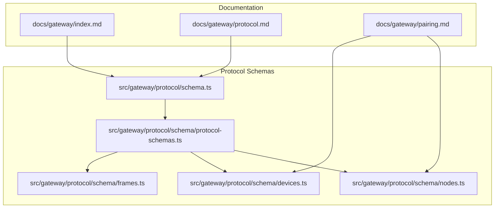
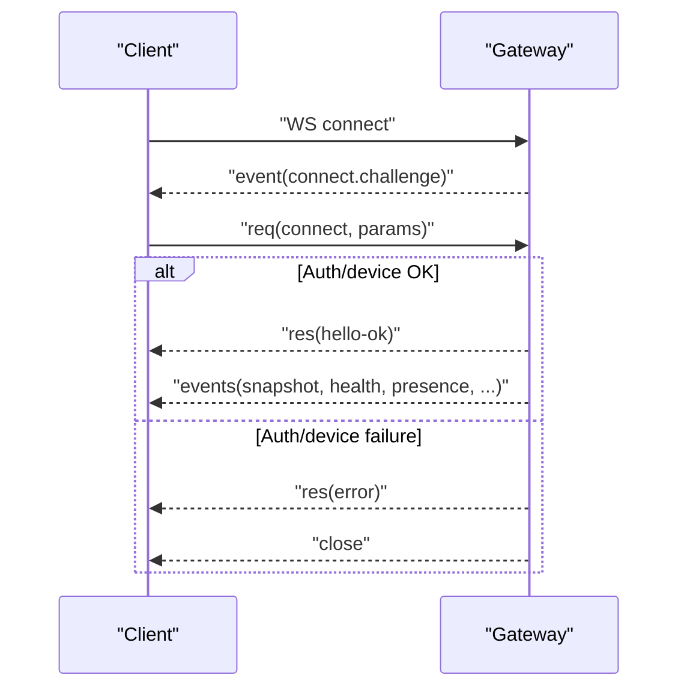
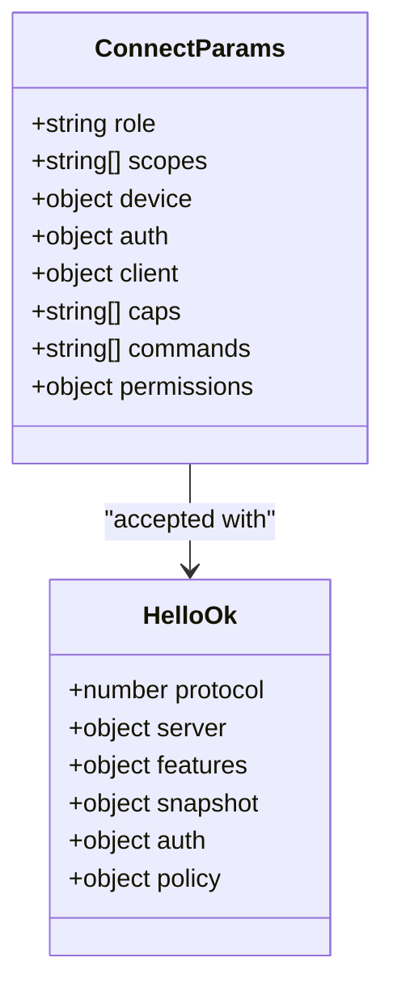
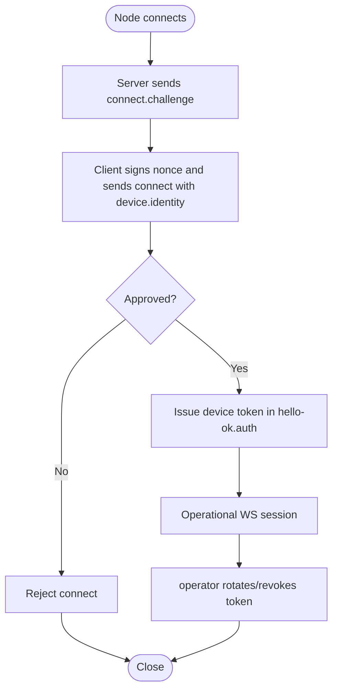
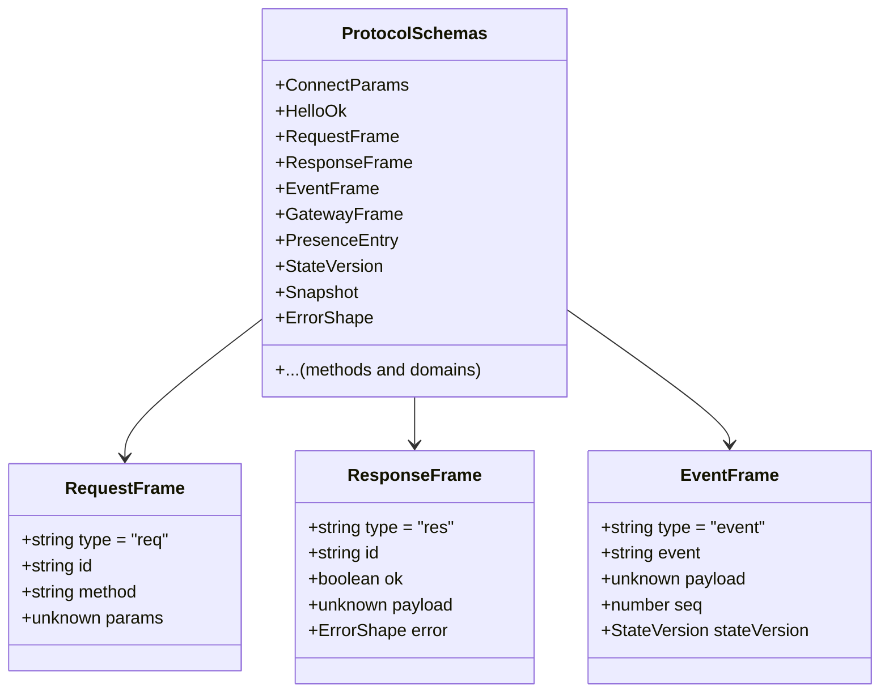
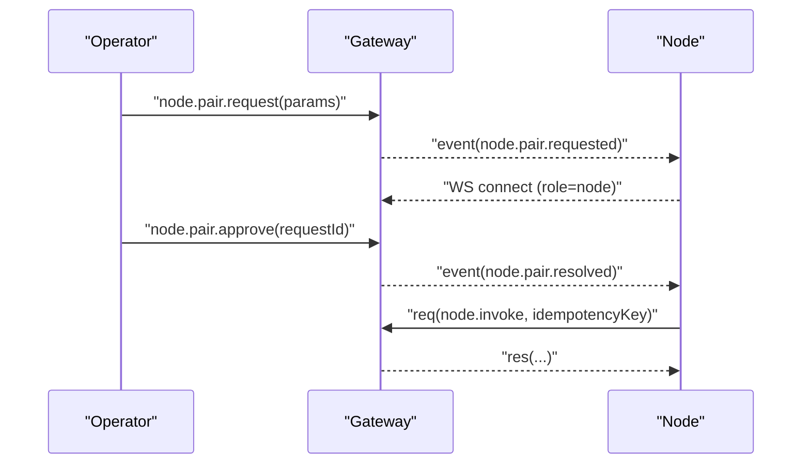
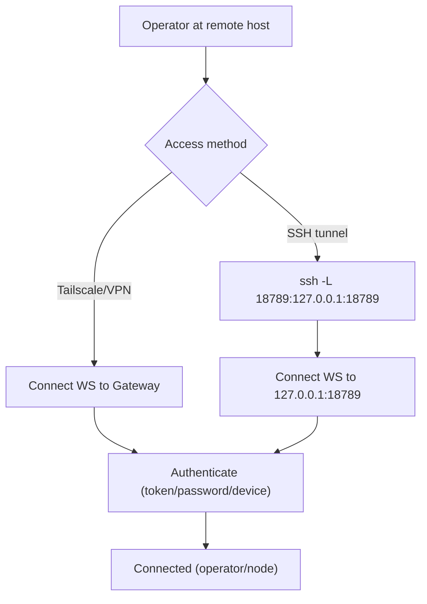
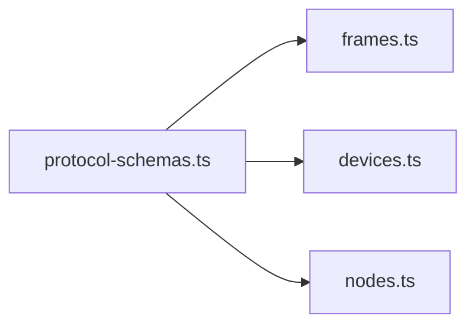

# Gateway Architecture

<cite>
**Referenced Files in This Document**
- [docs/gateway/index.md](file://docs/gateway/index.md)
- [docs/gateway/protocol.md](file://docs/gateway/protocol.md)
- [docs/gateway/pairing.md](file://docs/gateway/pairing.md)
- [src/gateway/protocol/schema.ts](file://src/gateway/protocol/schema.ts)
- [src/gateway/protocol/schema/protocol-schemas.ts](file://src/gateway/protocol/schema/protocol-schemas.ts)
- [src/gateway/protocol/schema/frames.ts](file://src/gateway/protocol/schema/frames.ts)
- [src/gateway/protocol/schema/devices.ts](file://src/gateway/protocol/schema/devices.ts)
- [src/gateway/protocol/schema/nodes.ts](file://src/gateway/protocol/schema/nodes.ts)
</cite>

## Table of Contents
1. [Introduction](#introduction)
2. [Project Structure](#project-structure)
3. [Core Components](#core-components)
4. [Architecture Overview](#architecture-overview)
5. [Detailed Component Analysis](#detailed-component-analysis)
6. [Dependency Analysis](#dependency-analysis)
7. [Performance Considerations](#performance-considerations)
8. [Troubleshooting Guide](#troubleshooting-guide)
9. [Conclusion](#conclusion)

## Introduction
This document explains OpenClaw’s central WebSocket-based gateway architecture. The Gateway is a single, always-on process that owns all messaging surfaces and acts as the unified control plane for operators and nodes. It speaks a typed WebSocket protocol, supports device-based pairing and local trust, and enables secure remote access via Tailscale/VPN or SSH tunnels. The document covers the WebSocket control plane, role-based client differentiation, device-based pairing, wire protocol typing with TypeBox schemas, idempotency handling, event-driven communication, and remote access patterns.

## Project Structure
The gateway architecture is defined by:
- Documentation that describes the runtime model, protocol, pairing, and operational guidance.
- Protocol schemas that define the WebSocket framing, typed requests/responses/events, and method parameters using TypeBox.
- Device and node pairing schemas that formalize the pairing API surface and events.



**Diagram sources**
- [docs/gateway/index.md:1-262](file://docs/gateway/index.md#L1-L262)
- [docs/gateway/protocol.md:1-268](file://docs/gateway/protocol.md#L1-L268)
- [docs/gateway/pairing.md:1-100](file://docs/gateway/pairing.md#L1-L100)
- [src/gateway/protocol/schema.ts:1-19](file://src/gateway/protocol/schema.ts#L1-L19)
- [src/gateway/protocol/schema/protocol-schemas.ts:1-302](file://src/gateway/protocol/schema/protocol-schemas.ts#L1-L302)
- [src/gateway/protocol/schema/frames.ts:1-165](file://src/gateway/protocol/schema/frames.ts#L1-L165)
- [src/gateway/protocol/schema/devices.ts:1-68](file://src/gateway/protocol/schema/devices.ts#L1-L68)
- [src/gateway/protocol/schema/nodes.ts:1-167](file://src/gateway/protocol/schema/nodes.ts#L1-L167)

**Section sources**
- [docs/gateway/index.md:68-124](file://docs/gateway/index.md#L68-L124)
- [docs/gateway/protocol.md:10-268](file://docs/gateway/protocol.md#L10-L268)
- [docs/gateway/pairing.md:10-100](file://docs/gateway/pairing.md#L10-L100)
- [src/gateway/protocol/schema.ts:1-19](file://src/gateway/protocol/schema.ts#L1-L19)
- [src/gateway/protocol/schema/protocol-schemas.ts:162-302](file://src/gateway/protocol/schema/protocol-schemas.ts#L162-L302)

## Core Components
- WebSocket control plane and RPC: The Gateway multiplexes a single WebSocket port for control plane, RPC, HTTP APIs, and UI hooks. Clients must send a connect frame first and receive a hello-ok snapshot.
- Role-based client differentiation: Operators (control-plane clients) and nodes (capability hosts) declare roles and scopes at connect time. Operators carry read/write/admin/approvals/pairing scopes; nodes carry capability claims and command allowlists.
- Device-based pairing and local trust: Devices sign a server-provided nonce during connect. Gateways issue device tokens scoped to role and scopes, with rotation and revocation support. Pairing approvals gate membership for nodes.
- Wire protocol typing: The protocol is defined by TypeBox schemas exported from a central registry. Frames include discriminated unions for req/res/event and include idempotency for side-effecting methods.
- Remote access patterns: Prefer Tailscale/VPN; SSH tunnels are supported as a fallback. Even over tunnels, clients must authenticate.

**Section sources**
- [docs/gateway/index.md:70-124](file://docs/gateway/index.md#L70-L124)
- [docs/gateway/protocol.md:127-268](file://docs/gateway/protocol.md#L127-L268)
- [docs/gateway/pairing.md:27-100](file://docs/gateway/pairing.md#L27-L100)

## Architecture Overview
The Gateway is the central orchestrator:
- Accepts WebSocket connections and enforces a strict connect-first handshake.
- Issues a typed hello-ok snapshot and maintains presence and state versioning.
- Exposes a broad API surface over the same WebSocket (status, channels, models, chat, agent, sessions, nodes, approvals, etc.), typed by TypeBox schemas.
- Supports device identity and pairing, with events for pairing lifecycle and node pending work queues.

```mermaid
graph TB
C["Client (Operator or Node)"]
G["Gateway Daemon"]
P["Protocol Schemas (TypeBox)"]
D["Device Store"]
N["Node Store"]
C --> |WebSocket Text Frames| G
G --> |Hello-ok + Snapshot| C
G --> |Events (presence, health, shutdown)| C
G --> |Typed Methods| C
G --> P
G --> D
G --> N
```

**Diagram sources**
- [docs/gateway/protocol.md:127-268](file://docs/gateway/protocol.md#L127-L268)
- [src/gateway/protocol/schema/protocol-schemas.ts:162-302](file://src/gateway/protocol/schema/protocol-schemas.ts#L162-L302)
- [docs/gateway/pairing.md:27-100](file://docs/gateway/pairing.md#L27-L100)

## Detailed Component Analysis

### WebSocket Control Plane and Lifecycle
- Transport: WebSocket with text frames containing JSON.
- Handshake: First frame must be connect; Gateway responds with connect.challenge, then accepts or rejects based on auth and device identity.
- Hello snapshot: On accept, Gateway returns hello-ok with protocol version, server info, features, snapshot, and optional device token.
- Liveness and readiness: Clients can probe with connect and inspect health/status.
- Graceful shutdown: Gateway emits a shutdown event before closing.



**Diagram sources**
- [docs/gateway/protocol.md:22-90](file://docs/gateway/protocol.md#L22-L90)
- [src/gateway/protocol/schema/frames.ts:20-113](file://src/gateway/protocol/schema/frames.ts#L20-L113)

**Section sources**
- [docs/gateway/protocol.md:17-90](file://docs/gateway/protocol.md#L17-L90)
- [docs/gateway/index.md:218-234](file://docs/gateway/index.md#L218-L234)

### Role-Based Client Differentiation
- Operator clients: Control-plane access with scopes like read, write, admin, approvals, pairing. Used by CLI, UI, and automation.
- Node clients: Capability hosts with declared caps, commands, and permissions. They may request pairing and participate in node management APIs.



**Diagram sources**
- [src/gateway/protocol/schema/frames.ts:20-113](file://src/gateway/protocol/schema/frames.ts#L20-L113)

**Section sources**
- [docs/gateway/protocol.md:135-190](file://docs/gateway/protocol.md#L135-L190)
- [src/gateway/protocol/schema/frames.ts:20-113](file://src/gateway/protocol/schema/frames.ts#L20-L113)

### Device-Based Pairing and Local Trust
- Device identity: Clients include a device identity and sign the server-provided nonce during connect.
- Device tokens: On successful pairing, Gateway issues a device-scoped token returned in hello-ok.auth.
- Pairing lifecycle: Pending requests are emitted as events and resolved by approvals or rejections. Requests expire automatically.
- Rotation and revocation: Operators can rotate or revoke device tokens for specific roles/scopes.



**Diagram sources**
- [docs/gateway/protocol.md:200-230](file://docs/gateway/protocol.md#L200-L230)
- [docs/gateway/pairing.md:27-71](file://docs/gateway/pairing.md#L27-L71)
- [src/gateway/protocol/schema/devices.ts:38-67](file://src/gateway/protocol/schema/devices.ts#L38-L67)

**Section sources**
- [docs/gateway/protocol.md:200-230](file://docs/gateway/protocol.md#L200-L230)
- [docs/gateway/pairing.md:27-100](file://docs/gateway/pairing.md#L27-L100)
- [src/gateway/protocol/schema/devices.ts:1-68](file://src/gateway/protocol/schema/devices.ts#L1-L68)

### Wire Protocol Typing with TypeBox Schemas
- Central registry: A single export aggregates all protocol schemas for methods, frames, snapshots, and domain models.
- Frame typing: Discriminated union of req/res/event frames with strong typing for id, method, params, payload, error, and event names.
- Idempotency: Side-effecting methods include an idempotency key in their params to prevent duplicate effects.
- Versioning: Protocol version is defined centrally and validated during connect.



**Diagram sources**
- [src/gateway/protocol/schema/protocol-schemas.ts:162-302](file://src/gateway/protocol/schema/protocol-schemas.ts#L162-L302)
- [src/gateway/protocol/schema/frames.ts:126-165](file://src/gateway/protocol/schema/frames.ts#L126-L165)

**Section sources**
- [src/gateway/protocol/schema.ts:1-19](file://src/gateway/protocol/schema.ts#L1-L19)
- [src/gateway/protocol/schema/protocol-schemas.ts:162-302](file://src/gateway/protocol/schema/protocol-schemas.ts#L162-L302)
- [src/gateway/protocol/schema/frames.ts:126-165](file://src/gateway/protocol/schema/frames.ts#L126-L165)

### Node Management and Pending Work
- Node pairing APIs: Request, list, approve, reject, verify, rename, and status queries.
- Pending work queues: Nodes can enqueue and drain pending work items with types, priorities, and expiration.
- Invocation: Nodes can be invoked with idempotency keys and optional timeouts.



**Diagram sources**
- [docs/gateway/pairing.md:49-71](file://docs/gateway/pairing.md#L49-L71)
- [src/gateway/protocol/schema/nodes.ts:12-167](file://src/gateway/protocol/schema/nodes.ts#L12-L167)

**Section sources**
- [docs/gateway/pairing.md:49-71](file://docs/gateway/pairing.md#L49-L71)
- [src/gateway/protocol/schema/nodes.ts:12-167](file://src/gateway/protocol/schema/nodes.ts#L12-L167)

### Remote Access Patterns
- Preferred: Tailscale/VPN for secure, seamless access.
- Fallback: SSH tunnel to localhost; clients still must authenticate even over tunnels.
- Binding and auth: Non-loopback binds require gateway auth; otherwise binding is refused.



**Diagram sources**
- [docs/gateway/index.md:108-124](file://docs/gateway/index.md#L108-L124)

**Section sources**
- [docs/gateway/index.md:108-124](file://docs/gateway/index.md#L108-L124)

## Dependency Analysis
The protocol schemas form a cohesive, typed API surface:
- A central registry exports all schemas for frames, methods, and domains.
- Frames are strongly typed with discriminated unions to simplify code generation and validation.
- Domain schemas (devices, nodes, agents, sessions, etc.) are composed into the registry.



**Diagram sources**
- [src/gateway/protocol/schema/protocol-schemas.ts:162-302](file://src/gateway/protocol/schema/protocol-schemas.ts#L162-L302)
- [src/gateway/protocol/schema/frames.ts:126-165](file://src/gateway/protocol/schema/frames.ts#L126-L165)
- [src/gateway/protocol/schema/devices.ts:38-67](file://src/gateway/protocol/schema/devices.ts#L38-L67)
- [src/gateway/protocol/schema/nodes.ts:125-167](file://src/gateway/protocol/schema/nodes.ts#L125-L167)

**Section sources**
- [src/gateway/protocol/schema/protocol-schemas.ts:162-302](file://src/gateway/protocol/schema/protocol-schemas.ts#L162-L302)

## Performance Considerations
- Multiplexed port reduces overhead: A single WebSocket port serves control plane, RPC, HTTP APIs, and UI hooks.
- Typed framing reduces ambiguity and parsing overhead: Discriminated unions and strict schemas minimize runtime checks.
- Idempotency keys avoid duplicate work: Side-effecting methods include idempotency keys to safely retry without side-effects.
- Policy limits: The hello-ok includes policy fields (e.g., maxPayload, maxBufferedBytes, tickIntervalMs) to tune client behavior.

[No sources needed since this section provides general guidance]

## Troubleshooting Guide
- Unavailable Gateway: Clients fail fast; there is no implicit fallback to direct channels.
- Invalid first frame: Non-connect frames are rejected and the socket is closed.
- Sequence gaps: Events are not replayed; on gaps, refresh state (health, system-presence) before continuing.
- Common failure signatures: Includes non-loopback bind without auth, port conflicts, gateway mode set to remote, and unauthorized connect.

**Section sources**
- [docs/gateway/index.md:246-249](file://docs/gateway/index.md#L246-L249)
- [docs/gateway/index.md:235-244](file://docs/gateway/index.md#L235-L244)

## Conclusion
OpenClaw’s Gateway is a unified, WebSocket-based control plane that consolidates messaging surfaces and operational control. Its role-based client model, device-based pairing, and TypeBox-typed protocol provide a robust foundation for secure, extensible multi-platform operation. Operators and nodes communicate over a single port using a strict, versioned protocol with idempotency and event-driven updates, while remote access is facilitated through Tailscale/VPN or SSH tunnels with mandatory authentication.