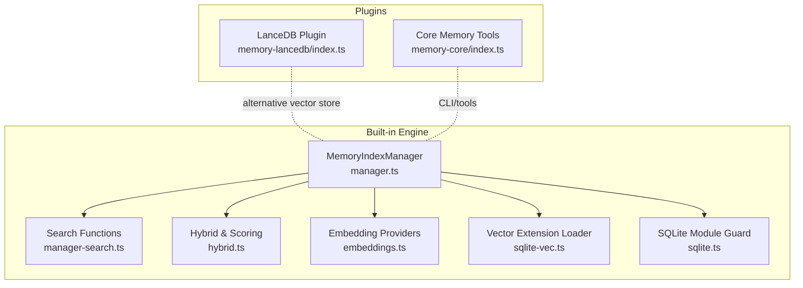
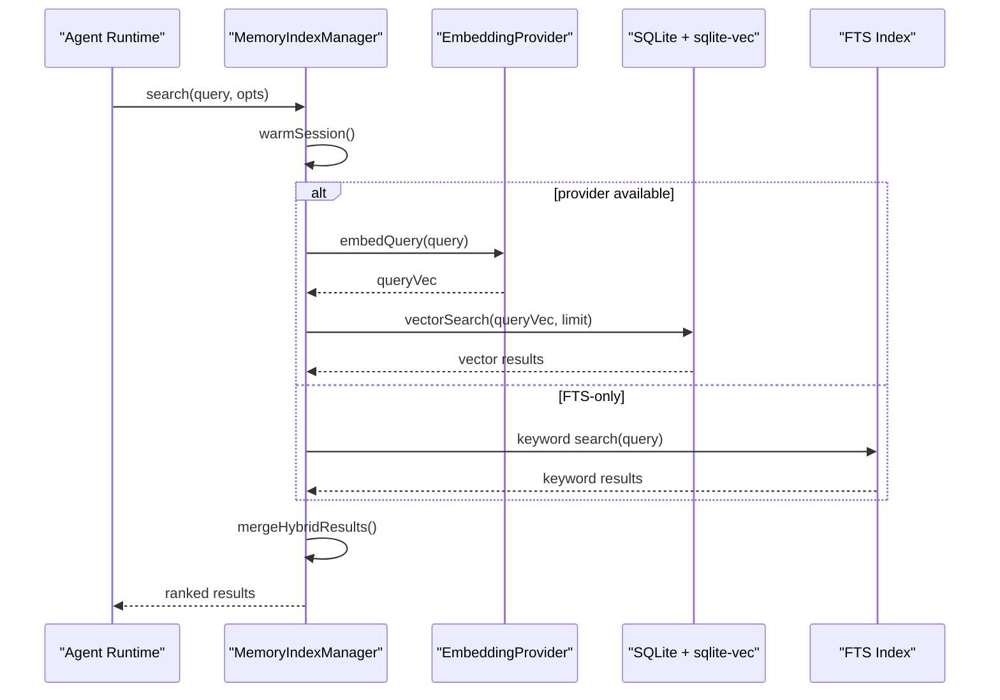
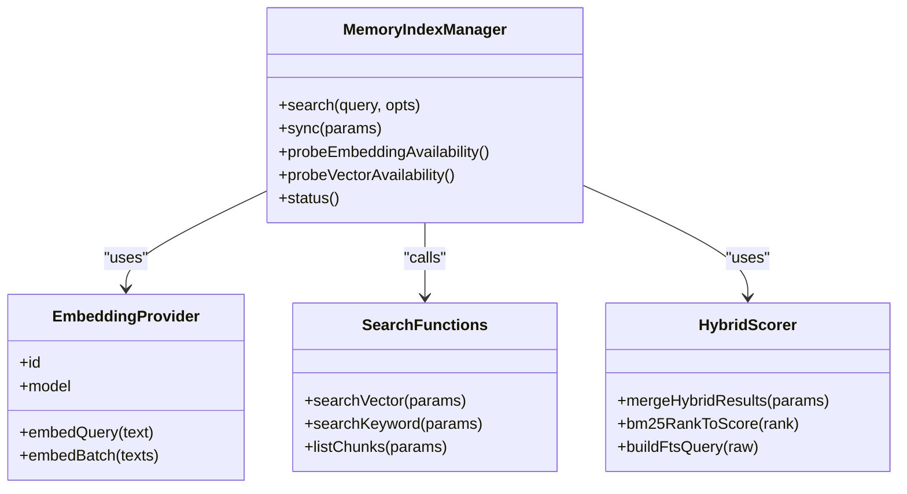
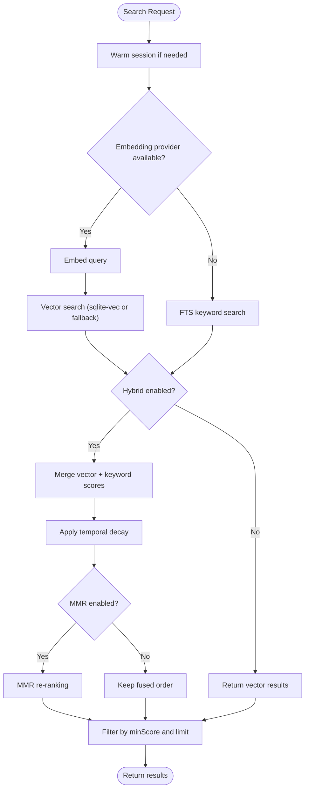
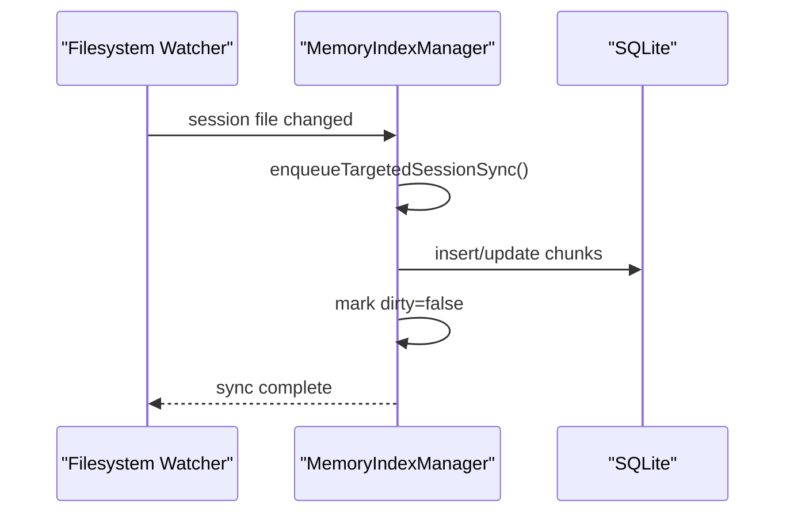
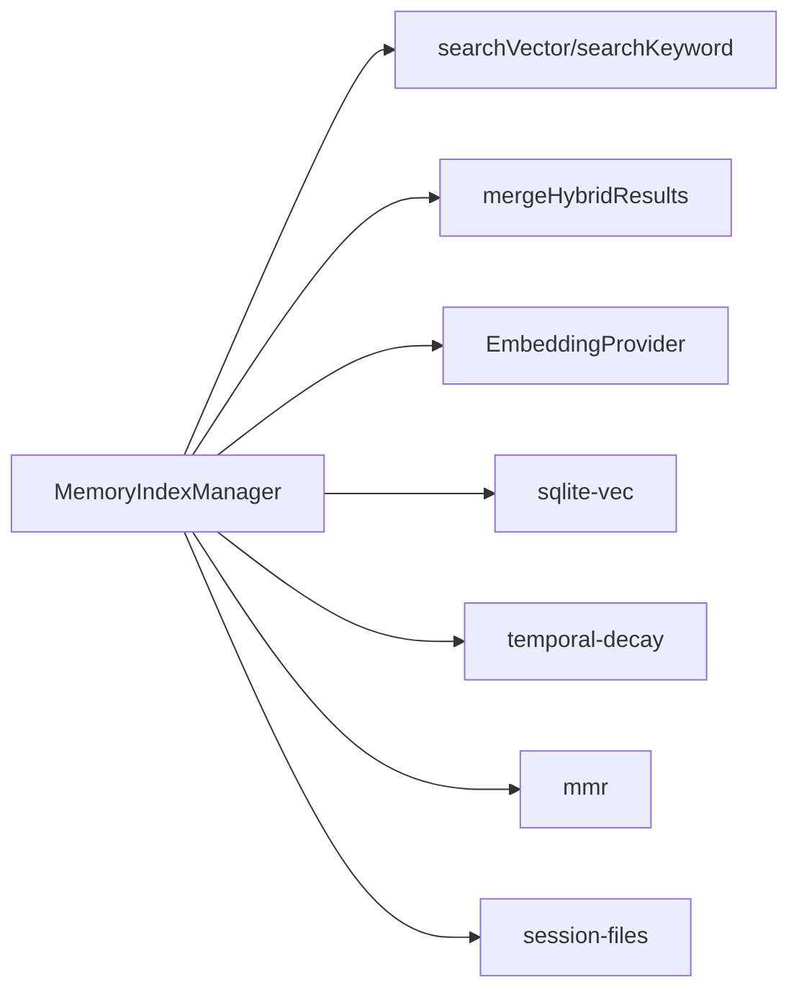

# Memory System

<cite>
**Referenced Files in This Document**
- [src/memory/manager.ts](file://src/memory/manager.ts)
- [src/memory/manager-search.ts](file://src/memory/manager-search.ts)
- [src/memory/hybrid.ts](file://src/memory/hybrid.ts)
- [src/memory/embeddings.ts](file://src/memory/embeddings.ts)
- [src/memory/sqlite-vec.ts](file://src/memory/sqlite-vec.ts)
- [src/memory/sqlite.ts](file://src/memory/sqlite.ts)
- [extensions/memory-lancedb/index.ts](file://extensions/memory-lancedb/index.ts)
- [extensions/memory-core/index.ts](file://extensions/memory-core/index.ts)
- [src/memory/types.ts](file://src/memory/types.ts)
- [src/memory/manager-embedding-ops.ts](file://src/memory/manager-embedding-ops.ts)
- [src/memory/temporal-decay.ts](file://src/memory/temporal-decay.ts)
- [src/memory/mmr.ts](file://src/memory/mmr.ts)
- [src/memory/query-expansion.ts](file://src/memory/query-expansion.ts)
- [src/memory/internal.ts](file://src/memory/internal.ts)
- [src/memory/session-files.ts](file://src/memory/session-files.ts)
- [src/memory/backend-config.ts](file://src/memory/backend-config.ts)
- [src/memory/memory-schema.ts](file://src/memory/memory-schema.ts)
</cite>

## Table of Contents
1. [Introduction](#introduction)
2. [Project Structure](#project-structure)
3. [Core Components](#core-components)
4. [Architecture Overview](#architecture-overview)
5. [Detailed Component Analysis](#detailed-component-analysis)
6. [Dependency Analysis](#dependency-analysis)
7. [Performance Considerations](#performance-considerations)
8. [Troubleshooting Guide](#troubleshooting-guide)
9. [Conclusion](#conclusion)

## Introduction
This document describes OpenClaw’s vector-based memory system, focusing on how long-term knowledge is captured, indexed, embedded, searched, and pruned. It explains the dual-storage architecture combining SQLite with vector extensions for efficient similarity search and a separate LanceDB-based plugin for pure vector storage and recall. The system supports hybrid search (vector + keyword), query expansion, temporal decay, and MMR re-ranking. It also covers memory partitioning by agent workspace, session-driven indexing, and security controls around memory capture and recall.

## Project Structure
The memory system spans two major areas:
- Built-in memory engine: SQLite-backed with vector extension, embedding providers, and hybrid search.
- Memory plugin ecosystem: A first-party plugin using LanceDB for vector storage and OpenAI embeddings.

**Diagram sources**
- [src/memory/manager.ts:61-241](file://src/memory/manager.ts#L61-L241)
- [src/memory/manager-search.ts:20-94](file://src/memory/manager-search.ts#L20-L94)
- [src/memory/hybrid.ts:57-155](file://src/memory/hybrid.ts#L57-L155)
- [src/memory/embeddings.ts:168-288](file://src/memory/embeddings.ts#L168-L288)
- [src/memory/sqlite-vec.ts:3-24](file://src/memory/sqlite-vec.ts#L3-L24)
- [src/memory/sqlite.ts:6-19](file://src/memory/sqlite.ts#L6-L19)
- [extensions/memory-lancedb/index.ts:292-679](file://extensions/memory-lancedb/index.ts#L292-L679)
- [extensions/memory-core/index.ts:4-39](file://extensions/memory-core/index.ts#L4-L39)

**Section sources**
- [src/memory/manager.ts:1-841](file://src/memory/manager.ts#L1-L841)
- [src/memory/manager-search.ts:1-192](file://src/memory/manager-search.ts#L1-L192)
- [src/memory/hybrid.ts:1-156](file://src/memory/hybrid.ts#L1-L156)
- [src/memory/embeddings.ts:1-325](file://src/memory/embeddings.ts#L1-L325)
- [src/memory/sqlite-vec.ts:1-25](file://src/memory/sqlite-vec.ts#L1-L25)
- [src/memory/sqlite.ts:1-20](file://src/memory/sqlite.ts#L1-L20)
- [extensions/memory-lancedb/index.ts:1-679](file://extensions/memory-lancedb/index.ts#L1-L679)
- [extensions/memory-core/index.ts:1-39](file://extensions/memory-core/index.ts#L1-L39)

## Core Components
- MemoryIndexManager: Central orchestrator for indexing, embedding, search, and synchronization. Manages provider selection, batching, and read-only recovery.
- Search pipeline: Vector search via SQLite with sqlite-vec, keyword search via FTS, and hybrid fusion with temporal decay and MMR.
- Embedding providers: Support for OpenAI, local GGUF via node-llama-cpp, Gemini, Mistral, Voyage, and Ollama.
- LanceDB plugin: Alternative vector store with OpenAI embeddings, auto-recall and auto-capture hooks, and CLI/tools.
- Session and workspace scoping: Indexing is isolated per agent workspace and optionally per session.

**Section sources**
- [src/memory/manager.ts:61-241](file://src/memory/manager.ts#L61-L241)
- [src/memory/manager-search.ts:20-94](file://src/memory/manager-search.ts#L20-L94)
- [src/memory/hybrid.ts:57-155](file://src/memory/hybrid.ts#L57-L155)
- [src/memory/embeddings.ts:29-79](file://src/memory/embeddings.ts#L29-L79)
- [extensions/memory-lancedb/index.ts:292-679](file://extensions/memory-lancedb/index.ts#L292-L679)

## Architecture Overview
The built-in memory engine uses SQLite as the primary store, with a vector extension enabling cosine distance similarity. Embeddings are produced by pluggable providers. A hybrid search merges vector and keyword results, applies temporal decay, and optionally MMR. An alternative plugin-based vector store (LanceDB) provides a pure vector path with lifecycle hooks for auto-recall and auto-capture.

**Diagram sources**
- [src/memory/manager.ts:259-367](file://src/memory/manager.ts#L259-L367)
- [src/memory/manager-search.ts:20-94](file://src/memory/manager-search.ts#L20-L94)
- [src/memory/hybrid.ts:57-155](file://src/memory/hybrid.ts#L57-L155)
- [src/memory/embeddings.ts:29-79](file://src/memory/embeddings.ts#L29-L79)

## Detailed Component Analysis

### Vector Storage and Embedding Generation
- SQLite with sqlite-vec: Stores chunk metadata and vectors; vector similarity computed via cosine distance. Vector dimensionality is validated and cached.
- Embedding providers: Support remote APIs and local GGUF models. Provider selection includes auto and fallback logic; missing API keys can degrade to FTS-only mode.
- Batch embedding: Batching utilities and retry/backoff for robust ingestion.

**Diagram sources**
- [src/memory/manager.ts:61-241](file://src/memory/manager.ts#L61-L241)
- [src/memory/embeddings.ts:29-79](file://src/memory/embeddings.ts#L29-L79)
- [src/memory/manager-search.ts:20-94](file://src/memory/manager-search.ts#L20-L94)
- [src/memory/hybrid.ts:33-155](file://src/memory/hybrid.ts#L33-L155)

**Section sources**
- [src/memory/sqlite-vec.ts:3-24](file://src/memory/sqlite-vec.ts#L3-L24)
- [src/memory/embeddings.ts:168-288](file://src/memory/embeddings.ts#L168-L288)
- [src/memory/manager-embedding-ops.ts:30-58](file://src/memory/manager-embedding-ops.ts#L30-L58)

### Semantic Search and Hybrid Retrieval
- Vector search: Uses cosine distance via sqlite-vec when available; otherwise falls back to computing cosine similarity against stored embeddings.
- Keyword search: FTS-based BM25 ranking converted to a 0–1 score.
- Hybrid fusion: Weighted combination of vector and text scores, followed by temporal decay and optional MMR diversity re-ranking.

**Diagram sources**
- [src/memory/manager.ts:259-367](file://src/memory/manager.ts#L259-L367)
- [src/memory/manager-search.ts:20-94](file://src/memory/manager-search.ts#L20-L94)
- [src/memory/hybrid.ts:57-155](file://src/memory/hybrid.ts#L57-L155)
- [src/memory/temporal-decay.ts:1-200](file://src/memory/temporal-decay.ts#L1-L200)
- [src/memory/mmr.ts:1-200](file://src/memory/mmr.ts#L1-L200)

**Section sources**
- [src/memory/manager-search.ts:20-94](file://src/memory/manager-search.ts#L20-L94)
- [src/memory/hybrid.ts:57-155](file://src/memory/hybrid.ts#L57-L155)
- [src/memory/temporal-decay.ts:1-200](file://src/memory/temporal-decay.ts#L1-L200)
- [src/memory/mmr.ts:1-200](file://src/memory/mmr.ts#L1-L200)

### Memory Indexing, Synchronization, and Pruning
- Indexing: Watches agent workspace and session files; incremental sync queues session-specific updates; maintains dirty flags to trigger background sync.
- Synchronization: Supports targeted session sync, readonly recovery, and progress callbacks.
- Pruning and retention: The built-in engine focuses on chunk-level metadata and embeddings; explicit pruning policies are not present in the built-in engine. The LanceDB plugin provides explicit forget operations and duplicate detection thresholds.

**Diagram sources**
- [src/memory/manager.ts:454-503](file://src/memory/manager.ts#L454-L503)
- [src/memory/session-files.ts:1-200](file://src/memory/session-files.ts#L1-L200)

**Section sources**
- [src/memory/manager.ts:454-503](file://src/memory/manager.ts#L454-L503)
- [src/memory/session-files.ts:1-200](file://src/memory/session-files.ts#L1-L200)

### Memory Partitioning, Workspace Isolation, and Cross-Session Sharing
- Agent workspace isolation: Each agent has a dedicated workspace directory; indexing is scoped to that workspace and configured extra paths.
- Session scoping: Optional session-driven warming and targeted sync; session deltas tracked to minimize redundant work.
- Cross-session sharing: Not explicitly implemented in the built-in engine; however, the LanceDB plugin demonstrates a vector store that can be shared across contexts via its service and tools.

**Section sources**
- [src/memory/manager.ts:135-241](file://src/memory/manager.ts#L135-L241)
- [src/memory/session-files.ts:1-200](file://src/memory/session-files.ts#L1-L200)
- [extensions/memory-lancedb/index.ts:292-679](file://extensions/memory-lancedb/index.ts#L292-L679)

### Vector Databases, Search Query Optimization, and Memory Growth Management
- Vector databases:
  - Built-in: SQLite with sqlite-vec for cosine similarity.
  - Plugin: LanceDB table with vectorSearch and L2-to-similarity conversion.
- Query optimization:
  - Candidate multiplier to expand search window before merging.
  - FTS query builder and keyword extraction for conversational queries.
  - Hybrid scoring weights and optional MMR/diversity tuning.
- Growth management:
  - Read-only recovery path to reopen connections and reinitialize vector extension.
  - Batch failure counters and backoff to stabilize ingestion.

**Section sources**
- [src/memory/manager.ts:259-367](file://src/memory/manager.ts#L259-L367)
- [src/memory/manager-search.ts:20-94](file://src/memory/manager-search.ts#L20-L94)
- [src/memory/hybrid.ts:33-56](file://src/memory/hybrid.ts#L33-L56)
- [src/memory/sqlite-vec.ts:3-24](file://src/memory/sqlite-vec.ts#L3-L24)
- [extensions/memory-lancedb/index.ts:116-140](file://extensions/memory-lancedb/index.ts#L116-L140)

### Security, Access Control, and Privacy
- Prompt injection safeguards: The LanceDB plugin includes detection and escaping for prompt injection patterns and sanitization for memory recall context.
- UUID validation: Deletion operations validate UUID format to mitigate injection risks.
- Capture filters: Auto-capture avoids storing agent-generated summaries, system tags, or emoji-heavy content; configurable thresholds and categories reduce risk of sensitive data capture.

**Section sources**
- [extensions/memory-lancedb/index.ts:221-286](file://extensions/memory-lancedb/index.ts#L221-L286)
- [extensions/memory-lancedb/index.ts:142-151](file://extensions/memory-lancedb/index.ts#L142-L151)

## Dependency Analysis
The built-in memory engine depends on:
- SQLite with sqlite-vec for vector similarity.
- Embedding providers for vector generation.
- Hybrid scoring and temporal/MRR modules for ranking.
- Session and filesystem utilities for incremental indexing.

**Diagram sources**
- [src/memory/manager.ts:61-241](file://src/memory/manager.ts#L61-L241)
- [src/memory/manager-search.ts:20-94](file://src/memory/manager-search.ts#L20-L94)
- [src/memory/hybrid.ts:57-155](file://src/memory/hybrid.ts#L57-L155)
- [src/memory/embeddings.ts:168-288](file://src/memory/embeddings.ts#L168-L288)
- [src/memory/sqlite-vec.ts:3-24](file://src/memory/sqlite-vec.ts#L3-L24)
- [src/memory/temporal-decay.ts:1-200](file://src/memory/temporal-decay.ts#L1-L200)
- [src/memory/mmr.ts:1-200](file://src/memory/mmr.ts#L1-L200)
- [src/memory/session-files.ts:1-200](file://src/memory/session-files.ts#L1-L200)

**Section sources**
- [src/memory/manager.ts:61-241](file://src/memory/manager.ts#L61-L241)
- [src/memory/manager-search.ts:20-94](file://src/memory/manager-search.ts#L20-L94)
- [src/memory/hybrid.ts:57-155](file://src/memory/hybrid.ts#L57-L155)
- [src/memory/embeddings.ts:168-288](file://src/memory/embeddings.ts#L168-L288)
- [src/memory/sqlite-vec.ts:3-24](file://src/memory/sqlite-vec.ts#L3-L24)
- [src/memory/temporal-decay.ts:1-200](file://src/memory/temporal-decay.ts#L1-L200)
- [src/memory/mmr.ts:1-200](file://src/memory/mmr.ts#L1-L200)
- [src/memory/session-files.ts:1-200](file://src/memory/session-files.ts#L1-L200)

## Performance Considerations
- Vector acceleration: Enable sqlite-vec for cosine similarity; validate dimensions and cache metadata to avoid repeated initialization.
- Hybrid tuning: Adjust candidate multiplier and scoring weights to balance recall and latency.
- Batching and retries: Use batch embedding with concurrency limits and exponential backoff to improve throughput and resilience.
- Readonly recovery: The engine automatically reopens connections on read-only errors to maintain availability.
- Query expansion: Extract keywords for conversational queries to improve FTS recall when vector is unavailable.

[No sources needed since this section provides general guidance]

## Troubleshooting Guide
- SQLite vector extension not loaded: Verify sqlite-vec installation and extension path; check load errors and fallback to CPU-based similarity.
- Missing API keys or provider errors: The engine can degrade to FTS-only mode; review providerUnavailableReason and fallbackFrom/fallbackReason fields.
- Read-only database: The engine detects SQLITE_READONLY and reinitializes the connection; monitor readonlyRecovery counters.
- Slow hybrid search: Increase candidate multiplier or adjust hybrid weights; consider disabling MMR for large corpora.

**Section sources**
- [src/memory/sqlite-vec.ts:3-24](file://src/memory/sqlite-vec.ts#L3-L24)
- [src/memory/manager.ts:505-589](file://src/memory/manager.ts#L505-L589)
- [src/memory/types.ts:24-59](file://src/memory/types.ts#L24-L59)

## Conclusion
OpenClaw’s memory system combines a flexible built-in engine with a vector-capable plugin. The built-in engine emphasizes robustness, hybrid search, and incremental indexing, while the LanceDB plugin offers a pure vector path with lifecycle hooks for auto-recall and auto-capture. Together, they support secure, scalable, and privacy-conscious long-term memory with strong controls over embedding generation, search fusion, and growth management.