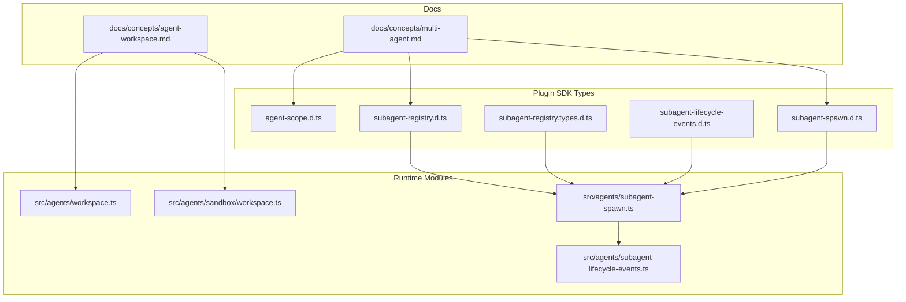
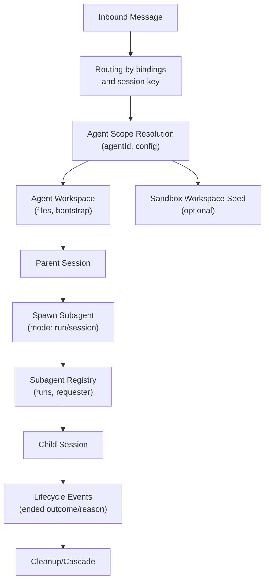
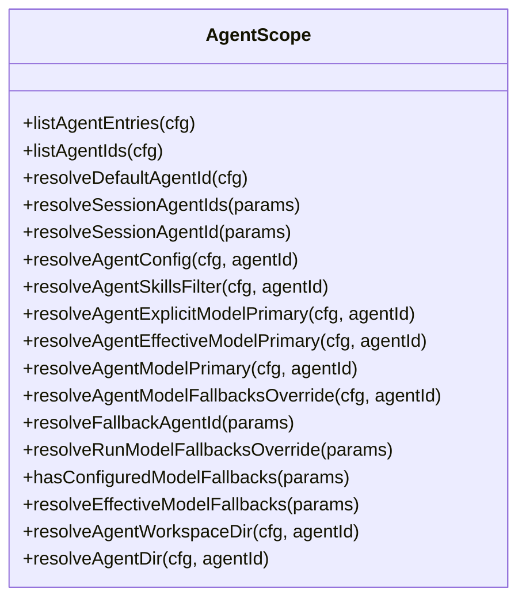
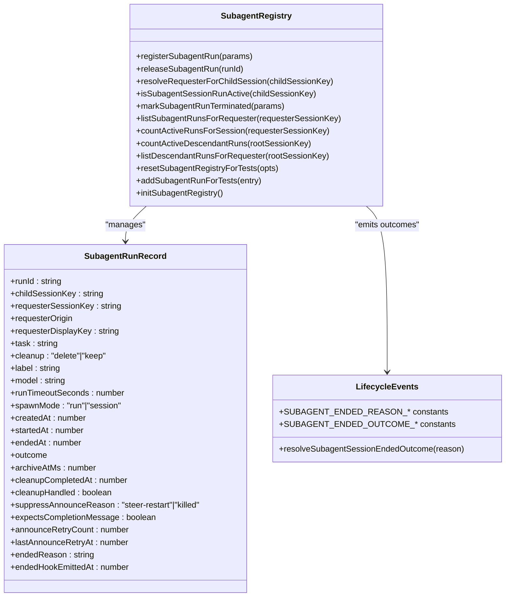
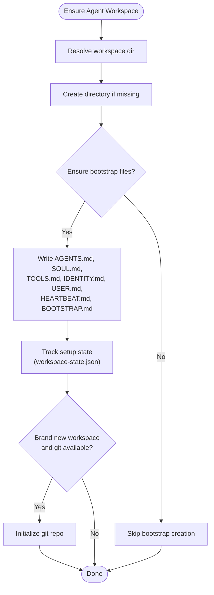
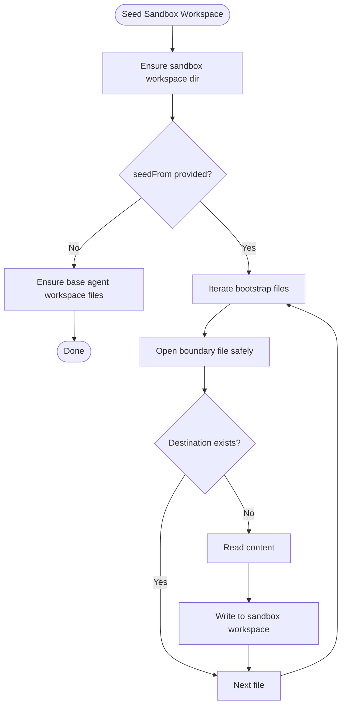
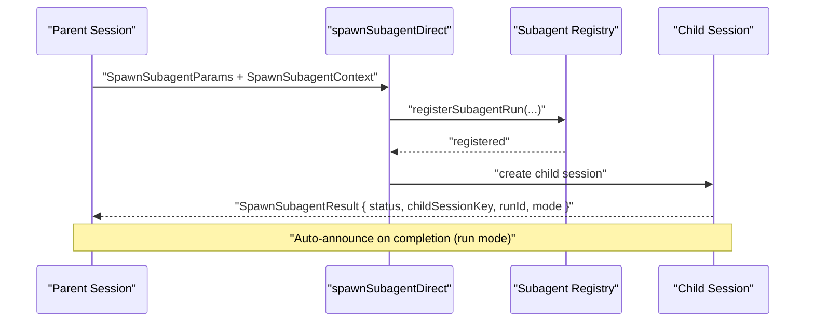
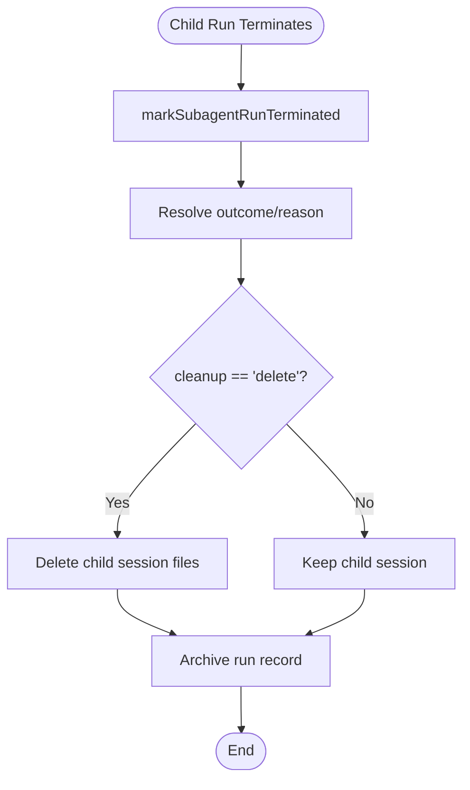
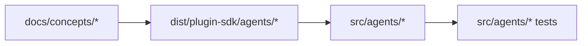

# Multi-Agent System

<cite>
**Referenced Files in This Document**
- [multi-agent.md](file://docs/concepts/multi-agent.md)
- [agent-workspace.md](file://docs/concepts/agent-workspace.md)
- [agent-scope.d.ts](file://dist/plugin-sdk/agents/agent-scope.d.ts)
- [subagent-registry.d.ts](file://dist/plugin-sdk/agents/subagent-registry.d.ts)
- [subagent-registry.types.d.ts](file://dist/plugin-sdk/agents/subagent-registry.types.d.ts)
- [subagent-lifecycle-events.d.ts](file://dist/plugin-sdk/agents/subagent-lifecycle-events.d.ts)
- [subagent-spawn.d.ts](file://dist/plugin-sdk/agents/subagent-spawn.d.ts)
- [workspace.ts](file://src/agents/workspace.ts)
- [workspace.ts](file://src/agents/sandbox/workspace.ts)
- [subagent-spawn.ts](file://src/agents/subagent-spawn.ts)
- [subagent-lifecycle-events.ts](file://src/agents/subagent-lifecycle-events.ts)
- [openclaw-tools.subagents.sessions-spawn.lifecycle.test.ts](file://src/agents/openclaw-tools.subagents.sessions-spawn.lifecycle.test.ts)
- [31-captains-chair-with-memory.prose](file://extensions/open-prose/skills/prose/examples/31-captains-chair-with-memory.prose)
- [28-gas-town.prose](file://extensions/open-prose/skills/prose/examples/28-gas-town.prose)
</cite>

## Table of Contents
1. [Introduction](#introduction)
2. [Project Structure](#project-structure)
3. [Core Components](#core-components)
4. [Architecture Overview](#architecture-overview)
5. [Detailed Component Analysis](#detailed-component-analysis)
6. [Dependency Analysis](#dependency-analysis)
7. [Performance Considerations](#performance-considerations)
8. [Troubleshooting Guide](#troubleshooting-guide)
9. [Conclusion](#conclusion)
10. [Appendices](#appendices)

## Introduction
This document explains OpenClaw’s multi-agent orchestration architecture with a focus on how each user interaction spawns isolated agent workspaces, each with independent models, tools, and memories. It covers the agent scope system, subagent registry, workspace isolation, lifecycle management, spawning patterns, and the relationship between parent and child agents. It also details configuration inheritance, sandbox isolation, resource allocation strategies, and provides concrete examples of agent hierarchies, multi-step workflows, and collaborative agent scenarios.

## Project Structure
OpenClaw organizes multi-agent capabilities across documentation, SDK types, and runtime modules:
- Concepts and configuration: multi-agent routing, workspace, sandbox, and tool policies
- Plugin SDK types: agent scope resolution, subagent registry, spawn modes, lifecycle events
- Runtime modules: workspace bootstrap and sandbox workspace seeding, subagent spawn orchestration, lifecycle event emission

**Diagram sources**
- [multi-agent.md:1-553](file://docs/concepts/multi-agent.md#L1-L553)
- [agent-workspace.md:1-237](file://docs/concepts/agent-workspace.md#L1-L237)
- [agent-scope.d.ts:1-62](file://dist/plugin-sdk/agents/agent-scope.d.ts#L1-L62)
- [subagent-registry.d.ts:1-46](file://dist/plugin-sdk/agents/subagent-registry.d.ts#L1-L46)
- [subagent-registry.types.d.ts:1-35](file://dist/plugin-sdk/agents/subagent-registry.types.d.ts#L1-L35)
- [subagent-lifecycle-events.d.ts:1-19](file://dist/plugin-sdk/agents/subagent-lifecycle-events.d.ts#L1-L19)
- [subagent-spawn.d.ts:1-48](file://dist/plugin-sdk/agents/subagent-spawn.d.ts#L1-L48)
- [workspace.ts:1-648](file://src/agents/workspace.ts#L1-L648)
- [workspace.ts:17-66](file://src/agents/sandbox/workspace.ts#L17-L66)
- [subagent-spawn.ts](file://src/agents/subagent-spawn.ts)
- [subagent-lifecycle-events.ts](file://src/agents/subagent-lifecycle-events.ts)

**Section sources**
- [multi-agent.md:1-553](file://docs/concepts/multi-agent.md#L1-L553)
- [agent-workspace.md:1-237](file://docs/concepts/agent-workspace.md#L1-L237)

## Core Components
- Agent scope system: resolves agent identities, default agent selection, and per-agent configuration (models, skills, sandbox, tools).
- Subagent registry: tracks spawned child runs, their lifecycles, requester relationships, and completion expectations.
- Workspace isolation: per-agent workspace and sandboxed workspace seeding; bootstrap files and minimal injection for subagents/cron.
- Sandbox and tool configuration: per-agent sandbox mode and tool allow/deny lists; agent-to-agent messaging controls.
- Lifecycle events: standardized outcomes and reasons for subagent termination.

**Section sources**
- [agent-scope.d.ts:20-62](file://dist/plugin-sdk/agents/agent-scope.d.ts#L20-L62)
- [subagent-registry.d.ts:12-46](file://dist/plugin-sdk/agents/subagent-registry.d.ts#L12-L46)
- [subagent-registry.types.d.ts:5-35](file://dist/plugin-sdk/agents/subagent-registry.types.d.ts#L5-L35)
- [subagent-lifecycle-events.d.ts:1-19](file://dist/plugin-sdk/agents/subagent-lifecycle-events.d.ts#L1-L19)
- [workspace.ts:327-465](file://src/agents/workspace.ts#L327-L465)
- [workspace.ts:17-66](file://src/agents/sandbox/workspace.ts#L17-L66)
- [multi-agent.md:502-553](file://docs/concepts/multi-agent.md#L502-L553)

## Architecture Overview
OpenClaw’s multi-agent runtime ensures that each inbound interaction routes deterministically to a specific agent workspace. The agent scope system resolves the effective agent configuration, while the subagent registry manages child runs spawned from parent sessions. Workspaces are isolated per agent, and sandboxing can be applied per agent to constrain tools and filesystem access. The lifecycle subsystem emits outcomes and reasons when subagents terminate.

**Diagram sources**
- [multi-agent.md:172-187](file://docs/concepts/multi-agent.md#L172-L187)
- [agent-scope.d.ts:23-62](file://dist/plugin-sdk/agents/agent-scope.d.ts#L23-L62)
- [workspace.ts:327-465](file://src/agents/workspace.ts#L327-L465)
- [workspace.ts:17-66](file://src/agents/sandbox/workspace.ts#L17-L66)
- [subagent-spawn.d.ts:3-48](file://dist/plugin-sdk/agents/subagent-spawn.d.ts#L3-L48)
- [subagent-registry.d.ts:12-46](file://dist/plugin-sdk/agents/subagent-registry.d.ts#L12-L46)
- [subagent-lifecycle-events.d.ts:4-19](file://dist/plugin-sdk/agents/subagent-lifecycle-events.d.ts#L4-L19)

## Detailed Component Analysis

### Agent Scope System
The agent scope system resolves agent identities and configuration for a given session. It supports:
- Listing agent entries and IDs
- Resolving default agent ID
- Determining session agent IDs from session keys or overrides
- Resolving per-agent configuration (workspace, agentDir, model, skills, memory search, heartbeat, identity, groupChat, subagents, sandbox, tools)
- Model resolution: primary, fallbacks, and session override handling

**Diagram sources**
- [agent-scope.d.ts:20-62](file://dist/plugin-sdk/agents/agent-scope.d.ts#L20-L62)

**Section sources**
- [agent-scope.d.ts:20-62](file://dist/plugin-sdk/agents/agent-scope.d.ts#L20-L62)
- [multi-agent.md:172-187](file://docs/concepts/multi-agent.md#L172-L187)

### Subagent Registry and Lifecycle
The subagent registry maintains records for each spawned child run, including requester context, task, model, spawn mode, timeouts, and completion expectations. It exposes APIs to register, release, query, and mark terminations. Lifecycle events define standardized outcomes and reasons for termination.

**Diagram sources**
- [subagent-registry.d.ts:12-46](file://dist/plugin-sdk/agents/subagent-registry.d.ts#L12-L46)
- [subagent-registry.types.d.ts:5-35](file://dist/plugin-sdk/agents/subagent-registry.types.d.ts#L5-L35)
- [subagent-lifecycle-events.d.ts:1-19](file://dist/plugin-sdk/agents/subagent-lifecycle-events.d.ts#L1-L19)

**Section sources**
- [subagent-registry.d.ts:12-46](file://dist/plugin-sdk/agents/subagent-registry.d.ts#L12-L46)
- [subagent-registry.types.d.ts:5-35](file://dist/plugin-sdk/agents/subagent-registry.types.d.ts#L5-L35)
- [subagent-lifecycle-events.d.ts:1-19](file://dist/plugin-sdk/agents/subagent-lifecycle-events.d.ts#L1-L19)

### Workspace Isolation and Bootstrap
Agent workspaces are isolated per agent and act as the default working directory for file tools and context. The runtime ensures bootstrap files are created and caches workspace file content to avoid stale reads. For sandboxed environments, a sandbox workspace can be seeded from a source workspace with guarded boundary checks.

**Diagram sources**
- [workspace.ts:327-465](file://src/agents/workspace.ts#L327-L465)

**Section sources**
- [agent-workspace.md:17-237](file://docs/concepts/agent-workspace.md#L17-L237)
- [workspace.ts:327-465](file://src/agents/workspace.ts#L327-L465)

### Sandbox Workspace Seeding
When sandboxing is enabled, a sandbox workspace can be seeded from a source workspace with guarded boundary checks. Only recognized bootstrap files are copied, and missing seeds are ignored gracefully.

**Diagram sources**
- [workspace.ts:17-66](file://src/agents/sandbox/workspace.ts#L17-L66)

**Section sources**
- [workspace.ts:17-66](file://src/agents/sandbox/workspace.ts#L17-L66)

### Subagent Spawning Patterns
Spawning supports two modes:
- run: ephemeral task with auto-announcement on completion
- session: thread-bound session that remains active for follow-ups

Spawn APIs accept task, label, agentId override, model, thinking, timeouts, threading, cleanup policy, and completion expectations. Results include status, child session key, runId, mode, and notes.

**Diagram sources**
- [subagent-spawn.d.ts:3-48](file://dist/plugin-sdk/agents/subagent-spawn.d.ts#L3-L48)
- [subagent-registry.d.ts:12-25](file://dist/plugin-sdk/agents/subagent-registry.d.ts#L12-L25)
- [subagent-spawn.ts](file://src/agents/subagent-spawn.ts)

**Section sources**
- [subagent-spawn.d.ts:3-48](file://dist/plugin-sdk/agents/subagent-spawn.d.ts#L3-L48)
- [subagent-registry.d.ts:12-25](file://dist/plugin-sdk/agents/subagent-registry.d.ts#L12-L25)

### Lifecycle Management and Cleanup
Lifecycle events standardize outcomes and reasons for termination. The registry marks runs terminated, supports steer-restart replacement, and cleans up resources according to cleanup policy.

**Diagram sources**
- [subagent-lifecycle-events.d.ts:4-19](file://dist/plugin-sdk/agents/subagent-lifecycle-events.d.ts#L4-L19)
- [subagent-registry.d.ts:36-42](file://dist/plugin-sdk/agents/subagent-registry.d.ts#L36-L42)

**Section sources**
- [subagent-lifecycle-events.d.ts:4-19](file://dist/plugin-sdk/agents/subagent-lifecycle-events.d.ts#L4-L19)
- [subagent-registry.d.ts:36-42](file://dist/plugin-sdk/agents/subagent-registry.d.ts#L36-L42)

### Routing and Binding Rules
Routing is deterministic and most-specific wins:
- peer match (DM/group/channel id)
- parentPeer match (thread inheritance)
- guildId + roles (Discord role routing)
- guildId (Discord)
- teamId (Slack)
- accountId match for a channel
- channel-level match (accountId: "*")
- fallback to default agent

Bindings can be scoped to a specific account or channel-wide, with upgrade semantics when adding explicit accounts.

**Section sources**
- [multi-agent.md:172-193](file://docs/concepts/multi-agent.md#L172-L193)

### Sandbox and Tool Configuration
Per-agent sandbox and tool configuration allow flexible security and resource control:
- sandbox.mode: off, all, etc.
- sandbox.scope: agent or shared
- tools.allow/deny: restrict tool usage
- agent-to-agent messaging controlled via tools.agentToAgent

**Section sources**
- [multi-agent.md:502-553](file://docs/concepts/multi-agent.md#L502-L553)

### Examples: Hierarchies, Workflows, and Collaboration
- Captain’s chair with memory and self-improvement: orchestrator coordinates specialized subagents, validates outputs, and learns from sessions.
- Gas Town: industrialized multi-agent system with 7 worker roles, epics, molecules, and formulas for scalable workflows.

**Section sources**
- [31-captains-chair-with-memory.prose:18-41](file://extensions/open-prose/skills/prose/examples/31-captains-chair-with-memory.prose#L18-L41)
- [28-gas-town.prose:1-34](file://extensions/open-prose/skills/prose/examples/28-gas-town.prose#L1-L34)

## Dependency Analysis
The multi-agent system exhibits clear separation of concerns:
- Docs define routing, workspace, sandbox, and tool policies
- SDK types define agent scope, subagent registry, spawn modes, and lifecycle
- Runtime modules implement workspace bootstrap, sandbox seeding, and spawn/lifecycle orchestration

**Diagram sources**
- [multi-agent.md:1-553](file://docs/concepts/multi-agent.md#L1-L553)
- [agent-scope.d.ts:1-62](file://dist/plugin-sdk/agents/agent-scope.d.ts#L1-L62)
- [subagent-registry.d.ts:1-46](file://dist/plugin-sdk/agents/subagent-registry.d.ts#L1-L46)
- [workspace.ts:1-648](file://src/agents/workspace.ts#L1-L648)
- [subagent-spawn.ts](file://src/agents/subagent-spawn.ts)

**Section sources**
- [multi-agent.md:1-553](file://docs/concepts/multi-agent.md#L1-L553)
- [agent-scope.d.ts:1-62](file://dist/plugin-sdk/agents/agent-scope.d.ts#L1-L62)
- [subagent-registry.d.ts:1-46](file://dist/plugin-sdk/agents/subagent-registry.d.ts#L1-L46)
- [workspace.ts:1-648](file://src/agents/workspace.ts#L1-L648)
- [subagent-spawn.ts](file://src/agents/subagent-spawn.ts)

## Performance Considerations
- Workspace bootstrap caching avoids repeated IO and stale reads.
- Minimal bootstrap injection for subagents/cron reduces token usage and latency.
- Sandbox workspace seeding copies only recognized bootstrap files, skipping missing seeds.
- Lifecycle cleanup policies (“delete” vs “keep”) balance resource retention and storage overhead.
- Deterministic routing minimizes lookup overhead and ambiguity.

[No sources needed since this section provides general guidance]

## Troubleshooting Guide
- Verify agent bindings and routing specificity to avoid ambiguous matches.
- Confirm per-agent workspace bootstrap files exist and are readable.
- Check sandbox workspace seeding logs for boundary violations or missing seed files.
- Monitor subagent registry for orphaned runs and lifecycle mismatches.
- Validate model fallbacks and session override behavior when tasks fail.

**Section sources**
- [multi-agent.md:172-193](file://docs/concepts/multi-agent.md#L172-L193)
- [workspace.ts:487-547](file://src/agents/workspace.ts#L487-L547)
- [workspace.ts:17-66](file://src/agents/sandbox/workspace.ts#L17-L66)
- [openclaw-tools.subagents.sessions-spawn.lifecycle.test.ts](file://src/agents/openclaw-tools.subagents.sessions-spawn.lifecycle.test.ts)

## Conclusion
OpenClaw’s multi-agent system provides robust isolation through per-agent workspaces and optional sandboxing, deterministic routing via bindings, and a comprehensive subagent registry with lifecycle management. The agent scope system enables flexible configuration inheritance and model resolution, while spawn modes support both ephemeral tasks and persistent sessions. Real-world orchestration patterns, such as the captain’s chair and Gas Town, demonstrate scalable collaboration among agents.

[No sources needed since this section summarizes without analyzing specific files]

## Appendices
- Agent workspace file map and bootstrap behavior
- Sandbox workspace seeding and boundary checks
- Subagent spawn parameters and results
- Lifecycle outcomes and reasons

**Section sources**
- [agent-workspace.md:64-125](file://docs/concepts/agent-workspace.md#L64-L125)
- [workspace.ts:17-66](file://src/agents/sandbox/workspace.ts#L17-L66)
- [subagent-spawn.d.ts:28-36](file://dist/plugin-sdk/agents/subagent-spawn.d.ts#L28-L36)
- [subagent-lifecycle-events.d.ts:4-19](file://dist/plugin-sdk/agents/subagent-lifecycle-events.d.ts#L4-L19)