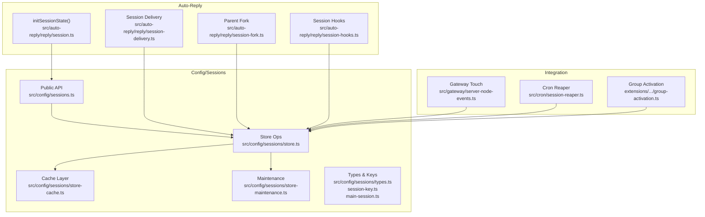
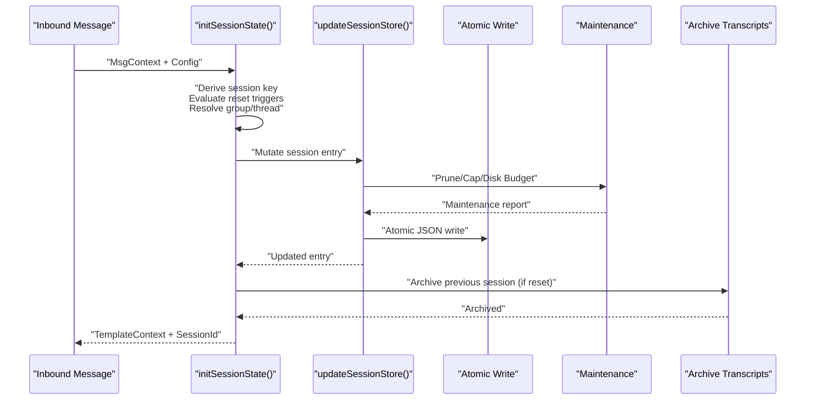
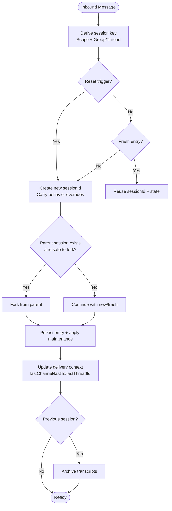
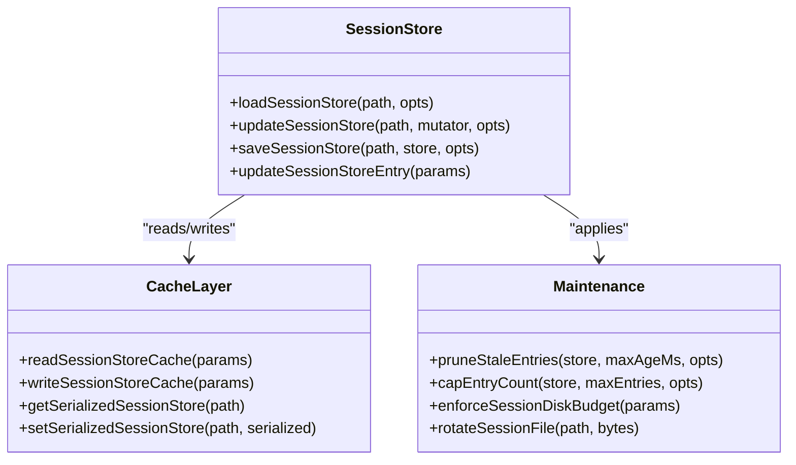
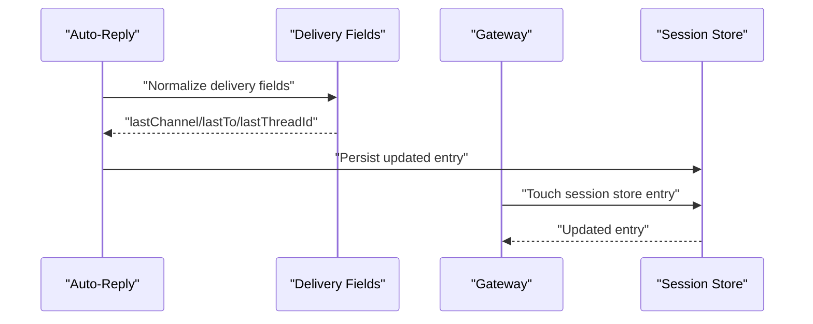
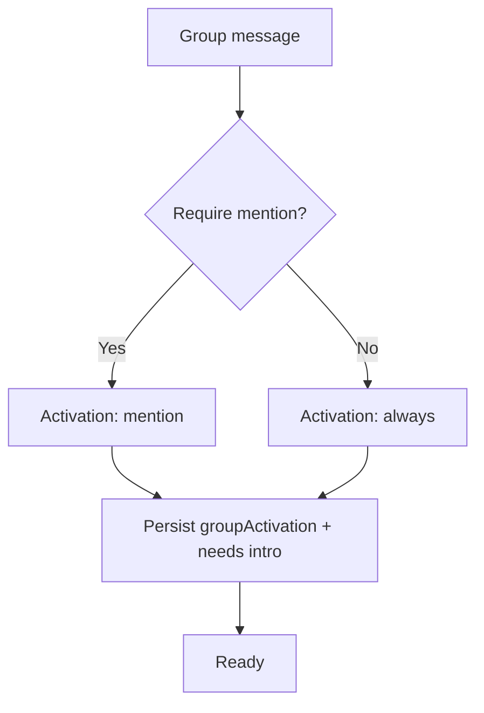
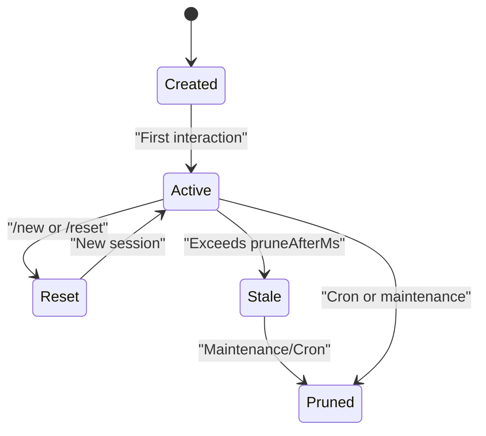
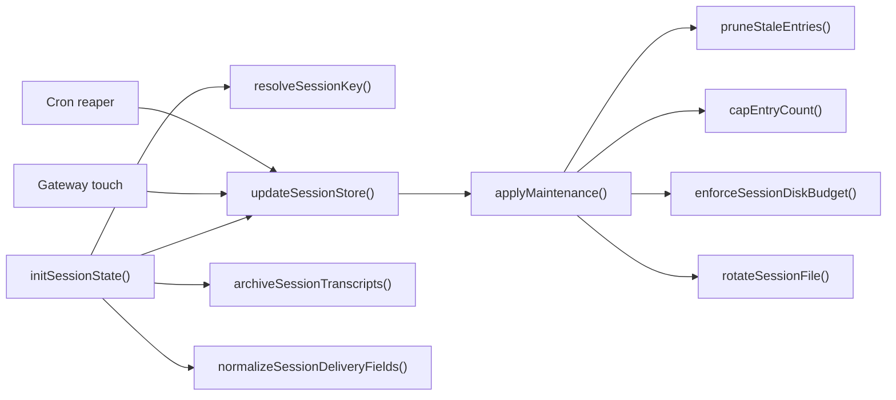

# Session Management

<cite>
**Referenced Files in This Document**
- [session.ts](file://src/auto-reply/reply/session.ts)
- [sessions.ts](file://src/config/sessions.ts)
- [store.ts](file://src/config/sessions/store.ts)
- [store-cache.ts](file://src/config/sessions/store-cache.ts)
- [store-maintenance.ts](file://src/config/sessions/store-maintenance.ts)
- [types.ts](file://src/config/sessions/types.ts)
- [session-key.ts](file://src/config/sessions/session-key.ts)
- [main-session.ts](file://src/config/sessions/main-session.ts)
- [session.test.ts](file://src/auto-reply/reply/session.test.ts)
- [session.ts](file://src/auto-reply/reply/session-delivery.ts)
- [session-fork.ts](file://src/auto-reply/reply/session-fork.ts)
- [session-hooks.ts](file://src/auto-reply/reply/session-hooks.ts)
- [conversation-binding.test.ts](file://src/plugins/conversation-binding.test.ts)
- [session-reaper.ts](file://src/cron/session-reaper.ts)
- [server-node-events.ts](file://src/gateway/server-node-events.ts)
- [group-activation.ts](file://extensions/whatsapp/src/auto-reply/monitor/group-activation.ts)
- [commands-session.ts](file://src/auto-reply/reply/commands-session.ts)
</cite>

## Table of Contents
1. [Introduction](#introduction)
2. [Project Structure](#project-structure)
3. [Core Components](#core-components)
4. [Architecture Overview](#architecture-overview)
5. [Detailed Component Analysis](#detailed-component-analysis)
6. [Dependency Analysis](#dependency-analysis)
7. [Performance Considerations](#performance-considerations)
8. [Troubleshooting Guide](#troubleshooting-guide)
9. [Conclusion](#conclusion)

## Introduction
This document explains OpenClaw’s session management with a focus on conversation state handling. It covers the session model, main sessions for direct chats, group isolation, activation modes, reply-back mechanisms, persistence and synchronization across channels, lifecycle management, metadata, thread binding, and performance strategies for large-scale deployments.

## Project Structure
OpenClaw centralizes session logic under the auto-reply and config/sessions subsystems:
- Auto-reply initializes and evolves session state per inbound message.
- Config/sessions defines the session store, keys, types, and maintenance policies.
- Gateways and plugins coordinate persistence, pruning, and cross-channel continuity.

**Diagram sources**
- [session.ts:169-621](file://src/auto-reply/reply/session.ts#L169-L621)
- [sessions.ts:1-15](file://src/config/sessions.ts#L1-L15)
- [store.ts:1-884](file://src/config/sessions/store.ts#L1-L884)
- [store-cache.ts:1-81](file://src/config/sessions/store-cache.ts#L1-L81)
- [store-maintenance.ts:150-219](file://src/config/sessions/store-maintenance.ts#L150-L219)
- [types.ts:1-383](file://src/config/sessions/types.ts#L1-L383)
- [session-key.ts:1-49](file://src/config/sessions/session-key.ts#L1-L49)
- [main-session.ts:1-80](file://src/config/sessions/main-session.ts#L1-L80)
- [server-node-events.ts:135-169](file://src/gateway/server-node-events.ts#L135-L169)
- [session-reaper.ts:81-109](file://src/cron/session-reaper.ts#L81-L109)
- [group-activation.ts:49-63](file://extensions/whatsapp/src/auto-reply/monitor/group-activation.ts#L49-L63)

**Section sources**
- [sessions.ts:1-15](file://src/config/sessions.ts#L1-L15)
- [store.ts:1-884](file://src/config/sessions/store.ts#L1-L884)

## Core Components
- Session initialization and lifecycle: orchestrates reset triggers, group isolation, thread binding, and persistence.
- Session store: atomic JSON persistence with concurrency control, caching, maintenance, and disk budgeting.
- Types and keys: session entry schema, session key derivation, and main session aliasing.
- Reply-back and delivery: maintains last channel/to/thread for cross-channel continuity.
- Maintenance: pruning stale entries, capping total entries, rotating files, and enforcing disk budgets.
- Cross-channel continuity: stores delivery context and last routing info to support reply-back.

**Section sources**
- [session.ts:169-621](file://src/auto-reply/reply/session.ts#L169-L621)
- [store.ts:195-533](file://src/config/sessions/store.ts#L195-L533)
- [types.ts:68-174](file://src/config/sessions/types.ts#L68-L174)
- [session-key.ts:29-49](file://src/config/sessions/session-key.ts#L29-L49)
- [main-session.ts:11-80](file://src/config/sessions/main-session.ts#L11-L80)

## Architecture Overview
The session lifecycle begins with inbound message processing and ends with persistence and optional archival. Key flows:
- Initialize session state, detect reset triggers, compute session key, and decide group vs direct isolation.
- Persist session entry and optionally fork from a parent session.
- Maintain delivery context for reply-back and cross-channel routing.
- Apply maintenance (pruning, capping, rotation, disk budget) on save or periodically.

**Diagram sources**
- [session.ts:169-621](file://src/auto-reply/reply/session.ts#L169-L621)
- [store.ts:521-533](file://src/config/sessions/store.ts#L521-L533)
- [store.ts:340-509](file://src/config/sessions/store.ts#L340-L509)

## Detailed Component Analysis

### Session Initialization and Lifecycle
- Reset triggers: configurable commands (/new, /reset) and native slash commands route to target session keys when applicable.
- Group isolation: group conversations resolve to distinct session keys; direct chats collapse to a main session bucket.
- Thread binding: preserves lastThreadId within thread sessions; avoids inheriting stale threadId across non-thread sessions.
- Parent fork: forks from parent session when safe; otherwise starts fresh to avoid context overflow.
- Persistence: atomic write with maintenance applied; warns when active session would be evicted.

**Diagram sources**
- [session.ts:169-621](file://src/auto-reply/reply/session.ts#L169-L621)
- [session-fork.ts](file://src/auto-reply/reply/session-fork.ts)
- [store.ts:340-509](file://src/config/sessions/store.ts#L340-L509)

**Section sources**
- [session.ts:169-621](file://src/auto-reply/reply/session.ts#L169-L621)
- [session.test.ts:1758-1816](file://src/auto-reply/reply/session.test.ts#L1758-L1816)

### Session Storage, Retrieval, and Concurrency
- Atomic persistence: uses atomic write to avoid partial writes and race conditions.
- Locking: queue-based write lock prevents concurrent writers from overwriting each other.
- Caching: TTL-based cache of serialized and deserialized store with stat-based invalidation.
- Maintenance: prune stale entries, cap total entries, rotate files, enforce disk budget, and archive removed transcripts.

**Diagram sources**
- [store.ts:195-533](file://src/config/sessions/store.ts#L195-L533)
- [store-cache.ts:41-81](file://src/config/sessions/store-cache.ts#L41-L81)
- [store-maintenance.ts:150-219](file://src/config/sessions/store-maintenance.ts#L150-L219)

**Section sources**
- [store.ts:195-533](file://src/config/sessions/store.ts#L195-L533)
- [store-cache.ts:1-81](file://src/config/sessions/store-cache.ts#L1-L81)
- [store-maintenance.ts:150-219](file://src/config/sessions/store-maintenance.ts#L150-L219)

### Session Model and Metadata
- SessionEntry fields capture runtime behavior (thinking/verbose/reasoning levels, ttsAuto, provider/model overrides), queue and send policies, token usage, delivery context, and ACP metadata.
- Keys: derive per-sender vs global; main session alias resolves to a canonical bucket for direct chats; group sessions isolate by group/channel identifiers.
- Main session aliasing: “main” and variants resolve to agent-scoped main buckets.

```mermaid
erDiagram
SESSION_ENTRY {
string sessionId
number updatedAt
string sessionFile
boolean forkedFromParent
number spawnDepth
string subagentRole
string subagentControlScope
boolean systemSent
boolean abortedLastRun
string abortCutoffMessageSid
number abortCutoffTimestamp
string chatType
string thinkingLevel
boolean fastMode
string verboseLevel
string reasoningLevel
string elevatedLevel
string ttsAuto
string execHost
string execSecurity
string execAsk
string execNode
string responseUsage
string providerOverride
string modelOverride
string authProfileOverride
string authProfileOverrideSource
number authProfileOverrideCompactionCount
string groupActivation
boolean groupActivationNeedsSystemIntro
string sendPolicy
string queueMode
number queueDebounceMs
number queueCap
string queueDrop
number inputTokens
number outputTokens
number totalTokens
boolean totalTokensFresh
number cacheRead
number cacheWrite
string modelProvider
string model
string fallbackNoticeSelectedModel
string fallbackNoticeActiveModel
string fallbackNoticeReason
number contextTokens
number compactionCount
number memoryFlushAt
number memoryFlushCompactionCount
string label
string displayName
string channel
string groupId
string subject
string groupChannel
string space
json origin
json deliveryContext
string lastChannel
string lastTo
string lastAccountId
string lastThreadId
json skillsSnapshot
json systemPromptReport
json acp
}
```

**Diagram sources**
- [types.ts:68-174](file://src/config/sessions/types.ts#L68-L174)

**Section sources**
- [types.ts:68-174](file://src/config/sessions/types.ts#L68-L174)
- [session-key.ts:29-49](file://src/config/sessions/session-key.ts#L29-L49)
- [main-session.ts:51-80](file://src/config/sessions/main-session.ts#L51-L80)

### Reply-Back Systems and Cross-Channel Continuity
- Delivery context normalization: tracks lastChannel, lastTo, lastAccountId, lastThreadId to support reply-back and announce routing.
- Legacy main delivery retirement: migrates legacy routes to canonical main session when appropriate.
- Gateway touch: updates session store entries on gateway events to keep state synchronized.

**Diagram sources**
- [session.ts](file://src/auto-reply/reply/session-delivery.ts)
- [server-node-events.ts:135-169](file://src/gateway/server-node-events.ts#L135-L169)

**Section sources**
- [session.ts](file://src/auto-reply/reply/session-delivery.ts)
- [server-node-events.ts:135-169](file://src/gateway/server-node-events.ts#L135-L169)

### Group Isolation and Activation Modes
- Group resolution: isolates sessions by group/channel identifiers; direct chats collapse to main bucket.
- Activation modes: “mention” vs “always” control whether bot responds without being mentioned in groups.
- Commands and UI: set activation mode via commands and UI; persisted in session entry.

**Diagram sources**
- [group-activation.ts:49-63](file://extensions/whatsapp/src/auto-reply/monitor/group-activation.ts#L49-L63)
- [commands-session.ts:130-167](file://src/auto-reply/reply/commands-session.ts#L130-L167)

**Section sources**
- [group-activation.ts:49-63](file://extensions/whatsapp/src/auto-reply/monitor/group-activation.ts#L49-L63)
- [commands-session.ts:130-167](file://src/auto-reply/reply/commands-session.ts#L130-L167)

### Session Persistence and Synchronization Across Channels
- Persistence patterns: atomic writes with post-save maintenance; warnings when active session would be evicted.
- Synchronization: delivery context and last routing fields propagate across channels to maintain continuity.
- Gateway integration: gateway touches session store to reflect lastChannel/lastTo and other fields.

**Section sources**
- [store.ts:340-509](file://src/config/sessions/store.ts#L340-L509)
- [session.ts](file://src/auto-reply/reply/session-delivery.ts)
- [server-node-events.ts:135-169](file://src/gateway/server-node-events.ts#L135-L169)

### Session Lifecycle: Creation to Pruning
- Creation: initialize session state, derive key, detect reset triggers, and persist.
- Evolution: update delivery context, carry behavior overrides, and optionally fork from parent.
- Archival: archive previous session transcripts on reset or deletion.
- Pruning: cron reaper removes entries older than retention; maintenance prunes stale entries and caps counts.

**Diagram sources**
- [session.ts:546-554](file://src/auto-reply/reply/session.ts#L546-L554)
- [store-maintenance.ts:150-174](file://src/config/sessions/store-maintenance.ts#L150-L174)
- [session-reaper.ts:81-109](file://src/cron/session-reaper.ts#L81-L109)

**Section sources**
- [session.ts:546-554](file://src/auto-reply/reply/session.ts#L546-L554)
- [store-maintenance.ts:150-174](file://src/config/sessions/store-maintenance.ts#L150-L174)
- [session-reaper.ts:81-109](file://src/cron/session-reaper.ts#L81-L109)

### Implementation Details: Session Storage and Retrieval
- Loading: cache-aware load with stat-based invalidation; Windows-specific retries for empty or locked files.
- Updating: re-read inside lock to avoid clobbering concurrent writers; apply maintenance before save.
- Writing: atomic JSON write with permissions; update caches after successful write.

**Section sources**
- [store.ts:195-270](file://src/config/sessions/store.ts#L195-L270)
- [store.ts:521-533](file://src/config/sessions/store.ts#L521-L533)
- [store.ts:598-609](file://src/config/sessions/store.ts#L598-L609)

### Thread Binding for Threaded Conversations
- Thread flag resolution: distinguishes thread sessions and preserves lastThreadId within the same thread.
- Stale threadId fallback: non-thread sessions do not inherit lastThreadId from previous thread interactions.

**Section sources**
- [session.ts:312-318](file://src/auto-reply/reply/session.ts#L312-L318)
- [session.test.ts:1758-1816](file://src/auto-reply/reply/session.test.ts#L1758-L1816)

### Cross-Channel Session Continuity
- Delivery context normalization ensures consistent lastChannel/lastTo/lastThreadId across channels.
- Gateway touch updates session entries to reflect recent routing.

**Section sources**
- [session.ts](file://src/auto-reply/reply/session-delivery.ts)
- [server-node-events.ts:135-169](file://src/gateway/server-node-events.ts#L135-L169)

### Session Hooks and Plugin Integration
- Session start/end hooks fire on new sessions and when replacing existing sessions.
- Plugins can react to lifecycle events for diagnostics or orchestration.

**Section sources**
- [session.ts:574-600](file://src/auto-reply/reply/session.ts#L574-L600)
- [session-hooks.ts](file://src/auto-reply/reply/session-hooks.ts)

### Conversation Binding Records
- Binding records map conversation references to session keys with metadata and status.
- Supports binding/unbinding and lookup by conversation.

**Section sources**
- [conversation-binding.test.ts:32-82](file://src/plugins/conversation-binding.test.ts#L32-L82)

## Dependency Analysis

**Diagram sources**
- [session.ts:169-621](file://src/auto-reply/reply/session.ts#L169-L621)
- [store.ts:340-509](file://src/config/sessions/store.ts#L340-L509)
- [store-maintenance.ts:150-219](file://src/config/sessions/store-maintenance.ts#L150-L219)
- [session-reaper.ts:81-109](file://src/cron/session-reaper.ts#L81-L109)

**Section sources**
- [session.ts:169-621](file://src/auto-reply/reply/session.ts#L169-L621)
- [store.ts:340-509](file://src/config/sessions/store.ts#L340-L509)
- [store-maintenance.ts:150-219](file://src/config/sessions/store-maintenance.ts#L150-L219)
- [session-reaper.ts:81-109](file://src/cron/session-reaper.ts#L81-L109)

## Performance Considerations
- Cache TTL: tune OPENCLAW_SESSION_CACHE_TTL_MS to balance freshness and IO; default ~45s.
- Atomic writes: reduce contention and partial writes; Windows-specific retry logic mitigates temp-file races.
- Maintenance mode: warn-only mode prevents eviction of active sessions; production mode enforces pruning/capping/disk budget.
- Disk budget enforcement: proactively frees space by removing oversized archives and limiting retained sizes.
- Lock queue: bounded queue prevents starvation; timeouts and stale detection protect against deadlocks.

[No sources needed since this section provides general guidance]

## Troubleshooting Guide
- Stale session entries: verify pruneAfterMs and maxEntries; use warn-only maintenance to inspect potential evictions.
- Orphaned transcripts: ensure reset/archive flow runs; verify previousSessionEntry is set before persist.
- Concurrency issues: confirm atomic write and lock queue behavior; inspect lock queue size and timeouts.
- Disk pressure: review disk budget enforcement and archive retention settings.

**Section sources**
- [store-maintenance.ts:180-219](file://src/config/sessions/store-maintenance.ts#L180-L219)
- [store.ts:340-509](file://src/config/sessions/store.ts#L340-L509)
- [session.ts:546-554](file://src/auto-reply/reply/session.ts#L546-L554)

## Conclusion
OpenClaw’s session management provides robust, scalable state handling across channels with strong isolation for groups, thread-aware continuity, and resilient persistence. The design balances correctness (atomic writes, maintenance) with performance (caching, disk budgeting) and offers clear operational controls for lifecycle management and pruning.