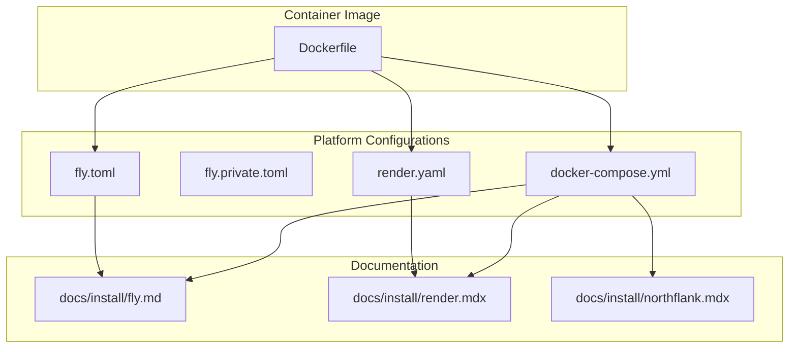
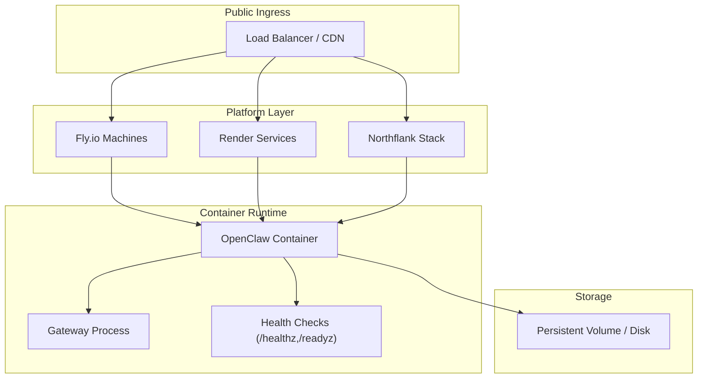
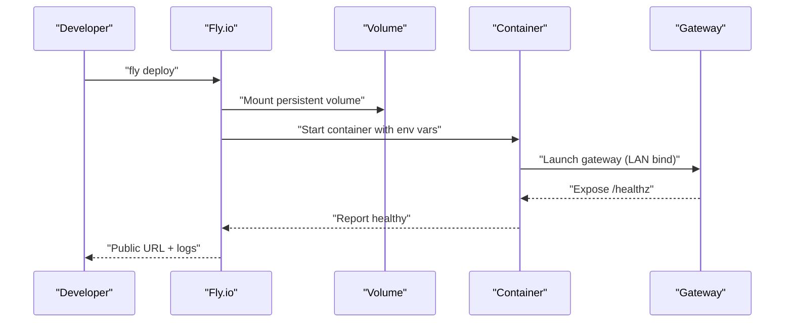
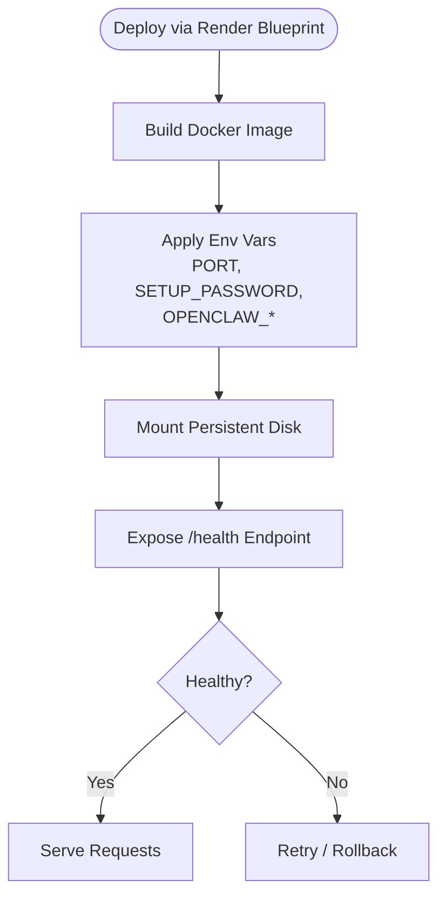
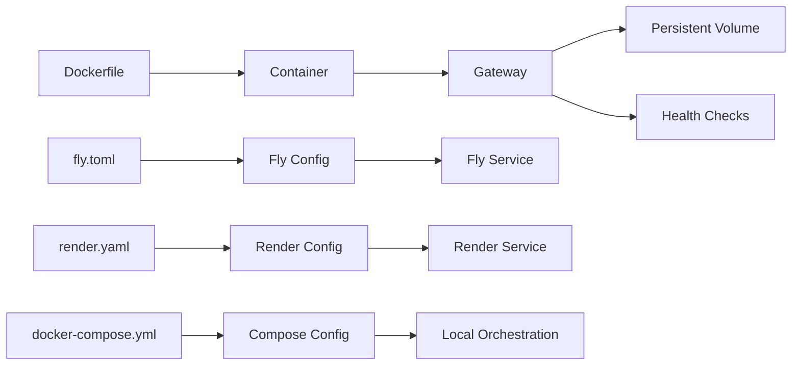

# Cloud Platform Deployment

<cite>
**Referenced Files in This Document**
- [fly.toml](file://fly.toml)
- [fly.private.toml](file://fly.private.toml)
- [render.yaml](file://render.yaml)
- [Dockerfile](file://Dockerfile)
- [docker-compose.yml](file://docker-compose.yml)
- [docs/install/fly.md](file://docs/install/fly.md)
- [docs/install/render.mdx](file://docs/install/render.mdx)
- [docs/install/northflank.mdx](file://docs/install/northflank.mdx)
- [.github/workflows/ci.yml](file://.github/workflows/ci.yml)
</cite>

## Table of Contents
1. [Introduction](#introduction)
2. [Project Structure](#project-structure)
3. [Core Components](#core-components)
4. [Architecture Overview](#architecture-overview)
5. [Detailed Component Analysis](#detailed-component-analysis)
6. [Dependency Analysis](#dependency-analysis)
7. [Performance Considerations](#performance-considerations)
8. [Troubleshooting Guide](#troubleshooting-guide)
9. [Conclusion](#conclusion)
10. [Appendices](#appendices)

## Introduction
This document provides comprehensive cloud deployment guidance for OpenClaw across major cloud platforms. It focuses on Fly.io, Render, and Northflank, with additional guidance for other cloud providers. The guide covers platform-specific configuration, scaling, cost optimization, environment variable management, database and external service integration patterns, deployment automation, CI/CD pipeline configurations, and monitoring setup for cloud environments. It also addresses platform-specific networking, security groups, and load balancing configurations.

## Project Structure
OpenClaw’s cloud-ready deployment relies on a container-first approach with a production-grade Dockerfile, platform-specific configuration files, and declarative infrastructure blueprints. The repository includes:
- A multi-stage Dockerfile optimized for Node.js runtime and slim images
- Fly.io configuration files for public and private deployments
- Render blueprint for declarative infrastructure
- docker-compose for local orchestration and optional sandbox integration
- Comprehensive installation guides for Fly.io, Render, and Northflank

**Diagram sources**
- [Dockerfile](file://Dockerfile#L1-L231)
- [fly.toml](file://fly.toml#L1-L35)
- [fly.private.toml](file://fly.private.toml#L1-L40)
- [render.yaml](file://render.yaml#L1-L22)
- [docker-compose.yml](file://docker-compose.yml#L1-L77)
- [docs/install/fly.md](file://docs/install/fly.md#L1-L491)
- [docs/install/render.mdx](file://docs/install/render.mdx#L1-L160)
- [docs/install/northflank.mdx](file://docs/install/northflank.mdx#L1-L54)

**Section sources**
- [Dockerfile](file://Dockerfile#L1-L231)
- [fly.toml](file://fly.toml#L1-L35)
- [fly.private.toml](file://fly.private.toml#L1-L40)
- [render.yaml](file://render.yaml#L1-L22)
- [docker-compose.yml](file://docker-compose.yml#L1-L77)
- [docs/install/fly.md](file://docs/install/fly.md#L1-L491)
- [docs/install/render.mdx](file://docs/install/render.mdx#L1-L160)
- [docs/install/northflank.mdx](file://docs/install/northflank.mdx#L1-L54)

## Core Components
- Container image: Multi-stage build with Node.js runtime, optional browser and Docker CLI installations, and non-root user execution
- Fly.io deployment: Public and private configurations with persistent volumes and health checks
- Render deployment: Declarative blueprint with environment variables, disk, and auto-generated tokens
- docker-compose: Local orchestration with optional sandbox integration and health checks
- CI/CD: GitHub Actions pipeline with scoped runs, caching, and release checks

Key runtime and configuration elements:
- Health endpoints: /healthz and /readyz for liveness and readiness probes
- Gateway binding: Loopback by default; override to LAN for public ingress
- Persistent state: Mounted volumes for configuration and workspace
- Secrets management: Environment variables for tokens and API keys

**Section sources**
- [Dockerfile](file://Dockerfile#L224-L230)
- [fly.toml](file://fly.toml#L17-L35)
- [fly.private.toml](file://fly.private.toml#L24-L40)
- [render.yaml](file://render.yaml#L1-L22)
- [docker-compose.yml](file://docker-compose.yml#L38-L49)
- [.github/workflows/ci.yml](file://.github/workflows/ci.yml#L1-L765)

## Architecture Overview
OpenClaw runs as a gateway service inside a container. The gateway listens on a configurable port and binds to loopback by default for security. For public access, bind to LAN and set a gateway token. Platform integrations manage ingress, scaling, and persistence.

**Diagram sources**
- [Dockerfile](file://Dockerfile#L224-L230)
- [fly.toml](file://fly.toml#L20-L35)
- [render.yaml](file://render.yaml#L1-L22)
- [docs/install/fly.md](file://docs/install/fly.md#L1-L491)
- [docs/install/render.mdx](file://docs/install/render.mdx#L1-L160)
- [docs/install/northflank.mdx](file://docs/install/northflank.mdx#L1-L54)

## Detailed Component Analysis

### Fly.io Deployment
Fly.io provides public and private deployment options. The public configuration exposes a URL and enforces HTTPS, while the private configuration hides the deployment behind a VPN or proxy.

- Configuration highlights
  - App name and primary region
  - Build with Dockerfile
  - Environment variables for production and state directory
  - HTTP service with internal port, HTTPS enforcement, and minimum running machines
  - VM sizing and persistent volume mounting
  - Private deployment disables public ingress and uses proxy/WireGuard access

- Platform-specific networking and security
  - Public ingress: HTTPS enforced, public URL allocation
  - Private ingress: No public IP; access via fly proxy, WireGuard, or SSH
  - Security groups: Fly’s platform handles network policies; bind to LAN and set tokens for non-loopback access

- Scaling and cost
  - Recommended memory: 2 GB for typical loads
  - Cost estimate: ~$10–$15/month depending on usage and region

- Environment variables and secrets
  - OPENCLAW_GATEWAY_TOKEN for non-loopback binding
  - Provider tokens via environment variables
  - OPENCLAW_STATE_DIR pointing to mounted volume

- Health checks and uptime
  - Internal port must match gateway port
  - Minimum machines running ensures availability

**Diagram sources**
- [fly.toml](file://fly.toml#L10-L35)
- [fly.private.toml](file://fly.private.toml#L18-L40)
- [Dockerfile](file://Dockerfile#L224-L230)
- [docs/install/fly.md](file://docs/install/fly.md#L1-L491)

**Section sources**
- [fly.toml](file://fly.toml#L1-L35)
- [fly.private.toml](file://fly.private.toml#L1-L40)
- [docs/install/fly.md](file://docs/install/fly.md#L1-L491)
- [Dockerfile](file://Dockerfile#L224-L230)

### Render Deployment
Render uses a declarative blueprint to define the service, environment variables, disk, and plan. It supports auto-generated tokens and persistent storage.

- Configuration highlights
  - Runtime: Docker
  - Health check path: /health
  - Environment variables: PORT, SETUP_PASSWORD, OPENCLAW_STATE_DIR, OPENCLAW_WORKSPACE_DIR, OPENCLAW_GATEWAY_TOKEN
  - Disk: Mount path and size
  - Plans: Free (spins down), Starter (always-on), Standard+

- Scaling considerations
  - Vertical scaling via plan upgrades
  - Horizontal scaling requires sticky sessions or external state management

- Environment variables and secrets
  - SETUP_PASSWORD is prompted during deploy
  - OPENCLAW_GATEWAY_TOKEN is auto-generated
  - Provider tokens managed via environment variables

- Monitoring and logs
  - Real-time logs and shell access available in the dashboard

**Diagram sources**
- [render.yaml](file://render.yaml#L1-L22)
- [docs/install/render.mdx](file://docs/install/render.mdx#L1-L160)

**Section sources**
- [render.yaml](file://render.yaml#L1-L22)
- [docs/install/render.mdx](file://docs/install/render.mdx#L1-L160)
- [Dockerfile](file://Dockerfile#L224-L230)

### Northflank Deployment
Northflank offers a one-click template with a web-based setup wizard and persistent storage.

- Configuration highlights
  - One-click template deployment
  - SETUP_PASSWORD required
  - Persistent volume mounted at /data
  - Web-based setup wizard at /setup and Control UI at /openclaw

- Environment variables and secrets
  - SETUP_PASSWORD set during deploy
  - Tokens for channels and providers via the wizard

- Getting started flow
  - Create account and deploy
  - Set environment variable
  - Complete setup wizard
  - Access Control UI

**Section sources**
- [docs/install/northflank.mdx](file://docs/install/northflank.mdx#L1-L54)

### docker-compose Orchestration
Local orchestration demonstrates gateway and CLI containers with optional sandbox integration and health checks.

- Highlights
  - Gateway service with environment variables and mounted volumes
  - CLI service sharing the same network
  - Optional Docker socket mounting for sandbox isolation
  - Health checks against /healthz

- Sandbox integration
  - Requires Docker CLI in the image or setup script
  - Mount Docker socket and adjust group permissions

**Section sources**
- [docker-compose.yml](file://docker-compose.yml#L1-L77)
- [Dockerfile](file://Dockerfile#L173-L203)

## Dependency Analysis
OpenClaw’s cloud deployment depends on:
- Container runtime and image configuration
- Platform-specific configuration files
- Environment variables for secrets and state
- Persistent storage for configuration and workspace
- Health endpoints for platform health checks

**Diagram sources**
- [Dockerfile](file://Dockerfile#L1-L231)
- [fly.toml](file://fly.toml#L1-L35)
- [render.yaml](file://render.yaml#L1-L22)
- [docker-compose.yml](file://docker-compose.yml#L1-L77)

**Section sources**
- [Dockerfile](file://Dockerfile#L1-L231)
- [fly.toml](file://fly.toml#L1-L35)
- [render.yaml](file://render.yaml#L1-L22)
- [docker-compose.yml](file://docker-compose.yml#L1-L77)

## Performance Considerations
- Memory sizing
  - Fly.io: Start with 2 GB RAM; increase if experiencing OOM or frequent restarts
  - Render: Choose Starter or Standard+ for production loads
- Health checks
  - Ensure internal port matches gateway port and health endpoint responds within platform timeouts
- Image optimization
  - Use slim variant when appropriate; install optional components (browser, Docker CLI) only when needed
- Scaling
  - Vertical scaling often sufficient; horizontal scaling requires sticky sessions or external state

[No sources needed since this section provides general guidance]

## Troubleshooting Guide
Common issues and resolutions:
- Gateway not reachable
  - Ensure gateway binds to LAN for public ingress and set OPENCLAW_GATEWAY_TOKEN
- Health check failures
  - Confirm internal port matches gateway port and health endpoint is exposed
- Memory issues
  - Increase VM memory on Fly.io or upgrade Render plan
- State not persisting
  - Verify OPENCLAW_STATE_DIR points to mounted volume and redeploy
- Private deployment access
  - Use fly proxy, WireGuard, or SSH for access without public exposure

**Section sources**
- [docs/install/fly.md](file://docs/install/fly.md#L245-L491)
- [Dockerfile](file://Dockerfile#L224-L230)

## Conclusion
OpenClaw’s cloud deployment is streamlined through containerization and platform-specific configurations. Fly.io and Render offer straightforward public deployments with persistent storage and health checks, while private deployments on Fly.io hide the service behind VPN or proxy. docker-compose enables local orchestration and sandbox integration. CI/CD pipelines automate testing and release checks. By following the platform-specific guidance and best practices outlined here, you can deploy, scale, and operate OpenClaw reliably across major cloud providers.

[No sources needed since this section summarizes without analyzing specific files]

## Appendices

### Environment Variable Management
- Fly.io
  - OPENCLAW_GATEWAY_TOKEN, OPENCLAW_STATE_DIR, NODE_OPTIONS, OPENCLAW_PREFER_PNPM
- Render
  - PORT, SETUP_PASSWORD, OPENCLAW_STATE_DIR, OPENCLAW_WORKSPACE_DIR, OPENCLAW_GATEWAY_TOKEN
- General
  - Provider tokens via environment variables (e.g., ANTHROPIC_API_KEY, DISCORD_BOT_TOKEN)

**Section sources**
- [fly.toml](file://fly.toml#L10-L15)
- [fly.private.toml](file://fly.private.toml#L18-L22)
- [render.yaml](file://render.yaml#L7-L17)
- [docs/install/render.mdx](file://docs/install/render.mdx#L36-L46)

### Database and External Service Integration Patterns
- State persistence
  - Fly.io: Persistent volume mounted at /data
  - Render: Persistent disk mounted at /data
- External services
  - Provider tokens via environment variables
  - Channel tokens via environment variables or configuration files
- Sandbox isolation
  - Optional Docker socket mounting for containerized sandboxes

**Section sources**
- [fly.toml](file://fly.toml#L32-L35)
- [render.yaml](file://render.yaml#L18-L22)
- [docker-compose.yml](file://docker-compose.yml#L12-L22)
- [Dockerfile](file://Dockerfile#L173-L203)

### Deployment Automation and CI/CD
- CI pipeline
  - Scoped runs, caching, and release checks
  - Parallelized jobs for Node, Windows, macOS, and Android
- Deployment automation
  - Platform-specific configuration files drive automated deployments
  - Blueprints and templates reduce manual steps

**Section sources**
- [.github/workflows/ci.yml](file://.github/workflows/ci.yml#L1-L765)