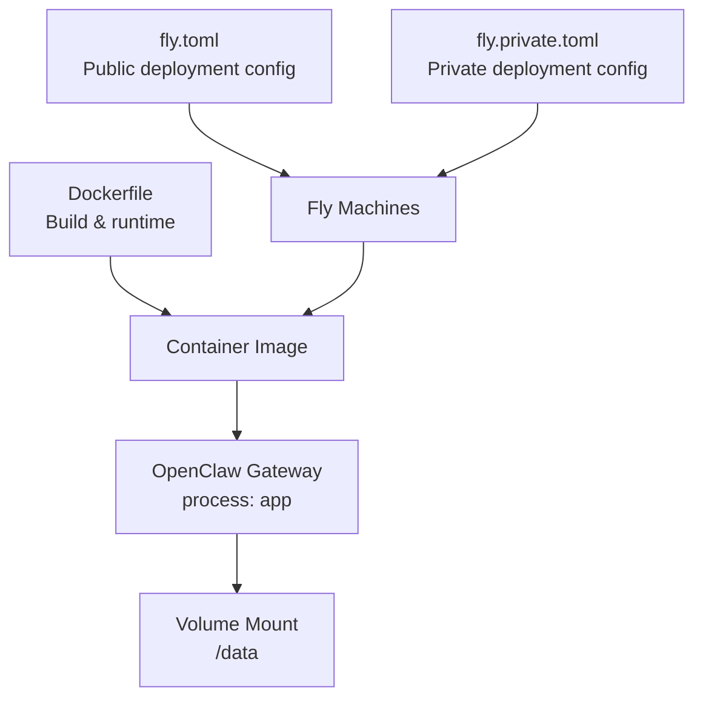
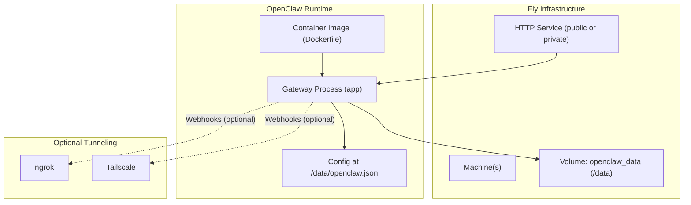
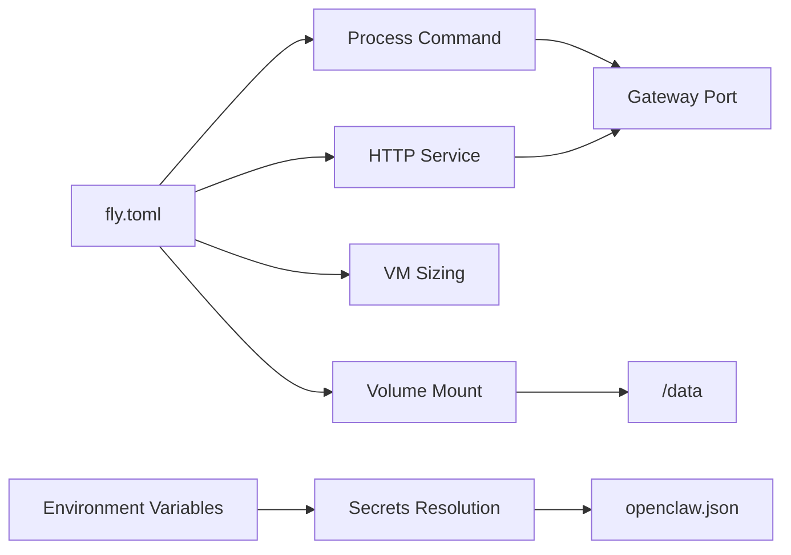

# Fly.io Deployment

<cite>
**Referenced Files in This Document**
- [fly.toml](file://fly.toml)
- [fly.private.toml](file://fly.private.toml)
- [Dockerfile](file://Dockerfile)
- [docs/install/fly.md](file://docs/install/fly.md)
- [extensions/voice-call/src/tunnel.ts](file://extensions/voice-call/src/tunnel.ts)
- [extensions/voice-call/src/config.ts](file://extensions/voice-call/src/config.ts)
- [src/plugin-sdk/secret-input-schema.ts](file://src/plugin-sdk/secret-input-schema.ts)
- [src/config/zod-schema.core.ts](file://src/config/zod-schema.core.ts)
- [src/infra/gateway-lock.test.ts](file://src/infra/gateway-lock.test.ts)
- [src/commands/doctor-state-integrity.ts](file://src/commands/doctor-state-integrity.ts)
- [src/security/audit.ts](file://src/security/audit.ts)
</cite>

## Table of Contents
1. [Introduction](#introduction)
2. [Project Structure](#project-structure)
3. [Core Components](#core-components)
4. [Architecture Overview](#architecture-overview)
5. [Detailed Component Analysis](#detailed-component-analysis)
6. [Dependency Analysis](#dependency-analysis)
7. [Performance Considerations](#performance-considerations)
8. [Troubleshooting Guide](#troubleshooting-guide)
9. [Conclusion](#conclusion)
10. [Appendices](#appendices)

## Introduction
This document provides a complete guide to deploying OpenClaw on Fly.io with persistent storage, secure configuration, and production-grade process management. It covers both public and private deployment modes, environment variable management for API keys and tokens, ngrok tunneling for webhooks, troubleshooting, and cost optimization strategies.

## Project Structure
OpenClaw’s Fly.io deployment relies on:
- fly.toml and fly.private.toml for Fly configuration (app name, regions, build, env, processes, http_service, vm sizing, mounts)
- Dockerfile for containerization and runtime behavior
- Documentation in docs/install/fly.md for step-by-step deployment and troubleshooting
- Optional voice-call tunneling utilities for webhook exposure without public ingress

**Diagram sources**
- [fly.toml](file://fly.toml#L1-L35)
- [fly.private.toml](file://fly.private.toml#L1-L40)
- [Dockerfile](file://Dockerfile#L216-L231)

**Section sources**
- [fly.toml](file://fly.toml#L1-L35)
- [fly.private.toml](file://fly.private.toml#L1-L40)
- [Dockerfile](file://Dockerfile#L216-L231)

## Core Components
- Fly configuration
  - App identity, primary region, build settings, environment variables, process command, HTTP service, VM sizing, and volume mount
- Container image
  - Multi-stage build, non-root runtime, health checks, and default gateway command
- Deployment modes
  - Public: exposes a public URL via HTTP service
  - Private: hides the deployment behind private-only ingress and optional tunnels for webhooks

Key Fly settings and rationale:
- Processes bind to LAN and allow unconfigured startup for initial setup
- Internal port aligns with the gateway port for health checks
- Memory increased from minimal defaults to reduce OOM risks
- State directory mounted to a persistent volume for configuration and sessions

**Section sources**
- [fly.toml](file://fly.toml#L10-L35)
- [Dockerfile](file://Dockerfile#L224-L231)
- [docs/install/fly.md](file://docs/install/fly.md#L83-L92)

## Architecture Overview
The deployment architecture integrates Fly’s infrastructure with OpenClaw’s gateway and optional tunneling for webhooks.

**Diagram sources**
- [fly.toml](file://fly.toml#L17-L35)
- [fly.private.toml](file://fly.private.toml#L24-L40)
- [Dockerfile](file://Dockerfile#L216-L231)
- [extensions/voice-call/src/tunnel.ts](file://extensions/voice-call/src/tunnel.ts#L1-L209)

## Detailed Component Analysis

### Fly Configuration (fly.toml)
- App identity and region
- Build: Dockerfile path
- Environment variables
  - NODE_ENV for production
  - OPENCLAW_PREFER_PNPM for deterministic installs
  - OPENCLAW_STATE_DIR pointing to /data for persistence
  - NODE_OPTIONS limiting heap for stability
- Process command
  - Starts the gateway with LAN binding and allows unconfigured startup
- HTTP service
  - Internal port aligned with gateway port
  - Enforces HTTPS
  - Keeps machines running for persistent connections
  - Minimum machines running set to 1
- VM sizing
  - Shared CPU with increased memory for reliability
- Volume mount
  - Mounts openclaw_data to /data

Best practices:
- Match internal_port with the gateway port
- Use LAN binding for public ingress and set a gateway token
- Persist state via OPENCLAW_STATE_DIR and the mounted volume

**Section sources**
- [fly.toml](file://fly.toml#L4-L35)
- [docs/install/fly.md](file://docs/install/fly.md#L83-L92)

### Fly Configuration (fly.private.toml)
- Same structure as fly.toml but omits HTTP service
- No public ingress; access via fly proxy, WireGuard, or SSH
- Suitable for environments where no public exposure is desired

Access methods:
- Local proxy: forward local port to the app
- WireGuard: connect to the private IPv6 address
- SSH console: access the machine directly

**Section sources**
- [fly.private.toml](file://fly.private.toml#L1-L40)
- [docs/install/fly.md](file://docs/install/fly.md#L365-L433)

### Dockerfile and Runtime Behavior
- Multi-stage build with extension dependency extraction
- Runtime base image pinned for reproducibility
- Non-root user for reduced privilege
- Health checks for liveness and readiness
- Default gateway command starts with unconfigured mode

Operational notes:
- The container binds to loopback by default; override with LAN binding for public ingress
- Health checks probe built-in endpoints

**Section sources**
- [Dockerfile](file://Dockerfile#L1-L231)

### Environment Variables and Secret Management
- Recommended approach: store API keys and tokens as Fly secrets rather than embedding in configuration files
- Secrets are resolved by the runtime and can be provided via environment variables or secret providers
- Secret provider configuration supports multiple sources (env, file, exec) and defaults

Best practices:
- Prefer environment variables for sensitive data
- Use secret providers for centralized secret resolution
- Avoid committing secrets to version control

**Section sources**
- [docs/install/fly.md](file://docs/install/fly.md#L93-L115)
- [src/plugin-sdk/secret-input-schema.ts](file://src/plugin-sdk/secret-input-schema.ts#L1-L12)
- [src/config/zod-schema.core.ts](file://src/config/zod-schema.core.ts#L150-L183)

### Webhook Exposure Without Public Ingress (ngrok and Tailscale)
- For private deployments or when public exposure is undesired, use tunnels to expose webhook endpoints
- ngrok tunneling supported via a dedicated module
- Tailscale tunneling supported via serve or funnel modes
- Configure allowed hosts for webhook security when using tunnels

Example configurations:
- ngrok tunnel with optional auth token and domain
- Tailscale serve/funnel modes for private/public exposure
- Allowed hosts for webhook security

**Section sources**
- [docs/install/fly.md](file://docs/install/fly.md#L435-L465)
- [extensions/voice-call/src/tunnel.ts](file://extensions/voice-call/src/tunnel.ts#L1-L209)
- [extensions/voice-call/src/config.ts](file://extensions/voice-call/src/config.ts#L127-L156)

### Process Management and Health Checks
- Fly manages lifecycle via processes and HTTP service
- Gateway process command includes LAN binding and unconfigured startup
- Health checks rely on built-in endpoints for readiness and liveness

Operational tips:
- Ensure internal_port matches the gateway port
- Keep machines running for persistent connections
- Monitor logs and status after deployment

**Section sources**
- [fly.toml](file://fly.toml#L17-L27)
- [Dockerfile](file://Dockerfile#L224-L231)
- [docs/install/fly.md](file://docs/install/fly.md#L116-L130)

## Dependency Analysis
Fly configuration depends on:
- Correct alignment between process command and HTTP service internal port
- Consistent state directory configuration and volume mount
- Proper environment variable setup for secrets and model providers

**Diagram sources**
- [fly.toml](file://fly.toml#L17-L35)
- [Dockerfile](file://Dockerfile#L216-L231)

**Section sources**
- [fly.toml](file://fly.toml#L17-L35)
- [Dockerfile](file://Dockerfile#L216-L231)

## Performance Considerations
- Memory sizing
  - Start with 2GB RAM; adjust based on workload and concurrency needs
  - Larger memory reduces OOM risks under load
- Health checks and uptime
  - Keep machines running to maintain persistent connections
  - Use minimum machines running to ensure availability
- Storage and I/O
  - Persist state to the mounted volume to avoid data loss across restarts
- Container runtime
  - Non-root user improves security posture
  - Deterministic package manager preference for reproducible builds

**Section sources**
- [fly.toml](file://fly.toml#L28-L31)
- [Dockerfile](file://Dockerfile#L211-L215)
- [docs/install/fly.md](file://docs/install/fly.md#L259-L277)

## Troubleshooting Guide
Common issues and resolutions:

- App is not listening on expected address
  - Ensure LAN binding is enabled in the process command
  - Fix: add LAN binding to the process command

- Health checks failing or connection refused
  - Verify internal_port matches the gateway port
  - Fix: align internal_port with gateway port

- Out-of-memory (OOM) or memory issues
  - Increase VM memory in Fly configuration
  - Fix: raise memory allocation

- Gateway lock issues
  - Container restarts can leave stale PID lock files on the volume
  - Fix: remove lock files from the state directory and restart

- Config not being read
  - Confirm the config file exists at the expected path
  - Fix: place the config at the state directory path

- Writing config via SSH
  - Use echo + tee or SFTP; handle existing file conflicts
  - Fix: delete existing file before upload if needed

- State not persisting
  - Ensure state directory is set and volume is mounted
  - Fix: confirm OPENCLAW_STATE_DIR and mount configuration

- Accessing private deployments
  - Use fly proxy, WireGuard, or SSH console
  - Fix: select appropriate access method

- Webhook exposure without public ingress
  - Use ngrok or Tailscale tunnels
  - Fix: configure tunnel and allowed hosts

Security and permissions:
- Restrict state directory permissions to prevent world/group readability
- Audit filesystem permissions and apply remediation as needed

**Section sources**
- [docs/install/fly.md](file://docs/install/fly.md#L245-L327)
- [src/infra/gateway-lock.test.ts](file://src/infra/gateway-lock.test.ts#L41-L94)
- [src/commands/doctor-state-integrity.ts](file://src/commands/doctor-state-integrity.ts#L200-L306)
- [src/security/audit.ts](file://src/security/audit.ts#L251-L274)

## Conclusion
Deploying OpenClaw on Fly.io involves configuring persistent storage, secure environment variables, and appropriate process management. Choose public or private deployment based on exposure requirements, and leverage tunnels for webhook callbacks when needed. Monitor memory and state persistence, and follow the troubleshooting steps to resolve common issues quickly.

## Appendices

### Quick Setup Checklist
- Create Fly app and volume
- Configure fly.toml or fly.private.toml
- Set secrets for tokens and API keys
- Deploy and verify status/logs
- Create and apply configuration at /data/openclaw.json
- Access via public URL, proxy, WireGuard, or SSH

**Section sources**
- [docs/install/fly.md](file://docs/install/fly.md#L28-L130)