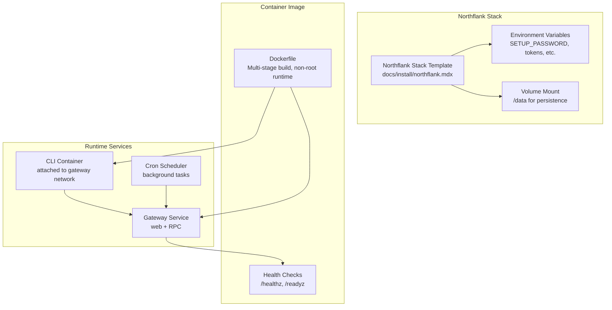
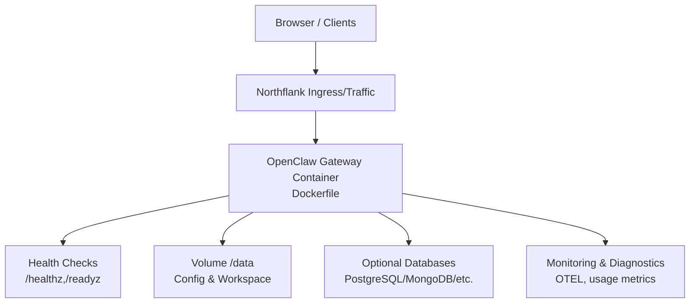
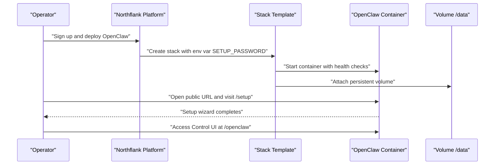
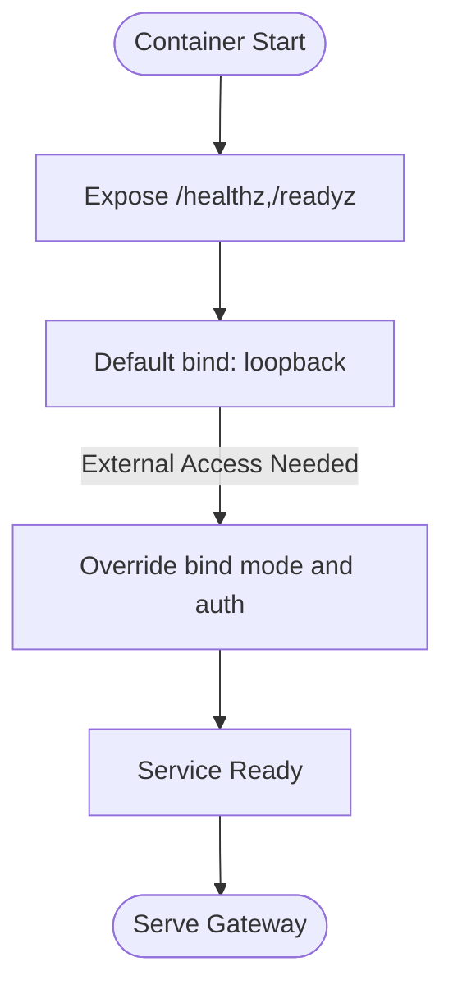
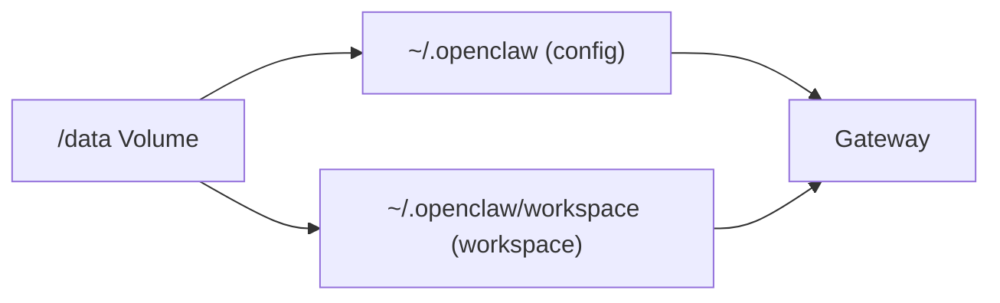
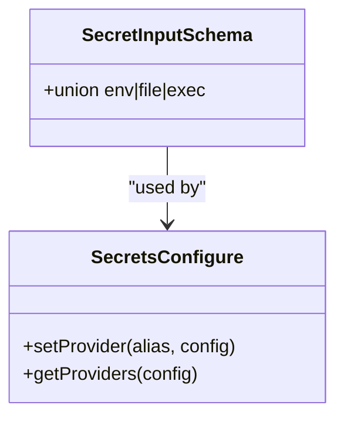
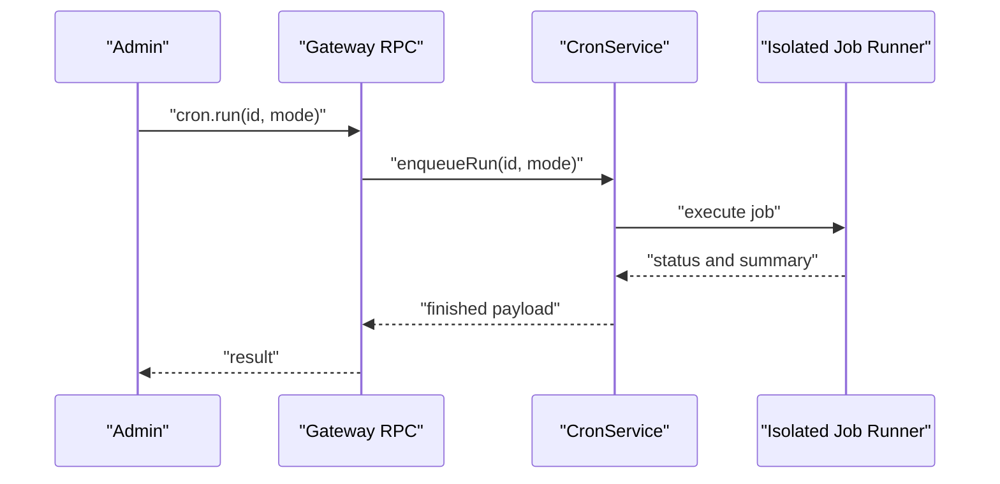
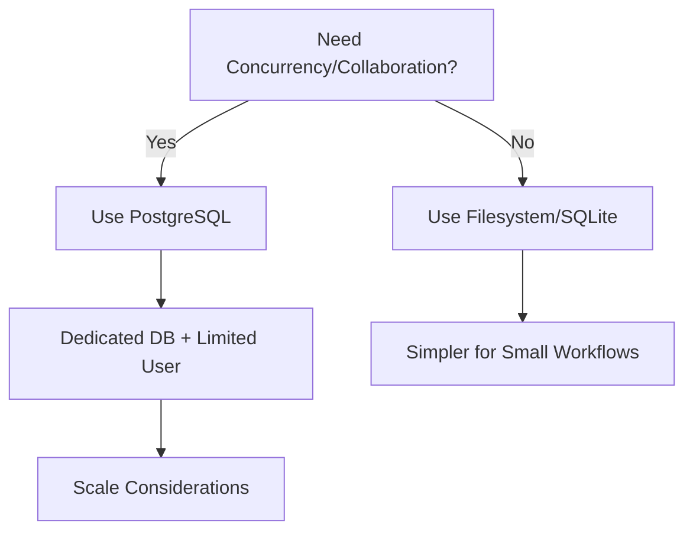
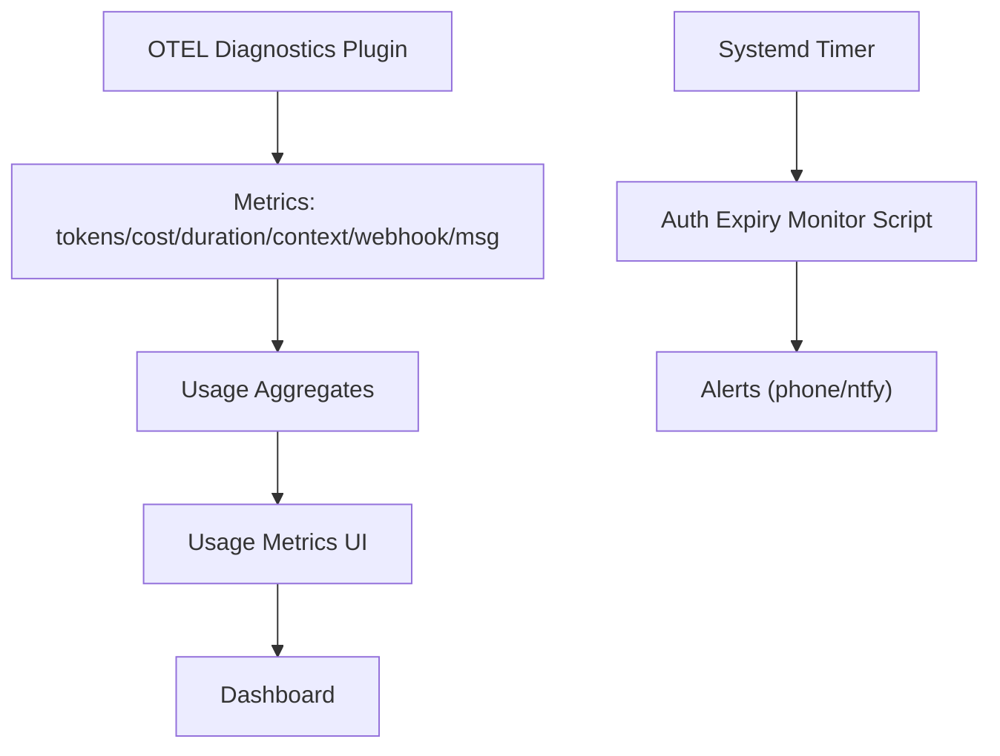
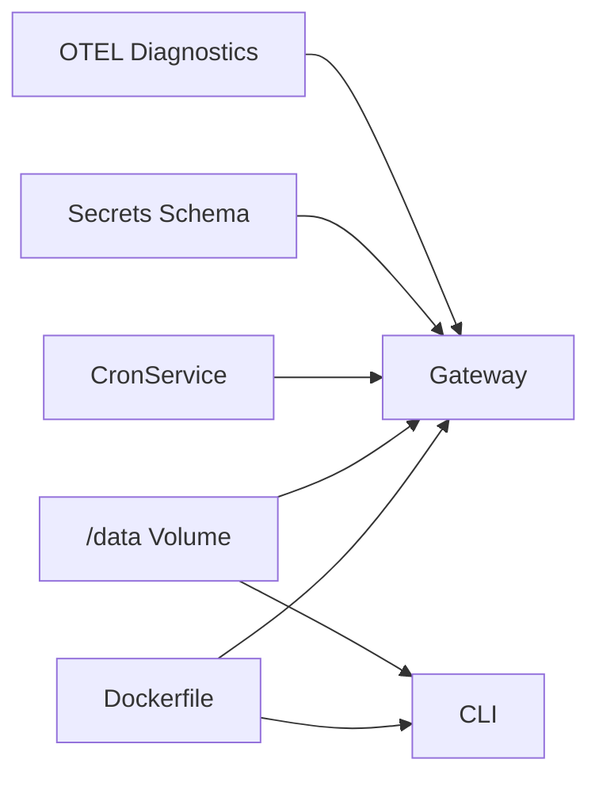

# Northflank Deployment

<cite>
**Referenced Files in This Document**
- [docs/install/northflank.mdx](file://docs/install/northflank.mdx)
- [Dockerfile](file://Dockerfile)
- [docker-compose.yml](file://docker-compose.yml)
- [render.yaml](file://render.yaml)
- [src/secrets/configure.ts](file://src/secrets/configure.ts)
- [src/plugin-sdk/secret-input-schema.ts](file://src/plugin-sdk/secret-input-schema.ts)
- [src/cron/service.ts](file://src/cron/service.ts)
- [src/gateway/server.cron.test.ts](file://src/gateway/server.cron.test.ts)
- [scripts/systemd/openclaw-auth-monitor.service](file://scripts/systemd/openclaw-auth-monitor.service)
- [scripts/systemd/openclaw-auth-monitor.timer](file://scripts/systemd/openclaw-auth-monitor.timer)
- [extensions/open-prose/skills/prose/state/postgres.md](file://extensions/open-prose/skills/prose/state/postgres.md)
- [docs-zh/API参考/REST API/系统管理接口/监控诊断接口.md](file://docs-zh/API参考/REST API/系统管理接口/监控诊断接口.md)
- [docs-zh/部署和运维/监控和日志.md](file://docs-zh/部署和运维/监控和日志.md)
- [apps/macos/Sources/OpenClaw/GatewayEndpointStore.swift](file://apps/macos/Sources/OpenClaw/GatewayEndpointStore.swift)
</cite>

## Table of Contents
1. [Introduction](#introduction)
2. [Project Structure](#project-structure)
3. [Core Components](#core-components)
4. [Architecture Overview](#architecture-overview)
5. [Detailed Component Analysis](#detailed-component-analysis)
6. [Dependency Analysis](#dependency-analysis)
7. [Performance Considerations](#performance-considerations)
8. [Troubleshooting Guide](#troubleshooting-guide)
9. [Conclusion](#conclusion)
10. [Appendices](#appendices)

## Introduction
This document explains how to deploy OpenClaw on Northflank using the official one-click stack template. It covers container services, persistent volumes, environment variable management, secrets handling, database integration patterns, monitoring and alerting, scaling and high availability, and Northflank-specific capabilities such as service mesh, traffic splitting, and canary deployments. The guide is written for operators who want to provision and operate OpenClaw with minimal server-side terminal work, leveraging the web-based setup wizard and persistent storage.

## Project Structure
The repository provides:
- A Northflank one-click stack template and setup instructions
- A container image definition for the OpenClaw gateway/runtime
- Optional docker-compose for local orchestration
- Render configuration for comparison and migration guidance
- Secrets configuration and secret input schema for secure configuration injection
- Cron-based scheduled tasks and background job execution
- Monitoring and observability integrations
- macOS client configuration for gateway binding modes

**Diagram sources**
- [docs/install/northflank.mdx](file://docs/install/northflank.mdx#L1-L54)
- [Dockerfile](file://Dockerfile#L224-L231)
- [docker-compose.yml](file://docker-compose.yml#L1-L77)

**Section sources**
- [docs/install/northflank.mdx](file://docs/install/northflank.mdx#L1-L54)
- [Dockerfile](file://Dockerfile#L1-L231)
- [docker-compose.yml](file://docker-compose.yml#L1-L77)

## Core Components
- Container image: Multi-stage build with non-root runtime, health checks, and optional browser/tooling packages.
- Gateway service: Exposes health/readiness endpoints and binds securely by default.
- CLI container: Shares the gateway network for local interactive access.
- Cron service: Manages scheduled tasks and background jobs.
- Secrets management: Schema-driven secret inputs and provider configuration.
- Persistent storage: Volume mounted at /data for configuration and workspace.

**Section sources**
- [Dockerfile](file://Dockerfile#L224-L231)
- [docker-compose.yml](file://docker-compose.yml#L1-L77)
- [src/cron/service.ts](file://src/cron/service.ts#L1-L60)
- [src/secrets/configure.ts](file://src/secrets/configure.ts#L68-L85)
- [src/plugin-sdk/secret-input-schema.ts](file://src/plugin-sdk/secret-input-schema.ts#L1-L12)

## Architecture Overview
The Northflank deployment provisions a single-stack service that runs the OpenClaw gateway and exposes a web-based setup wizard. Persistent storage is attached to preserve configuration and workspace across redeployments. The gateway listens on a loopback interface by default and can be exposed externally with appropriate binding and authentication.

**Diagram sources**
- [docs/install/northflank.mdx](file://docs/install/northflank.mdx#L1-L54)
- [Dockerfile](file://Dockerfile#L224-L231)
- [render.yaml](file://render.yaml#L1-L22)

**Section sources**
- [docs/install/northflank.mdx](file://docs/install/northflank.mdx#L1-L54)
- [Dockerfile](file://Dockerfile#L224-L231)
- [render.yaml](file://render.yaml#L1-L22)

## Detailed Component Analysis

### Northflank Stack Setup
- One-click template deployment with a web-based setup wizard.
- Required environment variable: SETUP_PASSWORD.
- Persistent volume mounted at /data for configuration and workspace.
- Post-deployment steps: open the public URL, complete /setup, and access the Control UI.

**Diagram sources**
- [docs/install/northflank.mdx](file://docs/install/northflank.mdx#L9-L36)

**Section sources**
- [docs/install/northflank.mdx](file://docs/install/northflank.mdx#L1-L54)

### Container Services and Binding
- The container image defines health checks for liveness and readiness.
- Gateway binds to loopback by default; expose externally by overriding bind mode and setting authentication.
- The macOS client resolves gateway bind modes from environment or configuration.

**Diagram sources**
- [Dockerfile](file://Dockerfile#L224-L231)
- [apps/macos/Sources/OpenClaw/GatewayEndpointStore.swift](file://apps/macos/Sources/OpenClaw/GatewayEndpointStore.swift#L543-L572)

**Section sources**
- [Dockerfile](file://Dockerfile#L224-L231)
- [apps/macos/Sources/OpenClaw/GatewayEndpointStore.swift](file://apps/macos/Sources/OpenClaw/GatewayEndpointStore.swift#L543-L572)

### Volume Management
- The stack attaches a persistent volume mounted at /data.
- Configuration and workspace persist across redeployments.
- Render configuration demonstrates similar patterns for comparison.

**Diagram sources**
- [docs/install/northflank.mdx](file://docs/install/northflank.mdx#L23-L26)
- [render.yaml](file://render.yaml#L18-L22)

**Section sources**
- [docs/install/northflank.mdx](file://docs/install/northflank.mdx#L21-L36)
- [render.yaml](file://render.yaml#L18-L22)

### Environment Variables and Secrets Injection
- Secrets are configured via a provider-based schema supporting env, file, and exec sources.
- The schema allows referencing providers by alias and ID.
- Providers are stored in configuration and applied conditionally.

**Diagram sources**
- [src/plugin-sdk/secret-input-schema.ts](file://src/plugin-sdk/secret-input-schema.ts#L1-L12)
- [src/secrets/configure.ts](file://src/secrets/configure.ts#L68-L85)

**Section sources**
- [src/plugin-sdk/secret-input-schema.ts](file://src/plugin-sdk/secret-input-schema.ts#L1-L12)
- [src/secrets/configure.ts](file://src/secrets/configure.ts#L68-L85)

### Scheduled Tasks and Background Workers
- Cron service manages scheduling, lifecycle, and execution of background jobs.
- Tests demonstrate enqueueing runs and observing started/finished events.
- Background jobs can be triggered via RPC and managed through the cron service.

**Diagram sources**
- [src/cron/service.ts](file://src/cron/service.ts#L1-L60)
- [src/gateway/server.cron.test.ts](file://src/gateway/server.cron.test.ts#L578-L613)

**Section sources**
- [src/cron/service.ts](file://src/cron/service.ts#L1-L60)
- [src/gateway/server.cron.test.ts](file://src/gateway/server.cron.test.ts#L578-L613)

### Database Integration Patterns
- PostgreSQL state is documented for power users needing concurrency and collaboration.
- Security guidance emphasizes treating credentials as non-sensitive in subagent contexts and using dedicated, limited-privilege users.
- Recommended setup includes schema-level access control and provider options (self-hosted, Neon, Supabase, Railway).

**Diagram sources**
- [extensions/open-prose/skills/prose/state/postgres.md](file://extensions/open-prose/skills/prose/state/postgres.md#L64-L204)

**Section sources**
- [extensions/open-prose/skills/prose/state/postgres.md](file://extensions/open-prose/skills/prose/state/postgres.md#L64-L204)

### Monitoring, Alerting, and Metrics
- Monitoring and diagnostics include health snapshots, logs tailing, usage aggregation, and OTLP export.
- UI displays aggregated usage metrics by provider/model/account/day.
- Systemd timers and services support periodic auth expiry checks for alerting.

**Diagram sources**
- [docs-zh/API参考/REST API/系统管理接口/监控诊断接口.md](file://docs-zh/API参考/REST API/系统管理接口/监控诊断接口.md#L47-L71)
- [docs-zh/部署和运维/监控和日志.md](file://docs-zh/部署和运维/监控和日志.md#L252-L273)
- [scripts/systemd/openclaw-auth-monitor.service](file://scripts/systemd/openclaw-auth-monitor.service#L1-L15)
- [scripts/systemd/openclaw-auth-monitor.timer](file://scripts/systemd/openclaw-auth-monitor.timer#L1-L11)

**Section sources**
- [docs-zh/API参考/REST API/系统管理接口/监控诊断接口.md](file://docs-zh/API参考/REST API/系统管理接口/监控诊断接口.md#L38-L71)
- [docs-zh/部署和运维/监控和日志.md](file://docs-zh/部署和运维/监控和日志.md#L247-L273)
- [scripts/systemd/openclaw-auth-monitor.service](file://scripts/systemd/openclaw-auth-monitor.service#L1-L15)
- [scripts/systemd/openclaw-auth-monitor.timer](file://scripts/systemd/openclaw-auth-monitor.timer#L1-L11)

### Scaling, Load Balancing, and High Availability
- Horizontal scaling: Increase replicas behind a load balancer; ensure sticky sessions if required by clients.
- Health checks: Use /healthz and /readyz to gate traffic and manage rolling updates.
- High availability: Persist state on volumes; separate databases for collaboration and concurrency needs.
- Load balancing: Route traffic through Northflank ingress; consider canary deployments for gradual rollout.

[No sources needed since this section provides general guidance]

### Northflank-Specific Features
- Service mesh: Leverage platform networking and TLS termination managed by Northflank.
- Traffic splitting: Use platform controls to split traffic between versions for canary releases.
- Canary deployments: Gradually shift traffic to newer versions while monitoring health and metrics.

[No sources needed since this section provides general guidance]

## Dependency Analysis
- The gateway container depends on health checks and persistent volume mounts.
- Cron service depends on gateway RPC for job orchestration.
- Secrets configuration depends on provider schema and environment inputs.
- Monitoring depends on OTLP exporters and usage aggregation.

**Diagram sources**
- [Dockerfile](file://Dockerfile#L224-L231)
- [docker-compose.yml](file://docker-compose.yml#L1-L77)
- [src/cron/service.ts](file://src/cron/service.ts#L1-L60)
- [src/plugin-sdk/secret-input-schema.ts](file://src/plugin-sdk/secret-input-schema.ts#L1-L12)
- [docs-zh/部署和运维/监控和日志.md](file://docs-zh/部署和运维/监控和日志.md#L252-L258)

**Section sources**
- [Dockerfile](file://Dockerfile#L224-L231)
- [docker-compose.yml](file://docker-compose.yml#L1-L77)
- [src/cron/service.ts](file://src/cron/service.ts#L1-L60)
- [src/plugin-sdk/secret-input-schema.ts](file://src/plugin-sdk/secret-input-schema.ts#L1-L12)
- [docs-zh/部署和运维/监控和日志.md](file://docs-zh/部署和运维/监控和日志.md#L252-L258)

## Performance Considerations
- Use PostgreSQL for high-concurrency writes and collaboration scenarios.
- Prefer filesystem/SQLite for smaller workloads to reduce operational overhead.
- Monitor usage metrics and adjust resource allocation based on observed token counts, cost, and latency.

[No sources needed since this section provides general guidance]

## Troubleshooting Guide
- Health probes: Confirm /healthz and /readyz are reachable; adjust bind mode and authentication for external access.
- Cron jobs: Verify enqueue and event flows; ensure isolated runner is available.
- Secrets: Validate provider configuration and secret input schema; ensure environment variables are set.
- Monitoring: Check OTLP exports and usage aggregates; review logs and alerts.

**Section sources**
- [Dockerfile](file://Dockerfile#L224-L231)
- [src/gateway/server.cron.test.ts](file://src/gateway/server.cron.test.ts#L578-L613)
- [src/plugin-sdk/secret-input-schema.ts](file://src/plugin-sdk/secret-input-schema.ts#L1-L12)
- [docs-zh/部署和运维/监控和日志.md](file://docs-zh/部署和运维/监控和日志.md#L270-L273)

## Conclusion
Deploying OpenClaw on Northflank is streamlined via the one-click stack template, with persistent storage and a web-based setup wizard. The container image includes health checks and non-root execution, while cron and monitoring components support robust operations. For advanced needs, integrate PostgreSQL for concurrency and collaboration, and leverage Northflank’s traffic management features for canary deployments and high availability.

[No sources needed since this section summarizes without analyzing specific files]

## Appendices
- Migration note: Render configuration demonstrates comparable patterns for environment variables, disk mounts, and health checks.

**Section sources**
- [render.yaml](file://render.yaml#L1-L22)