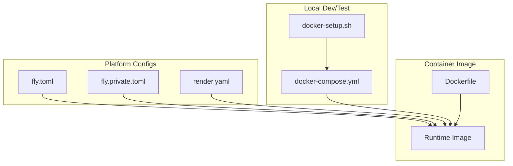
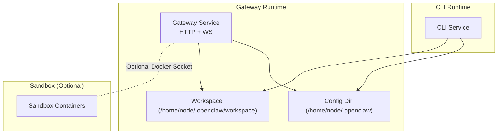
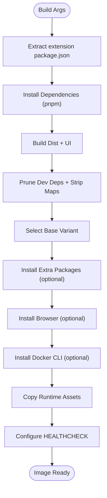
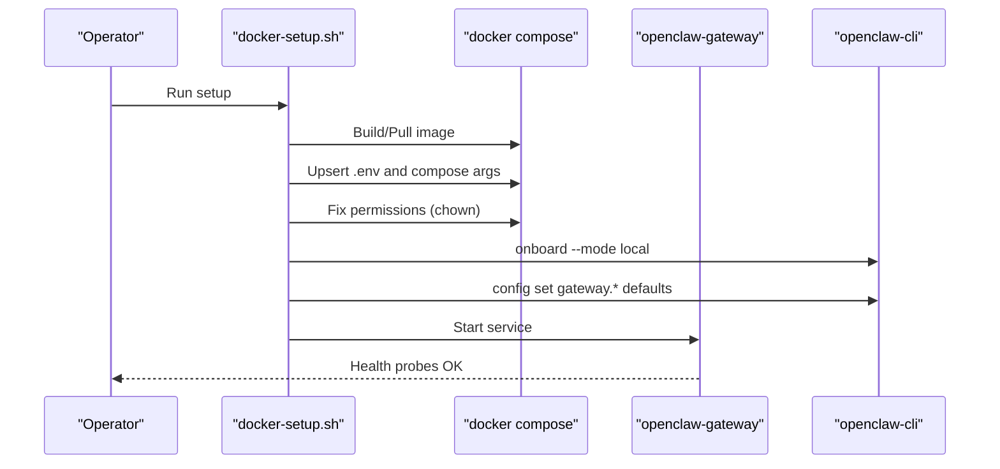
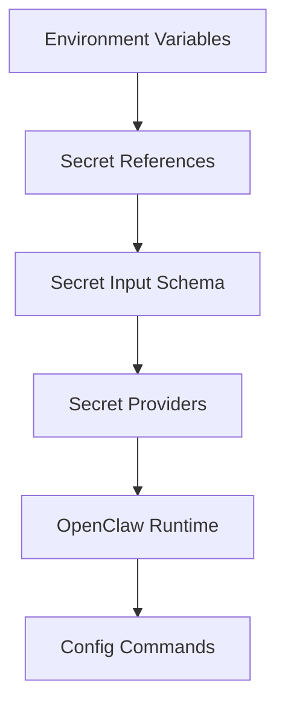
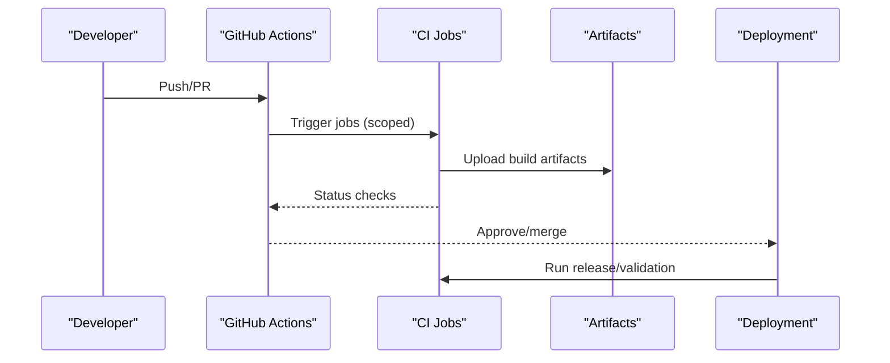
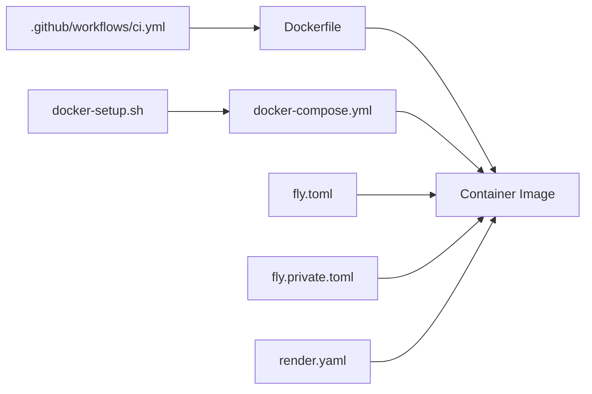

# Other Cloud Platforms

<cite>
**Referenced Files in This Document**
- [Dockerfile](file://Dockerfile)
- [docker-compose.yml](file://docker-compose.yml)
- [docker-setup.sh](file://docker-setup.sh)
- [fly.toml](file://fly.toml)
- [fly.private.toml](file://fly.private.toml)
- [render.yaml](file://render.yaml)
- [.github/workflows/ci.yml](file://.github/workflows/ci.yml)
- [src/secrets/configure.ts](file://src/secrets/configure.ts)
- [src/plugin-sdk/secret-input-schema.ts](file://src/plugin-sdk/secret-input-schema.ts)
- [docs/install/render.mdx](file://docs/install/render.mdx)
</cite>

## Table of Contents
1. [Introduction](#introduction)
2. [Project Structure](#project-structure)
3. [Core Components](#core-components)
4. [Architecture Overview](#architecture-overview)
5. [Detailed Component Analysis](#detailed-component-analysis)
6. [Dependency Analysis](#dependency-analysis)
7. [Performance Considerations](#performance-considerations)
8. [Troubleshooting Guide](#troubleshooting-guide)
9. [Conclusion](#conclusion)
10. [Appendices](#appendices)

## Introduction
This document explains how to deploy OpenClaw on other cloud platforms and container orchestration systems with a focus on:
- Platform-specific deployment manifests and configuration
- Containerization best practices and Dockerfile optimization
- docker-compose multi-service setups
- Environment variable management, secret stores, and configuration management
- Deployment automation and CI/CD integration
- Networking, load balancing, and ingress patterns
- Monitoring, logging, and observability across platforms

It leverages existing OpenClaw artifacts (Dockerfile, docker-compose, platform configs, CI) to provide repeatable, secure, and portable deployment patterns.

## Project Structure
OpenClaw provides a production-ready container image and a multi-service docker-compose setup, plus platform-specific configuration files for Fly.io and Render. These artifacts serve as the foundation for deploying OpenClaw on other platforms and orchestrators.

**Diagram sources**
- [Dockerfile](file://Dockerfile#L1-L231)
- [docker-compose.yml](file://docker-compose.yml#L1-L77)
- [docker-setup.sh](file://docker-setup.sh#L1-L598)
- [fly.toml](file://fly.toml#L1-L35)
- [fly.private.toml](file://fly.private.toml#L1-L40)
- [render.yaml](file://render.yaml#L1-L22)

**Section sources**
- [Dockerfile](file://Dockerfile#L1-L231)
- [docker-compose.yml](file://docker-compose.yml#L1-L77)
- [docker-setup.sh](file://docker-setup.sh#L1-L598)
- [fly.toml](file://fly.toml#L1-L35)
- [fly.private.toml](file://fly.private.toml#L1-L40)
- [render.yaml](file://render.yaml#L1-L22)

## Core Components
- Container image: Multi-stage build with pinned base images, optional browser and Docker CLI installs, non-root runtime, and health checks.
- docker-compose: Single-node multi-service stack with gateway and CLI, bind mounts for state/workspace, and optional sandbox overlay.
- Platform configs: Fly.io and Render Blueprints demonstrate environment variables, health checks, persistent disks, and process binding.
- CI: GitHub Actions pipeline with scoped job gating and artifact sharing.

Key runtime behaviors:
- Health probes for liveness/readiness
- Non-root user execution
- Optional Chromium and Playwright installation for browser automation
- Optional Docker CLI for sandboxing

**Section sources**
- [Dockerfile](file://Dockerfile#L224-L231)
- [docker-compose.yml](file://docker-compose.yml#L38-L49)
- [fly.toml](file://fly.toml#L20-L26)
- [render.yaml](file://render.yaml#L6-L6)

## Architecture Overview
The runtime architecture centers on a gateway service exposing HTTP endpoints and optional WebSocket bridges, with optional CLI service for interactive tasks and optional sandbox containerization.

**Diagram sources**
- [docker-compose.yml](file://docker-compose.yml#L2-L37)
- [docker-compose.yml](file://docker-compose.yml#L51-L77)
- [docker-setup.sh](file://docker-setup.sh#L509-L534)

## Detailed Component Analysis

### Containerization Best Practices and Dockerfile Optimization
- Multi-stage build: Produces a minimal runtime image without build tools or source code.
- Pinned base images: Digest pinning ensures reproducibility; requires manual updates when upstream tags move.
- Build args for customization:
  - OPENCLAW_EXTENSIONS: Include extension metadata for dependency resolution without copying full sources.
  - OPENCLAW_VARIANT: Choose between default and slim variants.
  - OPENCLAW_DOCKER_APT_PACKAGES: Install extra system packages needed by skills or extensions.
  - OPENCLAW_INSTALL_BROWSER: Pre-install Chromium and Playwright to reduce cold-start costs.
  - OPENCLAW_INSTALL_DOCKER_CLI: Install Docker CLI for sandbox support.
- Security hardening:
  - Non-root node user
  - HEALTHCHECK probes
  - Minimal runtime assets and dev dependency pruning
- Entrypoint and process:
  - Default binds to loopback; override bind to expose externally
  - Probe endpoints: /healthz (liveness), /readyz (readiness)

**Diagram sources**
- [Dockerfile](file://Dockerfile#L27-L104)
- [Dockerfile](file://Dockerfile#L104-L231)

**Section sources**
- [Dockerfile](file://Dockerfile#L1-L231)

### docker-compose Multi-Service Deployment
- Services:
  - openclaw-gateway: Runs the gateway with configurable bind/port, environment variables, volumes, and health checks.
  - openclaw-cli: Shares the same network as the gateway, with constrained capabilities and interactive shell.
- Volumes:
  - Mounts config and workspace directories to persist state.
  - Optional Docker socket mount for sandboxing (via overlay).
- Environment variables:
  - Token, provider credentials, and bind/port overrides.
- Health checks:
  - Uses built-in probe endpoints.

**Diagram sources**
- [docker-setup.sh](file://docker-setup.sh#L413-L477)
- [docker-setup.sh](file://docker-setup.sh#L447-L463)
- [docker-compose.yml](file://docker-compose.yml#L2-L37)

**Section sources**
- [docker-compose.yml](file://docker-compose.yml#L1-L77)
- [docker-setup.sh](file://docker-setup.sh#L1-L598)

### Platform-Specific Deployment Patterns

#### AWS ECS (Fargate/AWS App Runner)
- Task Definition
  - Image: Use the OpenClaw container image built from the Dockerfile.
  - Ports: Expose the gateway port (default 18789) and optionally the bridge port.
  - Environment variables: Provide tokens, provider credentials, bind mode, and state/workspace directories via mounted secrets or environment files.
  - Health checks: Use the built-in probe endpoints.
- Service
  - Fargate: Choose appropriate CPU/memory; enable public IP if needed.
  - App Runner: Use the same image; configure scaling and environment variables.
- Secrets and Configuration
  - Store sensitive values in AWS Secrets Manager or Parameter Store and inject via environment variables or mounting files.
- Networking
  - ECS: Place tasks behind ALB with HTTPS listener; configure target groups to the gateway port.
  - App Runner: Use managed SSL and custom domain mapping.

[No sources needed since this section provides general guidance]

#### Google Cloud Run
- Container
  - Use the OpenClaw image; ensure the gateway listens on the PORT environment variable.
- Configuration
  - Environment variables: Provide tokens and provider credentials.
  - Health checks: Use the built-in probe endpoints.
- Secrets
  - Use Secret Manager; mount as files or inject via environment variables.
- Ingress
  - Public or private service; configure IAM for access control.

[No sources needed since this section provides general guidance]

#### Azure Container Instances (ACI)
- Container Group
  - Single container with the OpenClaw image.
  - Expose gateway port and set environment variables.
- Secrets
  - Use Azure Key Vault-backed environment variables or mounted files.
- Networking
  - Public IP or private subnet; configure NSGs as needed.

[No sources needed since this section provides general guidance]

#### Kubernetes
- Workload
  - Deployment with a single replica or HPA-controlled replicas.
  - Container ports: gateway and bridge.
- ConfigMap/Secrets
  - Inject environment variables and provider credentials.
- Persistent Storage
  - Use PVC bound to a suitable StorageClass; mount to state/workspace directories.
- Probes
  - Liveness and readiness probes mapped to built-in endpoints.
- Ingress
  - Nginx/Contour/ALB Ingress; TLS termination; path-based routing to the gateway service.

[No sources needed since this section provides general guidance]

### Environment Variables, Secret Stores, and Configuration Management
- Environment variables
  - Tokens, provider credentials, bind/port, state/workspace directories, and optional flags for browser/Docker CLI installation.
- Secret stores
  - OpenClaw supports secret references via environment, file, or exec sources. Plugins can declare secret inputs with typed schemas.
- Configuration management
  - The CLI exposes config commands to set gateway mode, bind, and control UI allowed origins.

**Diagram sources**
- [src/plugin-sdk/secret-input-schema.ts](file://src/plugin-sdk/secret-input-schema.ts#L1-L12)
- [src/secrets/configure.ts](file://src/secrets/configure.ts#L68-L85)

**Section sources**
- [src/plugin-sdk/secret-input-schema.ts](file://src/plugin-sdk/secret-input-schema.ts#L1-L12)
- [src/secrets/configure.ts](file://src/secrets/configure.ts#L68-L85)

### Deployment Automation and CI/CD Integration
- CI pipeline
  - Smart scoping to skip expensive jobs when only docs or native code changed.
  - Artifact sharing for Node builds across jobs.
  - Matrixed test lanes and platform-specific jobs.
- Automation scripts
  - docker-setup.sh orchestrates image build/pull, permission fixes, onboarding, and optional sandbox setup with Docker socket overlay.

**Diagram sources**
- [.github/workflows/ci.yml](file://.github/workflows/ci.yml#L12-L214)

**Section sources**
- [.github/workflows/ci.yml](file://.github/workflows/ci.yml#L1-L765)
- [docker-setup.sh](file://docker-setup.sh#L413-L428)

### Networking, Load Balancing, and Ingress
- Built-in endpoints
  - /healthz (liveness), /readyz (readiness), with aliases /health and /ready.
- Platform examples
  - Fly.io: Internal port mapping and optional public exposure via tunneling.
  - Render: Health check path configured; Blueprint manages environment and disk.
- Recommendations
  - Expose only necessary ports.
  - Use platform load balancers/ingresses with TLS termination.
  - For private deployments, route traffic via tunnels or VPN.

**Section sources**
- [Dockerfile](file://Dockerfile#L224-L229)
- [fly.toml](file://fly.toml#L20-L26)
- [render.yaml](file://render.yaml#L6-L6)

### Monitoring, Logging, and Observability
- Health checks
  - Use built-in probe endpoints for liveness/readiness.
- Logs
  - Stream container logs from the platform’s logging backend.
- Metrics
  - Integrate with platform metrics backends or sidecar collectors.
- Observability
  - Pair health checks with alerting policies on platform dashboards.

[No sources needed since this section provides general guidance]

## Dependency Analysis
The deployment stack depends on:
- Dockerfile for the container image
- docker-compose for local orchestration
- Platform configs for environment and resource provisioning
- CI for build and test automation

**Diagram sources**
- [Dockerfile](file://Dockerfile#L1-L231)
- [docker-compose.yml](file://docker-compose.yml#L1-L77)
- [docker-setup.sh](file://docker-setup.sh#L1-L598)
- [fly.toml](file://fly.toml#L1-L35)
- [fly.private.toml](file://fly.private.toml#L1-L40)
- [render.yaml](file://render.yaml#L1-L22)
- [.github/workflows/ci.yml](file://.github/workflows/ci.yml#L1-L765)

**Section sources**
- [Dockerfile](file://Dockerfile#L1-L231)
- [docker-compose.yml](file://docker-compose.yml#L1-L77)
- [docker-setup.sh](file://docker-setup.sh#L1-L598)
- [fly.toml](file://fly.toml#L1-L35)
- [fly.private.toml](file://fly.private.toml#L1-L40)
- [render.yaml](file://render.yaml#L1-L22)
- [.github/workflows/ci.yml](file://.github/workflows/ci.yml#L1-L765)

## Performance Considerations
- Use the slim base variant to reduce image size when not installing extra packages.
- Pre-install browser dependencies to avoid cold-start delays.
- Pin base image digests to ensure reproducible builds.
- Limit memory and CPU requests/limits on platforms to prevent noisy-neighbor issues.
- Persist state and workspace directories to avoid rebuilding artifacts on restarts.

[No sources needed since this section provides general guidance]

## Troubleshooting Guide
- Gateway not reachable from host
  - The default bind is loopback; override bind to “lan” and set authentication when exposing externally.
- Permission denied on bind mounts
  - Ensure host directories are writable by the container’s node user; docker-setup.sh performs chown automatically.
- Sandbox not working
  - Confirm Docker CLI is installed in the image and the Docker socket is mounted with proper group membership.
- Health checks failing
  - Verify probe endpoints and environment variables are correctly set.

**Section sources**
- [Dockerfile](file://Dockerfile#L216-L229)
- [docker-setup.sh](file://docker-setup.sh#L430-L444)
- [docker-setup.sh](file://docker-setup.sh#L497-L506)
- [docker-setup.sh](file://docker-setup.sh#L513-L533)

## Conclusion
OpenClaw’s container-first design, combined with platform-specific configuration files and a robust CI pipeline, enables repeatable deployments across AWS ECS, Google Cloud Run, Azure Container Instances, and Kubernetes. By leveraging the Dockerfile, docker-compose, and platform Blueprints, teams can achieve secure, observable, and scalable deployments with minimal friction.

[No sources needed since this section summarizes without analyzing specific files]

## Appendices

### Appendix A: Platform Blueprint Reference
- Render Blueprint
  - Demonstrates environment variables, health checks, and persistent disk configuration.

**Section sources**
- [render.yaml](file://render.yaml#L1-L22)
- [docs/install/render.mdx](file://docs/install/render.mdx#L1-L63)