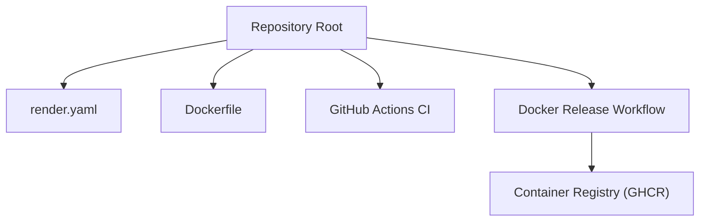
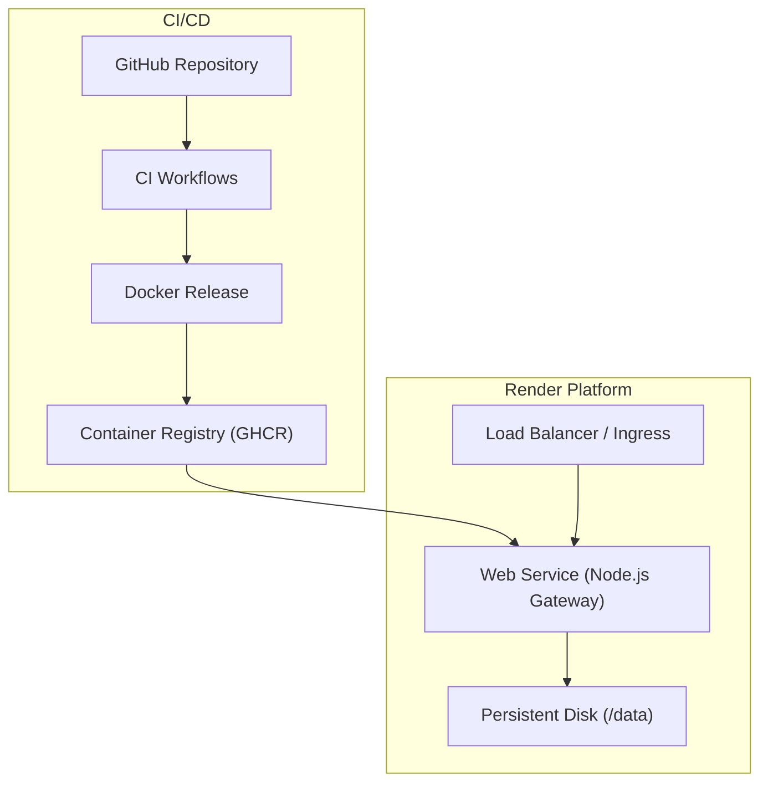
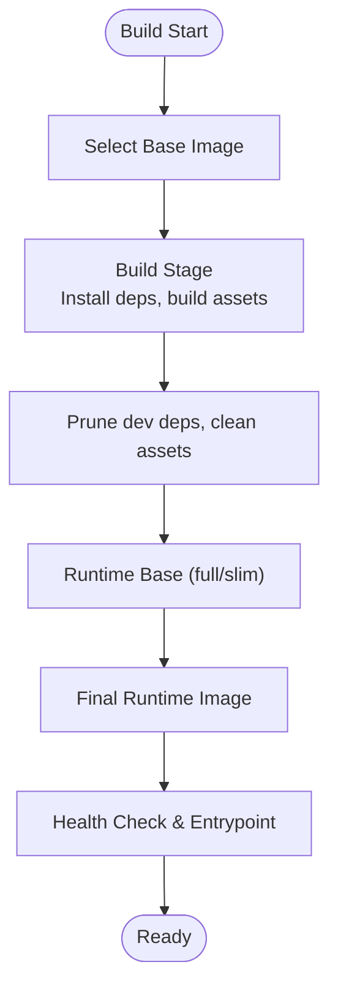
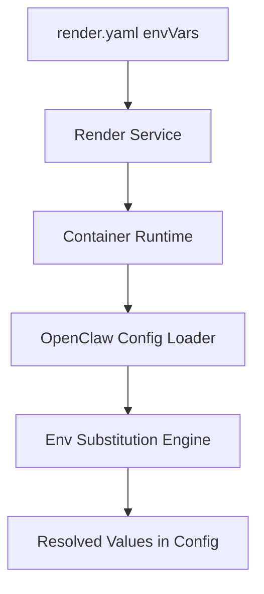
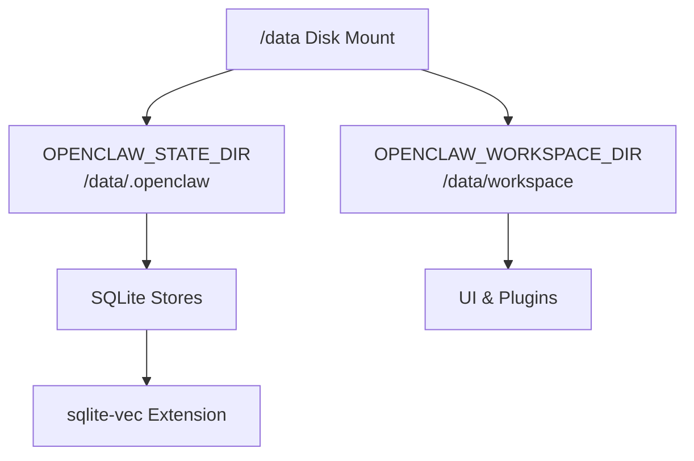
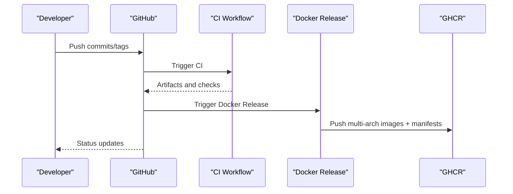
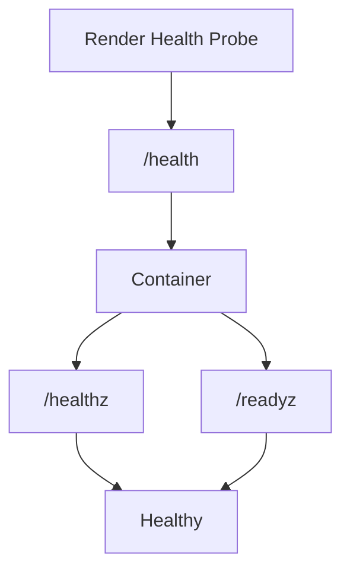
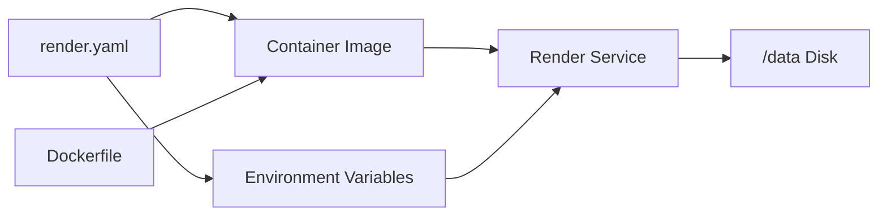

# Render Deployment

<cite>
**Referenced Files in This Document**
- [render.yaml](file://render.yaml)
- [Dockerfile](file://Dockerfile)
- [package.json](file://package.json)
- [.github/workflows/ci.yml](file://.github/workflows/ci.yml)
- [.github/workflows/docker-release.yml](file://.github/workflows/docker-release.yml)
- [docs/install/render.mdx](file://docs/install/render.mdx)
- [src/config/env-substitution.ts](file://src/config/env-substitution.ts)
- [src/config/env-preserve.ts](file://src/config/env-preserve.ts)
- [src/memory/manager-sync-ops.ts](file://src/memory/manager-sync-ops.ts)
- [src/memory/qmd-manager.ts](file://src/memory/qmd-manager.ts)
- [src/memory/sqlite-vec.ts](file://src/memory/sqlite-vec.ts)
</cite>

## Table of Contents
1. [Introduction](#introduction)
2. [Project Structure](#project-structure)
3. [Core Components](#core-components)
4. [Architecture Overview](#architecture-overview)
5. [Detailed Component Analysis](#detailed-component-analysis)
6. [Dependency Analysis](#dependency-analysis)
7. [Performance Considerations](#performance-considerations)
8. [Troubleshooting Guide](#troubleshooting-guide)
9. [Conclusion](#conclusion)
10. [Appendices](#appendices)

## Introduction
This document explains how to deploy OpenClaw on Render using Infrastructure as Code. It covers the Render Blueprint configuration, containerized deployment, environment variable management, persistent storage, health checks, scaling, HTTPS and custom domains, CI/CD integration with GitHub, and operational guidance for monitoring, logging, and performance.

## Project Structure
OpenClaw’s Render deployment is defined by a single Blueprint file at the repository root and a container image built from the repository’s Dockerfile. The application exposes a gateway and optional UI assets, and uses environment variables for configuration and secrets. CI/CD workflows build and publish container images to a container registry.

**Diagram sources**
- [render.yaml](file://render.yaml#L1-L22)
- [Dockerfile](file://Dockerfile#L1-L231)
- [.github/workflows/ci.yml](file://.github/workflows/ci.yml#L1-L765)
- [.github/workflows/docker-release.yml](file://.github/workflows/docker-release.yml#L1-L309)

**Section sources**
- [render.yaml](file://render.yaml#L1-L22)
- [Dockerfile](file://Dockerfile#L1-L231)
- [.github/workflows/ci.yml](file://.github/workflows/ci.yml#L1-L765)
- [.github/workflows/docker-release.yml](file://.github/workflows/docker-release.yml#L1-L309)

## Core Components
- Render Blueprint: Defines the web service, runtime, health check, environment variables, and persistent disk.
- Container Image: Built from the repository’s Dockerfile and published by CI/CD.
- Application: Starts the gateway with default configuration and exposes health endpoints.
- CI/CD: Builds artifacts, runs checks, and publishes container images for multi-architecture support.

**Section sources**
- [render.yaml](file://render.yaml#L1-L22)
- [Dockerfile](file://Dockerfile#L224-L231)
- [.github/workflows/ci.yml](file://.github/workflows/ci.yml#L1-L765)
- [.github/workflows/docker-release.yml](file://.github/workflows/docker-release.yml#L1-L309)

## Architecture Overview
The Render deployment model is a single containerized web service with a persistent disk for state and workspace. The service binds to localhost internally and is fronted by Render’s ingress. Health checks ensure automatic restarts on failure. CI/CD builds and pushes images to a container registry for Render to consume.

**Diagram sources**
- [render.yaml](file://render.yaml#L1-L22)
- [.github/workflows/docker-release.yml](file://.github/workflows/docker-release.yml#L1-L309)
- [Dockerfile](file://Dockerfile#L224-L231)

## Detailed Component Analysis

### Render Blueprint: render.yaml
- Service type: Web service
- Runtime: Docker
- Plan: Starter (changeable)
- Health check: Path /health
- Environment variables:
  - PORT: 8080
  - SETUP_PASSWORD: prompted during deploy (sync: false)
  - OPENCLAW_STATE_DIR: persistent state path
  - OPENCLAW_WORKSPACE_DIR: workspace path
  - OPENCLAW_GATEWAY_TOKEN: auto-generated secure token
- Disk: Mounted at /data with 1 GB size

Operational notes:
- The health check path aligns with the container’s built-in probes.
- The disk persists across deploys and supports exporting configuration via the setup UI.

**Section sources**
- [render.yaml](file://render.yaml#L1-L22)
- [docs/install/render.mdx](file://docs/install/render.mdx#L24-L62)

### Container Image: Dockerfile
- Multi-stage build with Node.js base and slim variants.
- Installs system packages and optional components (browser, Docker CLI).
- Non-root user execution for security.
- Health check and default command configured for the gateway.
- Exposed ports and environment aligned with Render’s PORT setting.

**Diagram sources**
- [Dockerfile](file://Dockerfile#L1-L231)

**Section sources**
- [Dockerfile](file://Dockerfile#L1-L231)

### Environment Variable Management
- Render Blueprint sets critical variables (PORT, state/workspace dirs, gateway token).
- Secrets like SETUP_PASSWORD are prompted during deploy (sync: false).
- The application supports environment variable substitution and preservation in configuration, enabling flexible secret management.

**Diagram sources**
- [render.yaml](file://render.yaml#L7-L17)
- [src/config/env-substitution.ts](file://src/config/env-substitution.ts#L1-L49)
- [src/config/env-preserve.ts](file://src/config/env-preserve.ts#L1-L38)

**Section sources**
- [render.yaml](file://render.yaml#L7-L17)
- [src/config/env-substitution.ts](file://src/config/env-substitution.ts#L1-L49)
- [src/config/env-preserve.ts](file://src/config/env-preserve.ts#L1-L38)

### Persistent Storage and Data Paths
- The Blueprint mounts a disk at /data and sets state and workspace directories.
- SQLite memory stores and vector extensions are configured to handle concurrency and busy timeouts.
- Read-only connections use reduced busy timeouts to avoid blocking main-thread queries.

**Diagram sources**
- [render.yaml](file://render.yaml#L18-L21)
- [src/memory/manager-sync-ops.ts](file://src/memory/manager-sync-ops.ts#L252-L267)
- [src/memory/qmd-manager.ts](file://src/memory/qmd-manager.ts#L1417-L1430)
- [src/memory/sqlite-vec.ts](file://src/memory/sqlite-vec.ts#L1-L24)

**Section sources**
- [render.yaml](file://render.yaml#L18-L21)
- [src/memory/manager-sync-ops.ts](file://src/memory/manager-sync-ops.ts#L252-L267)
- [src/memory/qmd-manager.ts](file://src/memory/qmd-manager.ts#L1417-L1430)
- [src/memory/sqlite-vec.ts](file://src/memory/sqlite-vec.ts#L1-L24)

### CI/CD Integration with GitHub
- CI workflow orchestrates builds, checks, and platform-specific tasks.
- Docker Release workflow builds multi-architecture images and pushes manifests to GHCR.
- Images are tagged per branch and semver tags, enabling reproducible deployments.

**Diagram sources**
- [.github/workflows/ci.yml](file://.github/workflows/ci.yml#L1-L765)
- [.github/workflows/docker-release.yml](file://.github/workflows/docker-release.yml#L1-L309)

**Section sources**
- [.github/workflows/ci.yml](file://.github/workflows/ci.yml#L1-L765)
- [.github/workflows/docker-release.yml](file://.github/workflows/docker-release.yml#L1-L309)

### Health Checks and Readiness
- The container defines a health check probing liveness and readiness endpoints.
- Render uses the health check path configured in the Blueprint to monitor service status and restart unhealthy instances.

**Diagram sources**
- [Dockerfile](file://Dockerfile#L224-L229)
- [render.yaml](file://render.yaml#L6-L6)

**Section sources**
- [Dockerfile](file://Dockerfile#L224-L229)
- [render.yaml](file://render.yaml#L6-L6)

### HTTPS, Custom Domains, and SSL
- Render provides automatic HTTPS for default onrender.com URLs.
- Custom domains can be added; Render provisions TLS certificates automatically upon DNS verification.

**Section sources**
- [docs/install/render.mdx](file://docs/install/render.mdx#L110-L116)

### Scaling Policies
- Vertical scaling: Upgrade plan to increase CPU/RAM.
- Horizontal scaling: Increase instance count (Standard plan and above).
- For stateful workloads, consider sticky sessions or external state management.

**Section sources**
- [docs/install/render.mdx](file://docs/install/render.mdx#L117-L124)

### Database Connectivity (PostgreSQL and Others)
- The repository includes guidance for PostgreSQL-backed state in related skills documentation.
- Recommended practices include dedicated users, limited-privilege schemas, and provider-specific managed services for collaboration and scale.

**Section sources**
- [docs/install/render.mdx](file://docs/install/render.mdx#L126-L134)

## Dependency Analysis
- Render Blueprint depends on the container image produced by CI/CD.
- The container image depends on the Dockerfile and build scripts.
- The application depends on environment variables and persistent disk paths.

**Diagram sources**
- [render.yaml](file://render.yaml#L1-L22)
- [Dockerfile](file://Dockerfile#L1-L231)

**Section sources**
- [render.yaml](file://render.yaml#L1-L22)
- [Dockerfile](file://Dockerfile#L1-L231)

## Performance Considerations
- Use the Starter plan or higher for consistent performance; free tier spins down after inactivity.
- Enable browser installation in the container if frequent headless automation is required.
- Tune SQLite busy timeouts for concurrent access; the code sets appropriate values for write and read paths.

**Section sources**
- [docs/install/render.mdx](file://docs/install/render.mdx#L63-L73)
- [Dockerfile](file://Dockerfile#L157-L171)
- [src/memory/manager-sync-ops.ts](file://src/memory/manager-sync-ops.ts#L262-L266)
- [src/memory/qmd-manager.ts](file://src/memory/qmd-manager.ts#L1423-L1428)

## Troubleshooting Guide
Common issues and resolutions:
- Service won’t start:
  - Verify SETUP_PASSWORD is set.
  - Confirm PORT matches the container’s expected port.
- Slow cold starts (free tier):
  - Upgrade to Starter for always-on instances.
- Data loss after redeploy:
  - Use a paid plan with persistent disk or export configuration regularly.
- Health check failures:
  - Review build and deploy logs; ensure the container starts within the health check window.

**Section sources**
- [docs/install/render.mdx](file://docs/install/render.mdx#L136-L160)

## Conclusion
OpenClaw’s Render deployment is streamlined by a declarative Blueprint, robust CI/CD, and a hardened container image. By leveraging persistent disks, environment variable management, and Render’s automatic HTTPS and scaling, teams can operate OpenClaw reliably in production. Follow the operational guidance for monitoring, backups, and performance tuning to maintain a smooth experience.

## Appendices

### Appendix A: Render Blueprint Reference
- Service type: web
- Runtime: docker
- Plan: starter
- Health check path: /health
- Environment variables:
  - PORT: 8080
  - SETUP_PASSWORD: prompted during deploy
  - OPENCLAW_STATE_DIR: /data/.openclaw
  - OPENCLAW_WORKSPACE_DIR: /data/workspace
  - OPENCLAW_GATEWAY_TOKEN: auto-generated
- Disk: name, mountPath, sizeGB

**Section sources**
- [render.yaml](file://render.yaml#L1-L22)
- [docs/install/render.mdx](file://docs/install/render.mdx#L24-L62)

### Appendix B: Container Entrypoint and Health
- Entrypoint runs the gateway with allow-unconfigured mode.
- Health checks probe liveness and readiness endpoints.

**Section sources**
- [Dockerfile](file://Dockerfile#L224-L231)

### Appendix C: CI/CD Tags and Platforms
- Images are tagged per branch and semver tags.
- Multi-architecture builds (amd64/arm64) with manifests.

**Section sources**
- [.github/workflows/docker-release.yml](file://.github/workflows/docker-release.yml#L48-L80)
- [.github/workflows/docker-release.yml](file://.github/workflows/docker-release.yml#L149-L181)
- [.github/workflows/docker-release.yml](file://.github/workflows/docker-release.yml#L245-L281)