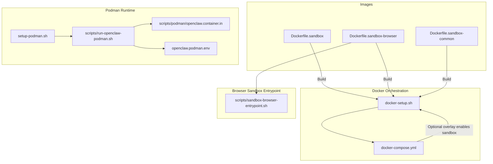
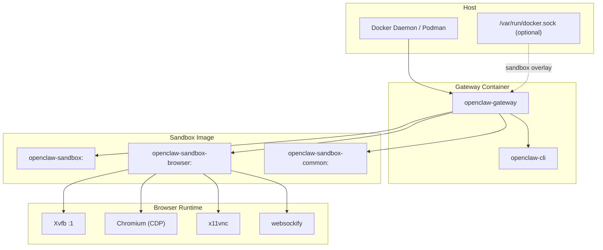
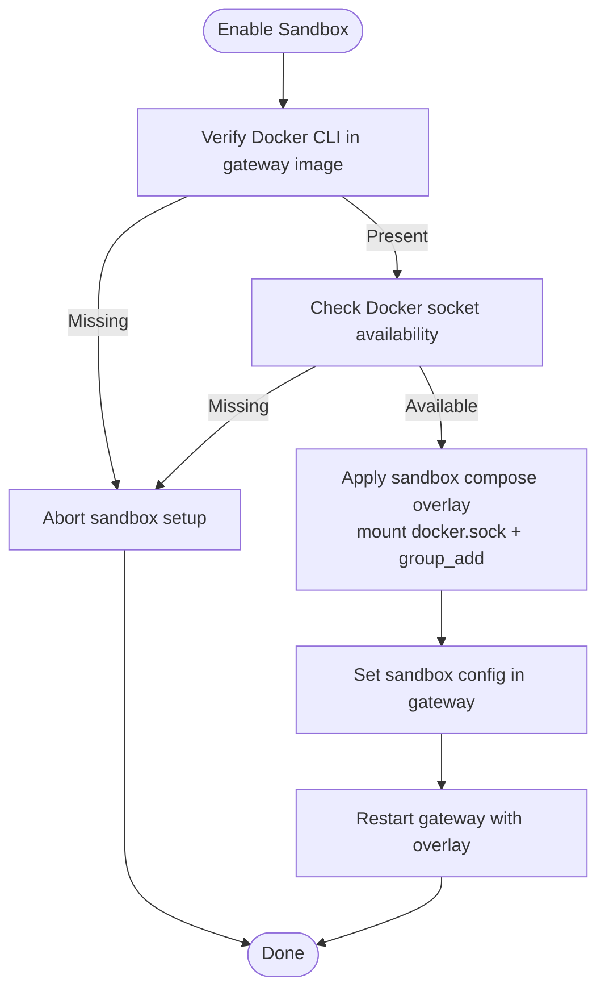
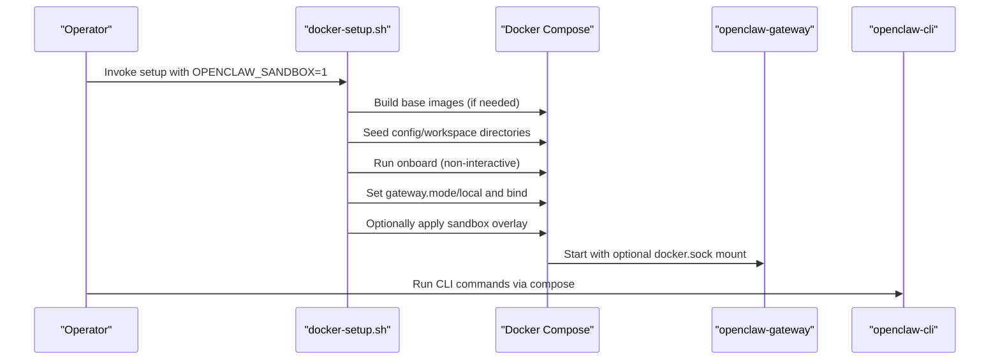
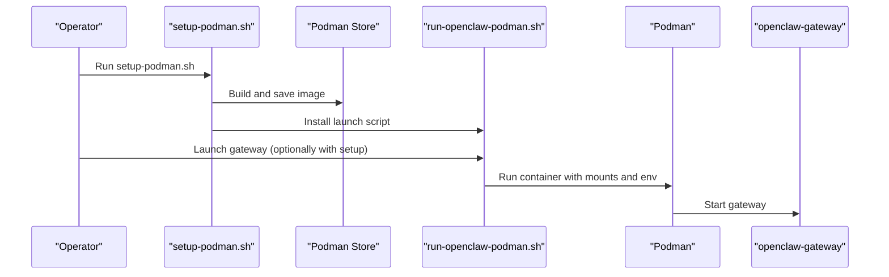
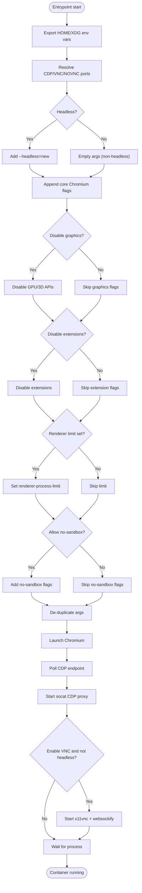
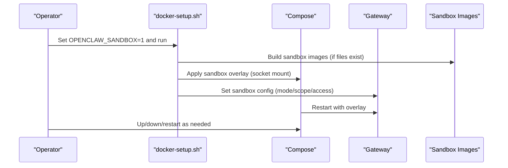
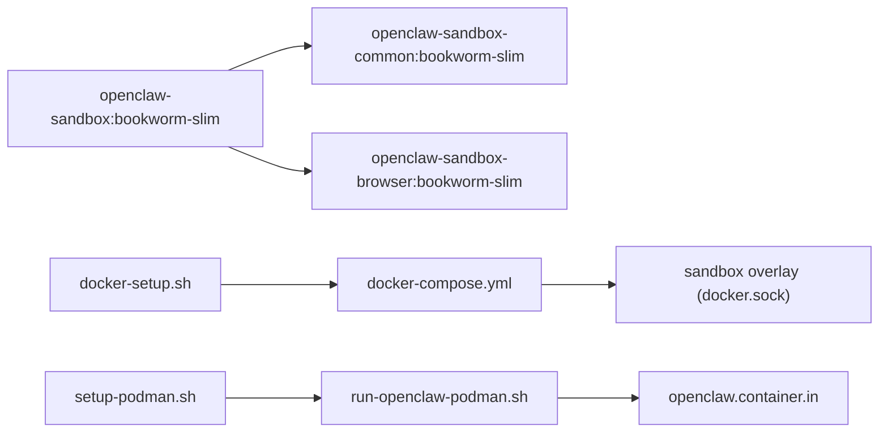

# Agent Sandbox Containers

<cite>
**Referenced Files in This Document**
- [Dockerfile.sandbox](file://Dockerfile.sandbox)
- [Dockerfile.sandbox-browser](file://Dockerfile.sandbox-browser)
- [Dockerfile.sandbox-common](file://Dockerfile.sandbox-common)
- [docker-compose.yml](file://docker-compose.yml)
- [docker-setup.sh](file://docker-setup.sh)
- [scripts/sandbox-setup.sh](file://scripts/sandbox-setup.sh)
- [scripts/sandbox-browser-setup.sh](file://scripts/sandbox-browser-setup.sh)
- [scripts/sandbox-common-setup.sh](file://scripts/sandbox-common-setup.sh)
- [scripts/sandbox-browser-entrypoint.sh](file://scripts/sandbox-browser-entrypoint.sh)
- [setup-podman.sh](file://setup-podman.sh)
- [scripts/run-openclaw-podman.sh](file://scripts/run-openclaw-podman.sh)
- [scripts/podman/openclaw.container.in](file://scripts/podman/openclaw.container.in)
- [openclaw.podman.env](file://openclaw.podman.env)
</cite>

## Table of Contents
1. [Introduction](#introduction)
2. [Project Structure](#project-structure)
3. [Core Components](#core-components)
4. [Architecture Overview](#architecture-overview)
5. [Detailed Component Analysis](#detailed-component-analysis)
6. [Dependency Analysis](#dependency-analysis)
7. [Performance Considerations](#performance-considerations)
8. [Troubleshooting Guide](#troubleshooting-guide)
9. [Conclusion](#conclusion)
10. [Appendices](#appendices)

## Introduction
This document explains the OpenClaw agent sandbox containerization system. It covers security isolation mechanisms, container runtime integration (Docker and Podman), and the browser automation sandbox setup. It documents the sandbox initialization process, Docker CLI integration, and container lifecycle management. Browser container configurations, headless mode setup, and performance optimization are included, along with troubleshooting guidance and best practices for production deployments.

## Project Structure
The sandbox containerization spans Dockerfiles, Compose orchestration, and runtime scripts for both Docker and Podman. The key elements are:
- Base sandbox images for generic and browser-enabled environments
- Common sandbox image builder that adds developer toolchains
- Docker Compose orchestration and optional sandbox overlay
- Setup scripts to build images, configure environment, and enable sandbox
- Podman setup and runtime scripts for rootless deployments

**Diagram sources**
- [Dockerfile.sandbox](file://Dockerfile.sandbox#L1-L24)
- [Dockerfile.sandbox-browser](file://Dockerfile.sandbox-browser#L1-L35)
- [Dockerfile.sandbox-common](file://Dockerfile.sandbox-common#L1-L48)
- [docker-compose.yml](file://docker-compose.yml#L1-L77)
- [docker-setup.sh](file://docker-setup.sh#L480-L586)
- [scripts/sandbox-browser-entrypoint.sh](file://scripts/sandbox-browser-entrypoint.sh#L1-L128)
- [setup-podman.sh](file://setup-podman.sh#L1-L313)
- [scripts/run-openclaw-podman.sh](file://scripts/run-openclaw-podman.sh#L1-L232)
- [scripts/podman/openclaw.container.in](file://scripts/podman/openclaw.container.in#L1-L29)
- [openclaw.podman.env](file://openclaw.podman.env#L1-L25)

**Section sources**
- [Dockerfile.sandbox](file://Dockerfile.sandbox#L1-L24)
- [Dockerfile.sandbox-browser](file://Dockerfile.sandbox-browser#L1-L35)
- [Dockerfile.sandbox-common](file://Dockerfile.sandbox-common#L1-L48)
- [docker-compose.yml](file://docker-compose.yml#L1-L77)
- [docker-setup.sh](file://docker-setup.sh#L480-L586)
- [scripts/sandbox-browser-entrypoint.sh](file://scripts/sandbox-browser-entrypoint.sh#L1-L128)
- [setup-podman.sh](file://setup-podman.sh#L1-L313)
- [scripts/run-openclaw-podman.sh](file://scripts/run-openclaw-podman.sh#L1-L232)
- [scripts/podman/openclaw.container.in](file://scripts/podman/openclaw.container.in#L1-L29)
- [openclaw.podman.env](file://openclaw.podman.env#L1-L25)

## Core Components
- Generic sandbox image: minimal Debian-based image with essential tools and a non-root user for sandboxed agent execution.
- Browser sandbox image: Chromium-based image with virtual display, VNC/noVNC, and a browser entrypoint that exposes CDP and VNC.
- Common sandbox image: builder that adds Node/npm, pnpm, Bun, Homebrew/Linuxbrew, and developer toolchains to the base sandbox image.
- Docker orchestration: Compose services for gateway and CLI, with optional sandbox overlay that mounts the Docker socket and applies sandbox policy.
- Podman runtime: One-time setup to create a non-login user, build/load the image, and run the gateway as a rootless container with systemd Quadlet support.

Key configuration touchpoints:
- Environment variables controlling sandbox behavior (browser flags, ports, headless mode, VNC/noVNC).
- Compose overlays that safely mount the Docker socket only when prerequisites are satisfied.
- Entrypoint logic that configures Chromium arguments, starts Xvfb, CDP proxy, and optionally VNC/websockify.

**Section sources**
- [Dockerfile.sandbox](file://Dockerfile.sandbox#L1-L24)
- [Dockerfile.sandbox-browser](file://Dockerfile.sandbox-browser#L1-L35)
- [Dockerfile.sandbox-common](file://Dockerfile.sandbox-common#L1-L48)
- [docker-compose.yml](file://docker-compose.yml#L1-L77)
- [docker-setup.sh](file://docker-setup.sh#L480-L586)
- [scripts/sandbox-browser-entrypoint.sh](file://scripts/sandbox-browser-entrypoint.sh#L19-L128)
- [scripts/sandbox-common-setup.sh](file://scripts/sandbox-common-setup.sh#L1-L55)
- [scripts/sandbox-setup.sh](file://scripts/sandbox-setup.sh#L1-L8)
- [scripts/sandbox-browser-setup.sh](file://scripts/sandbox-browser-setup.sh#L1-L8)
- [setup-podman.sh](file://setup-podman.sh#L1-L313)
- [scripts/run-openclaw-podman.sh](file://scripts/run-openclaw-podman.sh#L1-L232)
- [scripts/podman/openclaw.container.in](file://scripts/podman/openclaw.container.in#L1-L29)
- [openclaw.podman.env](file://openclaw.podman.env#L1-L25)

## Architecture Overview
The sandbox architecture separates concerns between:
- Security isolation: non-root user, minimal base image, and optional Docker socket access for agent execution.
- Browser automation: virtual display, Chromium, and optional VNC/noVNC for remote inspection.
- Lifecycle management: Compose for Docker, Podman with Quadlet for rootless deployments.

**Diagram sources**
- [docker-compose.yml](file://docker-compose.yml#L1-L77)
- [docker-setup.sh](file://docker-setup.sh#L509-L534)
- [Dockerfile.sandbox](file://Dockerfile.sandbox#L1-L24)
- [Dockerfile.sandbox-browser](file://Dockerfile.sandbox-browser#L1-L35)
- [Dockerfile.sandbox-common](file://Dockerfile.sandbox-common#L1-L48)
- [scripts/sandbox-browser-entrypoint.sh](file://scripts/sandbox-browser-entrypoint.sh#L38-L128)

## Detailed Component Analysis

### Security Isolation Mechanisms
- Non-root execution: base sandbox images create a sandbox user and switch to it for reduced privilege.
- Minimal base: Debian slim images with only necessary packages installed.
- Optional Docker socket mounting: sandbox overlay is applied only when Docker CLI is present in the gateway image and the socket exists.
- Policy-driven sandboxing: the gateway config enforces sandbox mode, scope, and workspace access policies.

**Diagram sources**
- [docker-setup.sh](file://docker-setup.sh#L497-L534)
- [docker-setup.sh](file://docker-setup.sh#L536-L574)
- [docker-compose.yml](file://docker-compose.yml#L15-L22)

**Section sources**
- [Dockerfile.sandbox](file://Dockerfile.sandbox#L19-L21)
- [docker-setup.sh](file://docker-setup.sh#L497-L534)
- [docker-setup.sh](file://docker-setup.sh#L536-L574)
- [docker-compose.yml](file://docker-compose.yml#L15-L22)

### Container Runtime Integration (Docker)
- Image building: separate scripts build the base sandbox and browser images; a common builder adds developer toolchains.
- Compose orchestration: gateway and CLI services; optional sandbox overlay mounts the Docker socket and sets group_add based on host docker GID.
- Setup workflow: docker-setup.sh validates prerequisites, builds images, seeds config/workspace, runs onboarding, and conditionally enables sandbox with a secure overlay.

**Diagram sources**
- [docker-setup.sh](file://docker-setup.sh#L413-L428)
- [docker-setup.sh](file://docker-setup.sh#L447-L455)
- [docker-setup.sh](file://docker-setup.sh#L477-L477)
- [docker-setup.sh](file://docker-setup.sh#L509-L534)
- [docker-setup.sh](file://docker-setup.sh#L536-L574)
- [docker-compose.yml](file://docker-compose.yml#L1-L77)

**Section sources**
- [scripts/sandbox-setup.sh](file://scripts/sandbox-setup.sh#L1-L8)
- [scripts/sandbox-browser-setup.sh](file://scripts/sandbox-browser-setup.sh#L1-L8)
- [scripts/sandbox-common-setup.sh](file://scripts/sandbox-common-setup.sh#L1-L55)
- [docker-setup.sh](file://docker-setup.sh#L413-L428)
- [docker-setup.sh](file://docker-setup.sh#L447-L455)
- [docker-setup.sh](file://docker-setup.sh#L477-L477)
- [docker-setup.sh](file://docker-setup.sh#L509-L534)
- [docker-setup.sh](file://docker-setup.sh#L536-L574)
- [docker-compose.yml](file://docker-compose.yml#L1-L77)

### Container Runtime Integration (Podman)
- One-time setup: creates a non-login user, generates a token, seeds config, builds the image, saves/loading it into the user’s Podman store, and installs a launch script.
- Runtime: run-openclaw-podman.sh starts the gateway container with bind mounts, environment file, and optional systemd Quadlet for auto-start.
- Quadlet: systemd unit template for rootless Podman with user namespace and SELinux-aware mount options.

**Diagram sources**
- [setup-podman.sh](file://setup-podman.sh#L193-L257)
- [setup-podman.sh](file://setup-podman.sh#L258-L277)
- [scripts/run-openclaw-podman.sh](file://scripts/run-openclaw-podman.sh#L202-L227)
- [scripts/podman/openclaw.container.in](file://scripts/podman/openclaw.container.in#L1-L29)

**Section sources**
- [setup-podman.sh](file://setup-podman.sh#L1-L313)
- [scripts/run-openclaw-podman.sh](file://scripts/run-openclaw-podman.sh#L1-L232)
- [scripts/podman/openclaw.container.in](file://scripts/podman/openclaw.container.in#L1-L29)
- [openclaw.podman.env](file://openclaw.podman.env#L1-L25)

### Browser Automation Sandbox Setup
- Virtual display: Xvfb runs on :1 with a fixed resolution.
- Chromium flags: configurable headless mode, remote debugging address/port, user data directory, and numerous privacy/security flags.
- Port mapping: CDP port is proxied via socat; optional VNC and noVNC are enabled when headless is disabled.
- Environment: HOME and XDG_* directories are isolated under /tmp to prevent persistent state.

**Diagram sources**
- [scripts/sandbox-browser-entrypoint.sh](file://scripts/sandbox-browser-entrypoint.sh#L19-L128)

**Section sources**
- [Dockerfile.sandbox-browser](file://Dockerfile.sandbox-browser#L1-L35)
- [scripts/sandbox-browser-entrypoint.sh](file://scripts/sandbox-browser-entrypoint.sh#L19-L128)

### Sandbox Initialization and Lifecycle Management
- Initialization: docker-setup.sh detects sandbox enablement, ensures Docker CLI is available, builds base images, seeds directories, runs onboarding, and applies sandbox policy.
- Lifecycle: Compose manages gateway and CLI lifecycles; sandbox overlay is reapplied on restart to maintain socket access and policy.
- Podman lifecycle: run-openclaw-podman.sh starts/stops the container, supports onboarding, and integrates with systemd Quadlet.

**Diagram sources**
- [docker-setup.sh](file://docker-setup.sh#L480-L586)
- [docker-setup.sh](file://docker-setup.sh#L509-L534)
- [docker-setup.sh](file://docker-setup.sh#L536-L574)

**Section sources**
- [docker-setup.sh](file://docker-setup.sh#L480-L586)
- [docker-setup.sh](file://docker-setup.sh#L509-L534)
- [docker-setup.sh](file://docker-setup.sh#L536-L574)
- [scripts/run-openclaw-podman.sh](file://scripts/run-openclaw-podman.sh#L202-L227)

## Dependency Analysis
- Image dependencies:
  - Base sandbox image is the foundation for the common sandbox image.
  - Browser sandbox image depends on the base image and adds browser and VNC tools.
- Runtime dependencies:
  - Docker: Compose overlay depends on Docker CLI availability and socket presence.
  - Podman: Requires rootless setup with subuid/subgid and optional systemd Quadlet.

**Diagram sources**
- [Dockerfile.sandbox](file://Dockerfile.sandbox#L1-L24)
- [Dockerfile.sandbox-common](file://Dockerfile.sandbox-common#L1-L48)
- [Dockerfile.sandbox-browser](file://Dockerfile.sandbox-browser#L1-L35)
- [docker-setup.sh](file://docker-setup.sh#L509-L534)
- [docker-compose.yml](file://docker-compose.yml#L1-L77)
- [setup-podman.sh](file://setup-podman.sh#L258-L277)
- [scripts/run-openclaw-podman.sh](file://scripts/run-openclaw-podman.sh#L215-L227)
- [scripts/podman/openclaw.container.in](file://scripts/podman/openclaw.container.in#L1-L29)

**Section sources**
- [Dockerfile.sandbox](file://Dockerfile.sandbox#L1-L24)
- [Dockerfile.sandbox-common](file://Dockerfile.sandbox-common#L1-L48)
- [Dockerfile.sandbox-browser](file://Dockerfile.sandbox-browser#L1-L35)
- [docker-setup.sh](file://docker-setup.sh#L509-L534)
- [docker-compose.yml](file://docker-compose.yml#L1-L77)
- [setup-podman.sh](file://setup-podman.sh#L258-L277)
- [scripts/run-openclaw-podman.sh](file://scripts/run-openclaw-podman.sh#L215-L227)
- [scripts/podman/openclaw.container.in](file://scripts/podman/openclaw.container.in#L1-L29)

## Performance Considerations
- Headless mode: Prefer headless for CPU-bound tasks to reduce GPU overhead.
- Renderer process limit: Lower limits reduce resource consumption when running multiple agents.
- Graphics flags: Disabling GPU/3D APIs reduces overhead in constrained environments.
- Caching: APT caches are mounted in Dockerfiles to speed up builds.
- Developer toolchains: Installing pnpm/Bun/Homebrew can increase initial image size; include only what is needed for your agent tasks.

[No sources needed since this section provides general guidance]

## Troubleshooting Guide
Common sandbox issues and resolutions:
- Docker socket not found: Ensure the host Docker socket exists and the gateway image contains Docker CLI; docker-setup.sh validates these prerequisites before applying the sandbox overlay.
- Partial sandbox config: If setting sandbox policy fails, docker-setup.sh rolls back to disable sandbox and removes the overlay file.
- Permission problems on bind mounts: docker-setup.sh runs a root container to fix ownership of config/workspace directories.
- Podman user namespaces: Verify subuid/subgid ranges and SELinux mount options; Quadlet template includes user namespace and SELinux relabeling.
- Browser sandbox failures: Confirm Xvfb is running, CDP port is reachable, and socat is forwarding traffic; VNC/noVNC is only enabled when headless is disabled.

**Section sources**
- [docker-setup.sh](file://docker-setup.sh#L500-L505)
- [docker-setup.sh](file://docker-setup.sh#L563-L574)
- [docker-setup.sh](file://docker-setup.sh#L442-L444)
- [setup-podman.sh](file://setup-podman.sh#L224-L228)
- [scripts/run-openclaw-podman.sh](file://scripts/run-openclaw-podman.sh#L188-L200)
- [scripts/sandbox-browser-entrypoint.sh](file://scripts/sandbox-browser-entrypoint.sh#L99-L104)
- [scripts/sandbox-browser-entrypoint.sh](file://scripts/sandbox-browser-entrypoint.sh#L112-L125)

## Conclusion
OpenClaw’s sandbox containerization provides robust security isolation and flexible runtime options for agent execution. The Docker-based setup uses a validated overlay to safely expose the Docker socket and enforce sandbox policy, while the Podman-based setup offers a rootless alternative with systemd integration. The browser sandbox simplifies automation with a virtual display, controlled Chromium flags, and optional VNC/noVNC access. Proper configuration, monitoring, and adherence to best practices ensure reliable and secure deployments.

[No sources needed since this section summarizes without analyzing specific files]

## Appendices

### Environment Variables and Ports
- Browser sandbox ports and flags are controlled via environment variables exported by the entrypoint script.
- Docker Compose exposes ports for CDP, VNC, and noVNC in the browser image.

**Section sources**
- [scripts/sandbox-browser-entrypoint.sh](file://scripts/sandbox-browser-entrypoint.sh#L24-L34)
- [Dockerfile.sandbox-browser](file://Dockerfile.sandbox-browser#L32-L34)

### Production Best Practices
- Prefer headless mode for CPU-bound tasks.
- Limit renderer processes and disable unnecessary features to reduce resource usage.
- Use SELinux mount options when required and keep subuid/subgid ranges configured for Podman.
- Monitor gateway health checks and ensure the sandbox overlay is reapplied on restart.

[No sources needed since this section provides general guidance]