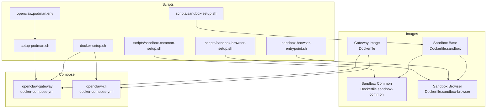
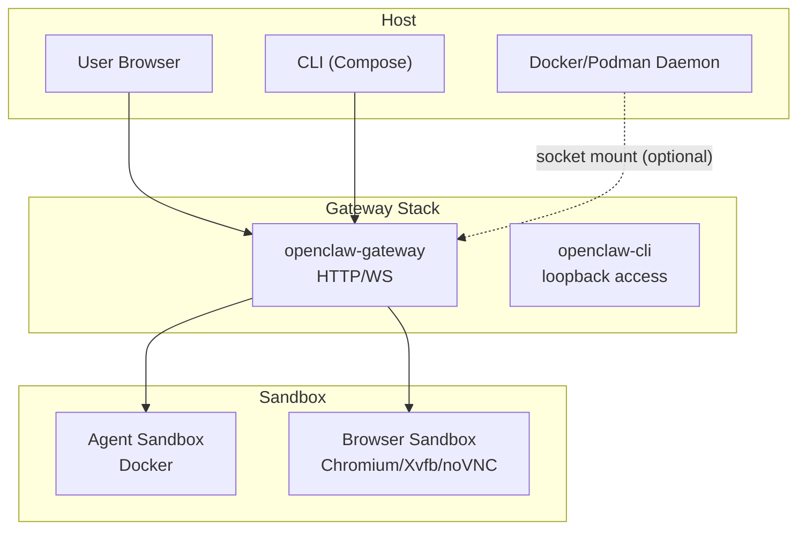
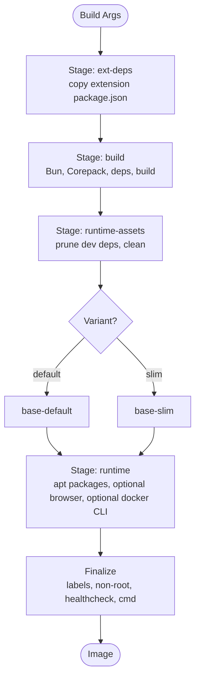
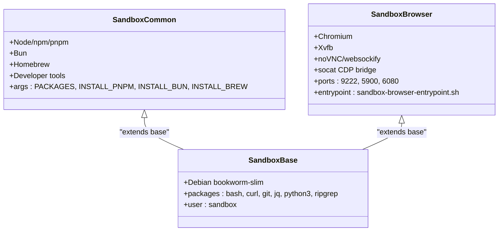
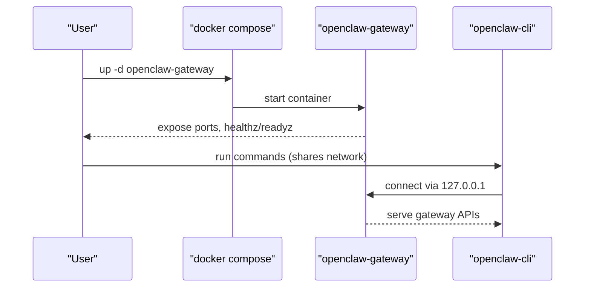
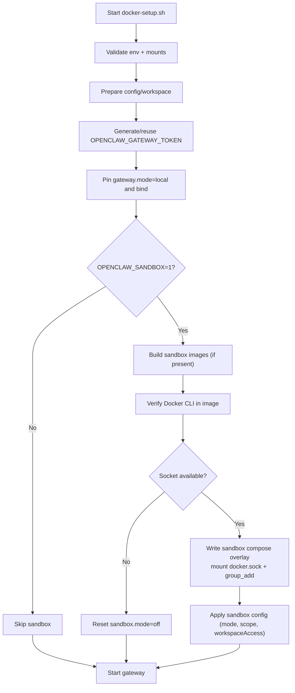
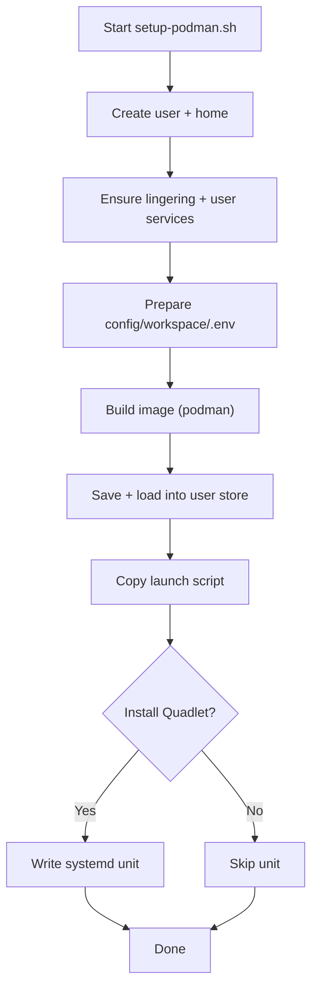
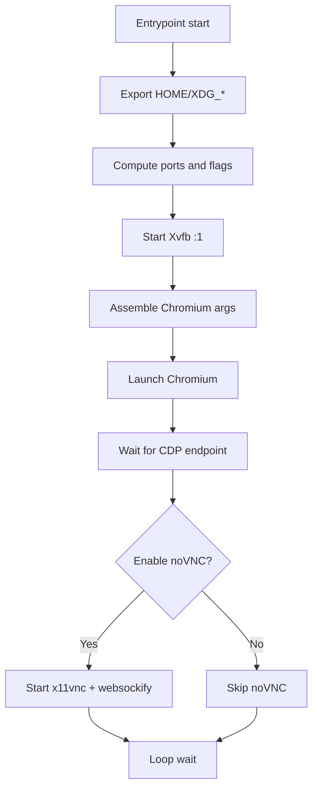
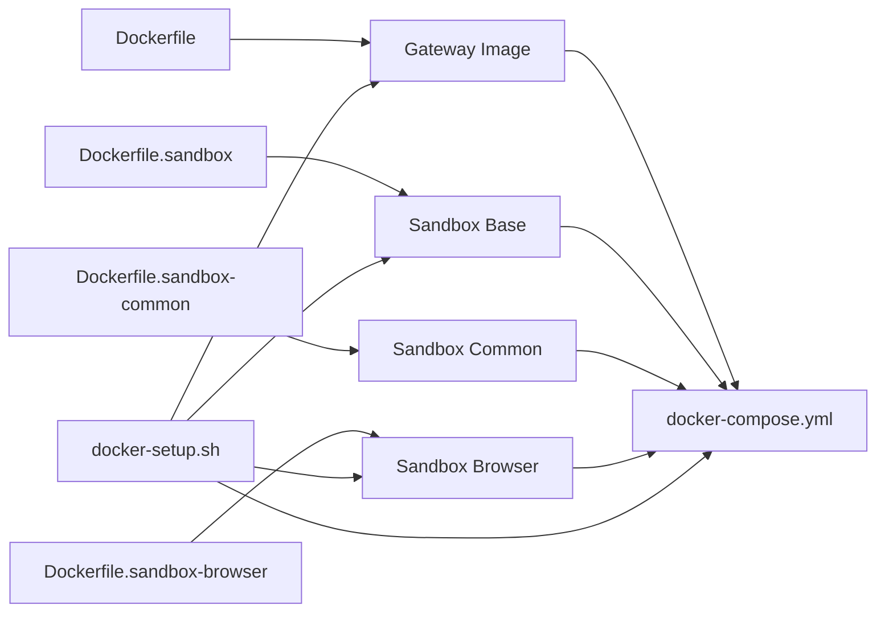

# Containerization & Docker

<cite>
**Referenced Files in This Document**
- [Dockerfile](file://Dockerfile)
- [Dockerfile.sandbox](file://Dockerfile.sandbox)
- [Dockerfile.sandbox-browser](file://Dockerfile.sandbox-browser)
- [Dockerfile.sandbox-common](file://Dockerfile.sandbox-common)
- [docker-compose.yml](file://docker-compose.yml)
- [docker-setup.sh](file://docker-setup.sh)
- [openclaw.podman.env](file://openclaw.podman.env)
- [setup-podman.sh](file://setup-podman.sh)
- [scripts/sandbox-browser-entrypoint.sh](file://scripts/sandbox-browser-entrypoint.sh)
- [scripts/sandbox-setup.sh](file://scripts/sandbox-setup.sh)
- [scripts/sandbox-common-setup.sh](file://scripts/sandbox-common-setup.sh)
- [scripts/sandbox-browser-setup.sh](file://scripts/sandbox-browser-setup.sh)
- [docs/install/docker.md](file://docs/install/docker.md)
- [docs/gateway/sandboxing.md](file://docs/gateway/sandboxing.md)
</cite>

## Table of Contents
1. [Introduction](#introduction)
2. [Project Structure](#project-structure)
3. [Core Components](#core-components)
4. [Architecture Overview](#architecture-overview)
5. [Detailed Component Analysis](#detailed-component-analysis)
6. [Dependency Analysis](#dependency-analysis)
7. [Performance Considerations](#performance-considerations)
8. [Troubleshooting Guide](#troubleshooting-guide)
9. [Conclusion](#conclusion)
10. [Appendices](#appendices)

## Introduction
This document explains how to containerize and deploy OpenClaw using Docker and Docker Compose, and how to isolate agent tools using sandbox containers. It covers:
- Building the main gateway image and optional browser-enabled image
- Orchestrating gateway and CLI with Docker Compose
- Enabling agent sandbox isolation with Docker socket delegation
- Environment variable configuration, volume mounting, and network security
- Step-by-step deployment for development and production
- Health checks and troubleshooting
- Sandbox image building and browser container configuration
- Performance optimization tips for containerized deployments

## Project Structure
Key containerization artifacts:
- Main runtime image: Dockerfile
- Sandbox base image: Dockerfile.sandbox
- Sandbox with common tooling: Dockerfile.sandbox-common
- Sandbox browser image: Dockerfile.sandbox-browser
- Orchestration: docker-compose.yml
- Setup scripts: docker-setup.sh, setup-podman.sh, openclaw.podman.env
- Sandbox entrypoints and helpers: scripts/sandbox-*.sh

**Diagram sources**
- [Dockerfile](file://Dockerfile#L1-L231)
- [Dockerfile.sandbox](file://Dockerfile.sandbox#L1-L24)
- [Dockerfile.sandbox-common](file://Dockerfile.sandbox-common#L1-L48)
- [Dockerfile.sandbox-browser](file://Dockerfile.sandbox-browser#L1-L35)
- [docker-compose.yml](file://docker-compose.yml#L1-L77)
- [docker-setup.sh](file://docker-setup.sh#L1-L598)
- [setup-podman.sh](file://setup-podman.sh#L1-L313)
- [openclaw.podman.env](file://openclaw.podman.env#L1-L25)
- [scripts/sandbox-browser-entrypoint.sh](file://scripts/sandbox-browser-entrypoint.sh#L1-L128)
- [scripts/sandbox-setup.sh](file://scripts/sandbox-setup.sh#L1-L8)
- [scripts/sandbox-common-setup.sh](file://scripts/sandbox-common-setup.sh#L1-L55)
- [scripts/sandbox-browser-setup.sh](file://scripts/sandbox-browser-setup.sh#L1-L8)

**Section sources**
- [Dockerfile](file://Dockerfile#L1-L231)
- [docker-compose.yml](file://docker-compose.yml#L1-L77)
- [docker-setup.sh](file://docker-setup.sh#L1-L598)
- [setup-podman.sh](file://setup-podman.sh#L1-L313)
- [openclaw.podman.env](file://openclaw.podman.env#L1-L25)
- [Dockerfile.sandbox](file://Dockerfile.sandbox#L1-L24)
- [Dockerfile.sandbox-common](file://Dockerfile.sandbox-common#L1-L48)
- [Dockerfile.sandbox-browser](file://Dockerfile.sandbox-browser#L1-L35)
- [scripts/sandbox-browser-entrypoint.sh](file://scripts/sandbox-browser-entrypoint.sh#L1-L128)
- [scripts/sandbox-setup.sh](file://scripts/sandbox-setup.sh#L1-L8)
- [scripts/sandbox-common-setup.sh](file://scripts/sandbox-common-setup.sh#L1-L55)
- [scripts/sandbox-browser-setup.sh](file://scripts/sandbox-browser-setup.sh#L1-L8)

## Core Components
- Gateway image (Dockerfile): Multi-stage build with Node LTS base, optional system packages, optional pre-installed Playwright browser, optional Docker CLI for sandbox, non-root execution, health check, and default gateway command.
- Sandbox images:
  - Base: minimal Debian slim with bash, curl, git, jq, python3, ripgrep.
  - Common: adds Node, pnpm, Bun, Homebrew, and developer tools.
  - Browser: Chromium, Xvfb, noVNC/websockify, socat for CDP bridging.
- Compose stack: openclaw-gateway service with bind mounts, ports, health check; openclaw-cli sharing the network for local loopback access.
- Setup scripts:
  - docker-setup.sh: orchestrates image build/pull, onboarding, gateway pinning, optional sandbox bootstrap, and socket mount.
  - setup-podman.sh: rootless Podman setup for user service and optional systemd Quadlet.
  - openclaw.podman.env: environment template for Podman deployments.

**Section sources**
- [Dockerfile](file://Dockerfile#L1-L231)
- [Dockerfile.sandbox](file://Dockerfile.sandbox#L1-L24)
- [Dockerfile.sandbox-common](file://Dockerfile.sandbox-common#L1-L48)
- [Dockerfile.sandbox-browser](file://Dockerfile.sandbox-browser#L1-L35)
- [docker-compose.yml](file://docker-compose.yml#L1-L77)
- [docker-setup.sh](file://docker-setup.sh#L1-L598)
- [setup-podman.sh](file://setup-podman.sh#L1-L313)
- [openclaw.podman.env](file://openclaw.podman.env#L1-L25)

## Architecture Overview
High-level containerization architecture:
- Containerized gateway deployment: a single gateway container exposes HTTP/WS endpoints and optionally bridges to remote gateways.
- Agent sandbox isolation: non-main sessions run tools inside Docker containers with restricted capabilities, network, and filesystem access.
- Optional browser sandbox: a dedicated browser container with Xvfb and optional noVNC for headful automation.

**Diagram sources**
- [docker-compose.yml](file://docker-compose.yml#L1-L77)
- [Dockerfile.sandbox](file://Dockerfile.sandbox#L1-L24)
- [Dockerfile.sandbox-browser](file://Dockerfile.sandbox-browser#L1-L35)
- [docker-setup.sh](file://docker-setup.sh#L480-L534)

## Detailed Component Analysis

### Gateway Image Build (Dockerfile)
- Multi-stage build:
  - ext-deps: copies selected extension package manifests to speed up dependency resolution.
  - build: installs Bun, enables Corepack, installs dependencies with memory limit, builds UI and app.
  - runtime-assets: prunes dev dependencies and cleans build artifacts.
  - base-default/base-slim: selects Debian bookworm or slim base with pinned digests.
  - runtime: installs optional system packages, optionally Playwright Chromium, optionally Docker CLI, sets non-root user, exposes health checks, and starts gateway.
- Build args:
  - OPENCLAW_VARIANT: default or slim
  - OPENCLAW_DOCKER_APT_PACKAGES: extra system packages
  - OPENCLAW_INSTALL_BROWSER: pre-install Chromium and cache
  - OPENCLAW_INSTALL_DOCKER_CLI: install Docker CLI for sandbox
  - OPENCLAW_EXTENSIONS: bake extension dependencies
- Security and defaults:
  - Non-root node user, hardened base image labels, HEALTHCHECK probes /healthz and /readyz, default command allows unconfigured startup.

**Diagram sources**
- [Dockerfile](file://Dockerfile#L1-L231)

**Section sources**
- [Dockerfile](file://Dockerfile#L1-L231)

### Sandbox Images
- Base sandbox (Dockerfile.sandbox): minimal Debian slim with essential tools; runs as non-root user sandbox.
- Common sandbox (Dockerfile.sandbox-common): adds Node, pnpm, Bun, Homebrew; configurable via build args.
- Browser sandbox (Dockerfile.sandbox-browser): Chromium, Xvfb, noVNC/websockify, socat for CDP bridging; exposes ports for CDP, VNC, and noVNC.

**Diagram sources**
- [Dockerfile.sandbox](file://Dockerfile.sandbox#L1-L24)
- [Dockerfile.sandbox-common](file://Dockerfile.sandbox-common#L1-L48)
- [Dockerfile.sandbox-browser](file://Dockerfile.sandbox-browser#L1-L35)
- [scripts/sandbox-browser-entrypoint.sh](file://scripts/sandbox-browser-entrypoint.sh#L1-L128)

**Section sources**
- [Dockerfile.sandbox](file://Dockerfile.sandbox#L1-L24)
- [Dockerfile.sandbox-common](file://Dockerfile.sandbox-common#L1-L48)
- [Dockerfile.sandbox-browser](file://Dockerfile.sandbox-browser#L1-L35)
- [scripts/sandbox-browser-entrypoint.sh](file://scripts/sandbox-browser-entrypoint.sh#L1-L128)

### Docker Compose Orchestration
- Services:
  - openclaw-gateway: binds ports, mounts config/workspace, optional docker.sock for sandbox, health check, restart policy.
  - openclaw-cli: shares network with gateway, restricted caps, interactive TTY, entrypoint to run CLI commands.
- Environment variables: HOME, TERM, token, optional provider keys, bind mode.
- Volumes: config and workspace bind mounts; optional docker.sock for sandbox.

**Diagram sources**
- [docker-compose.yml](file://docker-compose.yml#L1-L77)

**Section sources**
- [docker-compose.yml](file://docker-compose.yml#L1-L77)

### Sandbox Bootstrap and Socket Mount (docker-setup.sh)
- Detects and validates environment, prepares config/workspace, generates or reuses gateway token, pins gateway.mode and bind.
- Optional sandbox bootstrap:
  - Builds sandbox images if Dockerfiles exist.
  - Verifies Docker CLI availability inside the gateway image.
  - Mounts docker.sock and group_add when prerequisites pass; otherwise resets sandbox mode to off.
- Writes extra compose overlays for named volumes and extra mounts.

**Diagram sources**
- [docker-setup.sh](file://docker-setup.sh#L480-L586)

**Section sources**
- [docker-setup.sh](file://docker-setup.sh#L1-L598)

### Podman Deployment (setup-podman.sh + openclaw.podman.env)
- Creates a non-login user, sets up config/workspace, generates token, builds image, saves and loads into user’s Podman store, installs launch script.
- Optional systemd Quadlet for user service and lingering.
- Environment template defines token, ports, and optional provider keys.

**Diagram sources**
- [setup-podman.sh](file://setup-podman.sh#L1-L313)
- [openclaw.podman.env](file://openclaw.podman.env#L1-L25)

**Section sources**
- [setup-podman.sh](file://setup-podman.sh#L1-L313)
- [openclaw.podman.env](file://openclaw.podman.env#L1-L25)

### Sandbox Browser Entrypoint (scripts/sandbox-browser-entrypoint.sh)
- Sets display, user data dir, and environment variables for ports and flags.
- Starts Xvfb, Chromium with hardened flags, deduplicates arguments, and exposes CDP via socat.
- Optionally starts VNC and noVNC with password protection.

**Diagram sources**
- [scripts/sandbox-browser-entrypoint.sh](file://scripts/sandbox-browser-entrypoint.sh#L1-L128)

**Section sources**
- [scripts/sandbox-browser-entrypoint.sh](file://scripts/sandbox-browser-entrypoint.sh#L1-L128)

## Dependency Analysis
- Image build dependencies:
  - Node 22 bookworm base with pinned digests
  - Optional system packages via build args
  - Optional Docker CLI for sandbox
  - Optional Playwright browser cache
- Runtime dependencies:
  - Gateway service depends on CLI for local loopback commands
  - Sandbox requires Docker CLI and docker.sock for containerized tool execution
- Compose overlays:
  - Extra mounts and named volumes are written conditionally by docker-setup.sh

**Diagram sources**
- [Dockerfile](file://Dockerfile#L1-L231)
- [Dockerfile.sandbox](file://Dockerfile.sandbox#L1-L24)
- [Dockerfile.sandbox-common](file://Dockerfile.sandbox-common#L1-L48)
- [Dockerfile.sandbox-browser](file://Dockerfile.sandbox-browser#L1-L35)
- [docker-compose.yml](file://docker-compose.yml#L1-L77)
- [docker-setup.sh](file://docker-setup.sh#L1-L598)

**Section sources**
- [Dockerfile](file://Dockerfile#L1-L231)
- [docker-compose.yml](file://docker-compose.yml#L1-L77)
- [docker-setup.sh](file://docker-setup.sh#L1-L598)

## Performance Considerations
- Image build caching:
  - Order layers to cache dependencies (package.json, lockfiles) and avoid re-running pnpm install unless changed.
- Browser performance:
  - Pre-install Chromium and cache to avoid runtime install delays.
  - Use sandbox browser with Xvfb for headful automation; adjust renderer process limit for concurrency.
- Resource limits:
  - Configure sandbox docker limits (memory, CPUs, pids) to prevent noisy-neighbor effects.
- Disk growth:
  - Monitor media, sessions, logs, and cron runs; consider persistent volumes for cache paths.

[No sources needed since this section provides general guidance]

## Troubleshooting Guide
- Gateway not reachable from host:
  - With default loopback bind, host publish requires network host or bind override to “lan” with auth.
- Unauthorized/disconnected pairing:
  - Use dashboard URL from CLI and approve device; ensure token is set.
- Permission errors on config/workspace:
  - Ensure host directories are owned by uid 1000 (node user) or fix ownership post-build.
- Sandbox not working:
  - Confirm Docker CLI is installed in the gateway image; verify docker.sock mount and group_add; ensure sandbox config is fully applied.
- Health checks failing:
  - Probe /healthz and /readyz; deep snapshot via CLI health with token.

**Section sources**
- [docs/install/docker.md](file://docs/install/docker.md#L469-L495)
- [docker-setup.sh](file://docker-setup.sh#L497-L506)
- [docker-compose.yml](file://docker-compose.yml#L38-L49)

## Conclusion
OpenClaw provides a secure, reproducible containerized deployment with a non-root runtime, optional browser caching, and robust sandbox isolation for agent tools. The provided Dockerfiles, Compose stack, and setup scripts streamline development and production deployments, while the sandbox images enable strong isolation for tool execution and browser automation.

[No sources needed since this section summarizes without analyzing specific files]

## Appendices

### Step-by-Step Deployment Guides

- Development (Docker Compose)
  - Build or pull image, run onboarding, start gateway, configure channels.
  - Reference: [docs/install/docker.md](file://docs/install/docker.md#L35-L84), [docker-setup.sh](file://docker-setup.sh#L413-L477)

- Production (Docker Compose)
  - Pin OPENCLAW_IMAGE to a remote tag, set OPENCLAW_GATEWAY_BIND=lan, configure auth, persist /home/node via named volume, and monitor health.
  - Reference: [docs/install/docker.md](file://docs/install/docker.md#L149-L205), [docker-compose.yml](file://docker-compose.yml#L1-L77)

- Podman (Rootless)
  - Use setup-podman.sh to create user, build/load image, install launch script, and optionally systemd Quadlet.
  - Reference: [setup-podman.sh](file://setup-podman.sh#L1-L313), [openclaw.podman.env](file://openclaw.podman.env#L1-L25)

### Environment Variables and Mounts
- Gateway image build args:
  - OPENCLAW_VARIANT, OPENCLAW_DOCKER_APT_PACKAGES, OPENCLAW_INSTALL_BROWSER, OPENCLAW_INSTALL_DOCKER_CLI, OPENCLAW_EXTENSIONS
  - Reference: [Dockerfile](file://Dockerfile#L15-L20), [Dockerfile](file://Dockerfile#L148-L203)

- Compose environment:
  - HOME, TERM, OPENCLAW_GATEWAY_TOKEN, provider keys, OPENCLAW_GATEWAY_BIND
  - Reference: [docker-compose.yml](file://docker-compose.yml#L4-L11)

- Sandbox bootstrap:
  - OPENCLAW_SANDBOX, OPENCLAW_DOCKER_SOCKET, DOCKER_GID, OPENCLAW_EXTRA_MOUNTS, OPENCLAW_HOME_VOLUME
  - Reference: [docker-setup.sh](file://docker-setup.sh#L183-L233), [docker-setup.sh](file://docker-setup.sh#L317-L323)

### Health Checks
- Built-in container health checks:
  - /healthz (liveness), /readyz (readiness), aliases /health and /ready
  - Reference: [Dockerfile](file://Dockerfile#L224-L229), [docker-compose.yml](file://docker-compose.yml#L38-L49)

### Sandbox Image Building
- Base sandbox: scripts/sandbox-setup.sh
- Common sandbox: scripts/sandbox-common-setup.sh
- Browser sandbox: scripts/sandbox-browser-setup.sh
- Reference: [Dockerfile.sandbox](file://Dockerfile.sandbox#L1-L24), [Dockerfile.sandbox-common](file://Dockerfile.sandbox-common#L1-L48), [Dockerfile.sandbox-browser](file://Dockerfile.sandbox-browser#L1-L35), [scripts/sandbox-setup.sh](file://scripts/sandbox-setup.sh#L1-L8), [scripts/sandbox-common-setup.sh](file://scripts/sandbox-common-setup.sh#L1-L55), [scripts/sandbox-browser-setup.sh](file://scripts/sandbox-browser-setup.sh#L1-L8)

### Browser Container Configuration
- Ports: 9222 (CDP), 5900 (VNC), 6080 (noVNC)
- Flags and defaults: hardened Chromium flags, optional WebGL/3D flags, renderer process limit, extension disabling
- Reference: [Dockerfile.sandbox-browser](file://Dockerfile.sandbox-browser#L32-L34), [scripts/sandbox-browser-entrypoint.sh](file://scripts/sandbox-browser-entrypoint.sh#L19-L34), [scripts/sandbox-browser-entrypoint.sh](file://scripts/sandbox-browser-entrypoint.sh#L40-L94)

### Network Security Considerations
- Loopback vs LAN bind behavior and host port publishing
- Restrict CLI capabilities and privileges in Compose
- Sandbox network defaults (none), DNS, and optional cdpSourceRange
- Reference: [docs/install/docker.md](file://docs/install/docker.md#L508-L532), [docker-compose.yml](file://docker-compose.yml#L54-L58), [docs/gateway/sandboxing.md](file://docs/gateway/sandboxing.md#L595-L598)