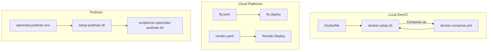
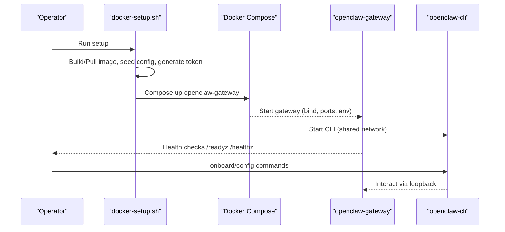
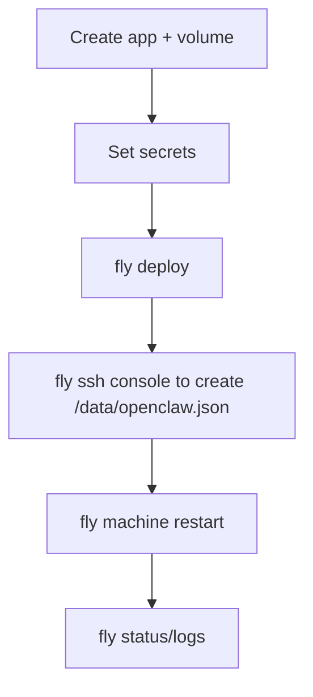
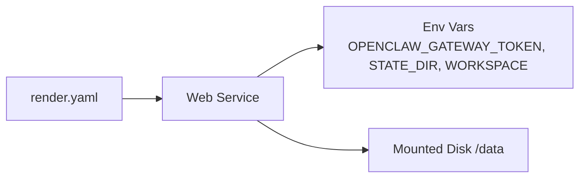
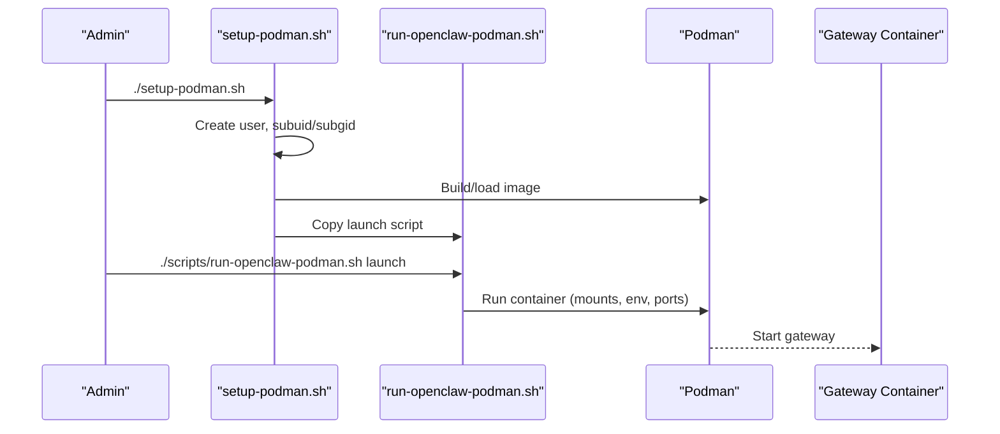
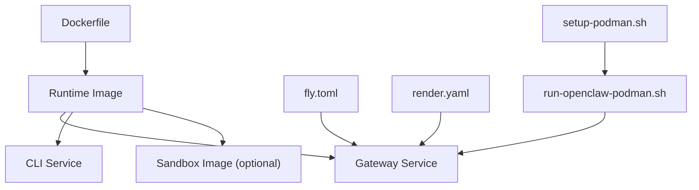

# Deployment Implementation Guides

<cite>
**Referenced Files in This Document**
- [Dockerfile](file://Dockerfile)
- [docker-compose.yml](file://docker-compose.yml)
- [docker-setup.sh](file://docker-setup.sh)
- [docs/install/docker.md](file://docs/install/docker.md)
- [docs/install/fly.md](file://docs/install/fly.md)
- [fly.toml](file://fly.toml)
- [render.yaml](file://render.yaml)
- [openclaw.podman.env](file://openclaw.podman.env)
- [setup-podman.sh](file://setup-podman.sh)
- [scripts/run-openclaw-podman.sh](file://scripts/run-openclaw-podman.sh)
- [scripts/e2e/onboard-docker.sh](file://scripts/e2e/onboard-docker.sh)
- [scripts/e2e/gateway-network-docker.sh](file://scripts/e2e/gateway-network-docker.sh)
</cite>

## Table of Contents
1. [Introduction](#introduction)
2. [Project Structure](#project-structure)
3. [Core Components](#core-components)
4. [Architecture Overview](#architecture-overview)
5. [Detailed Component Analysis](#detailed-component-analysis)
6. [Dependency Analysis](#dependency-analysis)
7. [Performance Considerations](#performance-considerations)
8. [Troubleshooting Guide](#troubleshooting-guide)
9. [Conclusion](#conclusion)
10. [Appendices](#appendices)

## Introduction
This document provides comprehensive deployment implementation guides for OpenClaw in containerized environments. It focuses on production-grade Docker and Docker Compose deployments, with optional integration into cloud platforms such as Fly.io and Render. The guide covers environment preparation, configuration management, security hardening, deployment validation, monitoring, maintenance, reverse proxy and SSL integration, load balancing, rollback procedures, backup strategies, and disaster recovery planning.

## Project Structure
OpenClaw’s containerized deployment assets are centered around:
- A multi-stage Dockerfile that builds a minimal runtime image
- A Docker Compose setup orchestrating the gateway and CLI services
- A comprehensive setup script automating image build, onboarding, sandbox configuration, and runtime
- Platform-specific deployment configurations for Fly.io and Render
- Podman-based deployment scripts for rootless and systemd integration



**Diagram sources**
- [Dockerfile](file://Dockerfile#L1-L231)
- [docker-compose.yml](file://docker-compose.yml#L1-L77)
- [docker-setup.sh](file://docker-setup.sh#L1-L598)
- [fly.toml](file://fly.toml#L1-L35)
- [render.yaml](file://render.yaml#L1-L22)
- [openclaw.podman.env](file://openclaw.podman.env#L1-L25)
- [setup-podman.sh](file://setup-podman.sh#L1-L313)
- [scripts/run-openclaw-podman.sh](file://scripts/run-openclaw-podman.sh#L1-L232)

**Section sources**
- [Dockerfile](file://Dockerfile#L1-L231)
- [docker-compose.yml](file://docker-compose.yml#L1-L77)
- [docker-setup.sh](file://docker-setup.sh#L1-L598)
- [fly.toml](file://fly.toml#L1-L35)
- [render.yaml](file://render.yaml#L1-L22)
- [openclaw.podman.env](file://openclaw.podman.env#L1-L25)
- [setup-podman.sh](file://setup-podman.sh#L1-L313)
- [scripts/run-openclaw-podman.sh](file://scripts/run-openclaw-podman.sh#L1-L232)

## Core Components
- Container image build and runtime:
  - Multi-stage build with pinned base image and non-root runtime user
  - Optional installation of system packages, Playwright browsers, and Docker CLI for sandboxing
- Docker Compose orchestration:
  - Gateway and CLI services with health checks, environment variables, and volume mounts
  - Optional sandbox socket mount and group add for Docker-in-Docker
- Automated setup script:
  - Builds or pulls the image, seeds configuration, generates tokens, runs onboarding, and starts services
  - Supports extra mounts, named volumes, sandbox prerequisites, and rollback safety
- Cloud platform configurations:
  - Fly.io: persistent volume, HTTPS enforcement, process command, and secrets
  - Render: health check path, environment variables, disk mount, and auto-start
- Podman deployment:
  - One-time host setup for rootless user, image build/load, and systemd Quadlet integration
  - Run script for container lifecycle, token generation, and SELinux mount options

**Section sources**
- [Dockerfile](file://Dockerfile#L1-L231)
- [docker-compose.yml](file://docker-compose.yml#L1-L77)
- [docker-setup.sh](file://docker-setup.sh#L1-L598)
- [fly.toml](file://fly.toml#L1-L35)
- [render.yaml](file://render.yaml#L1-L22)
- [openclaw.podman.env](file://openclaw.podman.env#L1-L25)
- [setup-podman.sh](file://setup-podman.sh#L1-L313)
- [scripts/run-openclaw-podman.sh](file://scripts/run-openclaw-podman.sh#L1-L232)

## Architecture Overview
The containerized deployment architecture integrates the gateway, CLI, optional sandbox, and platform-specific runtime layers.

```mermaid
graph TB
subgraph "Host"
HVol["Host Volumes<br/>Config + Workspace"]
HNet["Host Network<br/>Ports 18789/18790"]
end
subgraph "Docker Engine"
GW["openclaw-gateway<br/>Node runtime, HTTP/WS"]
CLI["openclaw-cli<br/>CLI container"]
SB["Sandbox Containers<br/>Docker-in-Docker (optional)"]
end
subgraph "Cloud Providers"
Fly["Fly.io VM<br/>Persistent /data"]
Ren["Render Web Service<br/>Env vars + Disk"]
end
subgraph "Podman"
PUser["openclaw user<br/>rootless Podman"]
PImg["Image Store<br/>Loaded by user"]
PCont["Container<br/>Gateway + CLI"]
end
HVol <- --> GW
HNet <- --> GW
GW <- --> CLI
GW <- --> SB
Fly --> GW
Ren --> GW
PUser --> PImg
PImg --> PCont
PCont --> GW
```

**Diagram sources**
- [docker-compose.yml](file://docker-compose.yml#L1-L77)
- [Dockerfile](file://Dockerfile#L211-L231)
- [fly.toml](file://fly.toml#L32-L35)
- [render.yaml](file://render.yaml#L18-L22)
- [setup-podman.sh](file://setup-podman.sh#L258-L277)
- [scripts/run-openclaw-podman.sh](file://scripts/run-openclaw-podman.sh#L215-L227)

## Detailed Component Analysis

### Docker and Docker Compose Deployment
- Build and runtime:
  - Multi-stage build with pinned base image and non-root user
  - Optional system packages, Playwright browsers, and Docker CLI for sandbox
- Compose services:
  - Gateway binds to loopback by default; override bind to “lan” for host access
  - Health checks probe /healthz and /readyz
  - CLI shares the gateway network and drops sensitive capabilities
- Setup script:
  - Validates mount paths, generates tokens, seeds config/workspace, and starts services
  - Supports sandbox prerequisites and rollback safety
- Validation:
  - E2E scripts demonstrate onboarding and gateway connectivity in Docker networks



**Diagram sources**
- [docker-setup.sh](file://docker-setup.sh#L413-L477)
- [docker-compose.yml](file://docker-compose.yml#L28-L77)
- [Dockerfile](file://Dockerfile#L224-L231)
- [scripts/e2e/onboard-docker.sh](file://scripts/e2e/onboard-docker.sh#L108-L152)

**Section sources**
- [Dockerfile](file://Dockerfile#L1-L231)
- [docker-compose.yml](file://docker-compose.yml#L1-L77)
- [docker-setup.sh](file://docker-setup.sh#L1-L598)
- [scripts/e2e/onboard-docker.sh](file://scripts/e2e/onboard-docker.sh#L1-L571)
- [scripts/e2e/gateway-network-docker.sh](file://scripts/e2e/gateway-network-docker.sh#L1-L146)

### Fly.io Deployment
- Configuration:
  - fly.toml defines app, build, env, processes, http_service, vm sizing, and mounts
  - Persistent state via /data volume
- Secrets:
  - OPENCLAW_GATEWAY_TOKEN and provider tokens stored as Fly secrets
- First-run and updates:
  - SSH console to create config, then restart machine
  - Redeploy to apply changes; logs/status for verification



**Diagram sources**
- [fly.toml](file://fly.toml#L1-L35)
- [docs/install/fly.md](file://docs/install/fly.md#L1-L491)

**Section sources**
- [fly.toml](file://fly.toml#L1-L35)
- [docs/install/fly.md](file://docs/install/fly.md#L1-L491)

### Render Deployment
- Configuration:
  - render.yaml defines web service, health check path, env vars, disk mount, and size
- Environment:
  - OPENCLAW_GATEWAY_TOKEN generated automatically; OPENCLAW_STATE_DIR and workspace mapped to mounted disk



**Diagram sources**
- [render.yaml](file://render.yaml#L1-L22)

**Section sources**
- [render.yaml](file://render.yaml#L1-L22)

### Podman Deployment
- One-time setup:
  - Creates non-login user, sets up subuid/subgid, builds image, loads into user store, copies launch script
  - Optional systemd Quadlet for user service
- Run script:
  - Generates token, seeds config, handles SELinux mount options, starts gateway and CLI
  - Supports user namespaces and optional Quadlet auto-start



**Diagram sources**
- [setup-podman.sh](file://setup-podman.sh#L193-L297)
- [scripts/run-openclaw-podman.sh](file://scripts/run-openclaw-podman.sh#L202-L227)

**Section sources**
- [openclaw.podman.env](file://openclaw.podman.env#L1-L25)
- [setup-podman.sh](file://setup-podman.sh#L1-L313)
- [scripts/run-openclaw-podman.sh](file://scripts/run-openclaw-podman.sh#L1-L232)

## Dependency Analysis
- Image build dependencies:
  - Node base image pinned by digest; optional system packages and Playwright browsers
- Runtime dependencies:
  - Gateway binds to loopback by default; override to “lan” for host access
  - CLI shares gateway network; sandbox requires Docker CLI and optional socket mount
- Platform dependencies:
  - Fly.io: persistent volume, secrets, and machine commands
  - Render: service configuration, env vars, and disk mount
  - Podman: rootless user, subuid/subgid, and optional systemd Quadlet



**Diagram sources**
- [Dockerfile](file://Dockerfile#L1-L231)
- [docker-compose.yml](file://docker-compose.yml#L1-L77)
- [fly.toml](file://fly.toml#L1-L35)
- [render.yaml](file://render.yaml#L1-L22)
- [setup-podman.sh](file://setup-podman.sh#L1-L313)
- [scripts/run-openclaw-podman.sh](file://scripts/run-openclaw-podman.sh#L1-L232)

**Section sources**
- [Dockerfile](file://Dockerfile#L1-L231)
- [docker-compose.yml](file://docker-compose.yml#L1-L77)
- [fly.toml](file://fly.toml#L1-L35)
- [render.yaml](file://render.yaml#L1-L22)
- [setup-podman.sh](file://setup-podman.sh#L1-L313)
- [scripts/run-openclaw-podman.sh](file://scripts/run-openclaw-podman.sh#L1-L232)

## Performance Considerations
- Memory sizing:
  - Fly.io recommends at least 2GB RAM; adjust vm.memory accordingly
- Build caching:
  - Order Dockerfile layers to cache dependencies and reduce rebuild time
- Browser and tooling:
  - Pre-install Playwright browsers and persist caches to minimize startup overhead
- Concurrency and limits:
  - Configure ulimits, memory, CPUs, and pids limits for sandbox containers

[No sources needed since this section provides general guidance]

## Troubleshooting Guide
- Gateway not reachable:
  - Ensure bind is “lan” and ports are published; verify host firewall and Docker bridge networking
- Permission errors on config/workspace:
  - Ensure host directories are owned by uid 1000 or fix ownership via a root container step
- Sandbox prerequisites:
  - Confirm Docker CLI is present in the image; verify docker.sock mount and group_add when enabled
- Fly.io issues:
  - Verify internal_port matches gateway port, memory is sufficient, and state dir is mounted to /data
- Render issues:
  - Confirm health check path, env vars, and disk mount are correctly configured
- Podman SELinux:
  - Use SELinux mount options when required; ensure subuid/subgid are configured

**Section sources**
- [docs/install/docker.md](file://docs/install/docker.md#L392-L404)
- [docker-setup.sh](file://docker-setup.sh#L430-L444)
- [docs/install/fly.md](file://docs/install/fly.md#L245-L291)
- [render.yaml](file://render.yaml#L6-L22)
- [scripts/run-openclaw-podman.sh](file://scripts/run-openclaw-podman.sh#L186-L200)

## Conclusion
OpenClaw provides robust, production-ready containerized deployment assets across Docker, cloud platforms, and Podman. By leveraging the provided Dockerfile, Compose setup, and platform configurations, operators can achieve secure, scalable, and maintainable deployments with integrated health checks, sandboxing, and operational tooling.

[No sources needed since this section summarizes without analyzing specific files]

## Appendices

### Step-by-Step Production Deployment (Docker Compose)
- Prepare environment:
  - Export required environment variables (OPENCLAW_GATEWAY_TOKEN, provider tokens)
  - Set OPENCLAW_GATEWAY_BIND to “lan” for host access
- Build or pull image:
  - Use docker-setup.sh to build or pull the image
- Start services:
  - Compose up openclaw-gateway; CLI is available via the same service network
- Validate:
  - Use /readyz and /healthz endpoints; run onboard-docker.sh for E2E validation

**Section sources**
- [docker-setup.sh](file://docker-setup.sh#L413-L477)
- [docker-compose.yml](file://docker-compose.yml#L28-L77)
- [scripts/e2e/onboard-docker.sh](file://scripts/e2e/onboard-docker.sh#L1-L571)

### Security Hardening Procedures
- Non-root runtime:
  - Image runs as non-root user; ensure bind is “lan” with OPENCLAW_GATEWAY_TOKEN when exposing externally
- Capability drops and no-new-privileges:
  - CLI container drops NET_RAW/NET_ADMIN and enables no-new-privileges
- Sandbox isolation:
  - Use Docker-in-Docker with restricted network and user namespaces; configure pids/memory limits
- Secrets management:
  - Prefer environment variables over config files for tokens and API keys

**Section sources**
- [Dockerfile](file://Dockerfile#L211-L214)
- [docker-compose.yml](file://docker-compose.yml#L54-L58)
- [docs/install/docker.md](file://docs/install/docker.md#L59-L78)

### Monitoring and Maintenance
- Health checks:
  - Use /readyz and /healthz; integrate with Docker Compose restart policies
- Logs:
  - Tail container logs; use fly logs or Render logs for platform deployments
- Maintenance:
  - Rotate OPENCLAW_GATEWAY_TOKEN periodically; update images and redeploy

**Section sources**
- [Dockerfile](file://Dockerfile#L224-L229)
- [docs/install/docker.md](file://docs/install/docker.md#L469-L495)

### Reverse Proxies, SSL Termination, and Load Balancing
- Reverse proxy:
  - Place a reverse proxy in front of the gateway; terminate TLS at the proxy
- Bind and port:
  - Keep gateway bound to “lan”; publish internal port to the proxy
- Load balancing:
  - Use platform load balancers or external LB; ensure sticky sessions if required by channels

[No sources needed since this section provides general guidance]

### Rollback Procedures, Backup Strategies, and Disaster Recovery
- Rollback:
  - Use docker-setup.sh to reset sandbox overlays and configuration safely
  - For Fly.io, revert machine command and redeploy previous image
- Backups:
  - Persist state to /data (Fly) or mounted disk (Render); snapshot volumes regularly
- Disaster recovery:
  - Recreate gateway from persisted state; re-provision secrets and re-run onboarding if needed

**Section sources**
- [docker-setup.sh](file://docker-setup.sh#L563-L586)
- [fly.toml](file://fly.toml#L32-L35)
- [render.yaml](file://render.yaml#L18-L22)