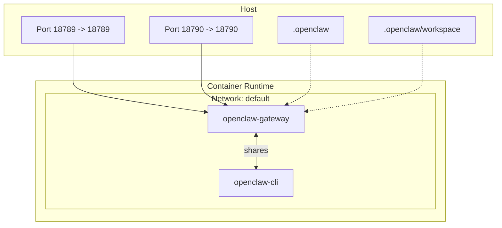
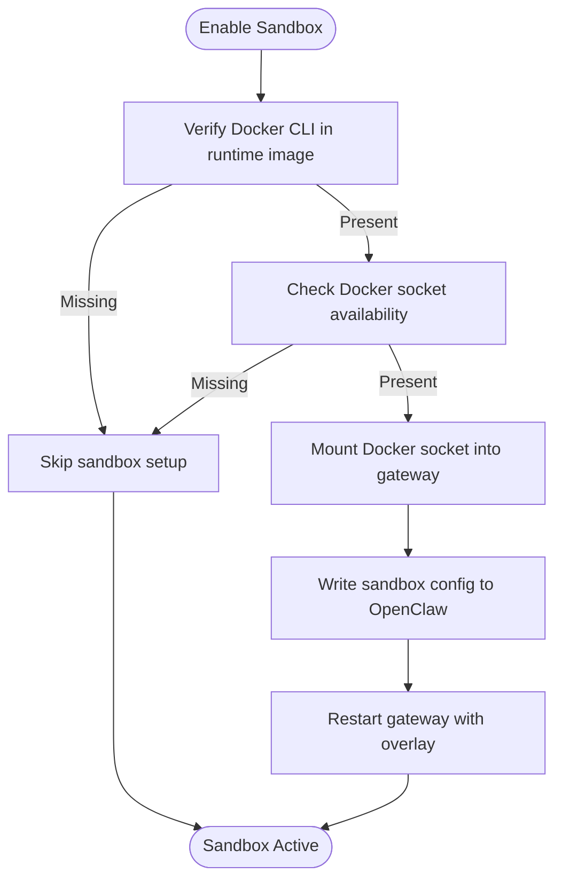
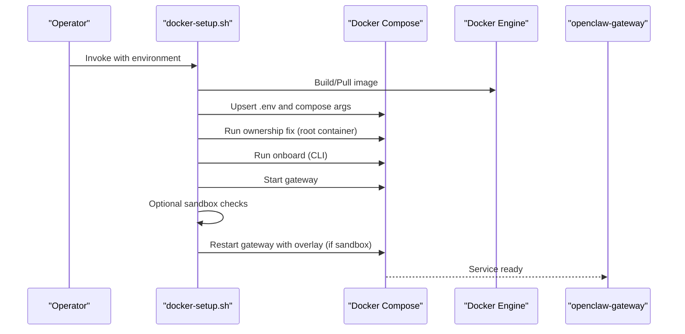
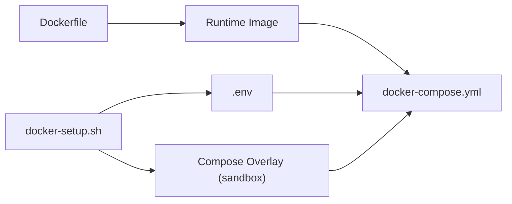

# Docker Compose Orchestration

<cite>
**Referenced Files in This Document**
- [docker-compose.yml](file://docker-compose.yml)
- [Dockerfile](file://Dockerfile)
- [.dockerignore](file://.dockerignore)
- [docker-setup.sh](file://docker-setup.sh)
- [openclaw.podman.env](file://openclaw.podman.env)
- [Dockerfile.sandbox](file://Dockerfile.sandbox)
- [Dockerfile.sandbox-browser](file://Dockerfile.sandbox-browser)
- [Dockerfile.sandbox-common](file://Dockerfile.sandbox-common)
- [scripts/docker/install-sh-smoke/Dockerfile](file://scripts/docker/install-sh-smoke/Dockerfile)
- [scripts/e2e/Dockerfile](file://scripts/e2e/Dockerfile)
</cite>

## Table of Contents
1. [Introduction](#introduction)
2. [Project Structure](#project-structure)
3. [Core Components](#core-components)
4. [Architecture Overview](#architecture-overview)
5. [Detailed Component Analysis](#detailed-component-analysis)
6. [Dependency Analysis](#dependency-analysis)
7. [Performance Considerations](#performance-considerations)
8. [Troubleshooting Guide](#troubleshooting-guide)
9. [Conclusion](#conclusion)
10. [Appendices](#appendices)

## Introduction
This document explains how to deploy OpenClaw using Docker Compose. It covers service definitions, network configuration, volume mounting strategies, health checks, service dependencies, inter-container communication, and operational workflows for development, staging, and production. It also includes guidance on security hardening, sandboxing, scaling, resource limits, and monitoring.

## Project Structure
OpenClaw’s containerized deployment centers around a single Compose file that defines two primary services:
- openclaw-gateway: the main server process exposing HTTP APIs and bridging protocols.
- openclaw-cli: a companion container sharing the gateway’s network namespace for administrative tasks and interactive shells.

Key supporting materials:
- Container image build configuration and runtime hardening are defined in the Dockerfile.
- A robust setup script automates environment preparation, optional sandbox activation, and initial onboarding.
- Optional sandbox images support isolated agent execution and optionally headless browser environments.

```mermaid
graph TB
subgraph "Host"
H1["Host Ports<br/>18789/tcp, 18790/tcp"]
H2["Volumes<br/>.openclaw<br/>.openclaw/workspace"]
end
subgraph "Docker Network"
GW["openclaw-gateway<br/>Service"]
CLI["openclaw-cli<br/>Service"]
end
H1 --> GW
H2 --> GW
GW <- --> CLI
```

**Diagram sources**
- [docker-compose.yml](file://docker-compose.yml#L1-L77)
- [Dockerfile](file://Dockerfile#L216-L230)

**Section sources**
- [docker-compose.yml](file://docker-compose.yml#L1-L77)
- [Dockerfile](file://Dockerfile#L1-L231)
- [.dockerignore](file://.dockerignore#L1-L65)

## Core Components
- openclaw-gateway
  - Image: resolved from an environment variable with a default fallback.
  - Ports: publishes gateway and bridge ports to the host.
  - Volumes: mounts configuration and workspace directories from the host.
  - Health check: probes the internal health endpoint.
  - Command: starts the gateway with configurable bind behavior.
  - Environment: carries tokens and provider credentials.
- openclaw-cli
  - Shares the gateway’s network namespace for local IPC.
  - Depends on the gateway service.
  - Inherits environment variables for authentication and provider access.
  - Interactive TTY and stdin for shell-like usage.

Operational highlights:
- The gateway runs a non-root user by default and exposes health/readiness endpoints suitable for container health checks.
- The CLI container is constrained with capability drops and security options to reduce attack surface.

**Section sources**
- [docker-compose.yml](file://docker-compose.yml#L2-L77)
- [Dockerfile](file://Dockerfile#L211-L230)

## Architecture Overview
The deployment model is a two-service stack:
- The gateway service binds internally and exposes ports to the host.
- The CLI service runs alongside the gateway in the same network namespace, enabling direct access to the gateway process without external network hops.
- Optional sandboxing can mount the Docker socket into the gateway for agent-level container isolation.



**Diagram sources**
- [docker-compose.yml](file://docker-compose.yml#L2-L77)

## Detailed Component Analysis

### Service: openclaw-gateway
- Image selection and environment
  - Uses an environment-driven image name with a sensible default.
  - Passes environment variables for tokens and provider credentials.
- Ports
  - Publishes gateway and bridge ports to the host.
- Volumes
  - Mounts configuration and workspace directories from the host.
  - Includes commented guidance for enabling sandbox isolation by mounting the Docker socket.
- Init and restart policy
  - Uses an init process and restart policy suited for long-running services.
- Command and bind behavior
  - Starts the gateway with a configurable bind target and fixed internal port.
  - The Dockerfile documents that overriding the bind to “lan” is required for external access and recommends setting authentication.
- Health check
  - Probes the internal health endpoint at a fixed port with tuned intervals and retries.

Security and runtime
- The runtime image runs as a non-root user.
- The Dockerfile includes a HEALTHCHECK compatible with container orchestrators.

**Section sources**
- [docker-compose.yml](file://docker-compose.yml#L2-L49)
- [Dockerfile](file://Dockerfile#L216-L230)

### Service: openclaw-cli
- Network and dependencies
  - Shares the gateway’s network namespace and declares a dependency on the gateway.
- Constraints
  - Drops sensitive capabilities and applies no-new-privileges for defense-in-depth.
- Environment and volumes
  - Mirrors the gateway’s environment for tokens and provider credentials.
  - Shares the same configuration and workspace mounts.
- Interactive shell
  - Enables TTY and stdin for interactive use.

**Section sources**
- [docker-compose.yml](file://docker-compose.yml#L51-L77)

### Sandbox Isolation (Optional)
Sandboxing allows agents to execute in isolated containers. The setup supports:
- Building a minimal sandbox base image and optionally a browser-enabled variant.
- Installing Docker CLI into the runtime image to manage sandbox containers.
- Conditionally mounting the Docker socket into the gateway when sandbox prerequisites are met.



**Diagram sources**
- [docker-setup.sh](file://docker-setup.sh#L497-L534)
- [Dockerfile.sandbox](file://Dockerfile.sandbox#L1-L24)
- [Dockerfile.sandbox-browser](file://Dockerfile.sandbox-browser#L1-L35)

**Section sources**
- [docker-setup.sh](file://docker-setup.sh#L479-L586)
- [Dockerfile.sandbox](file://Dockerfile.sandbox#L1-L24)
- [Dockerfile.sandbox-browser](file://Dockerfile.sandbox-browser#L1-L35)
- [Dockerfile.sandbox-common](file://Dockerfile.sandbox-common#L1-L48)

### Deployment Workflow
The recommended workflow uses the setup script to:
- Validate and normalize environment variables.
- Optionally build or pull the runtime image.
- Prepare host directories and fix ownership for the container user.
- Run onboarding and pin gateway mode and bind behavior.
- Optionally enable sandboxing by mounting the Docker socket and writing sandbox configuration.
- Start the gateway service.



**Diagram sources**
- [docker-setup.sh](file://docker-setup.sh#L413-L477)
- [docker-compose.yml](file://docker-compose.yml#L1-L77)

**Section sources**
- [docker-setup.sh](file://docker-setup.sh#L1-L598)
- [docker-compose.yml](file://docker-compose.yml#L1-L77)

### Volume Mounting Strategies
- Configuration directory
  - Mounted to the user’s home directory inside the container to persist settings and identity.
- Workspace directory
  - Mounted to the workspace path to persist agent workspaces and logs.
- Named volumes vs bind mounts
  - The setup supports either named volumes or host bind mounts for the home directory.
  - Validation ensures safe mount specifications and prevents unsafe characters or whitespace.

Security and hygiene
- The setup script runs a temporary root container to fix ownership of mounted directories, avoiding cross-mount chowns and preserving user project files.

**Section sources**
- [docker-compose.yml](file://docker-compose.yml#L12-L22)
- [docker-setup.sh](file://docker-setup.sh#L152-L204)
- [docker-setup.sh](file://docker-setup.sh#L430-L444)

### Health Checks and Readiness
- Internal endpoints
  - The gateway exposes health and readiness endpoints suitable for container health checks.
- Compose healthcheck
  - The gateway service probes the health endpoint at a fixed internal port with tuned timing.
- Manual verification
  - The CLI service can be used to query health externally using the configured token.

**Section sources**
- [Dockerfile](file://Dockerfile#L224-L229)
- [docker-compose.yml](file://docker-compose.yml#L38-L49)
- [docker-setup.sh](file://docker-setup.sh#L595-L598)

### Inter-Service Communication
- Network model
  - The CLI container shares the gateway’s network namespace, enabling direct localhost access to the gateway process.
- Dependencies
  - The CLI depends on the gateway service, ensuring startup ordering.

**Section sources**
- [docker-compose.yml](file://docker-compose.yml#L53-L77)

### Environment and Secrets Management
- Token provisioning
  - The setup script detects existing tokens in configuration or environment files, or generates a secure token if none is present.
- Provider credentials
  - Optional environment variables for provider sessions and cookies are passed through to both services.
- Podman environment
  - A separate environment file demonstrates equivalent settings for Podman-based deployments.

**Section sources**
- [docker-setup.sh](file://docker-setup.sh#L235-L256)
- [openclaw.podman.env](file://openclaw.podman.env#L1-L25)
- [docker-compose.yml](file://docker-compose.yml#L4-L12)

## Dependency Analysis
- Image build and runtime
  - The Dockerfile defines a multi-stage build and a hardened runtime image with non-root execution and optional system packages.
- Compose and script integration
  - The setup script composes arguments for Compose, writes overlays for sandbox, and manages environment files.
- Sandbox prerequisites
  - Enabling sandbox requires Docker CLI in the runtime image and access to the Docker socket on the host.



**Diagram sources**
- [Dockerfile](file://Dockerfile#L1-L231)
- [docker-setup.sh](file://docker-setup.sh#L258-L351)
- [docker-compose.yml](file://docker-compose.yml#L1-L77)

**Section sources**
- [Dockerfile](file://Dockerfile#L1-L231)
- [docker-setup.sh](file://docker-setup.sh#L317-L323)
- [docker-compose.yml](file://docker-compose.yml#L1-L77)

## Performance Considerations
- Image variants
  - Choose the slim variant for reduced footprint when unnecessary packages are not required.
- Browser automation
  - Pre-installing a browser and Playwright assets can reduce cold-start costs for UI-dependent skills.
- Resource limits
  - Configure CPU and memory limits in Compose to prevent noisy-neighbor effects in shared hosts.
- Storage I/O
  - Persist configuration and workspace on SSD-backed storage for improved responsiveness.
- Scaling
  - Scale out horizontally by running multiple gateway instances behind a load balancer and coordinating shared storage for configuration and workspace.

[No sources needed since this section provides general guidance]

## Troubleshooting Guide
- Gateway not reachable from host
  - If the gateway binds to loopback, external access requires overriding the bind to “lan” and setting authentication.
- Permission denied on mounted directories
  - The setup script fixes ownership automatically; re-run the ownership step if directories were created by a different user.
- Sandbox not working
  - Ensure Docker CLI is present in the runtime image and the Docker socket is accessible with the correct group ID.
- Health checks failing
  - Probe the internal health endpoint or use the CLI to verify status with the configured token.

**Section sources**
- [Dockerfile](file://Dockerfile#L219-L227)
- [docker-setup.sh](file://docker-setup.sh#L430-L444)
- [docker-setup.sh](file://docker-setup.sh#L497-L506)
- [docker-setup.sh](file://docker-setup.sh#L595-L598)

## Conclusion
OpenClaw’s Docker Compose deployment provides a secure, modular foundation for local and containerized operations. By leveraging the provided Compose file, setup script, and sandbox images, operators can tailor environments for development, staging, and production while maintaining strong security posture and operational reliability.

[No sources needed since this section summarizes without analyzing specific files]

## Appendices

### Environment Variables Reference
- OPENCLAW_IMAGE: Image name for the runtime; defaults to a local tag.
- OPENCLAW_GATEWAY_TOKEN: Authentication token for the gateway.
- OPENCLAW_GATEWAY_BIND: Bind behavior for the gateway (e.g., “lan”).
- OPENCLAW_GATEWAY_PORT, OPENCLAW_BRIDGE_PORT: Host port mappings.
- OPENCLAW_CONFIG_DIR, OPENCLAW_WORKSPACE_DIR: Paths for persistent data.
- OPENCLAW_EXTRA_MOUNTS: Comma-separated mount specs appended to both services.
- OPENCLAW_HOME_VOLUME: Optional named or path volume for the home directory.
- OPENCLAW_SANDBOX: Enable sandboxing (requires Docker CLI in image and socket access).
- OPENCLAW_DOCKER_SOCKET: Path to the Docker socket for sandbox.
- OPENCLAW_ALLOW_INSECURE_PRIVATE_WS: Allow insecure private WebSocket connections.
- Provider credentials: Session keys and cookies for supported providers.

**Section sources**
- [docker-compose.yml](file://docker-compose.yml#L3-L12)
- [docker-setup.sh](file://docker-setup.sh#L187-L226)
- [openclaw.podman.env](file://openclaw.podman.env#L6-L24)

### Example Deployments

- Development
  - Use the local image tag and default bind behavior.
  - Mount configuration and workspace directories to persist state.
  - Optionally enable sandbox if agent isolation is required.
- Staging
  - Pin a specific image digest for reproducibility.
  - Set explicit bind and ports; enable authentication.
  - Add resource limits and restart policies appropriate for staging.
- Production
  - Use a slim runtime image and minimal system packages.
  - Mount Docker socket for sandbox only if required; otherwise disable.
  - Configure health checks, resource caps, and monitoring.
  - Store secrets via environment files or secret managers and avoid embedding tokens in Compose files.

[No sources needed since this section provides general guidance]

### Monitoring and Observability
- Logs
  - Tail service logs using Compose to monitor startup and runtime events.
- Health and metrics
  - Use the built-in health endpoints for liveness and readiness.
  - Integrate with external monitoring systems to track uptime and latency.
- Tracing
  - Consider enabling tracing plugins where applicable to gain insights into agent workflows.

**Section sources**
- [docker-setup.sh](file://docker-setup.sh#L595-L598)
- [Dockerfile](file://Dockerfile#L224-L229)

### Additional Build and Test Images
- Install smoke test image
  - Minimal image with essential tools for installation verification.
- E2E test image
  - Full-source image for end-to-end tests, built with non-root user.

**Section sources**
- [scripts/docker/install-sh-smoke/Dockerfile](file://scripts/docker/install-sh-smoke/Dockerfile#L1-L29)
- [scripts/e2e/Dockerfile](file://scripts/e2e/Dockerfile#L1-L39)