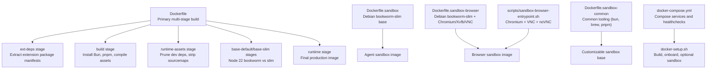
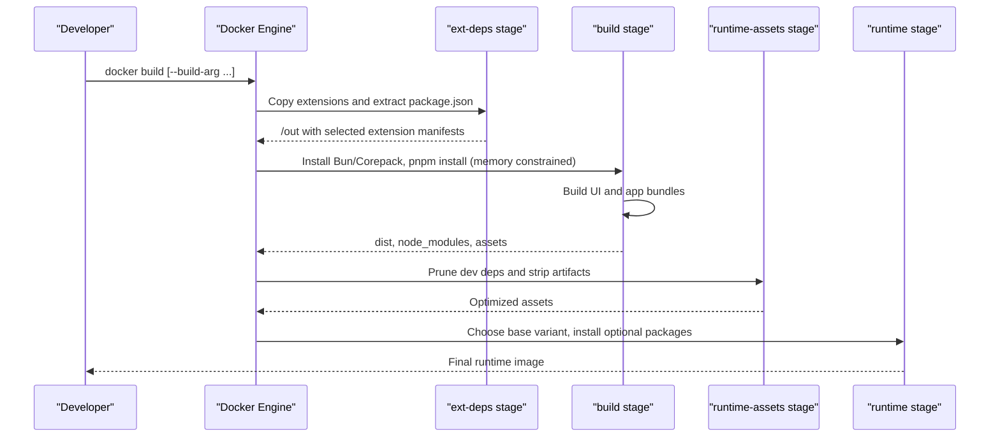
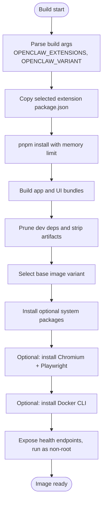
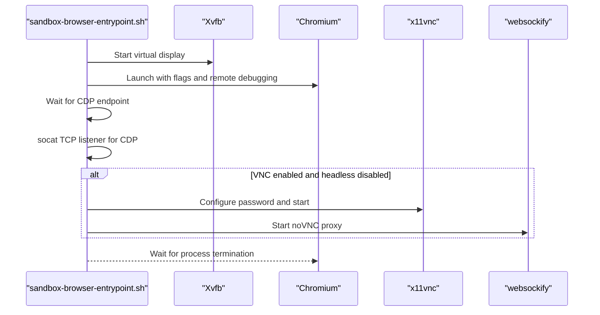
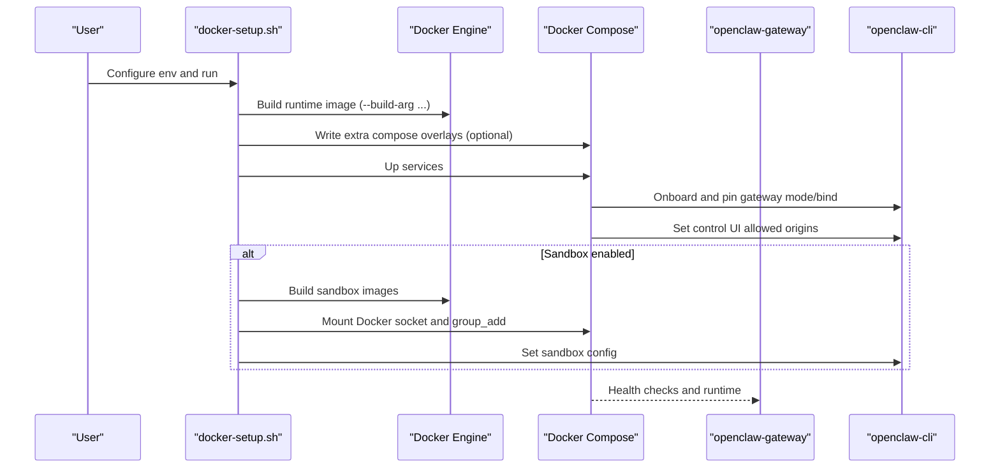
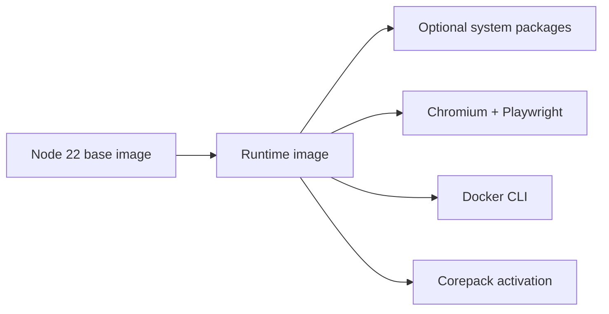

# Docker Images & Build Process

<cite>
**Referenced Files in This Document**
- [Dockerfile](file://Dockerfile)
- [Dockerfile.sandbox](file://Dockerfile.sandbox)
- [Dockerfile.sandbox-browser](file://Dockerfile.sandbox-browser)
- [Dockerfile.sandbox-common](file://Dockerfile.sandbox-common)
- [.dockerignore](file://.dockerignore)
- [docker-compose.yml](file://docker-compose.yml)
- [docker-setup.sh](file://docker-setup.sh)
- [scripts/sandbox-browser-entrypoint.sh](file://scripts/sandbox-browser-entrypoint.sh)
- [scripts/sandbox-setup.sh](file://scripts/sandbox-setup.sh)
- [scripts/sandbox-common-setup.sh](file://scripts/sandbox-common-setup.sh)
- [openclaw.podman.env](file://openclaw.podman.env)
- [scripts/podman/openclaw.container.in](file://scripts/podman/openclaw.container.in)
- [package.json](file://package.json)
</cite>

## Table of Contents
1. [Introduction](#introduction)
2. [Project Structure](#project-structure)
3. [Core Components](#core-components)
4. [Architecture Overview](#architecture-overview)
5. [Detailed Component Analysis](#detailed-component-analysis)
6. [Dependency Analysis](#dependency-analysis)
7. [Performance Considerations](#performance-considerations)
8. [Troubleshooting Guide](#troubleshooting-guide)
9. [Conclusion](#conclusion)
10. [Appendices](#appendices)

## Introduction
This document explains how OpenClaw builds and runs its Docker images, focusing on the multi-stage Docker build process, extension opt-in system, asset compilation, runtime optimization, and sandbox variants for browser automation and containerized agent execution. It covers default versus slim base images, build arguments for customization, environment variable configuration, and practical steps to reduce image size and build times.

## Project Structure
The Docker system comprises:
- A primary multi-stage Dockerfile for the gateway/runtime image
- Sandbox images for isolated execution and browser automation
- A Docker Compose setup and a helper script to orchestrate builds and runtime configuration
- Podman support via a template and environment file

**Diagram sources**
- [Dockerfile](file://Dockerfile#L1-L231)
- [Dockerfile.sandbox](file://Dockerfile.sandbox#L1-L24)
- [Dockerfile.sandbox-browser](file://Dockerfile.sandbox-browser#L1-L35)
- [Dockerfile.sandbox-common](file://Dockerfile.sandbox-common#L1-L48)
- [docker-compose.yml](file://docker-compose.yml#L1-L77)
- [docker-setup.sh](file://docker-setup.sh#L1-L598)
- [scripts/sandbox-browser-entrypoint.sh](file://scripts/sandbox-browser-entrypoint.sh#L1-L128)

**Section sources**
- [Dockerfile](file://Dockerfile#L1-L231)
- [Dockerfile.sandbox](file://Dockerfile.sandbox#L1-L24)
- [Dockerfile.sandbox-browser](file://Dockerfile.sandbox-browser#L1-L35)
- [Dockerfile.sandbox-common](file://Dockerfile.sandbox-common#L1-L48)
- [docker-compose.yml](file://docker-compose.yml#L1-L77)
- [docker-setup.sh](file://docker-setup.sh#L1-L598)

## Core Components
- Multi-stage build with extension dependency extraction to keep rebuilds efficient
- Runtime pruning and asset stripping to minimize image size
- Optional browser automation stack and Docker CLI for sandboxing
- Compose-driven orchestration and a helper script for streamlined setup

Key build arguments and environment variables:
- OPENCLAW_EXTENSIONS: Space-separated extension directory names to opt-in
- OPENCLAW_VARIANT: default or slim
- OPENCLAW_DOCKER_APT_PACKAGES: Additional system packages to install
- OPENCLAW_INSTALL_BROWSER: Pre-install Chromium and Playwright assets
- OPENCLAW_INSTALL_DOCKER_CLI: Install Docker CLI for sandbox container management
- OPENCLAW_NODE_BOOKWORM_IMAGE and OPENCLAW_NODE_BOOKWORM_SLIM_IMAGE: Pinned base images with digests

Runtime environment variables for the gateway:
- OPENCLAW_GATEWAY_TOKEN, OPENCLAW_GATEWAY_BIND, OPENCLAW_GATEWAY_PORT, OPENCLAW_BRIDGE_PORT
- Provider tokens and environment-specific variables as needed

**Section sources**
- [Dockerfile](file://Dockerfile#L15-L25)
- [Dockerfile](file://Dockerfile#L148-L203)
- [docker-compose.yml](file://docker-compose.yml#L4-L12)
- [openclaw.podman.env](file://openclaw.podman.env#L6-L24)

## Architecture Overview
The build pipeline separates concerns across stages:
- ext-deps: Copies only extension package manifests for dependency resolution
- build: Installs Bun, enables Corepack, installs dependencies with a memory limit, compiles UI and application bundles
- runtime-assets: Prunes dev dependencies and removes TypeScript/webpack artifacts
- runtime: Chooses base image variant, installs optional system packages, optionally installs browser tooling and Docker CLI, exposes health endpoints, and runs the gateway as a non-root user

**Diagram sources**
- [Dockerfile](file://Dockerfile#L27-L91)
- [Dockerfile](file://Dockerfile#L103-L231)

**Section sources**
- [Dockerfile](file://Dockerfile#L27-L91)
- [Dockerfile](file://Dockerfile#L103-L231)

## Detailed Component Analysis

### Multi-Stage Build and Extension Opt-In
- The ext-deps stage copies the selected extensions’ package.json files into a temporary output directory. This allows pnpm to resolve only the opted-in dependencies, avoiding unnecessary rebuilds when unrelated extensions change.
- The build stage installs Bun, enables Corepack, and performs dependency installation with a memory constraint to prevent out-of-memory failures on small hosts.
- Asset compilation includes bundling the Canvas A2UI with a fallback mechanism for cross-architecture compatibility and UI build using pnpm.
- The runtime-assets stage prunes dev dependencies and removes TypeScript declaration and source map files to reduce size.

**Diagram sources**
- [Dockerfile](file://Dockerfile#L15-L25)
- [Dockerfile](file://Dockerfile#L27-L91)
- [Dockerfile](file://Dockerfile#L148-L203)

**Section sources**
- [Dockerfile](file://Dockerfile#L27-L91)
- [Dockerfile](file://Dockerfile#L148-L203)

### Default vs Slim Base Images
- The runtime stage selects either the default Debian Bookworm base or the slim variant using the OPENCLAW_VARIANT argument.
- The slim base omits certain system utilities present in the full base; the runtime stage conditionally installs them to maintain feature parity.
- Base images are pinned to SHA256 digests for reproducibility.

**Section sources**
- [Dockerfile](file://Dockerfile#L12-L25)
- [Dockerfile](file://Dockerfile#L92-L101)
- [Dockerfile](file://Dockerfile#L120-L127)

### Browser Automation Sandbox Image
- The browser sandbox image extends the slim base and adds Chromium, Xvfb, and VNC/novnc tooling.
- An entrypoint script configures headless/headful mode, remote debugging port, VNC/novnc, and optional sandbox flags.
- Ports exposed include the Chrome DevTools Protocol port, VNC, and noVNC.

**Diagram sources**
- [Dockerfile.sandbox-browser](file://Dockerfile.sandbox-browser#L1-L35)
- [scripts/sandbox-browser-entrypoint.sh](file://scripts/sandbox-browser-entrypoint.sh#L1-L128)

**Section sources**
- [Dockerfile.sandbox-browser](file://Dockerfile.sandbox-browser#L1-L35)
- [scripts/sandbox-browser-entrypoint.sh](file://scripts/sandbox-browser-entrypoint.sh#L19-L128)

### Sandbox Image Variants and Tooling
- The common sandbox image builds upon the basic sandbox image and installs additional tooling (bun, Homebrew/Linuxbrew, pnpm) controlled by build arguments.
- The helper scripts automate building the base sandbox image and the common sandbox image with customizable packages and user.

**Section sources**
- [Dockerfile.sandbox-common](file://Dockerfile.sandbox-common#L1-L48)
- [scripts/sandbox-setup.sh](file://scripts/sandbox-setup.sh#L1-L8)
- [scripts/sandbox-common-setup.sh](file://scripts/sandbox-common-setup.sh#L1-L55)

### Orchestration with Docker Compose and Setup Script
- docker-compose defines the gateway and CLI services, environment variables, health checks, and optional sandbox socket mounting.
- docker-setup.sh orchestrates building the runtime image, onboarding, setting gateway mode/bind, configuring allowed origins, and optionally enabling sandbox by mounting the Docker socket and applying sandbox policies.

**Diagram sources**
- [docker-compose.yml](file://docker-compose.yml#L1-L77)
- [docker-setup.sh](file://docker-setup.sh#L413-L598)

**Section sources**
- [docker-compose.yml](file://docker-compose.yml#L1-L77)
- [docker-setup.sh](file://docker-setup.sh#L413-L598)

### Podman Support
- A Podman Quadlet template defines a rootless unit with environment file, volumes, and published ports.
- An environment file documents required and optional variables for Podman runs.

**Section sources**
- [scripts/podman/openclaw.container.in](file://scripts/podman/openclaw.container.in#L1-L29)
- [openclaw.podman.env](file://openclaw.podman.env#L1-L25)

## Dependency Analysis
- The runtime image depends on the Node.js 22 base image (either full or slim) and installs optional system packages as requested.
- Optional installations include Chromium and Playwright for browser automation and Docker CLI for sandbox container management.
- The build leverages pnpm and Corepack; the runtime retains Corepack activation for local workflows.

**Diagram sources**
- [Dockerfile](file://Dockerfile#L92-L203)

**Section sources**
- [Dockerfile](file://Dockerfile#L92-L203)

## Performance Considerations
- Memory-constrained dependency installation: The build sets a Node heap size limit to reduce OOM risks on low-memory hosts.
- Build cache optimization: Uses Docker/pnpm caches for apt and pnpm stores to speed up rebuilds.
- Asset pruning: Strips dev dependencies and sourcemaps in the runtime-assets stage to reduce image size.
- Cross-architecture bundling: Includes a fallback for Canvas A2UI bundling to avoid failures under emulation.
- Optional preinstallation: Installing Chromium and Playwright at build time avoids cold-start delays in containers.

Recommendations:
- Pin base image digests and update them intentionally when upstream tags change.
- Limit OPENCLAW_EXTENSIONS to only those needed for your deployment to reduce dependency resolution overhead.
- Prefer the slim base when you can supply optional packages via OPENCLAW_DOCKER_APT_PACKAGES.
- Use buildx caching for multi-platform builds when appropriate.

**Section sources**
- [Dockerfile](file://Dockerfile#L56-L59)
- [Dockerfile](file://Dockerfile#L88-L91)
- [Dockerfile](file://Dockerfile#L72-L84)
- [Dockerfile](file://Dockerfile#L148-L203)

## Troubleshooting Guide
- Gateway not reachable from host:
  - The gateway binds to loopback by default. Override bind to “lan” and set authentication when exposing externally.
- Sandbox not working:
  - Ensure Docker CLI is installed in the runtime image by building with the Docker CLI argument.
  - Confirm the Docker socket is mounted and the container’s group has access to the socket.
- Browser sandbox issues:
  - Verify the entrypoint script is executable and that the required packages are installed.
  - Check port availability for CDP, VNC, and noVNC.
- Health checks failing:
  - Confirm the health endpoints are reachable and the gateway is running with the expected bind/port.

**Section sources**
- [Dockerfile](file://Dockerfile#L216-L230)
- [docker-setup.sh](file://docker-setup.sh#L497-L534)
- [scripts/sandbox-browser-entrypoint.sh](file://scripts/sandbox-browser-entrypoint.sh#L19-L128)
- [docker-compose.yml](file://docker-compose.yml#L38-L49)

## Conclusion
OpenClaw’s Docker system balances flexibility and efficiency through a multi-stage build, extension opt-in, and runtime pruning. The default and slim base variants accommodate diverse environments, while optional browser automation and Docker CLI support enable advanced use cases like sandboxed agent execution. The provided scripts and Compose configuration streamline setup, while environment variables and build arguments offer fine-grained control.

## Appendices

### Step-by-Step Build Instructions
- Build the default runtime image:
  - docker build -t openclaw:local .
- Build the slim runtime image:
  - docker build --build-arg OPENCLAW_VARIANT=slim -t openclaw:local .
- Add optional packages:
  - docker build --build-arg OPENCLAW_DOCKER_APT_PACKAGES="python3 wget" -t openclaw:local .
- Install browser automation:
  - docker build --build-arg OPENCLAW_INSTALL_BROWSER=1 -t openclaw:local .
- Install Docker CLI for sandbox:
  - docker build --build-arg OPENCLAW_INSTALL_DOCKER_CLI=1 -t openclaw:local .
- Select extensions:
  - docker build --build-arg OPENCLAW_EXTENSIONS="diagnostics-otel matrix" -t openclaw:local .

### Environment Variable Configuration
- Gateway runtime:
  - OPENCLAW_GATEWAY_TOKEN, OPENCLAW_GATEWAY_BIND, OPENCLAW_GATEWAY_PORT, OPENCLAW_BRIDGE_PORT
- Provider tokens:
  - CLAUDE_AI_SESSION_KEY, CLAUDE_WEB_SESSION_KEY, CLAUDE_WEB_COOKIE
- Optional:
  - OPENCLAW_ALLOW_INSECURE_PRIVATE_WS, OPENCLAW_DOCKER_APT_PACKAGES, OPENCLAW_EXTENSIONS

**Section sources**
- [docker-compose.yml](file://docker-compose.yml#L4-L12)
- [openclaw.podman.env](file://openclaw.podman.env#L6-L24)
- [Dockerfile](file://Dockerfile#L148-L203)

### Sandbox Image Variants
- Basic sandbox:
  - docker build -t openclaw-sandbox:bookworm-slim -f Dockerfile.sandbox .
- Browser sandbox:
  - docker build -t openclaw-sandbox-browser:bookworm-slim -f Dockerfile.sandbox-browser .
- Common sandbox:
  - docker build -t openclaw-sandbox-common:bookworm-slim -f Dockerfile.sandbox-common --build-arg PACKAGES="..." .

**Section sources**
- [Dockerfile.sandbox](file://Dockerfile.sandbox#L1-L24)
- [Dockerfile.sandbox-browser](file://Dockerfile.sandbox-browser#L1-L35)
- [Dockerfile.sandbox-common](file://Dockerfile.sandbox-common#L1-L48)

### Optimization Techniques
- Use .dockerignore to exclude large or irrelevant files from the build context.
- Keep OPENCLAW_EXTENSIONS minimal.
- Prefer the slim base and install only required system packages.
- Cache apt and pnpm stores across builds.
- Avoid installing browser automation unless needed; preinstalling Chromium increases image size.

**Section sources**
- [.dockerignore](file://.dockerignore#L1-L65)
- [Dockerfile](file://Dockerfile#L148-L203)