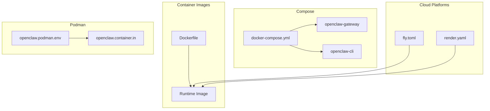
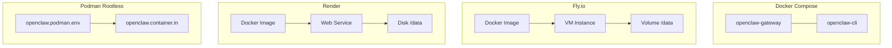
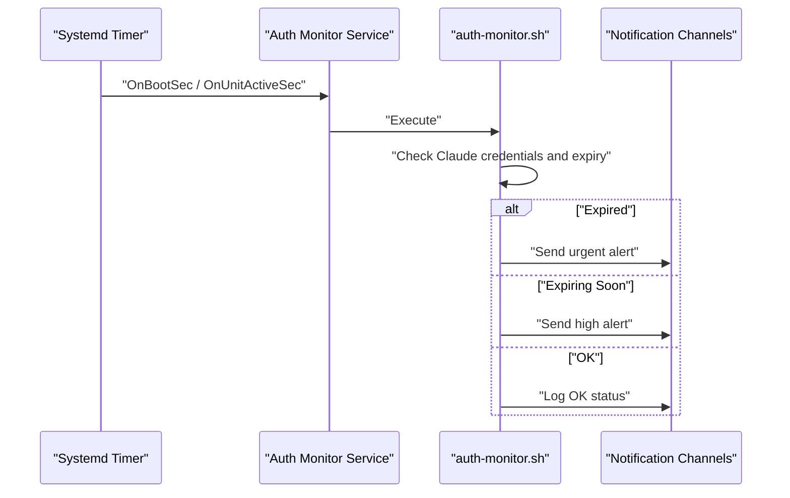
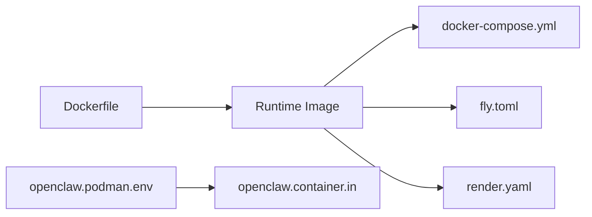

# Deployment & Operations

<cite>
**Referenced Files in This Document**
- [Dockerfile](file://Dockerfile)
- [docker-compose.yml](file://docker-compose.yml)
- [fly.toml](file://fly.toml)
- [render.yaml](file://render.yaml)
- [openclaw.podman.env](file://openclaw.podman.env)
- [scripts/podman/openclaw.container.in](file://scripts/podman/openclaw.container.in)
- [scripts/systemd/openclaw-auth-monitor.service](file://scripts/systemd/openclaw-auth-monitor.service)
- [scripts/systemd/openclaw-auth-monitor.timer](file://scripts/systemd/openclaw-auth-monitor.timer)
- [scripts/auth-monitor.sh](file://scripts/auth-monitor.sh)
- [docs/install/docker.md](file://docs/install/docker.md)
- [docs/install/fly.md](file://docs/install/fly.md)
- [docs/install/render.mdx](file://docs/install/render.mdx)
- [docs/install/podman.md](file://docs/install/podman.md)
</cite>

## Table of Contents
1. [Introduction](#introduction)
2. [Project Structure](#project-structure)
3. [Core Components](#core-components)
4. [Architecture Overview](#architecture-overview)
5. [Detailed Component Analysis](#detailed-component-analysis)
6. [Dependency Analysis](#dependency-analysis)
7. [Performance Considerations](#performance-considerations)
8. [Troubleshooting Guide](#troubleshooting-guide)
9. [Conclusion](#conclusion)
10. [Appendices](#appendices)

## Introduction
This document provides comprehensive deployment and operations guidance for OpenClaw in production environments. It covers containerization strategies, cloud platform deployments (Fly.io, Render), bare metal and Podman setups, monitoring and alerting, maintenance, scaling, capacity planning, backups, security hardening, and automation tooling. The goal is to enable reliable, observable, and maintainable operations across Docker, Kubernetes, cloud platforms, and bare metal installations.

## Project Structure
OpenClaw includes first-class deployment artifacts and documentation for multiple environments:
- Container images and runtime: Dockerfile and multi-stage build
- Docker Compose for local and containerized deployments
- Cloud platform configurations for Fly.io and Render
- Podman rootless deployment with systemd Quadlet
- Operational tooling for authentication monitoring and alerts
- Extensive installation and operations guides

**Diagram sources**
- [Dockerfile](file://Dockerfile#L1-L231)
- [docker-compose.yml](file://docker-compose.yml#L1-L77)
- [fly.toml](file://fly.toml#L1-L35)
- [render.yaml](file://render.yaml#L1-L22)
- [openclaw.podman.env](file://openclaw.podman.env#L1-L25)
- [scripts/podman/openclaw.container.in](file://scripts/podman/openclaw.container.in#L1-L29)

**Section sources**
- [Dockerfile](file://Dockerfile#L1-L231)
- [docker-compose.yml](file://docker-compose.yml#L1-L77)
- [fly.toml](file://fly.toml#L1-L35)
- [render.yaml](file://render.yaml#L1-L22)
- [openclaw.podman.env](file://openclaw.podman.env#L1-L25)
- [scripts/podman/openclaw.container.in](file://scripts/podman/openclaw.container.in#L1-L29)

## Core Components
- Container image: multi-stage build with Node.js base, optional system packages, Playwright browser, and Docker CLI for sandboxing
- Gateway service: binds loopback by default with health probes; configurable bind/port/token for external access
- CLI service: shares network with gateway, restricted capabilities, and TTY for interactive use
- Cloud platform configs: Fly.io and Render Blueprints define persistent storage, secrets, and health checks
- Podman rootless deployment: systemd Quadlet unit, environment-driven configuration, and optional sandbox support

Key operational capabilities:
- Health checks via /healthz and /readyz
- Token-based authentication for non-loopback binds
- Persistent state via mounted volumes
- Optional sandboxing for tool execution isolation

**Section sources**
- [Dockerfile](file://Dockerfile#L224-L231)
- [docker-compose.yml](file://docker-compose.yml#L28-L49)
- [fly.toml](file://fly.toml#L17-L35)
- [render.yaml](file://render.yaml#L6-L22)
- [openclaw.podman.env](file://openclaw.podman.env#L6-L25)

## Architecture Overview
OpenClaw supports several production-grade deployment patterns:

**Diagram sources**
- [docker-compose.yml](file://docker-compose.yml#L2-L37)
- [fly.toml](file://fly.toml#L7-L35)
- [render.yaml](file://render.yaml#L1-L22)
- [openclaw.podman.env](file://openclaw.podman.env#L1-L25)
- [scripts/podman/openclaw.container.in](file://scripts/podman/openclaw.container.in#L1-L29)

## Detailed Component Analysis

### Docker Deployment
- Build and runtime: multi-stage Dockerfile with Node.js base, optional system packages, Playwright, and Docker CLI for sandboxing
- Compose stack: gateway and CLI services with shared network, health checks, and persistent mounts
- Bind and token: default loopback bind; external access requires LAN bind and gateway token
- Sandbox: optional Docker socket mounting and Docker CLI support for agent sandboxing

Operational guidance:
- Use OPENCLAW_GATEWAY_TOKEN for non-loopback binds
- Persist state via bind mounts for config and workspace
- Enable sandboxing with optional Docker socket and CLI support

**Section sources**
- [Dockerfile](file://Dockerfile#L12-L231)
- [docker-compose.yml](file://docker-compose.yml#L1-L77)
- [docs/install/docker.md](file://docs/install/docker.md#L26-L84)

### Fly.io Deployment
- Platform: VM-based with persistent volumes, automatic HTTPS, and health checks
- Configuration: fly.toml defines build, env vars, process command, HTTP service, VM sizing, and mounts
- Secrets: OPENCLAW_GATEWAY_TOKEN and provider tokens stored as Fly secrets
- Private deployments: optional private-only IP with tunneling for webhooks

Operational guidance:
- Set OPENCLAW_STATE_DIR to /data and mount a volume
- Use --bind lan and OPENCLAW_GATEWAY_TOKEN for external access
- Scale vertically; horizontal scaling requires sticky sessions or external state

**Section sources**
- [fly.toml](file://fly.toml#L1-L35)
- [docs/install/fly.md](file://docs/install/fly.md#L14-L120)

### Render Deployment
- Platform: Infrastructure as Code via render.yaml Blueprint
- Configuration: runtime docker, health check path, env vars, and persistent disk
- Plans: Free (no persistent disk), Starter (persistent disk), Standard+ (horizontal scaling)
- Post-deploy: setup wizard, Control UI, logs, and shell access

Operational guidance:
- Ensure PORT aligns with container exposure
- Use Starter plan for persistent disk and state continuity
- Export configuration via /setup/export for backups

**Section sources**
- [render.yaml](file://render.yaml#L1-L22)
- [docs/install/render.mdx](file://docs/install/render.mdx#L1-L160)

### Podman Rootless Deployment
- Setup: one-time setup script creates user, builds image, and installs launch script
- Quadlet: optional systemd user service for auto-start and restarts
- Environment: OPENCLAW_GATEWAY_TOKEN and provider keys via environment file
- Storage: bind mounts for config and workspace; sandbox tmpfs ephemeral

Operational guidance:
- Use dedicated openclaw user with subuid/subgid ranges
- Adjust host ports and gateway bind via environment variables
- Monitor logs via journalctl for Quadlet or podman logs for script-based runs

**Section sources**
- [openclaw.podman.env](file://openclaw.podman.env#L1-L25)
- [scripts/podman/openclaw.container.in](file://scripts/podman/openclaw.container.in#L1-L29)
- [docs/install/podman.md](file://docs/install/podman.md#L1-L123)

### Monitoring, Logging, and Alerting
- Built-in health probes: /healthz (liveness) and /readyz (readiness) with Docker HEALTHCHECK
- Cloud platform monitoring: Fly.io and Render provide logs and dashboards
- Authentication expiry monitoring: systemd service and timer with periodic checks and notifications

**Diagram sources**
- [scripts/systemd/openclaw-auth-monitor.timer](file://scripts/systemd/openclaw-auth-monitor.timer#L1-L11)
- [scripts/systemd/openclaw-auth-monitor.service](file://scripts/systemd/openclaw-auth-monitor.service#L1-L15)
- [scripts/auth-monitor.sh](file://scripts/auth-monitor.sh#L1-L90)

**Section sources**
- [Dockerfile](file://Dockerfile#L224-L231)
- [scripts/systemd/openclaw-auth-monitor.service](file://scripts/systemd/openclaw-auth-monitor.service#L1-L15)
- [scripts/systemd/openclaw-auth-monitor.timer](file://scripts/systemd/openclaw-auth-monitor.timer#L1-L11)
- [scripts/auth-monitor.sh](file://scripts/auth-monitor.sh#L1-L90)

### Maintenance Procedures
- Apply updates by redeploying with new images or rebuilding locally
- Rotate tokens and secrets via platform-specific secret managers
- Backup configuration and workspace via export endpoints or persistent disk snapshots
- Prune sandbox containers and manage disk growth hotspots

**Section sources**
- [docs/install/fly.md](file://docs/install/fly.md#L328-L358)
- [docs/install/render.mdx](file://docs/install/render.mdx#L126-L135)

### Disaster Recovery
- Restore from exported configuration and workspace backups
- Recreate persistent volumes and re-attach to new instances
- Rehydrate state from Fly.io or Render disks as applicable

**Section sources**
- [docs/install/render.mdx](file://docs/install/render.mdx#L126-L135)
- [docs/install/fly.md](file://docs/install/fly.md#L322-L327)

### Performance Optimization, Scaling, and Capacity Planning
- Memory sizing: 2GB recommended for production stability
- Vertical scaling: increase VM/memory on Fly.io or upgrade Render plan
- Horizontal scaling: consider sticky sessions or external state for multiple replicas
- Disk planning: monitor media, sessions, transcripts, and logs; provision adequate volume sizes

**Section sources**
- [docs/install/fly.md](file://docs/install/fly.md#L259-L277)
- [docs/install/render.mdx](file://docs/install/render.mdx#L117-L125)

### Security Hardening and Compliance
- Non-root execution: container runs as non-root user to reduce attack surface
- Capability drops and no-new-privileges: compose CLI service restricts capabilities
- Token-based access: require OPENCLAW_GATEWAY_TOKEN for non-loopback binds
- Private deployments: Fly.io private-only IP with tunneling for webhooks
- Secrets management: store tokens as platform secrets; avoid embedding in config files

**Section sources**
- [Dockerfile](file://Dockerfile#L211-L214)
- [docker-compose.yml](file://docker-compose.yml#L54-L58)
- [docs/install/fly.md](file://docs/install/fly.md#L359-L474)

### Automation Scripts and Operational Tooling
- Auth expiry monitoring: systemd timer and service with notification channels
- Podman rootless setup: environment-driven configuration and Quadlet unit
- Docker Compose: streamlined onboarding and gateway lifecycle management

**Section sources**
- [scripts/systemd/openclaw-auth-monitor.service](file://scripts/systemd/openclaw-auth-monitor.service#L1-L15)
- [scripts/systemd/openclaw-auth-monitor.timer](file://scripts/systemd/openclaw-auth-monitor.timer#L1-L11)
- [scripts/auth-monitor.sh](file://scripts/auth-monitor.sh#L1-L90)
- [openclaw.podman.env](file://openclaw.podman.env#L1-L25)
- [scripts/podman/openclaw.container.in](file://scripts/podman/openclaw.container.in#L1-L29)

## Dependency Analysis
OpenClaw’s deployment stack exhibits clear separation of concerns:
- Container image encapsulates runtime, dependencies, and optional tooling
- Compose orchestrates gateway and CLI with health checks and persistence
- Cloud platform configs define compute, storage, and networking policies
- Podman rootless deployment leverages systemd and environment files

**Diagram sources**
- [Dockerfile](file://Dockerfile#L1-L231)
- [docker-compose.yml](file://docker-compose.yml#L1-L77)
- [fly.toml](file://fly.toml#L1-L35)
- [render.yaml](file://render.yaml#L1-L22)
- [openclaw.podman.env](file://openclaw.podman.env#L1-L25)
- [scripts/podman/openclaw.container.in](file://scripts/podman/openclaw.container.in#L1-L29)

**Section sources**
- [Dockerfile](file://Dockerfile#L1-L231)
- [docker-compose.yml](file://docker-compose.yml#L1-L77)
- [fly.toml](file://fly.toml#L1-L35)
- [render.yaml](file://render.yaml#L1-L22)
- [openclaw.podman.env](file://openclaw.podman.env#L1-L25)
- [scripts/podman/openclaw.container.in](file://scripts/podman/openclaw.container.in#L1-L29)

## Performance Considerations
- Prefer 2GB+ memory for production stability; adjust based on concurrent agents and channels
- Persist state to volumes to avoid repeated initialization overhead
- Use Fly.io or Render persistent disks to prevent data loss and improve reliability
- Monitor disk growth hotspots and provision adequate storage

[No sources needed since this section provides general guidance]

## Troubleshooting Guide
Common issues and resolutions:
- Health checks failing: verify internal_port matches gateway port and bind mode
- Memory issues: increase VM/memory or container resources
- Gateway lock issues: delete lock file on persistent disk and restart
- Config not being read: confirm OPENCLAW_STATE_DIR and file existence
- Sandbox setup: ensure Docker CLI is installed in image and socket permissions are correct
- Podman rootless: verify subuid/subgid ranges and Quadlet cgroups v2 support

**Section sources**
- [docs/install/fly.md](file://docs/install/fly.md#L245-L327)
- [docs/install/docker.md](file://docs/install/docker.md#L469-L538)
- [docs/install/podman.md](file://docs/install/podman.md#L111-L123)

## Conclusion
OpenClaw offers flexible, production-ready deployment options across Docker, cloud platforms, and Podman rootless environments. With robust health checks, token-based authentication, persistent storage, and operational tooling, teams can achieve reliable, observable, and maintainable operations. Follow the environment-specific guides, harden security posture, plan capacity carefully, and leverage automation scripts for efficient management.

[No sources needed since this section summarizes without analyzing specific files]

## Appendices
- Backup and restore: use export endpoints or persistent disk snapshots
- Runbooks: refer to environment-specific guides for onboarding, updates, and maintenance
- Compliance: store secrets securely, avoid exposing tokens, and use private deployments when required

[No sources needed since this section provides general guidance]